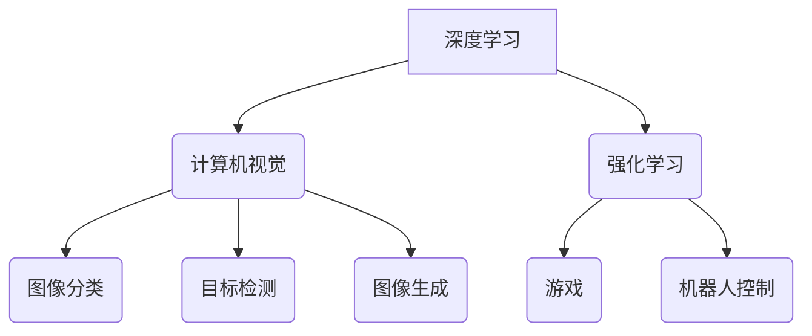

> 人工智能，深度学习，计算机视觉，自然语言处理，强化学习，Transformer，Generative AI，Andrej Karpathy

## 1. 背景介绍

人工智能（AI）正以惊人的速度发展，深刻地改变着我们生活的方方面面。从自动驾驶汽车到智能语音助手，从医疗诊断到金融交易，AI技术的应用日益广泛。在AI领域，Andrej Karpathy是一位享有盛誉的专家，他曾在OpenAI、Tesla和伯克利大学任职，并发表了许多重要的研究成果。他的工作对深度学习、计算机视觉和强化学习等领域产生了深远的影响。

本文将探讨Andrej Karpathy在AI领域的研究成果和对未来发展的展望，并分析其对人工智能发展的影响。

## 2. 核心概念与联系

Andrej Karpathy的研究主要集中在深度学习、计算机视觉和强化学习等领域。

**2.1 深度学习**

深度学习是一种机器学习的子领域，它利用多层神经网络来模拟人类大脑的学习过程。深度学习算法能够从海量数据中自动提取特征，并进行复杂的模式识别和预测。

**2.2 计算机视觉**

计算机视觉是让计算机“看”和理解图像和视频的技术。Andrej Karpathy在计算机视觉领域做出了重要贡献，例如开发了用于图像分类、目标检测和图像生成的神经网络模型。

**2.3 强化学习**

强化学习是一种机器学习的范式，它通过奖励和惩罚机制来训练智能体，使其在特定环境中做出最优决策。Andrej Karpathy的研究成果在强化学习领域也取得了突破，例如开发了用于游戏和机器人控制的强化学习算法。

**2.4 核心概念联系**

深度学习、计算机视觉和强化学习是人工智能领域的核心概念，它们相互关联，共同推动着人工智能的发展。



## 3. 核心算法原理 & 具体操作步骤

### 3.1 算法原理概述

Andrej Karpathy的研究成果涵盖了许多重要的算法，例如卷积神经网络（CNN）、循环神经网络（RNN）和Transformer。

**3.1.1 卷积神经网络（CNN）**

CNN是一种专门用于处理图像数据的深度学习算法。它利用卷积操作来提取图像特征，并通过多个卷积层和池化层来逐步提高特征的抽象程度。

**3.1.2 循环神经网络（RNN）**

RNN是一种专门用于处理序列数据的深度学习算法。它具有循环连接，能够记住之前的信息，从而处理具有时间依赖性的数据，例如文本和语音。

**3.1.3 Transformer**

Transformer是一种新型的深度学习架构，它利用注意力机制来处理序列数据，并能够并行处理大量数据。Transformer在自然语言处理领域取得了突破性的进展，例如机器翻译和文本生成。

### 3.2 算法步骤详解

**3.2.1 CNN 算法步骤**

1. **输入图像数据**
2. **卷积层：**使用卷积核对图像进行卷积操作，提取图像特征。
3. **池化层：**对卷积层的输出进行池化操作，降低数据维度，提高计算效率。
4. **全连接层：**将池化层的输出连接到全连接层，进行分类或回归。

**3.2.2 RNN 算法步骤**

1. **输入序列数据**
2. **循环层：**将每个时间步的输入数据与隐藏状态进行结合，更新隐藏状态。
3. **输出层：**根据隐藏状态输出预测结果。

**3.2.3 Transformer 算法步骤**

1. **输入序列数据**
2. **编码器：**利用多层Transformer编码器对输入序列进行编码，提取语义信息。
3. **解码器：**利用多层Transformer解码器对编码后的信息进行解码，生成输出序列。

### 3.3 算法优缺点

**3.3.1 CNN 优缺点**

* **优点：**
    * 能够有效地提取图像特征。
    * 计算效率高。
* **缺点：**
    * 对数据类型限制较多，主要用于图像数据。
    * 难以处理长序列数据。

**3.3.2 RNN 优缺点**

* **优点：**
    * 能够处理具有时间依赖性的数据。
    * 能够学习长序列数据中的依赖关系。
* **缺点：**
    * 计算效率低，难以处理长序列数据。
    * 容易出现梯度消失或梯度爆炸问题。

**3.3.3 Transformer 优缺点**

* **优点：**
    * 计算效率高，能够并行处理大量数据。
    * 能够处理长序列数据。
    * 能够学习复杂的语义关系。
* **缺点：**
    * 参数量大，训练成本高。

### 3.4 算法应用领域

**3.4.1 CNN 应用领域**

* 图像分类
* 目标检测
* 图像分割
* 人脸识别

**3.4.2 RNN 应用领域**

* 自然语言处理
* 语音识别
* 机器翻译
* 文本生成

**3.4.3 Transformer 应用领域**

* 自然语言处理
* 机器翻译
* 文本生成
* 代码生成

## 4. 数学模型和公式 & 详细讲解 & 举例说明

### 4.1 数学模型构建

深度学习算法的数学模型主要基于神经网络，神经网络由多个层组成，每一层包含多个神经元。每个神经元接收来自上一层的输入信号，并通过激活函数进行处理，输出到下一层。

### 4.2 公式推导过程

**4.2.1 激活函数**

激活函数是神经网络中一个重要的组成部分，它决定了神经元的输出。常见的激活函数包括 sigmoid 函数、ReLU 函数和 softmax 函数。

* **sigmoid 函数：**

$$
f(x) = \frac{1}{1 + e^{-x}}
$$

* **ReLU 函数：**

$$
f(x) = max(0, x)
$$

* **softmax 函数：**

$$
f(x_i) = \frac{e^{x_i}}{\sum_{j=1}^{n} e^{x_j}}
$$

**4.2.2 损失函数**

损失函数用于衡量模型的预测结果与真实值的差异。常见的损失函数包括均方误差（MSE）和交叉熵损失（Cross-Entropy Loss）。

* **均方误差（MSE）：**

$$
L = \frac{1}{n} \sum_{i=1}^{n} (y_i - \hat{y}_i)^2
$$

* **交叉熵损失（Cross-Entropy Loss）：**

$$
L = - \sum_{i=1}^{n} y_i \log(\hat{y}_i)
$$

### 4.3 案例分析与讲解

**4.3.1 图像分类案例**

假设我们使用 CNN 模型进行图像分类，目标是将图像分类为猫或狗。

* **输入数据：**一张猫或狗的图像。
* **模型结构：**一个包含卷积层、池化层和全连接层的 CNN 模型。
* **训练过程：**使用训练数据训练模型，并使用损失函数和优化算法（例如梯度下降）来更新模型参数。
* **预测过程：**将测试图像输入到训练好的模型中，模型会输出预测结果，例如“猫”或“狗”。

## 5. 项目实践：代码实例和详细解释说明

### 5.1 开发环境搭建

* **操作系统：**Linux 或 macOS
* **编程语言：**Python
* **深度学习框架：**TensorFlow 或 PyTorch
* **其他工具：**Git、Jupyter Notebook

### 5.2 源代码详细实现

```python
# 使用 TensorFlow 实现一个简单的 CNN 模型

import tensorflow as tf

# 定义模型结构
model = tf.keras.models.Sequential([
    tf.keras.layers.Conv2D(32, (3, 3), activation='relu', input_shape=(28, 28, 1)),
    tf.keras.layers.MaxPooling2D((2, 2)),
    tf.keras.layers.Conv2D(64, (3, 3), activation='relu'),
    tf.keras.layers.MaxPooling2D((2, 2)),
    tf.keras.layers.Flatten(),
    tf.keras.layers.Dense(10, activation='softmax')
])

# 编译模型
model.compile(optimizer='adam',
              loss='sparse_categorical_crossentropy',
              metrics=['accuracy'])

# 训练模型
model.fit(x_train, y_train, epochs=5)

# 评估模型
loss, accuracy = model.evaluate(x_test, y_test)
print('Test loss:', loss)
print('Test accuracy:', accuracy)
```

### 5.3 代码解读与分析

* **模型结构：**该代码定义了一个简单的 CNN 模型，包含两个卷积层、两个池化层和一个全连接层。
* **激活函数：**模型中使用 ReLU 作为激活函数。
* **损失函数：**模型使用交叉熵损失函数。
* **优化算法：**模型使用 Adam 优化算法。
* **训练过程：**模型使用训练数据进行训练，并使用验证数据进行评估。

### 5.4 运行结果展示

训练完成后，模型会输出测试集上的损失值和准确率。

## 6. 实际应用场景

### 6.1 医疗诊断

* **图像分析：**使用 CNN 模型分析医学图像，例如 X 光片、CT 扫描和 MRI 图像，辅助医生诊断疾病。
* **病理学：**使用深度学习模型分析病理切片，辅助医生诊断癌症和其他疾病。

### 6.2 金融交易

* **欺诈检测：**使用机器学习模型检测金融交易中的欺诈行为。
* **风险评估：**使用深度学习模型评估客户的信用风险。

### 6.3 自动驾驶

* **目标检测：**使用 CNN 模型检测道路上的车辆、行人和其他物体。
* **路径规划：**使用强化学习算法训练自动驾驶汽车进行路径规划。

### 6.4 未来应用展望

* **个性化教育：**使用 AI 技术提供个性化的学习体验。
* **智能家居：**使用 AI 技术打造更加智能的家居环境。
* **医疗保健：**使用 AI 技术提高医疗诊断和治疗的效率。

## 7. 工具和资源推荐

### 7.1 学习资源推荐

* **书籍：**
    * Deep Learning by Ian Goodfellow, Yoshua Bengio, and Aaron Courville
    * Hands-On Machine Learning with Scikit-Learn, Keras & TensorFlow by Aurélien Géron
* **在线课程：**
    * Coursera: Deep Learning Specialization by Andrew Ng
    * Udacity: Deep Learning Nanodegree
* **博客和网站：**
    * Towards Data Science
    * Machine Learning Mastery

### 7.2 开发工具推荐

* **深度学习框架：**TensorFlow, PyTorch, Keras
* **编程语言：**Python
* **数据处理工具：**Pandas, NumPy
* **可视化工具：**Matplotlib, Seaborn

### 7.3 相关论文推荐

* **Attention Is All You Need** (Vaswani et al., 2017)
* **ImageNet Classification with Deep Convolutional Neural Networks** (Krizhevsky et al., 2012)
* **Deep Residual Learning for Image Recognition** (He et al., 2015)

## 8. 总结：未来发展趋势与挑战

### 8.1 研究成果总结

Andrej Karpathy的研究成果对深度学习、计算机视觉和强化学习等领域产生了深远的影响。他的工作推动了人工智能技术的进步，并