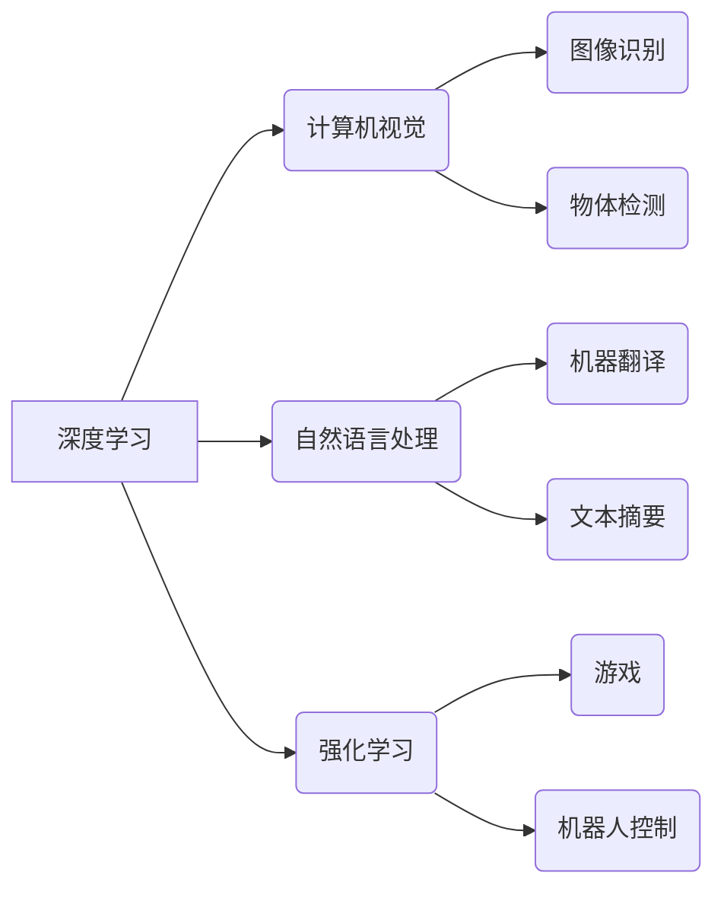

> 人工智能，深度学习，计算机视觉，自然语言处理，强化学习，伦理，可解释性，未来趋势

## 1. 背景介绍

人工智能（AI）正以惊人的速度发展，从自动驾驶到医疗诊断，AI正在改变着我们生活的方方面面。作为AI领域的领军人物，Andrej Karpathy 始终关注着AI技术的未来发展方向，并提出了许多具有远见卓识的观点。本文将探讨Karpathy关于AI未来发展目标的见解，并分析其背后的核心概念、算法原理、应用场景以及面临的挑战。

## 2. 核心概念与联系

Karpathy认为，AI未来的发展将围绕以下几个核心概念展开：

* **深度学习:** 深度学习是目前AI领域最成功的技术之一，它能够从海量数据中学习复杂的模式和特征。
* **计算机视觉:** 计算机视觉是让计算机“看”世界的能力，它在图像识别、物体检测、场景理解等领域有着广泛的应用。
* **自然语言处理:** 自然语言处理是让计算机理解和生成人类语言的能力，它在机器翻译、文本摘要、对话系统等领域有着重要的应用。
* **强化学习:** 强化学习是让计算机通过与环境交互学习的算法，它能够解决许多复杂的任务，例如游戏、机器人控制等。

这些核心概念相互关联，共同推动着AI技术的进步。

**Mermaid 流程图:**

## 3. 核心算法原理 & 具体操作步骤

### 3.1  算法原理概述

深度学习的核心算法是人工神经网络（ANN）。ANN由多个层组成，每层包含多个神经元。每个神经元接收来自上一层的输入，并通过权重进行加权求和，然后经过激活函数进行非线性变换，最后输出到下一层。通过训练，ANN能够学习到输入和输出之间的映射关系。

### 3.2  算法步骤详解

1. **数据预处理:** 将原始数据转换为模型可以理解的格式，例如归一化、编码等。
2. **网络结构设计:** 根据任务需求设计神经网络的层数、神经元数量、激活函数等参数。
3. **权重初始化:** 为神经网络的权重赋予初始值。
4. **前向传播:** 将输入数据通过网络层层传递，计算输出结果。
5. **损失函数计算:** 计算模型输出与真实值的差异，即损失值。
6. **反向传播:** 根据损失值，调整网络权重，使模型输出更接近真实值。
7. **迭代训练:** 重复前向传播和反向传播的过程，直到损失值达到预设阈值。

### 3.3  算法优缺点

**优点:**

* 能够学习复杂的非线性关系。
* 具有强大的泛化能力。
* 在图像识别、自然语言处理等领域取得了突破性进展。

**缺点:**

* 需要大量的训练数据。
* 训练过程耗时且资源消耗大。
* 模型的可解释性较差。

### 3.4  算法应用领域

深度学习算法广泛应用于以下领域：

* **计算机视觉:** 图像识别、物体检测、场景理解、图像生成等。
* **自然语言处理:** 机器翻译、文本摘要、情感分析、对话系统等。
* **语音识别:** 语音转文本、语音合成等。
* **推荐系统:** 商品推荐、内容推荐等。
* **医疗诊断:** 疾病诊断、影像分析等。

## 4. 数学模型和公式 & 详细讲解 & 举例说明

### 4.1  数学模型构建

深度学习模型的核心是神经网络，其数学模型可以表示为一系列的矩阵运算和激活函数。

**输入层:**

$$
x = [x_1, x_2, ..., x_n]
$$

**隐藏层:**

$$
h = f(W_1x + b_1)
$$

**输出层:**

$$
y = f(W_2h + b_2)
$$

其中:

* $x$ 是输入向量。
* $h$ 是隐藏层输出向量。
* $y$ 是输出向量。
* $W_1$ 和 $W_2$ 是权重矩阵。
* $b_1$ 和 $b_2$ 是偏置向量。
* $f$ 是激活函数。

### 4.2  公式推导过程

损失函数用于衡量模型预测结果与真实值的差异。常用的损失函数包括均方误差（MSE）和交叉熵损失（Cross-Entropy Loss）。

**均方误差:**

$$
L = \frac{1}{n}\sum_{i=1}^{n}(y_i - \hat{y}_i)^2
$$

**交叉熵损失:**

$$
L = -\frac{1}{n}\sum_{i=1}^{n}y_i\log(\hat{y}_i)
$$

其中:

* $y_i$ 是真实值。
* $\hat{y}_i$ 是模型预测值。

通过反向传播算法，可以计算出每个权重和偏置的梯度，并根据梯度更新权重和偏置，从而最小化损失函数。

### 4.3  案例分析与讲解

例如，在图像分类任务中，我们可以使用卷积神经网络（CNN）作为模型。CNN能够学习图像的特征，并将其分类到不同的类别。

## 5. 项目实践：代码实例和详细解释说明

### 5.1  开发环境搭建

使用Python语言和深度学习框架TensorFlow或PyTorch搭建开发环境。

### 5.2  源代码详细实现

使用TensorFlow或PyTorch框架实现一个简单的图像分类模型，例如MNIST手写数字识别。

### 5.3  代码解读与分析

解释代码中使用的函数、类和参数，以及模型的训练和测试过程。

### 5.4  运行结果展示

展示模型的训练曲线和测试准确率，并展示模型对新数据的预测结果。

## 6. 实际应用场景

### 6.1  医疗诊断

AI可以辅助医生进行疾病诊断，例如识别X光片上的肺结核、乳腺癌等。

### 6.2  金融风险控制

AI可以分析金融数据，识别潜在的欺诈行为和风险。

### 6.3  自动驾驶

AI可以帮助车辆感知周围环境，并做出驾驶决策。

### 6.4  未来应用展望

AI技术将继续发展，并在更多领域得到应用，例如个性化教育、智能家居、精准农业等。

## 7. 工具和资源推荐

### 7.1  学习资源推荐

* **书籍:**
    * 深度学习
    * 人工智能：一个现代方法
* **在线课程:**
    * Coursera深度学习课程
    * Udacity人工智能课程

### 7.2  开发工具推荐

* **TensorFlow:** 开源深度学习框架
* **PyTorch:** 开源深度学习框架
* **Keras:** 高级深度学习API

### 7.3  相关论文推荐

* **ImageNet Classification with Deep Convolutional Neural Networks**
* **Attention Is All You Need**
* **Deep Reinforcement Learning**

## 8. 总结：未来发展趋势与挑战

### 8.1  研究成果总结

AI技术取得了显著的进展，在计算机视觉、自然语言处理等领域取得了突破性成果。

### 8.2  未来发展趋势

* **模型规模和复杂度提升:** 模型参数数量将继续增加，模型结构将更加复杂。
* **数据驱动的AI:** 数据将成为AI发展的关键要素，数据质量和数据量将不断提升。
* **边缘计算和联邦学习:** AI模型将部署到边缘设备，并通过联邦学习的方式进行训练。
* **AI伦理和可解释性:** AI技术的伦理问题和可解释性将成为研究的重点。

### 8.3  面临的挑战

* **数据获取和隐私保护:** 获取高质量数据和保护用户隐私是AI发展的挑战。
* **模型可解释性和信任度:** AI模型的决策过程难以解释，这会影响用户的信任度。
* **算法偏见和公平性:** AI算法可能存在偏见，导致不公平的结果。

### 8.4  研究展望

未来，AI研究将更加注重模型的可解释性、公平性和安全性，并探索AI与人类的协同工作模式。

## 9. 附录：常见问题与解答

**常见问题:**

* 什么是深度学习？
* 深度学习有哪些应用场景？
* 如何搭建深度学习开发环境？
* 如何训练一个深度学习模型？

**解答:**

* 深度学习是一种机器学习方法，它使用多层神经网络来学习复杂的模式和特征。
* 深度学习应用于图像识别、自然语言处理、语音识别、推荐系统等领域。
* 深度学习开发环境可以使用Python语言和深度学习框架TensorFlow或PyTorch搭建。
* 训练深度学习模型需要准备数据、设计模型、训练模型、评估模型和调优模型。

作者：禅与计算机程序设计艺术 / Zen and the Art of Computer Programming 
<end_of_turn>