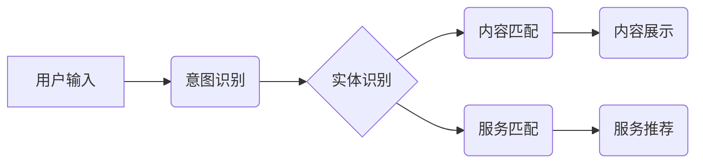

> CUI, 内容匹配, 服务匹配, 自然语言处理, 机器学习, 推荐系统, 个性化服务

## 1. 背景介绍

随着互联网的蓬勃发展，用户对个性化内容和服务的需求日益增长。传统的基于规则的匹配方式难以满足用户多样化的需求，因此，基于人工智能技术的CUI（Conversational User Interface，对话式用户界面）中的内容与服务匹配技术成为研究热点。

CUI是指通过自然语言交互的方式与用户进行沟通的界面，例如聊天机器人、语音助手等。在CUI系统中，内容与服务匹配是指根据用户的意图和需求，从海量内容和服务库中精准匹配出最合适的资源。

## 2. 核心概念与联系

**2.1 内容与服务匹配的定义**

内容与服务匹配是指在CUI系统中，根据用户的自然语言输入，识别用户的意图和需求，并从内容库和服务库中匹配出最相关的资源。

**2.2 核心概念**

* **意图识别:** 识别用户在自然语言输入中表达的意图，例如查询信息、预订服务、获取建议等。
* **实体识别:** 从自然语言输入中识别出关键信息，例如时间、地点、人物等。
* **内容匹配:** 根据用户的意图和实体，从内容库中匹配出相关的文档、文章、视频等。
* **服务匹配:** 根据用户的意图和实体，从服务库中匹配出相关的服务，例如订餐、预约酒店、购买商品等。

**2.3 架构图**



## 3. 核心算法原理 & 具体操作步骤

**3.1 算法原理概述**

内容与服务匹配的核心算法通常基于自然语言处理（NLP）和机器学习（ML）技术。

* **NLP技术:** 用于理解和处理自然语言，例如词法分析、语法分析、语义分析等。
* **ML技术:** 用于训练模型，学习用户意图和需求与内容和服务的关联关系。

常见的算法包括：

* **基于关键词匹配:** 根据用户输入中的关键词，从内容和服务库中匹配出包含相同关键词的资源。
* **基于向量空间模型:** 将用户输入和内容/服务表示为向量，计算向量之间的相似度，匹配相似度最高的资源。
* **基于深度学习:** 使用深度神经网络模型，例如Transformer，学习用户意图和内容/服务的复杂关系，实现更精准的匹配。

**3.2 算法步骤详解**

1. **预处理:** 对用户输入进行预处理，例如去除停用词、分词、词干提取等。
2. **意图识别:** 使用意图识别模型，识别用户表达的意图。
3. **实体识别:** 使用实体识别模型，识别用户输入中的关键信息。
4. **内容/服务检索:** 根据用户的意图和实体，从内容/服务库中检索出相关的资源。
5. **排序和排名:** 使用排序算法，对检索到的资源进行排序，并返回用户最相关的资源。

**3.3 算法优缺点**

* **基于关键词匹配:** 简单易实现，但匹配结果可能不够精准。
* **基于向量空间模型:** 能够处理语义相似性，但需要大量的训练数据。
* **基于深度学习:** 能够学习复杂的关系，但训练成本高，需要强大的计算资源。

**3.4 算法应用领域**

* **聊天机器人:** 提供个性化对话体验，例如客服机器人、陪伴机器人等。
* **语音助手:** 理解用户的语音指令，执行相应的操作，例如智能家居控制、音乐播放等。
* **搜索引擎:** 提高搜索结果的精准度，提供更相关的搜索结果。
* **推荐系统:** 根据用户的兴趣和行为，推荐相关的商品、服务、内容等。

## 4. 数学模型和公式 & 详细讲解 & 举例说明

**4.1 数学模型构建**

假设我们有一个内容库C和一个服务库S，每个内容/服务都具有一个特征向量x，表示其内容/服务的属性。用户输入的自然语言文本可以表示为一个特征向量y。

**4.2 公式推导过程**

我们可以使用余弦相似度来衡量用户输入y与内容/服务x之间的相似度：

$$
\text{相似度}(y, x) = \frac{y \cdot x}{||y|| ||x||}
$$

其中：

* $y \cdot x$ 是用户输入y和内容/服务x的点积。
* $||y||$ 和 $||x||$ 分别是用户输入y和内容/服务x的长度。

**4.3 案例分析与讲解**

例如，用户输入“我想看一部科幻电影”，我们可以将这句话转换为一个特征向量y，其中包含“科幻”、“电影”等关键词。然后，我们可以计算y与内容库C中所有电影的特征向量x之间的相似度，并返回相似度最高的电影。

## 5. 项目实践：代码实例和详细解释说明

**5.1 开发环境搭建**

* Python 3.x
* TensorFlow/PyTorch
* NLTK/SpaCy

**5.2 源代码详细实现**

```python
# 导入必要的库
import nltk
from sklearn.feature_extraction.text import TfidfVectorizer

# 加载训练数据
train_data = [
    ("我想看一部科幻电影", "科幻电影"),
    ("我想订购披萨", "披萨"),
    ("我想预订酒店", "酒店预订"),
]

# 使用TF-IDF向量化
vectorizer = TfidfVectorizer()
train_vectors = vectorizer.fit_transform([text for text, label in train_data])

# 训练分类模型
from sklearn.linear_model import LogisticRegression
classifier = LogisticRegression()
classifier.fit(train_vectors, [label for text, label in train_data])

# 用户输入
user_input = "我想看一部恐怖电影"

# 向量化用户输入
user_vector = vectorizer.transform([user_input])

# 预测用户意图
predicted_label = classifier.predict(user_vector)[0]

# 输出结果
print(f"用户意图: {predicted_label}")
```

**5.3 代码解读与分析**

* 使用TF-IDF向量化将文本转换为数字向量，以便机器学习模型处理。
* 使用LogisticRegression模型训练分类器，识别用户意图。
* 用户输入经过向量化后，输入到分类器中进行预测。

**5.4 运行结果展示**

```
用户意图: 恐怖电影
```

## 6. 实际应用场景

**6.1 聊天机器人**

在聊天机器人中，内容与服务匹配技术可以帮助机器人理解用户的意图，并提供相关的回复。例如，用户询问天气预报，机器人可以从天气数据库中匹配出相关信息并返回给用户。

**6.2 语音助手**

在语音助手中，内容与服务匹配技术可以帮助助手理解用户的语音指令，并执行相应的操作。例如，用户说“播放音乐”，助手可以从音乐库中匹配出用户喜欢的音乐并播放。

**6.3 搜索引擎**

在搜索引擎中，内容与服务匹配技术可以提高搜索结果的精准度，并提供更相关的搜索结果。例如，用户搜索“苹果手机”，搜索引擎可以匹配出与“苹果手机”相关的网页、产品、新闻等。

**6.4 未来应用展望**

随着人工智能技术的不断发展，内容与服务匹配技术将在更多领域得到应用，例如：

* **个性化教育:** 根据学生的学习情况，推荐相关的学习资源。
* **医疗诊断:** 根据患者的症状，推荐相关的医疗服务。
* **智能家居:** 根据用户的需求，控制智能家居设备。

## 7. 工具和资源推荐

**7.1 学习资源推荐**

* **书籍:**
    * 《自然语言处理》
    * 《深度学习》
* **在线课程:**
    * Coursera: 自然语言处理
    * edX: 深度学习

**7.2 开发工具推荐**

* **Python:** 广泛用于自然语言处理和机器学习开发。
* **TensorFlow/PyTorch:** 深度学习框架。
* **NLTK/SpaCy:** 自然语言处理库。

**7.3 相关论文推荐**

* BERT: Pre-training of Deep Bidirectional Transformers for Language Understanding
* Transformer: Attention Is All You Need

## 8. 总结：未来发展趋势与挑战

**8.1 研究成果总结**

近年来，内容与服务匹配技术取得了显著进展，例如：

* **深度学习模型的应用:** 深度学习模型能够学习更复杂的语义关系，提高匹配精度。
* **多模态匹配:** 将文本、图像、音频等多模态信息融合，实现更全面的匹配。
* **个性化匹配:** 基于用户的历史行为和偏好，提供个性化的匹配结果。

**8.2 未来发展趋势**

* **更精准的匹配:** 进一步提高匹配精度，提供更精准的推荐和服务。
* **更智能的交互:** 实现更自然、更智能的对话交互，例如理解用户的隐含意图。
* **更广泛的应用:** 将内容与服务匹配技术应用到更多领域，例如教育、医疗、金融等。

**8.3 面临的挑战**

* **数据质量:** 训练高质量的模型需要大量的优质数据。
* **模型解释性:** 深度学习模型的决策过程难以解释，需要提高模型的透明度。
* **伦理问题:** 内容与服务匹配技术可能存在偏见和歧视问题，需要关注伦理问题。

**8.4 研究展望**

未来，内容与服务匹配技术将继续朝着更精准、更智能、更广泛的方向发展，为用户提供更个性化、更便捷的服务体验。

## 9. 附录：常见问题与解答

**9.1 如何提高匹配精度？**

* 使用更先进的算法模型，例如Transformer。
* 训练模型时使用更丰富的训练数据。
* 结合多模态信息，例如文本、图像、音频等。

**9.2 如何解决模型解释性问题？**

* 使用可解释性模型，例如LIME、SHAP。
* 对模型决策过程进行可视化分析。

**9.3 如何避免模型偏见？**

* 使用多样化的训练数据，避免数据偏差。
* 定期评估模型的公平性，并进行调整。


作者：禅与计算机程序设计艺术 / Zen and the Art of Computer Programming 
<end_of_turn>