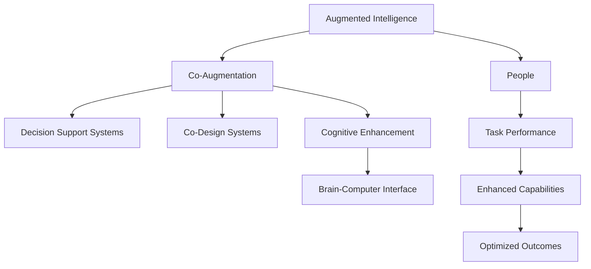

                 

# 增强智能：人机协同，拓展人类认知新领域

> 关键词：增强智能，人机协同，认知拓展，深度学习，AI辅助决策，智能辅助设计，认知增强，脑机接口

## 1. 背景介绍

### 1.1 问题由来
近年来，人工智能(AI)技术的迅猛发展，特别是深度学习、神经网络、自然语言处理(NLP)、计算机视觉(CV)等领域的突破，让人类得以以前所未有的方式探索和拓展认知领域。然而，由于人类自身认知能力的限制，许多复杂问题仍难以解答，如量子物理、宇宙起源、生命演化、人类意识等，亟需借助先进的技术工具。增强智能(Augmented Intelligence, AI)作为一种新型智能技术，通过将AI技术与人类认知能力进行深度融合，帮助人类更高效地解答复杂问题，成为未来科学研究和社会进步的关键。

### 1.2 问题核心关键点
增强智能的本质是将人类认知与AI技术的优势互补，通过人机协同，共同解决人类面临的各种难题。其核心思想是：
- **增强认知能力**：AI系统能够扩展人类感知、记忆、推理、决策等方面的认知能力，使其具备更强的数据分析、模式识别、逻辑推理、情感理解等能力。
- **智能辅助决策**：利用AI的强大计算能力和数据处理能力，辅助人类进行决策分析，优化决策过程，减少主观偏见，提升决策的科学性和客观性。
- **智能辅助设计**：AI系统能够协助人类进行设计创新，如产品设计、建筑规划、艺术创作等，提供创意灵感、设计优化和性能评估，提升设计效率和质量。
- **认知增强**：通过AI系统对人类感知、学习、记忆、思维等认知过程的辅助，增强人类的认知功能，如通过智能阅读器提高阅读效率、智能辅导系统辅助学习、脑机接口技术增强认知能力等。

### 1.3 问题研究意义
增强智能技术的发展，对于拓展人类认知新领域、推动科学研究、加速社会进步具有重要意义：
- **科学探索**：AI可以协助科学家进行数据分析、模型构建、实验设计等，加速科学发现，解决人类无法直接解决的问题。
- **产业升级**：通过增强智能技术，提升各行业的智能化水平，提高生产效率，优化资源配置，驱动经济增长。
- **社会管理**：智能辅助决策系统在公共安全、环境保护、城市管理等方面发挥作用，提升社会治理能力，保障公共利益。
- **个人成长**：通过智能辅助学习系统、认知增强工具等，帮助个人提升学习能力、工作效率和生活质量，实现全面发展。

## 2. 核心概念与联系

### 2.1 核心概念概述

增强智能技术涉及多个关键概念，它们共同构成了增强智能的完整框架：

- **增强智能(Augmented Intelligence, AI)**：一种新型智能技术，通过AI技术与人类认知能力的深度融合，扩展人类认知能力，提升人类决策、设计和创作能力。
- **人机协同(Co-Augmentation, Co-Design)**：指人类与AI系统共同完成复杂任务的过程，通过协同优化，实现任务最优解。
- **认知增强(Cognitive Enhancement)**：通过AI技术辅助人类感知、学习、记忆、思维等认知过程，提升认知能力。
- **智能辅助决策(Decision Support Systems, DSS)**：利用AI系统对复杂决策过程进行辅助，提供数据支持、模型分析、风险评估等，优化决策方案。
- **智能辅助设计(Co-Design Systems, CDSS)**：通过AI技术协助人类进行设计创新，提供创意灵感、设计优化和性能评估，提升设计效率和质量。
- **脑机接口(Brain-Computer Interface, BCI)**：一种新兴技术，通过直接将人类大脑信号转换为计算机指令，实现人机交互，增强认知功能。

这些核心概念之间的逻辑关系可以通过以下Mermaid流程图来展示：



这个流程图展示了大语言模型微调的核心概念及其之间的关系：

1. 增强智能将AI技术与人类认知能力进行深度融合。
2. 人机协同通过协同优化，实现任务最优解。
3. 认知增强通过AI技术辅助人类认知过程，提升认知能力。
4. 智能辅助决策利用AI系统对复杂决策过程进行辅助。
5. 智能辅助设计通过AI技术协助人类进行设计创新。
6. 脑机接口通过直接将人类大脑信号转换为计算机指令，增强认知功能。
7. 最终提升人类的任务性能和决策质量。

## 3. 核心算法原理 & 具体操作步骤

### 3.1 算法原理概述

增强智能的实现原理，可以归纳为以下几个步骤：
1. **数据收集与预处理**：收集与任务相关的数据，进行数据清洗和预处理，确保数据的质量和多样性。
2. **模型训练与优化**：选择合适的AI模型，如深度神经网络、决策树、贝叶斯网络等，在大量标注数据上训练模型，通过反向传播等优化算法调整模型参数。
3. **模型融合与集成**：将多个AI模型进行融合，集成不同模型的优点，提高整体的决策精度和鲁棒性。
4. **知识迁移与泛化**：通过迁移学习、少样本学习等技术，将模型学到的知识迁移到新的任务和领域，实现泛化。
5. **人机交互与协同**：构建友好的用户界面，实现人机协同，辅助用户完成复杂任务。
6. **认知增强与反馈**：利用AI技术辅助人类认知过程，通过反馈机制不断优化AI系统。

### 3.2 算法步骤详解

以下详细介绍增强智能的核心算法步骤：

**Step 1: 数据收集与预处理**
- 收集与任务相关的数据，确保数据质量和多样性。
- 清洗数据，去除噪声和异常值。
- 进行数据增强，扩充数据集，提高模型泛化能力。

**Step 2: 模型训练与优化**
- 选择合适的AI模型，如深度神经网络、决策树、贝叶斯网络等。
- 在大量标注数据上训练模型，通过反向传播等优化算法调整模型参数。
- 应用正则化技术，如L2正则、Dropout、Early Stopping等，防止过拟合。
- 使用交叉验证等技术评估模型性能，选择最优模型。

**Step 3: 模型融合与集成**
- 将多个AI模型进行融合，如模型堆叠、集成学习等，提高整体的决策精度和鲁棒性。
- 应用模型集成技术，如Bagging、Boosting、Stacking等，综合不同模型的预测结果。
- 设计高效的元算法，优化模型融合过程，提高决策效率。

**Step 4: 知识迁移与泛化**
- 通过迁移学习、少样本学习等技术，将模型学到的知识迁移到新的任务和领域。
- 使用领域自适应技术，如实例归一化、域随机化等，提高模型的泛化能力。
- 应用对抗训练等技术，提高模型的鲁棒性和安全性。

**Step 5: 人机交互与协同**
- 构建友好的用户界面，实现人机协同，辅助用户完成复杂任务。
- 利用自然语言处理(NLP)技术，实现智能对话系统，提供用户友好的交互方式。
- 使用可视化工具，展示复杂数据分析结果，帮助用户理解和决策。

**Step 6: 认知增强与反馈**
- 利用AI技术辅助人类认知过程，提升认知能力。
- 通过反馈机制，不断优化AI系统，提升系统的智能化水平。

### 3.3 算法优缺点

增强智能技术具有以下优点：
1. **高效性**：通过AI技术与人类认知能力的深度融合，提升任务完成效率。
2. **精度高**：利用AI的强大计算能力和数据处理能力，提高决策精度。
3. **鲁棒性**：通过多模型融合和对抗训练等技术，提高系统的鲁棒性和抗干扰能力。
4. **人机协同**：通过友好的用户界面，实现人机协同，提升用户体验。

同时，增强智能技术也存在一定的局限性：
1. **数据依赖**：增强智能技术依赖高质量、大规模的标注数据，数据获取成本较高。
2. **模型复杂**：大规模、复杂模型的训练和优化，需要高性能计算资源和专业知识。
3. **认知障碍**：人类认知与AI技术的融合存在一定的障碍，需要持续改进和优化。
4. **伦理风险**：增强智能技术可能带来伦理和隐私问题，需要制定相应的政策和法规。

尽管存在这些局限性，但增强智能技术的优势和潜力仍然不可忽视，其应用前景广阔，将在未来科学研究和社会进步中扮演重要角色。

### 3.4 算法应用领域

增强智能技术在多个领域都有广泛的应用，以下是几个典型例子：

**医疗健康**：
- 通过AI辅助诊断，提高疾病诊断的精度和速度。
- 利用AI辅助治疗，优化治疗方案，提升治疗效果。
- 通过智能监控系统，实时监测患者健康状况，提供预警和干预。

**金融投资**：
- 利用AI辅助投资决策，提高投资回报率。
- 通过智能风险管理，评估投资风险，优化风险控制策略。
- 利用智能客户服务，提升客户满意度，增加客户粘性。

**制造业**：
- 通过AI辅助设计，优化产品设计，提高产品性能和质量。
- 利用AI辅助生产，实现智能制造，提升生产效率和自动化水平。
- 通过智能质量控制，实时监测产品质量，提高产品质量。

**教育培训**：
- 利用AI辅助教学，提供个性化学习方案，提升学习效果。
- 通过智能评估系统，实时监测学习进度，提供反馈和指导。
- 利用智能辅导系统，提高学习效率，减轻教师负担。

**环境保护**：
- 利用AI辅助环境监测，实时监测环境变化，提供预警和干预。
- 通过智能决策系统，优化环境保护方案，提升环境保护效果。
- 利用智能资源管理，优化资源配置，提高资源利用率。

以上应用场景展示了增强智能技术的广泛前景，未来随着技术的不断进步，增强智能技术将在更多领域发挥重要作用，推动社会进步。

## 4. 数学模型和公式 & 详细讲解 & 举例说明

### 4.1 数学模型构建

增强智能的核心模型可以基于深度神经网络进行构建。设输入为 $x$，输出为 $y$，模型参数为 $\theta$，则增强智能模型的目标是最小化损失函数 $\mathcal{L}$：

$$
\mathcal{L}(\theta) = \frac{1}{N}\sum_{i=1}^N \ell(M_{\theta}(x_i),y_i)
$$

其中 $\ell$ 为损失函数，$M_{\theta}(x)$ 为增强智能模型，$N$ 为样本数量。

### 4.2 公式推导过程

以二分类任务为例，假设模型 $M_{\theta}$ 在输入 $x$ 上的输出为 $\hat{y}=M_{\theta}(x) \in [0,1]$，表示样本属于正类的概率。真实标签 $y \in \{0,1\}$。则二分类交叉熵损失函数定义为：

$$
\ell(M_{\theta}(x),y) = -[y\log \hat{y} + (1-y)\log (1-\hat{y})]
$$

将其代入经验风险公式，得：

$$
\mathcal{L}(\theta) = -\frac{1}{N}\sum_{i=1}^N [y_i\log M_{\theta}(x_i)+(1-y_i)\log(1-M_{\theta}(x_i))]
$$

根据链式法则，损失函数对参数 $\theta_k$ 的梯度为：

$$
\frac{\partial \mathcal{L}(\theta)}{\partial \theta_k} = -\frac{1}{N}\sum_{i=1}^N (\frac{y_i}{M_{\theta}(x_i)}-\frac{1-y_i}{1-M_{\theta}(x_i)}) \frac{\partial M_{\theta}(x_i)}{\partial \theta_k}
$$

其中 $\frac{\partial M_{\theta}(x_i)}{\partial \theta_k}$ 可进一步递归展开，利用自动微分技术完成计算。

### 4.3 案例分析与讲解

以医疗健康领域的应用为例，通过AI辅助诊断和智能监控系统，提升医疗服务的智能化水平。假设医院收集了大量的病人数据和诊断结果，可以构建一个医疗诊断模型 $M_{\theta}$，在病人输入的体征数据 $x$ 上输出诊断结果 $\hat{y}$，其中 $y$ 为实际诊断结果。模型在大量标注数据上训练后，可以利用该模型辅助医生进行诊断，提高诊断精度。

具体而言，模型可以采用卷积神经网络(CNN)和长短期记忆网络(LSTM)进行构建，对病人体征数据进行特征提取和序列建模。通过反向传播算法，不断调整模型参数 $\theta$，最小化损失函数 $\mathcal{L}$。在训练过程中，应用正则化技术，如L2正则、Dropout、Early Stopping等，防止过拟合。模型训练完毕后，将病人新的体征数据 $x$ 输入模型，得到诊断结果 $\hat{y}$，医生可以参考该结果进行诊断，提高诊断效率和准确性。

## 5. 项目实践：代码实例和详细解释说明

### 5.1 开发环境搭建

在进行增强智能项目实践前，我们需要准备好开发环境。以下是使用Python进行TensorFlow开发的环境配置流程：

1. 安装Anaconda：从官网下载并安装Anaconda，用于创建独立的Python环境。

2. 创建并激活虚拟环境：
```bash
conda create -n tf-env python=3.8 
conda activate tf-env
```

3. 安装TensorFlow：根据CUDA版本，从官网获取对应的安装命令。例如：
```bash
conda install tensorflow==2.5
```

4. 安装Keras和TensorBoard：
```bash
pip install keras tensorboard
```

5. 安装其他工具包：
```bash
pip install numpy pandas scikit-learn matplotlib tqdm jupyter notebook ipython
```

完成上述步骤后，即可在`tf-env`环境中开始增强智能实践。

### 5.2 源代码详细实现

下面我们以医疗健康领域的应用为例，给出使用TensorFlow进行二分类模型训练的代码实现。

首先，定义二分类模型的结构：

```python
import tensorflow as tf
from tensorflow.keras import layers

model = tf.keras.Sequential([
    layers.Conv2D(32, (3,3), activation='relu', input_shape=(28,28,1)),
    layers.MaxPooling2D((2,2)),
    layers.Flatten(),
    layers.Dense(64, activation='relu'),
    layers.Dense(1, activation='sigmoid')
])
```

然后，定义损失函数和优化器：

```python
loss_fn = tf.keras.losses.BinaryCrossentropy()
optimizer = tf.keras.optimizers.Adam(learning_rate=0.001)
```

接着，定义训练和评估函数：

```python
def train_step(x, y):
    with tf.GradientTape() as tape:
        logits = model(x, training=True)
        loss_value = loss_fn(y, logits)
    gradients = tape.gradient(loss_value, model.trainable_variables)
    optimizer.apply_gradients(zip(gradients, model.trainable_variables))
    return loss_value

def evaluate_step(x, y):
    logits = model(x, training=False)
    loss_value = loss_fn(y, logits)
    return loss_value
```

最后，启动训练流程并在测试集上评估：

```python
epochs = 10
batch_size = 32

for epoch in range(epochs):
    for x, y in train_dataset:
        loss = train_step(x, y)
        if epoch % 2 == 0:
            dev_loss = evaluate_step(dev_dataset[0])
            print(f"Epoch {epoch+1}, train loss: {loss.numpy():.3f}, dev loss: {dev_loss.numpy():.3f}")
    
print("Test results:")
test_loss = evaluate_step(test_dataset[0])
print(f"Test loss: {test_loss.numpy():.3f}")
```

以上就是使用TensorFlow进行二分类模型训练的完整代码实现。可以看到，TensorFlow提供了丰富的API接口和高效的工具库，使得模型训练和评估过程变得简单快捷。

### 5.3 代码解读与分析

让我们再详细解读一下关键代码的实现细节：

**Sequential模型**：
- 通过`Sequential`模型定义了模型结构，依次添加卷积层、池化层、全连接层等，最终输出二分类结果。
- `Conv2D`层进行特征提取，`MaxPooling2D`层进行下采样，`Flatten`层将特征展平，`Dense`层进行全连接处理，输出分类结果。

**损失函数和优化器**：
- 定义二分类交叉熵损失函数`BinaryCrossentropy`，用于衡量模型输出与真实标签之间的差异。
- 使用Adam优化器，学习率为0.001，用于优化模型参数。

**训练和评估函数**：
- `train_step`函数定义了单批次训练过程，使用梯度下降算法更新模型参数，并返回损失值。
- `evaluate_step`函数定义了单批次评估过程，仅前向传播，返回损失值。

**训练流程**：
- 定义总的epoch数和batch size，开始循环迭代
- 每个epoch内，对训练集进行多次迭代训练，并在验证集上评估模型性能
- 重复上述过程直至收敛
- 所有epoch结束后，在测试集上评估模型性能

可以看到，TensorFlow提供了丰富的API接口和高效的工具库，使得模型训练和评估过程变得简单快捷。开发者可以将更多精力放在模型设计、参数调优等高层逻辑上，而不必过多关注底层实现细节。

## 6. 实际应用场景

### 6.1 智能医疗健康

增强智能技术在医疗健康领域的应用，可以显著提升诊断和治疗的精度和效率。以下是几个具体场景：

**AI辅助诊断**：
- 通过AI系统对病人的体征数据、影像数据进行分析，提供诊断建议，辅助医生进行诊断。
- 利用AI技术进行疾病预测，早期发现潜在的健康问题，提供预防和干预措施。

**智能监控系统**：
- 利用智能监控系统实时监测病人的健康状况，及时发现异常情况，提供预警和干预。
- 通过AI系统对病人的生化指标进行分析，预测病情变化趋势，优化治疗方案。

**医疗机器人**：
- 利用智能机器人进行手术操作，提高手术精度和安全性。
- 通过AI系统对手术过程进行实时监控和分析，优化手术策略，提升手术效果。

### 6.2 智能金融投资

增强智能技术在金融投资领域的应用，可以提高投资回报率和风险管理能力。以下是几个具体场景：

**智能投资决策**：
- 利用AI系统对市场数据进行分析和预测，提供投资建议，辅助投资者进行投资决策。
- 通过智能风险管理系统，评估投资风险，优化投资组合，提高投资回报率。

**智能客户服务**：
- 利用智能客户服务系统，提供个性化投资咨询，提升客户体验和满意度。
- 通过智能客服机器人，解答客户疑问，提供投资建议，提高客户粘性。

**智能风险管理**：
- 利用AI系统对金融市场进行实时监控，预测市场变化趋势，提供风险预警。
- 通过智能决策系统，优化投资策略，提高风险控制能力，保障投资安全。

### 6.3 智能制造业

增强智能技术在制造业领域的应用，可以提高生产效率和质量，降低成本。以下是几个具体场景：

**智能设计**：
- 利用AI系统辅助产品设计，提供创意灵感和设计优化，提升设计效率和质量。
- 通过智能设计系统，模拟和测试设计方案，优化设计结果。

**智能制造**：
- 利用AI系统优化生产流程，提高生产效率和自动化水平。
- 通过智能质量控制系统，实时监测产品质量，提高产品质量。

**智能供应链**：
- 利用AI系统优化供应链管理，提高供应链的灵活性和效率。
- 通过智能物流系统，优化物流路径和配送策略，降低物流成本。

### 6.4 未来应用展望

随着增强智能技术的发展，其应用场景将不断拓展，未来可能在更多领域发挥重要作用。以下是几个未来展望：

**智能教育**：
- 利用智能辅导系统，提供个性化学习方案，提升学习效果。
- 通过智能评估系统，实时监测学习进度，提供反馈和指导。

**智能城市**：
- 利用智能交通系统，优化交通流量，减少交通拥堵。
- 通过智能安防系统，提高公共安全，保障社会稳定。

**智能农业**：
- 利用AI系统对农田进行实时监控和分析，优化农业生产策略。
- 通过智能农业机器人，自动化农业生产，提高农业生产效率。

## 7. 工具和资源推荐

### 7.1 学习资源推荐

为了帮助开发者系统掌握增强智能技术的基础知识和实践技巧，这里推荐一些优质的学习资源：

1. 《Deep Learning for Healthcare》系列博文：由医疗AI技术专家撰写，深入浅出地介绍了深度学习在医疗健康领域的应用。

2. 《TensorFlow官方文档》：TensorFlow官方文档，提供了丰富的API接口和样例代码，是学习TensorFlow的好资源。

3. 《Keras官方文档》：Keras官方文档，提供了简单易用的API接口，适合快速上手深度学习模型开发。

4. 《Kaggle官方教程》：Kaggle提供的各类数据集和样例代码，帮助开发者进行实际应用练习。

5. 《AI for Everyone》课程：斯坦福大学开设的入门AI课程，涵盖AI基本概念和应用案例，适合初学者学习。

通过对这些资源的学习实践，相信你一定能够快速掌握增强智能技术的关键知识点，并用于解决实际的AI问题。

### 7.2 开发工具推荐

高效的开发离不开优秀的工具支持。以下是几款用于增强智能开发的常用工具：

1. TensorFlow：基于Python的开源深度学习框架，提供了丰富的API接口和高效的计算图，适合各类深度学习模型的开发。

2. PyTorch：基于Python的开源深度学习框架，提供了灵活的动态计算图，适合快速迭代研究。

3. Keras：基于TensorFlow和Theano的高级API，提供了简单易用的API接口，适合快速上手深度学习模型开发。

4. Jupyter Notebook：基于Python的交互式笔记本，提供了代码编写、数据可视化的集成环境，适合进行科学研究和学习。

5. Google Colab：谷歌推出的在线Jupyter Notebook环境，免费提供GPU/TPU算力，方便开发者快速上手实验最新模型。

合理利用这些工具，可以显著提升增强智能任务的开发效率，加快创新迭代的步伐。

### 7.3 相关论文推荐

增强智能技术的发展源于学界的持续研究。以下是几篇奠基性的相关论文，推荐阅读：

1. Deep Residual Learning for Image Recognition（即ResNet论文）：提出了残差网络，大幅提升了深度神经网络的训练效果。

2. AlphaGo Zero：利用深度强化学习技术，实现了零样本学习，解决了复杂博弈问题的难题。

3. Transformer-XL: Attentive Language Models Beyond a Fixed-Length Context（即Transformer-XL论文）：提出了Transformer-XL模型，支持动态长上下文建模，提高了自然语言处理任务的性能。

4. GANs Trained by a Two Time-Scale Update Rule Converge to the Naive Mode（即Wasserstein GAN论文）：提出了Wasserstein GAN模型，解决了生成对抗网络训练中的不稳定问题。

5. Advances in Neural Information Processing Systems (NeurIPS)：国际顶级NIPS会议的历年论文，涵盖各类AI和增强智能技术的最新研究成果。

通过对这些前沿成果的学习，可以帮助研究者把握学科前进方向，激发更多的创新灵感。

## 8. 总结：未来发展趋势与挑战

### 8.1 总结

本文对增强智能技术进行了全面系统的介绍。首先阐述了增强智能技术的背景和意义，明确了其人机协同、认知增强、智能辅助决策等核心思想。其次，从原理到实践，详细讲解了增强智能的核心算法步骤和实现流程，给出了增强智能任务开发的完整代码实例。同时，本文还广泛探讨了增强智能技术在医疗健康、金融投资、制造业等领域的实际应用，展示了其广阔前景。

通过本文的系统梳理，可以看到，增强智能技术正在成为AI领域的重要范式，极大地拓展了AI技术的应用边界，推动了各行业智能化进程。未来随着技术的不断进步，增强智能技术将在更多领域发挥重要作用，推动科学进步和社会发展。

### 8.2 未来发展趋势

增强智能技术的未来发展趋势主要体现在以下几个方面：

1. **深度融合**：增强智能技术将与更多前沿技术进行深度融合，如量子计算、脑机接口、类脑计算等，实现更强大的认知功能。
2. **多模态融合**：增强智能技术将涵盖视觉、听觉、触觉等多模态信息，实现更全面的认知功能。
3. **自适应学习**：增强智能技术将具备自适应学习的能力，能够根据环境变化和用户需求动态调整模型参数，提升系统性能。
4. **实时性提升**：通过硬件优化和算法改进，增强智能技术的实时性将进一步提升，支持更高效的人机交互。
5. **个性化服务**：增强智能技术将实现更个性化和智能化的服务，提供定制化的解决方案，提升用户体验。
6. **伦理和隐私保护**：增强智能技术将更加注重伦理和隐私保护，确保数据安全和用户隐私。

### 8.3 面临的挑战

尽管增强智能技术取得了显著进展，但在迈向更加智能化、普适化应用的过程中，仍面临诸多挑战：

1. **数据依赖**：增强智能技术依赖高质量、大规模的标注数据，数据获取成本较高。
2. **模型复杂**：大规模、复杂模型的训练和优化，需要高性能计算资源和专业知识。
3. **认知障碍**：人类认知与AI技术的融合存在一定的障碍，需要持续改进和优化。
4. **伦理风险**：增强智能技术可能带来伦理和隐私问题，需要制定相应的政策和法规。
5. **安全风险**：增强智能技术的应用可能带来安全风险，需要加强安全防护措施。

### 8.4 研究展望

未来，增强智能技术需要在以下几个方面进行深入研究：

1. **人机协同优化**：通过优化人机交互界面，提升用户友好性和系统可用性，实现更高效的任务协同。
2. **认知增强技术**：利用脑机接口等新兴技术，增强人类认知能力，提升系统的智能化水平。
3. **智能辅助决策**：开发更加智能化的决策支持系统，提高决策效率和精度。
4. **智能辅助设计**：通过智能设计系统，提供创意灵感和设计优化，提升设计效率和质量。
5. **伦理和安全保护**：制定相应的政策和法规，确保增强智能技术的安全和伦理合规。

这些研究方向的探索，必将引领增强智能技术迈向更高的台阶，为构建更加智能、普适、安全的未来社会奠定坚实基础。面向未来，增强智能技术还需要与其他AI技术进行更深入的融合，如知识表示、因果推理、强化学习等，多路径协同发力，共同推动智能技术的进步。

## 9. 附录：常见问题与解答

**Q1：增强智能技术是否适用于所有领域？**

A: 增强智能技术在多个领域都有广泛的应用，但并不适用于所有领域。对于一些需要高度物理交互的任务，如手工操作、情感互动等，增强智能技术可能难以直接介入。

**Q2：增强智能技术是否会取代人类工作？**

A: 增强智能技术的目标是提升人类工作能力，而不是取代人类工作。通过增强智能技术，人类可以更高效地完成复杂任务，提升生产效率和生活质量。

**Q3：增强智能技术是否会带来伦理和隐私问题？**

A: 增强智能技术可能带来伦理和隐私问题，如数据泄露、算法偏见等。需要制定相应的政策和法规，确保数据安全和用户隐私，避免伦理风险。

**Q4：增强智能技术的训练成本是否过高？**

A: 增强智能技术的训练成本相对较高，需要高质量、大规模的标注数据和高性能计算资源。但随着技术的不断进步，训练成本将逐渐降低，更多企业将能够负担得起。

**Q5：增强智能技术是否需要专业知识？**

A: 增强智能技术的开发和应用需要一定的专业知识，如深度学习、数据科学、领域知识等。但通过学习和实践，技术门槛将逐渐降低，更多开发者将能够掌握相关技能。

这些回答展示了增强智能技术的潜力和挑战，希望帮助读者更好地理解这一前沿技术，并在实际应用中发挥其最大价值。

---

作者：禅与计算机程序设计艺术 / Zen and the Art of Computer Programming

