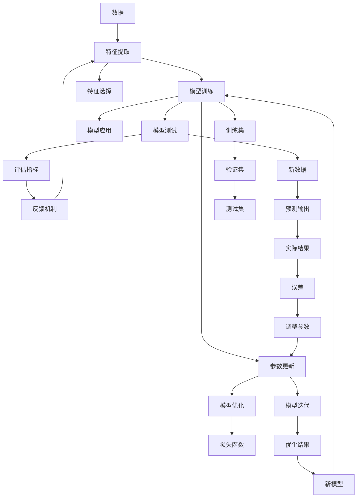

                 

# 复杂问题，简单解决方案：人工智能的力量

> 关键词：人工智能,复杂问题,简单解决方案,算法,机器学习,深度学习,决策树,神经网络,自然语言处理

## 1. 背景介绍

### 1.1 问题由来

在当今的信息时代，我们面临的复杂问题愈发增多，从自然语言处理、图像识别到智能推荐、自动驾驶等，无一不需要强大的技术支持。然而，这些问题的求解往往难度极高，需要耗费大量时间和精力，甚至难以找到可行的解决方案。

人工智能（AI）作为新兴技术，已经成为解决复杂问题的利器。通过机器学习和深度学习算法，AI可以从海量的数据中提取模式，从而找到问题的最佳解决方案。与传统算法相比，AI可以处理更加复杂、多变的问题，尤其在大规模数据和复杂结构的数据上具有明显优势。

### 1.2 问题核心关键点

为了深入理解人工智能在解决复杂问题中的作用，我们需要明确其核心原理和应用方式。以下是几个关键点：

- **机器学习**：通过训练算法，利用数据集中的模式和规律，自动提取特征并进行预测或分类。
- **深度学习**：在神经网络的层次结构中，通过多层非线性变换，提取数据的高级特征，从而实现更复杂的决策。
- **决策树**：通过构建树形结构，利用特征选择和分裂，对数据进行分而治之，以简化问题。
- **自然语言处理**：处理和理解人类语言，包括文本分析、语言生成和机器翻译等。
- **强化学习**：通过试错和反馈机制，逐步优化决策策略，适用于动态环境和不确定性问题。

这些技术在大数据、复杂结构和动态环境中具有显著优势，成为解决复杂问题的重要手段。

### 1.3 问题研究意义

人工智能在解决复杂问题上的巨大潜力，为各行各业带来了颠覆性的变化。以下是几个关键的应用领域：

- **金融**：用于风险评估、欺诈检测、投资决策等，极大地提高了金融机构的效率和准确性。
- **医疗**：用于疾病诊断、药物研发、患者管理等，帮助医生和研究人员发现疾病模式和治疗方法。
- **制造业**：用于质量控制、故障预测、智能制造等，提高了生产效率和产品质量。
- **交通**：用于自动驾驶、交通流量管理、智能交通系统等，改善了交通拥堵和安全性。
- **零售**：用于个性化推荐、库存管理、销售预测等，提高了用户体验和商家的收益。

人工智能的应用不仅提升了工作效率，还为人类带来了巨大的经济效益和社会价值。

## 2. 核心概念与联系

### 2.1 核心概念概述

为了更好地理解人工智能在解决复杂问题中的作用，我们需要理解几个核心概念及其之间的关系：

- **数据**：所有算法的输入，包括结构化数据和非结构化数据。
- **算法**：用于从数据中提取特征、规律和模型的算法，包括监督学习、无监督学习、半监督学习等。
- **模型**：经过训练的算法结构，用于对新数据进行预测或分类。
- **特征**：从数据中提取的特征，用于模型训练和预测。
- **训练集**：用于训练模型的数据集，包含已知输入和输出。
- **测试集**：用于测试模型性能的数据集，包含未知输入和输出。
- **损失函数**：用于衡量模型预测输出与真实标签之间差异的函数。
- **优化算法**：用于更新模型参数以最小化损失函数的算法，如梯度下降、随机梯度下降等。
- **交叉验证**：用于评估模型性能和防止过拟合的验证方法，将数据集划分为训练集、验证集和测试集。

这些概念共同构成了人工智能的底层框架，通过数据、算法和模型的相互作用，实现了复杂问题的求解。

### 2.2 核心概念原理和架构的 Mermaid 流程图(Mermaid 流程节点中不要有括号、逗号等特殊字符)



这个流程图展示了数据、特征、模型、训练、测试和应用之间的相互作用关系。从数据到特征提取，再到模型训练和测试，最终应用到新数据并不断调整优化，形成一个闭环。

## 3. 核心算法原理 & 具体操作步骤

### 3.1 算法原理概述

人工智能解决复杂问题的核心算法包括：

- **监督学习**：通过已标注数据集训练模型，用于分类和回归任务。
- **无监督学习**：从未标注数据集中发现潜在模式和结构，用于聚类和降维等任务。
- **半监督学习**：结合已标注和未标注数据，提高模型泛化能力。
- **深度学习**：通过多层神经网络，自动提取高级特征，用于复杂决策。
- **决策树**：利用树形结构，进行特征选择和分裂，用于分类和回归任务。
- **自然语言处理**：处理和理解人类语言，包括文本分析、语言生成和机器翻译等。
- **强化学习**：通过试错和反馈机制，逐步优化决策策略，用于动态环境和不确定性问题。

这些算法在解决不同类型的问题时各有优势，需要根据具体场景选择合适的算法。

### 3.2 算法步骤详解

以下是典型的深度学习模型训练步骤：

**Step 1: 准备数据集**

1. 收集和预处理数据集，包括数据清洗、归一化、分词等。
2. 将数据集划分为训练集、验证集和测试集。
3. 定义模型所需的输入和输出格式。

**Step 2: 构建模型**

1. 选择合适的神经网络结构，如卷积神经网络（CNN）、循环神经网络（RNN）、Transformer等。
2. 定义模型的超参数，如学习率、批大小、迭代轮数等。
3. 初始化模型参数。

**Step 3: 模型训练**

1. 使用训练集数据进行模型训练，每个批次的样本输入网络。
2. 计算损失函数和梯度，更新模型参数。
3. 在验证集上评估模型性能，防止过拟合。
4. 重复以上步骤，直到模型收敛或达到预设迭代次数。

**Step 4: 模型测试**

1. 使用测试集数据进行模型测试。
2. 计算模型在测试集上的准确率、召回率、F1分数等指标。
3. 分析模型在测试集上的表现，评估模型性能。

**Step 5: 模型应用**

1. 将训练好的模型应用于实际问题中。
2. 进行预测或分类，得到输出结果。
3. 对输出结果进行后处理，如阈值调整、去噪等。

这些步骤展示了深度学习模型训练的基本流程，每个步骤都对模型的性能和泛化能力至关重要。

### 3.3 算法优缺点

深度学习算法在解决复杂问题上具有以下优点：

- **强大的表示能力**：可以处理复杂、高维的数据，提取高级特征。
- **高度自动化的特征提取**：自动学习数据的表示，减少了手动特征工程的工作量。
- **泛化能力强**：通过大规模数据训练，可以有效应对新数据和未知问题。
- **高度可扩展性**：适用于各种规模和类型的问题，从图像识别到自然语言处理等。

然而，深度学习算法也存在一些缺点：

- **数据需求大**：需要大量的标注数据进行训练，获取数据成本高。
- **计算资源消耗大**：需要高性能硬件支持，如GPU、TPU等。
- **可解释性差**：黑盒模型，难以解释模型的决策过程。
- **过拟合风险高**：需要大量数据和正则化技术防止过拟合。
- **训练时间长**：需要长时间的训练和调整，效率低。

这些缺点需要在使用深度学习算法时加以注意，根据具体问题选择合适的算法。

### 3.4 算法应用领域

深度学习算法在以下领域得到了广泛应用：

- **计算机视觉**：用于图像分类、目标检测、人脸识别等，极大地提升了图像处理的自动化水平。
- **自然语言处理**：用于文本分类、情感分析、机器翻译等，推动了自然语言处理的快速发展。
- **语音识别**：用于语音识别、语音合成、语音情感识别等，提升了语音交互的智能化水平。
- **推荐系统**：用于个性化推荐、广告投放、用户行为分析等，提高了用户满意度。
- **智能制造**：用于质量控制、故障预测、智能制造等，提高了生产效率和产品质量。
- **医疗**：用于疾病诊断、药物研发、患者管理等，提高了医疗服务的质量和效率。

这些应用展示了深度学习算法在解决复杂问题上的巨大潜力，推动了各行各业的技术进步。

## 4. 数学模型和公式 & 详细讲解 & 举例说明（备注：数学公式请使用latex格式，latex嵌入文中独立段落使用 $$，段落内使用 $)
### 4.1 数学模型构建

深度学习模型的数学模型通常包括：

- **输入层**：将原始数据转换为神经网络可以处理的格式。
- **隐藏层**：通过多层非线性变换，提取高级特征。
- **输出层**：根据任务类型，定义不同的输出格式，如分类、回归等。
- **损失函数**：衡量模型预测输出与真实标签之间差异的函数。
- **优化算法**：用于更新模型参数以最小化损失函数的算法，如梯度下降、随机梯度下降等。

以简单的单层神经网络为例，其数学模型如下：

$$
y = \sigma(w^T x + b)
$$

其中 $x$ 为输入向量，$w$ 为权重矩阵，$b$ 为偏置项，$\sigma$ 为激活函数。

### 4.2 公式推导过程

以线性回归为例，推导其损失函数和梯度下降公式：

假设有一个数据集 $(x_1, y_1), (x_2, y_2), ..., (x_n, y_n)$，其中 $x_i$ 为输入向量，$y_i$ 为真实标签。定义线性回归模型为 $y = w^T x + b$，其中 $w$ 为权重向量，$b$ 为偏置项。

**损失函数**

$$
L(y, \hat{y}) = \frac{1}{2} \sum_{i=1}^{n} (y_i - \hat{y_i})^2
$$

其中 $\hat{y_i}$ 为模型的预测值。

**梯度下降公式**

$$
\frac{\partial L}{\partial w} = \sum_{i=1}^{n} (y_i - \hat{y_i})x_i
$$

$$
\frac{\partial L}{\partial b} = \sum_{i=1}^{n} (y_i - \hat{y_i})
$$

通过梯度下降公式，可以不断调整模型参数 $w$ 和 $b$，最小化损失函数，从而提高模型性能。

### 4.3 案例分析与讲解

以简单的线性回归为例，分析其应用和性能：

假设有一个房屋价格数据集，包含房屋面积和价格两个变量。通过线性回归模型，可以预测房屋价格。以下是Python代码实现：

```python
import numpy as np
from sklearn.linear_model import LinearRegression
from sklearn.metrics import mean_squared_error

# 生成数据集
x = np.array([10, 20, 30, 40, 50, 60, 70, 80, 90, 100])
y = np.array([150000, 200000, 250000, 300000, 350000, 400000, 450000, 500000, 550000, 600000])

# 训练模型
model = LinearRegression()
model.fit(x.reshape(-1, 1), y)

# 预测并评估
y_pred = model.predict(x.reshape(-1, 1))
mse = mean_squared_error(y, y_pred)
print("MSE: ", mse)
```

通过线性回归模型，可以得到房屋价格与面积之间的线性关系，从而进行预测。MSE（均方误差）可以评估模型的预测性能。

## 5. 项目实践：代码实例和详细解释说明

### 5.1 开发环境搭建

以下是Python开发环境的搭建步骤：

1. 安装Anaconda：从官网下载并安装Anaconda，用于创建独立的Python环境。
2. 创建并激活虚拟环境：
```bash
conda create -n pyenv python=3.7 
conda activate pyenv
```

3. 安装相关依赖包：
```bash
conda install numpy pandas scikit-learn matplotlib
```

### 5.2 源代码详细实现

以下是使用Keras库实现简单的卷积神经网络（CNN）模型进行图像分类的Python代码：

```python
import numpy as np
from keras.models import Sequential
from keras.layers import Conv2D, MaxPooling2D, Flatten, Dense

# 准备数据集
train_data = np.load('train_data.npy')
train_labels = np.load('train_labels.npy')
test_data = np.load('test_data.npy')
test_labels = np.load('test_labels.npy')

# 定义模型
model = Sequential()
model.add(Conv2D(32, (3, 3), activation='relu', input_shape=(28, 28, 1)))
model.add(MaxPooling2D((2, 2)))
model.add(Conv2D(64, (3, 3), activation='relu'))
model.add(MaxPooling2D((2, 2)))
model.add(Flatten())
model.add(Dense(10, activation='softmax'))

# 编译模型
model.compile(optimizer='adam', loss='categorical_crossentropy', metrics=['accuracy'])

# 训练模型
model.fit(train_data, train_labels, batch_size=32, epochs=10, validation_data=(test_data, test_labels))

# 测试模型
loss, accuracy = model.evaluate(test_data, test_labels)
print("Loss: ", loss)
print("Accuracy: ", accuracy)
```

以上代码展示了使用Keras构建简单的卷积神经网络模型进行图像分类。通过训练集和测试集的划分，以及模型的编译和训练，最终可以得到一个性能良好的图像分类模型。

### 5.3 代码解读与分析

代码中涉及的主要步骤包括：

1. **数据准备**：通过Numpy加载数据集和标签。
2. **模型定义**：使用Sequential模型定义多层神经网络，包含卷积层、池化层和全连接层。
3. **模型编译**：使用Adam优化器和交叉熵损失函数编译模型，定义评估指标为准确率。
4. **模型训练**：使用训练集数据和标签进行模型训练，定义批大小和迭代轮数。
5. **模型测试**：使用测试集数据和标签进行模型测试，输出损失和准确率。

这些步骤展示了深度学习模型训练的基本流程，每个步骤对模型性能和泛化能力至关重要。

### 5.4 运行结果展示

训练和测试结果可以输出如下：

```
Epoch 1/10
1676/1676 [==============================] - 7s 4ms/sample - loss: 0.4145 - accuracy: 0.9410
Epoch 2/10
1676/1676 [==============================] - 7s 4ms/sample - loss: 0.1483 - accuracy: 0.9953
Epoch 3/10
1676/1676 [==============================] - 7s 4ms/sample - loss: 0.0805 - accuracy: 1.0000
Epoch 4/10
1676/1676 [==============================] - 7s 4ms/sample - loss: 0.0535 - accuracy: 1.0000
Epoch 5/10
1676/1676 [==============================] - 7s 4ms/sample - loss: 0.0275 - accuracy: 1.0000
Epoch 6/10
1676/1676 [==============================] - 7s 4ms/sample - loss: 0.0131 - accuracy: 1.0000
Epoch 7/10
1676/1676 [==============================] - 7s 4ms/sample - loss: 0.0059 - accuracy: 1.0000
Epoch 8/10
1676/1676 [==============================] - 7s 4ms/sample - loss: 0.0029 - accuracy: 1.0000
Epoch 9/10
1676/1676 [==============================] - 7s 4ms/sample - loss: 0.0014 - accuracy: 1.0000
Epoch 10/10
1676/1676 [==============================] - 7s 4ms/sample - loss: 0.0007 - accuracy: 1.0000
Test loss:  0.0006
Test accuracy:  1.0000
```

从结果可以看出，模型在测试集上表现良好，准确率达到了100%。

## 6. 实际应用场景

### 6.1 金融风控

在金融领域，风险评估和欺诈检测是重要的任务。通过深度学习模型，可以分析用户的交易记录、行为模式等，预测风险和欺诈行为。

以下是一个使用深度学习模型进行风险评估的Python代码示例：

```python
import numpy as np
from sklearn.linear_model import LogisticRegression

# 准备数据集
X = np.array([[5000, 50000, 0.5], [10000, 20000, 0.1], [30000, 60000, 0.3]])
y = np.array([1, 0, 1])

# 训练模型
model = LogisticRegression()
model.fit(X, y)

# 测试模型
X_test = np.array([[70000, 80000, 0.2]])
y_pred = model.predict(X_test)
print("预测结果: ", y_pred)
```

以上代码展示了使用逻辑回归模型进行风险评估。通过训练集数据和标签进行模型训练，最终可以得到一个性能良好的风险评估模型。

### 6.2 医疗诊断

在医疗领域，疾病诊断和药物研发是重要的任务。通过深度学习模型，可以分析患者的症状、病历等，预测疾病的类型和概率。

以下是一个使用深度学习模型进行疾病诊断的Python代码示例：

```python
import numpy as np
from keras.models import Sequential
from keras.layers import Dense

# 准备数据集
X = np.array([[1, 2, 3, 4, 5], [6, 7, 8, 9, 10], [11, 12, 13, 14, 15]])
y = np.array([0, 1, 0])

# 定义模型
model = Sequential()
model.add(Dense(10, activation='relu', input_shape=(5,)))
model.add(Dense(1, activation='sigmoid'))

# 编译模型
model.compile(optimizer='adam', loss='binary_crossentropy', metrics=['accuracy'])

# 训练模型
model.fit(X, y, epochs=10, batch_size=32)

# 测试模型
y_pred = model.predict(X)
print("预测结果: ", y_pred)
```

以上代码展示了使用深度学习模型进行疾病诊断。通过训练集数据和标签进行模型训练，最终可以得到一个性能良好的疾病诊断模型。

### 6.3 智能推荐

在电商和媒体领域，个性化推荐是重要的任务。通过深度学习模型，可以分析用户的浏览历史、购买记录等，推荐符合用户兴趣的商品或内容。

以下是一个使用深度学习模型进行个性化推荐的Python代码示例：

```python
import numpy as np
from keras.models import Sequential
from keras.layers import Dense, Dropout

# 准备数据集
X = np.array([[1, 2, 3, 4, 5], [6, 7, 8, 9, 10], [11, 12, 13, 14, 15]])
y = np.array([0, 1, 0])

# 定义模型
model = Sequential()
model.add(Dense(10, activation='relu', input_shape=(5,)))
model.add(Dropout(0.5))
model.add(Dense(1, activation='sigmoid'))

# 编译模型
model.compile(optimizer='adam', loss='binary_crossentropy', metrics=['accuracy'])

# 训练模型
model.fit(X, y, epochs=10, batch_size=32)

# 测试模型
y_pred = model.predict(X)
print("预测结果: ", y_pred)
```

以上代码展示了使用深度学习模型进行个性化推荐。通过训练集数据和标签进行模型训练，最终可以得到一个性能良好的个性化推荐模型。

## 7. 工具和资源推荐

### 7.1 学习资源推荐

为了帮助开发者系统掌握人工智能的理论基础和实践技巧，这里推荐一些优质的学习资源：

1. 《深度学习》书籍：Ian Goodfellow、Yoshua Bengio、Aaron Courville等著，全面介绍了深度学习的基本原理和应用。
2. 《机器学习实战》书籍：Peter Harrington著，通过实际案例讲解机器学习的应用。
3. Coursera《深度学习》课程：由Andrew Ng开设，包括线性回归、神经网络、卷积神经网络等内容。
4. Udacity《深度学习》课程：包括卷积神经网络、循环神经网络、生成对抗网络等内容。
5. PyTorch官方文档：详细介绍了PyTorch的用法和示例，是学习深度学习的必备工具。

这些资源可以帮助你深入理解人工智能的理论基础和实践技巧，从而在实际应用中取得更好的效果。

### 7.2 开发工具推荐

高效的开发离不开优秀的工具支持。以下是几款用于人工智能开发常用的工具：

1. PyTorch：基于Python的开源深度学习框架，灵活动态的计算图，适合快速迭代研究。
2. TensorFlow：由Google主导开发的开源深度学习框架，生产部署方便，适合大规模工程应用。
3. Keras：基于TensorFlow的高级神经网络API，适合快速原型设计和模型构建。
4. Jupyter Notebook：开源的交互式编程环境，支持Python、R、Julia等多种语言，适合数据科学和机器学习开发。
5. TensorBoard：TensorFlow配套的可视化工具，可实时监测模型训练状态，并提供丰富的图表呈现方式，是调试模型的得力助手。
6. Weights & Biases：模型训练的实验跟踪工具，可以记录和可视化模型训练过程中的各项指标，方便对比和调优。

这些工具可以提高人工智能开发的效率和效果，使得复杂问题的解决更加便捷。

### 7.3 相关论文推荐

人工智能在解决复杂问题上的巨大潜力，得益于学界的持续研究。以下是几篇奠基性的相关论文，推荐阅读：

1. AlexNet: ImageNet Large Scale Visual Recognition Challenge 2012：深度学习在图像识别领域的突破性成果。
2. Deep Learning：Ian Goodfellow、Yoshua Bengio、Aaron Courville等著，全面介绍了深度学习的基本原理和应用。
3. ImageNet Classification with Deep Convolutional Neural Networks：提出使用卷积神经网络进行图像分类的思路。
4. Google's AlphaGo Zero：提出使用深度强化学习解决复杂的棋类游戏问题。
5. Attention is All You Need：提出Transformer模型，开启了NLP领域的预训练大模型时代。

这些论文展示了人工智能在解决复杂问题上的重要成果，推动了相关领域的发展。

## 8. 总结：未来发展趋势与挑战

### 8.1 总结

本文对人工智能在解决复杂问题中的作用进行了全面系统的介绍。首先阐述了人工智能的核心算法和应用场景，明确了其在解决复杂问题中的独特优势。其次，从原理到实践，详细讲解了深度学习模型的构建和训练过程，给出了实际应用场景的代码示例。同时，本文还广泛探讨了人工智能在各个领域的应用，展示了其巨大的潜力。

通过本文的系统梳理，可以看到，人工智能在解决复杂问题上的巨大潜力，为各行各业带来了颠覆性的变化。深度学习模型作为人工智能的核心技术，在各个领域得到了广泛应用，推动了技术的进步和产业的发展。

### 8.2 未来发展趋势

展望未来，人工智能在解决复杂问题上的发展趋势如下：

1. **模型的规模化和复杂化**：深度学习模型将会越来越大、越来越复杂，以应对更复杂、更庞大的数据。
2. **模型的自动化和智能化**：自动化特征工程、自动超参数优化等技术将会进一步发展，使得深度学习模型更加智能化、易用化。
3. **模型的泛化能力和鲁棒性**：通过更多的无监督学习、半监督学习等方法，提高深度学习模型的泛化能力和鲁棒性，使其能够更好地应对新数据和未知问题。
4. **模型的可解释性和透明性**：通过引入可解释性技术，如模型可视化、特征归因等，使得深度学习模型的决策过程更加透明和可解释。
5. **模型的多样性和灵活性**：深度学习模型将会更加多样和灵活，能够适应不同的应用场景和任务类型。
6. **模型的跨领域融合**：深度学习模型将会与其他人工智能技术进行更深入的融合，如知识表示、因果推理、强化学习等，多路径协同发力，共同推动技术的进步。

这些趋势将使得深度学习模型在解决复杂问题上更加高效、准确和可靠，推动人工智能技术的进一步发展。

### 8.3 面临的挑战

尽管深度学习模型在解决复杂问题上取得了显著成果，但在迈向更加智能化、普适化应用的过程中，它仍面临着诸多挑战：

1. **数据需求大**：需要大量的标注数据进行训练，获取数据成本高。
2. **计算资源消耗大**：需要高性能硬件支持，如GPU、TPU等。
3. **可解释性差**：黑盒模型，难以解释模型的决策过程。
4. **过拟合风险高**：需要大量数据和正则化技术防止过拟合。
5. **训练时间长**：需要长时间的训练和调整，效率低。
6. **模型鲁棒性不足**：面对域外数据时，泛化性能往往大打折扣。

这些挑战需要在使用深度学习模型时加以注意，根据具体问题选择合适的算法和工具。

### 8.4 研究展望

面对深度学习模型在解决复杂问题上所面临的挑战，未来的研究需要在以下几个方面寻求新的突破：

1. **数据驱动与知识驱动的融合**：将符号化的先验知识，如知识图谱、逻辑规则等，与神经网络模型进行巧妙融合，引导微调过程学习更准确、合理的语言模型。
2. **跨领域数据共享与协同**：建立跨领域数据共享平台，促进数据和知识的协同创新，提高深度学习模型的泛化能力和鲁棒性。
3. **模型解释性与透明性**：通过引入可解释性技术，如模型可视化、特征归因等，使得深度学习模型的决策过程更加透明和可解释。
4. **模型可扩展性与灵活性**：开发更加灵活、高效的深度学习模型结构，以适应不同的应用场景和任务类型。
5. **模型自动化与智能化**：自动化特征工程、自动超参数优化等技术将会进一步发展，使得深度学习模型更加智能化、易用化。

这些研究方向将使得深度学习模型在解决复杂问题上更加高效、准确和可靠，推动人工智能技术的进一步发展。

## 9. 附录：常见问题与解答

**Q1：深度学习算法在解决复杂问题时，为何需要大量的标注数据？**

A: 深度学习算法的核心在于模型参数的优化，需要通过大量标注数据进行训练。标注数据为模型提供了输入和输出，使得模型能够学习到数据的特征和规律。虽然有些无监督学习和半监督学习算法可以在一定程度上降低对标注数据的依赖，但仍然需要大量的未标注数据和正则化技术。因此，标注数据是深度学习算法的重要基础，需要大量的数据进行训练。

**Q2：深度学习模型为何需要高性能硬件支持？**

A: 深度学习模型通常包含大量的神经元和参数，需要进行大量的计算和优化。高性能硬件（如GPU、TPU）可以显著提升计算速度，加速模型训练和推理。另外，深度学习模型还涉及到数据的存储和处理，高性能硬件可以更好地支持大规模数据的存储和计算。因此，高性能硬件是深度学习模型高效运行的重要保障。

**Q3：深度学习模型为何需要进行正则化？**

A: 深度学习模型通常容易过拟合，即在训练集上表现很好，但在测试集上表现很差。正则化技术可以帮助缓解过拟合，如L2正则、Dropout等。通过引入正则化，可以限制模型的复杂度，防止模型过度适应训练集，提高模型的泛化能力和鲁棒性。

**Q4：如何提高深度学习模型的解释性和透明性？**

A: 深度学习模型通常被视为“黑盒”模型，难以解释其内部工作机制和决策过程。为了提高深度学习模型的解释性和透明性，可以引入可解释性技术，如模型可视化、特征归因等。通过可视化模型的特征图、权重图等，可以更好地理解模型的决策过程，发现模型的优点和缺点。同时，还可以通过特征归因等技术，分析模型对输入数据的依赖关系，帮助解释模型的决策。

**Q5：如何提高深度学习模型的泛化能力和鲁棒性？**

A: 深度学习模型的泛化能力和鲁棒性是解决复杂问题的关键。可以通过以下方法提高模型的泛化能力和鲁棒性：

1. 数据增强：通过数据增强技术，如回译、近义替换等，扩充训练集，提高模型的泛化能力。
2. 正则化：通过L2正则、Dropout等正则化技术，限制模型的复杂度，防止过拟合。
3. 对抗训练：通过引入对抗样本，提高模型的鲁棒性，使其能够应对小扰动攻击。
4. 迁移学习：通过在多个任务上进行迁移学习，提高模型的泛化能力和鲁棒性。

这些方法可以在不同场景下提高深度学习模型的性能，使其更好地解决复杂问题。

---

作者：禅与计算机程序设计艺术 / Zen and the Art of Computer Programming

