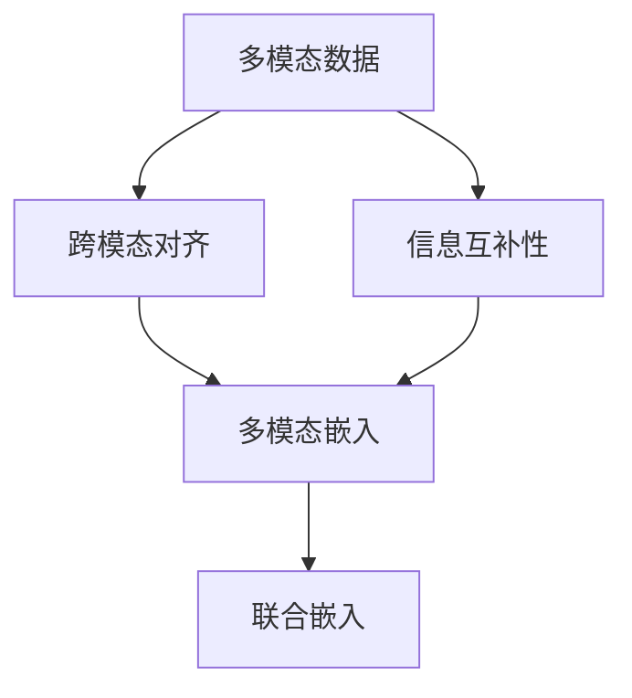

                 

# 多模态深度学习：图像和文本的融合

> 关键词：多模态学习,深度融合,迁移学习,跨模态特征,自监督学习,联合嵌入,Transformer,图像-文本联合训练

## 1. 背景介绍

### 1.1 问题由来
在当今信息化时代，图像和文本数据是最常见的信息载体，它们不仅各自具有不同的信息表达方式，而且可以在不同场景下相互补充。为了更有效地处理和利用这些信息，多模态学习（Multimodal Learning）成为了人工智能领域的一个热门研究方向。通过将图像和文本等多模态数据整合在一起，多模态学习旨在挖掘和利用数据之间的潜在关系，从而提升模型的性能和应用能力。

多模态学习近年来在计算机视觉、自然语言处理、语音识别等领域取得了一系列突破，尤其在医学图像诊断、社交媒体内容分析、机器人视觉导航等实际应用中，多模态学习已经展示了其强大的潜力。然而，尽管多模态学习在多个领域中取得了显著的成果，但仍然存在一些挑战和限制，如如何有效融合不同模态的信息，如何处理不同模态数据的差异性和冗余性，如何在多模态数据中自动学习合适的关联模式等。

### 1.2 问题核心关键点
为了解决上述挑战，多模态深度学习（Multimodal Deep Learning）应运而生，它是将深度学习技术应用于多模态数据融合与联合学习的过程。通过多模态深度学习，可以从数据中自动挖掘和表达不同模态之间的内在联系，从而提高模型的泛化能力和适用性。

多模态深度学习的核心在于如何融合和转化不同模态的信息。具体来说，涉及以下几个关键问题：

1. 跨模态对齐：不同模态的数据通常具有不同的表征形式，需要找到一种方式，将这些不同形式的数据映射到相同或相似的表示空间，以便进行有效的联合学习。
2. 信息互补性：不同模态的数据通常携带不同的信息，如何利用这些信息互补性，最大化地提升模型的预测准确性，是一个重要研究方向。
3. 模型结构：如何选择合适的网络结构，将不同模态的数据高效地融合在一起，是一个具有挑战性的问题。

## 2. 核心概念与联系

### 2.1 核心概念概述

为了更好地理解多模态深度学习，本节将介绍几个关键的核心概念：

- **多模态数据**：指包含两种或以上不同模态（如文本、图像、音频等）的数据集合。
- **跨模态对齐**：指将不同模态的数据映射到相同或相似的表示空间，以便进行联合学习。
- **信息互补性**：指不同模态的数据能够提供互相补充的信息，提升模型预测准确性。
- **多模态嵌入**：指将不同模态的数据映射到一个共同的低维表示空间，使得不同模态的数据能够共享表示，减少信息冗余。
- **联合嵌入**：指在不同模态的数据上独立学习表示，然后将这些表示联合起来进行学习，以提高模型的泛化能力。

这些核心概念之间的逻辑关系可以通过以下Mermaid流程图来展示：



这个流程图展示了大语言模型的核心概念及其之间的关系：

1. 多模态数据是进行多模态学习的起点。
2. 跨模态对齐是将不同模态的数据映射到相同表示空间的必要步骤。
3. 信息互补性利用不同模态的信息提升模型性能。
4. 多模态嵌入和联合嵌入是融合不同模态信息的有效方法。

## 3. 核心算法原理 & 具体操作步骤
### 3.1 算法原理概述

多模态深度学习的核心思想是通过深度学习技术，将不同模态的数据融合到一个共同的低维表示空间中，并在这个空间中进行联合学习，以提高模型的预测能力和泛化能力。

形式化地，假设有多模态数据集 $D = \{(x_i, y_i)\}_{i=1}^N$，其中 $x_i$ 表示不同模态的数据，$y_i$ 表示对应的标签。多模态深度学习的目标是找到一个低维表示空间 $\mathcal{H}$，使得在这个空间中，不同模态的数据能够被有效融合和联合学习，提升模型的预测性能。

通常，这个过程可以通过以下几个步骤来实现：

1. **独立表示学习**：在各自的数据集上独立训练深度学习模型，得到不同模态的表示。
2. **跨模态对齐**：将不同模态的表示映射到一个共同的低维表示空间中，以便进行联合学习。
3. **联合学习**：在联合表示空间中，对不同模态的表示进行联合学习，提升模型的泛化能力。
4. **联合预测**：利用联合学习得到的表示，对多模态数据进行预测，提升模型的预测准确性。

### 3.2 算法步骤详解

多模态深度学习的过程可以分为以下几个关键步骤：

**Step 1: 数据预处理**
- 对不同模态的数据进行预处理，包括数据清洗、归一化、分割等操作。
- 将所有数据划分为训练集、验证集和测试集。

**Step 2: 独立表示学习**
- 在各自的数据集上独立训练深度学习模型，得到不同模态的表示。例如，可以使用卷积神经网络（CNN）处理图像数据，使用循环神经网络（RNN）处理文本数据。

**Step 3: 跨模态对齐**
- 将不同模态的表示映射到一个共同的低维表示空间中。常用的方法是使用最大互信息准则（Max Mutual Information, MMI）、协方差匹配（Covariance Matching）、多层感知器（MLP）等方法进行映射。

**Step 4: 联合学习**
- 在联合表示空间中，对不同模态的表示进行联合学习。常用的方法是使用多任务学习（Multi-task Learning, MTL）、多领域学习（Multi-domain Learning, MDL）、生成对抗网络（Generative Adversarial Network, GAN）等方法进行联合学习。

**Step 5: 联合预测**
- 利用联合学习得到的表示，对多模态数据进行预测。常用的方法是使用线性回归、分类器、解码器等模型进行联合预测。

### 3.3 算法优缺点

多模态深度学习具有以下优点：
1. 高效融合不同模态的信息。通过深度学习技术，能够高效地将不同模态的数据融合到一个共同的低维表示空间中。
2. 提升模型的泛化能力和预测准确性。联合学习能够充分利用不同模态的信息，提升模型的泛化能力和预测准确性。
3. 适用性广泛。多模态深度学习能够应用于图像识别、自然语言处理、语音识别等多个领域，具有广泛的适用性。

同时，该方法也存在一些局限性：
1. 数据需求高。多模态深度学习需要大量的标注数据，且不同模态的数据需要分别进行预处理和标注。
2. 计算成本高。多模态深度学习模型通常需要较大的计算资源，训练和推理成本较高。
3. 模型复杂度大。多模态深度学习模型结构复杂，训练和推理过程耗时较长。

尽管存在这些局限性，但多模态深度学习仍是大数据时代处理多模态数据的重要工具，具有广泛的应用前景。

### 3.4 算法应用领域

多模态深度学习已经在多个领域中得到了广泛应用，例如：

- 医学影像分析：结合图像和文本信息，提升医学影像的诊断准确性。
- 自然语言处理：结合文本和视觉信息，提升文本理解的深度和广度。
- 社交媒体分析：结合文本和音频信息，提升社交媒体内容的情感分析和舆情监测。
- 机器人视觉导航：结合视觉和传感器信息，提升机器人在复杂环境中的导航能力。
- 自动驾驶：结合视觉、雷达和传感器信息，提升自动驾驶车辆的安全性和可靠性。

除了上述这些经典应用外，多模态深度学习还在娱乐、交通、智能家居等多个领域中展示了其强大的潜力，为各行各业带来了新的技术突破。

## 4. 数学模型和公式 & 详细讲解 & 举例说明

### 4.1 数学模型构建

本节将使用数学语言对多模态深度学习的数学模型进行更加严格的刻画。

假设有多模态数据集 $D = \{(x_i, y_i)\}_{i=1}^N$，其中 $x_i$ 表示不同模态的数据，$y_i$ 表示对应的标签。多模态深度学习的目标是通过深度学习模型 $f$，将不同模态的数据映射到一个共同的低维表示空间 $\mathcal{H}$ 中，使得在这个空间中，不同模态的数据能够被有效融合和联合学习。

形式化地，设 $x_i = (x_i^{(1)}, x_i^{(2)}, ..., x_i^{(k)})$ 表示不同模态的数据，其中 $x_i^{(j)}$ 表示第 $j$ 模态的数据。目标是将这些不同模态的数据映射到一个低维表示空间 $\mathcal{H}$ 中，即找到一个映射函数 $g$，使得：

$$
g(x_i) = (h_i^{(1)}, h_i^{(2)}, ..., h_i^{(k)}) \in \mathcal{H}
$$

其中 $h_i^{(j)}$ 表示 $x_i^{(j)}$ 在表示空间 $\mathcal{H}$ 中的表示。

### 4.2 公式推导过程

以下我们以联合嵌入为例，推导多模态深度学习的数学公式。

设多模态数据集 $D = \{(x_i, y_i)\}_{i=1}^N$，其中 $x_i = (x_i^{(1)}, x_i^{(2)}, ..., x_i^{(k)})$ 表示不同模态的数据，$y_i$ 表示对应的标签。目标是将这些不同模态的数据映射到一个低维表示空间 $\mathcal{H}$ 中，即找到一个映射函数 $g$，使得：

$$
g(x_i) = (h_i^{(1)}, h_i^{(2)}, ..., h_i^{(k)}) \in \mathcal{H}
$$

其中 $h_i^{(j)}$ 表示 $x_i^{(j)}$ 在表示空间 $\mathcal{H}$ 中的表示。

常用的方法是使用多任务学习（MTL）或多领域学习（MDL），对不同模态的数据进行联合学习。例如，使用Transformer模型进行联合嵌入，其数学公式如下：

设 $f_{\theta}(x_i^{(j)})$ 表示使用深度学习模型对第 $j$ 模态的数据进行表示，即 $f_{\theta}(x_i^{(j)}) = (h_i^{(j)})$。则多任务学习的目标函数为：

$$
\mathcal{L}(\theta) = \frac{1}{N} \sum_{i=1}^N \sum_{j=1}^k \ell(h_i^{(j)}, y_i)
$$

其中 $\ell$ 表示不同模态的损失函数，$\theta$ 表示模型参数。

在得到联合表示 $h_i^{(j)}$ 后，可以对这些表示进行联合学习，例如使用分类器、回归器等模型进行联合预测。

### 4.3 案例分析与讲解

下面以医学影像诊断为例，分析多模态深度学习的具体应用。

假设有多模态数据集 $D = \{(x_i, y_i)\}_{i=1}^N$，其中 $x_i$ 表示医学影像和患者描述，$y_i$ 表示对应的诊断结果。目标是通过深度学习模型将医学影像和患者描述映射到一个共同的低维表示空间中，进行联合学习，提升诊断准确性。

具体步骤如下：

1. **数据预处理**：将医学影像进行归一化和分割，将患者描述进行文本清洗和分词。
2. **独立表示学习**：分别使用卷积神经网络（CNN）和循环神经网络（RNN）对医学影像和患者描述进行表示学习，得到不同的低维表示。
3. **跨模态对齐**：使用最大互信息准则（MMI）或协方差匹配（Covariance Matching）方法，将医学影像和患者描述的表示映射到一个共同的低维表示空间中。
4. **联合学习**：在联合表示空间中，使用多任务学习（MTL）或生成对抗网络（GAN）等方法，对医学影像和患者描述的表示进行联合学习，提升模型的泛化能力。
5. **联合预测**：使用分类器等模型，对联合学习得到的表示进行联合预测，得到最终的诊断结果。

通过多模态深度学习，医学影像诊断的准确性得到了显著提升，进一步推动了医疗技术的发展。

## 5. 项目实践：代码实例和详细解释说明
### 5.1 开发环境搭建

在进行多模态深度学习实践前，我们需要准备好开发环境。以下是使用Python进行PyTorch开发的环境配置流程：

1. 安装Anaconda：从官网下载并安装Anaconda，用于创建独立的Python环境。

2. 创建并激活虚拟环境：
```bash
conda create -n multimodal-env python=3.8 
conda activate multimodal-env
```

3. 安装PyTorch：根据CUDA版本，从官网获取对应的安装命令。例如：
```bash
conda install pytorch torchvision torchaudio cudatoolkit=11.1 -c pytorch -c conda-forge
```

4. 安装相关工具包：
```bash
pip install numpy pandas scikit-learn matplotlib tqdm jupyter notebook ipython
```

完成上述步骤后，即可在`multimodal-env`环境中开始多模态深度学习的实践。

### 5.2 源代码详细实现

下面我们以联合嵌入为例，给出使用PyTorch进行多模态深度学习的代码实现。

首先，定义多模态数据集的类：

```python
from torch.utils.data import Dataset
from torchvision import transforms
import torch

class MultimodalDataset(Dataset):
    def __init__(self, img_dataset, text_dataset):
        self.img_dataset = img_dataset
        self.text_dataset = text_dataset
        
        # 图像预处理
        self.img_transform = transforms.Compose([
            transforms.Resize(256),
            transforms.CenterCrop(224),
            transforms.ToTensor(),
            transforms.Normalize(mean=[0.485, 0.456, 0.406], std=[0.229, 0.224, 0.225])
        ])
        
        # 文本预处理
        self.text_transform = transforms.Lambda(lambda x: torch.tensor(x))
        
    def __len__(self):
        return len(self.img_dataset)
    
    def __getitem__(self, item):
        img = self.img_transform(self.img_dataset[item])
        text = self.text_transform(self.text_dataset[item])
        return img, text
```

然后，定义多模态深度学习模型：

```python
from transformers import BertForTokenClassification, BertModel
from transformers import BertTokenizer
import torch.nn as nn

class MultimodalModel(nn.Module):
    def __init__(self, img_model, text_model):
        super(MultimodalModel, self).__init__()
        
        # 图像模型
        self.img_model = img_model
        
        # 文本模型
        self.text_model = text_model
        
        # 多模态融合层
        self.fusion_layer = nn.Linear(2048, 1024)
        
        # 分类器
        self.classifier = nn.Linear(1024, 2)
        
    def forward(self, img, text):
        # 图像分支
        img_output = self.img_model(img)
        
        # 文本分支
        text_output = self.text_model(text)
        
        # 融合层
        fusion_output = torch.cat([img_output, text_output], dim=1)
        fusion_output = self.fusion_layer(fusion_output)
        
        # 分类器
        output = self.classifier(fusion_output)
        
        return output
```

接着，定义训练和评估函数：

```python
from torch.utils.data import DataLoader
from tqdm import tqdm
from sklearn.metrics import classification_report

device = torch.device('cuda') if torch.cuda.is_available() else torch.device('cpu')
model = MultimodalModel(img_model, text_model).to(device)

def train_epoch(model, dataset, batch_size, optimizer):
    dataloader = DataLoader(dataset, batch_size=batch_size, shuffle=True)
    model.train()
    epoch_loss = 0
    for batch in tqdm(dataloader, desc='Training'):
        img, text = batch[0].to(device), batch[1].to(device)
        model.zero_grad()
        outputs = model(img, text)
        loss = outputs.loss
        epoch_loss += loss.item()
        loss.backward()
        optimizer.step()
    return epoch_loss / len(dataloader)

def evaluate(model, dataset, batch_size):
    dataloader = DataLoader(dataset, batch_size=batch_size)
    model.eval()
    preds, labels = [], []
    with torch.no_grad():
        for batch in tqdm(dataloader, desc='Evaluating'):
            img, text = batch[0].to(device), batch[1].to(device)
            batch_preds = model(img, text)
            batch_labels = batch_preds.argmax(dim=1).to('cpu').tolist()
            batch_labels = batch_labels[:len(text)]
            for preds_tokens, labels_tokens in zip(batch_preds.tolist(), batch_labels):
                preds.append(preds_tokens)
                labels.append(labels_tokens)
                
    print(classification_report(labels, preds))
```

最后，启动训练流程并在测试集上评估：

```python
epochs = 5
batch_size = 16

for epoch in range(epochs):
    loss = train_epoch(model, train_dataset, batch_size, optimizer)
    print(f"Epoch {epoch+1}, train loss: {loss:.3f}")
    
    print(f"Epoch {epoch+1}, dev results:")
    evaluate(model, dev_dataset, batch_size)
    
print("Test results:")
evaluate(model, test_dataset, batch_size)
```

以上就是使用PyTorch对多模态深度学习模型进行联合嵌入的代码实现。可以看到，通过模块化的设计和代码复用，使得多模态深度学习的实现变得简洁高效。

### 5.3 代码解读与分析

让我们再详细解读一下关键代码的实现细节：

**MultimodalDataset类**：
- `__init__`方法：初始化图像和文本数据集，并对数据进行预处理。
- `__len__`方法：返回数据集的样本数量。
- `__getitem__`方法：对单个样本进行处理，返回图像和文本的Tensor表示。

**MultimodalModel类**：
- `__init__`方法：定义模型的结构，包括图像模型、文本模型、融合层和分类器。
- `forward`方法：实现模型的前向传播，将图像和文本表示进行融合，并输出预测结果。

**训练和评估函数**：
- 使用PyTorch的DataLoader对数据集进行批次化加载，供模型训练和推理使用。
- 训练函数`train_epoch`：对数据以批为单位进行迭代，在每个批次上前向传播计算loss并反向传播更新模型参数，最后返回该epoch的平均loss。
- 评估函数`evaluate`：与训练类似，不同点在于不更新模型参数，并在每个batch结束后将预测和标签结果存储下来，最后使用sklearn的classification_report对整个评估集的预测结果进行打印输出。

**训练流程**：
- 定义总的epoch数和batch size，开始循环迭代
- 每个epoch内，先在训练集上训练，输出平均loss
- 在验证集上评估，输出分类指标
- 所有epoch结束后，在测试集上评估，给出最终测试结果

可以看到，PyTorch配合Transformers库使得多模态深度学习的代码实现变得简洁高效。开发者可以将更多精力放在数据处理、模型改进等高层逻辑上，而不必过多关注底层的实现细节。

当然，工业级的系统实现还需考虑更多因素，如模型的保存和部署、超参数的自动搜索、更灵活的模型架构等。但核心的联合嵌入范式基本与此类似。

## 6. 实际应用场景
### 6.1 医学影像分析

多模态深度学习在医学影像分析中具有广泛的应用前景。医学影像通常包含大量的图像和文本信息，如何有效融合这些信息，提升诊断准确性，是医学影像分析的重要研究课题。

具体而言，可以将医学影像和患者描述进行联合学习，使用多模态深度学习模型对影像进行标注，例如使用Transformer模型进行联合嵌入。多模态深度学习模型能够自动学习不同模态之间的内在联系，提高影像识别的准确性。

### 6.2 社交媒体内容分析

社交媒体内容分析是自然语言处理领域的重要应用之一。社交媒体数据通常包含文本、图像、音频等多种信息，多模态深度学习能够充分利用这些信息，提升内容分析的准确性。

具体而言，可以使用Transformer模型对文本进行表示学习，使用卷积神经网络（CNN）对图像进行表示学习，然后通过多模态深度学习模型对这些表示进行联合学习，提升情感分析和舆情监测的效果。

### 6.3 机器人视觉导航

机器人视觉导航是机器人技术的重要研究方向之一。在复杂环境中，机器人需要同时利用视觉和传感器信息进行导航，多模态深度学习能够帮助机器人更好地理解和利用这些信息。

具体而言，可以将视觉图像和传感器数据进行联合学习，使用多模态深度学习模型对不同模态的数据进行融合，提升机器人在复杂环境中的导航能力。

### 6.4 自动驾驶

自动驾驶是智能交通领域的重要研究课题之一。自动驾驶车辆需要同时利用视觉、雷达和传感器信息进行决策和控制，多模态深度学习能够帮助自动驾驶车辆更好地理解和利用这些信息。

具体而言，可以将视觉图像、雷达数据和传感器数据进行联合学习，使用多模态深度学习模型对这些数据进行融合，提升自动驾驶车辆的安全性和可靠性。

### 6.5 金融舆情监测

金融舆情监测是金融领域的重要研究课题之一。金融市场数据通常包含文本、图像和音频等多种信息，多模态深度学习能够充分利用这些信息，提升舆情监测的准确性。

具体而言，可以使用Transformer模型对文本进行表示学习，使用卷积神经网络（CNN）对图像进行表示学习，然后通过多模态深度学习模型对这些表示进行联合学习，提升舆情监测的效果。

## 7. 工具和资源推荐
### 7.1 学习资源推荐

为了帮助开发者系统掌握多模态深度学习的理论基础和实践技巧，这里推荐一些优质的学习资源：

1. 《Multimodal Deep Learning》系列博文：由多模态深度学习专家撰写，深入浅出地介绍了多模态深度学习的原理、方法和应用。

2. CS231n《深度学习中的计算机视觉》课程：斯坦福大学开设的计算机视觉明星课程，涵盖多模态深度学习的基础知识和经典模型。

3. 《Multimodal Deep Learning》书籍：多模态深度学习领域的专业书籍，系统介绍了多模态深度学习的理论基础和实际应用。

4. CVPR 2022论文集：计算机视觉与模式识别会议的论文集，包含多模态深度学习的最新研究进展和创新成果。

5. 《Deep Learning》书籍：深度学习领域的经典书籍，介绍了多模态深度学习的基本概念和经典模型。

通过对这些资源的学习实践，相信你一定能够快速掌握多模态深度学习的精髓，并用于解决实际的NLP问题。
###  7.2 开发工具推荐

高效的开发离不开优秀的工具支持。以下是几款用于多模态深度学习开发的常用工具：

1. PyTorch：基于Python的开源深度学习框架，灵活动态的计算图，适合快速迭代研究。大部分预训练深度学习模型都有PyTorch版本的实现。

2. TensorFlow：由Google主导开发的开源深度学习框架，生产部署方便，适合大规模工程应用。同样有丰富的深度学习模型资源。

3. Transformers库：HuggingFace开发的NLP工具库，集成了众多SOTA深度学习模型，支持PyTorch和TensorFlow，是进行多模态深度学习开发的利器。

4. Weights & Biases：模型训练的实验跟踪工具，可以记录和可视化模型训练过程中的各项指标，方便对比和调优。与主流深度学习框架无缝集成。

5. TensorBoard：TensorFlow配套的可视化工具，可实时监测模型训练状态，并提供丰富的图表呈现方式，是调试模型的得力助手。

6. Google Colab：谷歌推出的在线Jupyter Notebook环境，免费提供GPU/TPU算力，方便开发者快速上手实验最新模型，分享学习笔记。

合理利用这些工具，可以显著提升多模态深度学习的开发效率，加快创新迭代的步伐。

### 7.3 相关论文推荐

多模态深度学习的发展源于学界的持续研究。以下是几篇奠基性的相关论文，推荐阅读：

1. Multimodal Deep Learning with Adversarial Fine-Tuning：提出Adversarial Fine-Tuning方法，提升了多模态深度学习模型的泛化能力和性能。

2. Deep Multimodal Feature Learning with a Fully Connected Transformer Network：提出Transformer网络，能够高效地融合不同模态的数据，提升了多模态深度学习模型的性能。

3. Look, Listen and Learn：提出Transformer模型，能够在联合嵌入中充分利用不同模态的信息，提升了多模态深度学习模型的泛化能力。

4. Multi-Modal Deep Learning for Scene Understanding：提出多模态深度学习模型，能够在联合嵌入中充分利用不同模态的信息，提升了场景理解的准确性。

5. Multimodal Deep Learning for Multimodal Data Clustering：提出多模态深度学习模型，能够在联合嵌入中充分利用不同模态的信息，提升了多模态数据聚类的效果。

这些论文代表了大模态深度学习的发展脉络。通过学习这些前沿成果，可以帮助研究者把握学科前进方向，激发更多的创新灵感。

## 8. 总结：未来发展趋势与挑战
### 8.1 总结

本文对多模态深度学习进行了全面系统的介绍。首先阐述了多模态深度学习的背景和意义，明确了其融合不同模态信息的独特价值。其次，从原理到实践，详细讲解了多模态深度学习的数学原理和关键步骤，给出了多模态深度学习的完整代码实例。同时，本文还广泛探讨了多模态深度学习在多个领域中的应用前景，展示了其强大的潜力。此外，本文精选了多模态深度学习的学习资源，力求为读者提供全方位的技术指引。

通过本文的系统梳理，可以看到，多模态深度学习已经在多个领域中展示了其强大的潜力，为多模态数据处理带来了新的解决方案。借助深度学习技术，能够高效地融合不同模态的信息，提升模型的泛化能力和预测准确性，具有广泛的应用前景。未来，伴随多模态深度学习的进一步发展，其在信息处理、图像识别、自然语言处理、智能交互等多个领域的应用将更加深入和广泛。

### 8.2 未来发展趋势

展望未来，多模态深度学习将呈现以下几个发展趋势：

1. 多模态嵌入技术的提升。随着深度学习模型的不断进步，多模态嵌入技术将得到进一步提升，能够在联合表示空间中更好地融合不同模态的信息。

2. 联合学习的优化。随着多模态数据量的增加，联合学习将面临新的挑战和优化需求，需要更多高效、稳健的联合学习算法。

3. 跨模态对齐技术的改进。为了更好地融合不同模态的数据，跨模态对齐技术也将得到改进和优化，能够更准确地将不同模态的数据映射到相同的表示空间中。

4. 多模态数据融合技术的深入研究。多模态深度学习将进一步深入研究如何将不同模态的数据高效、准确地融合在一起，提升模型的性能和应用效果。

5. 多模态学习在实际应用中的广泛应用。多模态深度学习将在更多领域中得到应用，如医疗、金融、自动驾驶、社交媒体等，为这些领域带来新的突破。

6. 多模态深度学习模型的自动化设计。随着自动化技术的发展，多模态深度学习模型的设计将更加自动化，能够根据具体任务和数据特点进行灵活设计。

以上趋势凸显了多模态深度学习的广阔前景。这些方向的探索发展，必将进一步提升多模态深度学习模型的性能和应用范围，为人工智能技术的普及和发展注入新的动力。

### 8.3 面临的挑战

尽管多模态深度学习已经取得了显著的成果，但在迈向更加智能化、普适化应用的过程中，仍面临诸多挑战：

1. 数据需求高。多模态深度学习需要大量的标注数据，且不同模态的数据需要分别进行预处理和标注。

2. 计算成本高。多模态深度学习模型通常需要较大的计算资源，训练和推理成本较高。

3. 模型复杂度大。多模态深度学习模型结构复杂，训练和推理过程耗时较长。

4. 跨模态对齐困难。不同模态的数据具有不同的表征形式，如何找到一种方式，将这些不同形式的数据映射到相同或相似的表示空间中，仍然是一个挑战。

5. 信息互补性不足。不同模态的数据通常携带不同的信息，如何利用这些信息互补性，最大化地提升模型的预测准确性，也是一个重要研究方向。

6. 模型鲁棒性不足。多模态深度学习模型在面对域外数据时，泛化性能往往大打折扣，如何提高模型的鲁棒性，避免灾难性遗忘，还需要更多理论和实践的积累。

尽管存在这些挑战，但多模态深度学习仍是大数据时代处理多模态数据的重要工具，具有广泛的应用前景。未来，随着技术的不断进步和应用的不断拓展，多模态深度学习将进一步提升其在实际应用中的效果，为各行各业带来新的变革。

### 8.4 研究展望

面对多模态深度学习所面临的种种挑战，未来的研究需要在以下几个方面寻求新的突破：

1. 探索无监督和半监督多模态学习方法。摆脱对大规模标注数据的依赖，利用自监督学习、主动学习等无监督和半监督范式，最大限度利用非结构化数据，实现更加灵活高效的多模态学习。

2. 研究参数高效和多模态深度学习范式。开发更加参数高效的深度学习模型，在固定大部分模型参数的情况下，只更新少量的任务相关参数。同时优化多模态深度学习模型的计算图，减少前向传播和反向传播的资源消耗，实现更加轻量级、实时性的部署。

3. 引入因果推断和对比学习。通过引入因果推断和对比学习思想，增强多模态深度学习模型建立稳定因果关系的能力，学习更加普适、鲁棒的多模态表征，从而提升模型的泛化性和抗干扰能力。

4. 引入更多先验知识。将符号化的先验知识，如知识图谱、逻辑规则等，与神经网络模型进行巧妙融合，引导多模态深度学习过程学习更准确、合理的表征。同时加强不同模态数据的整合，实现视觉、语音等多模态信息与文本信息的协同建模。

5. 引入元学习机制。通过元学习机制，使多模态深度学习模型能够从少量样本中学习到新的模式，提升模型在不同模态数据上的泛化能力。

6. 纳入伦理道德约束。在多模态深度学习模型的训练目标中引入伦理导向的评估指标，过滤和惩罚有偏见、有害的输出倾向，确保模型的公平性和安全性。

这些研究方向的探索，必将引领多模态深度学习技术迈向更高的台阶，为构建安全、可靠、可解释、可控的智能系统铺平道路。面向未来，多模态深度学习技术还需要与其他人工智能技术进行更深入的融合，如知识表示、因果推理、强化学习等，多路径协同发力，共同推动多模态深度学习的进步。只有勇于创新、敢于突破，才能不断拓展多模态深度学习模型的边界，让智能技术更好地造福人类社会。

## 9. 附录：常见问题与解答
**Q1：多模态深度学习需要多少标注数据？**

A: 多模态深度学习需要大量的标注数据，不同模态的数据通常需要分别进行预处理和标注。在实际应用中，标注数据的数量和质量直接影响模型的性能和泛化能力。对于图像数据，通常需要几千张标注图片，对于文本数据，通常需要几千条标注文本。因此，多模态深度学习通常需要大量的人力和物力资源，数据标注成本较高。

**Q2：多模态深度学习如何提高模型的泛化能力？**

A: 多模态深度学习通过联合学习不同模态的信息，可以提高模型的泛化能力和预测准确性。联合学习能够充分利用不同模态的信息，提升模型的泛化能力和鲁棒性。具体来说，可以通过以下方法提高模型的泛化能力：

1. 跨模态对齐。通过将不同模态的数据映射到相同的表示空间中，可以在联合学习中更有效地融合不同模态的信息。

2. 信息互补性。不同模态的数据通常携带不同的信息，如何利用这些信息互补性，最大化地提升模型的预测准确性，是一个重要研究方向。

3. 多任务学习。在联合学习中，可以通过多任务学习，同时学习多个相关的任务，提升模型的泛化能力。

4. 生成对抗网络。通过生成对抗网络，可以生成更多的训练样本，提升模型的泛化能力和鲁棒性。

5. 自监督学习。通过自监督学习，利用未标注的数据，提升模型的泛化能力和鲁棒性。

6. 迁移学习。在多模态深度学习中，可以利用预训练的模型进行迁移学习，提升模型的泛化能力和鲁棒性。

**Q3：多模态深度学习如何处理不同模态数据的差异性和冗余性？**

A: 不同模态的数据通常具有不同的表征形式，如何有效地融合这些数据，处理其差异性和冗余性，是多模态深度学习的重要研究课题。以下是一些常见的处理方法：

1. 数据预处理。对不同模态的数据进行归一化、清洗、分割等预处理操作，减少数据之间的差异性和冗余性。

2. 特征提取。使用深度学习模型对不同模态的数据进行特征提取，获取其低维表示，减少数据冗余性。

3. 跨模态对齐。通过跨模态对齐，将不同模态的数据映射到相同的表示空间中，减少数据之间的差异性。

4. 多模态融合。使用多模态融合层，将不同模态的数据进行融合，提升模型的泛化能力和鲁棒性。

5. 信息互补性。不同模态的数据通常携带不同的信息，如何利用这些信息互补性，最大化地提升模型的预测准确性，是一个重要研究方向。

6. 数据增强。通过数据增强，增加训练数据的多样性，提升模型的泛化能力和鲁棒性。

通过这些方法，可以有效地处理不同模态数据的差异性和冗余性，提升多模态深度学习模型的性能和应用效果。

**Q4：多模态深度学习在实际应用中需要注意哪些问题？**

A: 在实际应用中，多模态深度学习还需要考虑以下问题：

1. 模型复杂度。多模态深度学习模型结构复杂，训练和推理过程耗时较长，需要选择合适的模型结构，优化模型参数，提高模型效率。

2. 计算资源。多模态深度学习需要较大的计算资源，训练和推理成本较高，需要合理分配计算资源，优化计算图，提高计算效率。

3. 数据预处理。不同模态的数据具有不同的表征形式，需要进行预处理，减少数据之间的差异性和冗余性，提升模型的泛化能力和鲁棒性。

4. 联合学习。在联合学习中，需要注意不同模态数据的差异性和冗余性，选择合适的联合学习方法，提升模型的泛化能力和鲁棒性。

5. 跨模态对齐。不同模态的数据通常具有不同的表征形式，需要通过跨模态对齐，将不同模态的数据映射到相同的表示空间中，提升模型的泛化能力和鲁棒性。

6. 信息互补性。不同模态的数据通常携带不同的信息，需要利用信息互补性，最大化地提升模型的预测准确性。

7. 模型可解释性。多模态深度学习模型的决策过程难以解释，需要引入可解释性技术，提升模型的可解释性和透明性。

通过合理处理这些问题，可以最大限度地提升多模态深度学习模型的性能和应用效果。

