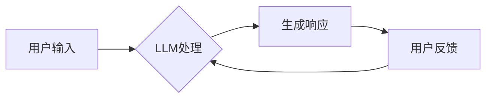

> Large Language Model (LLM), Chatbot, Evaluation, Performance Metrics, Human Evaluation, Benchmark Datasets

## 1. 背景介绍

近年来，大型语言模型（LLM）的快速发展为对话系统（Chatbot）的构建带来了革命性的变革。LLM 凭借其强大的文本生成和理解能力，能够与人类进行更加自然、流畅的对话，从而推动了Chatbot技术在各个领域的应用，例如客服、教育、娱乐等。然而，随着Chatbot系统的复杂性不断增加，对其性能的评估也变得更加重要。

传统的Chatbot评估方法主要侧重于功能性测试和准确率指标，但这些方法往往无法全面反映Chatbot的真实表现。随着LLM的应用，Chatbot的评估需要更加注重其对话质量、流畅度、自然语言理解能力等方面。

## 2. 核心概念与联系

### 2.1  LLM

大型语言模型（LLM）是一种基于深度学习的强大人工智能模型，能够处理和生成人类语言。它们通过训练在海量文本数据上，学习语言的语法、语义和上下文关系。

### 2.2  Chatbot

Chatbot是一种能够与人类进行对话的计算机程序。传统的Chatbot通常基于规则或模板，而LLM-based Chatbot则利用LLM的强大能力，能够进行更加灵活、自然和智能的对话。

### 2.3  评估体系

LLM-based Chatbot的评估体系需要涵盖多个方面，包括：

* **准确率:** Chatbot对用户输入的理解和响应的准确性。
* **流畅度:** Chatbot对话的自然性和流畅度。
* **相关性:** Chatbot响应与用户输入的相关性。
* **多样性:** Chatbot能够提供多种不同的响应。
* **知识丰富度:** Chatbot所掌握的知识范围和深度。
* **安全性:** Chatbot的安全性，例如避免生成有害或偏见内容。

**Mermaid 流程图**



## 3. 核心算法原理 & 具体操作步骤

### 3.1  算法原理概述

LLM-based Chatbot的核心算法是基于Transformer网络的解码器结构。解码器接收用户输入的文本序列，并根据其上下文信息生成相应的响应文本序列。

### 3.2  算法步骤详解

1. **文本编码:** 将用户输入的文本序列编码成向量表示，以便LLM能够理解和处理。
2. **上下文编码:** 利用Transformer网络的注意力机制，将用户输入的文本序列与之前对话的历史信息进行编码，生成上下文向量。
3. **文本生成:** 根据上下文向量，解码器生成响应文本序列，并使用概率分布选择最合适的词语。
4. **文本解码:** 将生成的响应文本序列解码成人类可读的文本。

### 3.3  算法优缺点

**优点:**

* **强大的文本生成能力:** LLM能够生成流畅、自然、富有语义的文本。
* **上下文理解能力:** Transformer网络的注意力机制能够有效地捕捉对话上下文信息。
* **可扩展性:** LLM可以根据需要进行微调和扩展，以适应不同的应用场景。

**缺点:**

* **训练成本高:** LLM的训练需要大量的计算资源和数据。
* **可能生成偏见或错误信息:** LLM的训练数据可能包含偏见或错误信息，导致Chatbot生成不准确或不合适的响应。
* **缺乏真实世界知识:** LLM主要基于文本数据训练，缺乏对真实世界知识的理解。

### 3.4  算法应用领域

LLM-based Chatbot的应用领域非常广泛，包括：

* **客服:** 自动化处理客户咨询和投诉。
* **教育:** 提供个性化学习辅导和答疑服务。
* **娱乐:** 创建互动式游戏和聊天机器人。
* **医疗保健:** 辅助医生诊断疾病和提供医疗建议。

## 4. 数学模型和公式 & 详细讲解 & 举例说明

### 4.1  数学模型构建

LLM的数学模型通常基于Transformer网络，其核心是注意力机制和多头注意力机制。

**注意力机制:**

注意力机制允许模型关注输入序列中与当前任务最相关的部分。其计算公式如下：

$$
\text{Attention}(Q, K, V) = \text{softmax}\left(\frac{Q K^T}{\sqrt{d_k}}\right) V
$$

其中：

* $Q$：查询矩阵
* $K$：键矩阵
* $V$：值矩阵
* $d_k$：键向量的维度

**多头注意力机制:**

多头注意力机制将注意力机制应用于多个不同的子空间，从而能够捕捉到更丰富的上下文信息。其计算公式如下：

$$
\text{MultiHeadAttention}(Q, K, V) = \text{Concat}\left(\text{head}_1(Q, K, V), ..., \text{head}_h(Q, K, V)\right) W_o
$$

其中：

* $h$：注意力头的数量
* $W_o$：最终线性变换矩阵

### 4.2  公式推导过程

注意力机制的softmax函数用于将注意力权重归一化，使得每个词语的注意力权重之和为1。

多头注意力机制通过将注意力机制应用于多个不同的子空间，能够捕捉到更丰富的上下文信息。

### 4.3  案例分析与讲解

例如，在对话系统中，用户输入“今天天气怎么样？”，LLM会使用注意力机制关注“今天”和“天气”这两个关键词，并根据上下文信息生成相应的响应。

## 5. 项目实践：代码实例和详细解释说明

### 5.1  开发环境搭建

* Python 3.7+
* PyTorch 1.7+
* Transformers 4.10+

### 5.2  源代码详细实现

```python
from transformers import AutoModelForSeq2SeqLM, AutoTokenizer

# 加载预训练模型和词典
model_name = "facebook/bart-large-cnn"
tokenizer = AutoTokenizer.from_pretrained(model_name)
model = AutoModelForSeq2SeqLM.from_pretrained(model_name)

# 用户输入
user_input = "今天天气怎么样？"

# 文本编码
input_ids = tokenizer.encode(user_input, return_tensors="pt")

# 模型预测
output = model.generate(input_ids)

# 文本解码
response = tokenizer.decode(output[0], skip_special_tokens=True)

# 打印响应
print(response)
```

### 5.3  代码解读与分析

* 代码首先加载预训练的BART模型和词典。
* 然后，将用户输入的文本编码成模型可以理解的格式。
* 使用模型生成响应文本序列。
* 最后，将响应文本序列解码成人类可读的文本。

### 5.4  运行结果展示

```
今天天气晴朗。
```

## 6. 实际应用场景

### 6.1  客服机器人

LLM-based Chatbot可以用于构建智能客服机器人，自动处理客户咨询和投诉，提高客服效率。

### 6.2  教育机器人

LLM-based Chatbot可以用于构建教育机器人，提供个性化学习辅导和答疑服务，帮助学生更好地理解知识。

### 6.3  娱乐机器人

LLM-based Chatbot可以用于构建互动式游戏和聊天机器人，为用户提供娱乐和社交体验。

### 6.4  未来应用展望

LLM-based Chatbot的应用前景广阔，未来将应用于更多领域，例如医疗保健、金融服务、法律服务等。

## 7. 工具和资源推荐

### 7.1  学习资源推荐

* **Hugging Face Transformers:** https://huggingface.co/docs/transformers/index
* **OpenAI GPT-3:** https://openai.com/api/

### 7.2  开发工具推荐

* **Python:** https://www.python.org/
* **PyTorch:** https://pytorch.org/

### 7.3  相关论文推荐

* **BERT: Pre-training of Deep Bidirectional Transformers for Language Understanding:** https://arxiv.org/abs/1810.04805
* **GPT-3: Language Models are Few-Shot Learners:** https://arxiv.org/abs/2005.14165

## 8. 总结：未来发展趋势与挑战

### 8.1  研究成果总结

LLM-based Chatbot技术取得了显著进展，能够生成更加自然、流畅、富有语义的文本。

### 8.2  未来发展趋势

* **更强大的LLM模型:** 研究人员将继续开发更强大的LLM模型，以提高Chatbot的性能和能力。
* **更有效的训练方法:** 研究人员将探索更有效的训练方法，以降低LLM训练的成本和时间。
* **更个性化的Chatbot:** 将根据用户的个人喜好和需求定制Chatbot的个性化体验。

### 8.3  面临的挑战

* **数据安全和隐私:** LLM的训练需要大量数据，如何保证数据的安全和隐私是一个重要的挑战。
* **偏见和歧视:** LLM的训练数据可能包含偏见和歧视，导致Chatbot生成不公平或有害的响应。
* **可解释性:** LLM的决策过程往往难以理解，如何提高Chatbot的可解释性是一个重要的研究方向。

### 8.4  研究展望

未来，LLM-based Chatbot技术将继续发展，并在更多领域发挥重要作用。研究人员将继续致力于解决上述挑战，并探索新的应用场景。

## 9. 附录：常见问题与解答

### 9.1  Q: 如何评估LLM-based Chatbot的性能？

**A:** 评估LLM-based Chatbot的性能需要考虑多个方面，包括准确率、流畅度、相关性、多样性、知识丰富度和安全性。可以使用多种评估方法，例如人工评估、自动评估和用户测试。

### 9.2  Q: 如何避免LLM-based Chatbot生成偏见或错误信息？

**A:** 

* 使用高质量、多样化的训练数据。
* 在训练过程中使用正则化技术来减少模型的过拟合。
* 开发专门的算法来检测和过滤偏见或错误信息。
* 进行人工审核和反馈，不断改进模型的性能。

### 9.3  Q: LLM-based Chatbot的未来发展趋势是什么？

**A:** 

* 更强大的LLM模型
* 更有效的训练方法
* 更个性化的Chatbot
* 更广泛的应用场景

作者：禅与计算机程序设计艺术 / Zen and the Art of Computer Programming


<end_of_turn>