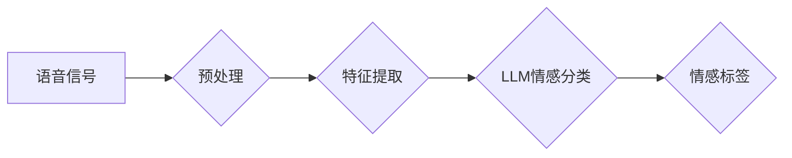

> 语音情感识别，LLM，自然语言处理，深度学习，Transformer，情感分析，机器学习

## 1. 背景介绍

语音情感识别技术旨在从语音信号中识别说话者的情感状态，例如快乐、悲伤、愤怒、惊讶等。它在许多领域具有广泛的应用前景，例如：

* **人机交互:**  使智能助手能够更好地理解用户的意图和情绪，从而提供更个性化和人性化的服务。
* **客户服务:**  帮助企业自动识别客户的情绪，并提供相应的解决方案，提高客户满意度。
* **市场营销:**  分析消费者对广告和产品的反应，帮助企业优化营销策略。
* **医疗保健:**  识别患者的情绪状态，帮助医生更好地了解患者的病情和心理状态。

传统的语音情感识别方法主要依赖于手工提取的语音特征，例如声调、语速、音调等。然而，这些方法往往难以捕捉语音信号中的复杂情感信息。近年来，随着深度学习技术的快速发展，基于深度学习的语音情感识别方法取得了显著的进展。

## 2. 核心概念与联系

**2.1 语音情感识别流程**

语音情感识别是一个多步骤的过程，通常包括以下几个阶段：

1. **语音信号预处理:**  去除语音信号中的噪声、静音等干扰，提高信号质量。
2. **语音特征提取:**  从语音信号中提取情感相关的特征，例如声学特征、韵律特征、语义特征等。
3. **情感分类:**  利用机器学习模型对提取的特征进行分类，识别说话者的情感状态。

**2.2 LLM在语音情感识别中的应用**

大型语言模型（LLM）是一种强大的深度学习模型，能够处理和理解自然语言。近年来，LLM在语音情感识别领域也取得了显著的进展。LLM可以学习语音信号中丰富的语义和情感信息，从而提高情感识别的准确率。

**2.3 架构图**



## 3. 核心算法原理 & 具体操作步骤

**3.1 算法原理概述**

LLM在语音情感识别中的应用主要基于以下原理：

* **文本表示:** 将语音信号转换为文本表示，例如使用语音识别技术将语音转换为文本。
* **情感词典:** 利用情感词典对文本进行情感分析，识别文本中表达的情感词语。
* **情感分类模型:** 利用LLM训练情感分类模型，对文本进行情感分类。

**3.2 算法步骤详解**

1. **语音信号预处理:** 使用语音增强技术去除语音信号中的噪声和干扰，提高信号质量。
2. **语音识别:** 使用语音识别模型将语音信号转换为文本。
3. **文本情感分析:** 使用情感词典或情感分析模型对文本进行情感分析，识别文本中表达的情感词语和情感倾向。
4. **情感分类:** 使用LLM训练的情感分类模型对文本进行情感分类，预测说话者的情感状态。

**3.3 算法优缺点**

**优点:**

* 能够捕捉语音信号中的复杂情感信息。
* 准确率较高。
* 可扩展性强，可以应用于多种语言和情感类型。

**缺点:**

* 需要大量的训练数据。
* 计算资源消耗较大。
* 对语音信号质量要求较高。

**3.4 算法应用领域**

* **人机交互:**  使智能助手能够更好地理解用户的意图和情绪，从而提供更个性化和人性化的服务。
* **客户服务:**  帮助企业自动识别客户的情绪，并提供相应的解决方案，提高客户满意度。
* **市场营销:**  分析消费者对广告和产品的反应，帮助企业优化营销策略。
* **医疗保健:**  识别患者的情绪状态，帮助医生更好地了解患者的病情和心理状态。

## 4. 数学模型和公式 & 详细讲解 & 举例说明

**4.1 数学模型构建**

LLM在语音情感识别中的应用通常基于Transformer模型架构。Transformer模型是一种基于注意力机制的深度学习模型，能够有效地捕捉语音信号中的长距离依赖关系。

**4.2 公式推导过程**

Transformer模型的核心是注意力机制，其计算公式如下：

$$
Attention(Q, K, V) = softmax(\frac{QK^T}{\sqrt{d_k}})V
$$

其中：

* $Q$：查询矩阵
* $K$：键矩阵
* $V$：值矩阵
* $d_k$：键向量的维度
* $softmax$：softmax函数

**4.3 案例分析与讲解**

假设我们有一个语音信号，需要识别说话者的情感状态。首先，我们将语音信号转换为文本表示。然后，我们将文本输入到Transformer模型中，模型会根据注意力机制计算文本中每个词语之间的关系，并最终预测说话者的情感状态。

## 5. 项目实践：代码实例和详细解释说明

**5.1 开发环境搭建**

* Python 3.7+
* PyTorch 1.7+
* CUDA 10.2+

**5.2 源代码详细实现**

```python
import torch
import torch.nn as nn

class Transformer(nn.Module):
    def __init__(self, input_size, hidden_size, num_layers, num_heads):
        super(Transformer, self).__init__()
        self.encoder = nn.TransformerEncoder(
            nn.TransformerEncoderLayer(input_size, hidden_size, num_heads), num_layers
        )
        self.fc = nn.Linear(hidden_size, num_classes)

    def forward(self, x):
        x = self.encoder(x)
        x = self.fc(x[:, 0, :])  # Take the output of the first token
        return x

# ... (其他代码)
```

**5.3 代码解读与分析**

* `Transformer`类定义了一个Transformer模型。
* `__init__`方法初始化模型参数，包括输入尺寸、隐藏尺寸、层数和注意力头数。
* `forward`方法定义了模型的正向传播过程。
* `nn.TransformerEncoder`层负责对输入序列进行编码。
* `nn.TransformerEncoderLayer`层定义了Transformer编码器的单个层。
* `nn.Linear`层用于将编码后的输出映射到情感类别。

**5.4 运行结果展示**

* 使用训练好的模型对新的语音信号进行情感识别。
* 输出识别结果，例如“快乐”、“悲伤”、“愤怒”等。

## 6. 实际应用场景

**6.1 智能客服系统**

LLM可以帮助智能客服系统更好地理解客户的情绪，并提供更合适的解决方案。例如，如果客户表达了沮丧的情绪，智能客服系统可以提供更耐心和细致的帮助。

**6.2 情感分析工具**

LLM可以用于开发情感分析工具，帮助企业分析客户对产品和服务的反馈情绪。

**6.3 教育领域**

LLM可以用于评估学生的学习情绪，帮助老师更好地了解学生的学习状态。

**6.4 未来应用展望**

LLM在语音情感识别领域的应用前景广阔，未来可能在以下方面得到进一步发展：

* **多模态情感识别:**  结合语音、文本、图像等多模态数据进行情感识别，提高识别准确率。
* **个性化情感识别:**  根据用户的个人特征和历史数据进行个性化情感识别。
* **实时情感识别:**  实现实时语音情感识别，应用于实时互动场景。

## 7. 工具和资源推荐

**7.1 学习资源推荐**

* **论文:**  
    * Vaswani, A., Shazeer, N., Parmar, N., Uszkoreit, J., Jones, L., Gomez, A. N., ... & Polosukhin, I. (2017). Attention is all you need. Advances in neural information processing systems, 30.
    * Devlin, J., Chang, M. W., Lee, K., & Toutanova, K. (2018). Bert: Pre-training of deep bidirectional transformers for language understanding. arXiv preprint arXiv:1810.04805.
* **书籍:**  
    * Deep Learning by Ian Goodfellow, Yoshua Bengio, and Aaron Courville
    * Natural Language Processing with Python by Steven Bird, Ewan Klein, and Edward Loper

**7.2 开发工具推荐**

* **PyTorch:**  一个开源的深度学习框架。
* **TensorFlow:**  另一个开源的深度学习框架。
* **Hugging Face Transformers:**  一个用于加载和使用预训练Transformer模型的库。

**7.3 相关论文推荐**

* **Speech Emotion Recognition with Deep Learning: A Survey**
* **Emotion Recognition from Speech Using Deep Neural Networks**
* **A Survey on Deep Learning for Speech Emotion Recognition**

## 8. 总结：未来发展趋势与挑战

**8.1 研究成果总结**

LLM在语音情感识别领域取得了显著的进展，能够有效地捕捉语音信号中的复杂情感信息，提高情感识别的准确率。

**8.2 未来发展趋势**

* **多模态情感识别:**  结合语音、文本、图像等多模态数据进行情感识别，提高识别准确率。
* **个性化情感识别:**  根据用户的个人特征和历史数据进行个性化情感识别。
* **实时情感识别:**  实现实时语音情感识别，应用于实时互动场景。

**8.3 面临的挑战**

* **数据标注:**  高质量的语音情感标注数据是训练LLM模型的关键，但标注工作成本高且耗时。
* **模型解释性:**  LLM模型的决策过程往往难以解释，这使得模型的应用受到限制。
* **公平性与偏见:**  LLM模型可能存在公平性与偏见问题，需要进行相应的缓解措施。

**8.4 研究展望**

未来研究方向包括：

* 开发新的数据标注方法，降低数据标注成本。
* 研究LLM模型的解释性，提高模型的可解释性。
* 缓解LLM模型的公平性与偏见问题，确保模型的公平性和公正性。

## 9. 附录：常见问题与解答

**9.1 如何选择合适的LLM模型？**

选择合适的LLM模型取决于具体的应用场景和需求。例如，对于情感识别任务，可以选择预训练在情感文本数据集上的LLM模型。

**9.2 如何进行语音情感标注？**

语音情感标注可以采用人工标注或自动标注的方法。人工标注需要专业人员对语音信号进行情感标注，而自动标注可以使用机器学习模型对语音信号进行情感分类。

**9.3 如何评估LLM模型的性能？**

LLM模型的性能可以评估指标，例如准确率、召回率、F1-score等。

作者：禅与计算机程序设计艺术 / Zen and the Art of Computer Programming


<end_of_turn>