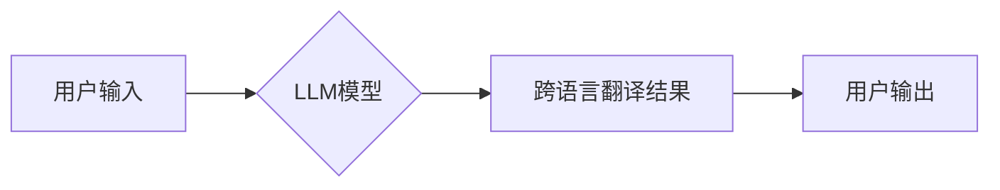

> Large Language Model (LLM), 跨语言沟通, 机器翻译, 自然语言处理 (NLP), 多语言理解, 跨语言对话, 语言模型, 深度学习

## 1. 背景介绍

在全球化时代，跨语言沟通已成为不可避免的挑战。传统的机器翻译系统往往存在准确性、流畅度和文化理解方面的缺陷，难以满足日益增长的跨语言交流需求。近年来，大型语言模型 (LLM) 的出现为跨语言沟通带来了革命性的变革。

LLM 是一种基于深度学习的强大人工智能模型，能够理解和生成人类语言。其强大的语义理解能力、海量文本数据训练和先进的解码算法，使得 LLM 在跨语言沟通领域展现出巨大的潜力。

## 2. 核心概念与联系

**2.1 跨语言沟通的挑战**

跨语言沟通面临着诸多挑战，包括：

* **语言差异:** 不同语言的语法、词汇和语义存在显著差异，这使得直接翻译难以准确传达原意。
* **文化差异:** 语言与文化紧密相连，不同的文化背景会导致对语言的理解和表达方式存在差异，这可能导致误解和沟通障碍。
* **数据稀缺:** 许多语言的数据量远低于英语等主流语言，这使得训练高质量的跨语言模型变得困难。

**2.2 LLM 的优势**

LLM 在跨语言沟通领域具有以下优势：

* **强大的语义理解能力:** LLM 可以学习语言的复杂语义关系，理解文本的深层含义，从而实现更准确的翻译。
* **海量文本数据训练:** LLM 通过训练海量文本数据，积累了丰富的语言知识和表达方式，能够生成更流畅、更自然的文本。
* **先进的解码算法:** LLM 使用先进的解码算法，例如 beam search，可以生成多个翻译候选，并选择最优的翻译结果。

**2.3 跨语言沟通的解决方案**

LLM 为跨语言沟通提供了新的解决方案，例如：

* **机器翻译:** LLM 可以实现更高质量、更流畅的机器翻译，突破传统机器翻译的局限性。
* **跨语言对话:** LLM 可以理解不同语言的对话内容，实现跨语言的实时对话。
* **多语言理解:** LLM 可以理解多种语言的文本，并进行跨语言的文本分析和信息提取。

**2.4 架构图**



## 3. 核心算法原理 & 具体操作步骤

**3.1 算法原理概述**

LLM 的核心算法原理是基于 Transformer 架构的深度学习模型。Transformer 模型利用自注意力机制，能够捕捉文本中长距离依赖关系，从而实现更准确的语义理解和文本生成。

**3.2 算法步骤详解**

LLM 的训练过程主要包括以下步骤：

1. **数据预处理:** 将原始文本数据进行清洗、分词、标记等预处理操作，使其能够被模型理解。
2. **模型训练:** 使用训练数据训练 Transformer 模型，通过反向传播算法不断调整模型参数，使其能够准确地预测下一个词。
3. **模型评估:** 使用测试数据评估模型的性能，例如准确率、流畅度等指标。
4. **模型部署:** 将训练好的模型部署到实际应用场景中，例如机器翻译系统、聊天机器人等。

**3.3 算法优缺点**

**优点:**

* 强大的语义理解能力
* 高效的训练速度
* 可扩展性强

**缺点:**

* 训练成本高
* 数据依赖性强
* 容易受到攻击

**3.4 算法应用领域**

LLM 的应用领域非常广泛，包括：

* 机器翻译
* 文本摘要
* 问答系统
* 代码生成
* 聊天机器人

## 4. 数学模型和公式 & 详细讲解 & 举例说明

**4.1 数学模型构建**

LLM 的数学模型主要基于 Transformer 架构，其核心是自注意力机制。自注意力机制能够捕捉文本中词与词之间的关系，并赋予每个词不同的权重，从而实现更准确的语义理解。

**4.2 公式推导过程**

自注意力机制的计算公式如下：

$$
Attention(Q, K, V) = softmax(\frac{QK^T}{\sqrt{d_k}})V
$$

其中：

* $Q$：查询矩阵
* $K$：键矩阵
* $V$：值矩阵
* $d_k$：键向量的维度
* $softmax$：softmax 函数

**4.3 案例分析与讲解**

例如，在翻译句子 "The cat sat on the mat" 时，自注意力机制可以捕捉到 "cat" 和 "sat" 之间的动宾关系，以及 "sat" 和 "mat" 之间的动作地点关系，从而帮助模型更准确地理解句子的含义。

## 5. 项目实践：代码实例和详细解释说明

**5.1 开发环境搭建**

* Python 3.7+
* PyTorch 或 TensorFlow
* CUDA 和 cuDNN

**5.2 源代码详细实现**

```python
import torch
import torch.nn as nn

class Transformer(nn.Module):
    def __init__(self, vocab_size, embedding_dim, num_heads, num_layers):
        super(Transformer, self).__init__()
        self.embedding = nn.Embedding(vocab_size, embedding_dim)
        self.transformer_layers = nn.ModuleList([
            nn.TransformerEncoderLayer(embedding_dim, num_heads)
            for _ in range(num_layers)
        ])
        self.linear = nn.Linear(embedding_dim, vocab_size)

    def forward(self, x):
        x = self.embedding(x)
        for layer in self.transformer_layers:
            x = layer(x)
        x = self.linear(x)
        return x
```

**5.3 代码解读与分析**

* `Transformer` 类定义了 Transformer 模型的结构。
* `embedding` 层将单词转换为向量表示。
* `transformer_layers` 是一个列表，包含多个 Transformer Encoder Layer。
* `linear` 层将向量表示转换为单词预测概率。

**5.4 运行结果展示**

训练好的 Transformer 模型可以用于机器翻译、文本摘要等任务。

## 6. 实际应用场景

**6.1 机器翻译**

LLM 可以实现更高质量、更流畅的机器翻译，突破传统机器翻译的局限性。例如，Google Translate 使用 LLM 技术，显著提高了翻译的准确性和自然度。

**6.2 跨语言对话**

LLM 可以理解不同语言的对话内容，实现跨语言的实时对话。例如，一些聊天机器人可以使用 LLM 技术，与不同语言的用户进行交流。

**6.3 多语言理解**

LLM 可以理解多种语言的文本，并进行跨语言的文本分析和信息提取。例如，一些搜索引擎可以使用 LLM 技术，理解用户搜索的多种语言查询，并提供相应的搜索结果。

**6.4 未来应用展望**

LLM 在跨语言沟通领域具有巨大的潜力，未来应用场景将更加广泛，例如：

* **跨语言教育:** LLM 可以帮助学生学习不同语言，并进行跨语言的交流。
* **跨语言医疗:** LLM 可以帮助医生理解患者的语言，并提供更精准的医疗服务。
* **跨语言商务:** LLM 可以帮助企业进行跨语言的商务交流，拓展海外市场。

## 7. 工具和资源推荐

**7.1 学习资源推荐**

* **论文:** "Attention Is All You Need"
* **书籍:** "Deep Learning"
* **在线课程:** Coursera, edX

**7.2 开发工具推荐**

* **PyTorch:** https://pytorch.org/
* **TensorFlow:** https://www.tensorflow.org/

**7.3 相关论文推荐**

* "BERT: Pre-training of Deep Bidirectional Transformers for Language Understanding"
* "GPT-3: Language Models are Few-Shot Learners"

## 8. 总结：未来发展趋势与挑战

**8.1 研究成果总结**

LLM 在跨语言沟通领域取得了显著的成果，例如机器翻译的准确性和流畅度显著提高，跨语言对话也更加自然流畅。

**8.2 未来发展趋势**

* **模型规模更大:** 未来 LLM 模型的规模将进一步扩大，从而提升其语义理解能力和文本生成能力。
* **多模态理解:** LLM 将与其他模态数据，例如图像、音频等进行融合，实现多模态的跨语言理解。
* **个性化定制:** LLM 将能够根据用户的个性化需求进行定制，提供更加精准的跨语言服务。

**8.3 面临的挑战**

* **数据稀缺:** 许多语言的数据量远低于英语等主流语言，这使得训练高质量的跨语言模型变得困难。
* **文化理解:** 语言与文化紧密相连，LLM 需要进一步提升其文化理解能力，才能更好地应对跨文化交流的挑战。
* **伦理问题:** LLM 的应用可能带来一些伦理问题，例如信息安全、数据隐私等，需要引起足够的重视。

**8.4 研究展望**

未来，LLM 在跨语言沟通领域将继续发挥重要作用，推动跨语言交流的进步。研究者需要不断探索新的算法、模型和应用场景，以解决当前面临的挑战，并为人类社会带来更多价值。

## 9. 附录：常见问题与解答

**9.1 如何训练一个 LLM 模型？**

训练一个 LLM 模型需要大量的计算资源和数据。一般来说，需要使用高性能的 GPU 和海量文本数据进行训练。

**9.2 如何评估 LLM 模型的性能？**

LLM 模型的性能可以评估多种指标，例如准确率、流畅度、BLEU 分数等。

**9.3 LLM 模型有哪些应用场景？**

LLM 的应用场景非常广泛，包括机器翻译、文本摘要、问答系统、代码生成、聊天机器人等。


作者：禅与计算机程序设计艺术 / Zen and the Art of Computer Programming 
<end_of_turn>