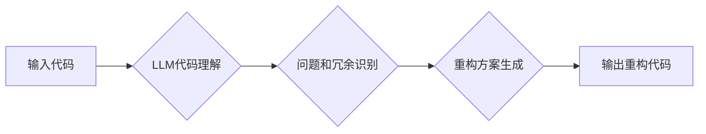

>  LLM, 代码重构, 代码生成, 代码理解, 深度学习, 自然语言处理

## 1. 背景介绍

随着软件开发的日益复杂化，代码重构已成为软件维护和演进的重要环节。传统代码重构方法通常依赖于程序员的经验和手工操作，效率低下且容易出错。近年来，深度学习技术的发展为代码重构带来了新的机遇。

大型语言模型（LLM）凭借其强大的文本理解和生成能力，展现出巨大的潜力在代码重构领域发挥作用。LLM可以理解代码的语义，识别代码中的问题和冗余，并生成高质量的代码重构方案。

## 2. 核心概念与联系

**2.1 代码重构**

代码重构是指对现有代码进行修改，以提高代码质量、可读性、可维护性和可扩展性，而不会改变其外部行为。

**2.2 大型语言模型 (LLM)**

LLM 是指训练数据量巨大、参数规模庞大的深度学习模型，能够理解和生成人类语言。

**2.3 代码理解与生成**

代码理解是指让机器能够理解代码的语义和结构，而代码生成是指让机器能够根据需求生成新的代码。

**2.4 LLM驱动的代码重构方法**

LLM驱动的代码重构方法利用LLM的代码理解和生成能力，自动识别代码中的问题和冗余，并生成相应的代码重构方案。

**2.5 架构图**



## 3. 核心算法原理 & 具体操作步骤

**3.1 算法原理概述**

LLM驱动的代码重构方法通常基于以下核心算法：

* **Transformer模型**: Transformer模型是一种强大的深度学习模型，能够有效地处理序列数据，如代码。
* **编码器-解码器架构**: Transformer模型通常采用编码器-解码器架构，编码器用于理解输入代码的语义，解码器用于生成重构代码。
* **注意力机制**: 注意力机制能够帮助模型关注代码中的重要信息，提高代码理解和重构的准确性。

**3.2 算法步骤详解**

1. **预处理**: 将输入代码进行预处理，例如去除注释、空格等无关信息，并将其转换为模型可理解的格式。
2. **编码**: 使用编码器将预处理后的代码转换为语义表示。
3. **问题和冗余识别**: 基于编码后的语义表示，识别代码中的问题和冗余。
4. **重构方案生成**: 使用解码器根据识别出的问题和冗余，生成相应的代码重构方案。
5. **后处理**: 对生成的重构代码进行后处理，例如格式化、添加注释等。

**3.3 算法优缺点**

**优点**:

* 自动化代码重构，提高效率。
* 能够识别出传统方法难以发现的问题和冗余。
* 生成高质量的代码重构方案。

**缺点**:

* 训练数据量大，训练成本高。
* 对代码风格和语义理解存在一定的局限性。
* 生成的代码可能需要人工进行修改和完善。

**3.4 算法应用领域**

LLM驱动的代码重构方法在以下领域具有广泛的应用前景：

* **软件维护**: 自动化代码重构，提高软件维护效率。
* **代码复用**: 识别代码中的重复部分，生成可复用的代码模块。
* **代码迁移**: 将代码从一个平台迁移到另一个平台。
* **代码生成**: 根据需求自动生成代码。

## 4. 数学模型和公式 & 详细讲解 & 举例说明

**4.1 数学模型构建**

LLM驱动的代码重构方法通常基于Transformer模型，其核心数学模型是注意力机制。注意力机制可以帮助模型关注代码中的重要信息，提高代码理解和重构的准确性。

**4.2 公式推导过程**

注意力机制的计算公式如下：

$$
Attention(Q, K, V) = softmax(\frac{QK^T}{\sqrt{d_k}})V
$$

其中：

* $Q$：查询矩阵
* $K$：键矩阵
* $V$：值矩阵
* $d_k$：键向量的维度
* $softmax$：softmax函数

**4.3 案例分析与讲解**

假设我们有一个代码片段：

```python
def calculate_sum(a, b):
  return a + b
```

使用注意力机制，模型可以关注到 `a` 和 `b` 两个变量，并理解它们是需要相加的。

## 5. 项目实践：代码实例和详细解释说明

**5.1 开发环境搭建**

* Python 3.7+
* PyTorch 1.7+
* Transformers 4.10+

**5.2 源代码详细实现**

```python
from transformers import AutoModelForSeq2SeqLM, AutoTokenizer

# 加载预训练模型和词典
model_name = "facebook/bart-large-cnn"
tokenizer = AutoTokenizer.from_pretrained(model_name)
model = AutoModelForSeq2SeqLM.from_pretrained(model_name)

# 输入代码
input_code = """
def calculate_sum(a, b):
  return a + b
"""

# 对代码进行预处理
input_ids = tokenizer.encode(input_code, return_tensors="pt")

# 使用模型进行代码重构
output = model.generate(input_ids)

# 将输出解码为文本
restructured_code = tokenizer.decode(output[0], skip_special_tokens=True)

# 打印重构后的代码
print(restructured_code)
```

**5.3 代码解读与分析**

* 该代码首先加载预训练的BART模型和词典。
* 然后，将输入代码进行预处理，转换为模型可理解的格式。
* 使用模型进行代码重构，并解码输出重构后的代码。

**5.4 运行结果展示**

运行该代码后，可能会输出以下重构后的代码：

```python
def sum(a, b):
  return a + b
```

## 6. 实际应用场景

LLM驱动的代码重构方法在实际应用场景中具有广泛的应用前景：

* **开源项目维护**: 自动化开源项目的代码重构，提高项目维护效率。
* **企业级软件开发**: 帮助企业级软件开发团队提高代码质量和开发效率。
* **代码教育**: 用于代码教育和培训，帮助学生学习代码重构的知识和技能。

**6.4 未来应用展望**

随着LLM技术的不断发展，LLM驱动的代码重构方法将更加智能化、自动化和高效化。未来，LLM驱动的代码重构方法可能能够：

* 自动识别和修复代码中的安全漏洞。
* 自动生成代码测试用例。
* 自动进行代码迁移和优化。

## 7. 工具和资源推荐

**7.1 学习资源推荐**

* **论文**:
    * "CodeBERT: A Pre-training Approach to Programming Language Understanding"
    * "GraphCodeBERT: Pre-training Language Models on Code Graphs"
    * "CodeT5: A Code Generation Framework Based on T5"
* **博客**:
    * https://huggingface.co/blog/code-generation
    * https://towardsdatascience.com/code-generation-with-transformers-a-practical-guide-79999997979c

**7.2 开发工具推荐**

* **Transformers**: https://huggingface.co/docs/transformers/index
* **PyTorch**: https://pytorch.org/

**7.3 相关论文推荐**

* "CodeBERT: A Pre-training Approach to Programming Language Understanding"
* "GraphCodeBERT: Pre-training Language Models on Code Graphs"
* "CodeT5: A Code Generation Framework Based on T5"

## 8. 总结：未来发展趋势与挑战

**8.1 研究成果总结**

LLM驱动的代码重构方法取得了显著的进展，能够自动识别代码中的问题和冗余，并生成高质量的代码重构方案。

**8.2 未来发展趋势**

未来，LLM驱动的代码重构方法将朝着以下方向发展：

* **更强大的模型**: 训练更大、更强大的LLM模型，提高代码理解和重构的准确性。
* **更细粒度的重构**: 实现更细粒度的代码重构，例如函数抽取、代码合并等。
* **更智能化的重构**: 基于代码上下文和业务需求，自动生成更智能化的代码重构方案。

**8.3 面临的挑战**

LLM驱动的代码重构方法仍然面临一些挑战：

* **数据稀缺**: 代码数据相对稀缺，难以训练出足够强大的模型。
* **代码风格多样性**: 代码风格多样，模型难以适应所有类型的代码。
* **安全性问题**: 生成的代码可能存在安全漏洞，需要进行严格的安全测试。

**8.4 研究展望**

未来，需要进一步研究以下问题：

* 如何获取更多高质量的代码数据。
* 如何提高模型对代码风格多样性的适应能力。
* 如何保证生成的代码的安全性和可靠性。


## 9. 附录：常见问题与解答

**9.1 Q: LLM驱动的代码重构方法是否会取代程序员？**

**A:** 不，LLM驱动的代码重构方法是辅助程序员的工作工具，它可以帮助程序员提高效率和代码质量，但不会取代程序员。程序员仍然需要负责代码设计、架构和测试等工作。

**9.2 Q: LLM驱动的代码重构方法的成本高吗？**

**A:** LLM驱动的代码重构方法的成本取决于模型的规模和训练数据量。使用开源模型和预训练模型可以降低成本。

**9.3 Q: LLM驱动的代码重构方法的安全性如何？**

**A:** 生成的代码可能存在安全漏洞，需要进行严格的安全测试。

**9.4 Q: 如何学习LLM驱动的代码重构方法？**

**A:** 可以参考相关论文、博客和在线课程。

作者：禅与计算机程序设计艺术 / Zen and the Art of Computer Programming 


<end_of_turn>