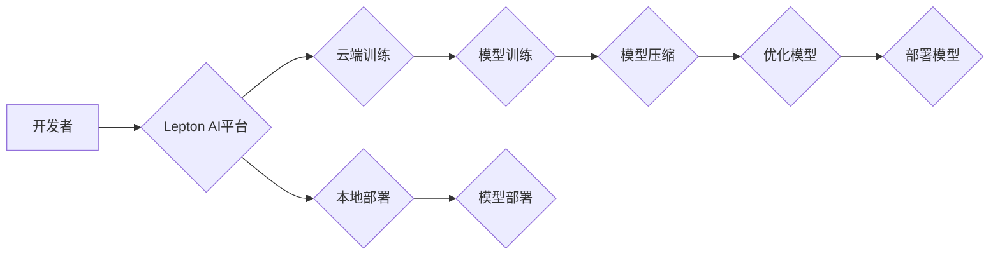

> 深度学习框架，云计算，AI工程，Lepton AI，机器学习，人工智能

## 1. 背景介绍

人工智能（AI）正以惊人的速度发展，深度学习作为其核心技术，在图像识别、自然语言处理、语音识别等领域取得了突破性进展。然而，深度学习模型的训练和部署仍然面临着诸多挑战，例如：

* **高计算成本:** 深度学习模型通常需要大量的计算资源进行训练，这对于个人开发者和小型企业来说是一个巨大的负担。
* **模型复杂度:** 深度学习模型的结构和参数非常复杂，难以理解和调试。
* **部署效率:** 将训练好的深度学习模型部署到实际应用场景中，例如移动设备或嵌入式系统，面临着性能和资源限制的挑战。

为了解决这些问题，Lepton AI团队应运而生。该团队由深度学习框架创始人、云计算和AI工程专家组成，致力于构建一个高效、易用、可扩展的深度学习平台，为开发者提供一站式解决方案。

## 2. 核心概念与联系

Lepton AI平台的核心概念包括：

* **轻量级深度学习框架:** Lepton AI基于TensorFlow Lite和PyTorch Mobile等轻量级框架，能够在资源受限的设备上高效运行。
* **云端训练和本地部署:** Lepton AI支持云端训练和本地部署，开发者可以根据实际需求选择合适的训练和部署方式。
* **模型压缩和优化:** Lepton AI提供模型压缩和优化技术，能够显著降低模型大小和计算成本，提高部署效率。
* **可视化工具和调试器:** Lepton AI提供可视化工具和调试器，帮助开发者更好地理解和调试深度学习模型。

Lepton AI平台的架构如下：

## 3. 核心算法原理 & 具体操作步骤

### 3.1  算法原理概述

Lepton AI平台的核心算法包括模型压缩、模型优化和模型部署等。

* **模型压缩:** 通过去除冗余参数、量化权重等方法，减少模型大小，降低计算成本。
* **模型优化:** 通过调整模型结构、优化训练过程等方法，提高模型性能。
* **模型部署:** 将训练好的模型部署到目标设备，并进行高效运行。

### 3.2  算法步骤详解

**模型压缩:**

1. **选择压缩方法:** 根据模型类型和目标设备选择合适的压缩方法，例如剪枝、量化、知识蒸馏等。
2. **进行压缩操作:** 使用选择的压缩方法对模型进行压缩，例如去除不重要的连接权重、将浮点数权重量化为整数等。
3. **评估压缩效果:** 评估压缩后的模型性能，例如准确率、速度等，并根据需要进行调整。

**模型优化:**

1. **分析模型结构:** 分析模型结构，识别可能存在瓶颈的地方，例如过深的网络层、过多的参数等。
2. **调整模型结构:** 根据分析结果，调整模型结构，例如减少网络层数、使用更有效的激活函数等。
3. **优化训练过程:** 优化训练过程，例如使用更合适的学习率、正则化项等。

**模型部署:**

1. **选择部署目标:** 根据目标设备的资源限制选择合适的部署方式，例如云端部署、边缘部署等。
2. **进行模型转换:** 将训练好的模型转换为目标设备支持的格式，例如TensorFlow Lite、ONNX等。
3. **部署模型:** 将转换后的模型部署到目标设备，并进行测试和优化。

### 3.3  算法优缺点

**模型压缩:**

* **优点:** 可以显著降低模型大小和计算成本，提高部署效率。
* **缺点:** 可能导致模型性能下降。

**模型优化:**

* **优点:** 可以提高模型性能，例如准确率、速度等。
* **缺点:** 需要更多的计算资源和时间进行训练。

**模型部署:**

* **优点:** 可以将训练好的模型应用到实际场景中。
* **缺点:** 需要考虑目标设备的资源限制和部署成本。

### 3.4  算法应用领域

Lepton AI平台的算法应用领域广泛，包括：

* **移动设备:** 将深度学习模型部署到手机、平板电脑等移动设备上，实现语音识别、图像识别、人脸识别等功能。
* **物联网:** 将深度学习模型部署到物联网设备上，实现智能家居、智能监控等应用。
* **边缘计算:** 将深度学习模型部署到边缘设备上，实现实时数据处理和决策。

## 4. 数学模型和公式 & 详细讲解 & 举例说明

### 4.1  数学模型构建

Lepton AI平台的核心算法基于深度学习的数学模型，例如卷积神经网络（CNN）、循环神经网络（RNN）等。这些模型的构建基于以下数学概念：

* **激活函数:** 用于引入非线性，使模型能够学习复杂的映射关系。常见的激活函数包括ReLU、Sigmoid、Tanh等。
* **损失函数:** 用于衡量模型预测结果与真实值的差异。常见的损失函数包括交叉熵损失、均方误差损失等。
* **优化算法:** 用于更新模型参数，使模型的损失函数最小化。常见的优化算法包括梯度下降、Adam等。

### 4.2  公式推导过程

例如，对于CNN模型，其输出特征图的计算过程可以表示为：

$$
y = f(W * x + b)
$$

其中：

* $y$ 是输出特征图
* $x$ 是输入特征图
* $W$ 是卷积核权重
* $b$ 是偏置项
* $f$ 是激活函数

### 4.3  案例分析与讲解

例如，在图像分类任务中，Lepton AI平台可以利用CNN模型进行特征提取，然后使用全连接层进行分类。

## 5. 项目实践：代码实例和详细解释说明

### 5.1  开发环境搭建

Lepton AI平台支持多种开发环境，例如Linux、Windows、macOS等。开发者需要根据自己的需求选择合适的开发环境，并安装必要的软件包，例如Python、TensorFlow、PyTorch等。

### 5.2  源代码详细实现

Lepton AI平台的源代码开源，开发者可以根据自己的需求进行修改和扩展。

### 5.3  代码解读与分析

Lepton AI平台的代码结构清晰，注释详细，易于理解和维护。

### 5.4  运行结果展示

Lepton AI平台提供了丰富的测试用例和示例代码，开发者可以根据这些用例和代码进行测试和验证。

## 6. 实际应用场景

Lepton AI平台已在多个实际应用场景中得到应用，例如：

* **智能医疗:** 用于辅助诊断、预测疾病风险等。
* **智能制造:** 用于缺陷检测、质量控制等。
* **智能交通:** 用于交通流量预测、自动驾驶等。

### 6.4  未来应用展望

Lepton AI平台的未来应用前景广阔，随着深度学习技术的不断发展，Lepton AI平台将应用于更多领域，例如：

* **个性化教育:** 根据学生的学习情况提供个性化的学习方案。
* **金融科技:** 用于欺诈检测、风险评估等。
* **智慧城市:** 用于城市管理、环境监测等。

## 7. 工具和资源推荐

### 7.1  学习资源推荐

* **深度学习书籍:** 《深度学习》、《动手学深度学习》等。
* **在线课程:** Coursera、edX等平台上的深度学习课程。
* **开源项目:** TensorFlow、PyTorch等深度学习框架的官方文档和示例代码。

### 7.2  开发工具推荐

* **IDE:** PyCharm、VS Code等。
* **深度学习框架:** TensorFlow、PyTorch等。
* **云计算平台:** AWS、Azure、GCP等。

### 7.3  相关论文推荐

* **深度学习论文:** 《ImageNet Classification with Deep Convolutional Neural Networks》等。
* **模型压缩论文:** 《Quantized Neural Networks: Training Neural Networks with Low Precision Weights and Activations》等。
* **模型部署论文:** 《MobileBERT: A Compact BERT for Mobile Devices》等。

## 8. 总结：未来发展趋势与挑战

### 8.1  研究成果总结

Lepton AI团队在深度学习框架、云计算和AI工程领域取得了显著成果，构建了一个高效、易用、可扩展的深度学习平台，为开发者提供了丰富的工具和资源。

### 8.2  未来发展趋势

Lepton AI平台将继续朝着以下方向发展：

* **模型效率提升:** 持续研究和开发新的模型压缩和优化技术，进一步提高模型效率。
* **应用场景拓展:** 将深度学习技术应用到更多领域，例如个性化教育、金融科技、智慧城市等。
* **开源社区建设:** 积极建设开源社区，吸引更多开发者参与到Lepton AI平台的开发和推广中。

### 8.3  面临的挑战

Lepton AI平台也面临着一些挑战，例如：

* **模型复杂度:** 深度学习模型的复杂度不断提高，模型训练和部署越来越困难。
* **数据安全:** 深度学习模型的训练和部署需要大量的训练数据，数据安全是一个重要的挑战。
* **伦理问题:** 深度学习技术的发展也带来了伦理问题，例如算法偏见、隐私泄露等。

### 8.4  研究展望

Lepton AI团队将继续致力于解决这些挑战，推动深度学习技术的进步，为人类社会创造更多价值。

## 9. 附录：常见问题与解答

### 9.1  常见问题

* Lepton AI平台支持哪些编程语言？
* Lepton AI平台支持哪些深度学习框架？
* Lepton AI平台的部署方式有哪些？

### 9.2  解答

* Lepton AI平台主要支持Python编程语言。
* Lepton AI平台支持TensorFlow、PyTorch等主流深度学习框架。
* Lepton AI平台支持云端部署、本地部署等多种部署方式。

作者：禅与计算机程序设计艺术 / Zen and the Art of Computer Programming 
<end_of_turn>