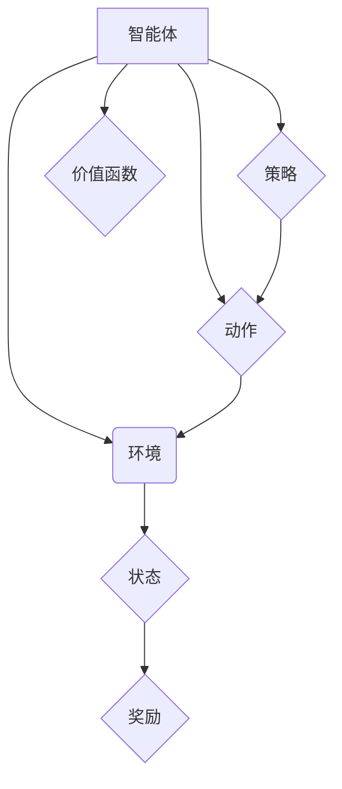

> 强化学习，RL，Q学习，深度强化学习，环境，状态，动作，奖励，策略，价值函数

## 1. 背景介绍

在机器学习领域，监督学习和无监督学习占据了主导地位。然而，在许多现实世界问题中，这些方法难以直接应用。例如，训练一个机器人如何玩游戏，或者让无人驾驶汽车做出安全决策，都需要机器能够从环境中学习，并根据自己的行为获得奖励或惩罚。这就是强化学习（Reinforcement Learning，RL）应运而生的背景。

强化学习是一种基于交互学习的机器学习方法，它允许智能体通过与环境的交互来学习最优的行为策略。智能体在环境中采取行动，并根据环境的反馈（奖励或惩罚）调整其策略，以最大化累积的奖励。

## 2. 核心概念与联系

**核心概念：**

* **智能体 (Agent):**  学习和决策的实体，例如机器人、游戏玩家或算法。
* **环境 (Environment):** 智能体所处的外部世界，它会根据智能体的动作产生状态变化和奖励。
* **状态 (State):** 环境在特定时刻的描述，例如游戏中的棋盘状态或无人驾驶汽车的周围环境。
* **动作 (Action):** 智能体可以采取的行动，例如移动、射击或改变方向。
* **奖励 (Reward):** 环境对智能体动作的反馈，可以是正向奖励（鼓励智能体重复该动作）或负向惩罚（惩罚智能体重复该动作）。
* **策略 (Policy):** 智能体根据当前状态选择动作的规则，可以是确定性策略（每个状态对应唯一动作）或概率性策略（每个状态对应多个动作的概率分布）。
* **价值函数 (Value Function):**  评估智能体在特定状态下采取特定策略的长期奖励的能力。

**核心概念联系：**



## 3. 核心算法原理 & 具体操作步骤

### 3.1  算法原理概述

Q学习是强化学习中最经典的算法之一，它通过学习一个Q表来估计每个状态-动作对的价值。Q表是一个表格，其中每个单元格存储了智能体在特定状态下采取特定动作的期望累积奖励。

### 3.2  算法步骤详解

1. **初始化Q表:** 将Q表中的所有值初始化为0或一个小随机数。
2. **选择动作:** 根据当前状态，智能体使用ε-贪婪策略选择动作。ε-贪婪策略是指以概率ε随机选择一个动作，以概率1-ε选择Q表中最大值的动作。
3. **执行动作:** 智能体在环境中执行选择的动作，并观察环境的反馈（下一个状态和奖励）。
4. **更新Q值:** 使用Bellman方程更新Q表中的值：

 $$Q(s,a) = Q(s,a) + \alpha [r + \gamma \max_{a'} Q(s',a') - Q(s,a)]$$

其中：

* $Q(s,a)$ 是当前状态s下采取动作a的Q值。
* $r$ 是从状态s采取动作a获得的奖励。
* $s'$ 是执行动作a后进入的下一个状态。
* $a'$ 是下一个状态s'下采取的动作。
* $\gamma$ 是折扣因子，控制未来奖励的权重。
* $\alpha$ 是学习率，控制学习速度。

5. **重复步骤2-4:** 直到智能体达到预设的终止条件，例如达到最大迭代次数或累积奖励达到目标值。

### 3.3  算法优缺点

**优点:**

* 算法简单易懂，易于实现。
* 可以应用于离散状态和动作空间的问题。
* 能够学习出有效的策略。

**缺点:**

* 对于连续状态和动作空间的问题，Q表会变得非常庞大，难以存储和更新。
* 学习效率可能较低，尤其是在复杂的环境中。

### 3.4  算法应用领域

Q学习算法广泛应用于以下领域：

* **游戏AI:** 训练游戏中的智能体学习策略，例如玩游戏、控制角色等。
* **机器人控制:** 训练机器人学习控制策略，例如导航、抓取、操作等。
* **推荐系统:** 训练推荐系统学习用户偏好，并推荐相关的商品或内容。
* **金融交易:** 训练交易策略，自动进行股票交易等。

## 4. 数学模型和公式 & 详细讲解 & 举例说明

### 4.1  数学模型构建

强化学习的数学模型可以概括为一个马尔可夫决策过程 (MDP)，它由以下四个要素组成：

* **状态空间 S:** 所有可能的系统状态的集合。
* **动作空间 A:** 在每个状态下智能体可以采取的所有动作的集合。
* **转移概率 P(s',r|s,a):** 从状态s采取动作a后，转移到状态s'并获得奖励r的概率。
* **奖励函数 R(s,a):** 智能体在状态s采取动作a后获得的奖励。

### 4.2  公式推导过程

Q学习算法的核心是Bellman方程，它描述了Q值的更新规则：

$$Q(s,a) = Q(s,a) + \alpha [r + \gamma \max_{a'} Q(s',a') - Q(s,a)]$$

其中：

* $Q(s,a)$ 是当前状态s下采取动作a的Q值。
* $r$ 是从状态s采取动作a获得的奖励。
* $s'$ 是执行动作a后进入的下一个状态。
* $a'$ 是下一个状态s'下采取的动作。
* $\gamma$ 是折扣因子，控制未来奖励的权重。
* $\alpha$ 是学习率，控制学习速度。

### 4.3  案例分析与讲解

假设有一个简单的环境，智能体可以采取“左”或“右”两个动作，每个状态下获得的奖励为0或1。

如果智能体在某个状态下采取“左”动作，转移到下一个状态并获得奖励为1，那么根据Bellman方程，Q值将更新为：

$$Q(s, "左") = Q(s, "左") + \alpha [1 + \gamma \max_{a'} Q(s',a') - Q(s, "左")]$$

其中，$s'$ 是执行“左”动作后进入的下一个状态，$a'$ 是下一个状态下可以采取的动作。

## 5. 项目实践：代码实例和详细解释说明

### 5.1  开发环境搭建

* Python 3.x
* TensorFlow 或 PyTorch 等深度学习框架
* NumPy、Pandas 等数据处理库

### 5.2  源代码详细实现

```python
import numpy as np

# 定义环境
class Environment:
    def __init__(self):
        self.state = 0

    def step(self, action):
        if action == 0:  # 左
            self.state = (self.state - 1) % 4
        elif action == 1:  # 右
            self.state = (self.state + 1) % 4
        reward = 1 if self.state == 3 else 0
        return self.state, reward

# 定义Q学习算法
class QLearning:
    def __init__(self, env, alpha=0.1, gamma=0.9, epsilon=0.1):
        self.env = env
        self.alpha = alpha
        self.gamma = gamma
        self.epsilon = epsilon
        self.q_table = np.zeros((env.state, 2))

    def choose_action(self, state):
        if np.random.uniform(0, 1) < self.epsilon:
            return np.random.choice(2)
        else:
            return np.argmax(self.q_table[state])

    def learn(self, num_episodes):
        for episode in range(num_episodes):
            state = self.env.reset()
            done = False
            while not done:
                action = self.choose_action(state)
                next_state, reward = self.env.step(action)
                self.q_table[state, action] += self.alpha * (reward + self.gamma * np.max(self.q_table[next_state]) - self.q_table[state, action])
                state = next_state
                done = state == 3

# 创建环境和Q学习算法实例
env = Environment()
agent = QLearning(env, alpha=0.1, gamma=0.9, epsilon=0.1)

# 训练Q学习算法
agent.learn(num_episodes=1000)

# 测试训练后的策略
state = env.reset()
while True:
    action = agent.choose_action(state)
    next_state, reward = env.step(action)
    print(f"State: {state}, Action: {action}, Reward: {reward}")
    state = next_state
```

### 5.3  代码解读与分析

* **环境类:** 定义了环境的初始状态、状态转移规则和奖励函数。
* **Q学习类:** 实现Q学习算法的核心逻辑，包括选择动作、更新Q值等。
* **训练过程:** 使用循环迭代的方式，让智能体在环境中交互学习，更新Q值。
* **测试过程:** 使用训练后的Q值，让智能体在环境中执行动作，并观察其行为。

### 5.4  运行结果展示

运行代码后，会看到智能体在环境中不断探索，并逐渐学习到最优策略，最终能够达到目标状态。

## 6. 实际应用场景

### 6.1  游戏AI

强化学习在游戏AI领域有着广泛的应用，例如：

* **AlphaGo:** 利用深度强化学习击败世界围棋冠军。
* **Dota 2 AI:** 利用强化学习训练的AI在Dota 2游戏中取得了优异的成绩。

### 6.2  机器人控制

强化学习可以用于训练机器人学习控制策略，例如：

* **导航:** 训练机器人自主导航到目标位置。
* **抓取:** 训练机器人学习抓取和移动物体。
* **操作:** 训练机器人学习操作复杂设备。

### 6.3  推荐系统

强化学习可以用于训练推荐系统学习用户偏好，并推荐相关的商品或内容。

### 6.4  未来应用展望

强化学习在未来将有更广泛的应用，例如：

* **自动驾驶:** 训练自动驾驶汽车学习安全驾驶策略。
* **医疗诊断:** 训练机器学习诊断疾病。
* **金融交易:** 训练交易策略，自动进行股票交易等。

## 7. 工具和资源推荐

### 7.1  学习资源推荐

* **书籍:**
    * Reinforcement Learning: An Introduction by Richard S. Sutton and Andrew G. Barto
    * Deep Reinforcement Learning Hands-On by Maxim Lapan
* **在线课程:**
    * Coursera: Reinforcement Learning Specialization by David Silver
    * Udacity: Deep Reinforcement Learning Nanodegree

### 7.2  开发工具推荐

* **TensorFlow:** 深度学习框架，支持强化学习算法的实现。
* **PyTorch:** 深度学习框架，支持强化学习算法的实现。
* **OpenAI Gym:** 强化学习环境库，提供各种标准的强化学习环境。

### 7.3  相关论文推荐

* **Deep Q-Network (DQN):** https://arxiv.org/abs/1312.5602
* **Proximal Policy Optimization (PPO):** https://arxiv.org/abs/1707.06347
* **Trust