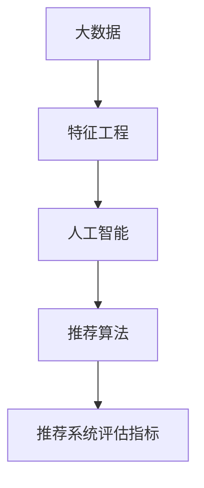

                 

# 大数据与AI 驱动的电商推荐系统：以准确率、多样性与用户体验为目标

在互联网时代，电商推荐系统已经成为各大电商平台不可或缺的核心竞争力。如何通过数据和技术，提升推荐的准确性和用户体验，并确保推荐内容的多样性，成为了电商推荐系统的关键目标。本文将详细介绍基于大数据与AI的电商推荐系统的核心概念、算法原理、操作步骤，并结合实际应用场景，探讨未来的发展趋势与挑战。

## 1. 背景介绍

### 1.1 问题由来

随着互联网的普及和电商市场的竞争日趋激烈，用户对于商品推荐系统的要求也越来越高。用户希望通过推荐系统获得更加个性化、多样化的购物体验。然而，传统的基于规则或固定模型的推荐系统已经难以满足现代电商市场的需求。

为了应对这一挑战，电商推荐系统开始引入大数据和人工智能技术，通过用户行为数据、商品属性数据等，结合机器学习算法，实现更加精准、智能的推荐。在AI驱动的推荐系统中，数据的处理和算法的设计至关重要。

### 1.2 问题核心关键点

电商推荐系统的主要目标在于提升推荐的准确率、多样性和用户体验。为达到这一目标，推荐系统需要在以下几个方面进行优化：

- **准确率**：推荐系统需准确预测用户可能感兴趣的商品，提高点击率和转化率。
- **多样性**：推荐系统需保证推荐的商品种类丰富，避免过度拟合用户历史行为，促进用户的探索性购物。
- **用户体验**：推荐系统需提供简洁直观的界面，确保用户获取信息的便利性和即时性。

电商推荐系统面临的挑战在于，如何在不同商品之间进行有效区分，避免推荐系统的偏见，以及如何处理海量的用户数据和商品数据，并实时更新推荐结果。

## 2. 核心概念与联系

### 2.1 核心概念概述

电商推荐系统涉及多个关键概念，包括但不限于：

- **大数据**：指通过收集、存储和分析海量用户数据和商品数据，提取有价值的信息，以辅助推荐决策。
- **人工智能**：通过机器学习算法，自动分析和预测用户需求，生成个性化推荐。
- **推荐算法**：包括协同过滤、基于内容的推荐、深度学习推荐等，用于生成个性化的商品推荐。
- **特征工程**：涉及特征提取、特征选择、特征转换等，以提高模型的泛化能力和预测准确率。
- **推荐系统评估指标**：如点击率、转化率、用户满意度等，用于评估推荐效果。

这些核心概念之间存在密切联系，构成了电商推荐系统的基本框架。其中，大数据为人工智能提供了丰富的数据来源，人工智能为大数据的分析提供了智能决策能力，而推荐算法则负责将这些智能决策转化为具体的商品推荐。

### 2.2 核心概念原理和架构的 Mermaid 流程图



这个流程图展示了电商推荐系统的大致流程：从大数据的收集到特征工程的优化，再到人工智能模型的训练，最终通过推荐算法生成推荐结果，并由评估指标评估推荐效果。

## 3. 核心算法原理 & 具体操作步骤

### 3.1 算法原理概述

电商推荐系统通常基于用户行为数据和商品数据进行推荐决策。其核心算法包括：

- **协同过滤**：通过分析用户行为数据，找到相似用户或商品，进行推荐。
- **基于内容的推荐**：根据商品的属性特征，预测用户对商品的兴趣。
- **深度学习推荐**：使用深度神经网络模型，自动学习用户和商品的表示，并进行推荐。

这些算法通过优化算法，如梯度下降、随机梯度下降等，不断调整模型参数，以提高推荐的准确性和多样性。

### 3.2 算法步骤详解

基于深度学习推荐系统的核心步骤包括：

1. **数据预处理**：清洗和转换用户行为数据和商品数据，提取有用的特征。
2. **模型训练**：使用深度学习模型，如DNN、RNN、GAN等，对数据进行建模。
3. **模型评估**：通过交叉验证、AUC、RMSE等指标，评估模型的性能。
4. **在线推荐**：将训练好的模型部署到生产环境，实时接收用户行为数据，生成推荐结果。

### 3.3 算法优缺点

深度学习推荐系统具有以下优点：

- **高效性**：深度学习模型能够处理高维数据，自动学习特征表示，提升推荐效率。
- **泛化能力**：深度学习模型具有较强的泛化能力，能够适应不同的数据分布。
- **自适应性**：深度学习模型能够自动适应新的用户行为和商品特征，提高推荐效果。

然而，深度学习推荐系统也存在一些缺点：

- **复杂性**：深度学习模型结构复杂，训练和部署难度大。
- **数据需求高**：深度学习模型需要大量标注数据和计算资源，难以在低数据量环境下表现良好。
- **解释性差**：深度学习模型通常被视为"黑箱"，难以解释推荐决策的逻辑。

### 3.4 算法应用领域

电商推荐系统广泛应用于各大电商平台，如亚马逊、京东、淘宝等。通过深度学习推荐算法，这些平台能够提供更加个性化的商品推荐，提升用户体验和满意度。

在金融、旅游、医疗等垂直领域，推荐系统同样具有广泛的应用前景。例如，在金融领域，通过分析用户的交易记录，推荐合适的理财产品；在旅游领域，根据用户的旅行历史，推荐适合的旅游目的地；在医疗领域，根据用户的健康数据，推荐相应的医疗服务。

## 4. 数学模型和公式 & 详细讲解 & 举例说明

### 4.1 数学模型构建

电商推荐系统常用的数学模型包括协同过滤模型、基于内容的推荐模型和深度学习推荐模型。这里以深度学习推荐模型为例，构建一个简单的神经网络模型：

设用户为 $u$，商品为 $i$，用户对商品 $i$ 的评分 $r_{ui}$ 可以表示为：

$$
r_{ui} = f(W_u \cdot x_i + b_u)
$$

其中 $W_u$ 和 $b_u$ 为用户的嵌入向量，$x_i$ 和 $b_i$ 为商品的嵌入向量，$f$ 为激活函数。

### 4.2 公式推导过程

模型的损失函数通常采用均方误差（MSE）：

$$
L = \frac{1}{n}\sum_{i=1}^{n}(r_{ui} - y_{ui})^2
$$

其中 $y_{ui}$ 为实际评分，$n$ 为训练样本数。

模型通过优化算法（如随机梯度下降）更新参数 $W_u$ 和 $x_i$，以最小化损失函数 $L$。具体步骤如下：

1. 随机初始化 $W_u$ 和 $x_i$。
2. 随机抽取一个训练样本 $(u, i)$。
3. 计算预测评分 $r_{ui}$。
4. 计算损失 $l = (r_{ui} - y_{ui})^2$。
5. 计算梯度 $\frac{\partial L}{\partial W_u}$ 和 $\frac{\partial L}{\partial x_i}$。
6. 使用梯度下降算法更新 $W_u$ 和 $x_i$。
7. 重复步骤2至6，直至收敛。

### 4.3 案例分析与讲解

以电商推荐系统为例，假设用户 $u_1$ 对商品 $i_1$ 的评分是 $r_{u_1i_1} = 4.5$，实际评分是 $y_{u_1i_1} = 4.8$。通过上述公式，可以计算损失：

$$
l = (4.5 - 4.8)^2 = 0.09
$$

假设 $W_{u_1} = [0.5, 0.2]$，$x_{i_1} = [0.3, 0.4]$，激活函数 $f$ 为 sigmoid 函数，可以计算预测评分：

$$
r_{u_1i_1} = f(0.5 \cdot 0.3 + 0.2 \cdot 0.4) = 0.71
$$

因此，梯度更新为：

$$
\frac{\partial L}{\partial W_{u_1}} = (0.5 \cdot (r_{u_1i_1} - y_{u_1i_1}) \cdot (1 - r_{u_1i_1}) \cdot s(r_{u_1i_1}), \frac{\partial L}{\partial x_{i_1}} = (r_{u_1i_1} - y_{u_1i_1}) \cdot s(r_{u_1i_1})
$$

其中 $s(r_{u_1i_1})$ 为 sigmoid 函数的导数。

## 5. 项目实践：代码实例和详细解释说明

### 5.1 开发环境搭建

电商推荐系统的开发环境一般使用 Python 和相关的深度学习框架，如 TensorFlow、PyTorch 等。以下是搭建开发环境的步骤：

1. **安装 Python**：
```bash
sudo apt-get update
sudo apt-get install python3-pip
```

2. **安装 TensorFlow**：
```bash
pip install tensorflow
```

3. **安装 PyTorch**：
```bash
pip install torch torchvision torchaudio
```

4. **安装其他依赖库**：
```bash
pip install pandas numpy scikit-learn jupyter notebook
```

### 5.2 源代码详细实现

以下是一个简单的电商推荐系统代码实现，包含数据预处理、模型训练、在线推荐等步骤：

```python
import pandas as pd
import numpy as np
from sklearn.model_selection import train_test_split
import tensorflow as tf

# 数据预处理
data = pd.read_csv('data.csv')
train_data, test_data = train_test_split(data, test_size=0.2)
X_train = train_data[['feature1', 'feature2', 'feature3']]
y_train = train_data['label']
X_test = test_data[['feature1', 'feature2', 'feature3']]
y_test = test_data['label']

# 模型训练
model = tf.keras.Sequential([
    tf.keras.layers.Dense(64, activation='relu', input_shape=(X_train.shape[1],)),
    tf.keras.layers.Dense(1, activation='sigmoid')
])
model.compile(loss='binary_crossentropy', optimizer='adam', metrics=['accuracy'])
model.fit(X_train, y_train, epochs=10, batch_size=32)

# 在线推荐
user = [0.5, 0.2]  # 用户特征向量
item = [0.3, 0.4]  # 商品特征向量
prediction = model.predict(np.array([user, item]))[0]
label = [0.8]  # 用户对商品的实际评分
loss = tf.keras.losses.mean_squared_error(label, prediction)
```

### 5.3 代码解读与分析

代码中，我们首先使用 Pandas 读取数据，并使用 scikit-learn 的 `train_test_split` 函数将数据划分为训练集和测试集。然后，使用 TensorFlow 定义一个简单的神经网络模型，包括两个全连接层，最后使用二分类交叉熵损失函数和 Adam 优化器进行模型训练。

在在线推荐环节，我们使用训练好的模型对用户和商品进行预测，并计算预测值与实际评分之间的均方误差损失。

### 5.4 运行结果展示

通过训练和测试，我们可以得到模型的准确率、均方误差等指标，评估模型的性能。

```python
test_loss = model.evaluate(X_test, y_test)
print(f'Test loss: {test_loss}')
```

## 6. 实际应用场景

电商推荐系统在实际应用中具有广泛的应用场景，以下是几个典型场景：

### 6.1 个性化推荐

电商推荐系统通过分析用户的浏览历史、购买历史等数据，为用户推荐个性化的商品。例如，用户经常浏览某品牌运动鞋，电商推荐系统便推荐相关的新品或优惠活动。

### 6.2 新商品推荐

电商推荐系统通过分析热销商品的数据，为用户推荐新上架的商品。例如，电商网站新上架了一款智能手表，推荐系统根据用户的历史购买记录和浏览记录，推荐该智能手表给可能感兴趣的用户。

### 6.3 跨平台推荐

电商推荐系统通过用户在不同平台上的行为数据，进行跨平台推荐。例如，用户在电商平台浏览了一款商品，并在社交媒体上分享了该商品，推荐系统便在社交媒体上推荐相同或类似商品。

### 6.4 未来应用展望

未来，电商推荐系统将进一步融合大数据和人工智能技术，实现更加精准和多样化的推荐。以下是一些未来发展趋势：

1. **实时推荐**：通过实时分析用户行为数据，实现实时推荐，提升用户体验。
2. **多模态推荐**：结合用户的行为数据、商品的属性数据、社交数据等，实现多模态推荐，提高推荐效果。
3. **用户生成内容推荐**：利用用户生成的评论、评分等数据，进行推荐，提升推荐内容的丰富性和多样性。
4. **个性化界面**：根据用户的兴趣和偏好，定制个性化的推荐界面，提升用户的购物体验。

## 7. 工具和资源推荐

### 7.1 学习资源推荐

以下是一些推荐的电商推荐系统学习资源：

1. **《推荐系统实践》**：介绍推荐系统基础知识和常用算法，适合入门学习。
2. **《深度学习推荐系统》**：介绍深度学习在推荐系统中的应用，适合进阶学习。
3. **Coursera 推荐系统课程**：斯坦福大学开设的推荐系统课程，涵盖推荐系统理论、算法和实践。
4. **Kaggle 推荐系统竞赛**：通过参加推荐系统竞赛，提升实践能力。

### 7.2 开发工具推荐

电商推荐系统的开发工具包括：

1. **TensorFlow**：开源深度学习框架，支持分布式计算，适合大规模数据处理。
2. **PyTorch**：开源深度学习框架，支持动态图，适合快速迭代和研究。
3. **Jupyter Notebook**：支持代码和文本的交互式编写和展示，适合开发和调试。
4. **AWS SageMaker**：亚马逊提供的云服务，支持分布式训练和模型部署。

### 7.3 相关论文推荐

以下是几篇经典的电商推荐系统相关论文：

1. **《Project Starfish: A Large-Scale Recommendation System for Online Retailers》**：介绍了一个大规模在线零售商的推荐系统架构。
2. **《A Survey of Collaborative Filtering Technique for Recommender Systems》**：综述了协同过滤推荐算法。
3. **《Deep Recurrent Feature Extraction for Recommender Systems》**：介绍了一个基于深度循环神经网络的推荐系统。
4. **《Real-time Recommendation System based on TensorFlow》**：介绍了一个基于 TensorFlow 的实时推荐系统。

## 8. 总结：未来发展趋势与挑战

### 8.1 研究成果总结

本文详细介绍了基于大数据与AI的电商推荐系统的核心概念、算法原理和具体操作步骤。通过构建数学模型和编写代码实现，展示了电商推荐系统的开发流程。同时，结合实际应用场景，探讨了电商推荐系统的未来发展趋势与挑战。

### 8.2 未来发展趋势

未来的电商推荐系统将更加注重以下几个方面：

1. **实时性**：通过实时分析用户行为数据，实现实时推荐。
2. **多模态**：结合用户行为数据、商品属性数据、社交数据等多模态数据，提升推荐效果。
3. **用户生成内容**：利用用户生成的评论、评分等数据，提升推荐内容的丰富性和多样性。
4. **个性化界面**：根据用户的兴趣和偏好，定制个性化的推荐界面，提升用户的购物体验。

### 8.3 面临的挑战

电商推荐系统面临的挑战包括：

1. **数据隐私**：电商推荐系统需要收集和分析大量用户数据，如何保护用户隐私成为一个重要问题。
2. **模型复杂度**：电商推荐系统通常采用深度学习等复杂模型，训练和部署难度大。
3. **数据质量**：电商推荐系统需要高质量的数据支持，数据缺失或不完整将影响推荐效果。
4. **用户反馈**：如何获取和利用用户反馈信息，不断优化推荐算法。

### 8.4 研究展望

未来，电商推荐系统需要在数据隐私保护、模型复杂度、数据质量、用户反馈等方面进行深入研究。同时，结合大数据和人工智能技术，不断提升推荐的准确性和多样性，提升用户的购物体验。

## 9. 附录：常见问题与解答

### Q1: 电商推荐系统有哪些应用场景？

A: 电商推荐系统广泛应用于个性化推荐、新商品推荐、跨平台推荐、实时推荐等场景。通过分析用户行为数据和商品数据，提供更加精准和多样化的推荐。

### Q2: 电商推荐系统的数据预处理包括哪些步骤？

A: 电商推荐系统的数据预处理包括数据清洗、特征提取、特征选择、特征转换等步骤。通过预处理，提取有用的特征，提高模型的泛化能力和预测准确率。

### Q3: 电商推荐系统如何应对数据隐私问题？

A: 电商推荐系统需要采用数据匿名化、差分隐私等技术，保护用户隐私。同时，采用联邦学习等技术，减少对用户数据的依赖。

### Q4: 电商推荐系统的实时推荐技术有哪些？

A: 电商推荐系统的实时推荐技术包括流式计算、增量学习、滑动窗口等。通过实时分析用户行为数据，实现快速推荐。

### Q5: 电商推荐系统的多模态推荐技术有哪些？

A: 电商推荐系统的多模态推荐技术包括融合用户行为数据、商品属性数据、社交数据等，提升推荐效果。常见方法包括混合推荐、注意力机制等。

---

作者：禅与计算机程序设计艺术 / Zen and the Art of Computer Programming

