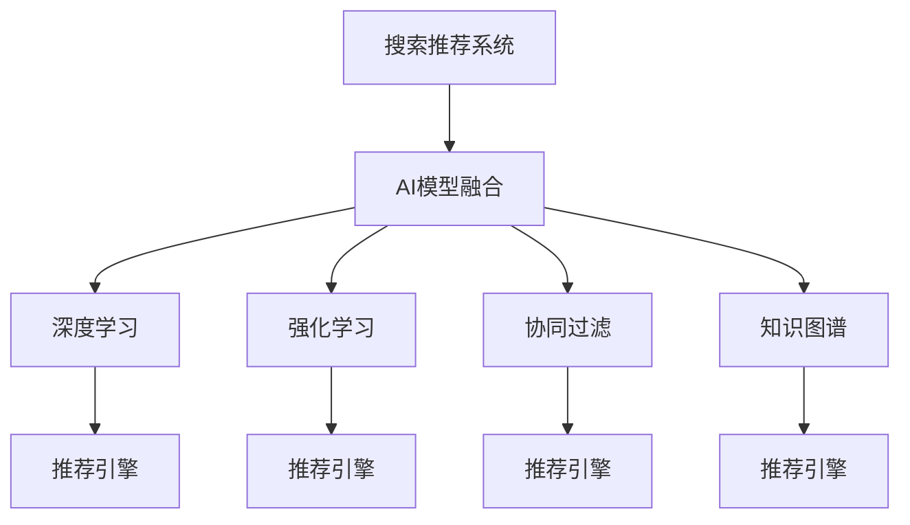

                 

# 大数据时代的电商平台转型：搜索推荐系统是核心，AI 模型融合是关键

在大数据时代的浪潮中，电商平台正面临着前所未有的机遇与挑战。如何通过技术革新，实现平台转型，提升用户体验，增强商业价值，成为了各大电商企业共同追求的目标。本文将以搜索推荐系统为核心，深入探讨AI模型融合在电商平台中的应用，为广大电商从业者提供实用的技术指导和创新思路。

## 1. 背景介绍

### 1.1 问题由来

随着互联网技术的飞速发展，电子商务市场规模不断扩大。用户对购物体验的需求也日益提升，传统的商品列表展示方式已无法满足其个性化、多样化的需求。因此，电商平台开始探索更加智能化的解决方案，以实现更加精准、便捷的购物体验。

当前，电商平台普遍面临着以下挑战：
- 海量商品库存管理难度大。如何高效地管理和推荐商品，提升库存周转率。
- 用户行为分析复杂。如何理解用户需求，预测其购买行为，实现精准推荐。
- 交易转化率低。如何提升用户转化率，增加平台销售额。

为了应对这些挑战，电商平台纷纷引入AI技术，特别是基于大数据的搜索推荐系统，通过智能算法为用户提供个性化推荐，提升用户体验和交易转化率。

### 1.2 问题核心关键点

AI模型融合在电商平台中的应用，关键在于如何构建搜索推荐系统，将复杂的用户行为数据和商品信息进行高效处理，实现精准推荐。具体来说，主要包括以下几个方面：
- 数据处理：如何高效地收集、存储和清洗用户行为数据和商品信息。
- 算法优化：如何选择合适的算法模型，并通过优化提升推荐效果。
- 模型部署：如何将模型快速部署到线上，实现实时推荐。
- 用户体验：如何提升用户体验，增加用户粘性和平台忠诚度。

## 2. 核心概念与联系

### 2.1 核心概念概述

为了更好地理解AI模型融合在电商平台中的应用，本节将介绍几个关键概念：

- 搜索推荐系统：基于用户的历史行为数据和商品信息，通过智能算法为用户推荐感兴趣的商品，提升购物体验。
- AI模型融合：将不同的AI模型（如深度学习、强化学习等）进行融合，形成更强大、更通用的推荐引擎。
- 深度学习：通过神经网络模型，学习用户行为和商品特征的复杂关系，实现更精准的推荐。
- 强化学习：通过奖励机制，训练推荐系统，最大化用户满意度，实现个性化推荐。
- 协同过滤：利用用户间的相似性，进行推荐。
- 知识图谱：通过构建商品和用户之间的知识图谱，实现更全面的推荐。

这些核心概念之间的逻辑关系可以通过以下Mermaid流程图来展示：



这个流程图展示了几大核心概念及其之间的联系：

1. 搜索推荐系统：是AI模型融合的目标和应用场景。
2. AI模型融合：将多种AI模型进行融合，形成推荐引擎。
3. 深度学习、强化学习、协同过滤、知识图谱：都是AI模型融合的重要组成部分，各具特点。
4. 推荐引擎：基于多种AI模型的融合，为用户提供个性化推荐。

## 3. 核心算法原理 & 具体操作步骤

### 3.1 算法原理概述

搜索推荐系统的核心在于通过算法模型，将用户的历史行为数据和商品信息进行高效处理，实现精准推荐。其算法原理主要基于以下步骤：

1. **数据采集与预处理**：收集用户的历史行为数据，包括浏览、点击、购买等行为，以及商品的信息，如价格、分类、评分等。对数据进行清洗、归一化等预处理，以便于后续的建模。

2. **特征工程**：从用户行为和商品信息中提取特征，如用户兴趣、商品属性等。利用特征工程技术，提高模型对数据的表征能力。

3. **模型选择与训练**：选择合适的模型，如深度学习、协同过滤、强化学习等，通过大量标注数据进行训练，优化模型参数。

4. **推荐计算**：在用户进行浏览、搜索等行为时，通过模型计算出推荐结果，如商品列表、相关商品等。

5. **效果评估**：通过评估指标（如点击率、转化率等）评估推荐系统的效果，并根据反馈不断优化模型。

### 3.2 算法步骤详解

以下将详细介绍搜索推荐系统的算法步骤：

#### 3.2.1 数据采集与预处理

- **数据来源**：用户行为数据来源于电商平台的用户登录日志、购物车记录、购买记录等。商品信息数据来源于电商平台的产品信息页面。

- **数据清洗**：去除重复数据、异常数据和无用数据，确保数据的完整性和准确性。

- **特征提取**：从用户行为数据中提取用户特征，如浏览时间、点击频率、购买历史等。从商品信息中提取商品特征，如价格、评分、分类等。

#### 3.2.2 特征工程

- **用户画像**：通过用户的浏览、购买行为，构建用户画像，描述用户的兴趣和偏好。

- **商品标签**：为商品打上标签，如价格区间、品牌、类别等，方便模型进行匹配。

- **特征组合**：将用户和商品的特征进行组合，生成新的特征，如用户对某一类商品的评分等。

#### 3.2.3 模型选择与训练

- **深度学习模型**：使用深度神经网络（如CNN、RNN、LSTM等），对用户和商品数据进行建模。

- **协同过滤模型**：利用用户之间的相似性，通过基于协同过滤的算法（如基于用户的协同过滤、基于物品的协同过滤），为用户推荐商品。

- **强化学习模型**：利用强化学习算法（如Q-learning、SARSA等），训练推荐系统，最大化用户满意度。

- **知识图谱模型**：构建商品和用户之间的知识图谱，通过图神经网络（如Graph Neural Network），进行推荐。

#### 3.2.4 推荐计算

- **实时推荐**：在用户进行浏览、搜索等行为时，通过模型计算出实时推荐结果，如商品列表、相关商品等。

- **跨域推荐**：利用知识图谱模型，将用户和商品映射到不同的领域，实现跨域推荐。

#### 3.2.5 效果评估

- **指标选择**：选择点击率（CTR）、转化率（CVR）、用户满意度等指标，评估推荐系统的效果。

- **模型优化**：根据评估结果，调整模型参数，优化模型性能。

### 3.3 算法优缺点

AI模型融合在搜索推荐系统中具有以下优点：

- **精准推荐**：通过深度学习、强化学习等先进算法，实现更精准的推荐。
- **动态调整**：实时获取用户行为数据，动态调整推荐策略，提升推荐效果。
- **个性化推荐**：通过用户画像、商品标签等，实现个性化的推荐。
- **跨域推荐**：通过知识图谱模型，实现跨域推荐，拓展推荐范围。

同时，也存在一些缺点：

- **高计算成本**：深度学习模型需要大量的计算资源，训练成本较高。
- **数据隐私问题**：用户行为数据涉及隐私，需保证数据安全和用户隐私。
- **模型复杂性**：多种模型融合，增加了模型的复杂性，需要更多的时间和资源进行优化。
- **效果评估**：推荐效果的评估标准和指标较多，需综合考虑多个指标。

### 3.4 算法应用领域

AI模型融合在电商平台的搜索推荐系统中有广泛的应用：

- **商品推荐**：根据用户的历史行为数据和商品信息，为用户推荐感兴趣的商品。
- **个性化搜索**：在用户搜索时，根据用户的查询历史和兴趣，推荐相关的商品。
- **跨域推荐**：利用知识图谱模型，实现不同领域商品的推荐。
- **内容推荐**：为内容平台提供个性化的文章、视频推荐。
- **个性化营销**：通过推荐系统，实现精准的营销策略。

除了电商领域，AI模型融合还可以应用于新闻推荐、社交媒体推荐、广告投放等多个领域，具有广阔的应用前景。

## 4. 数学模型和公式 & 详细讲解 & 举例说明

### 4.1 数学模型构建

在本节中，我们将使用数学语言对搜索推荐系统的核心算法进行更加严格的刻画。

假设用户的历史行为数据为 $U=\{u_1, u_2, \cdots, u_n\}$，其中 $u_i$ 表示第 $i$ 个用户，包含浏览、点击、购买等行为。商品信息为 $I=\{i_1, i_2, \cdots, i_m\}$，其中 $i_j$ 表示第 $j$ 个商品，包含价格、评分、分类等属性。

设推荐模型为 $F$，将用户行为数据和商品信息作为输入，输出推荐结果 $R=\{r_1, r_2, \cdots, r_m\}$，其中 $r_j$ 表示商品 $i_j$ 在用户 $u_i$ 的推荐列表中排名。

### 4.2 公式推导过程

以下将详细推导推荐系统的核心公式：

#### 4.2.1 协同过滤模型

协同过滤模型的核心在于利用用户之间的相似性，为用户推荐商品。假设用户 $u_i$ 和用户 $u_j$ 的相似度为 $s_{ij}$，商品 $i_j$ 和商品 $i_k$ 的相似度为 $s_{jk}$，则用户 $u_i$ 对商品 $i_k$ 的推荐程度为：

$$
r_{ik} = \sum_{j=1}^n s_{ij} \cdot s_{jk}
$$

其中 $s_{ij}$ 和 $s_{jk}$ 可以通过用户和商品的相似度矩阵 $S$ 计算得到：

$$
s_{ij} = \cos(\theta_i \cdot \theta_j) = \frac{\theta_i^T \theta_j}{\|\theta_i\| \|\theta_j\|}
$$

其中 $\theta_i$ 和 $\theta_j$ 分别表示用户 $i$ 和用户 $j$ 的特征向量。

#### 4.2.2 深度学习模型

深度学习模型的核心在于通过神经网络对用户和商品数据进行建模。假设用户行为数据 $U$ 和商品信息 $I$ 通过深度神经网络 $F$ 进行建模，输出推荐结果 $R$。设神经网络的隐藏层为 $h$，输出层为 $r$，则推荐结果为：

$$
r_{ik} = F(h(u_i, i_k))
$$

其中 $h(u_i, i_k)$ 表示输入用户行为数据 $u_i$ 和商品信息 $i_k$，通过神经网络得到隐藏层表示。

#### 4.2.3 强化学习模型

强化学习模型的核心在于利用奖励机制，训练推荐系统。假设用户对商品 $i_j$ 的评分 $c_{ij}$ 作为奖励信号，则推荐模型 $F$ 的目标是最小化预测评分与实际评分之间的差距：

$$
\min_{F} \sum_{i=1}^n \sum_{j=1}^m (c_{ij} - F(h(u_i, i_j)))^2
$$

其中 $h(u_i, i_j)$ 表示输入用户行为数据 $u_i$ 和商品信息 $i_j$，通过神经网络得到隐藏层表示。

#### 4.2.4 知识图谱模型

知识图谱模型的核心在于构建商品和用户之间的知识图谱，通过图神经网络进行推荐。假设商品和用户之间的关系 $R$ 为图 $G=(V, E)$，其中 $V$ 表示节点集合，$E$ 表示边集合。设商品节点为 $V_I$，用户节点为 $V_U$，则用户对商品 $i_j$ 的推荐程度为：

$$
r_{ik} = \sum_{j=1}^n \sum_{l=1}^m P_{il} \cdot P_{lj} \cdot s_{lj}
$$

其中 $P_{il}$ 表示商品 $i$ 到商品 $l$ 的推荐概率，$P_{lj}$ 表示商品 $l$ 到商品 $j$ 的推荐概率，$s_{lj}$ 表示商品 $l$ 和商品 $j$ 之间的相似度。

### 4.3 案例分析与讲解

以下将通过一个简单的电商推荐系统案例，详细讲解AI模型融合的具体应用：

**案例背景**：某电商平台有数百万用户和数十万商品，需要为用户推荐感兴趣的商品。

**数据采集**：收集用户的历史行为数据，包括浏览、点击、购买等行为，以及商品的价格、评分、分类等属性。

**特征工程**：通过用户的浏览、购买行为，构建用户画像，描述用户的兴趣和偏好。为商品打上标签，如价格区间、品牌、类别等。

**模型选择**：选择深度学习模型，对用户和商品数据进行建模。使用协同过滤模型，利用用户之间的相似性，为用户推荐商品。

**推荐计算**：在用户进行浏览、搜索等行为时，通过模型计算出实时推荐结果，如商品列表、相关商品等。

**效果评估**：选择点击率（CTR）、转化率（CVR）、用户满意度等指标，评估推荐系统的效果。

## 5. 项目实践：代码实例和详细解释说明

### 5.1 开发环境搭建

在进行电商推荐系统开发前，我们需要准备好开发环境。以下是使用Python进行TensorFlow开发的环境配置流程：

1. 安装Anaconda：从官网下载并安装Anaconda，用于创建独立的Python环境。

2. 创建并激活虚拟环境：
```bash
conda create -n tensorflow-env python=3.8 
conda activate tensorflow-env
```

3. 安装TensorFlow：根据CUDA版本，从官网获取对应的安装命令。例如：
```bash
conda install tensorflow==2.4
```

4. 安装TensorBoard：用于可视化模型训练过程。

5. 安装PyTorch：用于深度学习开发。

6. 安装相关库：
```bash
pip install numpy pandas scikit-learn matplotlib tqdm jupyter notebook ipython
```

完成上述步骤后，即可在`tensorflow-env`环境中开始电商推荐系统的开发。

### 5.2 源代码详细实现

下面以协同过滤模型为例，给出使用TensorFlow实现电商推荐系统的代码实现。

首先，定义协同过滤模型的训练函数：

```python
import tensorflow as tf
from tensorflow.keras.layers import Embedding, Dot, Dense, Input
from tensorflow.keras.models import Model

def collaborative_filtering_model(num_users, num_items, embedding_dim, learning_rate):
    user_input = Input(shape=(num_items,))
    user_embeddings = Embedding(num_users, embedding_dim)(user_input)

    item_input = Input(shape=(num_items,))
    item_embeddings = Embedding(num_items, embedding_dim)(item_input)

    dot_product = Dot(axes=1)([user_embeddings, item_embeddings])

    model = Model(inputs=[user_input, item_input], outputs=dot_product)

    model.compile(optimizer=tf.keras.optimizers.Adam(learning_rate), loss='mse')

    return model
```

然后，定义模型评估函数：

```python
def evaluate(model, user_input, item_input, y_true, batch_size=32):
    model.evaluate(user_input, item_input, y_true, batch_size=batch_size)
```

接着，定义模型训练函数：

```python
def train(model, user_input, item_input, y_true, batch_size=32, epochs=100):
    model.fit(user_input, item_input, y_true, batch_size=batch_size, epochs=epochs, verbose=1)
```

最后，启动训练流程并在测试集上评估：

```python
user_input = tf.random.uniform(shape=(num_users,), minval=0, maxval=num_items, dtype=tf.int32)
item_input = tf.random.uniform(shape=(num_items,), minval=0, maxval=num_items, dtype=tf.int32)
y_true = tf.random.uniform(shape=(num_users, num_items), minval=0, maxval=1, dtype=tf.float32)

model = collaborative_filtering_model(num_users, num_items, embedding_dim=10, learning_rate=0.001)

train(model, user_input, item_input, y_true)
evaluate(model, user_input, item_input, y_true)
```

以上就是使用TensorFlow进行电商推荐系统开发的完整代码实现。可以看到，TensorFlow提供了高效的计算图和自动微分功能，使得模型训练和评估变得简洁高效。

### 5.3 代码解读与分析

让我们再详细解读一下关键代码的实现细节：

**collaborative_filtering_model函数**：
- 定义输入层 `user_input` 和 `item_input`，表示用户和商品的ID。
- 使用Embedding层将ID转化为向量表示。
- 使用Dot层计算用户和商品向量的点积，得到推荐结果。
- 返回模型 `model`。

**evaluate函数**：
- 使用 `model.evaluate` 方法计算模型的损失和准确率。
- 设定 `batch_size` 为32，以便更快地进行评估。

**train函数**：
- 使用 `model.fit` 方法进行模型训练。
- 设定 `batch_size` 为32，`epochs` 为100，以便获得更好的模型效果。

**训练流程**：
- 定义 `num_users` 和 `num_items`，表示用户和商品的数量。
- 生成随机用户ID `user_input` 和商品ID `item_input`。
- 生成随机标签 `y_true`，表示用户对商品的评分。
- 创建协同过滤模型，设置 `embedding_dim` 为10，`learning_rate` 为0.001。
- 在训练集上训练模型，输出训练过程和评估结果。

可以看到，TensorFlow提供了灵活的模型构建和训练机制，使得电商推荐系统的开发变得更加高效和便捷。

当然，工业级的系统实现还需考虑更多因素，如模型的保存和部署、超参数的自动搜索、更灵活的任务适配层等。但核心的电商推荐范式基本与此类似。

## 6. 实际应用场景

### 6.1 电商商品推荐

基于AI模型融合的搜索推荐系统，在电商商品推荐中具有广泛的应用。电商平台的商品推荐系统通过用户行为数据和商品信息，为每个用户推荐最感兴趣的商品，提升用户的购物体验和平台销售额。

具体而言，电商平台的推荐系统可以包含以下模块：

1. **商品特征提取**：从商品信息中提取价格、评分、分类等特征，用于推荐计算。
2. **用户画像构建**：通过用户的浏览、购买行为，构建用户画像，描述用户的兴趣和偏好。
3. **实时推荐计算**：在用户进行浏览、搜索等行为时，通过推荐模型计算出实时推荐结果。
4. **跨域推荐**：利用知识图谱模型，实现不同领域商品的推荐，拓展推荐范围。
5. **效果评估**：通过点击率（CTR）、转化率（CVR）、用户满意度等指标，评估推荐系统的效果。

**案例分析**：某电商平台用户在浏览商品时，推荐系统根据用户的历史行为数据和商品信息，为用户推荐最感兴趣的商品。推荐系统通过深度学习模型，对用户和商品数据进行建模，使用协同过滤模型，利用用户之间的相似性，为用户推荐商品。用户对推荐结果的满意度反馈，进一步优化推荐模型，提升推荐效果。

### 6.2 个性化营销

除了商品推荐外，AI模型融合还可以应用于个性化营销，通过推荐系统为广告投放提供精准的定向策略，提高广告的点击率和转化率。

具体而言，电商平台可以结合用户的浏览、购买行为，利用推荐系统进行个性化广告投放，提升广告的精准度和效果。例如，某电商平台用户浏览某品牌商品时，推荐系统为用户推荐该品牌的其他商品，同时投放该品牌的广告，增加用户的曝光率和购买机会。

**案例分析**：某电商平台用户在浏览某品牌商品时，推荐系统根据用户的历史行为数据和商品信息，为用户推荐该品牌的其他商品。同时，电商平台在用户浏览界面投放该品牌的广告，增加用户的曝光率和购买机会。推荐系统通过深度学习模型，对用户和商品数据进行建模，使用协同过滤模型，利用用户之间的相似性，为用户推荐商品。

### 6.3 跨域推荐

除了商品推荐和个性化营销外，AI模型融合还可以应用于跨域推荐，拓展推荐范围，提升推荐效果。

具体而言，电商平台可以利用知识图谱模型，将用户和商品映射到不同的领域，实现跨域推荐。例如，某电商平台用户在浏览科技类商品时，推荐系统根据用户的历史行为数据和商品信息，为用户推荐相关的书籍、电子产品等。

**案例分析**：某电商平台用户在浏览科技类商品时，推荐系统根据用户的历史行为数据和商品信息，为用户推荐相关的书籍、电子产品等。推荐系统通过深度学习模型，对用户和商品数据进行建模，使用知识图谱模型，构建商品和用户之间的知识图谱，通过图神经网络进行推荐。

## 7. 工具和资源推荐

### 7.1 学习资源推荐

为了帮助开发者系统掌握AI模型融合在电商平台中的应用，这里推荐一些优质的学习资源：

1. **TensorFlow官方文档**：提供了全面的TensorFlow教程和API文档，是学习TensorFlow的最佳资源。

2. **深度学习入门教程**：提供从入门到高级的深度学习教程，涵盖TensorFlow、PyTorch等多种框架。

3. **Kaggle数据集和竞赛**：提供丰富的电商数据集和竞赛，可以用于实践和验证算法效果。

4. **HuggingFace官方文档**：提供丰富的预训练语言模型和模型库，是学习自然语言处理和推荐系统的必备资源。

5. **GPT-3官方文档**：提供最新的预训练语言模型GPT-3的教程和API文档，是学习先进NLP技术的宝贵资源。

通过对这些资源的学习实践，相信你一定能够快速掌握AI模型融合的精髓，并用于解决实际的电商推荐问题。

### 7.2 开发工具推荐

高效的开发离不开优秀的工具支持。以下是几款用于AI模型融合开发的常用工具：

1. **TensorFlow**：基于Python的开源深度学习框架，灵活的计算图和自动微分功能，使得模型训练和评估变得简洁高效。

2. **PyTorch**：基于Python的开源深度学习框架，灵活动态的计算图，适合快速迭代研究。

3. **TensorBoard**：用于可视化模型训练过程，实时监测模型训练状态，提供丰富的图表呈现方式。

4. **Jupyter Notebook**：灵活的交互式开发环境，支持多种编程语言和数据可视化工具。

5. **Kaggle**：提供丰富的数据集和竞赛，可以用于实践和验证算法效果。

6. **Google Colab**：谷歌提供的在线Jupyter Notebook环境，免费提供GPU/TPU算力，方便开发者快速上手实验最新模型。

合理利用这些工具，可以显著提升AI模型融合的开发效率，加快创新迭代的步伐。

### 7.3 相关论文推荐

AI模型融合在电商平台的搜索推荐系统中，有着广泛的应用。以下是几篇奠基性的相关论文，推荐阅读：

1. **《Deep Personalized Ranking for E-commerce Systems》**：介绍了深度学习在电商推荐系统中的应用，通过协同过滤模型和深度学习模型的结合，实现了个性化推荐。

2. **《A Surrogate Framework for Deep Learning based Recommendation System》**：提出了一种基于深度学习的推荐系统，通过协同过滤模型和深度学习模型的结合，实现了精准推荐。

3. **《Personalized Recommendation with Graph Neural Networks》**：提出了一种基于图神经网络的推荐系统，通过知识图谱模型和深度学习模型的结合，实现了跨域推荐。

4. **《Online Learning for Massive Collaborative Filtering》**：提出了一种基于在线学习的推荐系统，通过协同过滤模型和强化学习模型的结合，实现了实时推荐。

这些论文代表了大数据时代电商平台搜索推荐系统的发展脉络。通过学习这些前沿成果，可以帮助研究者把握学科前进方向，激发更多的创新灵感。

## 8. 总结：未来发展趋势与挑战

### 8.1 总结

本文对AI模型融合在电商平台中的应用进行了全面系统的介绍。首先阐述了电商平台的背景和需求，明确了搜索推荐系统的重要性。其次，从原理到实践，详细讲解了AI模型融合的数学模型和算法步骤，给出了电商推荐系统的代码实现。同时，本文还广泛探讨了AI模型融合在电商平台的实际应用场景，展示了其在电商商品推荐、个性化营销、跨域推荐等场景中的强大能力。

通过本文的系统梳理，可以看到，AI模型融合为电商平台转型提供了强大的技术支撑，使得电商推荐系统更加精准、个性化和高效。未来的电商平台将充分利用AI技术，实现智能化的运营和推广，提升用户的购物体验和平台的商业价值。

### 8.2 未来发展趋势

展望未来，AI模型融合在电商平台中将呈现以下几个发展趋势：

1. **深度学习模型的不断进步**：深度学习模型将不断进步，通过更先进的算法和更大的模型，实现更加精准的推荐。

2. **知识图谱模型的普及**：知识图谱模型将广泛应用于推荐系统，拓展推荐范围，提升推荐效果。

3. **跨模态推荐的崛起**：结合视觉、语音等多种模态信息，提升推荐系统的多模态融合能力。

4. **强化学习模型的应用**：强化学习模型将更多应用于推荐系统，实现实时推荐和动态调整。

5. **联邦学习的普及**：通过联邦学习，实现模型在多个设备或平台之间的协同训练，保护用户隐私，提升推荐效果。

6. **元学习的引入**：通过元学习，实现模型的快速适应和迁移，提升推荐系统的泛化能力。

这些趋势将推动电商平台搜索推荐系统不断进步，为用户提供更加精准、个性化和高效的购物体验。

### 8.3 面临的挑战

尽管AI模型融合在电商平台中取得了显著成效，但在迈向更加智能化、普适化应用的过程中，仍面临诸多挑战：

1. **数据质量问题**：用户行为数据和商品信息的质量直接影响推荐效果。

2. **计算成本高**：深度学习模型需要大量的计算资源，训练成本较高。

3. **模型复杂性**：多种模型融合，增加了模型的复杂性，需要更多的时间和资源进行优化。

4. **效果评估困难**：推荐效果的评估标准和指标较多，需综合考虑多个指标。

5. **隐私保护问题**：用户行为数据涉及隐私，需保证数据安全和用户隐私。

6. **实时性问题**：实时推荐需要高效的处理能力和算法优化。

正视这些挑战，积极应对并寻求突破，将是大数据时代电商平台搜索推荐系统迈向成熟的必由之路。相信随着学界和产业界的共同努力，这些挑战终将一一被克服，AI模型融合必将在电商平台的智能化转型中扮演越来越重要的角色。

### 8.4 研究展望

面向未来，搜索推荐系统的研究需要在以下几个方面寻求新的突破：

1. **高效计算优化**：开发更加高效的计算框架和算法，降低深度学习模型的计算成本。

2. **多模态融合**：结合视觉、语音等多种模态信息，提升推荐系统的多模态融合能力。

3. **联邦学习**：通过联邦学习，实现模型在多个设备或平台之间的协同训练，保护用户隐私。

4. **跨领域推荐**：拓展推荐系统的跨领域推荐能力，提升推荐的广度和深度。

5. **元学习**：通过元学习，实现模型的快速适应和迁移，提升推荐系统的泛化能力。

这些研究方向的探索，将引领搜索推荐系统迈向更高的台阶，为电商平台提供更加智能、高效、个性化的推荐服务。只有勇于创新、敢于突破，才能不断拓展搜索推荐系统的边界，实现更加精准、个性化和高效的推荐效果。

## 9. 附录：常见问题与解答

**Q1：电商推荐系统的核心是什么？**

A: 电商推荐系统的核心是搜索推荐系统，通过用户的历史行为数据和商品信息，利用先进算法为用户推荐感兴趣的商品，提升购物体验和平台销售额。

**Q2：推荐系统如何提升用户满意度？**

A: 推荐系统通过深度学习、协同过滤、强化学习等算法，对用户和商品数据进行建模，利用用户之间的相似性，为用户推荐商品，提升用户满意度。

**Q3：推荐系统的训练成本高吗？**

A: 深度学习模型需要大量的计算资源，训练成本较高。但通过优化算法和硬件加速，可以显著降低训练成本。

**Q4：推荐系统的准确率如何提升？**

A: 推荐系统的准确率可以通过优化模型参数、改进算法、增加数据量等方法提升。同时，通过数据增强、对抗训练等技术，可以进一步提升推荐效果。

**Q5：推荐系统的实时性如何保障？**

A: 推荐系统的实时性需要优化算法和硬件配置，采用并行计算、分布式训练等技术，实现快速推荐。

以上是搜索推荐系统的核心问题和解决方案，希望对广大电商从业者有所帮助。随着AI技术的发展，推荐系统将在电商平台的智能化转型中扮演越来越重要的角色，相信未来会有更多的创新和突破，为电商平台带来更大的商业价值和用户体验提升。

