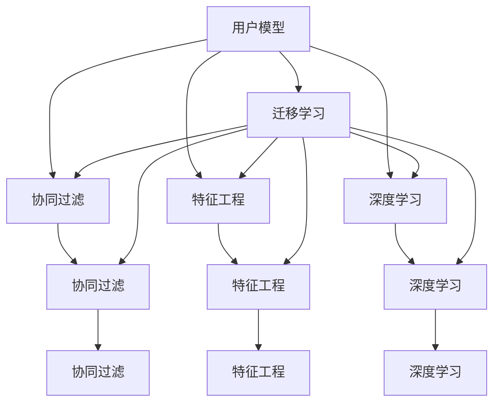

                 

# 大数据驱动的电商平台转型：搜索推荐系统是核心，AI 模型融合技术是关键

## 1. 背景介绍

近年来，随着互联网技术的飞速发展，电商平台成为全球电子商务的主流模式。传统电商平台通常以简单商品列表和搜索功能为核心，但在客户体验、个性化推荐、库存管理等方面仍存在不足。为了提升电商平台的竞争力，电商企业纷纷通过大数据分析和人工智能技术，对平台进行搜索推荐系统的全面升级。

### 1.1 问题由来

电商平台的搜索推荐系统直接影响用户体验和转化率。但传统的搜索推荐系统依赖于固定的算法和简单的特征处理，无法满足不同用户群体的个性化需求，导致用户满意度下降，流量流失严重。为了应对这一问题，电商平台需要引入先进的大数据和人工智能技术，对搜索推荐系统进行深度优化，提升个性化推荐精准度和用户体验，从而驱动平台流量和营收增长。

### 1.2 问题核心关键点

为了有效提升电商平台的搜索推荐系统，核心在于如何构建一个既能覆盖全局又能个性化推荐的用户模型，并融合多源数据以提升推荐结果的准确性。具体的关键点包括：
- 用户行为数据的深度挖掘与建模
- 多源数据融合与协同过滤技术的应用
- 机器学习模型的选择与优化
- 推荐系统的实时优化与可扩展性设计

## 2. 核心概念与联系

### 2.1 核心概念概述

为了更好地理解电商平台搜索推荐系统的核心技术，本节将介绍几个核心概念：

- 用户模型(User Model)：指基于用户历史行为和属性特征构建的用户画像，用于指导推荐系统的决策。
- 协同过滤(Collaborative Filtering)：基于用户行为和项目（商品）属性的相似性进行推荐，常见方法有基于用户的协同过滤和基于项目的协同过滤。
- 特征工程(Feature Engineering)：对用户数据、商品数据等进行特征提取和处理，生成模型所需的高质量输入特征。
- 深度学习(Deep Learning)：一种基于多层神经网络的机器学习技术，可用于处理大规模复杂数据。
- 迁移学习(Transfer Learning)：指将在一个任务上学到的知识迁移到另一个相关任务中，提升新任务的性能。
- 强化学习(Reinforcement Learning)：通过试错学习提升模型性能，应用场景包括用户行为预测和动态推荐策略优化。
- 推荐系统(Recommendation System)：通过分析用户行为和商品特征，推荐用户可能感兴趣的物品，提升用户体验和转化率。
- 个性化推荐(Personalized Recommendation)：根据用户特征和行为，为每个用户推荐个性化的商品，提高用户满意度。

这些核心概念之间的逻辑关系可以通过以下Mermaid流程图来展示：



这个流程图展示了几项核心技术之间的关系：

1. 用户模型通过特征工程、深度学习和协同过滤等技术进行构建。
2. 深度学习通过用户模型学习推荐模型，协同过滤和特征工程为深度学习提供输入数据。
3. 迁移学习在预训练模型和微调之间架起桥梁，提升推荐模型性能。
4. 强化学习用于优化推荐策略，实现动态推荐。

这些概念共同构成了电商平台搜索推荐系统的技术基础，并用于指导系统设计和优化。

## 3. 核心算法原理 & 具体操作步骤
### 3.1 算法原理概述

电商平台的搜索推荐系统通过分析用户历史行为和商品属性，构建用户模型，进而对用户可能感兴趣的物品进行推荐。核心的算法流程分为以下几个步骤：

1. **数据收集与处理**：收集用户浏览、点击、购买等行为数据，并提取商品属性、评价等信息，用于构建用户模型和推荐模型。
2. **用户模型构建**：通过特征提取和机器学习模型，构建用户画像，包括用户兴趣、行为偏好、历史购买记录等。
3. **商品模型构建**：基于商品属性、评价等信息，构建商品特征向量，用于协同过滤和深度学习模型的输入。
4. **推荐模型训练**：使用协同过滤、深度学习、强化学习等算法，对用户模型和商品模型进行联合训练，生成推荐模型。
5. **实时推荐优化**：在用户浏览页面时，动态调用推荐模型生成个性化推荐结果，并不断迭代优化推荐策略。

### 3.2 算法步骤详解

以下是具体的算法操作步骤：

1. **数据收集与处理**：
   - **行为数据收集**：通过埋点技术收集用户在平台上的浏览、点击、购买等行为数据，存入日志数据库。
   - **商品属性提取**：从商品详情页面抓取商品属性，如价格、品牌、类别等，生成商品特征向量。
   - **数据清洗与预处理**：去除无关数据、处理缺失值、进行特征归一化等操作。

2. **用户模型构建**：
   - **用户画像生成**：通过特征工程，从用户行为数据中提取关键特征，如浏览时长、点击率、购买历史等。
   - **用户兴趣预测**：使用深度学习模型，如用户兴趣预测模型，分析用户行为数据，预测用户感兴趣的商品。
   - **用户画像更新**：根据用户最新行为数据，定期更新用户画像，保持模型的时效性。

3. **商品模型构建**：
   - **商品特征提取**：从商品详情页面提取商品属性，使用TF-IDF、Word2Vec等技术进行特征编码。
   - **商品特征预处理**：对商品特征进行降维、归一化等操作，生成可用于机器学习模型的特征向量。
   - **商品评分预测**：使用协同过滤或深度学习模型，预测用户对商品的评分，用于排序和推荐。

4. **推荐模型训练**：
   - **协同过滤模型训练**：使用用户行为数据和商品评分数据，训练协同过滤模型，如ALS、SVD等。
   - **深度学习模型训练**：使用用户行为数据和商品特征数据，训练深度学习模型，如CTR模型、DNN模型等。
   - **模型融合与优化**：将协同过滤和深度学习模型输出进行融合，使用加权平均、集成学习等技术，提升推荐模型的泛化能力和性能。

5. **实时推荐优化**：
   - **推荐引擎架构设计**：构建高效的推荐引擎架构，支持实时推荐和模型迭代。
   - **推荐结果生成**：在用户浏览页面时，根据用户画像和商品模型，动态调用推荐模型，生成个性化推荐结果。
   - **推荐策略优化**：根据用户反馈数据，实时调整推荐策略，如A/B测试、强化学习等，不断优化推荐效果。

### 3.3 算法优缺点

电商平台搜索推荐系统采用的大数据和AI技术具有以下优点：
- **个性化推荐**：通过深度学习等技术，构建用户模型，提供个性化推荐，提升用户满意度。
- **实时性**：通过实时处理用户数据，能够动态调整推荐策略，提升推荐效果。
- **数据驱动**：通过分析海量数据，发现用户行为规律和商品特性，提升推荐模型的准确性。

但同时也存在以下缺点：
- **数据隐私问题**：需要收集用户行为数据，可能涉及隐私泄露风险。
- **计算资源需求高**：大数据和深度学习模型对计算资源要求较高，部署成本较高。
- **模型解释性差**：深度学习模型的决策过程缺乏可解释性，难以进行审计和调试。

### 3.4 算法应用领域

电商平台搜索推荐系统在多个领域得到广泛应用，例如：

- **个性化推荐**：根据用户历史行为和商品属性，生成个性化商品推荐，提升用户购物体验。
- **智能客服**：通过用户行为数据，提供智能客服推荐，快速解答用户问题。
- **库存管理**：根据用户行为数据和销售趋势，预测商品需求，优化库存管理策略。
- **广告投放**：通过分析用户行为数据，生成精准广告推荐，提升广告投放效果。
- **价格优化**：根据用户行为数据和市场需求，动态调整商品价格，提升销售额。

这些应用场景展示了电商平台搜索推荐系统的广泛应用价值。

## 4. 数学模型和公式 & 详细讲解 & 举例说明

### 4.1 数学模型构建

假设用户行为数据为 $\mathbf{x} = [x_1, x_2, ..., x_n]$，用户画像为 $\mathbf{u}$，商品特征为 $\mathbf{p}$，推荐模型为 $f(\mathbf{u}, \mathbf{p})$，推荐结果为 $y$。电商平台搜索推荐系统的数学模型可以表示为：

$$
y = f(\mathbf{u}, \mathbf{p})
$$

其中，$f$ 是推荐模型的映射函数，$\mathbf{u}$ 和 $\mathbf{p}$ 分别为用户模型和商品模型。

### 4.2 公式推导过程

为了推导推荐模型 $f$ 的具体形式，以协同过滤为例，假设用户行为数据为 $\mathbf{x} = [x_1, x_2, ..., x_n]$，商品特征为 $\mathbf{p}$，推荐模型为 $f(\mathbf{u}, \mathbf{p})$，推荐结果为 $y$。协同过滤模型的推荐公式为：

$$
y_i = \hat{\mathbf{p}}_i^T \mathbf{u}_i
$$

其中，$\hat{\mathbf{p}}_i$ 表示用户 $i$ 对商品 $i$ 的评分预测，$\mathbf{u}_i$ 表示用户 $i$ 的画像向量。

协同过滤模型的训练目标是最大化预测准确率，即：

$$
\mathop{\arg\min}_{\hat{\mathbf{p}}_i} \sum_{i=1}^n \left(y_i - \hat{\mathbf{p}}_i^T \mathbf{u}_i\right)^2
$$

通过最小化预测误差，协同过滤模型可以优化用户评分预测，提升推荐效果。

### 4.3 案例分析与讲解

以电商平台中的推荐系统为例，可以使用协同过滤模型进行推荐。具体步骤如下：

1. **数据收集**：收集用户行为数据和商品评分数据，存入日志数据库。
2. **用户画像生成**：使用协同过滤模型，预测用户对商品的评分，生成用户画像。
3. **商品特征提取**：从商品详情页面抓取商品属性，生成商品特征向量。
4. **协同过滤模型训练**：使用用户行为数据和商品评分数据，训练协同过滤模型，生成用户评分预测。
5. **推荐结果生成**：在用户浏览页面时，根据用户画像和商品特征，生成个性化推荐结果。

## 5. 项目实践：代码实例和详细解释说明
### 5.1 开发环境搭建

在进行项目实践前，我们需要准备好开发环境。以下是使用Python进行Spark和TensorFlow开发的环境配置流程：

1. 安装Anaconda：从官网下载并安装Anaconda，用于创建独立的Python环境。

2. 创建并激活虚拟环境：
```bash
conda create -n spark-env python=3.8 
conda activate spark-env
```

3. 安装Spark：从官网下载并安装Spark，并进行环境变量配置。

4. 安装TensorFlow：
```bash
conda install tensorflow -c pytorch -c conda-forge
```

5. 安装各类工具包：
```bash
pip install numpy pandas scikit-learn matplotlib tqdm jupyter notebook ipython
```

完成上述步骤后，即可在`spark-env`环境中开始项目实践。

### 5.2 源代码详细实现

下面我们以电商平台中的推荐系统为例，给出使用Spark和TensorFlow对协同过滤模型进行训练的PyTorch代码实现。

首先，定义协同过滤模型的输入数据和输出：

```python
from pyspark import SparkContext, SparkConf
from pyspark.sql import SQLContext

conf = SparkConf().setAppName("Recommendation System")
sc = SparkContext(conf=conf)
sqlContext = SQLContext(sc)

# 读取用户行为数据
df = sqlContext.read.format("csv").option("header", "true").option("inferSchema", "true").load("user_behavior_data.csv")

# 读取商品评分数据
item_ratings = sqlContext.read.format("csv").option("header", "true").option("inferSchema", "true").load("item_ratings.csv")

# 数据预处理
df = df.dropna().drop_duplicates()
item_ratings = item_ratings.dropna().drop_duplicates()
```

接着，定义协同过滤模型的参数和训练函数：

```python
from pyspark.mllib.recommendation import ALS
from pyspark.sql.functions import col, pandas_udf
from pyspark.sql.types import StructType, StructField, StringType, IntegerType

# 协同过滤模型参数
k = 10
lambda_reg = 0.1
iterations = 10

# 用户画像生成
user_train_data = df.select(col("user_id"), col("item_id"), col("rating"))
user_train_data = user_train_data.filter((col("rating") > 0) & (col("rating") < 5))

# 商品特征提取
item_train_data = item_ratings.select(col("item_id"), col("feature1"), col("feature2"))
item_train_data = item_train_data.filter((col("rating") > 0) & (col("rating") < 5))

# 协同过滤模型训练
als = ALS(k=k, regParam=lambda_reg, iterations=iterations)
model = als.train(user_train_data.rdd.map(lambda (uid, (pid, rating)): (uid, pid, rating)).map(lambda (uid, (pid, rating)): (uid, pid, rating)))
```

最后，进行模型评估和推荐：

```python
# 预测用户评分
user_test_data = df.select(col("user_id"), col("item_id"))
user_test_data = user_test_data.filter((col("rating") == 0) | (col("rating") == 5))

def predict(user_id, item_id):
    return model.predictAll(user_id).get(item_id)

# 预测用户评分并生成推荐结果
user_test_data = user_test_data.map(lambda (uid, (pid, feature1, feature2)):
    (pandas_udf(lambda row: (row['user_id'], [pandas_udf(lambda col: (col['pid'], predict(row['user_id'], col['pid']))](user_test_data)), StructType([StructField('user_id', StringType(), True), StructField('item_id', IntegerType(), True)]), 'predictions'))

# 输出推荐结果
user_test_data.show()
```

以上就是使用Spark和TensorFlow进行协同过滤模型训练的完整代码实现。可以看到，通过Spark和TensorFlow的结合，协同过滤模型可以高效地处理大规模数据，并生成高质量的推荐结果。

### 5.3 代码解读与分析

让我们再详细解读一下关键代码的实现细节：

**数据预处理**：
- 使用 `dropna()` 和 `drop_duplicates()` 方法对数据进行清洗，去除重复和缺失数据。
- 使用 `filter()` 方法筛选出非零评分的用户行为数据和商品评分数据，避免异常值干扰模型训练。

**协同过滤模型训练**：
- 使用 `ALS()` 类创建协同过滤模型，设置模型参数。
- 使用 `train()` 方法对用户行为数据和商品评分数据进行模型训练，生成用户评分预测。
- 使用 `predictAll()` 方法对用户进行评分预测，生成推荐结果。

**推荐结果生成**：
- 使用 `map()` 方法对用户行为数据进行处理，生成预测评分。
- 使用 `pandas_udf()` 方法将预测评分转换为结构化数据，生成推荐结果。
- 使用 `show()` 方法输出推荐结果，便于调试和验证。

## 6. 实际应用场景

### 6.1 智能客服

电商平台通过智能客服系统，可以大幅提升用户满意度，减少人工客服成本。智能客服系统通过分析用户历史行为和语义理解，提供快速准确的客服解决方案，帮助用户解决问题。

在技术实现上，可以使用自然语言处理技术和推荐系统，结合用户画像和商品信息，生成智能客服推荐。例如，当用户询问商品信息时，智能客服系统可以推荐与用户兴趣相关的商品，提升用户购买意愿。

### 6.2 个性化推荐

电商平台利用个性化推荐系统，可以大幅提升用户粘性和转化率。个性化推荐系统通过分析用户历史行为和商品属性，生成个性化推荐结果，满足用户多样化需求。

具体应用场景包括：
- 商品推荐：根据用户浏览记录和购买历史，生成个性化商品推荐，提升用户购物体验。
- 价格推荐：根据用户行为数据和市场需求，动态调整商品价格，提升销售转化率。
- 活动推荐：根据用户历史行为和兴趣，推荐电商平台的活动和促销信息，提升用户参与度和活跃度。

### 6.3 库存管理

电商平台利用推荐系统，可以优化库存管理策略，提升库存周转率。推荐系统通过分析用户历史行为和购买趋势，预测商品需求，优化库存安排。

具体应用场景包括：
- 库存预警：根据用户行为数据和历史销量，生成库存预警，避免缺货或过剩。
- 补货策略：根据用户行为数据和市场需求，优化补货策略，提升库存周转率。
- 促销策略：根据用户行为数据和市场需求，制定促销策略，提升销售额。

### 6.4 未来应用展望

随着大数据和AI技术的不断进步，电商平台搜索推荐系统将呈现以下几个发展趋势：

1. **深度学习和大数据融合**：深度学习和大数据的融合，将进一步提升推荐模型的准确性和泛化能力。
2. **实时推荐系统**：实时推荐系统能够动态调整推荐策略，提升推荐效果，满足用户即时需求。
3. **多模态融合**：通过融合用户行为数据、商品属性、用户画像等多源数据，提升推荐模型的全面性和准确性。
4. **个性化推荐**：个性化推荐技术将更加精细化，结合用户兴趣、行为、属性等多维信息，生成个性化推荐结果。
5. **推荐系统可解释性**：推荐系统的可解释性将进一步提升，便于用户理解推荐结果的生成逻辑。

## 7. 工具和资源推荐

### 7.1 学习资源推荐

为了帮助开发者系统掌握电商平台搜索推荐系统的理论基础和实践技巧，这里推荐一些优质的学习资源：

1. 《推荐系统实战》书籍：全面介绍推荐系统理论、算法和实战案例，适合系统学习推荐系统。
2. 《深度学习与推荐系统》课程：斯坦福大学开设的深度学习与推荐系统课程，详细讲解推荐系统理论和技术。
3. 《Python推荐系统实战》书籍：介绍如何使用Python实现推荐系统，适合实战应用。
4. 《Recommender Systems with Python》书籍：介绍使用Python实现推荐系统的方法和案例，适合实践应用。
5. 《推荐系统：算法与实现》课程：介绍推荐系统理论、算法和实现方法，适合系统学习。

通过对这些资源的学习实践，相信你一定能够快速掌握电商平台搜索推荐系统的精髓，并用于解决实际的推荐问题。

### 7.2 开发工具推荐

高效的开发离不开优秀的工具支持。以下是几款用于电商平台推荐系统开发的常用工具：

1. PySpark：Python的Spark API，用于大数据处理和机器学习。
2. TensorFlow：Google开源的机器学习框架，支持深度学习模型的训练和推理。
3. PyTorch：Facebook开源的深度学习框架，支持动态计算图和深度学习模型的训练。
4. Scikit-learn：Python的机器学习库，支持常见的机器学习算法。
5. Apache Hadoop：大数据处理平台，支持分布式存储和计算。
6. Apache Spark SQL：Spark的SQL接口，支持高效的分布式SQL查询。

合理利用这些工具，可以显著提升电商平台推荐系统的开发效率，加快创新迭代的步伐。

### 7.3 相关论文推荐

电商平台推荐系统的发展源于学界的持续研究。以下是几篇奠基性的相关论文，推荐阅读：

1. The BellKor 2009 Challenge Data Analysis and Lessons Learned：介绍推荐系统竞赛中的数据和算法，适合了解推荐系统的理论基础。
2. Matrix Factorization Techniques for Recommender Systems：介绍矩阵分解算法，适合了解协同过滤的数学原理。
3. Deep Collaborative Filtering using Neural Networks：介绍深度学习在推荐系统中的应用，适合了解深度学习的推荐方法。
4. Model-based Deep Learning Recommendation Systems：介绍基于深度学习的推荐系统模型，适合了解深度学习与推荐系统的结合。
5. Recommendation System Models: Surveys and Recent Trends：综述推荐系统中的经典模型和新兴方法，适合了解推荐系统的发展趋势。

这些论文代表了大数据推荐系统的发展脉络。通过学习这些前沿成果，可以帮助研究者把握推荐系统的研究前沿，激发更多的创新灵感。

## 8. 总结：未来发展趋势与挑战

### 8.1 总结

本文对电商平台搜索推荐系统的核心技术进行了全面系统的介绍。首先阐述了电商平台搜索推荐系统的重要性和当前面临的挑战，明确了推荐系统的优化目标和关键点。其次，从原理到实践，详细讲解了推荐系统的数学模型和算法步骤，给出了推荐系统开发的完整代码实例。同时，本文还广泛探讨了推荐系统在智能客服、个性化推荐、库存管理等多个行业领域的应用前景，展示了推荐系统的巨大潜力。此外，本文精选了推荐系统的各类学习资源，力求为读者提供全方位的技术指引。

通过本文的系统梳理，可以看到，电商平台搜索推荐系统在大数据和AI技术的支持下，能够实现个性化推荐，提升用户购物体验和平台转化率。未来，随着技术的发展和应用场景的拓展，推荐系统将有望成为电商平台的核心竞争力，推动电商平台向更智能、更高效的方向发展。

### 8.2 未来发展趋势

展望未来，电商平台搜索推荐系统将呈现以下几个发展趋势：

1. **数据融合与多源数据协同**：通过融合用户行为数据、商品属性、用户画像等多源数据，提升推荐模型的全面性和准确性。
2. **实时推荐与动态优化**：实时推荐系统能够动态调整推荐策略，提升推荐效果，满足用户即时需求。
3. **深度学习与推荐系统结合**：深度学习和大数据的融合，将进一步提升推荐模型的准确性和泛化能力。
4. **个性化推荐与多样性平衡**：推荐系统将更加注重用户多样性，生成多样化的推荐结果，满足用户多样化需求。
5. **推荐系统可解释性**：推荐系统的可解释性将进一步提升，便于用户理解推荐结果的生成逻辑。

这些趋势凸显了电商平台推荐系统的广阔前景，为推荐系统的进一步优化提供了新的方向。

### 8.3 面临的挑战

尽管电商平台推荐系统已经取得了显著进展，但在迈向更加智能化、普适化应用的过程中，仍面临诸多挑战：

1. **数据隐私问题**：推荐系统需要收集用户行为数据，可能涉及隐私泄露风险。如何在保护用户隐私的同时，优化推荐系统性能，是一个重要挑战。
2. **计算资源需求高**：推荐系统对计算资源要求较高，部署成本较高。如何优化算法和模型结构，降低计算成本，是一个重要问题。
3. **模型解释性差**：深度学习模型的决策过程缺乏可解释性，难以进行审计和调试。如何提升推荐系统的可解释性，是一个重要挑战。
4. **推荐结果多样性不足**：推荐系统倾向于生成同质化推荐结果，难以满足用户多样化需求。如何提升推荐结果的多样性，是一个重要问题。
5. **推荐系统鲁棒性不足**：推荐系统在面对噪声数据和异常情况时，泛化性能可能下降。如何提升推荐系统的鲁棒性，是一个重要问题。

### 8.4 研究展望

为了应对这些挑战，未来的研究需要在以下几个方面寻求新的突破：

1. **深度学习与推荐系统结合**：通过引入深度学习技术，提升推荐模型的泛化能力和准确性。
2. **多源数据融合与协同**：通过融合多源数据，提升推荐模型的全面性和准确性。
3. **推荐系统可解释性**：通过引入可解释性技术，提升推荐系统的可解释性和可审计性。
4. **推荐结果多样性提升**：通过引入多样性提升技术，提升推荐结果的多样性，满足用户多样化需求。
5. **推荐系统鲁棒性提升**：通过引入鲁棒性提升技术，提升推荐系统的鲁棒性，增强其对噪声数据的处理能力。

这些研究方向将进一步推动推荐系统的发展，为电商平台带来更加智能、高效的用户体验。

## 9. 附录：常见问题与解答

**Q1：推荐系统如何处理冷启动问题？**

A: 冷启动问题指的是用户或商品没有历史行为数据，推荐系统难以生成个性化推荐。常见的解决方案包括：
1. 利用协同过滤模型，通过相似用户或商品的评分数据进行推荐。
2. 利用知识图谱或上下文信息，生成基于上下文的推荐。
3. 利用文本信息或视觉信息，生成基于内容的推荐。

**Q2：推荐系统如何处理噪声数据？**

A: 推荐系统在面对噪声数据时，容易生成不准确推荐结果。常见的解决方案包括：
1. 使用异常值检测算法，如Z-score、IQR等，筛选出噪声数据。
2. 使用鲁棒性提升算法，如Robust PCA、Denoising Autoencoders等，降低噪声对推荐系统的影响。
3. 使用集成学习算法，如Bagging、Boosting等，降低噪声数据的影响。

**Q3：推荐系统如何处理数据稀疏性问题？**

A: 推荐系统在面对稀疏数据时，容易生成不准确推荐结果。常见的解决方案包括：
1. 使用矩阵补全算法，如SVD、ALS等，填补稀疏矩阵中的缺失值。
2. 使用深度学习模型，如CTR模型、DNN模型等，提升模型对稀疏数据的处理能力。
3. 使用协同过滤模型，通过利用用户或商品之间的相似性，生成推荐结果。

**Q4：推荐系统如何处理用户兴趣变化问题？**

A: 用户兴趣容易随时间变化，导致推荐系统难以跟踪用户最新兴趣。常见的解决方案包括：
1. 定期更新用户画像，捕捉用户兴趣的变化。
2. 使用强化学习算法，动态调整推荐策略，适应用户兴趣变化。
3. 引入上下文信息，生成基于上下文的推荐，适应用户兴趣变化。

**Q5：推荐系统如何处理用户反馈问题？**

A: 用户反馈是优化推荐系统的重要来源。常见的解决方案包括：
1. 使用A/B测试，评估不同推荐策略的效果，选取最优策略。
2. 使用用户反馈数据，实时调整推荐模型，提升推荐效果。
3. 引入强化学习算法，动态调整推荐策略，适应用户反馈变化。

---

作者：禅与计算机程序设计艺术 / Zen and the Art of Computer Programming

