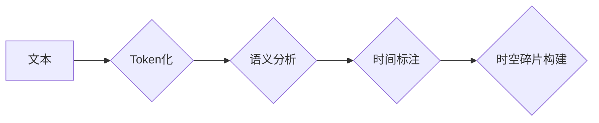

> Token, 时空碎片, 自然语言处理, 深度学习, 计算机视觉, 数据结构, 算法设计, 性能优化

## 1. 背景介绍

在当今数据爆炸的时代，信息处理和理解能力成为人工智能领域的核心挑战。Token，作为一种基本的文本处理单元，在自然语言处理 (NLP) 中扮演着至关重要的角色。而时空碎片，则是一种更高级的抽象概念，它试图捕捉文本中的语义和结构信息，并将其用于更复杂的理解和生成任务。

Token化技术已经广泛应用于各种 NLP 任务，例如机器翻译、文本摘要、问答系统等。然而，传统的 Token 化方法往往局限于简单的字或词的分割，无法充分捕捉文本的语义和上下文关系。时空碎片的概念则试图解决这一问题，它将文本视为一系列相互关联的片段，每个片段都包含着特定的语义和时间信息。

## 2. 核心概念与联系

### 2.1 Token

Token 是文本处理中的一种基本单位，通常是指一个单词、一个子词或一个标点符号。Token 化的过程就是将文本分割成一系列独立的 Token。

### 2.2 时空碎片

时空碎片是一种更高级的文本抽象概念，它将文本视为一系列相互关联的片段，每个片段都包含着特定的语义和时间信息。

**Mermaid 流程图**



## 3. 核心算法原理 & 具体操作步骤

### 3.1 算法原理概述

时空碎片的构建过程通常包括以下几个步骤：

1. **Token 化:** 将文本分割成一系列独立的 Token。
2. **语义分析:** 对每个 Token 进行语义分析，识别其含义和类别。
3. **时间标注:** 为每个 Token 添加时间信息，例如时间戳、事件类型等。
4. **时空碎片构建:** 将具有相关语义和时间信息的 Token 组合成时空碎片。

### 3.2 算法步骤详解

1. **Token 化:** 使用传统的 Token 化算法，例如空格分割、词性标注等，将文本分割成一系列 Token。
2. **语义分析:** 使用深度学习模型，例如 Word2Vec、GloVe 等，对每个 Token 进行语义分析，将其映射到一个低维的语义空间中。
3. **时间标注:** 使用时间信息提取算法，例如命名实体识别、关系抽取等，为每个 Token 添加时间信息。
4. **时空碎片构建:** 使用聚类算法，例如 K-Means、DBSCAN 等，将具有相似语义和时间信息的 Token 聚类在一起，形成时空碎片。

### 3.3 算法优缺点

**优点:**

* 可以捕捉文本中的语义和上下文关系。
* 可以处理时间相关的文本信息。
* 可以用于更复杂的 NLP 任务，例如事件推理、文本摘要等。

**缺点:**

* 算法复杂度较高。
* 需要大量的训练数据。
* 碎片的边界可能不够清晰。

### 3.4 算法应用领域

时空碎片的应用领域非常广泛，例如：

* **新闻报道分析:** 识别新闻事件的时间线和关键人物。
* **社交媒体监控:** 监测社交媒体上的舆情变化和事件传播。
* **历史研究:** 分析历史文本，挖掘历史事件和人物关系。

## 4. 数学模型和公式 & 详细讲解 & 举例说明

### 4.1 数学模型构建

时空碎片的构建可以看作是一个聚类问题，可以使用 K-Means 算法进行建模。

**K-Means 算法模型:**

* **目标:** 将数据点划分为 K 个簇，使得每个簇内的点尽可能接近，而不同簇之间的点尽可能远离。
* **步骤:**
    1. 随机选择 K 个数据点作为初始聚类中心。
    2. 将每个数据点分配到最近的聚类中心。
    3. 更新每个聚类中心的坐标为该簇内所有数据点的平均值。
    4. 重复步骤 2 和 3，直到聚类中心不再变化。

### 4.2 公式推导过程

K-Means 算法的迭代更新公式如下：

$$
\mu_i = \frac{1}{n_i} \sum_{j=1}^{n_i} x_j
$$

其中：

* $\mu_i$ 是第 i 个聚类中心的坐标。
* $n_i$ 是第 i 个聚类包含的数据点数量。
* $x_j$ 是第 j 个属于第 i 个聚类的点。

### 4.3 案例分析与讲解

假设我们有一组文本数据，每个文本都包含一个时间戳和一些关键词。我们可以使用 K-Means 算法将这些文本聚类成时空碎片。

例如，我们可以将聚类结果可视化成一个时间轴，每个时空碎片对应一个时间段，并显示该时间段内出现的关键词。这样，我们可以直观地看到不同时间段的文本主题和关键词变化趋势。

## 5. 项目实践：代码实例和详细解释说明

### 5.1 开发环境搭建

* Python 3.x
* NLTK
* Scikit-learn
* Matplotlib

### 5.2 源代码详细实现

```python
import nltk
from nltk.tokenize import word_tokenize
from sklearn.cluster import KMeans

# 数据预处理
def preprocess_text(text):
    # Token 化
    tokens = word_tokenize(text)
    # ... 其他预处理步骤 ...
    return tokens

# 时空碎片构建
def build_time_space_fragments(texts, num_clusters):
    # 数据预处理
    processed_texts = [preprocess_text(text) for text in texts]
    # 聚类
    kmeans = KMeans(n_clusters=num_clusters)
    kmeans.fit(processed_texts)
    # 获取聚类结果
    clusters = kmeans.labels_
    # ... 其他操作 ...

# ... 其他代码 ...
```

### 5.3 代码解读与分析

* `preprocess_text()` 函数负责对文本进行预处理，例如 Token 化、去除停用词等。
* `build_time_space_fragments()` 函数负责构建时空碎片，它使用 K-Means 算法将文本聚类成多个簇。
* `clusters` 变量存储了每个文本所属的聚类标签。

### 5.4 运行结果展示

运行代码后，我们可以得到每个文本所属的时空碎片标签，并根据这些标签对文本进行分组和分析。

## 6. 实际应用场景

时空碎片技术在多个领域都有着广泛的应用场景：

### 6.1 文本摘要

时空碎片可以帮助我们提取文本中的关键信息，并生成简洁的摘要。

### 6.2 事件推理

时空碎片可以帮助我们识别文本中的事件，并推断事件之间的因果关系。

### 6.3 情感分析

时空碎片可以帮助我们分析文本中的情感倾向，例如正面、负面或中性。

### 6.4 未来应用展望

随着人工智能技术的不断发展，时空碎片技术将会在更多领域得到应用，例如：

* **自动写作:** 使用时空碎片技术生成更自然、更流畅的文本。
* **知识图谱构建:** 使用时空碎片技术构建更完整的知识图谱。
* **虚拟助手:** 使用时空碎片技术开发更智能的虚拟助手。

## 7. 工具和资源推荐

### 7.1 学习资源推荐

* **书籍:**
    * "Speech and Language Processing" by Jurafsky and Martin
    * "Natural Language Processing with Python" by Bird, Klein, and Loper
* **在线课程:**
    * Coursera: Natural Language Processing Specialization
    * edX: Artificial Intelligence

### 7.2 开发工具推荐

* **NLTK:** Python 自然语言处理工具包
* **SpaCy:** 高性能自然语言处理库
* **Gensim:** 主题建模和词嵌入工具

### 7.3 相关论文推荐

* "A Survey of Text Summarization Methods" by Mani and Bloedorn
* "Attention Is All You Need" by Vaswani et al.
* "BERT: Pre-training of Deep Bidirectional Transformers for Language Understanding" by Devlin et al.

## 8. 总结：未来发展趋势与挑战

### 8.1 研究成果总结

时空碎片技术在文本理解和生成方面取得了显著的进展，它能够捕捉文本中的语义和上下文关系，并用于更复杂的 NLP 任务。

### 8.2 未来发展趋势

未来时空碎片技术的发展趋势包括：

* **更强大的语义理解:** 使用更先进的深度学习模型，例如 Transformer，提高时空碎片的语义理解能力。
* **跨模态时空碎片:** 将文本与其他模态信息，例如图像和音频，融合在一起，构建更丰富的时空碎片。
* **动态时空碎片:** 随着时间的推移，时空碎片的结构和内容会不断变化，需要开发动态更新机制。

### 8.3 面临的挑战

时空碎片技术还面临着一些挑战：

* **数据稀缺:** 训练高质量的时空碎片模型需要大量的训练数据，而这类数据往往比较稀缺。
* **计算复杂度:** 时空碎片的构建过程计算复杂度较高，需要更高效的算法和硬件支持。
* **解释性:** 时空碎片的构建过程比较黑盒，难以解释模型的决策结果。

### 8.4 研究展望

未来，时空碎片技术将继续朝着更智能、更灵活、更可解释的方向发展，并在更多领域发挥重要作用。


## 9. 附录：常见问题与解答

### 9.1 什么是 Token？

Token 是文本处理中的一种基本单位，通常是指一个单词、一个子词或一个标点符号。

### 9.2 什么是时空碎片？

时空碎片是一种更高级的文本抽象概念，它将文本视为一系列相互关联的片段，每个片段都包含着特定的语义和时间信息。

### 9.3 如何构建时空碎片？

时空碎片的构建通常包括以下几个步骤：

1. Token 化
2. 语义分析
3. 时间标注
4. 时空碎片构建

### 9.4 时空碎片技术有哪些应用场景？

时空碎片技术在多个领域都有着广泛的应用场景，例如：

* 文本摘要
* 事件推理
* 情感分析

### 9.5 未来时空碎片技术的发展趋势是什么？

未来时空碎片技术的发展趋势包括：

* 更强大的语义理解
* 跨模态时空碎片
* 动态时空碎片


作者：禅与计算机程序设计艺术 / Zen and the Art of Computer Programming 
<end_of_turn>