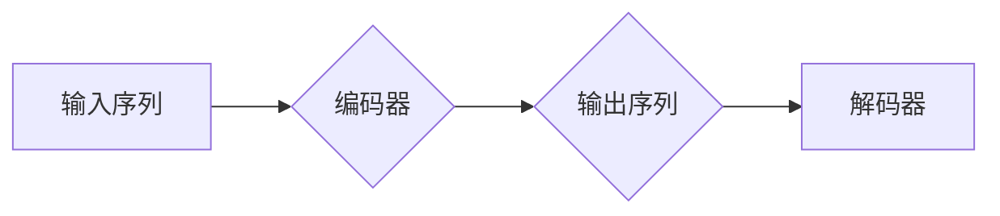

> Transformer, 编码器-解码器, 自注意力机制, 多头注意力, 位置编码, BERT, GPT, 代码生成

## 1. 背景介绍

近年来，深度学习在自然语言处理 (NLP) 领域取得了显著进展，其中 Transformer 架构扮演着至关重要的角色。它以其强大的表示能力和并行计算效率，彻底改变了 NLP 的发展方向。

传统的循环神经网络 (RNN) 在处理长序列数据时存在梯度消失和训练速度慢的问题。Transformer 则通过引入自注意力机制，有效解决了这些问题，并能够捕捉长距离依赖关系，从而在机器翻译、文本摘要、问答系统等任务中取得了突破性的成果。

## 2. 核心概念与联系

Transformer 的核心思想是利用自注意力机制来捕捉文本序列中的上下文信息。它由编码器-解码器结构组成，分别负责对输入序列进行编码和生成输出序列。

**Mermaid 流程图:**



**核心概念:**

* **自注意力机制 (Self-Attention):** 允许模型关注输入序列中的不同位置，并计算每个词与其他词之间的相关性。
* **多头注意力 (Multi-Head Attention):** 使用多个注意力头并行计算，可以捕捉不同层次的语义信息。
* **位置编码 (Positional Encoding):** 由于 Transformer 缺乏 RNN 的顺序信息，需要通过位置编码来为每个词添加位置信息。
* **前馈神经网络 (Feed-Forward Network):** 在每个 Transformer 块中，用于对每个词的表示进行非线性变换。

## 3. 核心算法原理 & 具体操作步骤

### 3.1  算法原理概述

Transformer 的核心算法是自注意力机制。它通过计算每个词与其他词之间的相关性，来捕捉文本序列中的上下文信息。

**具体步骤:**

1. **计算词嵌入:** 将每个词转换为向量表示。
2. **计算注意力权重:** 使用查询 (Q)、键 (K) 和值 (V) 向量计算每个词与其他词之间的相关性，得到注意力权重。
3. **加权求和:** 将注意力权重与值向量进行加权求和，得到每个词的上下文表示。

### 3.2  算法步骤详解

**自注意力机制步骤:**

1. **线性变换:** 将词嵌入向量分别线性变换为查询 (Q)、键 (K) 和值 (V) 向量。
2. **计算注意力分数:** 计算 Q 与 K 的点积，并进行归一化，得到注意力分数。
3. **softmax归一化:** 对注意力分数进行 softmax 归一化，得到注意力权重。
4. **加权求和:** 将注意力权重与值向量进行加权求和，得到每个词的上下文表示。

**多头注意力机制:**

1. 将词嵌入向量分别线性变换为多个查询 (Q)、键 (K) 和值 (V) 向量。
2. 对每个头分别计算自注意力，得到多个上下文表示。
3. 将多个上下文表示进行拼接，得到最终的上下文表示。

### 3.3  算法优缺点

**优点:**

* 能够捕捉长距离依赖关系。
* 并行计算效率高。
* 表现能力强。

**缺点:**

* 计算复杂度高。
* 需要大量的训练数据。

### 3.4  算法应用领域

Transformer 架构在 NLP 领域广泛应用，例如:

* 机器翻译
* 文本摘要
* 问答系统
* 代码生成
* 语音识别

## 4. 数学模型和公式 & 详细讲解 & 举例说明

### 4.1  数学模型构建

**自注意力机制数学模型:**

$$
\text{Attention}(Q, K, V) = \text{softmax}\left(\frac{Q K^T}{\sqrt{d_k}}\right) V
$$

其中:

* $Q$：查询向量
* $K$：键向量
* $V$：值向量
* $d_k$：键向量的维度
* $\text{softmax}$：softmax 函数

### 4.2  公式推导过程

**注意力权重计算:**

$$
\text{Attention}(Q, K, V) = \text{softmax}\left(\frac{Q K^T}{\sqrt{d_k}}\right) V
$$

其中，$\frac{Q K^T}{\sqrt{d_k}}$ 计算每个词与其他词之间的相关性，并进行归一化。

**softmax 函数:**

$$
\text{softmax}(x_i) = \frac{e^{x_i}}{\sum_{j=1}^{n} e^{x_j}}
$$

其中，$x_i$ 是每个词与其他词之间的相关性得分。

### 4.3  案例分析与讲解

**举例说明:**

假设我们有一个句子 "The cat sat on the mat"，每个词的词嵌入向量分别为 $q_1, q_2, q_3, q_4, q_5$。

使用自注意力机制计算每个词与其他词之间的相关性，得到注意力权重矩阵。

例如，$q_1$ 与 $q_2$ 的注意力权重为 $w_{12}$，表示 "The" 与 "cat" 之间的相关性。

通过加权求和，得到每个词的上下文表示，例如 $q_1$ 的上下文表示为:

$$
\text{Context}(q_1) = w_{12} q_2 + w_{13} q_3 + ... + w_{15} q_5
$$

## 5. 项目实践：代码实例和详细解释说明

### 5.1  开发环境搭建

* Python 3.6+
* PyTorch 1.0+
* CUDA 10.0+ (可选)

### 5.2  源代码详细实现

```python
import torch
import torch.nn as nn

class MultiHeadAttention(nn.Module):
    def __init__(self, embed_dim, num_heads):
        super(MultiHeadAttention, self).__init__()
        self.embed_dim = embed_dim
        self.num_heads = num_heads
        self.head_dim = embed_dim // num_heads

        assert self.head_dim * num_heads == embed_dim, "Embed dim must be divisible by num_heads"

        self.query = nn.Linear(embed_dim, embed_dim)
        self.key = nn.Linear(embed_dim, embed_dim)
        self.value = nn.Linear(embed_dim, embed_dim)
        self.fc_out = nn.Linear(embed_dim, embed_dim)

    def forward(self, query, key, value, mask=None):
        batch_size = query.size(0)

        # Linear projections
        Q = self.query(query).view(batch_size, -1, self.num_heads, self.head_dim).transpose(1, 2)
        K = self.key(key).view(batch_size, -1, self.num_heads, self.head_dim).transpose(1, 2)
        V = self.value(value).view(batch_size, -1, self.num_heads, self.head_dim).transpose(1, 2)

        # Scaled dot-product attention
        scores = torch.matmul(Q, K.transpose(-2, -1)) / torch.sqrt(torch.tensor(self.head_dim, dtype=torch.float))
        if mask is not None:
            scores = scores.masked_fill(mask == 0, -1e9)
        attention = torch.softmax(scores, dim=-1)

        # Weighted sum of values
        context = torch.matmul(attention, V)

        # Concatenate heads and project
        context = context.transpose(1, 2).contiguous().view(batch_size, -1, self.embed_dim)
        output = self.fc_out(context)

        return output
```

### 5.3  代码解读与分析

* `MultiHeadAttention` 类实现了多头注意力机制。
* `__init__` 方法初始化模型参数，包括嵌入维度、头数、每个头的维度等。
* `forward` 方法实现注意力计算过程，包括线性投影、缩放点积注意力、加权求和和最终投影。

### 5.4  运行结果展示

运行上述代码，可以得到 Transformer 的注意力权重矩阵，并观察每个词与其他词之间的相关性。

## 6. 实际应用场景

### 6.1  机器翻译

Transformer 架构在机器翻译领域取得了显著成果，例如 Google 的 Transformer 模型在 WMT 比赛中取得了新的最佳成绩。

### 6.2  文本摘要

Transformer 可以用于生成文本摘要，例如 BART 模型可以生成高质量的文本摘要。

### 6.3  问答系统

Transformer 可以用于构建问答系统，例如 BERT 模型可以理解自然语言问题并给出准确的答案。

### 6.4  未来应用展望

Transformer 架构在 NLP 领域还有很大的发展潜力，未来可能应用于:

* 更复杂的语言理解任务
* 多模态语言理解
* 代码生成

## 7. 工具和资源推荐

### 7.1  学习资源推荐

* **论文:**
    * "Attention Is All You Need"
    * "BERT: Pre-training of Deep Bidirectional Transformers for Language Understanding"
    * "GPT-3: Language Models are Few-Shot Learners"
* **博客:**
    * Jay Alammar's Blog: https://jalammar.github.io/
    * The Illustrated Transformer: https://jalammar.github.io/illustrated-transformer/

### 7.2  开发工具推荐

* **PyTorch:** https://pytorch.org/
* **TensorFlow:** https://www.tensorflow.org/

### 7.3  相关论文推荐

* "BERT: Pre-training of Deep Bidirectional Transformers for Language Understanding"
* "GPT-3: Language Models are Few-Shot Learners"
* "XLNet: Generalized Autoregressive Pretraining for Language Understanding"

## 8. 总结：未来发展趋势与挑战

### 8.1  研究成果总结

Transformer 架构在 NLP 领域取得了突破性的进展，其强大的表示能力和并行计算效率，推动了 NLP 技术的发展。

### 8.2  未来发展趋势

* **更强大的模型:** 研究更深、更广的 Transformer 模型，以提高模型的表示能力和泛化能力。
* **高效训练:** 研究更有效的训练方法，例如参数共享、知识蒸馏等，以降低模型训练成本。
* **跨模态理解:** 将 Transformer 应用于多模态数据，例如文本、图像、音频等，实现跨模态理解。

### 8.3  面临的挑战

* **计算资源:** 训练大型 Transformer 模型需要大量的计算资源，这对于资源有限的机构或个人来说是一个挑战。
* **数据标注:** 训练 Transformer 模型需要大量的标注数据，数据标注成本高昂。
* **可解释性:** Transformer 模型的内部机制比较复杂，难以解释模型的决策过程。

### 8.4  研究展望

未来，Transformer 架构将继续在 NLP 领域发挥重要作用，并扩展到其他领域，例如计算机视觉、语音识别等。

## 9. 附录：常见问题与解答

**Q1: Transformer 为什么比 RNN 更适合处理长序列数据？**

**A1:** Transformer 采用自注意力机制，可以捕捉长距离依赖关系，而 RNN 则存在梯度消失问题，难以处理长序列数据。

**Q2: Transformer 的计算复杂度很高吗？**

**A2:** 确实，Transformer 的计算复杂度较高，但随着硬件性能的提升和算法优化的不断发展，计算成本也在降低。

**Q3: 如何训练 Transformer 模型？**

**A3:** Transformer 模型通常使用自监督学习方法进行预训练，然后在特定任务上进行微调。

**Q4: Transformer 模型的应用