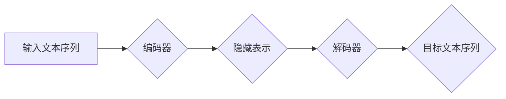

> Transformer, 自注意力机制, BERT, GPT, 自然语言处理, 深度学习, 架构创新

## 1. 背景介绍

近年来，深度学习在人工智能领域取得了突破性进展，其中自然语言处理 (NLP) 领域尤为突出。传统的基于循环神经网络 (RNN) 的模型在处理长文本序列时存在效率低下和梯度消失等问题。2017 年，谷歌发布了基于 Transformer 架构的模型，彻底改变了 NLP 的发展方向。Transformer 凭借其强大的自注意力机制和并行计算能力，在各种 NLP 任务中取得了显著的成绩，例如机器翻译、文本摘要、问答系统等。

## 2. 核心概念与联系

Transformer 的核心思想是利用自注意力机制来捕捉文本序列中单词之间的依赖关系，从而实现更准确的理解和生成。

**2.1 自注意力机制**

自注意力机制 (Self-Attention) 允许模型关注输入序列中任意两个单词之间的关系，并根据这些关系计算每个单词的权重。

**2.2 Transformer 架构**

Transformer 架构由编码器 (Encoder) 和解码器 (Decoder) 两部分组成。

* **编码器:** 负责将输入文本序列转换为隐藏表示。编码器由多个 Transformer 块堆叠而成，每个 Transformer 块包含多头自注意力层和前馈神经网络层。
* **解码器:** 负责根据编码器的输出生成目标文本序列。解码器也由多个 Transformer 块堆叠而成，每个 Transformer 块包含多头自注意力层、masked 多头自注意力层和前馈神经网络层。

**2.3 Mermaid 流程图**



## 3. 核心算法原理 & 具体操作步骤

### 3.1 算法原理概述

Transformer 的核心算法是自注意力机制。自注意力机制通过计算每个单词与所有其他单词之间的相关性，来学习单词之间的依赖关系。

### 3.2 算法步骤详解

1. **计算单词嵌入:** 将每个单词转换为一个向量表示。
2. **计算注意力权重:** 对于每个单词，计算它与所有其他单词之间的相关性，并得到一个注意力权重向量。
3. **加权求和:** 使用注意力权重向量对所有单词的嵌入进行加权求和，得到每个单词的上下文表示。
4. **重复步骤 2-3:** 对上下文表示进行多次自注意力计算，以学习更深层次的语义关系。

### 3.3 算法优缺点

**优点:**

* 能够捕捉长距离依赖关系。
* 并行计算能力强，训练速度快。

**缺点:**

* 计算复杂度高，参数量大。
* 对训练数据要求高。

### 3.4 算法应用领域

Transformer 架构在 NLP 领域广泛应用，例如:

* 机器翻译
* 文本摘要
* 问答系统
* 情感分析
* 代码生成

## 4. 数学模型和公式 & 详细讲解 & 举例说明

### 4.1 数学模型构建

**4.1.1  注意力机制**

注意力机制的核心是计算每个单词与所有其他单词之间的相关性。可以使用以下公式计算注意力权重：

$$
\text{Attention}(Q, K, V) = \text{softmax}\left(\frac{Q K^T}{\sqrt{d_k}}\right) V
$$

其中：

* $Q$：查询矩阵
* $K$：键矩阵
* $V$：值矩阵
* $d_k$：键向量的维度
* $\text{softmax}$：softmax 函数

**4.1.2  多头注意力机制**

多头注意力机制 (Multi-Head Attention) 是将注意力机制应用于多个不同的子空间，从而学习到更丰富的语义信息。

$$
\text{MultiHead}(Q, K, V) = \text{Concat}(head_1, head_2, ..., head_h) W^O
$$

其中：

* $head_i$：第 $i$ 个子空间的注意力输出
* $h$：多头数量
* $W^O$：最终输出层的权重矩阵

**4.1.3  Transformer 块**

Transformer 块由多头自注意力层和前馈神经网络层组成。

### 4.2 公式推导过程

**4.2.1  自注意力层**

自注意力层的计算过程可以分为以下步骤：

1. 计算查询矩阵 $Q$、键矩阵 $K$ 和值矩阵 $V$。
2. 计算注意力权重矩阵 $A$。
3. 使用注意力权重矩阵 $A$ 对值矩阵 $V$ 进行加权求和，得到上下文表示 $C$。

**4.2.2  前馈神经网络层**

前馈神经网络层是一个简单的多层感知机，其计算过程如下：

1. 将上下文表示 $C$ 作为输入。
2. 通过两层全连接层进行计算。
3. 使用 ReLU 激活函数。

### 4.3 案例分析与讲解

**4.3.1  机器翻译**

在机器翻译任务中，Transformer 可以将源语言文本序列转换为目标语言文本序列。编码器将源语言文本序列转换为隐藏表示，解码器则根据隐藏表示生成目标语言文本序列。

**4.3.2  文本摘要**

在文本摘要任务中，Transformer 可以将长文本序列压缩成短文本摘要。编码器将长文本序列转换为隐藏表示，解码器则根据隐藏表示生成短文本摘要。

## 5. 项目实践：代码实例和详细解释说明

### 5.1 开发环境搭建

* Python 3.6+
* TensorFlow 或 PyTorch

### 5.2 源代码详细实现

```python
# 使用 TensorFlow 实现 Transformer 的编码器部分

import tensorflow as tf

class EncoderLayer(tf.keras.layers.Layer):
    def __init__(self, d_model, num_heads, dff, rate=0.1):
        super(EncoderLayer, self).__init__()
        self.mha = tf.keras.layers.MultiHeadAttention(num_heads=num_heads, key_dim=d_model)
        self.ffn = tf.keras.Sequential([
            tf.keras.layers.Dense(dff, activation='relu'),
            tf.keras.layers.Dense(d_model)
        ])
        self.layernorm1 = tf.keras.layers.LayerNormalization(epsilon=1e-6)
        self.layernorm2 = tf.keras.layers.LayerNormalization(epsilon=1e-6)
        self.dropout1 = tf.keras.layers.Dropout(rate)
        self.dropout2 = tf.keras.layers.Dropout(rate)

    def call(self, inputs, training):
        attn_output = self.mha(inputs, inputs, inputs)
        attn_output = self.dropout1(attn_output, training=training)
        out1 = self.layernorm1(inputs + attn_output)
        ffn_output = self.ffn(out1)
        ffn_output = self.dropout2(ffn_output, training=training)
        out2 = self.layernorm2(out1 + ffn_output)
        return out2
```

### 5.3 代码解读与分析

* `EncoderLayer` 类定义了 Transformer 的编码器层。
* `mha` 属性是一个多头自注意力层。
* `ffn` 属性是一个前馈神经网络层。
* `layernorm1` 和 `layernorm2` 属性是层归一化层。
* `dropout1` 和 `dropout2` 属性是 dropout 层。
* `call` 方法定义了编码器层的计算过程。

### 5.4 运行结果展示

运行上述代码可以训练一个 Transformer 模型，并评估其在机器翻译或文本摘要等任务上的性能。

## 6. 实际应用场景

### 6.1 机器翻译

Transformer 架构在机器翻译领域取得了显著的成果，例如 Google Translate 和 DeepL 等翻译工具都采用了 Transformer 模型。

### 6.2 文本摘要

Transformer 模型可以自动生成文本摘要，例如新闻摘要、会议记录摘要等。

### 6.3 问答系统

Transformer 模型可以用于构建问答系统，例如自动回答用户的问题。

### 6.4 未来应用展望

Transformer 架构的应用场景还在不断扩展，例如：

* 代码生成
* 图像识别
* 语音识别

## 7. 工具和资源推荐

### 7.1 学习资源推荐

* **论文:**
    * Attention Is All You Need (https://arxiv.org/abs/1706.03762)
    * BERT: Pre-training of Deep Bidirectional Transformers for Language Understanding (https://arxiv.org/abs/1810.04805)
    * GPT-3: Language Models are Few-Shot Learners (https://arxiv.org/abs/2005.14165)
* **书籍:**
    * Deep Learning with Python (https://www.manning.com/books/deep-learning-with-python)
    * Natural Language Processing with Transformers (https://www.oreilly.com/library/view/natural-language-processing/9781492072314/)

### 7.2 开发工具推荐

* **TensorFlow:** https://www.tensorflow.org/
* **PyTorch:** https://pytorch.org/

### 7.3 相关论文推荐

* **BERT:** https://arxiv.org/abs/1810.04805
* **GPT-3:** https://arxiv.org/abs/2005.14165
* **T5:** https://arxiv.org/abs/1910.10683

## 8. 总结：未来发展趋势与挑战

### 8.1 研究成果总结

Transformer 架构的出现彻底改变了 NLP 领域，其强大的自注意力机制和并行计算能力使得模型在各种 NLP 任务中取得了显著的成绩。

### 8.2 未来发展趋势

* **模型规模的进一步扩大:** 随着计算资源的不断增加，Transformer 模型的规模将继续扩大，从而提升模型的性能。
* **高效训练方法的探索:** 由于 Transformer 模型参数量巨大，高效训练方法的探索将成为未来研究的重点。
* **跨模态理解:** 将 Transformer 架构应用于跨模态理解任务，例如图像和文本的联合理解。

### 8.3 面临的挑战

* **数据依赖性:** Transformer 模型对训练数据要求较高，缺乏高质量训练数据的限制将影响模型性能。
* **可解释性:** Transformer 模型的内部机制较为复杂，其决策过程难以解释，这限制了模型在一些安全敏感领域中的应用。
* **计算资源消耗:** Transformer 模型的训练和推理过程需要大量的计算资源，这对于资源有限的场景是一个挑战。

### 8.4 研究展望

未来，Transformer 架构将继续在 NLP 领域发挥重要作用，并拓展到其他领域，例如计算机视觉、语音识别等。研究者将继续探索 Transformer 架构的改进方法，以提升模型的性能、效率和可解释性。

## 9. 附录：常见问题与解答

**9.1 Transformer 和 RNN 的区别是什么？**

Transformer 不依赖于循环结构，而 RNN 则依赖于循环结构。Transformer 可以并行计算，而 RNN 则需要逐个处理时间步，因此 Transformer 在训练速度和效率方面更优。

**9.2 Transformer 的参数量为什么很大？**

Transformer 的参数量很大主要是因为其使用了多头自注意力机制和大量的层数。多头自注意力机制可以捕捉到更丰富的语义信息，而大量的层数可以学习到更深层次的语义关系。

**9.3 如何训练 Transformer 模型？**

训练 Transformer 模型需要大量的文本数据和强大的计算资源。可以使用 TensorFlow 或 PyTorch 等深度学习框架进行训练。

**9.4