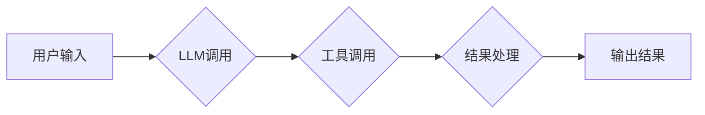

> LangChain, Chain, 自定义, 编程, 自然语言处理, AI, 应用场景

## 1. 背景介绍

近年来，大型语言模型（LLM）的快速发展，为自然语言处理（NLP）领域带来了革命性的变革。这些强大的模型能够理解和生成人类语言，在文本生成、翻译、问答等任务中展现出令人惊叹的性能。然而，直接使用LLM往往需要复杂的代码编写和模型调优，对于普通开发者来说门槛较高。

为了降低使用LLM的难度，并更好地将LLM应用于实际场景，LangChain应运而生。LangChain是一个强大的开源框架，旨在简化LLM的开发和部署。它提供了一系列工具和组件，帮助开发者构建复杂的NLP应用程序，包括：

* **Chain:**  LangChain的核心概念之一，用于串联多个LLM调用和其他工具，实现更复杂的逻辑和功能。
* **Prompt Templates:**  提供模板化的提示结构，方便开发者构建高质量的输入提示，引导LLM生成更准确的输出。
* **Memory:**  提供内存机制，让LLM能够记住之前的对话上下文，实现更自然的对话交互。
* **Agents:**  提供代理机制，让LLM能够自主地执行任务，并与外部环境交互。

## 2. 核心概念与联系

### 2.1 Chain

Chain是LangChain的核心概念之一，它是一种用于串联多个LLM调用和其他工具的机制。通过Chain，开发者可以将多个独立的LLM调用组合成一个完整的流程，实现更复杂的逻辑和功能。

### 2.2 Chain 的组成部分

Chain通常由以下几个部分组成：

* **输入:** Chain接受用户的输入，可以是文本、代码或其他数据类型。
* **LLM调用:** Chain会根据输入调用相应的LLM，获取LLM的输出。
* **工具调用:** Chain可以调用其他工具，例如搜索引擎、数据库等，获取额外的信息。
* **输出:** Chain将最终的结果输出给用户。

### 2.3 Chain 的优势

使用Chain可以带来以下优势：

* **简化代码:** Chain可以将复杂的LLM调用和工具调用封装成一个简单的流程，简化代码编写。
* **提高效率:** Chain可以将多个LLM调用串联起来，提高效率。
* **增强功能:** Chain可以调用其他工具，增强功能。

### 2.4 Mermaid 流程图



## 3. 核心算法原理 & 具体操作步骤

### 3.1 算法原理概述

Chain的算法原理基于**函数式编程**和**管道式处理**的概念。

* **函数式编程:** Chain将每个LLM调用和工具调用视为一个函数，这些函数可以被组合和串联起来。
* **管道式处理:** Chain将输入数据通过一系列函数进行处理，最终得到输出结果。

### 3.2 算法步骤详解

1. **定义Chain:** 使用LangChain提供的API定义Chain的结构，包括LLM调用、工具调用和结果处理逻辑。
2. **准备输入数据:** 将用户的输入数据准备好，并将其传递给Chain的第一个函数。
3. **执行Chain:** Chain会依次执行每个函数，并将每个函数的输出作为下一个函数的输入。
4. **处理结果:** Chain的最后一个函数会处理最终的结果，并将其输出给用户。

### 3.3 算法优缺点

**优点:**

* 简化代码编写
* 提高效率
* 增强功能
* 可扩展性强

**缺点:**

* 对于复杂的逻辑，Chain的结构可能变得复杂
* 需要对LLM和工具有深入的了解

### 3.4 算法应用领域

Chain可以应用于各种NLP场景，例如：

* **聊天机器人:**  构建更智能、更自然的对话机器人。
* **文本摘要:**  自动生成文本摘要。
* **问答系统:**  构建能够回答用户问题的问答系统。
* **代码生成:**  根据自然语言描述生成代码。

## 4. 数学模型和公式 & 详细讲解 & 举例说明

### 4.1 数学模型构建

Chain的算法本质上是一种图论模型，可以将其表示为一个有向图。

* **节点:**  LLM调用、工具调用和结果处理逻辑。
* **边:**  数据流向，表示数据从一个节点传递到另一个节点。

### 4.2 公式推导过程

Chain的输出结果可以表示为：

$$
output = f(input, LLM_1, Tool_1, ..., LLM_n, Tool_n)
$$

其中：

* $output$ 是Chain的输出结果
* $input$ 是用户的输入数据
* $LLM_i$ 和 $Tool_i$ 分别表示第 $i$ 个LLM调用和工具调用
* $f$ 是结果处理逻辑函数

### 4.3 案例分析与讲解

假设我们构建一个Chain用于生成新闻摘要。

* **输入:** 一篇新闻文章
* **LLM调用:** 使用LLM对新闻文章进行理解和分析。
* **工具调用:** 使用工具提取新闻文章的关键信息，例如标题、作者、时间等。
* **结果处理逻辑:** 将LLM的分析结果和工具提取的关键信息组合起来，生成新闻摘要。

## 5. 项目实践：代码实例和详细解释说明

### 5.1 开发环境搭建

* Python 3.8+
* LangChain 0.0.20+
* OpenAI API key

### 5.2 源代码详细实现

```python
from langchain.chains import LLMChain
from langchain.llms import OpenAI
from langchain.prompts import PromptTemplate

# 初始化LLM
llm = OpenAI(temperature=0.7)

# 定义提示模板
template = """
根据以下新闻文章生成一个简短的摘要：

{article}
"""

# 创建PromptTemplate对象
prompt = PromptTemplate(template=template, input_variables=["article"])

# 创建LLMChain对象
chain = LLMChain(llm=llm, prompt=prompt)

# 测试
article = """
##  Elon Musk Buys Twitter for $44 Billion

Tech billionaire Elon Musk has completed his acquisition of Twitter for $44 billion, ending weeks of uncertainty surrounding the deal. Musk, who is also the CEO of Tesla and SpaceX, has long been a vocal critic of Twitter's policies and has promised to make the platform more free speech-friendly. 
"""
summary = chain.run(article)
print(summary)
```

### 5.3 代码解读与分析

* **初始化LLM:** 使用OpenAI类初始化LLM，并设置温度参数以控制模型的随机性。
* **定义提示模板:** 使用PromptTemplate类定义提示模板，将新闻文章作为输入变量。
* **创建PromptTemplate对象:** 将提示模板对象传递给LLMChain对象。
* **创建LLMChain对象:** 使用LLMChain类创建Chain对象，并将LLM和提示模板作为参数。
* **测试:** 使用Chain对象生成新闻摘要。

### 5.4 运行结果展示

```
Elon Musk has completed his acquisition of Twitter for $44 billion, ending weeks of uncertainty surrounding the deal. Musk, who is also the CEO of Tesla and SpaceX, has long been a vocal critic of Twitter's policies and has promised to make the platform more free speech-friendly. 
```

## 6. 实际应用场景

### 6.1 聊天机器人

使用Chain可以构建更智能、更自然的对话机器人。例如，可以将LLM调用与知识库、天气预报API等工具结合，让机器人能够回答用户的问题、提供相关信息和完成任务。

### 6.2 文本摘要

Chain可以用于自动生成文本摘要。例如，可以将LLM调用与关键词提取工具结合，提取文本的关键信息，并将其组合成一个简短的摘要。

### 6.3 问答系统

Chain可以构建能够回答用户问题的问答系统。例如，可以将LLM调用与知识库、搜索引擎等工具结合，让系统能够理解用户的提问，并从知识库中找到答案。

### 6.4 未来应用展望

随着LLM技术的不断发展，Chain的应用场景将会更加广泛。例如，可以将Chain应用于代码生成、机器翻译、创意写作等领域。

## 7. 工具和资源推荐

### 7.1 学习资源推荐

* **LangChain官方文档:** https://python.langchain.com/docs/
* **LangChain GitHub仓库:** https://github.com/langchain-org/langchain

### 7.2 开发工具推荐

* **Python:** https://www.python.org/
* **OpenAI API:** https://platform.openai.com/docs/api-reference

### 7.3 相关论文推荐

* **Chain-of-Thought Prompting Elicits Reasoning in Large Language Models:** https://arxiv.org/abs/2106.11228

## 8. 总结：未来发展趋势与挑战

### 8.1 研究成果总结

LangChain为LLM的开发和应用提供了强大的工具和框架，简化了代码编写，提高了效率，增强了功能。Chain作为LangChain的核心概念，为构建复杂的NLP应用程序提供了新的思路和方法。

### 8.2 未来发展趋势

* **更强大的Chain:** 未来，Chain将会更加强大，能够支持更复杂的逻辑和功能，例如决策、推理和规划。
* **更广泛的应用场景:** Chain将会应用于更多领域，例如医疗、教育、金融等。
* **更易于使用的工具:** LangChain将会提供更易于使用的工具和API，让更多开发者能够轻松地使用LLM。

### 8.3 面临的挑战

* **模型效率:** 复杂的Chain可能会导致模型效率下降，需要进一步优化。
* **可解释性:** 复杂的Chain的决策过程可能难以解释，需要提高模型的可解释性。
* **安全性和可靠性:** 复杂的Chain可能会存在安全性和可靠性问题，需要加强安全性和可靠性方面的研究。

### 8.4 研究展望

未来，我们将继续研究Chain的算法原理和应用场景，开发更强大的Chain工具和框架，推动LLM技术的发展和应用。

## 9. 附录：常见问题与解答

### 9.1 如何选择合适的LLM？

选择合适的LLM取决于具体的应用场景和需求。例如，对于需要高准确率的应用场景，可以选择GPT-3等大型语言模型；对于需要低延迟的应用场景，可以选择更轻量级的LLM。

### 9.2 如何优化Chain的效率？

可以采用以下方法优化Chain的效率：

* 使用更轻量级的LLM。
* 减少Chain的长度。
* 使用缓存机制。
* 使用并行处理技术。

### 9.3 如何提高Chain的可解释性？

可以采用以下方法提高Chain的可解释性：

* 使用可解释的LLM模型。
* 添加可解释性模块到Chain中。
* 使用可视化工具可视化Chain的决策过程。


作者：禅与计算机程序设计艺术 / Zen and the Art of Computer Programming 
<end_of_turn>