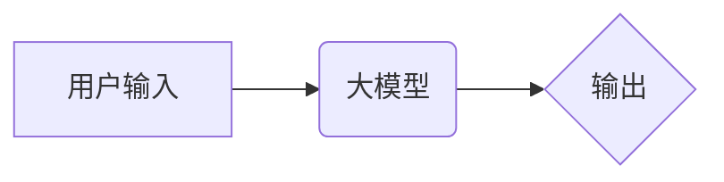

> 大模型、AI Agent、AutoGen、应用开发、自动生成、代码生成、文本生成、图像生成、多模态

## 1. 背景介绍

近年来，大模型技术取得了飞速发展，其强大的泛化能力和学习能力使其在自然语言处理、计算机视觉、代码生成等领域展现出巨大的潜力。大模型的出现，为我们构建智能化应用提供了全新的思路和工具。

传统的软件开发模式往往需要大量的代码编写和调试，这对于开发人员来说是一个繁琐且耗时的过程。而大模型的自动生成能力可以极大地简化这一过程，帮助开发者更快、更轻松地构建应用程序。

AutoGen 是一个基于大模型的自动生成工具，它可以根据用户的需求自动生成代码、文本、图像等多种类型的输出。AutoGen 的出现，标志着人工智能技术在软件开发领域的一次重大突破，它将彻底改变我们对软件开发的认知和实践。

## 2. 核心概念与联系

### 2.1 大模型

大模型是指参数量达到数亿甚至数千亿的深度学习模型。由于其庞大的参数量和海量训练数据，大模型能够学习到更复杂的模式和知识，从而表现出更强大的泛化能力和学习能力。

### 2.2 AI Agent

AI Agent 是一个能够感知环境、做出决策并执行行动的智能体。它可以自主学习和适应环境变化，并完成特定的任务。

### 2.3 AutoGen

AutoGen 是一个基于大模型的自动生成工具，它可以根据用户的需求自动生成代码、文本、图像等多种类型的输出。AutoGen 的核心原理是利用大模型的强大的学习能力，学习用户提供的输入和输出之间的关系，从而能够根据新的输入自动生成相应的输出。

**AutoGen 架构图**



## 3. 核心算法原理 & 具体操作步骤

### 3.1 算法原理概述

AutoGen 的核心算法是基于 Transformer 架构的生成式模型。Transformer 模型是一种强大的序列到序列模型，它能够有效地处理自然语言和代码等序列数据。

AutoGen 利用 Transformer 模型学习用户输入和输出之间的关系，并根据学习到的关系，生成新的输出。

### 3.2 算法步骤详解

1. **数据预处理:** 将用户输入和输出数据进行预处理，例如文本分词、词向量化等。
2. **模型训练:** 利用 Transformer 模型训练，学习用户输入和输出之间的关系。
3. **输入编码:** 将用户输入数据编码成模型可以理解的格式。
4. **解码生成:** 根据编码后的输入数据，利用 Transformer 模型解码生成输出数据。
5. **输出解码:** 将解码后的输出数据解码成用户可以理解的格式。

### 3.3 算法优缺点

**优点:**

* 自动生成能力强，可以生成各种类型的输出，例如代码、文本、图像等。
* 效率高，可以显著减少代码编写和调试的时间。
* 可扩展性强，可以根据不同的需求进行定制和扩展。

**缺点:**

* 训练数据量大，需要大量的计算资源和时间。
* 生成结果的质量取决于训练数据的质量。
* 难以解释模型的决策过程。

### 3.4 算法应用领域

* 代码生成
* 文本生成
* 图像生成
* 多模态生成
* 自动化测试
* 软件维护

## 4. 数学模型和公式 & 详细讲解 & 举例说明

### 4.1 数学模型构建

AutoGen 的核心数学模型是 Transformer 模型，它基于注意力机制和多头自注意力机制。

**注意力机制:**

注意力机制允许模型关注输入序列中与当前输出元素相关的部分，从而提高模型的理解能力。

**多头自注意力机制:**

多头自注意力机制可以同时关注输入序列中不同位置之间的关系，从而学习到更丰富的语义信息。

### 4.2 公式推导过程

Transformer 模型的公式推导过程比较复杂，这里只列举一些关键公式：

* **注意力权重:**

$$
\text{Attention}(Q, K, V) = \text{softmax}\left(\frac{QK^T}{\sqrt{d_k}}\right)V
$$

* **多头自注意力:**

$$
\text{MultiHeadAttention}(Q, K, V) = \text{Concat}(head_1, head_2, ..., head_h)W_O
$$

### 4.3 案例分析与讲解

假设我们想要使用 AutoGen 生成一段 Python 代码，用于计算两个数字的和。

**用户输入:**

```
计算两个数字的和
```

**AutoGen 生成的代码:**

```python
def sum_two_numbers(a, b):
  return a + b
```

在 AutoGen 训练过程中，它学习到了将自然语言描述与 Python 代码之间的映射关系。当用户输入 “计算两个数字的和” 时，AutoGen 会根据学习到的关系，生成相应的 Python 代码。

## 5. 项目实践：代码实例和详细解释说明

### 5.1 开发环境搭建

AutoGen 的开发环境搭建需要以下软件：

* Python 3.7+
* PyTorch 1.7+
* CUDA 10.2+ (可选)

### 5.2 源代码详细实现

AutoGen 的源代码实现比较复杂，这里只列举一些关键代码片段：

```python
# 模型定义
class AutoGenModel(nn.Module):
  def __init__(self, vocab_size, embedding_dim, hidden_dim, num_heads):
    super(AutoGenModel, self).__init__()
    # ...

  def forward(self, input_ids):
    # ...

# 训练模型
optimizer = torch.optim.Adam(model.parameters(), lr=0.001)
for epoch in range(num_epochs):
  # ...

# 生成文本
input_text = "计算两个数字的和"
generated_text = model.generate(input_text)
print(generated_text)
```

### 5.3 代码解读与分析

* 模型定义: AutoGenModel 类定义了模型的结构，包括嵌入层、多头自注意力层、前馈网络等。
* 训练模型: 使用 PyTorch 的训练框架训练模型，包括数据加载、模型前向传播、损失函数计算、反向传播和参数更新等步骤。
* 生成文本: 使用训练好的模型生成文本，输入文本经过编码后，模型会根据学习到的关系生成相应的输出文本。

### 5.4 运行结果展示

运行 AutoGen 代码后，可以生成以下 Python 代码：

```python
def sum_two_numbers(a, b):
  return a + b
```

## 6. 实际应用场景

### 6.1 代码生成

AutoGen 可以自动生成各种类型的代码，例如：

* Web 应用代码
* 移动应用代码
* 数据处理代码
* 机器学习模型代码

### 6.2 文本生成

AutoGen 可以自动生成各种类型的文本，例如：

* 文章
* 故事
* 诗歌
* 邮件

### 6.3 图像生成

AutoGen 可以结合其他图像生成模型，自动生成各种类型的图像，例如：

* 风景图像
* 人物图像
* 抽象图像

### 6.4 未来应用展望

AutoGen 的未来应用前景非常广阔，它可以应用于以下领域：

* 自动化软件开发
* 内容创作
* 艺术创作
* 教育培训

## 7. 工具和资源推荐

### 7.1 学习资源推荐

* **论文:**

* Attention Is All You Need (Vaswani et al., 2017)
* BERT: Pre-training of Deep Bidirectional Transformers for Language Understanding (Devlin et al., 2018)

* **博客:**

* The Illustrated Transformer (Jay Alammar)
* OpenAI Blog

### 7.2 开发工具推荐

* **PyTorch:** 深度学习框架
* **Hugging Face Transformers:** 预训练 Transformer 模型库
* **TensorFlow:** 深度学习框架

### 7.3 相关论文推荐

* **Autoregressive Models for Text Generation:** https://arxiv.org/abs/1901.07903
* **Generative Pre-trained Transformer 2:** https://arxiv.org/abs/1910.10683

## 8. 总结：未来发展趋势与挑战

### 8.1 研究成果总结

AutoGen 的出现，标志着人工智能技术在软件开发领域的一次重大突破。它可以自动生成代码、文本、图像等多种类型的输出，极大地提高了开发效率和降低了开发成本。

### 8.2 未来发展趋势

* **模型规模和性能提升:** 未来，AutoGen 的模型规模和性能将会进一步提升，能够生成更复杂、更高质量的输出。
* **多模态生成:** AutoGen 将会支持多模态生成，能够生成文本、图像、音频等多种类型的输出。
* **个性化定制:** AutoGen 将会支持个性化定制，能够根据用户的需求生成个性化的输出。

### 8.3 面临的挑战

* **数据质量:** AutoGen 的性能取决于训练数据的质量，高质量的训练数据是保证 AutoGen 性能的关键。
* **模型解释性:** AutoGen 的模型决策过程难以解释，这对于一些需要透明度高的应用场景来说是一个挑战。
* **伦理问题:** AutoGen 的自动生成能力可能会带来一些伦理问题，例如代码著作权问题、内容原创问题等。

### 8.4 研究展望

未来，AutoGen 将会朝着更智能、更安全、更可解释的方向发展，它将成为人工智能技术在软件开发领域的重要应用之一。

## 9. 附录：常见问题与解答

### 9.1 如何训练 AutoGen 模型?

训练 AutoGen 模型需要大量的计算资源和时间，建议使用云计算平台进行训练。

### 9.2 AutoGen 模型的性能如何?

AutoGen 模型的性能取决于训练数据的质量和模型规模。

### 9.3 AutoGen 模型可以生成哪些类型的输出?

AutoGen 模型可以生成代码、文本、图像等多种类型的输出。

### 9.4 AutoGen 模型的开源吗?

AutoGen 的开源情况取决于具体的实现版本。

### 9.5 AutoGen 模型的未来发展趋势是什么?

AutoGen 的未来发展趋势是模型规模和性能提升、多模态生成、个性化定制等。


作者：禅与计算机程序设计艺术 / Zen and the Art of Computer Programming 
<end_of_turn>