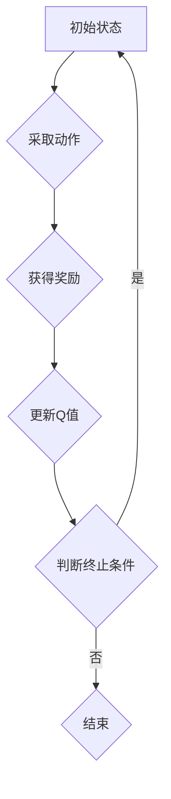

> Q-learning, 深度强化学习, 新冠病毒防控, 疫情预测, 资源分配, 决策优化

## 1. 背景介绍

新冠疫情的爆发对全球社会造成了巨大冲击，突显了公共卫生体系的脆弱性和应对突发公共卫生事件的迫切需求。传统疫情防控方法往往依赖于经验和专家判断，难以应对疫情的复杂性和动态变化。近年来，人工智能技术，特别是深度强化学习（Deep Reinforcement Learning，DRL）在解决复杂决策问题方面展现出巨大的潜力。

Q-learning作为DRL的核心算法之一，通过学习环境的反馈信息，不断优化策略，最终达到最大化奖励的目标。其强大的学习能力和适应性使其成为疫情防控领域的重要工具。

## 2. 核心概念与联系

**2.1  Q-learning算法原理**

Q-learning是一种基于价值函数的强化学习算法，其核心思想是通过学习状态-动作对的价值函数，选择最优的动作以最大化长期奖励。

**2.2  Q-learning与疫情防控的联系**

在疫情防控场景中，我们可以将：

* **状态（State）**：表示疫情的当前状态，例如感染人数、治愈人数、死亡人数、社会活动水平等。
* **动作（Action）**：表示可采取的防控措施，例如隔离措施、检测力度、医疗资源分配等。
* **奖励（Reward）**：表示采取特定动作带来的效益，例如降低感染人数、减少死亡人数、恢复社会经济活动等。

通过Q-learning算法，我们可以学习到不同状态下采取不同动作的价值函数，从而制定最优的防控策略，最大化疫情防控效果。

**2.3  Q-learning流程图**



## 3. 核心算法原理 & 具体操作步骤

**3.1  算法原理概述**

Q-learning算法的核心是通过迭代更新状态-动作对的价值函数Q(s,a)，其中s表示状态，a表示动作。Q值代表采取动作a在状态s下获得的长期奖励期望。

**3.2  算法步骤详解**

1. **初始化Q值表**: 将所有状态-动作对的Q值初始化为0或一个小值。
2. **根据策略选择动作**: 在当前状态下，根据一定的策略选择一个动作。
3. **执行动作并获得奖励**: 执行选择的动作，并从环境中获得奖励。
4. **更新Q值**: 根据Bellman方程更新Q值：

 $$Q(s,a) = Q(s,a) + \alpha [r + \gamma \max_{a'} Q(s',a') - Q(s,a)]$$

其中：

* $\alpha$ 是学习率，控制着学习速度。
* $r$ 是当前状态下获得的奖励。
* $\gamma$ 是折扣因子，控制着未来奖励的权重。
* $s'$ 是执行动作后进入的新状态。
* $a'$ 是在新的状态下选择的最优动作。

5. **重复步骤2-4**: 直到达到终止条件，例如达到最大迭代次数或达到目标奖励。

**3.3  算法优缺点**

**优点:**

* 能够学习复杂的决策策略。
* 不需要事先知道环境模型。
* 能够在线学习和适应环境变化。

**缺点:**

* 训练时间较长。
* 需要大量的样本数据进行训练。
* 容易陷入局部最优解。

**3.4  算法应用领域**

Q-learning算法广泛应用于各种领域，例如：

* 游戏人工智能
* 自动驾驶
* 机器人控制
* 医疗诊断
* 金融投资

## 4. 数学模型和公式 & 详细讲解 & 举例说明

**4.1  数学模型构建**

在疫情防控场景下，我们可以构建一个马尔可夫决策过程（Markov Decision Process，MDP）模型来描述疫情的演变过程。

MDP模型包含以下要素：

* 状态空间 S：表示疫情的各种可能状态，例如感染人数、治愈人数、死亡人数、社会活动水平等。
* 动作空间 A：表示可采取的防控措施，例如隔离措施、检测力度、医疗资源分配等。
* 转移概率矩阵 P：描述从一个状态到另一个状态的概率，取决于采取的动作。
* 奖励函数 R：描述采取特定动作在特定状态下获得的奖励，例如降低感染人数、减少死亡人数、恢复社会经济活动等。

**4.2  公式推导过程**

Q-learning算法的目标是学习状态-动作对的价值函数Q(s,a)，其更新公式如下：

$$Q(s,a) = Q(s,a) + \alpha [r + \gamma \max_{a'} Q(s',a') - Q(s,a)]$$

其中：

* $\alpha$ 是学习率，控制着学习速度。
* $r$ 是当前状态下获得的奖励。
* $\gamma$ 是折扣因子，控制着未来奖励的权重。
* $s'$ 是执行动作后进入的新状态。
* $a'$ 是在新的状态下选择的最优动作。

**4.3  案例分析与讲解**

假设我们有一个简单的疫情防控场景，状态空间包含三个状态：低风险、中风险、高风险。动作空间包含三个动作：加强检测、加强隔离、增加医疗资源。

我们可以根据实际数据构建转移概率矩阵和奖励函数，然后使用Q-learning算法学习状态-动作对的价值函数。

例如，如果当前状态是中风险，采取加强检测的动作，则可以获得一定的奖励，并转移到低风险状态。

通过不断学习和更新Q值，最终可以找到最优的防控策略，例如在中风险状态下，采取加强检测的动作可以有效降低疫情风险。

## 5. 项目实践：代码实例和详细解释说明

**5.1  开发环境搭建**

* Python 3.x
* TensorFlow 或 PyTorch 深度学习框架
* NumPy 科学计算库
* Matplotlib 数据可视化库

**5.2  源代码详细实现**

```python
import numpy as np
from tensorflow.keras.models import Sequential
from tensorflow.keras.layers import Dense

# 定义状态空间、动作空间和奖励函数
# ...

# 初始化Q值表
Q = np.zeros((num_states, num_actions))

# 设置学习参数
alpha = 0.1
gamma = 0.9

# 训练Q-learning算法
for episode in range(num_episodes):
    state = env.reset()
    done = False
    while not done:
        # 根据epsilon-greedy策略选择动作
        if np.random.rand() < epsilon:
            action = env.action_space.sample()
        else:
            action = np.argmax(Q[state, :])

        # 执行动作并获得奖励和下一个状态
        next_state, reward, done, _ = env.step(action)

        # 更新Q值
        Q[state, action] = Q[state, action] + alpha * (reward + gamma * np.max(Q[next_state, :]) - Q[state, action])

        state = next_state

# 使用训练好的Q值表进行预测
# ...

```

**5.3  代码解读与分析**

* 代码首先定义了状态空间、动作空间和奖励函数。
* 然后初始化Q值表，并设置学习参数。
* 训练循环中，根据epsilon-greedy策略选择动作，执行动作并获得奖励和下一个状态。
* 最后更新Q值，并使用训练好的Q值表进行预测。

**5.4  运行结果展示**

运行代码后，可以得到训练过程中的Q值变化曲线和预测结果。

## 6. 实际应用场景

**6.1  疫情预测**

利用Q-learning算法学习疫情传播规律，预测未来感染人数、治愈人数、死亡人数等，为疫情防控决策提供参考。

**6.2  资源分配**

根据疫情发展趋势和资源需求，优化医疗资源、物资分配等，最大化资源利用效率。

**6.3  防控策略优化**

根据不同地区、不同人群的疫情风险，制定个性化的防控策略，提高防控效果。

**6.4  未来应用展望**

随着人工智能技术的不断发展，Q-learning算法在疫情防控领域的应用将更加广泛和深入，例如：

* 利用大数据和人工智能技术，构建更精准的疫情预测模型。
* 开发智能化的疫情防控机器人，协助医护人员进行疫情防控工作。
* 利用虚拟现实技术，模拟疫情传播场景，进行疫情防控演练。

## 7. 工具和资源推荐

**7.1  学习资源推荐**

* **书籍:**
    * Reinforcement Learning: An Introduction by Richard S. Sutton and Andrew G. Barto
    * Deep Reinforcement Learning Hands-On by Maxim Lapan
* **在线课程:**
    * Coursera: Reinforcement Learning Specialization
    * Udacity: Deep Reinforcement Learning Nanodegree

**7.2  开发工具推荐**

* **Python:** 
    * TensorFlow
    * PyTorch
* **环境管理工具:**
    * conda
    * virtualenv

**7.3  相关论文推荐**

* **Deep Reinforcement Learning for Epidemic Control**
* **Q-Learning for Optimal Resource Allocation in Pandemic Response**
* **A Reinforcement Learning Approach to Pandemic Preparedness**

## 8. 总结：未来发展趋势与挑战

**8.1  研究成果总结**

Q-learning算法在疫情防控领域展现出巨大的潜力，能够有效地预测疫情发展趋势、优化资源分配、制定防控策略。

**8.2  未来发展趋势**

未来，Q-learning算法在疫情防控领域的应用将更加深入和广泛，例如：

* 利用更先进的深度学习算法，构建更精准的疫情预测模型。
* 将Q-learning算法与其他人工智能技术结合，例如自然语言处理、计算机视觉等，实现更智能化的疫情防控。
* 开发面向不同场景的定制化Q-learning算法，例如针对不同人群、不同地区、不同疫情阶段的防控策略。

**8.3  面临的挑战**

Q-learning算法在疫情防控领域的应用也面临一些挑战，例如：

* 缺乏真实世界的疫情数据，难以训练出准确的模型。
* 疫情防控是一个复杂多变的系统，模型难以适应环境变化。
* 算法的解释性和可解释性不足，难以获得公众的信任。

**8.4  研究展望**

未来，需要加强与疫情防控领域的合作，收集更多真实世界的疫情数据，开发更 robust 和可解释的Q-learning算法，推动Q-learning算法在疫情防控领域的应用。

## 9. 附录：常见问题与解答

**9.1  Q-learning算法与其他强化学习算法有什么区别？**

Q-learning算法是一种基于价值函数的强化学习算法，而其他强化学习算法，例如SARSA算法，则基于策略迭代。

**9.2  Q-learning算法的学习率和折扣因子如何设置？**

学习率控制着学习速度，折扣因子控制着未来奖励的权重。

**9.3  如何评估Q-learning算法的性能？**

可以使用奖励总和、平均奖励等指标来评估Q-learning算法的性能。


作者：禅与计算机程序设计艺术 / Zen and the Art of Computer Programming 
<end_of_turn>