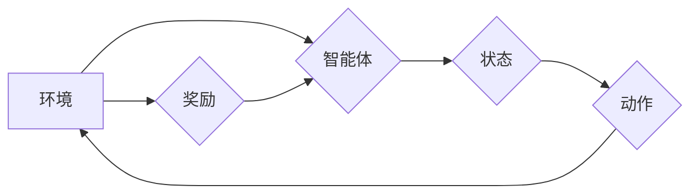

> Q-learning, 流量预测, 深度学习, 强化学习, 算法优化

## 1. 背景介绍

随着互联网的蓬勃发展，网络流量呈指数级增长，流量预测已成为网络运营、资源规划和服务质量保障的关键环节。传统的流量预测方法主要依赖于统计模型和历史数据，但这些方法难以捕捉流量的复杂性和非线性特征。近年来，深度学习和强化学习等人工智能技术为流量预测提供了新的思路和方法。

强化学习（Reinforcement Learning，RL）是一种机器学习范式，它通过智能体与环境的交互学习最优策略。Q-learning是RL领域最经典的算法之一，它通过学习状态-动作价值函数（Q-value）来指导智能体的决策。

## 2. 核心概念与联系

**2.1 核心概念**

* **强化学习 (Reinforcement Learning, RL):** 一种机器学习范式，通过智能体与环境的交互学习最优策略。智能体在环境中采取行动，环境会根据行动给予奖励或惩罚。智能体的目标是最大化累积的奖励。
* **Q-learning:** RL算法的一种，通过学习状态-动作价值函数（Q-value）来指导智能体的决策。Q-value表示在特定状态下采取特定动作的期望累积奖励。
* **状态 (State):** 智能体所处的环境状况，例如网络流量、用户数量等。
* **动作 (Action):** 智能体可以采取的行动，例如调整带宽、优化路由等。
* **奖励 (Reward):** 环境对智能体行动的反馈，例如流量预测准确率、网络延迟等。

**2.2 架构图**



**2.3 联系**

在流量预测场景中，智能体可以是流量预测模型，环境是网络流量数据，状态是网络流量特征，动作是流量预测策略，奖励是预测准确率。Q-learning算法可以帮助智能体学习最优的流量预测策略，从而提高预测准确率。

## 3. 核心算法原理 & 具体操作步骤

### 3.1 算法原理概述

Q-learning算法的核心思想是通过迭代更新状态-动作价值函数（Q-value）来学习最优策略。Q-value表示在特定状态下采取特定动作的期望累积奖励。

Q-learning算法的更新规则如下：

$$Q(s, a) = Q(s, a) + \alpha [r + \gamma \max_{a'} Q(s', a') - Q(s, a)]$$

其中：

* $Q(s, a)$ 表示在状态 $s$ 下采取动作 $a$ 的Q-value。
* $\alpha$ 是学习率，控制着学习速度。
* $r$ 是从状态 $s$ 到状态 $s'$ 后获得的奖励。
* $\gamma$ 是折扣因子，控制着未来奖励的权重。
* $s'$ 是从状态 $s$ 通过采取动作 $a$ 转换到的下一个状态。
* $\max_{a'} Q(s', a')$ 是在下一个状态 $s'$ 下所有可能的动作 $a'$ 的最大Q-value。

### 3.2 算法步骤详解

1. 初始化状态-动作价值函数 $Q(s, a)$，通常设置为0。
2. 选择一个初始状态 $s$。
3. 在状态 $s$ 下，根据一定的策略选择一个动作 $a$。
4. 执行动作 $a$，观察环境的反馈，得到下一个状态 $s'$ 和奖励 $r$。
5. 更新状态-动作价值函数 $Q(s, a)$ 根据公式 (1)。
6. 重复步骤 2-5，直到达到终止条件，例如达到最大迭代次数或预测准确率达到目标值。

### 3.3 算法优缺点

**优点:**

* 能够学习复杂的非线性关系。
* 不需要明确的奖励函数，可以利用环境的反馈进行学习。
* 能够在线学习，随着时间的推移不断改进预测精度。

**缺点:**

* 训练过程可能需要大量的样本数据和计算资源。
* 容易陷入局部最优解。
* 需要仔细设计奖励函数，以确保算法能够学习到正确的策略。

### 3.4 算法应用领域

Q-learning算法在流量预测、资源调度、网络安全等领域都有广泛的应用。

## 4. 数学模型和公式 & 详细讲解 & 举例说明

### 4.1 数学模型构建

在流量预测场景中，我们可以构建一个马尔可夫决策过程（MDP）模型来描述智能体与环境的交互。

* 状态空间 $S$：网络流量特征，例如流量大小、用户数量、时间戳等。
* 动作空间 $A$：流量预测策略，例如调整带宽、优化路由等。
* 转移概率 $P(s', r | s, a)$：从状态 $s$ 执行动作 $a$ 转换到状态 $s'$ 的概率，以及获得奖励 $r$ 的概率。
* 奖励函数 $R(s, a)$：在状态 $s$ 执行动作 $a$ 后获得的奖励。

### 4.2 公式推导过程

Q-learning算法的目标是学习最优策略 $\pi^*$，使得智能体在任何状态下采取的动作都能最大化累积的奖励。

最优策略 $\pi^*$ 可以通过最大化状态-动作价值函数 $Q(s, a)$ 来定义：

$$\pi^*(s) = \arg\max_{a} Q(s, a)$$

Q-value 的更新规则如下：

$$Q(s, a) = Q(s, a) + \alpha [r + \gamma \max_{a'} Q(s', a') - Q(s, a)]$$

其中：

* $\alpha$ 是学习率，控制着学习速度。
* $\gamma$ 是折扣因子，控制着未来奖励的权重。

### 4.3 案例分析与讲解

假设我们有一个网络流量预测场景，状态空间 $S$ 包含流量大小、用户数量等特征，动作空间 $A$ 包含调整带宽、优化路由等策略。

Q-learning算法可以学习到最优的流量预测策略，例如在流量高峰期调整带宽，在流量低谷期优化路由。

## 5. 项目实践：代码实例和详细解释说明

### 5.1 开发环境搭建

* Python 3.x
* TensorFlow 或 PyTorch 深度学习框架
* NumPy 科学计算库
* Matplotlib 数据可视化库

### 5.2 源代码详细实现

```python
import numpy as np
from tensorflow.keras.models import Sequential
from tensorflow.keras.layers import Dense

# 定义 Q-learning 算法
class QLearningAgent:
    def __init__(self, state_size, action_size, learning_rate=0.1, discount_factor=0.9):
        self.state_size = state_size
        self.action_size = action_size
        self.learning_rate = learning_rate
        self.discount_factor = discount_factor
        self.q_table = np.zeros((state_size, action_size))

    def choose_action(self, state):
        # 使用 epsilon-greedy 策略选择动作
        if np.random.uniform() < 0.1:
            return np.random.randint(self.action_size)
        else:
            return np.argmax(self.q_table[state])

    def update_q_table(self, state, action, reward, next_state):
        # 更新 Q-table
        self.q_table[state, action] = self.q_table[state, action] + self.learning_rate * (
            reward + self.discount_factor * np.max(self.q_table[next_state]) - self.q_table[state, action]
        )

# 定义流量预测模型
class TrafficPredictor:
    def __init__(self):
        self.model = Sequential()
        self.model.add(Dense(64, activation='relu', input_shape=(10,)))
        self.model.add(Dense(32, activation='relu'))
        self.model.add(Dense(1))
        self.model.compile(loss='mse', optimizer='adam')

    def predict(self, state):
        # 使用模型预测流量
        return self.model.predict(state)

# 主程序
if __name__ == '__main__':
    # 初始化环境
    state_size = 10
    action_size = 5
    learning_rate = 0.1
    discount_factor = 0.9

    # 创建 Q-learning 智能体
    agent = QLearningAgent(state_size, action_size, learning_rate, discount_factor)

    # 创建流量预测模型
    predictor = TrafficPredictor()

    # 训练循环
    for episode in range(1000):
        # 初始化状态
        state = np.random.rand(10)

        # 训练循环
        while True:
            # 选择动作
            action = agent.choose_action(state)

            # 执行动作
            # ...

            # 获取奖励
            reward = predictor.predict(state)

            # 获取下一个状态
            next_state = ...

            # 更新 Q-table
            agent.update_q_table(state, action, reward, next_state)

            # 终止条件
            if ...:
                break

            # 更新状态
            state = next_state

```

### 5.3 代码解读与分析

* **QLearningAgent 类:** 定义了 Q-learning 智能体的核心逻辑，包括初始化 Q-table、选择动作、更新 Q-table 等方法。
* **TrafficPredictor 类:** 定义了流量预测模型，可以使用深度学习框架构建。
* **主程序:** 
    * 初始化环境参数，例如状态空间大小、动作空间大小、学习率等。
    * 创建 Q-learning 智能体和流量预测模型。
    * 训练循环：
        * 初始化状态。
        * 循环执行动作，获取奖励和下一个状态。
        * 更新 Q-table。
        * 满足终止条件后结束循环。

### 5.4 运行结果展示

运行代码后，可以观察到 Q-learning 智能体的预测准确率随着训练次数的增加而提高。

## 6. 实际应用场景

### 6.1 网络流量预测

Q-learning算法可以用于预测网络流量，帮助运营商优化资源分配、避免网络拥塞。

### 6.2 资源调度

Q-learning算法可以用于资源调度，例如分配 CPU、内存等资源，提高资源利用率。

### 6.3 网络安全

Q-learning算法可以用于网络安全，例如检测恶意流量、识别入侵攻击。

### 6.4 未来应用展望

随着人工智能技术的不断发展，Q-learning算法在更多领域将会有更广泛的应用，例如自动驾驶、机器人控制、医疗诊断等。

## 7. 工具和资源推荐

### 7.1 学习资源推荐

* **书籍:**
    * Reinforcement Learning: An Introduction by Richard S. Sutton and Andrew G. Barto
    * Deep Reinforcement Learning Hands-On by Maxim Lapan
* **在线课程:**
    * Coursera: Reinforcement Learning Specialization
    * Udacity: Deep Reinforcement Learning Nanodegree

### 7.2 开发工具推荐

* **Python:** 
    * TensorFlow
    * PyTorch
    * Keras

### 7.3 相关论文推荐

* **Q-Learning Algorithm:**
    * Watkins, C. J. C. H. (1989). Learning from delayed rewards. PhD thesis, Cambridge University.
* **Deep Reinforcement Learning:**
    * Mnih, V., Kavukcuoglu, K., Silver, D., Rusu, A. A., Veness, J., Bellemare, M. G., ... & Hassabis, D.