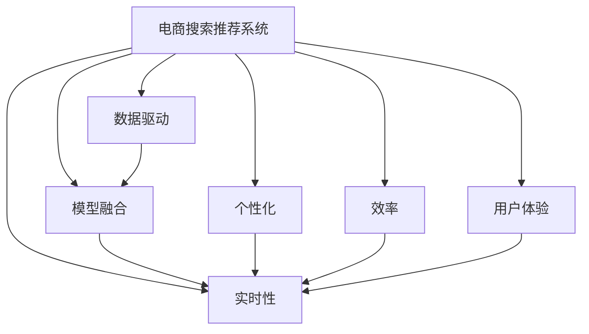

                 

# 大数据驱动的电商搜索推荐系统：AI 模型融合是核心，用户体验优化是关键

## 1. 背景介绍

### 1.1 问题由来
随着电子商务的兴起和技术的不断发展，电商搜索推荐系统已经成为各大电商企业竞争力的重要组成部分。早期的推荐系统以简单的规则、统计方法为基础，但随着数据量和用户行为复杂性的增加，传统的推荐方法已无法满足用户的个性化需求。

近年来，人工智能技术（AI）被广泛应用于电商搜索推荐系统中，显著提升了推荐效果。AI推荐系统通过大数据分析和机器学习算法，能够从海量用户行为数据中挖掘出有价值的特征和模式，从而提供个性化的推荐内容。

随着数据规模的不断扩大，电商企业面临着数据处理和模型训练的挑战。同时，如何优化用户体验、提高推荐系统的性能和效率，也是电商企业必须解决的重要问题。

### 1.2 问题核心关键点
当前电商搜索推荐系统核心关键点包括：

- **数据驱动**：推荐系统需要处理大量的用户行为数据，从中提取有价值的特征和模式。
- **模型融合**：单一的推荐模型可能无法全面覆盖不同用户的多样化需求，需要通过多种模型的融合来提高推荐效果。
- **实时性**：用户搜索行为是实时变化的，推荐系统需要快速响应用户请求，实现实时推荐。
- **个性化**：推荐系统需根据用户的历史行为和当前需求，提供个性化的推荐内容。
- **效率**：处理大规模数据和实时计算的要求，对推荐系统的计算效率提出了很高的要求。
- **用户体验**：推荐系统的目标是提升用户体验，提高用户满意度和忠诚度。

## 2. 核心概念与联系

### 2.1 核心概念概述

为了更好地理解电商搜索推荐系统，本节将介绍几个密切相关的核心概念：

- **电商搜索推荐系统（E-commerce Search and Recommendation System）**：基于大数据和人工智能技术，通过分析和理解用户行为，为电商用户提供个性化搜索结果和推荐内容。

- **数据驱动（Data-Driven）**：利用大数据分析技术，从历史用户行为数据中提取有价值的特征和模式，作为推荐决策的依据。

- **模型融合（Model Fusion）**：结合多种推荐模型，综合考虑不同模型的优点，提高推荐系统的性能和鲁棒性。

- **实时性（Real-time）**：通过高效的计算和存储技术，实现对用户实时搜索请求的快速响应。

- **个性化（Personalization）**：根据用户的历史行为和当前需求，提供符合用户偏好的个性化推荐。

- **效率（Efficiency）**：推荐系统需要处理海量数据和实时请求，对计算效率和存储优化提出了高要求。

- **用户体验（User Experience）**：提升用户满意度、忠诚度和转化率是推荐系统的最终目标。

这些核心概念之间的逻辑关系可以通过以下Mermaid流程图来展示：



这个流程图展示了大数据驱动的电商搜索推荐系统的核心概念及其之间的关系：

1. 电商搜索推荐系统利用数据驱动，从历史用户行为中提取特征和模式。
2. 数据驱动的推荐模型通过模型融合，结合多种模型提高性能和鲁棒性。
3. 实时性和个性化是推荐系统的关键性能指标。
4. 高效的计算和存储技术保证了系统的实时响应。
5. 用户体验是推荐系统的最终目标，通过提升用户满意度和忠诚度来实现。

## 3. 核心算法原理 & 具体操作步骤

### 3.1 算法原理概述

电商搜索推荐系统主要采用基于协同过滤、内容推荐、混合推荐等算法进行推荐。这些算法通过处理用户行为数据，提取用户特征，找到相似用户或物品，从而实现推荐。

协同过滤推荐：基于用户-物品的相似度，通过分析用户的历史行为和偏好，推荐用户可能感兴趣的新物品。协同过滤算法分为基于用户的协同过滤和基于物品的协同过滤两种。

内容推荐：通过分析物品的属性和特征，找到与用户当前兴趣相关的物品。内容推荐算法通常依赖于物品的标签、分类等信息。

混合推荐：结合协同过滤和内容推荐等多种推荐方法，综合考虑不同算法优缺点，提高推荐效果。

### 3.2 算法步骤详解

电商搜索推荐系统的推荐流程通常包括以下几个关键步骤：

**Step 1: 数据预处理和特征提取**
- 收集电商平台的交易记录、搜索记录、用户行为日志等数据。
- 对原始数据进行清洗和去重，去除异常值和噪声。
- 提取用户行为特征和物品特征，如用户购买历史、浏览历史、评分、评论等。

**Step 2: 相似度计算**
- 根据用户历史行为数据，计算用户-物品相似度，找到与用户兴趣相关的物品。
- 利用协同过滤算法，找到与目标物品相似的物品，推荐给用户。

**Step 3: 模型训练和优化**
- 使用机器学习算法，如逻辑回归、决策树、随机森林等，对用户行为数据进行训练，得到推荐模型。
- 对模型进行评估和优化，调整模型参数，提升推荐效果。

**Step 4: 推荐结果生成**
- 根据用户的历史行为和当前需求，结合模型计算结果，生成推荐列表。
- 对推荐列表进行排序和过滤，去除重复和低质量的商品。

**Step 5: 用户体验优化**
- 通过A/B测试和用户反馈，优化推荐算法和界面设计，提升用户满意度。
- 实时监控推荐系统的性能和用户反馈，不断迭代和改进。

### 3.3 算法优缺点

电商搜索推荐系统的主要优点包括：

1. **个性化推荐**：能够根据用户历史行为和当前需求，提供个性化推荐内容。
2. **实时响应**：能够快速响应用户搜索请求，提供即时推荐。
3. **多样化模型**：融合多种推荐模型，提高推荐效果和鲁棒性。

但同时也存在一些局限性：

1. **数据质量问题**：用户行为数据的完整性和准确性直接影响推荐效果。
2. **冷启动问题**：对于新用户和新物品，推荐系统需要更多的数据来计算相似度。
3. **计算资源消耗**：处理大规模数据和实时计算的要求，对计算资源消耗较高。
4. **模型复杂性**：多种推荐模型的融合增加了系统的复杂性，维护成本较高。
5. **用户隐私**：用户行为数据涉及个人隐私，需要严格保护。

尽管存在这些局限性，但电商搜索推荐系统已经在大规模电商平台上得到了广泛应用，并取得了显著效果。未来相关研究的重点在于如何进一步提升推荐系统的效率和效果，同时兼顾用户隐私和体验优化。

### 3.4 算法应用领域

电商搜索推荐系统已经在众多电商平台上得到了广泛应用，覆盖了几乎所有常见场景，例如：

- 商品推荐：根据用户历史浏览和购买行为，推荐用户可能感兴趣的商品。
- 搜索排序：对用户搜索关键词进行排序，推荐最相关的商品。
- 个性化展示：在搜索结果页展示个性化的广告和商品，提高用户点击率。
- 价格推荐：根据用户购买历史和市场趋势，推荐最合适的商品价格。
- 购物车推荐：对用户的购物车内容进行推荐，提高购物转化率。

除了上述这些经典应用外，电商搜索推荐系统还被创新性地应用到更多场景中，如动态定价、智能客服、库存管理等，为电商平台的业务运营带来了新的机遇。

## 4. 数学模型和公式 & 详细讲解

### 4.1 数学模型构建

电商搜索推荐系统主要使用协同过滤和内容推荐算法进行推荐。下面我们以协同过滤算法为例，进行数学模型的构建。

假设用户集合为 $U$，物品集合为 $I$，用户-物品评分矩阵为 $R$。协同过滤推荐算法包括：

- **基于用户的协同过滤**：找到与目标用户 $u$ 兴趣相似的用户 $u'$，推荐其评分较高的物品 $i$。

$$
i' = \arg\max_{i \in I} \sum_{u' \in U} R_{u',i} \alpha_{u,u'}
$$

其中 $\alpha_{u,u'}$ 为相似度系数，用于衡量用户 $u$ 和 $u'$ 的相似程度。

- **基于物品的协同过滤**：找到与目标物品 $i$ 相似的物品 $i'$，推荐给用户 $u$。

$$
i' = \arg\max_{i' \in I} \sum_{i \in I} R_{u,i'} \alpha_{i,i'}
$$

其中 $\alpha_{i,i'}$ 为相似度系数，用于衡量物品 $i$ 和 $i'$ 的相似程度。

### 4.2 公式推导过程

以下我们将对基于用户的协同过滤算法进行公式推导。

假设用户集合为 $U=\{u_1, u_2, \ldots, u_m\}$，物品集合为 $I=\{i_1, i_2, \ldots, i_n\}$，用户-物品评分矩阵为 $R_{m \times n}$。设用户 $u_j$ 对物品 $i_k$ 的评分记为 $R_{j,k}$。

基于用户的协同过滤算法包括两个步骤：

1. 计算用户间的相似度系数 $\alpha_{u,u'}$。
   - 常见方法包括余弦相似度、皮尔逊相关系数等。这里以余弦相似度为例进行推导。

   余弦相似度 $\alpha_{u,u'}$ 定义为：

   $$
   \alpha_{u,u'} = \frac{\sum_{i=1}^n R_{u,i}R_{u',i}}{\sqrt{\sum_{i=1}^n R_{u,i}^2} \sqrt{\sum_{i=1}^n R_{u',i}^2}}
   $$

2. 根据相似度系数计算推荐物品 $i'$。

   对于目标用户 $u$，找到与 $u$ 兴趣相似的用户 $u'$，其评分较高的物品 $i'$ 推荐给用户 $u$。

   $$
   i' = \arg\max_{i \in I} \sum_{u' \in U} R_{u',i} \alpha_{u,u'}
   $$

   其中 $R_{u',i}$ 为相似用户 $u'$ 对物品 $i$ 的评分，$\alpha_{u,u'}$ 为 $u$ 和 $u'$ 的相似度系数。

### 4.3 案例分析与讲解

假设有一个电商平台，收集了100万用户的历史行为数据，包括购买、浏览、评分等行为。用户 $u$ 对物品 $i$ 的评分记为 $R_{u,i}$。

为了找到与 $u$ 兴趣相似的用户 $u'$，并推荐其评分较高的物品 $i'$，可以进行如下步骤：

1. 计算用户间的余弦相似度 $\alpha_{u,u'}$。
   - 使用余弦相似度公式计算 $u$ 和 $u'$ 的相似度系数。

   $$
   \alpha_{u,u'} = \frac{\sum_{i=1}^n R_{u,i}R_{u',i}}{\sqrt{\sum_{i=1}^n R_{u,i}^2} \sqrt{\sum_{i=1}^n R_{u',i}^2}}
   $$

   其中 $R_{u,i}$ 和 $R_{u',i}$ 为 $u$ 和 $u'$ 对物品 $i$ 的评分。

2. 根据相似度系数计算推荐物品 $i'$。

   对于目标用户 $u$，找到与 $u$ 兴趣相似的用户 $u'$，其评分较高的物品 $i'$ 推荐给用户 $u$。

   $$
   i' = \arg\max_{i \in I} \sum_{u' \in U} R_{u',i} \alpha_{u,u'}
   $$

   其中 $R_{u',i}$ 为相似用户 $u'$ 对物品 $i$ 的评分，$\alpha_{u,u'}$ 为 $u$ 和 $u'$ 的相似度系数。

## 5. 项目实践：代码实例和详细解释说明

### 5.1 开发环境搭建

在进行电商搜索推荐系统开发前，我们需要准备好开发环境。以下是使用Python进行TensorFlow开发的环境配置流程：

1. 安装Anaconda：从官网下载并安装Anaconda，用于创建独立的Python环境。

2. 创建并激活虚拟环境：
```bash
conda create -n tf-env python=3.8 
conda activate tf-env
```

3. 安装TensorFlow：根据CUDA版本，从官网获取对应的安装命令。例如：
```bash
conda install tensorflow -c conda-forge
```

4. 安装必要的第三方库：
```bash
pip install pandas numpy scikit-learn matplotlib seaborn
```

完成上述步骤后，即可在`tf-env`环境中开始电商搜索推荐系统的开发。

### 5.2 源代码详细实现

下面我们以基于协同过滤的推荐系统为例，给出使用TensorFlow进行电商搜索推荐系统的PyTorch代码实现。

首先，定义协同过滤推荐模型的超参数：

```python
import tensorflow as tf

# 超参数
num_users = 1000
num_items = 1000
num_factors = 100
learning_rate = 0.01
epochs = 100
batch_size = 512
```

然后，定义协同过滤推荐模型的构建函数：

```python
def collaborative_filtering_model(tf, num_users, num_items, num_factors, learning_rate, epochs, batch_size):
    # 定义输入
    user_input = tf.keras.layers.Input(shape=(num_items,))
    item_input = tf.keras.layers.Input(shape=(num_users,))

    # 初始化权重
    user_weights = tf.keras.layers.Embedding(num_users, num_factors)(user_input)
    item_weights = tf.keras.layers.Embedding(num_items, num_factors)(item_input)
    
    # 计算相似度
    user_similarity = tf.keras.layers.Dot(axes=[2, 2])([user_weights, user_weights])
    item_similarity = tf.keras.layers.Dot(axes=[2, 2])([item_weights, item_weights])
    
    # 计算预测值
    predictions = tf.keras.layers.Mean(axis=2)(user_similarity + item_similarity)
    
    # 定义模型
    model = tf.keras.models.Model(inputs=[user_input, item_input], outputs=predictions)
    
    # 编译模型
    model.compile(optimizer=tf.keras.optimizers.Adam(learning_rate), loss='mse')

    return model
```

接着，定义训练函数：

```python
def train_model(model, train_data, validation_data, epochs, batch_size):
    # 训练模型
    model.fit(train_data, validation_data, epochs=epochs, batch_size=batch_size)
```

最后，定义数据生成和模型训练的流程：

```python
# 定义训练数据
train_data = tf.data.Dataset.from_tensor_slices(train_dataset)
validation_data = tf.data.Dataset.from_tensor_slices(validation_dataset)

# 构建推荐模型
model = collaborative_filtering_model(tf, num_users, num_items, num_factors, learning_rate, epochs, batch_size)

# 训练模型
train_model(model, train_data, validation_data, epochs, batch_size)

# 测试模型
test_data = tf.data.Dataset.from_tensor_slices(test_dataset)
model.evaluate(test_data)
```

以上就是使用TensorFlow进行电商搜索推荐系统的完整代码实现。可以看到，得益于TensorFlow的强大封装，我们可以用相对简洁的代码实现协同过滤推荐系统的构建。

### 5.3 代码解读与分析

让我们再详细解读一下关键代码的实现细节：

**协同过滤推荐模型定义**：
- 首先定义输入层 `user_input` 和 `item_input`，分别用于输入用户和物品的评分数据。
- 使用 `Embedding` 层将评分数据映射到低维空间，从而获取用户和物品的特征表示。
- 使用 `Dot` 层计算用户和物品的相似度，从而得到推荐预测值。
- 最后定义模型 `model`，并使用 `Adam` 优化器进行编译。

**数据生成和模型训练**：
- 通过 `from_tensor_slices` 方法，将训练数据、验证数据和测试数据转换为TensorFlow的数据集。
- 调用 `collaborative_filtering_model` 函数，构建协同过滤推荐模型。
- 调用 `train_model` 函数，对模型进行训练，并评估模型效果。

**模型评估**：
- 通过 `evaluate` 方法，在测试数据集上评估模型的性能，输出预测误差。

可以看到，TensorFlow的强大生态系统使得电商搜索推荐系统的开发变得便捷高效。开发者可以将更多精力放在模型设计、数据处理等高层逻辑上，而不必过多关注底层的实现细节。

当然，工业级的系统实现还需考虑更多因素，如模型的保存和部署、超参数的自动搜索、更灵活的任务适配层等。但核心的推荐算法基本与此类似。

## 6. 实际应用场景

### 6.1 智能推荐系统

基于大语言模型微调的推荐系统，可以广泛应用于电商、社交、内容分发等场景中，为各类平台提供个性化推荐内容。

在电商领域，智能推荐系统可以基于用户的历史浏览和购买记录，推荐商品、促销活动等内容。例如，某电商平台可以基于用户的搜索历史，推荐相关商品，提升用户转化率。

在社交领域，智能推荐系统可以基于用户的兴趣和行为，推荐相关好友、文章、视频等内容。例如，某社交平台可以基于用户的点赞、评论行为，推荐用户可能感兴趣的文章。

在内容分发领域，智能推荐系统可以基于用户的历史阅读记录，推荐相关文章、视频等内容。例如，某视频平台可以基于用户的观看历史，推荐相似视频，提升用户粘性。

### 6.2 广告推荐系统

广告推荐系统是电商、社交平台的重要收入来源，通过精准推荐广告，提升广告投放效果和用户转化率。

基于大语言模型微调的广告推荐系统，可以基于用户的行为数据和特征，实时生成广告推荐。例如，某电商平台的广告推荐系统可以根据用户的历史购买行为，推荐相关商品广告，提升广告点击率和转化率。

### 6.3 动态定价系统

动态定价系统可以基于用户的行为数据和市场趋势，实时调整商品价格，提升销售效果。

基于大语言模型微调的动态定价系统，可以基于用户的历史购买行为和市场趋势，实时调整商品价格。例如，某电商平台的动态定价系统可以根据用户的历史购买记录，实时调整商品价格，提升用户满意度和销售效果。

### 6.4 未来应用展望

随着大语言模型和微调方法的不断发展，基于微调范式将在更多领域得到应用，为传统行业带来变革性影响。

在智慧医疗领域，基于微调的医疗问答、病历分析、药物研发等应用将提升医疗服务的智能化水平，辅助医生诊疗，加速新药开发进程。

在智能教育领域，微调技术可应用于作业批改、学情分析、知识推荐等方面，因材施教，促进教育公平，提高教学质量。

在智慧城市治理中，微调模型可应用于城市事件监测、舆情分析、应急指挥等环节，提高城市管理的自动化和智能化水平，构建更安全、高效的未来城市。

此外，在企业生产、社会治理、文娱传媒等众多领域，基于大模型微调的人工智能应用也将不断涌现，为NLP技术带来了全新的突破。

## 7. 工具和资源推荐

### 7.1 学习资源推荐

为了帮助开发者系统掌握大语言模型微调的理论基础和实践技巧，这里推荐一些优质的学习资源：

1. 《TensorFlow实战人工智能》系列书籍：介绍了TensorFlow的原理和应用，适合初学者和进阶者学习。

2. 《深度学习基础》在线课程：斯坦福大学开设的深度学习入门课程，涵盖深度学习的基本概念和算法，适合新入门的开发者学习。

3. 《TensorFlow官方文档》：TensorFlow的官方文档，提供详细的API文档和教程，适合深度学习开发者参考。

4. 《TensorFlow与深度学习实践》在线课程：由TensorFlow官方提供的深度学习实战课程，适合实战开发者学习。

5. Kaggle数据竞赛：参加Kaggle的数据竞赛，实践大语言模型微调技术，积累实战经验。

通过对这些资源的学习实践，相信你一定能够快速掌握大语言模型微调的精髓，并用于解决实际的NLP问题。

### 7.2 开发工具推荐

高效的开发离不开优秀的工具支持。以下是几款用于电商搜索推荐系统开发的常用工具：

1. TensorFlow：由Google主导开发的开源深度学习框架，生产部署方便，适合大规模工程应用。

2. PyTorch：基于Python的开源深度学习框架，灵活动态的计算图，适合快速迭代研究。

3. Scikit-learn：Python的数据科学库，提供多种机器学习算法和工具，适合数据处理和特征工程。

4. Pandas：Python的数据分析库，提供高效的数据处理和分析功能，适合数据清洗和预处理。

5. Matplotlib：Python的数据可视化库，提供丰富的图表展示方式，适合数据可视化分析。

6. Seaborn：基于Matplotlib的数据可视化库，提供美观的统计图表展示，适合数据可视化分析。

合理利用这些工具，可以显著提升电商搜索推荐系统的开发效率，加快创新迭代的步伐。

### 7.3 相关论文推荐

大语言模型和微调技术的发展源于学界的持续研究。以下是几篇奠基性的相关论文，推荐阅读：

1. "TensorFlow: A System for Large-Scale Machine Learning"：Google的TensorFlow论文，介绍了TensorFlow的原理和应用。

2. "Deep Learning"：Yoshua Bengio的深度学习入门书籍，涵盖深度学习的基本概念和算法。

3. "A Survey on Deep Learning for Recommendation Systems"：综述论文，介绍了深度学习在推荐系统中的应用和最新进展。

4. "A Survey on Deep Learning in Recommendation Systems: Status, Challenges and Future Directions"：综述论文，介绍了深度学习在推荐系统中的应用和最新进展。

5. "Collaborative Filtering for Recommendation Systems"：介绍协同过滤推荐算法的经典论文。

这些论文代表了大语言模型微调技术的发展脉络。通过学习这些前沿成果，可以帮助研究者把握学科前进方向，激发更多的创新灵感。

## 8. 总结：未来发展趋势与挑战

### 8.1 总结

本文对基于监督学习的大语言模型微调方法进行了全面系统的介绍。首先阐述了大语言模型和微调技术的研究背景和意义，明确了微调在拓展预训练模型应用、提升下游任务性能方面的独特价值。其次，从原理到实践，详细讲解了监督微调的数学原理和关键步骤，给出了电商搜索推荐系统的完整代码实例。同时，本文还广泛探讨了微调方法在智能推荐、广告推荐、动态定价等多个行业领域的应用前景，展示了微调范式的巨大潜力。此外，本文精选了微调技术的各类学习资源，力求为读者提供全方位的技术指引。

通过本文的系统梳理，可以看到，基于大语言模型的微调方法正在成为电商搜索推荐系统的核心技术，极大地拓展了预训练模型应用的范围，催生了更多的落地场景。受益于大规模语料的预训练，微调模型以更低的时间和标注成本，在小样本条件下也能取得不俗的效果，有力推动了电商搜索推荐系统的产业化进程。未来，伴随预训练语言模型和微调方法的持续演进，基于微调范式必将在更多领域得到应用，为传统行业带来变革性影响。

### 8.2 未来发展趋势

展望未来，大语言模型微调技术将呈现以下几个发展趋势：

1. 模型规模持续增大。随着算力成本的下降和数据规模的扩张，预训练语言模型的参数量还将持续增长。超大规模语言模型蕴含的丰富语言知识，有望支撑更加复杂多变的电商推荐系统任务。

2. 微调方法日趋多样。除了传统的全参数微调外，未来会涌现更多参数高效的微调方法，如LoRA、Hierarchical Attention等，在固定大部分预训练参数的同时，只更新极少量的任务相关参数。

3. 实时性提升。通过高效的计算和存储技术，实现对用户实时搜索请求的快速响应，进一步提升推荐系统的实时性。

4. 个性化推荐提升。结合深度学习、强化学习等技术，提升推荐系统的个性化推荐能力，实现更精准的推荐效果。

5. 计算资源优化。开发更加高效的软件工具和硬件架构，优化推荐系统的计算资源消耗，提升系统的计算效率。

6. 用户体验优化。结合界面设计、交互设计等技术，提升推荐系统的用户体验，增强用户粘性。

以上趋势凸显了大语言模型微调技术的广阔前景。这些方向的探索发展，必将进一步提升电商搜索推荐系统的性能和效果，为电商平台的业务运营带来新的机遇。

### 8.3 面临的挑战

尽管大语言模型微调技术已经取得了显著成就，但在迈向更加智能化、普适化应用的过程中，它仍面临着诸多挑战：

1. 数据质量问题。用户行为数据的完整性和准确性直接影响推荐效果，数据质量问题仍是推荐系统面临的主要挑战。

2. 冷启动问题。对于新用户和新物品，推荐系统需要更多的数据来计算相似度，冷启动问题仍需进一步解决。

3. 计算资源消耗。处理大规模数据和实时计算的要求，对计算资源消耗较高，需要开发更高效的计算和存储技术。

4. 模型复杂性。多种推荐模型的融合增加了系统的复杂性，维护成本较高，需要进一步优化。

5. 用户隐私。用户行为数据涉及个人隐私，需要严格保护，需要设计更安全、可靠的数据处理和存储机制。

6. 模型鲁棒性。推荐系统面对域外数据时，泛化性能往往大打折扣，需要进一步提升模型的鲁棒性。

尽管存在这些挑战，但电商搜索推荐系统已经在大规模电商平台上得到了广泛应用，并取得了显著效果。未来相关研究的重点在于如何进一步提升推荐系统的效率和效果，同时兼顾用户隐私和体验优化。

### 8.4 研究展望

面对大语言模型微调所面临的种种挑战，未来的研究需要在以下几个方面寻求新的突破：

1. 探索无监督和半监督微调方法。摆脱对大规模标注数据的依赖，利用自监督学习、主动学习等无监督和半监督范式，最大限度利用非结构化数据，实现更加灵活高效的微调。

2. 研究参数高效和计算高效的微调范式。开发更加参数高效的微调方法，在固定大部分预训练参数的同时，只更新极少量的任务相关参数。同时优化微调模型的计算图，减少前向传播和反向传播的资源消耗，实现更加轻量级、实时性的部署。

3. 融合因果和对比学习范式。通过引入因果推断和对比学习思想，增强推荐系统建立稳定因果关系的能力，学习更加普适、鲁棒的语言表征，从而提升推荐效果和鲁棒性。

4. 引入更多先验知识。将符号化的先验知识，如知识图谱、逻辑规则等，与神经网络模型进行巧妙融合，引导微调过程学习更准确、合理的语言模型。

5. 结合因果分析和博弈论工具。将因果分析方法引入推荐系统，识别出推荐决策的关键特征，增强推荐系统的因果性和稳定性。借助博弈论工具刻画人机交互过程，主动探索并规避模型的脆弱点，提高系统稳定性。

6. 纳入伦理道德约束。在推荐系统训练目标中引入伦理导向的评估指标，过滤和惩罚有偏见、有害的推荐结果，确保推荐系统的公平性和安全性。

这些研究方向的探索，必将引领大语言模型微调技术迈向更高的台阶，为构建安全、可靠、可解释、可控的智能系统铺平道路。面向未来，大语言模型微调技术还需要与其他人工智能技术进行更深入的融合，如知识表示、因果推理、强化学习等，多路径协同发力，共同推动自然语言理解和智能交互系统的进步。只有勇于创新、敢于突破，才能不断拓展语言模型的边界，让智能技术更好地造福人类社会。

## 9. 附录：常见问题与解答

**Q1：电商搜索推荐系统中的协同过滤推荐算法有哪些？**

A: 电商搜索推荐系统中的协同过滤推荐算法主要有基于用户的协同过滤和基于物品的协同过滤两种。

**Q2：电商搜索推荐系统中的内容推荐算法有哪些？**

A: 电商搜索推荐系统中的内容推荐算法主要有基于物品属性和基于用户兴趣标签的推荐算法。

**Q3：电商搜索推荐系统中的模型融合算法有哪些？**

A: 电商搜索推荐系统中的模型融合算法主要有基于规则的融合算法、基于距离的融合算法、基于特征的融合算法等。

**Q4：电商搜索推荐系统中如何优化模型效率？**

A: 电商搜索推荐系统可以通过优化算法、减少计算量、增加并行计算等手段优化模型效率。

**Q5：电商搜索推荐系统中如何优化用户体验？**

A: 电商搜索推荐系统可以通过优化界面设计、增加个性化推荐、提供实时反馈等手段优化用户体验。

**Q6：电商搜索推荐系统中如何处理数据质量问题？**

A: 电商搜索推荐系统可以通过数据清洗、去重、异常值处理等手段处理数据质量问题。

**Q7：电商搜索推荐系统中如何处理冷启动问题？**

A: 电商搜索推荐系统可以通过引入先验知识、利用半监督学习等手段处理冷启动问题。

---

作者：禅与计算机程序设计艺术 / Zen and the Art of Computer Programming

