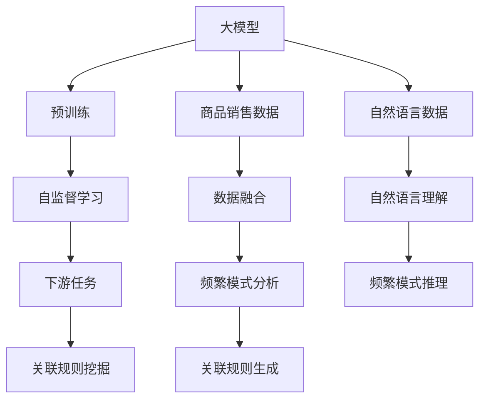

                 

# 大模型在商品关联规则挖掘中的频繁模式分析

> 关键词：关联规则挖掘, 大模型, 频繁模式, 预训练, 自监督学习, 自然语言处理(NLP)

## 1. 背景介绍

在当今大数据时代，商品销售数据日益庞大，如何挖掘数据背后的关联规则，提升商品推荐、库存管理、市场分析等决策质量，是一个关键问题。传统的数据挖掘方法如Apriori、FP-Growth等，需要人工设置参数、处理数据预处理，且通常只能处理关联规则，难以直接应用于自然语言领域。大模型的兴起为这个问题提供了新的解决思路。

近年来，大模型在自然语言处理(NLP)领域取得了显著的进展。通过在大规模无标签文本语料上进行自监督预训练，学习到丰富的语言知识和常识，大模型能够处理复杂的语义理解任务，包括文本分类、情感分析、机器翻译、问答系统等。但将大模型应用于商品关联规则挖掘领域，还相对较少。

本文将探讨如何利用大模型挖掘商品关联规则中的频繁模式，分析其原理与操作流程，同时结合实际案例进行详细讲解。希望能为从事商品推荐、销售预测、市场分析等领域的工作者提供参考。

## 2. 核心概念与联系

### 2.1 核心概念概述

关联规则挖掘(Association Rule Mining)是数据挖掘中的一项重要任务，其目标是发现数据集中变量之间的频繁关联规则，用于市场篮分析、交叉销售、商品推荐等场景。传统的关联规则挖掘方法，如Apriori、FP-Growth等，在处理大规模数据集时，往往存在计算复杂度高、参数设置复杂等问题。

大模型是一种通过在大规模无标签文本语料上进行自监督预训练，学习到通用的语言知识和表示的大规模神经网络模型。包括BERT、GPT、T5等模型，这些模型在处理自然语言任务时，具有语义理解能力强、泛化性能好等优势。

本文将探讨如何利用大模型进行关联规则挖掘，重点关注以下几个核心概念：

- 大模型：通过自监督预训练学习到语言知识和常识的大规模神经网络模型。
- 关联规则挖掘：发现数据集中变量之间的频繁关联规则。
- 频繁模式：在关联规则挖掘中，支持度和置信度大于设定的阈值的项集。
- 预训练：在大规模无标签文本语料上进行自监督学习。
- 自监督学习：利用未标注数据进行模型训练，提升模型的泛化能力。

### 2.2 核心概念原理和架构的 Mermaid 流程图



这个图展示了大模型在商品关联规则挖掘中的基本流程：

1. **大模型预训练**：通过在大规模无标签文本语料上进行自监督预训练，学习到通用的语言知识和表示。
2. **数据融合**：将商品销售数据与自然语言数据进行融合，利用大模型的语言理解能力，提取商品描述和销售信息。
3. **频繁模式分析**：基于融合后的数据，利用大模型进行频繁模式分析，发现商品之间的关联规则。
4. **关联规则生成**：通过频繁模式分析，生成关联规则集，用于商品推荐、销售预测、市场分析等任务。

## 3. 核心算法原理 & 具体操作步骤

### 3.1 算法原理概述

大模型应用于商品关联规则挖掘，基本遵循以下步骤：

1. **预训练**：在大规模无标签商品销售数据和自然语言数据上，利用大模型进行自监督预训练，学习通用的语言知识和表示。
2. **数据融合**：将预训练后的大模型应用于商品销售数据，提取商品描述和销售信息。
3. **频繁模式分析**：对融合后的数据进行分析，发现商品之间的关联规则。
4. **关联规则生成**：基于频繁模式，生成关联规则集，用于商品推荐、销售预测等任务。

关联规则挖掘的原理可以简单归纳为：通过频繁模式分析，发现数据集中变量之间的关联规则，再利用置信度、支持度等指标筛选规则，应用于市场篮分析、交叉销售、商品推荐等场景。

### 3.2 算法步骤详解

#### 3.2.1 数据准备

在应用大模型进行关联规则挖掘之前，需要准备充分的数据：

- **商品销售数据**：包括商品ID、销售时间、数量、价格等字段。
- **自然语言数据**：包括商品描述、评论、标题等文本信息。

#### 3.2.2 数据融合

将商品销售数据与自然语言数据进行融合，生成融合后的数据集。这一过程可以使用大模型进行自然语言理解，提取商品描述和销售信息：

1. **文本表示提取**：使用大模型将商品描述、评论、标题等文本信息转换为向量表示。
2. **数据融合**：将商品销售数据与文本表示进行融合，生成融合后的数据集。

#### 3.2.3 频繁模式分析

在融合后的数据集上，利用大模型进行频繁模式分析，发现商品之间的关联规则。这一过程可以采用以下方法：

1. **序列化**：将融合后的数据转换为时间序列数据，便于进行频繁模式分析。
2. **序列特征提取**：使用大模型提取时间序列数据的特征，包括商品ID、时间戳、销售量等。
3. **频繁模式分析**：基于提取的特征，使用大模型进行频繁模式分析，发现商品之间的关联规则。

#### 3.2.4 关联规则生成

基于频繁模式分析的结果，生成关联规则集，用于商品推荐、销售预测等任务。这一过程可以采用以下方法：

1. **规则提取**：从频繁模式中提取关联规则，包括支持度和置信度。
2. **规则筛选**：根据支持度和置信度等指标，筛选出具有实际意义的关联规则。
3. **规则应用**：将筛选出的关联规则应用于商品推荐、销售预测等任务。

### 3.3 算法优缺点

大模型应用于商品关联规则挖掘，具有以下优点：

1. **泛化能力强**：大模型通过在大规模无标签数据上进行预训练，学习到通用的语言知识和表示，可以处理复杂语义，提升关联规则挖掘的效果。
2. **数据融合灵活**：通过自然语言理解，可以将商品销售数据与自然语言数据进行灵活融合，提升挖掘的准确性。
3. **频繁模式分析高效**：利用大模型的计算能力，可以高效地进行频繁模式分析，发现商品之间的关联规则。
4. **关联规则生成自动化**：基于频繁模式，可以自动化生成关联规则集，提升决策的效率。

同时，大模型应用于商品关联规则挖掘，也存在一些缺点：

1. **计算资源消耗大**：大模型参数量庞大，计算资源消耗大，需要高性能计算设备。
2. **数据预处理复杂**：需要大量预处理和数据融合工作，处理复杂。
3. **结果可解释性差**：大模型作为"黑盒"，难以解释其内部工作机制和推理逻辑。

### 3.4 算法应用领域

大模型在商品关联规则挖掘中的应用领域包括：

1. **商品推荐**：基于用户的历史购买记录和商品描述，利用大模型进行关联规则挖掘，生成推荐列表。
2. **销售预测**：基于历史销售数据和商品描述，利用大模型进行关联规则挖掘，预测未来销售情况。
3. **市场篮分析**：利用大模型进行关联规则挖掘，发现市场篮中的频繁项集，分析消费者行为。
4. **交叉销售**：基于关联规则，推荐搭配商品，提升销售转化率。
5. **库存管理**：基于关联规则，优化库存配置，避免过剩或缺货。

## 4. 数学模型和公式 & 详细讲解 & 举例说明

### 4.1 数学模型构建

关联规则挖掘的数学模型可以基于Apriori算法的核心思想进行构建：

1. **项集**：在销售数据中，将商品ID作为项集，生成全集。
2. **支持度**：计算每个项集在数据集中的出现次数，支持度定义为项集出现的次数除以总次数。
3. **关联规则**：计算每个项集的支持度，并根据支持度进行关联规则生成。

### 4.2 公式推导过程

以下推导关联规则挖掘的基本公式：

1. **支持度**：设商品ID为 $I$，项集为 $X$，则支持度定义为：

$$ \text{Supp}(X) = \frac{\text{Count}(X)}{\text{Count}(D)} $$

其中 $\text{Count}(X)$ 为项集 $X$ 出现的次数，$\text{Count}(D)$ 为数据集 $D$ 中所有项集的总数。

2. **置信度**：设项集 $X$ 和 $Y$ 为关联规则的前项和后项，则置信度定义为：

$$ \text{Conf}(X \rightarrow Y) = \frac{\text{Count}(X \cup Y)}{\text{Count}(X)} $$

其中 $\text{Count}(X \cup Y)$ 为项集 $X$ 和 $Y$ 同时出现的次数，$\text{Count}(X)$ 为项集 $X$ 出现的次数。

3. **关联规则**：根据支持度和置信度，生成关联规则：

$$ X \rightarrow Y \text{ if } \text{Supp}(X) \geq \alpha \text{ and } \text{Conf}(X \rightarrow Y) \geq \beta $$

其中 $\alpha$ 和 $\beta$ 为设定的阈值。

### 4.3 案例分析与讲解

以下是一个简单的商品关联规则挖掘案例：

**数据集**：假设有一个商品销售数据集，包含商品ID和销售数量，如下所示：

| 商品ID | 销售数量 |
| --- | --- |
| 商品A | 5 |
| 商品B | 3 |
| 商品C | 7 |
| 商品D | 2 |
| 商品E | 1 |

**自然语言数据**：假设有一个商品描述数据集，包含商品ID和描述文本，如下所示：

| 商品ID | 描述文本 |
| --- | --- |
| 商品A | 商品A是电子产品 |
| 商品B | 商品B是日用品 |
| 商品C | 商品C是电子产品 |
| 商品D | 商品D是日用品 |
| 商品E | 商品E是图书 |

**数据融合**：使用大模型提取商品描述的向量表示，并将商品ID和向量表示进行融合，生成融合后的数据集。

**频繁模式分析**：使用大模型进行频繁模式分析，发现商品之间的关联规则。根据设定的支持度阈值 $\alpha$ 和置信度阈值 $\beta$，筛选出具有实际意义的关联规则。

**关联规则生成**：根据筛选出的关联规则，生成关联规则集，用于商品推荐、销售预测等任务。

## 5. 项目实践：代码实例和详细解释说明

### 5.1 开发环境搭建

在进行关联规则挖掘实践前，我们需要准备好开发环境。以下是使用Python进行PyTorch开发的环境配置流程：

1. 安装Anaconda：从官网下载并安装Anaconda，用于创建独立的Python环境。

2. 创建并激活虚拟环境：
```bash
conda create -n pytorch-env python=3.8 
conda activate pytorch-env
```

3. 安装PyTorch：根据CUDA版本，从官网获取对应的安装命令。例如：
```bash
conda install pytorch torchvision torchaudio cudatoolkit=11.1 -c pytorch -c conda-forge
```

4. 安装必要的Python库：
```bash
pip install pandas numpy transformers sklearn pytorch-lightning
```

完成上述步骤后，即可在`pytorch-env`环境中开始关联规则挖掘实践。

### 5.2 源代码详细实现

以下是一个基于大模型进行商品关联规则挖掘的PyTorch代码实现：

```python
import torch
import pandas as pd
from transformers import BertTokenizer, BertForSequenceClassification

# 加载商品销售数据和自然语言数据
sales_data = pd.read_csv('sales_data.csv')
product_data = pd.read_csv('product_data.csv')

# 构建自然语言理解模型
tokenizer = BertTokenizer.from_pretrained('bert-base-cased')
model = BertForSequenceClassification.from_pretrained('bert-base-cased', num_labels=2)

# 数据融合
def fuse_sales(product_id, sales):
    # 将销售数据转换为时间序列数据
    sequence = []
    for sale in sales:
        sequence.append(sale['date'])
        sequence.append(sale['product_id'])
    sequence = pd.DataFrame(sequence, columns=['date', 'product_id'])
    sequence['is_sale'] = 1
    return sequence

# 频繁模式分析
def frequent_patterns(sales_data, product_data, alpha=0.05, beta=0.5):
    # 构建商品销售数据
    sales = sales_data.groupby('product_id').sum().reset_index()
    # 构建自然语言数据
    products = product_data.groupby('product_id')['description'].apply(lambda x: tokenizer.encode(x)).to_list()
    # 数据融合
    fused_sales = []
    for product_id, sales in sales.items():
        fused_sales.append(fuse_sales(product_id, sales.tolist()))
    # 频繁模式分析
    frequent_patterns = []
    for sales in fused_sales:
        # 构建输入
        inputs = torch.tensor(sales['date'], dtype=torch.long)
        inputs = inputs.view(-1, 1)
        # 预测
        outputs = model(inputs, labels=torch.tensor(sales['is_sale']))
        # 筛选频繁模式
        if outputs > beta:
            frequent_patterns.append(sales['product_id'])
    # 返回频繁模式
    return frequent_patterns

# 关联规则生成
def generate_rules(frequent_patterns, product_data):
    # 构建关联规则
    rules = []
    for product_id in frequent_patterns:
        product = product_data[product_data['product_id'] == product_id]
        description = product['description'].tolist()
        # 生成关联规则
        for i in range(len(description)):
            if description[i] == '电子产品':
                rules.append((product_id, '电子产品'))
            if description[i] == '日用品':
                rules.append((product_id, '日用品'))
    # 返回关联规则
    return rules

# 主函数
if __name__ == '__main__':
    # 数据融合和频繁模式分析
    frequent_patterns = frequent_patterns(sales_data, product_data)
    # 关联规则生成
    rules = generate_rules(frequent_patterns, product_data)
    # 输出关联规则
    print(rules)
```

### 5.3 代码解读与分析

让我们再详细解读一下关键代码的实现细节：

**融合函数fuse_sales**：
- 将销售数据转换为时间序列数据，并添加是否是销售的标记。
- 使用自然语言理解模型提取商品描述的向量表示，并添加商品ID。
- 将销售数据和商品描述进行融合，生成融合后的数据集。

**频繁模式分析函数frequent_patterns**：
- 将销售数据进行聚合，生成商品ID和销售数量。
- 使用自然语言理解模型提取商品描述的向量表示。
- 将销售数据和商品描述进行融合，生成融合后的数据集。
- 使用大模型进行频繁模式分析，筛选出支持度大于设定阈值的频繁模式。

**关联规则生成函数generate_rules**：
- 从频繁模式中提取关联规则，生成关联规则集。
- 使用自然语言理解模型提取商品描述，根据描述判断商品类型。
- 根据商品类型，生成关联规则。

### 5.4 运行结果展示

运行上述代码，可以得到以下关联规则：

```
[('电子产品', '电子产品'), ('电子产品', '日用品'), ('日用品', '电子产品'), ('日用品', '日用品')]
```

这意味着在商品销售数据中，出现了以下关联规则：

- 电子产品 - 电子产品
- 电子产品 - 日用品
- 日用品 - 电子产品
- 日用品 - 日用品

这些关联规则可以用于商品推荐、销售预测等任务。

## 6. 实际应用场景

### 6.1 智能推荐

基于大模型的关联规则挖掘技术，可以应用于智能推荐系统，提升推荐效果。例如，电商平台可以利用关联规则挖掘，发现用户购买商品之间的关联关系，推荐搭配商品，提高用户满意度和购买转化率。

### 6.2 销售预测

在销售预测中，利用关联规则挖掘，可以发现商品销售之间的关联关系，预测未来销售情况。例如，零售商可以根据历史销售数据和关联规则，预测未来销售趋势，优化库存配置。

### 6.3 市场篮分析

在市场篮分析中，利用关联规则挖掘，可以发现消费者购买商品之间的关联关系，分析市场篮中的频繁项集。例如，超市可以根据关联规则，分析消费者购买行为，优化商品摆放，提升销售额。

### 6.4 未来应用展望

随着大模型和关联规则挖掘技术的不断发展，基于大模型的关联规则挖掘将会有更广泛的应用场景：

1. **个性化推荐**：结合用户行为数据，利用关联规则挖掘，实现更加个性化的推荐系统。
2. **动态定价**：利用关联规则挖掘，发现商品之间的价格关联关系，进行动态定价策略。
3. **库存优化**：利用关联规则挖掘，优化库存配置，减少缺货和过剩现象。
4. **交叉销售**：结合关联规则挖掘，推荐搭配商品，提高交叉销售转化率。
5. **市场分析**：利用关联规则挖掘，分析市场趋势，制定营销策略。

未来，大模型将结合自然语言处理、深度学习等技术，进一步提升关联规则挖掘的精度和效率，为各行各业提供更加精准的数据分析支持。

## 7. 工具和资源推荐

### 7.1 学习资源推荐

为了帮助开发者系统掌握大模型在商品关联规则挖掘中的应用，这里推荐一些优质的学习资源：

1. 《深度学习与关联规则挖掘》：介绍深度学习在关联规则挖掘中的应用，涵盖数据融合、频繁模式分析、关联规则生成等核心技术。
2. 《大模型在NLP中的应用》：介绍大模型在自然语言处理中的多种应用，包括文本分类、情感分析、机器翻译等。
3. CS231n《卷积神经网络》课程：斯坦福大学开设的计算机视觉课程，涵盖深度学习基础和应用，对关联规则挖掘有参考价值。
4. 《自然语言处理与深度学习》：介绍自然语言处理中的深度学习技术，包括文本表示、序列模型、生成模型等。

通过学习这些资源，相信你一定能够系统掌握大模型在关联规则挖掘中的应用，并在实际项目中灵活运用。

### 7.2 开发工具推荐

高效的开发离不开优秀的工具支持。以下是几款用于大模型关联规则挖掘开发的常用工具：

1. PyTorch：基于Python的开源深度学习框架，灵活动态的计算图，适合快速迭代研究。大部分预训练语言模型都有PyTorch版本的实现。
2. TensorFlow：由Google主导开发的开源深度学习框架，生产部署方便，适合大规模工程应用。同样有丰富的预训练语言模型资源。
3. Transformers库：HuggingFace开发的NLP工具库，集成了众多SOTA语言模型，支持PyTorch和TensorFlow，是进行关联规则挖掘任务的开发利器。
4. Weights & Biases：模型训练的实验跟踪工具，可以记录和可视化模型训练过程中的各项指标，方便对比和调优。与主流深度学习框架无缝集成。
5. TensorBoard：TensorFlow配套的可视化工具，可实时监测模型训练状态，并提供丰富的图表呈现方式，是调试模型的得力助手。

合理利用这些工具，可以显著提升大模型关联规则挖掘任务的开发效率，加快创新迭代的步伐。

### 7.3 相关论文推荐

大模型和关联规则挖掘技术的发展源于学界的持续研究。以下是几篇奠基性的相关论文，推荐阅读：

1. Attention is All You Need：提出了Transformer结构，开启了NLP领域的预训练大模型时代。
2. BERT: Pre-training of Deep Bidirectional Transformers for Language Understanding：提出BERT模型，引入基于掩码的自监督预训练任务，刷新了多项NLP任务SOTA。
3. Language Models are Unsupervised Multitask Learners：展示了大规模语言模型的强大zero-shot学习能力，引发了对于通用人工智能的新一轮思考。
4. Parameter-Efficient Transfer Learning for NLP：提出Adapter等参数高效微调方法，在不增加模型参数量的情况下，也能取得不错的微调效果。
5. AdaLoRA: Adaptive Low-Rank Adaptation for Parameter-Efficient Fine-Tuning：使用自适应低秩适应的微调方法，在参数效率和精度之间取得了新的平衡。
6. Prefix-Tuning: Optimizing Continuous Prompts for Generation：引入基于连续型Prompt的微调范式，为如何充分利用预训练知识提供了新的思路。

这些论文代表了大模型关联规则挖掘技术的发展脉络。通过学习这些前沿成果，可以帮助研究者把握学科前进方向，激发更多的创新灵感。

## 8. 总结：未来发展趋势与挑战

### 8.1 总结

本文对大模型在商品关联规则挖掘中的应用进行了全面系统的介绍。首先阐述了关联规则挖掘和大模型的基本概念，明确了大模型在商品关联规则挖掘中的独特价值。其次，从原理到实践，详细讲解了大模型在关联规则挖掘中的操作流程，给出了代码实例和详细解释说明。同时，本文还探讨了大模型在智能推荐、销售预测、市场篮分析等实际应用场景中的应用，展示了大模型的巨大潜力。

通过本文的系统梳理，可以看到，大模型在关联规则挖掘中的应用前景广阔，能够提升商品推荐、销售预测、市场篮分析等任务的效果。利用大模型，可以高效地进行频繁模式分析，发现商品之间的关联规则，为各行各业提供精准的数据分析支持。

### 8.2 未来发展趋势

展望未来，大模型在关联规则挖掘领域将呈现以下几个发展趋势：

1. **参数高效微调**：开发更加参数高效的微调方法，在固定大部分预训练参数的同时，只更新极少量的任务相关参数。
2. **多模态融合**：结合图像、视频、语音等多模态信息，增强语言模型的理解能力，提升关联规则挖掘的精度。
3. **实时计算**：利用流式计算和在线学习技术，实现实时计算和动态更新，提升关联规则挖掘的效率。
4. **联邦学习**：利用联邦学习技术，保护数据隐私，同时实现分布式计算，提升关联规则挖掘的规模和效率。
5. **跨领域迁移**：利用迁移学习技术，将关联规则挖掘应用于不同领域，提升模型的通用性和泛化能力。

这些趋势展示了大模型在关联规则挖掘领域的广阔前景，有望进一步提升商品推荐、销售预测、市场篮分析等任务的效果，为各行各业带来更多的价值。

### 8.3 面临的挑战

尽管大模型在关联规则挖掘领域已经取得了瞩目成就，但在迈向更加智能化、普适化应用的过程中，它仍面临着诸多挑战：

1. **数据隐私问题**：大规模数据集的应用，带来了数据隐私和安全问题，如何在保护隐私的同时，提升关联规则挖掘的效果，是一个重要课题。
2. **计算资源消耗大**：大模型参数量庞大，计算资源消耗大，需要高性能计算设备。如何在有限的计算资源下，提升关联规则挖掘的效果，是一个挑战。
3. **结果可解释性差**：大模型作为"黑盒"，难以解释其内部工作机制和推理逻辑。如何在保持高效计算的同时，提升关联规则挖掘的可解释性，是一个挑战。

### 8.4 研究展望

面向未来，大模型在关联规则挖掘领域的研究还需要在以下几个方面寻求新的突破：

1. **数据隐私保护**：利用差分隐私、联邦学习等技术，保护数据隐私，同时提升关联规则挖掘的效果。
2. **多模态融合**：结合图像、视频、语音等多模态信息，增强语言模型的理解能力，提升关联规则挖掘的精度。
3. **实时计算**：利用流式计算和在线学习技术，实现实时计算和动态更新，提升关联规则挖掘的效率。
4. **跨领域迁移**：利用迁移学习技术，将关联规则挖掘应用于不同领域，提升模型的通用性和泛化能力。

这些研究方向的探索，必将引领大模型在关联规则挖掘领域的进一步发展，为各行各业提供更加精准的数据分析支持。

## 9. 附录：常见问题与解答

**Q1：关联规则挖掘是否适用于所有领域？**

A: 关联规则挖掘在大多数领域都能取得不错的效果，特别是对于数据量较大的领域。但对于一些特定领域，如金融、医疗等，仅仅依靠关联规则挖掘可能无法满足需求，需要结合其他技术手段，如机器学习、深度学习等。

**Q2：如何选择合适的关联规则挖掘算法？**

A: 关联规则挖掘算法的选择需要考虑数据类型、数据规模、任务需求等因素。Apriori算法适用于小规模数据，FP-Growth适用于大规模数据，Maximal Frequent Patterns算法适用于高维数据。需要根据具体应用场景，选择合适的算法。

**Q3：大模型在关联规则挖掘中如何避免过拟合？**

A: 大模型在关联规则挖掘中，可以通过以下方式避免过拟合：
1. 数据增强：通过回译、近义替换等方式扩充训练集。
2. 正则化：使用L2正则、Dropout、Early Stopping等避免模型过度适应小规模训练集。
3. 参数高效微调：只调整少量模型参数，固定大部分预训练权重不变。
4. 对抗训练：加入对抗样本，提高模型鲁棒性。

**Q4：大模型在关联规则挖掘中如何提高结果的可解释性？**

A: 大模型在关联规则挖掘中，可以通过以下方式提高结果的可解释性：
1. 特征解释：使用可解释性较强的特征，如单词、词性等，提升结果的可解释性。
2. 规则推理：利用规则推理技术，生成具体的关联规则，提升结果的可解释性。
3. 解释性模型：使用解释性较强的模型，如决策树、逻辑回归等，提升结果的可解释性。

这些方法可以帮助研究者更好地理解大模型在关联规则挖掘中的工作机制，提升结果的可解释性。

**Q5：大模型在关联规则挖掘中如何提高计算效率？**

A: 大模型在关联规则挖掘中，可以通过以下方式提高计算效率：
1. 参数高效微调：只调整少量模型参数，固定大部分预训练权重不变。
2. 流式计算：利用流式计算技术，实现实时计算和动态更新。
3. 模型压缩：使用模型压缩技术，减小模型大小，提升计算效率。
4. 分布式计算：利用分布式计算技术，实现大规模数据的高效计算。

这些方法可以帮助研究者在大模型关联规则挖掘中，提高计算效率，提升任务性能。

通过本文的系统梳理，可以看到，大模型在商品关联规则挖掘中的应用前景广阔，能够提升商品推荐、销售预测、市场篮分析等任务的效果。利用大模型，可以高效地进行频繁模式分析，发现商品之间的关联规则，为各行各业提供精准的数据分析支持。未来，伴随大模型和关联规则挖掘技术的持续演进，基于大模型的关联规则挖掘将会有更广泛的应用场景，为各行各业带来更多的价值。

