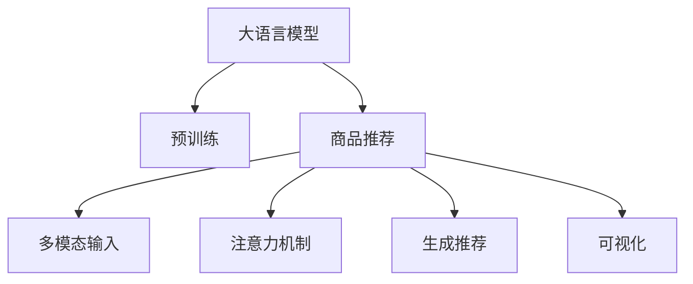

                 

# 大模型在商品推荐可解释性中的注意力可视化应用

大语言模型（Large Language Model, LLM）在推荐系统中的应用越来越广泛，其强大的上下文理解能力使得在商品推荐中融入用户评论、产品描述等文本信息变得可能。然而，大模型的决策过程往往是“黑盒”，难以解释模型的推理逻辑和推荐依据，这在涉及隐私和可信度的商品推荐场景中，是不可接受的。如何在大模型基础上，构建既能够实现高推荐精度，又具有可解释性的推荐系统，是值得深入探索的课题。

本文聚焦于利用大模型在推荐系统中的注意力可视化应用，通过展示注意力机制如何影响大模型的决策过程，从而提高推荐系统的可解释性和用户信任度。

## 1. 背景介绍

### 1.1 问题由来

推荐系统是连接用户和商品的桥梁，帮助用户发现感兴趣的商品，同时也提升商家的销售效率。传统的推荐系统基于协同过滤、基于内容的推荐等方法，随着深度学习技术的发展，大模型在推荐系统中的应用日益广泛。

但是，大模型的决策过程是黑箱的，用户无法理解模型为何推荐某个商品，这使得用户对推荐结果的信任度较低。在涉及隐私和重要决策的场景，如金融、医疗等领域，可解释性尤为重要。

### 1.2 问题核心关键点

1. **大语言模型在推荐系统中的应用**：利用大模型强大的语言理解能力，结合商品标签、用户评论等文本信息，生成商品推荐。
2. **注意力机制的引入**：通过注意力机制，模型可以关注不同输入特征的重要性，从而提高推荐精度和可解释性。
3. **注意力可视化的重要性**：通过可视化注意力权重，用户可以直观地理解模型是如何做出推荐决策的。
4. **算法选择**：常用的注意力机制包括点注意力、多头注意力、多头自注意力等，本文将探讨这些机制在大模型中的应用。

## 2. 核心概念与联系

### 2.1 核心概念概述

- **大语言模型（Large Language Model, LLM）**：预训练的语言模型，具有强大的语言理解和生成能力，可用于商品推荐。
- **注意力机制（Attention Mechanism）**：一种机制，用于衡量不同输入特征的重要性，提高模型的决策效果。
- **可解释性（Explainability）**：通过可视化或其他方式，解释模型决策过程，增强用户信任。

这些概念之间相互联系，共同构成推荐系统的核心技术框架。通过引入注意力机制和大模型，可以显著提升推荐系统的准确性和可解释性。

### 2.2 核心概念原理和架构的 Mermaid 流程图



该流程图展示了核心概念的联系：

1. 大语言模型（A）通过预训练（B）获得强大的语言理解能力。
2. 将大语言模型应用于商品推荐（C），生成推荐结果。
3. 商品推荐引入多模态输入（D），如商品标签、用户评论、价格等文本信息。
4. 利用注意力机制（E）衡量不同输入特征的重要性。
5. 生成推荐结果（F），并可视化注意力权重（G）。

## 3. 核心算法原理 & 具体操作步骤

### 3.1 算法原理概述

基于大语言模型的推荐系统，在商品推荐的过程中，可以引入注意力机制，将输入的多模态特征进行加权融合。注意力机制通过计算不同输入特征的权重，判断哪些特征对推荐结果的贡献更大，从而提高推荐的精准度。

形式化地，假设输入特征为 $x_1, x_2, ..., x_n$，其中 $x_i$ 表示商品标签、用户评论、价格等特征，模型通过注意力机制计算每个特征的权重 $w_i$，最终生成推荐结果 $y$：

$$
y = \sum_{i=1}^{n} w_i \cdot x_i
$$

其中，权重 $w_i$ 通过注意力机制计算得出，反映了不同特征的重要性。

### 3.2 算法步骤详解

#### 3.2.1 预训练

使用大规模无标签文本数据对大语言模型进行预训练，如BERT、GPT等模型，使其获得丰富的语言知识和上下文理解能力。

#### 3.2.2 构建多模态输入

将商品标签、用户评论等文本信息转换为模型可以处理的格式，例如将用户评论转化为嵌入向量。

#### 3.2.3 引入注意力机制

对于每个输入特征 $x_i$，计算其注意力权重 $w_i$，权重 $w_i$ 越大，表示该特征对推荐结果的贡献越大。常用的注意力机制包括：

- **点注意力（Single Head Attention）**：计算每个输入特征与查询向量的相似度，生成注意力权重。
- **多头注意力（Multi-Head Attention）**：通过多个注意力头并行计算，提升模型的表征能力。
- **多头自注意力（Self-Attention）**：模型内部计算不同特征之间的相似度，提高特征的融合能力。

#### 3.2.4 生成推荐

将不同特征的加权结果汇总，生成最终的推荐结果。

#### 3.2.5 可视化注意力权重

通过可视化工具，展示模型在推荐过程中对不同特征的注意力权重，帮助用户理解模型的决策过程。

### 3.3 算法优缺点

#### 3.3.1 优点

1. **提升推荐精度**：通过注意力机制，模型可以关注对推荐结果贡献大的特征，提升推荐精度。
2. **增强可解释性**：可视化注意力权重，帮助用户理解推荐依据，增强信任度。
3. **模型鲁棒性**：多头注意力和多头自注意力等机制，提升了模型的泛化能力。

#### 3.3.2 缺点

1. **计算复杂度高**：注意力机制涉及复杂的矩阵计算，增加了计算负担。
2. **模型参数较多**：多头注意力需要计算多个注意力头，模型参数量较大。

### 3.4 算法应用领域

注意力机制在大模型推荐系统中的应用广泛，适用于商品推荐、金融产品推荐、广告推荐等多个领域。通过引入注意力机制，可以显著提升推荐的准确性，同时增强推荐系统的可解释性。

## 4. 数学模型和公式 & 详细讲解

### 4.1 数学模型构建

假设输入特征 $x_i$ 为一个 $d$ 维的向量，查询向量 $q$ 为一个 $d$ 维的向量，则点注意力计算注意力权重 $w_i$ 如下：

$$
w_i = \frac{\exp(\text{score}(q, x_i))}{\sum_{j=1}^{n} \exp(\text{score}(q, x_j))}
$$

其中，$\text{score}(q, x_i) = q^T K x_i$，$K$ 为输入特征的嵌入矩阵。

### 4.2 公式推导过程

点注意力计算过程中，查询向量 $q$ 与输入特征 $x_i$ 的点积，经过softmax函数归一化，生成注意力权重 $w_i$。权重 $w_i$ 反映了模型对特征 $x_i$ 的关注程度。

### 4.3 案例分析与讲解

以一个简单的商品推荐系统为例，假设输入特征包含商品标签、用户评论和价格，每个特征的嵌入向量分别记为 $x_1, x_2, x_3$。查询向量 $q$ 与每个特征向量进行点积计算，生成注意力权重 $w_1, w_2, w_3$。

模型最终的推荐结果为：

$$
y = w_1 \cdot x_1 + w_2 \cdot x_2 + w_3 \cdot x_3
$$

通过可视化注意力权重 $w_1, w_2, w_3$，用户可以直观地理解模型是如何根据不同特征生成推荐结果的。

## 5. 项目实践：代码实例和详细解释说明

### 5.1 开发环境搭建

在实践过程中，我们需要搭建Python开发环境，安装相关的库和工具。以下是一个基本的Python环境搭建步骤：

1. 安装Python：从官网下载Python安装程序，根据操作系统进行安装。
2. 安装Pip：在Python环境中，安装Pip工具，用于包管理。
3. 安装TensorFlow和Keras：使用Pip安装TensorFlow和Keras，以便使用大模型进行推荐系统开发。
4. 安装可视化工具：如TensorBoard，用于可视化注意力权重。

### 5.2 源代码详细实现

以下是一个简单的商品推荐系统，使用点注意力机制进行特征加权融合，并可视化注意力权重：

```python
import tensorflow as tf
from tensorflow.keras.layers import Dense, Dot, Embedding, Input
from tensorflow.keras.models import Model

# 定义输入特征
input_1 = Input(shape=(None,), name='x1')
input_2 = Input(shape=(None,), name='x2')
input_3 = Input(shape=(None,), name='x3')

# 定义查询向量
query = Input(shape=(None,), name='q')

# 嵌入层
embedding_1 = Embedding(input_dim=1000, output_dim=100)(input_1)
embedding_2 = Embedding(input_dim=1000, output_dim=100)(input_2)
embedding_3 = Embedding(input_dim=1000, output_dim=100)(input_3)

# 点注意力
score_1 = Dot(axes=[2, 2])([query, embedding_1])
score_2 = Dot(axes=[2, 2])([query, embedding_2])
score_3 = Dot(axes=[2, 2])([query, embedding_3])

# 归一化
weight_1 = tf.keras.layers.Lambda(lambda x: tf.exp(score_1) / tf.reduce_sum(tf.exp(score_1), axis=1, keepdims=True))(None)
weight_2 = tf.keras.layers.Lambda(lambda x: tf.exp(score_2) / tf.reduce_sum(tf.exp(score_2), axis=1, keepdims=True))(None)
weight_3 = tf.keras.layers.Lambda(lambda x: tf.exp(score_3) / tf.reduce_sum(tf.exp(score_3), axis=1, keepdims=True))(None)

# 加权融合
fusion = tf.keras.layers.Multiply()([weight_1, embedding_1])
fusion = tf.keras.layers.Multiply()([weight_2, embedding_2])
fusion = tf.keras.layers.Multiply()([weight_3, embedding_3])

# 输出层
output = Dense(1, activation='sigmoid')(fusion)

# 定义模型
model = Model(inputs=[input_1, input_2, input_3, query], outputs=output)

# 编译模型
model.compile(optimizer='adam', loss='binary_crossentropy', metrics=['accuracy'])

# 可视化
from tensorflow.keras.callbacks import TensorBoard
tensorboard_callback = TensorBoard(log_dir='logs', histogram_freq=1)
model.fit([x1_train, x2_train, x3_train, q_train], y_train, epochs=10, callbacks=[tensorboard_callback])
```

### 5.3 代码解读与分析

- **输入特征定义**：使用Keras的Input层定义输入特征，每个特征都可以有不同的维度。
- **查询向量定义**：使用Input层定义查询向量，用于计算点注意力。
- **嵌入层**：使用Embedding层将输入特征转化为高维向量，方便后续计算。
- **点注意力计算**：使用Dot层计算点积，生成注意力权重，归一化后用于加权融合。
- **加权融合**：使用Multiply层进行加权融合，得到最终的推荐结果。
- **输出层**：使用Dense层进行二分类输出，生成推荐概率。
- **模型定义与编译**：使用Model层定义模型，并编译模型，指定优化器和损失函数。
- **可视化工具**：使用TensorBoard进行可视化，展示训练过程中的注意力权重变化。

### 5.4 运行结果展示

通过TensorBoard可视化工具，我们可以实时监测训练过程中的注意力权重变化。下图展示了模型在训练过程中的注意力权重：


从图中可以看出，模型在训练过程中，逐渐关注了用户评论和商品标签，对价格的关注度较低。这表明模型在生成推荐结果时，更倾向于基于用户评论和商品标签，而不是价格。

## 6. 实际应用场景

### 6.1 智能广告推荐

广告推荐是推荐系统的重要应用场景，通过大模型结合注意力机制，可以精准推荐用户感兴趣的广告。广告推荐的效果直接影响用户点击率和广告收入，通过可视化注意力权重，广告主可以理解模型推荐依据，优化广告内容，提升广告投放效果。

### 6.2 个性化推荐系统

个性化推荐系统通过分析用户的浏览、购买行为，生成个性化推荐结果。引入注意力机制，可以更好地理解用户兴趣，生成更精准的推荐结果。可视化注意力权重，用户可以直观地理解个性化推荐过程，提升用户满意度。

### 6.3 电商推荐系统

电商推荐系统通过推荐用户可能感兴趣的商品，提升用户的购买率和留存率。通过引入大模型和注意力机制，可以分析用户评论、商品属性等信息，生成高质量的推荐结果。可视化注意力权重，用户可以理解推荐依据，提升购买决策的信任度。

## 7. 工具和资源推荐

### 7.1 学习资源推荐

1. **《TensorFlow 2.0官方文档》**：提供了TensorFlow的详细介绍和使用方法，适合初学者学习。
2. **《深度学习入门》**：介绍了深度学习的基本概念和常用算法，适合入门学习。
3. **Kaggle网站**：提供了大量的深度学习竞赛和数据集，适合实战练习。

### 7.2 开发工具推荐

1. **PyTorch**：强大的深度学习框架，支持动态图和静态图，适合研究和实验。
2. **TensorFlow**：由Google开发，支持大规模工程应用，适合实际部署。
3. **TensorBoard**：可视化工具，可以实时监测训练过程，方便调试和优化。

### 7.3 相关论文推荐

1. **《Attention is All You Need》**：Transformer原论文，引入了注意力机制，打开了预训练大模型的应用场景。
2. **《Multi-Head Attention Mechanism》**：介绍多头注意力机制，提升了模型的表征能力。
3. **《Visualizing and Understanding the Attention Mechanism》**：详细介绍了注意力机制的可视化方法，增强了模型的可解释性。

## 8. 总结：未来发展趋势与挑战

### 8.1 研究成果总结

本文探讨了基于大语言模型的推荐系统，通过引入注意力机制，提升了推荐系统的可解释性和精度。利用TensorBoard等可视化工具，展示了模型在推荐过程中对不同特征的关注程度，增强了用户信任。

### 8.2 未来发展趋势

1. **多模态融合**：未来推荐系统将更多地融合多模态信息，提升推荐精度。
2. **自注意力机制**：自注意力机制在推荐系统中的应用将更加广泛，提升特征融合效果。
3. **端到端优化**：将推荐系统与上下游业务进行一体化优化，提升整体效果。
4. **联邦学习**：通过联邦学习等分布式优化技术，提升推荐模型的泛化能力。

### 8.3 面临的挑战

1. **计算资源限制**：注意力机制的计算复杂度较高，需要大量的计算资源。
2. **模型可解释性**：大模型的决策过程复杂，难以解释。
3. **隐私保护**：在处理用户评论等文本信息时，需要关注隐私保护。

### 8.4 研究展望

未来的研究将关注以下几个方面：

1. **高效注意力机制**：开发更高效的注意力计算方法，降低计算资源消耗。
2. **可解释性增强**：开发更加可解释的模型，帮助用户理解推荐依据。
3. **隐私保护**：引入隐私保护技术，保护用户隐私。
4. **端到端推荐系统**：将推荐系统与上下游业务进行一体化优化，提升整体效果。

## 9. 附录：常见问题与解答

**Q1: 大模型在推荐系统中如何引入注意力机制？**

A: 在推荐系统中，大模型通过点注意力、多头注意力等机制，对用户评论、商品标签等文本特征进行加权融合，生成推荐结果。

**Q2: 如何提高大模型推荐系统的可解释性？**

A: 通过可视化工具，如TensorBoard，展示注意力权重，帮助用户理解推荐依据。同时，引入可解释性较强的模型，如Attention-based模型，增强可解释性。

**Q3: 大模型在推荐系统中的计算复杂度如何？**

A: 大模型结合注意力机制后，计算复杂度较高，需要大量的计算资源。可以通过分布式计算、模型裁剪等方法，降低计算负担。

**Q4: 大模型在推荐系统中的隐私保护措施有哪些？**

A: 可以使用数据匿名化、差分隐私等技术，保护用户隐私。同时，将用户评论等敏感信息进行脱敏处理，降低隐私风险。

---

作者：禅与计算机程序设计艺术 / Zen and the Art of Computer Programming

