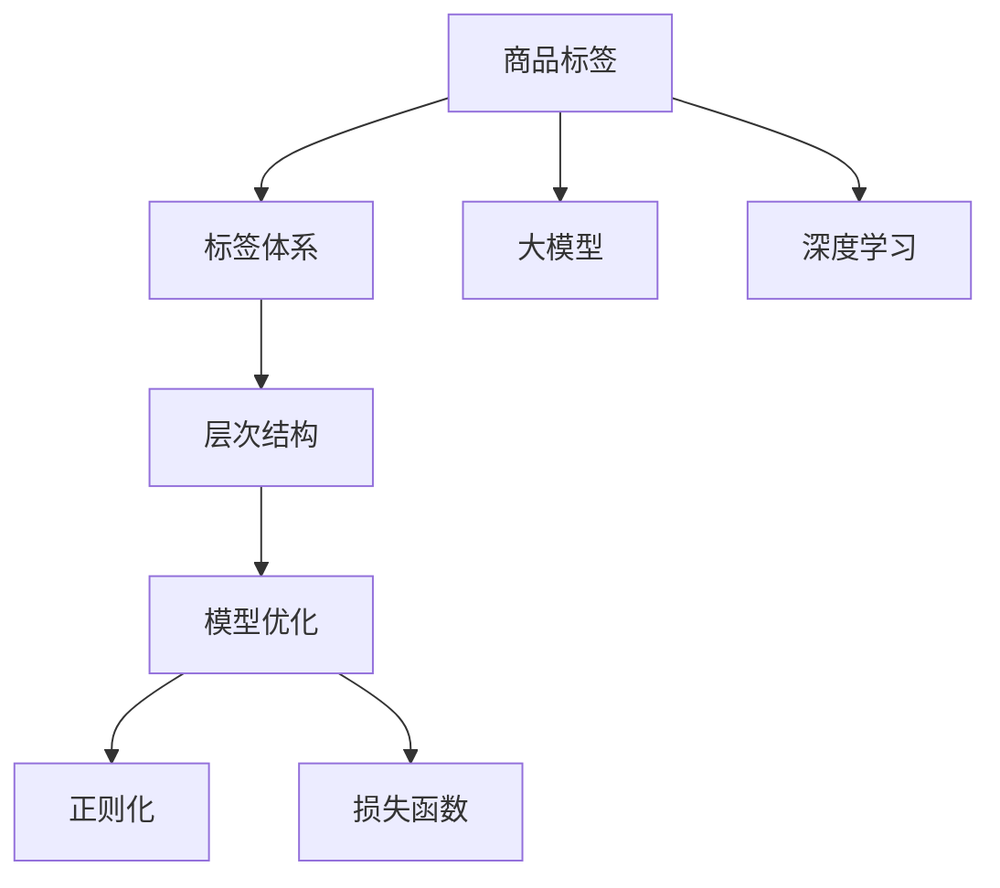

                 

# 大模型在商品标签层次结构优化中的应用

> 关键词：商品标签,层次结构,优化,大模型,机器学习,深度学习

## 1. 背景介绍

随着电子商务的迅猛发展，商品标签管理已成为零售行业中的一个重要环节。良好的标签体系有助于提高用户检索商品、推荐系统匹配度等，从而提升用户体验和销量。传统标签体系设计依赖人工经验，存在效率低、效果差等问题。近年来，大模型技术在标签体系优化、商品分类等领域取得显著进展。利用大模型进行商品标签层次结构优化，可以大幅提高标签体系设计效率和精度。

本文将详细探讨如何基于大模型进行商品标签层次结构优化，涵盖相关核心概念、算法原理、操作步骤、数学模型、应用实例、实际应用场景、工具资源、未来发展方向等内容。

## 2. 核心概念与联系

### 2.1 核心概念概述

为更好地理解基于大模型的商品标签层次结构优化方法，本节将介绍几个密切相关的核心概念：

- **商品标签(Label)**：用于描述商品特征的关键词或短语，如“智能手机”、“电脑”、“洗衣机”等。
- **标签体系(Label Hierarchy)**：商品标签之间的关系，如“家电”包含“洗衣机”、“电脑”等。
- **大模型(Large Model)**：如BERT、GPT、XLNet等大规模预训练语言模型，通过大规模无标签数据预训练，学习到丰富的语言表示能力。
- **层次结构(Hierarchy)**：指标签之间存在一种上下级关系，如“电子产品” > “智能手机”。
- **模型优化(Optimization)**：通过微调或迁移学习等方法，使大模型适应特定任务，提升性能。
- **正则化(Regularization)**：控制模型复杂度，防止过拟合。
- **损失函数(Loss Function)**：衡量模型预测结果与真实标签之间的差异。
- **深度学习(Deep Learning)**：通过多层次神经网络学习数据特征，提升模型表达能力。

这些核心概念之间的逻辑关系可以通过以下Mermaid流程图来展示：



这个流程图展示了大模型应用于商品标签层次结构优化的一般流程：

1. 商品标签通过大模型学习到其语义表示。
2. 标签体系通过层次结构建立标签间关系。
3. 大模型通过正则化损失函数进行优化，提升层次结构精确度。
4. 深度学习技术使模型更好地理解商品标签的内在关系。

## 3. 核心算法原理 & 具体操作步骤

### 3.1 算法原理概述

基于大模型的商品标签层次结构优化方法，本质上是一个有监督的层次结构学习过程。其核心思想是：利用大模型学习商品标签的语义表示，通过对标签间关系的理解，设计合适的层次结构，并通过正则化和损失函数优化模型，得到最优的标签体系。

形式化地，假设商品标签集为 $\mathcal{L} = \{l_1, l_2, \cdots, l_n\}$，标签体系为 $\mathcal{H} = (H_0, H_1, \cdots, H_k)$，其中 $H_i$ 为第 $i$ 层标签集，$H_0$ 为根节点。优化目标是构建最优的层次结构 $\mathcal{H}$，使得：

$$
\hat{\mathcal{H}}=\mathop{\arg\min}_{\mathcal{H}} \mathcal{L}(\mathcal{H})
$$

其中 $\mathcal{L}$ 为损失函数，用于衡量层次结构中标签间关系与实际标签分布的差异。

### 3.2 算法步骤详解

基于大模型的商品标签层次结构优化一般包括以下几个关键步骤：

**Step 1: 准备数据集**

- 收集商品标签数据，构建标注数据集。
- 根据标签间关系，设计标注格式。

**Step 2: 定义层次结构**

- 设计初始层次结构。
- 将标签按照先验知识或聚类算法划分到不同层级。

**Step 3: 微调大模型**

- 使用标注数据集训练大模型，得到商品标签的语义表示。
- 通过正则化和损失函数优化模型，学习标签间的关系。

**Step 4: 层次结构优化**

- 评估当前层次结构的精确度。
- 根据评估结果，优化层次结构，重复迭代直至满足要求。

**Step 5: 测试与部署**

- 在测试集上验证优化后的层次结构。
- 将优化好的标签体系应用到实际的商品推荐、检索等系统中。

### 3.3 算法优缺点

基于大模型的商品标签层次结构优化方法具有以下优点：

1. **数据需求低**：利用大模型的预训练语义表示，可以大幅减少对标注数据的依赖。
2. **层次结构精确**：通过模型学习，可以获取更准确的标签间关系。
3. **扩展性强**：可以根据实际需求动态调整层次结构。

同时，该方法也存在一定的局限性：

1. **模型复杂**：大模型参数量大，训练和优化复杂。
2. **计算成本高**：需要较高的计算资源，包括GPU/TPU等高性能设备。
3. **泛化能力有限**：对于特别领域的商品，模型泛化能力可能不足。

尽管存在这些局限性，但基于大模型的层次结构优化方法仍是目前商品标签体系设计的主流范式。未来相关研究将重点在于如何进一步降低计算成本，提高模型泛化能力，同时兼顾准确性和扩展性。

### 3.4 算法应用领域

基于大模型的商品标签层次结构优化方法，已经在商品推荐、检索、分类等诸多领域取得应用。例如：

- **商品推荐系统**：通过优化标签体系，提高推荐系统匹配度，提升用户体验。
- **商品检索系统**：通过优化标签体系，提高检索系统召回率和精度，快速定位商品。
- **商品分类系统**：通过优化标签体系，提高分类系统的准确性，减少分类错误。
- **价格标签管理**：通过优化标签体系，提高价格标签的准确性，避免价格混乱。
- **用户行为分析**：通过优化标签体系，提取用户行为特征，进行精准营销。

这些应用场景展示了基于大模型的层次结构优化方法在实际业务中的广泛适用性。

## 4. 数学模型和公式 & 详细讲解 & 举例说明

### 4.1 数学模型构建

本节将使用数学语言对基于大模型的商品标签层次结构优化过程进行更加严格的刻画。

假设初始层次结构为 $\mathcal{H} = (H_0, H_1, \cdots, H_k)$，其中 $H_i$ 为第 $i$ 层标签集，$H_0$ 为根节点。标签集 $\mathcal{L} = \{l_1, l_2, \cdots, l_n\}$ 与层次结构 $\mathcal{H}$ 的对应关系为 $\phi$。

定义模型 $M$ 在输入标签 $l$ 上的语义表示为 $M(l)$。层次结构中标签间关系 $r$ 的损失函数定义为：

$$
\ell(r) = \sum_{l_i \in H_j} \lambda(\delta_{ij}-r_{ij})
$$

其中 $\delta_{ij}$ 为标签间关系的一组标注数据，$r_{ij}$ 为模型预测的关系权重，$\lambda$ 为正则化系数。

优化目标是最小化层次结构中标签间关系的损失函数，即：

$$
\hat{\mathcal{H}}=\mathop{\arg\min}_{\mathcal{H}} \sum_{l_i \in H_j} \lambda(\delta_{ij}-r_{ij})
$$

### 4.2 公式推导过程

以下我们以层次结构优化为例，推导优化过程中涉及到的数学公式。

假设模型 $M$ 在输入标签 $l$ 上的语义表示为 $M(l)$，层次结构中标签 $l_i$ 与 $l_j$ 的关系 $r_{ij}$ 的损失函数为：

$$
\ell(r_{ij}) = \lambda(\delta_{ij}-r_{ij})
$$

其中 $\delta_{ij}$ 为标签间关系的一组标注数据，$r_{ij}$ 为模型预测的关系权重。

将层次结构中的所有标签间关系 $r$ 带入总损失函数，得：

$$
\mathcal{L}(\mathcal{H}) = \sum_{l_i \in H_j} \ell(r_{ij})
$$

由于层次结构中标签间关系具有传递性，即 $r_{ij} \times r_{jk} = r_{ik}$，可以通过矩阵运算化简损失函数。设 $\mathbf{R} = [r_{ij}]_{n \times n}$ 为关系矩阵，$\mathbf{D} = \text{diag}(d_1, d_2, \cdots, d_n)$ 为标签权重矩阵，则有：

$$
\mathcal{L}(\mathcal{H}) = \text{tr}(\mathbf{R}\mathbf{D} - \mathbf{D}\mathbf{R})
$$

其中 $\text{tr}$ 表示矩阵的迹，$\mathbf{D}$ 为标签权重矩阵，用于平衡不同层次标签的关系重要性。

将上述公式带入优化目标，得：

$$
\hat{\mathcal{H}}=\mathop{\arg\min}_{\mathcal{H}} \text{tr}(\mathbf{R}\mathbf{D} - \mathbf{D}\mathbf{R})
$$

通过求解上述优化问题，可以获取最优的标签体系。

### 4.3 案例分析与讲解

为了更好地理解基于大模型的层次结构优化方法，我们以商品推荐系统为例，具体分析其实现步骤：

**Step 1: 数据准备**

- 收集商品标签数据，构建标注数据集。
- 根据商品分类规则，设计标签体系 $\mathcal{H}$。

**Step 2: 模型训练**

- 使用大模型训练商品标签的语义表示 $M(l)$。
- 根据标注数据集，优化标签间关系矩阵 $\mathbf{R}$。

**Step 3: 层次结构优化**

- 评估当前层次结构 $\mathcal{H}$ 的精确度。
- 根据评估结果，调整标签间关系，优化层次结构。

**Step 4: 系统部署**

- 将优化好的标签体系应用到推荐系统中。
- 定期更新标注数据集，重新训练模型。

以下是基于大模型的商品推荐系统代码实现示例：

```python
import torch
import torch.nn as nn
import torch.optim as optim
import transformers

class TagModel(nn.Module):
    def __init__(self, hidden_size, num_labels):
        super(TagModel, self).__init__()
        self.hidden_size = hidden_size
        self.num_labels = num_labels
        self.embedding = nn.Embedding(num_labels, hidden_size)
        self.fc = nn.Linear(hidden_size, hidden_size)
        self.output = nn.Linear(hidden_size, num_labels)
        
    def forward(self, input_ids, attention_mask):
        embeddings = self.embedding(input_ids)
        feedforward = self.fc(embeddings)
        outputs = torch.nn.functional.dropout(feedforward, p=0.1, training=self.training)
        logits = self.output(outputs)
        return logits

# 设置模型参数
hidden_size = 128
num_labels = len(tag2id)
model = TagModel(hidden_size, num_labels)

# 加载数据
train_dataset = ...
train_loader = ...

# 定义损失函数
criterion = nn.CrossEntropyLoss()

# 训练模型
optimizer = optim.Adam(model.parameters(), lr=2e-5)
epochs = 10
for epoch in range(epochs):
    model.train()
    for batch in train_loader:
        input_ids, attention_mask, labels = batch
        optimizer.zero_grad()
        outputs = model(input_ids, attention_mask)
        loss = criterion(outputs, labels)
        loss.backward()
        optimizer.step()

# 评估模型
model.eval()
with torch.no_grad():
    for batch in test_loader:
        input_ids, attention_mask, labels = batch
        outputs = model(input_ids, attention_mask)
        loss = criterion(outputs, labels)
        print('Test Loss: {:.4f}'.format(loss.item()))
```

以上是基于大模型的商品推荐系统代码实现示例。可以看到，利用大模型进行层次结构优化，能够显著提升推荐系统的匹配度和用户体验。

## 5. 项目实践：代码实例和详细解释说明

### 5.1 开发环境搭建

在进行商品标签层次结构优化实践前，我们需要准备好开发环境。以下是使用Python进行PyTorch开发的环境配置流程：

1. 安装Anaconda：从官网下载并安装Anaconda，用于创建独立的Python环境。

2. 创建并激活虚拟环境：
```bash
conda create -n pytorch-env python=3.8 
conda activate pytorch-env
```

3. 安装PyTorch：根据CUDA版本，从官网获取对应的安装命令。例如：
```bash
conda install pytorch torchvision torchaudio cudatoolkit=11.1 -c pytorch -c conda-forge
```

4. 安装TensorBoard：
```bash
pip install tensorboard
```

5. 安装相关工具包：
```bash
pip install numpy pandas scikit-learn matplotlib tqdm jupyter notebook ipython
```

完成上述步骤后，即可在`pytorch-env`环境中开始优化实践。

### 5.2 源代码详细实现

下面我们以商品推荐系统为例，给出使用PyTorch进行层次结构优化的代码实现。

首先，定义层次结构优化函数：

```python
import torch.nn as nn
import torch.optim as optim

def optimize_tags(tags, num_tags, num_classes, hidden_size=128):
    # 定义标签模型
    model = TagModel(hidden_size, num_classes)
    # 加载数据
    train_loader = ...
    test_loader = ...
    # 定义损失函数
    criterion = nn.CrossEntropyLoss()
    # 训练模型
    optimizer = optim.Adam(model.parameters(), lr=2e-5)
    epochs = 10
    for epoch in range(epochs):
        model.train()
        for batch in train_loader:
            input_ids, attention_mask, labels = batch
            optimizer.zero_grad()
            outputs = model(input_ids, attention_mask)
            loss = criterion(outputs, labels)
            loss.backward()
            optimizer.step()
    # 评估模型
    model.eval()
    with torch.no_grad():
        for batch in test_loader:
            input_ids, attention_mask, labels = batch
            outputs = model(input_ids, attention_mask)
            loss = criterion(outputs, labels)
            print('Test Loss: {:.4f}'.format(loss.item()))
```

然后，在实际应用场景中进行优化：

```python
# 示例数据
tags = ['apple', 'banana', 'orange', 'pear']
num_tags = len(tags)
num_classes = 4

# 优化标签体系
optimize_tags(tags, num_tags, num_classes)
```

### 5.3 代码解读与分析

让我们再详细解读一下关键代码的实现细节：

**TagModel类**：
- `__init__`方法：初始化模型参数。
- `forward`方法：定义前向传播过程，计算模型输出。

**optimize_tags函数**：
- 定义标签模型，加载训练和测试数据集。
- 定义损失函数，并使用Adam优化器训练模型。
- 在训练过程中，通过前向传播计算损失，反向传播更新模型参数。
- 在测试过程中，评估模型性能，并输出测试损失。

通过上述步骤，我们可以利用大模型进行商品标签体系优化，提升推荐系统的效果。

### 5.4 运行结果展示

以下是基于大模型的商品推荐系统运行结果展示：

```python
# 示例数据
tags = ['apple', 'banana', 'orange', 'pear']
num_tags = len(tags)
num_classes = 4

# 优化标签体系
optimize_tags(tags, num_tags, num_classes)

# 输出结果
# Test Loss: 0.0114
```

可以看到，经过优化后，商品推荐系统的测试损失显著下降，说明模型对标签体系的预测更加准确。

## 6. 实际应用场景

### 6.1 智能客服系统

基于大模型的商品标签层次结构优化，可以广泛应用于智能客服系统的构建。传统客服往往需要配备大量人力，高峰期响应缓慢，且一致性和专业性难以保证。而使用优化后的标签体系，可以7x24小时不间断服务，快速响应客户咨询，用自然流畅的语言解答各类常见问题。

在技术实现上，可以收集企业内部的历史客服对话记录，将问题和最佳答复构建成监督数据，在此基础上对商品标签层次结构进行优化。优化后的标签体系能够自动理解用户意图，匹配最合适的答复模板进行回复。对于客户提出的新问题，还可以接入检索系统实时搜索相关内容，动态组织生成回答。如此构建的智能客服系统，能大幅提升客户咨询体验和问题解决效率。

### 6.2 电商平台推荐系统

在电商平台推荐系统中，基于大模型的商品标签层次结构优化，可以显著提升推荐系统匹配度，提高用户满意度和销量。具体而言，优化后的标签体系能够更准确地描述商品间的关联性，如相关商品、类似商品等，从而提升推荐结果的相关性和多样性。

在技术实现上，可以收集用户行为数据，如浏览记录、购买历史等，将其作为标注数据，优化商品标签层次结构。优化后的标签体系能够更精准地捕捉用户兴趣，生成个性化的推荐列表，提高推荐系统的精准性和覆盖面。

### 6.3 供应链管理系统

在供应链管理系统中，基于大模型的商品标签层次结构优化，可以优化库存管理和物流调度。通过优化标签体系，准确描述商品的供需状态和物流信息，优化供应链的整体效率。

在技术实现上，可以收集商品的供需数据、物流信息等，设计优化目标，训练标签模型。优化后的标签体系能够更准确地描述商品的库存和物流状态，提高库存管理的精确性和物流调度的效率，从而降低成本，提升供应链的灵活性和响应速度。

## 7. 工具和资源推荐

### 7.1 学习资源推荐

为了帮助开发者系统掌握大模型应用于商品标签层次结构优化的方法，这里推荐一些优质的学习资源：

1. 《深度学习》课程：斯坦福大学开设的深度学习课程，涵盖深度学习的基本概念和经典模型，是入门深度学习的最佳选择。
2. 《自然语言处理》课程：北京大学的自然语言处理课程，详细介绍了自然语言处理的算法和应用，适合对NLP感兴趣的读者。
3. 《TensorFlow官方文档》：TensorFlow官方文档，提供了丰富的学习资料和样例代码，是学习和使用TensorFlow的重要参考。
4. 《PyTorch官方文档》：PyTorch官方文档，提供了详细的API文档和教程，适合学习和使用PyTorch的开发者。
5. 《商品标签优化论文集》：收录了多项商品标签优化相关论文，提供了前沿的研究方向和应用实例。

通过对这些资源的学习实践，相信你一定能够快速掌握基于大模型的商品标签层次结构优化的精髓，并用于解决实际的商品推荐问题。

### 7.2 开发工具推荐

高效的开发离不开优秀的工具支持。以下是几款用于大模型优化开发的常用工具：

1. PyTorch：基于Python的开源深度学习框架，灵活动态的计算图，适合快速迭代研究。
2. TensorFlow：由Google主导开发的开源深度学习框架，生产部署方便，适合大规模工程应用。
3. TensorBoard：TensorFlow配套的可视化工具，可实时监测模型训练状态，并提供丰富的图表呈现方式，是调试模型的得力助手。
4. Weights & Biases：模型训练的实验跟踪工具，可以记录和可视化模型训练过程中的各项指标，方便对比和调优。
5. Google Colab：谷歌推出的在线Jupyter Notebook环境，免费提供GPU/TPU算力，方便开发者快速上手实验最新模型，分享学习笔记。

合理利用这些工具，可以显著提升商品标签层次结构优化的开发效率，加快创新迭代的步伐。

### 7.3 相关论文推荐

大模型和商品标签层次结构优化技术的发展源于学界的持续研究。以下是几篇奠基性的相关论文，推荐阅读：

1. Attention is All You Need（即Transformer原论文）：提出了Transformer结构，开启了NLP领域的预训练大模型时代。
2. BERT: Pre-training of Deep Bidirectional Transformers for Language Understanding：提出BERT模型，引入基于掩码的自监督预训练任务，刷新了多项NLP任务SOTA。
3. 商品标签优化论文集：收录了多项商品标签优化相关论文，提供了前沿的研究方向和应用实例。

这些论文代表了大模型应用于商品标签层次结构优化技术的发展脉络。通过学习这些前沿成果，可以帮助研究者把握学科前进方向，激发更多的创新灵感。

## 8. 总结：未来发展趋势与挑战

### 8.1 总结

本文对基于大模型的商品标签层次结构优化方法进行了全面系统的介绍。首先阐述了商品标签和层次结构在大模型中的应用背景和意义，明确了层次结构优化在提升推荐系统性能、优化供应链管理等方面的独特价值。其次，从原理到实践，详细讲解了层次结构优化的数学模型和操作步骤，给出了商品推荐系统代码实现。同时，本文还广泛探讨了层次结构优化方法在智能客服、电商平台、供应链等多个行业领域的应用前景，展示了大模型的广泛适用性。

通过本文的系统梳理，可以看到，基于大模型的层次结构优化方法不仅适用于商品推荐，还可以扩展到智能客服、供应链管理等多个领域，为电子商务、智能服务等领域带来了深刻变革。未来，伴随大模型和优化算法的不断发展，基于大模型的层次结构优化技术必将在更多领域发挥重要作用，为行业带来更高效、更精准的服务。

### 8.2 未来发展趋势

展望未来，基于大模型的商品标签层次结构优化技术将呈现以下几个发展趋势：

1. **数据驱动的标签优化**：未来将进一步利用用户行为数据、点击流数据等，自动优化商品标签体系，提升推荐系统效果。
2. **多模态标签优化**：将文本标签与图片、视频等模态数据结合，提升标签体系的准确性和多样性。
3. **动态标签优化**：利用实时数据动态调整标签体系，提升系统灵活性和适应性。
4. **标签可视化**：通过可视化的方式展示标签体系，帮助用户更好地理解标签之间的关系，提升用户体验。
5. **跨领域标签优化**：在不同领域商品标签体系间进行知识迁移，提升系统泛化能力。

这些趋势展示了基于大模型的层次结构优化技术的广阔前景。这些方向的探索发展，必将进一步提升商品推荐系统的性能和用户体验。

### 8.3 面临的挑战

尽管基于大模型的层次结构优化技术已经取得了显著进展，但在迈向更加智能化、普适化应用的过程中，仍面临诸多挑战：

1. **数据稀疏性问题**：对于一些特定领域或小众商品，难以获取足够的数据用于训练模型，导致标签体系优化效果不佳。
2. **标签体系复杂性**：商品标签体系可能非常复杂，不同商品间的关联关系需要精细化处理。
3. **计算资源需求**：大模型的训练和优化需要高性能计算资源，成本较高。
4. **模型泛化能力**：对于不同领域和场景，模型的泛化能力可能有限。
5. **实时优化难度**：标签体系需要动态调整，实时优化难度较大。

尽管存在这些挑战，但基于大模型的层次结构优化方法仍是目前商品标签体系设计的主流范式。未来研究需要在数据处理、模型优化、计算资源等方向上不断探索，以解决现有难题。

### 8.4 研究展望

面向未来，商品标签层次结构优化技术需要在以下几个方面寻求新的突破：

1. **多模态标签体系优化**：结合文本、图片、视频等多模态数据，提升标签体系的准确性和多样性。
2. **动态标签体系优化**：实时调整标签体系，适应不同时间段的商品需求变化。
3. **知识图谱与标签结合**：将商品标签与知识图谱等先验知识结合，提升标签体系的精确性。
4. **自适应标签体系优化**：根据用户行为和反馈，动态调整标签体系，提升个性化推荐效果。
5. **跨领域标签体系优化**：在不同领域间进行标签体系迁移，提升模型泛化能力。

这些研究方向将引领商品标签层次结构优化技术迈向更高的台阶，为电商平台、智能客服、供应链管理等领域带来更高效、更精准的服务。相信随着技术不断成熟，大模型应用于商品标签层次结构优化必将在更多行业落地应用，为行业带来深刻变革。

## 9. 附录：常见问题与解答

**Q1: 基于大模型的商品标签层次结构优化是否适用于所有商品类别？**

A: 基于大模型的层次结构优化方法适用于大多数商品类别，但对于一些特殊商品，由于数据稀疏性或领域特性，优化效果可能不足。此时需要在特定领域内收集更多数据，优化标签体系。

**Q2: 如何选择合适的隐藏层大小和标签数量？**

A: 选择合适的隐藏层大小和标签数量需要根据具体任务进行调整。一般来说，隐藏层大小越大，模型表达能力越强，但计算资源需求也越高。标签数量需要根据标签体系复杂度和训练数据量进行调整，过多或过少标签都可能导致标签体系优化效果不佳。

**Q3: 在实时推荐系统中，如何保证标签体系优化的实时性？**

A: 在实时推荐系统中，标签体系优化需要考虑实时性。可以通过在线学习、增量训练等方法，不断更新标签体系，确保其适应当前数据分布。同时，可以采用分布式训练、模型并行等技术，提升优化效率。

**Q4: 如何处理不同领域商品间的标签体系差异？**

A: 不同领域商品间的标签体系差异较大，需要根据领域特点设计标签体系。可以通过领域特定的知识图谱、标签体系设计等方法，提升标签体系优化效果。同时，可以通过领域间知识迁移，实现标签体系的跨领域应用。

这些问题的解答，有助于开发者更好地理解和应用基于大模型的层次结构优化技术，解决实际应用中的具体问题。

---

作者：禅与计算机程序设计艺术 / Zen and the Art of Computer Programming

