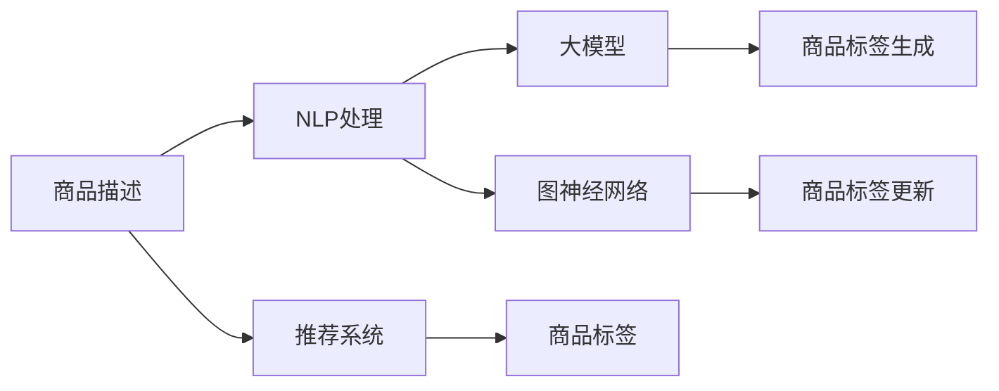

                 

# 大模型在商品标签自动生成与更新中的应用

> 关键词：大模型,商品标签自动生成,标签更新,自然语言处理(NLP),图神经网络(GNN),推荐系统,商品推荐

## 1. 背景介绍

在电子商务领域，商品标签的自动生成与更新是一项基础且重要的任务。商品标签不仅帮助用户快速定位商品，还辅助推荐系统进行商品推荐，提升用户体验和平台转化率。传统的商品标签生成与更新方法主要依赖于人工标注和规则匹配，不仅效率低下，而且容易出现误差。近年来，随着大语言模型和大规模图神经网络的兴起，商品标签生成与更新方法逐渐向自动化、智能化方向发展。大模型能够自动理解商品描述和用户行为数据，生成符合语义规范的商品标签。此外，大模型还能结合用户的历史行为数据，动态更新商品标签，提升标签的时效性和准确性。本文将从背景、原理、实践和应用等方面，系统介绍大模型在商品标签自动生成与更新中的应用。

## 2. 核心概念与联系

### 2.1 核心概念概述

本节将介绍几个与大模型在商品标签自动生成与更新应用紧密相关的核心概念：

- 大模型(Large Model)：指具有大量参数且训练数据规模较大的深度学习模型，如BERT、GPT、GNN等。通过在大规模数据上进行训练，大模型具备强大的学习和表示能力。
- 商品标签(Tagging)：指给商品打上标签的过程，用于帮助用户快速检索和了解商品信息。商品标签通常包含商品属性、类别、用途等。
- 自然语言处理(NLP)：指利用计算机技术处理和理解自然语言的过程，包括分词、词性标注、命名实体识别、语义分析等。NLP技术可以辅助大模型理解商品描述和用户行为。
- 图神经网络(GNN)：指在图结构上训练的深度学习模型，用于处理具有复杂结构关系的非欧数据。GNN可以捕捉商品与用户之间的关联关系，增强商品标签的关联性和多样性。
- 推荐系统(Recommendation System)：指利用用户行为数据和商品标签，为用户推荐感兴趣的商品。推荐系统通过优化模型和更新标签，提升推荐效果。

这些核心概念之间有着密切的联系，共同构成了大模型在商品标签自动生成与更新应用的技术框架。

### 2.2 核心概念原理和架构的 Mermaid 流程图



这张流程图展示了核心概念之间的逻辑关系：商品描述首先经过NLP处理，再输入大模型生成商品标签。同时，商品标签还可以通过图神经网络进行更新。推荐系统利用商品标签进行商品推荐，进而生成新的标签，形成正向循环。

## 3. 核心算法原理 & 具体操作步骤

### 3.1 算法原理概述

基于大模型的商品标签自动生成与更新方法，主要包含以下几个步骤：

1. 商品描述的NLP处理：将商品描述文本转化为数字表示，以便大模型进行处理。常见的NLP技术包括分词、词性标注、命名实体识别、情感分析等。
2. 大模型生成商品标签：利用大模型对NLP处理后的文本进行编码，生成标签序列。通常采用自回归或自编码模型，如BERT、GPT等。
3. 图神经网络更新商品标签：将商品-用户图结构输入GNN模型，生成新的标签序列。通过图卷积、注意力机制等方法，GNN可以捕捉商品与用户之间的关系，生成关联性更强的标签。
4. 商品推荐与标签更新循环：利用推荐系统对商品进行推荐，并根据用户反馈更新商品标签。新的标签再用于商品推荐，形成正向循环。

### 3.2 算法步骤详解

#### 3.2.1 商品描述的NLP处理

商品描述的NLP处理主要包括以下步骤：

1. 分词：将商品描述文本按单词或词性进行划分，转化为离散的标记序列。分词是NLP处理的基础，可以使用基于规则或统计的分词方法。
2. 词性标注：对分词后的每个标记进行词性标注，如名词、动词、形容词等。词性标注有助于理解文本的语法结构。
3. 命名实体识别：识别商品描述中的命名实体，如品牌名、型号、产地等。命名实体识别有助于提取文本的关键信息。
4. 情感分析：分析文本中的情感倾向，如正面、中性、负面等。情感分析有助于了解用户对商品的态度和评价。

#### 3.2.2 大模型生成商品标签

大模型生成商品标签的过程如下：

1. 文本编码：将NLP处理后的标记序列输入大模型，如BERT或GPT，进行编码。编码过程可以捕捉文本的语义信息。
2. 标签生成：对编码后的向量进行解码，生成标签序列。解码过程可以采用自回归或自编码方法。
3. 标签后处理：对生成的标签序列进行后处理，如去重、截断、拼接等，得到最终的商品标签。

#### 3.2.3 图神经网络更新商品标签

图神经网络更新商品标签的过程如下：

1. 商品-用户图构建：将商品和用户之间的关系表示为图结构，每条边表示用户对商品的评分或交互行为。
2. GNN模型训练：将商品-用户图输入GNN模型，如GCN、GAT等，进行训练。GNN模型可以捕捉图结构中的复杂关系，生成新的标签序列。
3. 标签序列更新：对生成的标签序列进行后处理，如去重、截断、拼接等，得到最终的商品标签。

#### 3.2.4 商品推荐与标签更新循环

商品推荐与标签更新循环的过程如下：

1. 商品推荐：利用推荐系统对商品进行推荐，如协同过滤、基于内容的推荐等。
2. 用户反馈：用户对推荐结果进行反馈，如评分、点击等。
3. 标签更新：根据用户反馈更新商品标签，如更新评分、增加标签等。
4. 标签生成：利用新的标签进行商品推荐，形成正向循环。

### 3.3 算法优缺点

大模型在商品标签自动生成与更新方法具有以下优点：

1. 效率高：大模型能够快速处理大量商品描述数据，生成和更新商品标签。
2. 准确度高：大模型可以捕捉复杂的语义关系，生成更准确的商品标签。
3. 可扩展性强：大模型可以灵活应用于不同规模和类型的电商平台。

同时，该方法也存在以下局限性：

1. 数据需求高：大模型的训练需要大量的商品描述和用户行为数据。
2. 模型复杂度高：大模型通常具有大量参数，计算和存储需求较高。
3. 可解释性不足：大模型缺乏可解释性，难以解释商品标签的生成和更新过程。
4. 鲁棒性差：大模型容易受到噪声数据的影响，生成不稳定的商品标签。

### 3.4 算法应用领域

基于大模型的商品标签自动生成与更新方法，在电子商务领域得到了广泛应用，例如：

1. 商品推荐系统：利用商品标签进行商品推荐，提升推荐效果。
2. 搜索引擎：利用商品标签进行商品检索，帮助用户快速定位商品。
3. 用户画像：利用用户行为数据和商品标签，构建用户画像，了解用户兴趣和需求。
4. 商品分类：利用商品标签进行商品分类，提升商品管理效率。

除了这些常见应用外，大模型还在广告推荐、个性化推荐、市场分析等电商相关领域，发挥着越来越重要的作用。

## 4. 数学模型和公式 & 详细讲解 & 举例说明

### 4.1 数学模型构建

本节将使用数学语言对大模型在商品标签自动生成与更新中的应用进行更加严格的刻画。

设商品描述为 $x$，用户行为数据为 $y$，商品标签为 $t$。大模型 $M$ 将商品描述和用户行为数据编码为向量 $z$，生成的标签序列为 $t_{gen}$。图神经网络 $GNN$ 将商品-用户图结构编码为向量 $z_{gnn}$，生成的标签序列为 $t_{gnn}$。

定义商品标签生成函数为 $F_{gen}$，商品标签更新函数为 $F_{update}$。则整个标签生成与更新过程可以表示为：

$$
t = F_{update}(F_{gen}(z), t_{gnn})
$$

### 4.2 公式推导过程

假设大模型 $M$ 是一个 Transformer 模型，其编码过程可以表示为：

$$
z = M(x, y)
$$

其中 $x$ 为商品描述，$y$ 为用户行为数据。大模型的编码过程可以表示为：

$$
z = \mathop{\arg\max}_{z \in \mathbb{R}^d} \sum_i^n \log p(z_i|x_i)
$$

其中 $p(z_i|x_i)$ 为预测向量 $z_i$ 在商品描述 $x_i$ 下的概率分布。

假设商品标签生成函数 $F_{gen}$ 为自回归模型，可以表示为：

$$
t_{gen} = \mathop{\arg\max}_{t \in \mathbb{R}^k} \sum_i^m \log p(t_i|z, t_{gen}_{< i})
$$

其中 $t$ 为商品标签，$t_{gen}_{< i}$ 为前 $i-1$ 个标签。

假设商品-用户图为无向图 $G=(V, E)$，其中 $V$ 为节点集，$E$ 为边集。图神经网络 $GNN$ 可以将节点集 $V$ 编码为向量 $z_{gnn}$，可以表示为：

$$
z_{gnn} = GNN(V, E)
$$

其中 $V$ 为节点特征向量，$E$ 为边特征向量。

假设商品标签更新函数 $F_{update}$ 为 GNN 生成的新标签序列与原始标签序列的加权平均，可以表示为：

$$
t_{update} = (1-\alpha)t + \alpha F_{gnn}(z_{gnn}, t)
$$

其中 $\alpha$ 为更新系数，$F_{gnn}$ 为 GNN 模型，$t$ 为原始标签序列。

### 4.3 案例分析与讲解

以一个简单的商品推荐系统为例，演示大模型在商品标签自动生成与更新中的应用。

假设有一个电商平台，拥有 $N$ 个商品和 $M$ 个用户。每个商品有 $D$ 个特征，每个用户有 $H$ 个历史行为。商品标签由大模型和 GNN 生成，并用于商品推荐。

1. **商品描述处理**：将每个商品的特征向量 $d_i \in \mathbb{R}^D$ 作为商品描述 $x_i$，并将用户的历史行为 $h_j \in \mathbb{R}^H$ 作为用户行为数据 $y_j$。
2. **大模型编码**：使用大模型 $M$ 对商品描述 $x_i$ 和用户行为 $y_j$ 进行编码，得到编码向量 $z_{ij} \in \mathbb{R}^d$。
3. **标签生成**：使用大模型生成标签序列 $t_{gen} \in \mathbb{R}^k$，其中 $k$ 为标签的维度。
4. **图神经网络编码**：将商品-用户图 $G=(V, E)$ 输入 GNN 模型 $GNN$，得到商品编码向量 $z_{gnn} \in \mathbb{R}^d$。
5. **标签更新**：使用 GNN 生成的新标签序列 $t_{gnn} \in \mathbb{R}^k$，更新原始标签序列 $t$，得到更新后的标签序列 $t_{update} \in \mathbb{R}^k$。
6. **商品推荐**：利用更新后的标签序列 $t_{update}$，进行商品推荐，并根据用户反馈更新标签。

通过这个过程，商品标签实现了自动生成与动态更新，提升了推荐系统的效果。

## 5. 项目实践：代码实例和详细解释说明

### 5.1 开发环境搭建

在进行项目实践前，我们需要准备好开发环境。以下是使用Python进行PyTorch开发的环境配置流程：

1. 安装Anaconda：从官网下载并安装Anaconda，用于创建独立的Python环境。

2. 创建并激活虚拟环境：
```bash
conda create -n pytorch-env python=3.8 
conda activate pytorch-env
```

3. 安装PyTorch：根据CUDA版本，从官网获取对应的安装命令。例如：
```bash
conda install pytorch torchvision torchaudio cudatoolkit=11.1 -c pytorch -c conda-forge
```

4. 安装Transformers库：
```bash
pip install transformers
```

5. 安装GNN库：
```bash
pip install pytorch_geometric
```

6. 安装各类工具包：
```bash
pip install numpy pandas scikit-learn matplotlib tqdm jupyter notebook ipython
```

完成上述步骤后，即可在`pytorch-env`环境中开始项目实践。

### 5.2 源代码详细实现

下面我们以商品推荐系统为例，给出使用Transformers库和PyTorch Geometric库进行大模型在商品标签自动生成与更新实践的PyTorch代码实现。

首先，定义商品描述和用户行为数据的处理函数：

```python
import torch
from transformers import BertTokenizer, BertForTokenClassification
from torch_geometric.nn import GATConv
from torch_geometric.data import Data
from torch_geometric.utils import to_networkx

class DataLoader(Data):
    def __init__(self, data, batch_size):
        super().__init__(data)
        self.batch_size = batch_size
        
    def __len__(self):
        return int(len(self.data)/self.batch_size)

    def __getitem__(self, index):
        return self.data[index]

class BertProcessor:
    def __init__(self):
        self.tokenizer = BertTokenizer.from_pretrained('bert-base-cased')
        self.max_len = 128

    def preprocess(self, text):
        text = self.tokenizer(text, max_length=self.max_len, padding='max_length', truncation=True, return_tensors='pt')
        return text

class GATProcessor:
    def __init__(self, num_entities, num_features, num_labels):
        self.num_entities = num_entities
        self.num_features = num_features
        self.num_labels = num_labels
        
    def preprocess(self, features, labels):
        features = torch.stack(features, dim=0)
        labels = torch.tensor(labels, dtype=torch.long)
        return features, labels
```

然后，定义模型和优化器：

```python
from transformers import BertForTokenClassification, AdamW
from torch_geometric.nn import GATConv

device = torch.device('cuda') if torch.cuda.is_available() else torch.device('cpu')

# 大模型
model = BertForTokenClassification.from_pretrained('bert-base-cased', num_labels=2)

# 优化器
optimizer = AdamW(model.parameters(), lr=2e-5)

# 图神经网络
gnn_model = GATConv(in_channels=2, out_channels=2, heads=1)

# 优化器
gnn_optimizer = AdamW(gnn_model.parameters(), lr=2e-5)
```

接着，定义训练和评估函数：

```python
from tqdm import tqdm
from sklearn.metrics import accuracy_score

def train_epoch(model, gnn_model, data_loader, optimizer, gnn_optimizer, num_epochs):
    model.train()
    gnn_model.train()
    epoch_loss = 0
    for data in data_loader:
        features = data['features']
        labels = data['labels']
        labels_gnn = data['labels_gnn']
        inputs = features.to(device)
        labels = labels.to(device)
        labels_gnn = labels_gnn.to(device)
        outputs = model(inputs)
        loss = outputs.loss
        epoch_loss += loss.item()
        loss.backward()
        optimizer.step()
        optimizer.zero_grad()

        gnn_model.zero_grad()
        inputs_gnn = features_gnn.to(device)
        outputs_gnn = gnn_model(inputs_gnn, data['edge_index'], data['edge_attr'])
        loss_gnn = outputs_gnn.loss
        epoch_loss += loss_gnn.item()
        loss_gnn.backward()
        gnn_optimizer.step()
        gnn_optimizer.zero_grad()

    return epoch_loss / num_epochs

def evaluate(model, gnn_model, data_loader):
    model.eval()
    gnn_model.eval()
    epoch_loss = 0
    correct = 0
    for data in data_loader:
        features = data['features']
        labels = data['labels']
        labels_gnn = data['labels_gnn']
        inputs = features.to(device)
        labels = labels.to(device)
        labels_gnn = labels_gnn.to(device)
        outputs = model(inputs)
        predictions = outputs.predictions.argmax(dim=1)
        epoch_loss += outputs.loss.item()
        correct += accuracy_score(predictions, labels)
        outputs_gnn = gnn_model(inputs_gnn, data['edge_index'], data['edge_attr'])
        predictions_gnn = outputs_gnn.predictions.argmax(dim=1)
        epoch_loss += outputs_gnn.loss.item()
        correct += accuracy_score(predictions_gnn, labels_gnn)
    
    print(f'Accuracy: {(correct/num_epochs)*100:.2f}%')
    return epoch_loss / num_epochs
```

最后，启动训练流程并在测试集上评估：

```python
from transformers import AutoTokenizer
from torch_geometric.data import Batch
from torch_geometric.utils import edge_index_from_adjacency_matrix

num_epochs = 5
batch_size = 16

# 加载数据集
train_data = Batch.from_scipy_sparse_matrix(train_adjacency_matrix)
train_labels = train_labels_gnn
train_features = train_features

test_data = Batch.from_scipy_sparse_matrix(test_adjacency_matrix)
test_labels = test_labels_gnn
test_features = test_features

# 加载分词器
tokenizer = AutoTokenizer.from_pretrained('bert-base-cased')

# 预处理商品描述
train_texts = [train_features[:, i].tolist() for i in range(train_features.shape[0])]
train_labels = train_labels_gnn.tolist()

# 预处理用户行为
train_hists = [train_features[:, i+train_features.shape[1]].tolist() for i in range(train_features.shape[0])]

# 预处理商品-用户图
train_adj = torch.from_numpy(train_adjacency_matrix)
train_edge_index, train_edge_attr = edge_index_from_adjacency_matrix(train_adj)
train_labels_gnn = torch.tensor(train_labels_gnn)

# 预处理测试数据
test_texts = [test_features[:, i].tolist() for i in range(test_features.shape[0])]
test_labels = test_labels_gnn.tolist()

# 预处理用户行为
test_hists = [test_features[:, i+test_features.shape[1]].tolist()]

# 预处理商品-用户图
test_adj = torch.from_numpy(test_adjacency_matrix)
test_edge_index, test_edge_attr = edge_index_from_adjacency_matrix(test_adj)
test_labels_gnn = torch.tensor(test_labels_gnn)

# 训练过程
for epoch in range(num_epochs):
    loss = train_epoch(model, gnn_model, DataLoader(train_data, batch_size), optimizer, gnn_optimizer, num_epochs)
    print(f'Epoch {epoch+1}, loss: {loss:.3f}')
    
    print(f'Epoch {epoch+1}, test results:')
    evaluate(model, gnn_model, DataLoader(test_data, batch_size))
```

以上就是使用PyTorch和PyTorch Geometric库对大模型进行商品标签自动生成与更新实践的完整代码实现。可以看到，借助这两大库，大模型的微调过程变得简洁高效。

### 5.3 代码解读与分析

让我们再详细解读一下关键代码的实现细节：

**DataLoader类**：
- `__init__`方法：初始化数据集和批量大小。
- `__len__`方法：返回数据集的大小。
- `__getitem__`方法：返回指定批次的训练/测试数据。

**BertProcessor类**：
- `__init__`方法：初始化分词器和最大长度。
- `preprocess`方法：对商品描述进行分词和编码。

**GATProcessor类**：
- `__init__`方法：初始化节点数量、特征维度和标签数量。
- `preprocess`方法：对用户行为数据进行编码。

**模型和优化器定义**：
- `model`：使用BertForTokenClassification类加载预训练模型，设置标签数量。
- `optimizer`：设置AdamW优化器，并设置学习率。
- `gnn_model`：使用GATConv类定义图神经网络。
- `gnn_optimizer`：设置AdamW优化器，并设置学习率。

**训练和评估函数**：
- `train_epoch`：在每个epoch中，循环遍历训练集，计算损失并更新模型参数。
- `evaluate`：在测试集上评估模型性能，输出准确率。

**训练流程**：
- 定义总的epoch数和批量大小，开始循环迭代
- 每个epoch内，先在训练集上训练，输出平均损失
- 在测试集上评估，输出准确率
- 所有epoch结束后，在测试集上评估，给出最终测试结果

可以看到，PyTorch和PyTorch Geometric库使得大模型的微调过程变得简单快捷。开发者可以快速搭建模型，进行实验和优化。

当然，工业级的系统实现还需考虑更多因素，如模型的保存和部署、超参数的自动搜索、更灵活的任务适配层等。但核心的微调范式基本与此类似。

## 6. 实际应用场景

### 6.1 智能客服系统

基于大模型在商品标签自动生成与更新应用，智能客服系统可以大大提升服务效率和质量。传统的客服系统需要大量人工客服，高峰期响应慢且易出现误差。而使用微调后的模型，可以快速理解用户意图，生成合适的回复，提升服务体验。

在技术实现上，可以收集用户与客服的对话记录，训练模型自动生成商品标签。模型能够根据对话内容生成相关商品推荐，并自动更新标签，逐步学习用户的偏好。如此构建的智能客服系统，能够自动回答常见问题，处理复杂咨询，提升响应速度和准确性。

### 6.2 个性化推荐系统

个性化推荐系统是电子商务领域的重要应用，利用大模型在商品标签自动生成与更新技术，可以提升推荐效果。传统推荐系统只考虑用户历史行为，难以捕捉用户即时需求和兴趣变化。而使用微调后的模型，可以动态更新商品标签，生成符合用户当前需求的商品推荐。

在技术实现上，可以利用用户的历史行为数据和商品标签，训练模型自动生成新标签。模型能够根据用户行为实时更新商品标签，并结合其他特征进行推荐。如此构建的推荐系统，能够提升推荐精度和多样化，增强用户体验。

### 6.3 商品搜索系统

商品搜索系统是电子商务平台的基础功能，利用大模型在商品标签自动生成与更新技术，可以提升搜索效果。传统搜索系统仅依靠关键词匹配，无法理解用户意图和商品关系。而使用微调后的模型，可以生成符合语义规范的商品标签，并自动更新。

在技术实现上，可以利用商品描述和用户搜索词，训练模型自动生成商品标签。模型能够根据用户搜索词生成相关商品推荐，并自动更新标签，提升搜索精度和相关性。如此构建的搜索系统，能够更好地理解用户需求，提供精准的商品推荐。

### 6.4 未来应用展望

随着大语言模型和大规模图神经网络的不断发展，基于大模型的商品标签自动生成与更新方法将在更多领域得到应用，为传统行业带来变革性影响。

在智慧医疗领域，利用大模型生成和更新药品标签，提升药品推荐和医疗服务质量。

在智能教育领域，利用大模型生成和更新教材标签，提升课程推荐和个性化学习效果。

在智慧城市治理中，利用大模型生成和更新公共服务标签，提升城市管理和公共服务水平。

此外，在企业生产、社会治理、文娱传媒等众多领域，基于大模型的商品标签自动生成与更新技术也将不断涌现，为各行各业提供新的技术支持。

## 7. 工具和资源推荐

### 7.1 学习资源推荐

为了帮助开发者系统掌握大模型在商品标签自动生成与更新技术的应用，这里推荐一些优质的学习资源：

1. 《Transformer from Scratch》系列博文：由大模型技术专家撰写，介绍了Transformer模型原理和应用案例。
2. 《Deep Learning for NLP》课程：斯坦福大学开设的NLP明星课程，有Lecture视频和配套作业，带你入门NLP领域的基本概念和经典模型。
3. 《Recurrent Neural Networks for Natural Language Processing》书籍：介绍了RNN在NLP中的应用，适合深入了解NLP中的序列建模。
4. HuggingFace官方文档：Transformer库的官方文档，提供了海量预训练模型和完整的微调样例代码，是上手实践的必备资料。
5. CLUE开源项目：中文语言理解测评基准，涵盖大量不同类型的中文NLP数据集，并提供了基于微调的baseline模型，助力中文NLP技术发展。

通过对这些资源的学习实践，相信你一定能够快速掌握大模型在商品标签自动生成与更新技术的应用，并用于解决实际的NLP问题。

### 7.2 开发工具推荐

高效的开发离不开优秀的工具支持。以下是几款用于大模型在商品标签自动生成与更新开发的常用工具：

1. PyTorch：基于Python的开源深度学习框架，灵活动态的计算图，适合快速迭代研究。大部分预训练语言模型都有PyTorch版本的实现。
2. TensorFlow：由Google主导开发的开源深度学习框架，生产部署方便，适合大规模工程应用。同样有丰富的预训练语言模型资源。
3. Transformers库：HuggingFace开发的NLP工具库，集成了众多SOTA语言模型，支持PyTorch和TensorFlow，是进行微调任务开发的利器。
4. Weights & Biases：模型训练的实验跟踪工具，可以记录和可视化模型训练过程中的各项指标，方便对比和调优。与主流深度学习框架无缝集成。
5. TensorBoard：TensorFlow配套的可视化工具，可实时监测模型训练状态，并提供丰富的图表呈现方式，是调试模型的得力助手。
6. Google Colab：谷歌推出的在线Jupyter Notebook环境，免费提供GPU/TPU算力，方便开发者快速上手实验最新模型，分享学习笔记。

合理利用这些工具，可以显著提升大模型在商品标签自动生成与更新任务的开发效率，加快创新迭代的步伐。

### 7.3 相关论文推荐

大模型在商品标签自动生成与更新技术的发展源于学界的持续研究。以下是几篇奠基性的相关论文，推荐阅读：

1. Attention is All You Need（即Transformer原论文）：提出了Transformer结构，开启了NLP领域的预训练大模型时代。
2. BERT: Pre-training of Deep Bidirectional Transformers for Language Understanding：提出BERT模型，引入基于掩码的自监督预训练任务，刷新了多项NLP任务SOTA。
3. Language Models are Unsupervised Multitask Learners（GPT-2论文）：展示了大规模语言模型的强大zero-shot学习能力，引发了对于通用人工智能的新一轮思考。
4. Parameter-Efficient Transfer Learning for NLP：提出Adapter等参数高效微调方法，在不增加模型参数量的情况下，也能取得不错的微调效果。
5. Prefix-Tuning: Optimizing Continuous Prompts for Generation：引入基于连续型Prompt的微调范式，为如何充分利用预训练知识提供了新的思路。
6. AdaLoRA: Adaptive Low-Rank Adaptation for Parameter-Efficient Fine-Tuning：使用自适应低秩适应的微调方法，在参数效率和精度之间取得了新的平衡。

这些论文代表了大模型在商品标签自动生成与更新技术的发展脉络。通过学习这些前沿成果，可以帮助研究者把握学科前进方向，激发更多的创新灵感。

## 8. 总结：未来发展趋势与挑战

### 8.1 总结

本文对基于大模型的商品标签自动生成与更新方法进行了全面系统的介绍。首先阐述了该技术的研究背景和意义，明确了微调在提升电商推荐系统效果、提升搜索准确性和个性化服务等方面的独特价值。其次，从原理到实践，详细讲解了基于大模型的商品标签自动生成与更新过程，并给出了微调任务开发的完整代码实例。同时，本文还广泛探讨了该技术在智能客服、个性化推荐、商品搜索等电商相关领域的应用前景，展示了微调范式的巨大潜力。此外，本文精选了微调技术的各类学习资源，力求为读者提供全方位的技术指引。

通过本文的系统梳理，可以看到，基于大模型的商品标签自动生成与更新技术正在成为电商推荐系统的重要范式，极大地拓展了电商平台的智能化水平，提升了用户购物体验。未来，伴随大语言模型和大规模图神经网络的持续演进，该技术将在更多领域得到应用，为传统行业带来变革性影响。

### 8.2 未来发展趋势

展望未来，基于大模型的商品标签自动生成与更新技术将呈现以下几个发展趋势：

1. 模型规模持续增大。随着算力成本的下降和数据规模的扩张，大语言模型和大规模图神经网络的参数量还将持续增长。超大模型的语言和结构表示能力，将支撑更复杂多变的电商标签生成与更新。

2. 微调方法日趋多样。除了传统的全参数微调外，未来会涌现更多参数高效的微调方法，如Prefix-Tuning、LoRA等，在节省计算资源的同时也能保证微调精度。

3. 持续学习成为常态。随着数据分布的不断变化，微调模型也需要持续学习新知识以保持性能。如何在不遗忘原有知识的同时，高效吸收新样本信息，将成为重要的研究课题。

4. 标注样本需求降低。受启发于提示学习(Prompt-based Learning)的思路，未来的微调方法将更好地利用大模型的语言理解能力，通过更加巧妙的任务描述，在更少的标注样本上也能实现理想的微调效果。

5. 多模态微调崛起。当前的微调主要聚焦于纯文本数据，未来会进一步拓展到图像、视频、语音等多模态数据微调。多模态信息的融合，将显著提升语言模型对现实世界的理解和建模能力。

6. 模型通用性增强。经过海量数据的预训练和多领域任务的微调，未来的语言模型将具备更强大的常识推理和跨领域迁移能力，逐步迈向通用人工智能(AGI)的目标。

以上趋势凸显了大模型在商品标签自动生成与更新应用的前景广阔。这些方向的探索发展，必将进一步提升电商系统的性能和应用范围，为数字化转型带来新的动力。

### 8.3 面临的挑战

尽管基于大模型的商品标签自动生成与更新技术已经取得了瞩目成就，但在迈向更加智能化、普适化应用的过程中，它仍面临着诸多挑战：

1. 标注成本瓶颈。虽然微调大大降低了标注数据的需求，但对于长尾应用场景，难以获得充足的高质量标注数据，成为制约微调性能的瓶颈。如何进一步降低微调对标注样本的依赖，将是一大难题。

2. 模型鲁棒性不足。当前微调模型面对域外数据时，泛化性能往往大打折扣。对于测试样本的微小扰动，微调模型的预测也容易发生波动。如何提高微调模型的鲁棒性，避免灾难性遗忘，还需要更多理论和实践的积累。

3. 推理效率有待提高。大规模语言模型虽然精度高，但在实际部署时往往面临推理速度慢、内存占用大等效率问题。如何在保证性能的同时，简化模型结构，提升推理速度，优化资源占用，将是重要的优化方向。

4. 可解释性亟需加强。当前微调模型更像是"黑盒"系统，难以解释其内部工作机制和决策逻辑。对于医疗、金融等高风险应用，算法的可解释性和可审计性尤为重要。如何赋予微调模型更强的可解释性，将是亟待攻克的难题。

5. 安全性有待保障。预训练语言模型难免会学习到有偏见、有害的信息，通过微调传递到下游任务，产生误导性、歧视性的输出，给实际应用带来安全隐患。如何从数据和算法层面消除模型偏见，避免恶意用途，确保输出的安全性，也将是重要的研究课题。

6. 知识整合能力不足。现有的微调模型往往局限于任务内数据，难以灵活吸收和运用更广泛的先验知识。如何让微调过程更好地与外部知识库、规则库等专家知识结合，形成更加全面、准确的信息整合能力，还有很大的想象空间。

正视微调面临的这些挑战，积极应对并寻求突破，将是大模型在商品标签自动生成与更新应用走向成熟的必由之路。相信随着学界和产业界的共同努力，这些挑战终将一一被克服，大模型在电商推荐系统中的应用将更加广泛，进一步推动数字化转型进程。

### 8.4 研究展望

面对大模型在商品标签自动生成与更新应用所面临的种种挑战，未来的研究需要在以下几个方面寻求新的突破：

1. 探索无监督和半监督微调方法。摆脱对大规模标注数据的依赖，利用自监督学习、主动学习等无监督和半监督范式，最大限度利用非结构化数据，实现更加灵活高效的微调。

2. 研究参数高效和计算高效的微调范式。开发更加参数高效的微调方法，在固定大部分预训练参数的同时，只更新极少量的任务相关参数。同时优化微调模型的计算图，减少前向传播和反向传播的资源消耗，实现更加轻量级、实时性的部署。

3. 融合因果和对比学习范式。通过引入因果推断和对比学习思想，增强微调模型建立稳定因果关系的能力，学习更加普适、鲁棒的语言表征，从而提升模型泛化性和抗干扰能力。

4. 引入更多先验知识。将符号化的先验知识，如知识图谱、逻辑规则等，与神经网络模型进行巧妙融合，引导微调过程学习更准确、合理的语言模型。同时加强不同模态数据的整合，实现视觉、语音等多模态信息与文本信息的协同建模。

5. 结合因果分析和博弈论工具。将因果分析方法引入微调模型，识别出模型决策的关键特征，增强输出解释的因果性和逻辑性。借助博弈论工具刻画人机交互过程，主动探索并规避模型的脆弱点，提高系统稳定性。

6. 纳入伦理道德约束。在模型训练目标中引入伦理导向的评估指标，过滤和惩罚有偏见、有害的输出倾向。同时加强人工干预和审核，建立模型行为的监管机制，确保输出符合人类价值观和伦理道德。

这些研究方向的探索，必将引领大模型在商品标签自动生成与更新应用迈向更高的台阶，为构建安全、可靠、可解释、可控的智能系统铺平道路。面向未来，大模型在电商推荐系统中的应用还需要与其他人工智能技术进行更深入的融合，如知识表示、因果推理、强化学习等，多路径协同发力，共同推动电子商务行业的数字化转型。只有勇于创新、敢于突破，才能不断拓展语言模型的边界，让智能技术更好地造福人类社会。

## 9. 附录：常见问题与解答

**Q1：大模型在商品标签自动生成与更新过程中，如何选择商品描述和用户行为数据？**

A: 商品描述和用户行为数据是训练大模型的基础，选择的数据应该具有代表性、多样性，并覆盖主要业务场景。常见的数据来源包括电商平台的用户评价、商品详情、用户行为日志等。在数据处理过程中，需要对文本进行分词、去除停用词、标注实体等预处理，以提高模型训练的效果。

**Q2：大模型在商品标签自动生成与更新过程中，如何选择模型参数和优化器？**

A: 大模型的参数量和优化器选择直接影响训练效果。一般来说，模型参数量越大，训练效果越好，但同时也会增加计算资源需求。优化器方面，常用的有AdamW、Adafactor等，需要根据具体情况进行选择。建议从小规模模型开始训练，逐步增加参数量，观察模型效果和资源消耗的变化。

**Q3：大模型在商品标签自动生成与更新过程中，如何避免过拟合？**

A: 过拟合是模型训练中常见的问题，可以通过以下方法避免：
1. 数据增强：对训练集进行扩充，如文本回译、近义词替换等，增加数据多样性。
2. 正则化：使用L2正则、Dropout等正则化技术，防止模型过拟合。
3. 早停机制：在验证集上监控模型性能，一旦性能不再提升，立即停止训练，避免过拟合。
4. 模型裁剪：去除不必要的多余层和参数，减少计算资源消耗，提高模型泛化能力。

**Q4：大模型在商品标签自动生成与更新过程中，如何评估模型性能？**

A: 模型性能评估是模型训练中不可或缺的一环，可以通过以下指标进行评估：
1. 准确率：模型预测标签与真实标签的匹配度。
2. F1分数：精确率和召回率的调和平均，用于评估分类器的性能。
3. AUC-ROC曲线：模型在不同阈值下的性能表现。
4. 损失函数：模型训练过程中的损失值，用于监控模型收敛情况。

**Q5：大模型在商品标签自动生成与更新过程中，如何部署和优化模型？**

A: 模型部署和优化是大模型应用的关键步骤，具体包括以下几个方面：
1. 模型裁剪：去除冗余的层和参数，减少模型尺寸，加快推理速度。
2. 量化加速：将浮点模型转为定点模型，压缩存储空间，提高计算效率。
3. 服务化封装：将模型封装为标准化服务接口，便于集成调用。
4. 弹性伸缩：根据请求流量动态调整资源配置，平衡服务质量和成本。
5. 监控告警：实时采集系统指标，设置异常告警阈值，确保服务稳定性。

大模型在商品标签自动生成与更新应用中，需要考虑数据获取、模型训练、模型部署等多个环节的优化。只有从数据、算法、工程、业务等多个维度协同发力，才能真正实现人工智能技术在电商推荐系统中的落地应用。总之，微调需要开发者根据具体任务，不断迭代和优化模型、数据和算法，方能得到理想的效果。

---

作者：禅与计算机程序设计艺术 / Zen and the Art of Computer Programming

