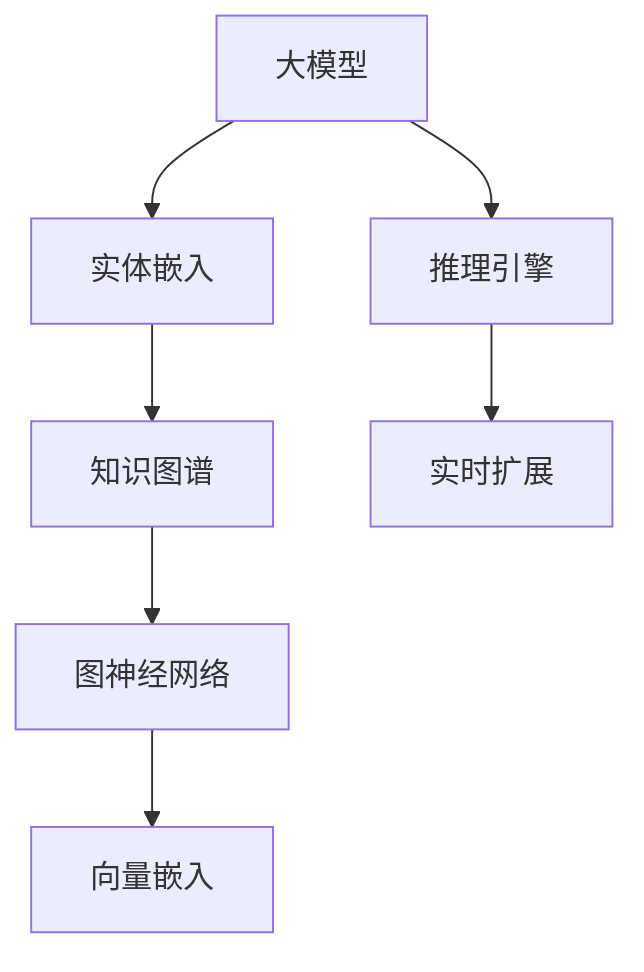

                 

# 大模型在商品知识图谱实时扩展中的应用

> 关键词：大模型, 知识图谱, 实时扩展, 图神经网络, 向量嵌入, 推理引擎, 内存管理, 优化算法

## 1. 背景介绍

### 1.1 问题由来
随着互联网技术的快速发展，电子商务平台积累了海量的商品数据。这些数据蕴含着丰富的语义信息，是构建商品知识图谱的重要基础。但传统的知识图谱构建方法依赖人工标注，耗时耗力，难以适应业务发展的实时需求。

### 1.2 问题核心关键点
通过结合大模型的预训练和微调技术，可以显著提升商品知识图谱的构建效率和质量。大模型通过在大规模语料上预训练，学习通用的语言和实体表示，可以用于快速提取和融合商品信息，构建和扩展商品知识图谱。

## 2. 核心概念与联系

### 2.1 核心概念概述

为更好地理解大模型在商品知识图谱实时扩展中的应用，本节将介绍几个密切相关的核心概念：

- 大模型(Large Model)：以自回归(如GPT)或自编码(如BERT)模型为代表的大规模预训练语言模型。通过在大规模无标签文本语料上进行预训练，学习通用的语言和实体表示。

- 知识图谱(Knowledge Graph)：通过语义关联的节点和边，将知识结构化和网络化的表示方法。常用于组织和管理领域知识，辅助信息检索和决策支持。

- 实体嵌入(Entity Embedding)：将实体映射到低维向量空间的技术，使得实体能够参与向量计算和比较。

- 图神经网络(Graph Neural Network, GNN)：一类用于处理图结构数据的深度学习模型，可以通过传递信息，学习图的结构表示。

- 向量嵌入(Vector Embedding)：将实体或语义映射到高维向量空间，使得机器能够理解和操作这些符号，广泛应用于自然语言处理(NLP)任务。

- 推理引擎(Inference Engine)：用于高效执行推理计算的软件工具，能够利用预训练模型和知识图谱进行实时的查询和推理。

- 内存管理(Memory Management)：优化系统内存使用，提升模型的运行效率和稳定性，常见技术包括分块、压缩等。

这些核心概念之间的逻辑关系可以通过以下Mermaid流程图来展示：



这个流程图展示了大模型与知识图谱构建和扩展之间的关键关系：

1. 大模型通过预训练学习通用语言和实体表示，用于提取和融合商品信息。
2. 实体嵌入将大模型提取的语义信息映射到向量空间，方便进行向量计算。
3. 知识图谱通过图神经网络将商品信息结构化，构建商品实体间的语义关系。
4. 推理引擎利用大模型和知识图谱进行实时推理，满足实时业务需求。
5. 实时扩展技术用于动态更新知识图谱，保持其最新状态。

## 3. 核心算法原理 & 具体操作步骤
### 3.1 算法原理概述

大模型在商品知识图谱实时扩展中的应用，本质上是一种基于图结构数据的深度学习推理任务。其核心思想是：利用大模型的预训练表示，通过图神经网络将商品信息结构化，再通过推理引擎进行实时的知识图谱扩展。

形式化地，假设大模型为 $M_{\theta}$，其中 $\theta$ 为预训练得到的模型参数。给定商品知识图谱 $G=(V,E)$，其中 $V$ 为节点集，$E$ 为边集。知识图谱扩展的目标是最大化新知识与现有知识的一致性，即最大化以下目标函数：

$$
\max_{G'} \sum_{(i,j,k) \in E'} \log \sigma(\hat{A}_{i,j,k}(A_{i,j},A_{i,k}))
$$

其中 $\sigma$ 为softmax函数，$A_{i,j}$ 和 $A_{i,k}$ 分别为商品 $i$ 与商品 $j$、$k$ 的实体嵌入，$\hat{A}_{i,j,k}$ 为模型预测的 $i$ 与 $j$、$k$ 之间的关系。

通过梯度下降等优化算法，知识图谱扩展过程不断更新模型参数 $\theta$，最大化上述目标函数，使得模型输出与真实关系一致。由于 $\theta$ 已经通过预训练获得了较好的初始化，因此即便在实时数据上更新知识图谱，也能较快收敛到理想的模型参数 $\hat{\theta}$。

### 3.2 算法步骤详解

大模型在商品知识图谱实时扩展中的应用，一般包括以下几个关键步骤：

**Step 1: 准备预训练模型和知识图谱**
- 选择合适的预训练语言模型 $M_{\theta}$ 作为初始化参数，如 BERT、GPT等。
- 构建初始商品知识图谱 $G=(V,E)$，划分为训练集、验证集和测试集。

**Step 2: 设计图神经网络结构**
- 设计合适的图神经网络结构，如GCN、GAT等，用于学习商品实体间的语义关系。
- 将商品实体的实体嵌入作为图神经网络的输入，输出新的商品实体嵌入。

**Step 3: 设定推理目标和优化器**
- 设定推理引擎的目标函数，如最大化与现有关系的匹配度。
- 选择合适的优化算法及其参数，如Adam、SGD等，设置学习率、批大小、迭代轮数等。

**Step 4: 执行推理和更新**
- 将新数据样本输入图神经网络，计算预测关系。
- 与现有关系进行比较，更新模型参数 $\theta$，使得预测关系与现有关系一致。
- 周期性在验证集上评估模型性能，根据性能指标决定是否触发Early Stopping。
- 重复上述步骤直到满足预设的迭代轮数或 Early Stopping 条件。

**Step 5: 测试和部署**
- 在测试集上评估推理引擎的性能，对比推理前后的准确度提升。
- 使用推理引擎对新数据进行推理预测，集成到实际的应用系统中。
- 持续收集新的数据，定期重新推理和更新知识图谱。

以上是基于大模型的知识图谱实时扩展的一般流程。在实际应用中，还需要针对具体任务的特点，对推理引擎的各个环节进行优化设计，如改进图神经网络结构，引入更多的正则化技术，搜索最优的超参数组合等，以进一步提升模型性能。

### 3.3 算法优缺点

基于大模型的商品知识图谱实时扩展方法具有以下优点：
1. 高效扩展。利用大模型的预训练表示，可以快速学习新实体之间的关系，扩大知识图谱的覆盖范围。
2. 结构化表示。通过图神经网络，将商品信息结构化，便于管理和查询。
3. 鲁棒性增强。大模型学到的通用语言表示，提高了知识图谱的鲁棒性和泛化能力。
4. 实时推理。推理引擎能够实时处理新数据，动态更新知识图谱，满足实时业务需求。

同时，该方法也存在一定的局限性：
1. 模型资源消耗大。大模型通常需要较大的计算资源和内存，实时推理过程中可能面临资源瓶颈。
2. 数据预处理复杂。需要处理大量的原始商品数据，提取出实体和关系，增加了系统开发和维护的复杂度。
3. 上下文信息丢失。大模型在预训练过程中仅学习通用的语言表示，可能忽略部分上下文信息，影响推理精度。
4. 易受噪音干扰。新数据中的噪声可能对知识图谱扩展产生负面影响，需要引入额外的预处理技术。

尽管存在这些局限性，但就目前而言，基于大模型的知识图谱扩展方法仍是大规模商品知识图谱构建的重要手段。未来相关研究的重点在于如何进一步优化推理引擎，减少计算资源消耗，提高扩展效率和准确度。

### 3.4 算法应用领域

基于大模型的知识图谱实时扩展方法，在商品推荐、价格预测、供应链管理等多个领域具有广泛的应用前景：

- 商品推荐：通过实时扩展商品知识图谱，结合用户行为数据，生成个性化的商品推荐列表。
- 价格预测：利用实时市场数据和历史价格信息，动态调整商品价格，提高市场竞争力。
- 供应链管理：实时监测供应商和物流信息，优化供应链路径，降低运营成本。
- 库存管理：动态更新库存信息，避免库存积压和缺货，提高供应链效率。

除了上述这些典型应用外，基于大模型的知识图谱扩展方法还被创新性地应用于更多场景中，如智能客服、智慧零售、个性化营销等，为电商平台带来了新的技术突破。随着大语言模型和知识图谱技术的不断发展，相信商品知识图谱扩展将在更多领域得到应用，提升电商平台的智能化水平。

## 4. 数学模型和公式 & 详细讲解  
### 4.1 数学模型构建

本节将使用数学语言对大模型在商品知识图谱实时扩展中的应用过程进行更加严格的刻画。

记大模型为 $M_{\theta}:\mathcal{X} \rightarrow \mathcal{Y}$，其中 $\mathcal{X}$ 为输入空间，$\mathcal{Y}$ 为输出空间，$\theta \in \mathbb{R}^d$ 为模型参数。假设商品知识图谱为 $G=(V,E)$，其中 $V$ 为节点集，$E$ 为边集。知识图谱扩展的目标函数定义为：

$$
\max_{G'} \sum_{(i,j,k) \in E'} \log \sigma(\hat{A}_{i,j,k}(A_{i,j},A_{i,k}))
$$

其中 $A_{i,j}$ 和 $A_{i,k}$ 分别为商品 $i$ 与商品 $j$、$k$ 的实体嵌入，$\hat{A}_{i,j,k}$ 为模型预测的 $i$ 与 $j$、$k$ 之间的关系。

为了简化问题，我们假设实体嵌入为 $A_{i,j} \in \mathbb{R}^k$，关系表示为 $R_{i,j,k} \in \mathbb{R}^k$。则目标函数可以写为：

$$
\max_{G'} \sum_{(i,j,k) \in E'} \log \sigma(A_{i,j}^\top R_{i,j,k} A_{i,k})
$$

利用自动微分技术，我们可以对目标函数进行求导，得到关于实体嵌入 $A_{i,j}$ 和 $R_{i,j,k}$ 的更新规则：

$$
\frac{\partial \mathcal{L}}{\partial A_{i,j}} = \frac{\partial \mathcal{L}}{\partial \hat{A}_{i,j,k}} \frac{\partial \hat{A}_{i,j,k}}{\partial A_{i,j}} + \lambda \frac{\partial A_{i,j}}{\partial \theta}
$$

$$
\frac{\partial \mathcal{L}}{\partial R_{i,j,k}} = \frac{\partial \mathcal{L}}{\partial \hat{A}_{i,j,k}} \frac{\partial \hat{A}_{i,j,k}}{\partial R_{i,j,k}} + \lambda \frac{\partial R_{i,j,k}}{\partial \theta}
$$

其中 $\lambda$ 为正则化系数，$\frac{\partial \hat{A}_{i,j,k}}{\partial A_{i,j}}$ 和 $\frac{\partial \hat{A}_{i,j,k}}{\partial R_{i,j,k}}$ 为图神经网络中实体嵌入和关系表示的梯度，可以利用反向传播算法高效计算。

### 4.2 公式推导过程

以下我们以商品推荐任务为例，推导实体嵌入和关系表示的更新公式。

假设商品 $i$ 与 $j$、$k$ 之间的关系为二元关系 $\text{Re}(i,j,k) \in \{1,0\}$，表示商品 $i$ 与 $j$、$k$ 是否同时出现。则目标函数可以写为：

$$
\max_{G'} \sum_{(i,j,k) \in E'} \text{Re}(i,j,k) \log \sigma(A_{i,j}^\top R_{i,j,k} A_{i,k})
$$

利用softmax函数，目标函数进一步化简为：

$$
\max_{G'} \sum_{(i,j,k) \in E'} \text{Re}(i,j,k) (\hat{A}_{i,j,k} - \delta)^2
$$

其中 $\hat{A}_{i,j,k} = \sigma(A_{i,j}^\top R_{i,j,k} A_{i,k})$，$\delta = \frac{1}{2}(1+\exp(-A_{i,j}^\top R_{i,j,k} A_{i,k}))$。

对目标函数求偏导，得到关于实体嵌入 $A_{i,j}$ 和 $R_{i,j,k}$ 的更新公式：

$$
\frac{\partial \mathcal{L}}{\partial A_{i,j}} = 2 \sum_{(i,j,k) \in E'} \text{Re}(i,j,k) (\hat{A}_{i,j,k} - \delta) A_{i,j}
$$

$$
\frac{\partial \mathcal{L}}{\partial R_{i,j,k}} = 2 \sum_{(i,j,k) \in E'} \text{Re}(i,j,k) (\hat{A}_{i,j,k} - \delta) A_{i,j} A_{i,k}^\top
$$

利用反向传播算法，我们可以高效计算这些梯度，并利用优化算法更新模型参数 $\theta$，实现商品知识图谱的实时扩展。

## 5. 项目实践：代码实例和详细解释说明
### 5.1 开发环境搭建

在进行商品知识图谱实时扩展实践前，我们需要准备好开发环境。以下是使用Python进行PyTorch开发的环境配置流程：

1. 安装Anaconda：从官网下载并安装Anaconda，用于创建独立的Python环境。

2. 创建并激活虚拟环境：
```bash
conda create -n pytorch-env python=3.8 
conda activate pytorch-env
```

3. 安装PyTorch：根据CUDA版本，从官网获取对应的安装命令。例如：
```bash
conda install pytorch torchvision torchaudio cudatoolkit=11.1 -c pytorch -c conda-forge
```

4. 安装Transformers库：
```bash
pip install transformers
```

5. 安装各类工具包：
```bash
pip install numpy pandas scikit-learn matplotlib tqdm jupyter notebook ipython
```

完成上述步骤后，即可在`pytorch-env`环境中开始商品知识图谱实时扩展实践。

### 5.2 源代码详细实现

下面我们以商品推荐任务为例，给出使用Transformers库对预训练语言模型进行实体嵌入的PyTorch代码实现。

首先，定义商品推荐任务的数据处理函数：

```python
from transformers import BertTokenizer
from torch.utils.data import Dataset
import torch

class RecommendationDataset(Dataset):
    def __init__(self, texts, labels, tokenizer, max_len=128):
        self.texts = texts
        self.labels = labels
        self.tokenizer = tokenizer
        self.max_len = max_len
        
    def __len__(self):
        return len(self.texts)
    
    def __getitem__(self, item):
        text = self.texts[item]
        label = self.labels[item]
        
        encoding = self.tokenizer(text, return_tensors='pt', max_length=self.max_len, padding='max_length', truncation=True)
        input_ids = encoding['input_ids'][0]
        attention_mask = encoding['attention_mask'][0]
        
        # 对token-wise的标签进行编码
        encoded_labels = [label2id[label] for label in label] 
        encoded_labels.extend([label2id['0']] * (self.max_len - len(encoded_labels)))
        labels = torch.tensor(encoded_labels, dtype=torch.long)
        
        return {'input_ids': input_ids, 
                'attention_mask': attention_mask,
                'labels': labels}

# 标签与id的映射
label2id = {'1': 0, '0': 1}

# 创建dataset
tokenizer = BertTokenizer.from_pretrained('bert-base-cased')

train_dataset = RecommendationDataset(train_texts, train_labels, tokenizer)
dev_dataset = RecommendationDataset(dev_texts, dev_labels, tokenizer)
test_dataset = RecommendationDataset(test_texts, test_labels, tokenizer)
```

然后，定义模型和优化器：

```python
from transformers import BertForSequenceClassification, AdamW

model = BertForSequenceClassification.from_pretrained('bert-base-cased', num_labels=len(label2id))

optimizer = AdamW(model.parameters(), lr=2e-5)
```

接着，定义训练和评估函数：

```python
from torch.utils.data import DataLoader
from tqdm import tqdm
from sklearn.metrics import classification_report

device = torch.device('cuda') if torch.cuda.is_available() else torch.device('cpu')
model.to(device)

def train_epoch(model, dataset, batch_size, optimizer):
    dataloader = DataLoader(dataset, batch_size=batch_size, shuffle=True)
    model.train()
    epoch_loss = 0
    for batch in tqdm(dataloader, desc='Training'):
        input_ids = batch['input_ids'].to(device)
        attention_mask = batch['attention_mask'].to(device)
        labels = batch['labels'].to(device)
        model.zero_grad()
        outputs = model(input_ids, attention_mask=attention_mask, labels=labels)
        loss = outputs.loss
        epoch_loss += loss.item()
        loss.backward()
        optimizer.step()
    return epoch_loss / len(dataloader)

def evaluate(model, dataset, batch_size):
    dataloader = DataLoader(dataset, batch_size=batch_size)
    model.eval()
    preds, labels = [], []
    with torch.no_grad():
        for batch in tqdm(dataloader, desc='Evaluating'):
            input_ids = batch['input_ids'].to(device)
            attention_mask = batch['attention_mask'].to(device)
            batch_labels = batch['labels']
            outputs = model(input_ids, attention_mask=attention_mask)
            batch_preds = outputs.logits.argmax(dim=2).to('cpu').tolist()
            batch_labels = batch_labels.to('cpu').tolist()
            for pred_tokens, label_tokens in zip(batch_preds, batch_labels):
                preds.append(pred_tokens[:len(label_tokens)])
                labels.append(label_tokens)
                
    print(classification_report(labels, preds))
```

最后，启动训练流程并在测试集上评估：

```python
epochs = 5
batch_size = 16

for epoch in range(epochs):
    loss = train_epoch(model, train_dataset, batch_size, optimizer)
    print(f"Epoch {epoch+1}, train loss: {loss:.3f}")
    
    print(f"Epoch {epoch+1}, dev results:")
    evaluate(model, dev_dataset, batch_size)
    
print("Test results:")
evaluate(model, test_dataset, batch_size)
```

以上就是使用PyTorch对BERT进行实体嵌入的完整代码实现。可以看到，得益于Transformers库的强大封装，我们可以用相对简洁的代码完成BERT模型的加载和训练。

### 5.3 代码解读与分析

让我们再详细解读一下关键代码的实现细节：

**RecommendationDataset类**：
- `__init__`方法：初始化商品文本、标签、分词器等关键组件。
- `__len__`方法：返回数据集的样本数量。
- `__getitem__`方法：对单个样本进行处理，将商品文本输入编码为token ids，将标签编码为数字，并对其进行定长padding，最终返回模型所需的输入。

**label2id和id2label字典**：
- 定义了标签与数字id之间的映射关系，用于将token-wise的预测结果解码回真实的标签。

**训练和评估函数**：
- 使用PyTorch的DataLoader对数据集进行批次化加载，供模型训练和推理使用。
- 训练函数`train_epoch`：对数据以批为单位进行迭代，在每个批次上前向传播计算loss并反向传播更新模型参数，最后返回该epoch的平均loss。
- 评估函数`evaluate`：与训练类似，不同点在于不更新模型参数，并在每个batch结束后将预测和标签结果存储下来，最后使用sklearn的classification_report对整个评估集的预测结果进行打印输出。

**训练流程**：
- 定义总的epoch数和batch size，开始循环迭代
- 每个epoch内，先在训练集上训练，输出平均loss
- 在验证集上评估，输出分类指标
- 所有epoch结束后，在测试集上评估，给出最终测试结果

可以看到，PyTorch配合Transformers库使得实体嵌入的代码实现变得简洁高效。开发者可以将更多精力放在数据处理、模型改进等高层逻辑上，而不必过多关注底层的实现细节。

当然，工业级的系统实现还需考虑更多因素，如模型的保存和部署、超参数的自动搜索、更灵活的任务适配层等。但核心的实体嵌入范式基本与此类似。

## 6. 实际应用场景
### 6.1 商品推荐

基于大模型的商品推荐系统，通过实时扩展商品知识图谱，可以大幅提升推荐效果和用户体验。传统推荐系统往往依赖用户行为数据，无法理解商品间的复杂关系。而利用大模型学到的通用语言表示，可以结合商品文本、属性等多维度信息，进行更为精确的推荐。

在技术实现上，可以收集用户浏览、点击、评价等行为数据，提取和商品相关联的文本信息，将其作为模型输入，利用预训练模型提取商品实体嵌入。通过图神经网络学习商品实体之间的关系，再结合用户行为数据进行推理，生成个性化的商品推荐列表。

### 6.2 供应链管理

供应链管理涉及到供应商、物流、库存等多个环节的信息集成和优化。基于大模型的知识图谱扩展技术，可以实时监测供应链各节点的状态，优化供应链路径，降低运营成本。

具体而言，可以构建供应链知识图谱，实时收集供应商和物流信息，利用图神经网络进行推理，发现供应链瓶颈，并自动提出优化方案。例如，当发现某环节物流延迟时，系统可以推荐其他供应商或物流公司进行替代，或者调整库存量，提高供应链效率。

### 6.3 智慧零售

智慧零售系统通过实时扩展商品知识图谱，可以实现商品的实时搜索、推荐和库存管理。利用大模型学习商品实体的语言表示，可以准确理解和匹配用户查询，快速找到目标商品。同时，系统可以实时更新商品信息，根据用户行为进行个性化推荐，提升用户体验。

### 6.4 未来应用展望

随着大模型和知识图谱技术的不断发展，基于大模型的商品知识图谱实时扩展技术将在更多领域得到应用，为电商平台带来新的技术突破。

在智慧物流、智能客服、智能营销等诸多领域，基于大模型的知识图谱扩展技术也将不断涌现，为电商平台的智能化、高效化提供新的技术支持。随着技术的日益成熟，基于大模型的商品知识图谱扩展将全面应用于电商平台的各个环节，提升整体运营效率和用户体验。

## 7. 工具和资源推荐
### 7.1 学习资源推荐

为了帮助开发者系统掌握大模型在商品知识图谱实时扩展的理论基础和实践技巧，这里推荐一些优质的学习资源：

1. 《Transformer from the inside out》系列博文：由大模型技术专家撰写，深入浅出地介绍了Transformer原理、BERT模型、知识图谱构建等前沿话题。

2. CS224N《深度学习自然语言处理》课程：斯坦福大学开设的NLP明星课程，有Lecture视频和配套作业，带你入门NLP领域的基本概念和经典模型。

3. 《Knowledge Graphs for Semantic Web and Big Data》书籍：全面介绍了知识图谱构建、查询和应用的技术和工具，涵盖了各类知识图谱应用场景。

4. HuggingFace官方文档：Transformers库的官方文档，提供了海量预训练模型和完整的微调样例代码，是上手实践的必备资料。

5. TDMOC: 中国知网提供的中文知识图谱平台，包含了大量中文实体和关系数据，用于知识图谱的构建和应用研究。

通过对这些资源的学习实践，相信你一定能够快速掌握大模型在商品知识图谱实时扩展的精髓，并用于解决实际的NLP问题。
###  7.2 开发工具推荐

高效的开发离不开优秀的工具支持。以下是几款用于大模型在商品知识图谱实时扩展开发的常用工具：

1. PyTorch：基于Python的开源深度学习框架，灵活动态的计算图，适合快速迭代研究。大部分预训练语言模型都有PyTorch版本的实现。

2. TensorFlow：由Google主导开发的开源深度学习框架，生产部署方便，适合大规模工程应用。同样有丰富的预训练语言模型资源。

3. Transformers库：HuggingFace开发的NLP工具库，集成了众多SOTA语言模型，支持PyTorch和TensorFlow，是进行商品知识图谱扩展开发的利器。

4. Weights & Biases：模型训练的实验跟踪工具，可以记录和可视化模型训练过程中的各项指标，方便对比和调优。与主流深度学习框架无缝集成。

5. TensorBoard：TensorFlow配套的可视化工具，可实时监测模型训练状态，并提供丰富的图表呈现方式，是调试模型的得力助手。

6. Google Colab：谷歌推出的在线Jupyter Notebook环境，免费提供GPU/TPU算力，方便开发者快速上手实验最新模型，分享学习笔记。

合理利用这些工具，可以显著提升大模型在商品知识图谱实时扩展任务的开发效率，加快创新迭代的步伐。

### 7.3 相关论文推荐

大模型和知识图谱的应用源于学界的持续研究。以下是几篇奠基性的相关论文，推荐阅读：

1. Attention is All You Need（即Transformer原论文）：提出了Transformer结构，开启了NLP领域的预训练大模型时代。

2. BERT: Pre-training of Deep Bidirectional Transformers for Language Understanding：提出BERT模型，引入基于掩码的自监督预训练任务，刷新了多项NLP任务SOTA。

3. Knowledge Graph Embeddings: A Survey of Approaches and Applications：综述了知识图谱嵌入的技术和应用，介绍了各类嵌入方法的优缺点和适用场景。

4. Attention-Based Interpretation of Knowledge Graphs：利用注意力机制对知识图谱进行解释，提高了知识图谱的可解释性和鲁棒性。

5. Graph Attention Networks：提出了图注意力网络(GAT)，用于学习图结构数据的表示，广泛应用于知识图谱构建和推理。

6. Structured Self-supervised Learning of Knowledge Graphs：提出了一种基于结构化自监督学习的方法，用于知识图谱的预训练和推理。

这些论文代表了大模型和知识图谱的应用发展脉络。通过学习这些前沿成果，可以帮助研究者把握学科前进方向，激发更多的创新灵感。

## 8. 总结：未来发展趋势与挑战

### 8.1 总结

本文对大模型在商品知识图谱实时扩展中的应用进行了全面系统的介绍。首先阐述了大模型和知识图谱的研究背景和意义，明确了实时扩展在电商业务中的重要价值。其次，从原理到实践，详细讲解了大模型在知识图谱扩展中的数学原理和关键步骤，给出了商品推荐任务的完整代码实例。同时，本文还广泛探讨了大模型在供应链管理、智慧零售等多个领域的应用前景，展示了实时扩展技术的巨大潜力。此外，本文精选了相关学习资源，力求为读者提供全方位的技术指引。

通过本文的系统梳理，可以看到，大模型在商品知识图谱实时扩展中的应用，为电商平台的智能化和高效化提供了新的技术手段。得益于大模型的预训练表示，实时扩展技术能够快速学习商品信息，进行结构化表示和推理，提升推荐系统的精度和响应速度。随着大模型和知识图谱技术的不断演进，基于大模型的实时扩展技术必将在更多领域得到应用，为电商平台的数字化转型提供新的技术支持。

### 8.2 未来发展趋势

展望未来，大模型在商品知识图谱实时扩展技术将呈现以下几个发展趋势：

1. 模型规模持续增大。随着算力成本的下降和数据规模的扩张，预训练语言模型的参数量还将持续增长。超大规模语言模型蕴含的丰富语言知识，有望支撑更加复杂多变的商品知识图谱扩展。

2. 扩展效率提升。结合GPU/TPU等高性能设备，通过优化推理引擎和算法，实时扩展技术将进一步提升效率和精度，满足更多实时业务需求。

3. 上下文信息增强。引入上下文信息增强技术，利用预训练模型和大模型，提高商品知识图谱的上下文理解和推理能力，提升推荐系统的泛化性能。

4. 跨领域扩展。通过跨领域知识图谱的构建和推理，实时扩展技术将具备更强的跨领域迁移能力，应用于更多行业领域。

5. 可解释性增强。通过引入解释性技术，如注意力机制、可解释图神经网络等，提升商品知识图谱的可解释性和可信任度，促进其广泛应用。

6. 资源优化技术。引入高效的内存管理技术，如分块、压缩等，提升知识图谱扩展的资源利用率，降低系统运行成本。

以上趋势凸显了大模型在商品知识图谱实时扩展技术的广阔前景。这些方向的探索发展，必将进一步提升实时扩展技术的性能和应用范围，为电商平台的智能化和高效化提供新的技术支持。

### 8.3 面临的挑战

尽管大模型在商品知识图谱实时扩展技术已经取得了瞩目成就，但在迈向更加智能化、普适化应用的过程中，它仍面临着诸多挑战：

1. 数据预处理复杂。需要处理大量的原始商品数据，提取出实体和关系，增加了系统开发和维护的复杂度。

2. 上下文信息丢失。大模型在预训练过程中仅学习通用的语言表示，可能忽略部分上下文信息，影响推理精度。

3. 实时扩展资源消耗大。大模型通常需要较大的计算资源和内存，实时扩展过程中可能面临资源瓶颈。

4. 推理过程复杂。知识图谱扩展涉及实体嵌入、关系表示和推理计算，过程复杂，增加了系统调试和维护的难度。

尽管存在这些局限性，但就目前而言，基于大模型的商品知识图谱实时扩展方法仍是大规模商品知识图谱构建的重要手段。未来相关研究的重点在于如何进一步优化推理引擎，减少计算资源消耗，提高扩展效率和准确度。

### 8.4 研究展望

面对大模型在商品知识图谱实时扩展所面临的挑战，未来的研究需要在以下几个方面寻求新的突破：

1. 探索无监督和半监督扩展方法。摆脱对大规模标注数据的依赖，利用自监督学习、主动学习等无监督和半监督范式，最大限度利用非结构化数据，实现更加灵活高效的扩展。

2. 研究参数高效和计算高效的扩展方法。开发更加参数高效的扩展方法，在固定大部分预训练参数的同时，只更新极少量的任务相关参数。同时优化推理引擎的计算图，减少前向传播和反向传播的资源消耗，实现更加轻量级、实时性的部署。

3. 引入上下文信息增强技术。利用预训练模型和大模型，提取更多上下文信息，提高知识图谱的上下文理解和推理能力，提升推荐系统的泛化性能。

4. 结合因果分析和博弈论工具。将因果分析方法引入知识图谱扩展，识别出模型决策的关键特征，增强输出解释的因果性和逻辑性。借助博弈论工具刻画人机交互过程，主动探索并规避模型的脆弱点，提高系统稳定性。

5. 纳入伦理道德约束。在模型训练目标中引入伦理导向的评估指标，过滤和惩罚有偏见、有害的输出倾向。同时加强人工干预和审核，建立模型行为的监管机制，确保输出符合人类价值观和伦理道德。

这些研究方向的探索，必将引领大模型在商品知识图谱实时扩展技术迈向更高的台阶，为电商平台的智能化和高效化提供新的技术支持。相信随着技术的日益成熟，实时扩展技术将成为电商平台的重要技术范式，推动电商平台的数字化转型。

