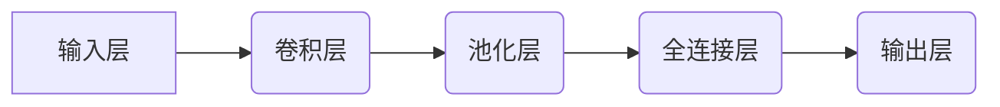

> 深度学习，卷积神经网络，图像识别，特征提取，分类，物体检测，迁移学习

## 1. 背景介绍

图像识别作为人工智能领域的重要分支，近年来取得了长足的进步，并广泛应用于各个领域，例如医疗诊断、自动驾驶、人脸识别、安防监控等。传统的图像识别方法主要依赖于人工特征工程，需要专家耗费大量时间和精力进行特征提取和设计。随着深度学习技术的兴起，基于深度神经网络的图像识别方法逐渐成为主流，其自动学习特征的能力和识别精度显著优于传统方法。

## 2. 核心概念与联系

**2.1 核心概念**

* **神经网络:** 
    * 仿照人脑神经元结构的计算模型，由多个层级的神经元组成，通过连接和权重进行信息传递和处理。
* **卷积神经网络 (CNN):** 
    * 特别适用于图像处理的深度神经网络结构，利用卷积操作提取图像特征，具有参数共享和局部连接的特点，能够有效降低计算复杂度和提高识别精度。
* **特征提取:** 
    * 从图像中提取具有代表性的特征信息，用于分类或识别。CNN通过卷积层、池化层和全连接层等结构，逐步提取图像的低层特征到高层特征。
* **分类:** 
    * 将图像归类到预定义的类别中。CNN的输出层通常是一个softmax层，用于将特征向量映射到各个类别的概率分布。

**2.2 架构图**



## 3. 核心算法原理 & 具体操作步骤

**3.1 算法原理概述**

CNN 的核心原理是通过卷积操作和池化操作来提取图像特征。卷积操作利用卷积核对图像进行滑动计算，提取图像局部特征。池化操作则对卷积层的输出进行降维，减少计算量并提高鲁棒性。

**3.2 算法步骤详解**

1. **输入图像预处理:** 将图像调整到合适的尺寸，并进行归一化处理。
2. **卷积层:** 使用多个卷积核对图像进行卷积运算，提取图像的特征图。
3. **池化层:** 对卷积层的输出进行池化操作，例如最大池化或平均池化，降低特征图的尺寸并提取更抽象的特征。
4. **全连接层:** 将池化层的输出展平，连接到全连接层，进行分类或回归。
5. **输出层:** 使用 softmax 函数将全连接层的输出映射到各个类别的概率分布。

**3.3 算法优缺点**

* **优点:**
    * 自动学习特征，无需人工特征工程。
    * 识别精度高，能够识别复杂图像。
    * 可迁移学习，可以将预训练模型应用于其他任务。
* **缺点:**
    * 计算量大，训练时间长。
    * 对数据量要求高，需要大量的训练数据。
    * 可解释性差，难以理解模型的决策过程。

**3.4 算法应用领域**

* **图像分类:** 将图像归类到预定义的类别中，例如识别猫、狗、汽车等。
* **物体检测:** 在图像中定位和识别多个物体，例如检测人、车、行人等。
* **图像分割:** 将图像分割成多个区域，例如分割图像中的前景和背景。
* **人脸识别:** 根据人脸特征识别个人身份。
* **医疗诊断:** 辅助医生诊断疾病，例如识别肿瘤、骨折等。

## 4. 数学模型和公式 & 详细讲解 & 举例说明

**4.1 数学模型构建**

CNN 的数学模型主要包括卷积层、池化层和全连接层。

* **卷积层:** 使用卷积核对图像进行卷积运算，计算公式如下：

$$
y_{i,j} = \sum_{m=0}^{M-1} \sum_{n=0}^{N-1} x_{i+m,j+n} * w_{m,n} + b
$$

其中：

* $y_{i,j}$ 是卷积层的输出特征图上的像素值。
* $x_{i+m,j+n}$ 是输入图像上的像素值。
* $w_{m,n}$ 是卷积核上的权重值。
* $b$ 是偏置项。
* $M$ 和 $N$ 是卷积核的大小。

* **池化层:** 对卷积层的输出进行池化操作，例如最大池化，计算公式如下：

$$
y_{i,j} = \max_{m=0}^{k-1} \max_{n=0}^{l-1} x_{i*s+m,j*t+n}
$$

其中：

* $y_{i,j}$ 是池化层的输出特征图上的像素值。
* $x_{i*s+m,j*t+n}$ 是卷积层的输出特征图上的像素值。
* $s$ 和 $t$ 是池化窗口的大小。
* $k$ 和 $l$ 是池化窗口的步长。

* **全连接层:** 将池化层的输出展平，连接到全连接层，计算公式如下：

$$
y_i = \sum_{j=0}^{N} w_{i,j} x_j + b_i
$$

其中：

* $y_i$ 是全连接层的输出值。
* $x_j$ 是池化层的输出值。
* $w_{i,j}$ 是全连接层的权重值。
* $b_i$ 是偏置项。
* $N$ 是池化层的输出维度。

**4.2 公式推导过程**

卷积层的公式推导过程可以参考相关深度学习教材或论文。

**4.3 案例分析与讲解**

例如，在图像分类任务中，CNN 可以学习到不同类别图像的特征，并将其映射到各个类别的概率分布。训练过程中，CNN 会根据输入图像和真实标签进行反向传播，更新卷积核和全连接层的权重，最终实现图像分类。

## 5. 项目实践：代码实例和详细解释说明

**5.1 开发环境搭建**

* Python 3.x
* TensorFlow 或 PyTorch 深度学习框架
* CUDA 和 cuDNN (可选，用于GPU加速)

**5.2 源代码详细实现**

```python
import tensorflow as tf

# 定义卷积神经网络模型
model = tf.keras.models.Sequential([
    tf.keras.layers.Conv2D(32, (3, 3), activation='relu', input_shape=(28, 28, 1)),
    tf.keras.layers.MaxPooling2D((2, 2)),
    tf.keras.layers.Conv2D(64, (3, 3), activation='relu'),
    tf.keras.layers.MaxPooling2D((2, 2)),
    tf.keras.layers.Flatten(),
    tf.keras.layers.Dense(10, activation='softmax')
])

# 编译模型
model.compile(optimizer='adam',
              loss='sparse_categorical_crossentropy',
              metrics=['accuracy'])

# 训练模型
model.fit(x_train, y_train, epochs=10)

# 评估模型
loss, accuracy = model.evaluate(x_test, y_test)
print('Test loss:', loss)
print('Test accuracy:', accuracy)
```

**5.3 代码解读与分析**

* 代码定义了一个简单的卷积神经网络模型，包含两个卷积层、两个池化层和一个全连接层。
* 模型使用 Adam 优化器、交叉熵损失函数和准确率作为评估指标。
* 模型使用训练数据进行训练，并使用测试数据进行评估。

**5.4 运行结果展示**

训练完成后，可以查看模型的训练和测试精度，以及损失函数的变化趋势。

## 6. 实际应用场景

**6.1 图像分类**

* **医疗诊断:** 识别病理图像中的肿瘤、骨折等。
* **自动驾驶:** 分类道路上的行人、车辆、交通信号灯等。
* **工业缺陷检测:** 检测产品生产过程中的缺陷。

**6.2 物体检测**

* **安防监控:** 检测视频中的入侵者、可疑行为。
* **自动驾驶:** 检测道路上的车辆、行人、障碍物。
* **机器人视觉:** 帮助机器人识别和抓取物体。

**6.3 图像分割**

* **医学图像分析:** 分割医学图像中的器官、组织等。
* **遥感图像分析:** 分割遥感图像中的土地类型、植被覆盖等。
* **图像编辑:** 分割图像中的前景和背景，进行抠图等操作。

**6.4 未来应用展望**

* **更精准的图像识别:** 随着深度学习技术的不断发展，CNN 的识别精度将进一步提高，能够识别更复杂、更细粒度的图像。
* **更广泛的应用场景:** CNN 将应用于更多领域，例如虚拟现实、增强现实、人工智能助手等。
* **更智能的图像理解:** CNN 将能够理解图像的语义信息，例如图像中的事件、人物关系等。

## 7. 工具和资源推荐

**7.1 学习资源推荐**

* **书籍:**
    * 深度学习 (Deep Learning) - Ian Goodfellow, Yoshua Bengio, Aaron Courville
    * 构建深度学习神经网络 (Hands-On Machine Learning with Scikit-Learn, Keras & TensorFlow) - Aurélien Géron
* **在线课程:**
    * 深度学习 Specialization - Andrew Ng (Coursera)
    * fast.ai - Practical Deep Learning for Coders
* **博客和网站:**
    * TensorFlow Blog
    * PyTorch Blog
    * Towards Data Science

**7.2 开发工具推荐**

* **深度学习框架:** TensorFlow, PyTorch, Keras
* **数据处理工具:** Pandas, NumPy
* **可视化工具:** Matplotlib, Seaborn

**7.3 相关论文推荐**

* AlexNet: ImageNet Classification with Deep Convolutional Neural Networks (Krizhevsky et al., 2012)
* VGGNet: Very Deep Convolutional Networks for Large-Scale Image Recognition (Simonyan & Zisserman, 2014)
* ResNet: Deep Residual Learning for Image Recognition (He et al., 2015)

## 8. 总结：未来发展趋势与挑战

**8.1 研究成果总结**

近年来，CNN 在图像识别领域取得了显著的成果，其识别精度大幅提高，应用场景不断扩展。

**8.2 未来发展趋势**

* **模型更深更广:** 探索更深层次的网络结构，以及更广泛的应用场景。
* **模型更轻更高效:** 研究更轻量级的网络模型，降低计算复杂度和内存占用。
* **模型更可解释:** 提高 CNN 的可解释性，帮助人们理解模型的决策过程。

**8.3 面临的挑战**

* **数据获取和标注:** 训练高质量的 CNN 模型需要大量的标注数据，数据获取和标注成本较高。
* **模型训练和优化:** 训练大型 CNN 模型需要大量的计算资源和时间，模型优化也是一个挑战。
* **模型安全性:** CNN 模型可能存在安全漏洞，例如对抗攻击，需要加强模型安全性研究。

**8.4 研究展望**

未来，CNN 将继续是图像识别领域的重要研究方向，研究者将致力于解决上述挑战，开发更强大、更安全、更可解释的 CNN 模型，推动图像识别技术的发展。

## 9. 附录：常见问题与解答

**9.1 如何选择合适的 CNN 模型架构？**

选择合适的 CNN 模型架构取决于具体的应用场景和数据特点。例如，对于图像分类任务，可以考虑使用 AlexNet、VGGNet 或 ResNet 等经典模型架构。

**9.2 如何训练 CNN 模型