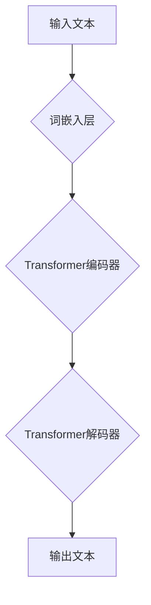

> 人工智能，自然语言处理，生成模型，语义连贯性，Transformer，BERT，GPT

## 1. 背景介绍

人工智能（AI）的飞速发展，特别是自然语言处理（NLP）领域的突破，使得机器能够理解和生成人类语言，这为我们带来了许多新的可能性。其中，生成语意连贯性是人工智能领域一个重要的研究方向，它旨在使机器能够生成流畅、连贯、具有语义意义的文本。

传统的文本生成方法通常依赖于统计模型，例如n-gram模型，这些模型只能生成基于统计规律的文本，缺乏语义理解和推理能力。随着深度学习的兴起，基于深度学习的生成模型，例如Transformer、BERT和GPT等，取得了显著的进展，能够生成更自然、更连贯的文本。

## 2. 核心概念与联系

**2.1 语义连贯性**

语义连贯性是指文本中各句之间、各段之间存在逻辑关系，能够形成一个完整的语义结构，使读者能够理解文本的整体含义。

**2.2 生成模型**

生成模型是一种机器学习模型，能够从已有的数据中学习模式，并生成新的数据。在文本生成领域，生成模型通常用于生成新的文本序列，例如文章、对话、诗歌等。

**2.3 Transformer**

Transformer是一种基于注意力机制的深度学习模型，能够有效地捕捉文本中的长距离依赖关系，因此在自然语言处理任务中取得了优异的性能，例如机器翻译、文本摘要、问答系统等。

**2.4 BERT**

BERT（Bidirectional Encoder Representations from Transformers）是一种预训练语言模型，能够理解文本中的上下文信息，并生成高质量的文本表示。

**2.5 GPT**

GPT（Generative Pre-trained Transformer）是一种基于Transformer的生成模型，能够生成流畅、连贯的文本。

**2.6 Mermaid 流程图**

## 3. 核心算法原理 & 具体操作步骤

### 3.1 算法原理概述

生成语意连贯性算法通常基于深度学习模型，例如Transformer，并结合注意力机制、循环神经网络（RNN）等技术，能够有效地捕捉文本中的语义关系和上下文信息，从而生成流畅、连贯的文本。

### 3.2 算法步骤详解

1. **词嵌入:** 将文本中的每个词转换为向量表示，以便模型能够理解词语的语义信息。
2. **编码:** 使用Transformer编码器对输入文本进行编码，提取文本的语义特征和上下文信息。
3. **解码:** 使用Transformer解码器根据编码后的文本信息，生成新的文本序列。
4. **注意力机制:** 在解码过程中，注意力机制能够帮助模型关注输入文本中与当前生成词语相关的关键信息，从而提高文本的连贯性和语义准确性。
5. **概率分布:** 解码器输出每个词语的概率分布，选择概率最高的词语作为下一个生成词语。

### 3.3 算法优缺点

**优点:**

* 能够生成流畅、连贯的文本。
* 能够捕捉文本中的长距离依赖关系。
* 能够理解文本的上下文信息。

**缺点:**

* 训练成本高。
* 容易受到训练数据的影响。
* 难以控制生成的文本内容。

### 3.4 算法应用领域

* 文本生成：例如文章写作、故事创作、对话系统等。
* 机器翻译：将一种语言翻译成另一种语言。
* 文本摘要：提取文本的重点信息，生成简短的摘要。
* 问答系统：根据用户的问题，从文本中找到答案。

## 4. 数学模型和公式 & 详细讲解 & 举例说明

### 4.1 数学模型构建

**4.1.1 词嵌入模型**

词嵌入模型将每个词语映射到一个低维向量空间中，使得语义相似的词语在向量空间中距离较近。常用的词嵌入模型包括Word2Vec和GloVe。

**4.1.2 Transformer编码器**

Transformer编码器由多层编码器块组成，每个编码器块包含多头注意力机制和前馈神经网络。

**4.1.3 Transformer解码器**

Transformer解码器也由多层解码器块组成，每个解码器块包含多头注意力机制、masked multi-head attention和前馈神经网络。

**4.1.4 概率分布**

解码器输出每个词语的概率分布，可以使用softmax函数计算：

$$
P(w_t | w_1, w_2, ..., w_{t-1}) = \frac{exp(s_t)}{\sum_{k=1}^{V} exp(s_k)}
$$

其中：

* $w_t$ 是当前生成词语。
* $w_1, w_2, ..., w_{t-1}$ 是之前生成的词语。
* $s_t$ 是解码器输出的词语向量。
* $V$ 是词典的大小。

### 4.2 公式推导过程

Transformer编码器和解码器的具体公式推导过程比较复杂，涉及到矩阵运算、线性变换、激活函数等。

### 4.3 案例分析与讲解

可以以BERT模型为例，分析其在文本分类任务中的应用，以及其在语义理解方面的优势。

## 5. 项目实践：代码实例和详细解释说明

### 5.1 开发环境搭建

使用Python语言和深度学习框架TensorFlow或PyTorch搭建开发环境。

### 5.2 源代码详细实现

使用预训练的Transformer模型，例如BERT或GPT，进行文本生成任务的代码实现。

### 5.3 代码解读与分析

解释代码中使用的函数、类和参数，以及代码的执行流程。

### 5.4 运行结果展示

展示代码运行的结果，例如生成的文本片段，以及文本的评价指标，例如BLEU分数。

## 6. 实际应用场景

### 6.1 文本摘要

使用生成模型对长篇文本进行摘要，提取关键信息。

### 6.2 机器翻译

使用生成模型将一种语言翻译成另一种语言。

### 6.3 对话系统

使用生成模型构建对话系统，与用户进行自然语言交互。

### 6.4 未来应用展望

生成语意连贯性算法在未来将有更广泛的应用，例如：

* 自动写作：帮助人们自动生成各种类型的文本，例如新闻报道、小说、诗歌等。
* 个性化教育：根据学生的学习情况，生成个性化的学习内容。
* 虚拟助手：构建更智能的虚拟助手，能够更好地理解和响应用户的需求。

## 7. 工具和资源推荐

### 7.1 学习资源推荐

* **书籍:**
    * 《深度学习》
    * 《自然语言处理》
* **在线课程:**
    * Coursera上的深度学习课程
    * edX上的自然语言处理课程

### 7.2 开发工具推荐

* **TensorFlow:** 开源深度学习框架。
* **PyTorch:** 开源深度学习框架。
* **Hugging Face Transformers:** 预训练Transformer模型库。

### 7.3 相关论文推荐

* 《Attention Is All You Need》
* 《BERT: Pre-training of Deep Bidirectional Transformers for Language Understanding》
* 《GPT-3: Language Models are Few-Shot Learners》

## 8. 总结：未来发展趋势与挑战

### 8.1 研究成果总结

生成语意连贯性算法取得了显著的进展，能够生成更自然、更连贯的文本。

### 8.2 未来发展趋势

* **更强大的模型:** 开发更强大的生成模型，能够更好地理解和生成复杂文本。
* **更灵活的控制:** 提高对文本生成的控制能力，例如控制文本的风格、语气、长度等。
* **更广泛的应用:** 将生成语意连贯性算法应用到更多领域，例如教育、医疗、法律等。

### 8.3 面临的挑战

* **数据质量:** 生成模型的性能依赖于训练数据的质量，高质量的训练数据是关键。
* **伦理问题:** 生成模型可能被用于生成虚假信息，需要考虑伦理问题。
* **可解释性:** 生成模型的决策过程难以理解，需要提高模型的可解释性。

### 8.4 研究展望

未来研究将继续探索更强大的生成模型、更灵活的控制机制和更广泛的应用场景，同时也要关注伦理问题和可解释性问题。

## 9. 附录：常见问题与解答

* **Q1: 如何评估生成文本的质量？**

* **A1:** 可以使用BLEU、ROUGE等指标评估生成文本的质量。

* **Q2: 如何训练生成模型？**

* **A2:** 需要使用大量的文本数据进行训练，可以使用预训练模型进行微调。

* **Q3: 如何控制生成文本的风格？**

* **A3:** 可以通过调整模型的超参数或使用文本风格转换模型来控制生成文本的风格。

作者：禅与计算机程序设计艺术 / Zen and the Art of Computer Programming 
<end_of_turn>