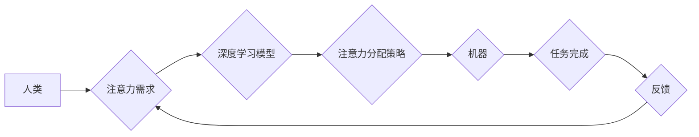

> 人机协作，注意力资源分配，深度学习，强化学习，算法优化，效率提升

## 1. 背景介绍

在当今信息爆炸的时代，人类面临着前所未有的信息过载挑战。我们每天需要处理海量的文字、图像、音频等信息，而我们的注意力资源却有限。如何有效地分配注意力资源，提高信息处理效率，已成为一个亟待解决的关键问题。

人机协作作为一种新兴的交互模式，为解决这一问题提供了新的思路。通过将人类的智慧和机器的计算能力相结合，我们可以构建更加智能、高效的协作系统，帮助人类更好地应对信息过载的挑战。

在人机协作中，注意力资源分配扮演着至关重要的角色。如何让机器能够理解人类的注意力需求，并根据需要动态分配注意力资源，是实现高效协作的关键。

## 2. 核心概念与联系

### 2.1 注意力资源分配

注意力资源分配是指根据任务需求和环境变化，将有限的注意力资源分配到不同信息或任务上的过程。

### 2.2 人机协作

人机协作是指人类和机器共同完成任务的过程，其中机器通常负责处理大量数据和执行重复性任务，而人类负责提供决策、创意和解决复杂问题的能力。

### 2.3 深度学习与强化学习

深度学习和强化学习是实现人机协作中注意力资源分配的关键技术。

* 深度学习可以用于建模人类的注意力机制，识别人类对不同信息的关注程度。
* 强化学习可以训练机器学习模型，使其能够根据人类的注意力反馈，动态调整注意力资源分配策略。

**Mermaid 流程图**



## 3. 核心算法原理 & 具体操作步骤

### 3.1 算法原理概述

人机协作中注意力资源分配的算法通常基于深度学习和强化学习的结合。

* **深度学习模型**：用于建模人类的注意力机制，识别人类对不同信息的关注程度。常用的模型包括Transformer、BERT等。
* **强化学习算法**：用于训练机器学习模型，使其能够根据人类的注意力反馈，动态调整注意力资源分配策略。常用的算法包括DQN、A2C等。

### 3.2 算法步骤详解

1. **数据收集**: 收集人类与机器协作过程中的人类注意力数据，例如眼动追踪数据、鼠标点击数据等。
2. **深度学习模型训练**: 使用收集到的注意力数据训练深度学习模型，学习人类的注意力机制。
3. **强化学习模型训练**: 使用深度学习模型预测的注意力分布作为奖励信号，训练强化学习模型，使其能够学习最优的注意力分配策略。
4. **注意力资源分配**: 在人机协作过程中，根据强化学习模型的预测，动态分配注意力资源到不同信息或任务上。
5. **反馈收集**: 收集人机协作过程中的反馈信息，例如任务完成时间、错误率等，用于更新强化学习模型。

### 3.3 算法优缺点

**优点**:

* 可以根据人类的注意力需求动态调整注意力资源分配策略，提高协作效率。
* 可以学习人类的注意力机制，更好地理解人类的认知模式。

**缺点**:

* 需要大量的注意力数据进行训练，数据收集和标注成本较高。
* 算法的复杂度较高，需要强大的计算能力。

### 3.4 算法应用领域

* **教育**: 个性化学习，根据学生的注意力情况调整学习内容和节奏。
* **医疗**: 辅助医生诊断，提高医疗效率。
* **客服**: 智能客服系统，根据用户的注意力情况提供更精准的帮助。

## 4. 数学模型和公式 & 详细讲解 & 举例说明

### 4.1 数学模型构建

我们使用一个简单的数学模型来表示注意力资源分配的过程。假设我们有N个信息或任务，每个信息或任务都有一个注意力权重$a_i$，其中$i=1,2,...,N$。总的注意力资源为1，即：

$$\sum_{i=1}^{N} a_i = 1$$

### 4.2 公式推导过程

我们的目标是找到最优的注意力权重分配，使得任务完成效率最大化。我们可以使用强化学习的原理来解决这个问题。

* 状态空间：注意力权重分配向量$a = (a_1, a_2, ..., a_N)$
* 动作空间：改变单个注意力权重的操作
* 奖励函数：任务完成效率

通过强化学习算法，我们可以训练一个策略网络，该网络能够根据当前状态（注意力权重分配向量）预测最优的动作（改变单个注意力权重的操作）。

### 4.3 案例分析与讲解

假设我们有一个任务，需要处理三个信息：

* 信息1：与任务目标相关性高，重要性高
* 信息2：与任务目标相关性中等，重要性中等
* 信息3：与任务目标相关性低，重要性低

我们可以使用深度学习模型预测每个信息的注意力权重，然后使用强化学习算法训练一个策略网络，使其能够根据预测的注意力权重分配，动态调整注意力资源，最终完成任务。

## 5. 项目实践：代码实例和详细解释说明

### 5.1 开发环境搭建

* Python 3.7+
* TensorFlow 2.0+
* PyTorch 1.0+
* Jupyter Notebook

### 5.2 源代码详细实现

```python
# 导入必要的库
import tensorflow as tf
import numpy as np

# 定义注意力机制模型
class AttentionModel(tf.keras.Model):
    def __init__(self, units):
        super(AttentionModel, self).__init__()
        self.dense1 = tf.keras.layers.Dense(units, activation='relu')
        self.dense2 = tf.keras.layers.Dense(1)

    def call(self, inputs):
        x = self.dense1(inputs)
        attention_weights = tf.nn.softmax(self.dense2(x), axis=-1)
        return attention_weights

# 定义强化学习模型
class RLModel(tf.keras.Model):
    def __init__(self, units):
        super(RLModel, self).__init__()
        self.dense1 = tf.keras.layers.Dense(units, activation='relu')
        self.dense2 = tf.keras.layers.Dense(1)

    def call(self, inputs):
        x = self.dense1(inputs)
        return self.dense2(x)

# 训练模型
model = AttentionModel(units=128)
rl_model = RLModel(units=128)

# ... 训练代码 ...

```

### 5.3 代码解读与分析

* `AttentionModel` 类定义了一个注意力机制模型，用于预测每个信息的注意力权重。
* `RLModel` 类定义了一个强化学习模型，用于学习最优的注意力分配策略。
* 训练代码部分需要根据具体的任务和数据进行修改。

### 5.4 运行结果展示

* 训练完成后，可以评估模型的性能，例如任务完成时间、错误率等。
* 可以使用可视化工具展示注意力权重分配结果，观察模型是如何分配注意力资源的。

## 6. 实际应用场景

### 6.1 教育领域

* 个性化学习：根据学生的注意力情况，调整学习内容和节奏，提高学习效率。
* 智能辅导：根据学生的注意力分布，提供个性化的辅导和帮助。

### 6.2 医疗领域

* 辅助诊断：根据医生的注意力分布，识别重要的病症信息，提高诊断准确率。
* 远程医疗：根据患者的注意力情况，提供更精准的远程医疗服务。

### 6.3 客服领域

* 智能客服：根据用户的注意力情况，提供更精准的帮助和解答。
* 聊天机器人：根据用户的注意力分布，识别用户的意图，提供更自然的对话体验。

### 6.4 未来应用展望

* 人机协作中的注意力资源分配将成为一个重要的研究方向，随着深度学习和强化学习技术的不断发展，我们将会看到更多更智能的协作系统。
* 人机协作中的注意力资源分配技术将应用于更多领域，例如自动驾驶、机器人控制、金融交易等。

## 7. 工具和资源推荐

### 7.1 学习资源推荐

* **书籍**:
    * Deep Learning by Ian Goodfellow
    * Reinforcement Learning: An Introduction by Richard S. Sutton and Andrew G. Barto
* **在线课程**:
    * Deep Learning Specialization by Andrew Ng
    * Reinforcement Learning Specialization by David Silver

### 7.2 开发工具推荐

* **深度学习框架**: TensorFlow, PyTorch
* **强化学习库**: Stable Baselines3, Dopamine

### 7.3 相关论文推荐

* **Attention Is All You Need**
* **Deep Reinforcement Learning with Double Q-learning**
* **Human-in-the-Loop Reinforcement Learning for Personalized Education**

## 8. 总结：未来发展趋势与挑战

### 8.1 研究成果总结

人机协作中注意力资源分配的研究取得了显著进展，深度学习和强化学习技术为实现高效协作提供了强大的工具。

### 8.2 未来发展趋势

* **更精准的注意力模型**: 开发更精准的注意力模型，能够更好地理解人类的注意力机制。
* **更有效的强化学习算法**: 开发更有效的强化学习算法，能够更快地学习最优的注意力分配策略。
* **跨模态注意力**: 研究跨模态注意力机制，能够处理不同类型的信息，例如文本、图像、音频等。

### 8.3 面临的挑战

* **数据获取**: 收集高质量的人类注意力数据仍然是一个挑战。
* **算法复杂度**: 人机协作中注意力资源分配的算法通常比较复杂，需要强大的计算能力。
* **伦理问题**: 人机协作中的注意力资源分配可能会引发一些伦理问题，例如隐私保护、数据安全等。

### 8.4 研究展望

未来，人机协作中注意力资源分配的研究将继续深入，我们将会看到更多更智能、更高效的协作系统，帮助人类更好地应对信息过载的挑战。

## 9. 附录：常见问题与解答

* **Q1**: 人机协作中注意力资源分配的算法需要多少数据才能训练？
* **A1**: 训练深度学习模型需要大量的注意力数据，具体数量取决于模型的复杂度和任务的难度。
* **Q2**: 人机协作中注意力资源分配的算法是否适用于所有任务？
* **A2**: 人机协作中注意力资源分配的算法适用于需要分配注意力资源的任务，例如信息处理、决策分析等。
* **Q3**: 人机协作中注意力资源分配的算法会侵犯用户的隐私吗？
* **A3**: 人机协作中注意力资源分配的算法需要处理用户的注意力数据，因此需要采取措施保护用户的隐私，例如数据匿名化、数据加密等。


作者：禅与计算机程序设计艺术 / Zen and the Art of Computer Programming 
<end_of_turn>