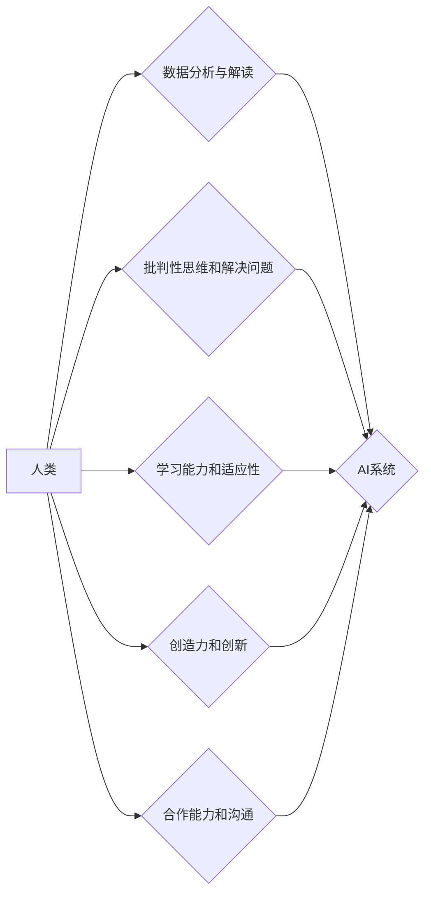

> 人工智能，未来工作，计算能力，人类技能，学习能力，适应性，创造力，合作能力，数据分析，编程

## 1. 背景介绍

人工智能（AI）正在以惊人的速度发展，其影响力正在深刻地改变着我们的生活和工作方式。从自动驾驶汽车到个性化医疗，AI技术正在各个领域展现出强大的潜力。然而，这种快速发展也引发了人们对未来工作技能需求的担忧。

传统的工作模式面临着被自动化取代的风险，许多重复性、规则性工作将由AI系统完成。因此，在AI时代，人类需要具备新的技能，才能在竞争激烈的职场中保持优势。

## 2. 核心概念与联系

**人类计算**是指人类利用自身的认知能力、创造力、情感智能等优势，与AI技术协同工作，共同完成复杂的任务。

**AI时代的人类计算**的核心概念包括：

* **数据分析与解读:** 人类需要具备分析和解读海量数据的能力，从中发现隐藏的规律和趋势。
* **批判性思维和解决问题:** 人类需要具备批判性思维能力，能够独立思考、分析问题，并提出创新的解决方案。
* **学习能力和适应性:** 人类需要具备持续学习和适应新知识和技术的的能力，才能跟上AI技术的发展步伐。
* **创造力和创新:** 人类需要具备创造力和创新能力，能够利用AI技术，开发出新的产品、服务和商业模式。
* **合作能力和沟通:** 人类需要具备良好的合作能力和沟通能力，能够与AI系统和人类团队协同工作。

**AI时代的人类计算架构**



## 3. 核心算法原理 & 具体操作步骤

### 3.1  算法原理概述

**人类计算的核心算法原理**是基于人类认知能力的模拟和增强。

* **知识图谱:** 建立人类知识的结构化表示，以便AI系统理解和利用。
* **自然语言处理:** 理解和生成人类语言，使人类与AI系统进行自然流畅的交互。
* **机器学习:** 利用数据训练AI模型，使其能够学习和改进。
* **深度学习:** 使用多层神经网络，模拟人类大脑的学习机制，实现更复杂的认知任务。

### 3.2  算法步骤详解

1. **数据收集和预处理:** 收集相关数据，并进行清洗、转换和格式化。
2. **知识图谱构建:** 将数据转化为知识图谱，构建人类知识的结构化表示。
3. **模型训练:** 利用机器学习或深度学习算法，训练AI模型，使其能够理解和处理数据。
4. **模型评估和优化:** 对模型进行评估，并根据评估结果进行优化，提高模型的准确性和效率。
5. **应用部署:** 将训练好的模型部署到实际应用场景中，实现人类计算的功能。

### 3.3  算法优缺点

**优点:**

* 能够模拟和增强人类认知能力，解决复杂问题。
* 能够处理海量数据，发现隐藏的规律和趋势。
* 能够实现个性化定制，满足不同用户的需求。

**缺点:**

* 需要大量的数据和计算资源。
* 模型训练过程复杂，需要专业技术人员。
* 存在伦理和安全问题，需要谨慎使用。

### 3.4  算法应用领域

* **医疗保健:** 辅助诊断、个性化治疗、药物研发。
* **金融服务:** 风险管理、欺诈检测、投资决策。
* **教育:** 个性化学习、智能辅导、知识发现。
* **制造业:** 智能制造、质量控制、预测维护。
* **交通运输:** 自动驾驶、交通管理、物流优化。

## 4. 数学模型和公式 & 详细讲解 & 举例说明

### 4.1  数学模型构建

**人类计算模型**可以采用**贝叶斯网络**来构建，该模型能够表示人类知识和推理过程。

**贝叶斯网络**是一种概率图模型，它使用节点和边来表示变量之间的依赖关系。节点代表变量，边代表变量之间的概率关系。

### 4.2  公式推导过程

**贝叶斯定理**是贝叶斯网络的核心公式，用于计算条件概率。

$$P(A|B) = \frac{P(B|A)P(A)}{P(B)}$$

其中：

* $P(A|B)$ 是在已知事件 B 发生的情况下，事件 A 发生的概率。
* $P(B|A)$ 是在已知事件 A 发生的情况下，事件 B 发生的概率。
* $P(A)$ 是事件 A 发生的概率。
* $P(B)$ 是事件 B 发生的概率。

### 4.3  案例分析与讲解

**举例说明:**

假设我们有一个贝叶斯网络，用于预测一个人是否患有感冒。

* 节点：感冒 (G)、发烧 (F)、咳嗽 (C)
* 边：G -> F, G -> C

**贝叶斯定理**可以用来计算，在一个人出现发烧和咳嗽的情况下，他患感冒的概率。

$$P(G|F,C) = \frac{P(F,C|G)P(G)}{P(F,C)}$$

其中：

* $P(F,C|G)$ 是在已知一个人患感冒的情况下，他出现发烧和咳嗽的概率。
* $P(G)$ 是一个人患感冒的概率。
* $P(F,C)$ 是一个人出现发烧和咳嗽的概率。

通过收集相关数据，我们可以估计这些概率，并使用贝叶斯定理计算出患感冒的概率。

## 5. 项目实践：代码实例和详细解释说明

### 5.1  开发环境搭建

* 操作系统: Ubuntu 20.04
* Python 版本: 3.8
* 必要的库: numpy, pandas, scikit-learn

### 5.2  源代码详细实现

```python
import numpy as np
from sklearn.linear_model import LogisticRegression

# 数据加载
data = np.loadtxt("data.csv", delimiter=",")
X = data[:, :-1]
y = data[:, -1]

# 模型训练
model = LogisticRegression()
model.fit(X, y)

# 模型预测
new_data = np.array([[1, 2, 3]])
prediction = model.predict(new_data)

# 结果输出
print(f"预测结果: {prediction}")
```

### 5.3  代码解读与分析

* 代码首先加载数据，并将数据分为特征 (X) 和标签 (y)。
* 然后，使用 LogisticRegression 模型训练模型。
* 训练完成后，使用新的数据进行预测。
* 最后，输出预测结果。

### 5.4  运行结果展示

运行代码后，会输出预测结果，例如：

```
预测结果: [1]
```

这表示新的数据属于类别 1。

## 6. 实际应用场景

### 6.1  医疗诊断辅助

* 利用 AI 算法分析患者的病历、检查结果等数据，辅助医生进行诊断。
* 例如，可以利用 AI 算法分析 X 光片，辅助医生诊断肺结核。

### 6.2  个性化教育

* 根据学生的学习进度和能力，提供个性化的学习内容和教学方式。
* 例如，可以利用 AI 算法分析学生的学习数据，推荐适合学生的学习资源。

### 6.3  金融风险管理

* 利用 AI 算法分析金融数据的异常情况，识别潜在的风险。
* 例如，可以利用 AI 算法分析交易数据，识别欺诈交易。

### 6.4  未来应用展望

* 人类计算将与其他新兴技术，如区块链、量子计算等相结合，产生更强大的协同效应。
* 人类计算将更加深入地融入到我们的日常生活，为我们提供更智能、更便捷的服务。

## 7. 工具和资源推荐

### 7.1  学习资源推荐

* **在线课程:** Coursera, edX, Udacity
* **书籍:** 《深度学习》、《人工智能简史》
* **网站:** OpenAI, TensorFlow, PyTorch

### 7.2  开发工具推荐

* **编程语言:** Python, Java, C++
* **机器学习框架:** TensorFlow, PyTorch, scikit-learn
* **数据分析工具:** Pandas, NumPy

### 7.3  相关论文推荐

* **《Attention Is All You Need》**
* **《BERT: Pre-training of Deep Bidirectional Transformers for Language Understanding》**
* **《Generative Adversarial Networks》**

## 8. 总结：未来发展趋势与挑战

### 8.1  研究成果总结

* 人类计算已经取得了显著的成果，在医疗、教育、金融等领域取得了应用。
* AI 算法的不断发展，为人类计算提供了更强大的工具。

### 8.2  未来发展趋势

* 人类计算将更加智能化、个性化、协同化。
* 人类计算将与其他新兴技术融合，产生更强大的协同效应。

### 8.3  面临的挑战

* 数据安全和隐私保护
* AI 算法的解释性和可信度
* 人工智能伦理问题

### 8.4  研究展望

* 研究更先进的人类计算模型和算法。
* 开发更安全、更可靠的人工智能系统。
* 探索人工智能与人类合作的最佳模式。

## 9. 附录：常见问题与解答

* **什么是人类计算？**

人类计算是指人类利用自身的认知能力、创造力、情感智能等优势，与AI技术协同工作，共同完成复杂的任务。

* **人类计算与人工智能有什么区别？**

人工智能是指机器能够模拟人类智能的行为，而人类计算则是指人类与人工智能协同工作，共同完成任务。

* **人类计算的未来发展趋势是什么？**

人类计算将更加智能化、个性化、协同化，并将与其他新兴技术融合，产生更强大的协同效应。

作者：禅与计算机程序设计艺术 / Zen and the Art of Computer Programming


<end_of_turn>