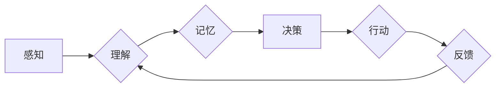

> 假说驱动的发现模式，人类认知，认知科学，人工智能，机器学习，知识发现，数据分析

## 1. 背景介绍

人类认知是一个复杂而迷人的领域，它涉及到我们如何感知世界、理解信息、做出决策以及创造新的知识。 为了更好地理解人类认知，认知科学家们提出了各种理论和模型，其中之一就是“假说驱动的发现模式”。

这个模式认为，人类的认知过程本质上是一种不断提出、检验和修正假说的过程。当我们遇到一个新的问题或现象时，我们会首先根据自己的经验和知识提出一个或多个假说来解释它。然后，我们会通过观察、实验或推理等方式来检验这些假说，并根据检验结果进行修正或淘汰。

这种假说驱动的发现模式在人类的各个认知活动中都发挥着重要作用，例如：

* **科学发现：** 科学家们通过提出假说、进行实验和分析数据来发现新的科学规律。
* **问题解决：** 当我们遇到一个问题时，我们会首先尝试提出一些可能的解决方案，然后根据实际情况进行选择和改进。
* **学习和记忆：** 我们通过将新信息与已有的知识联系起来，并不断地检验和修正自己的理解来进行学习和记忆。

## 2. 核心概念与联系

**2.1 假说驱动的发现模式**

这个模式的核心概念是“假说”，它是一种关于世界或现象的解释或预测。假说可以是简单的，也可以是复杂的，它可以是基于经验的，也可以是基于理论的。

**2.2 认知过程中的关键环节**

* **感知：** 我们通过感官接收来自外部世界的信息。
* **理解：** 我们对接收到的信息进行解释和组织，形成对世界的认知。
* **记忆：** 我们将重要的信息存储在记忆中，以便日后使用。
* **决策：** 我们根据自己的认知和目标做出选择。
* **行动：** 我们根据自己的决策采取行动。

**2.3 假说与认知过程的关系**

假说驱动的发现模式认为，认知过程是一个不断提出、检验和修正假说的循环过程。

* **感知和理解阶段：** 我们通过感知和理解信息，形成关于世界的初始假说。
* **记忆阶段：** 我们将这些假说存储在记忆中，并与已有的知识进行关联。
* **决策和行动阶段：** 我们根据这些假说做出决策，并采取行动来检验这些假说。
* **反馈阶段：** 我们根据行动的结果，对假说进行修正或淘汰，并重新开始循环。

**2.4 Mermaid 流程图**



## 3. 核心算法原理 & 具体操作步骤

**3.1 算法原理概述**

假说驱动的发现模式可以被看作是一种启发式搜索算法，它通过不断提出和检验假说来寻找最优解。

**3.2 算法步骤详解**

1. **问题定义：** 首先明确需要解决的问题或需要发现的知识。
2. **假说生成：** 根据问题和已有的知识，生成多个关于问题的假说。
3. **假说检验：** 使用观察、实验或推理等方式来检验这些假说。
4. **假说修正：** 根据检验结果，对假说进行修正或淘汰。
5. **重复步骤3-4：** 直到找到一个能够解释现象或解决问题的最佳假说。

**3.3 算法优缺点**

* **优点：**
    * 能够处理复杂的问题，并找到非显而易见的解决方案。
    * 能够利用人类的经验和知识，提高发现效率。
    * 能够不断地改进和完善假说，最终找到更准确的解释。
* **缺点：**
    * 容易受到个人偏见和经验的影响。
    * 难以量化和评估假说的优劣。
    * 可能会陷入循环，无法找到最佳解决方案。

**3.4 算法应用领域**

* **科学研究：** 提出和检验科学假说，发现新的科学规律。
* **技术开发：** 解决技术难题，设计新的产品和系统。
* **商业决策：** 分析市场趋势，制定营销策略。
* **医疗诊断：** 诊断疾病，制定治疗方案。

## 4. 数学模型和公式 & 详细讲解 & 举例说明

**4.1 数学模型构建**

假说驱动的发现模式可以被建模为一个概率模型，其中假说被看作是关于现象的概率分布。

**4.2 公式推导过程**

假设我们有一个现象，它可以由多个假说解释。每个假说都有一个对应的概率，表示该假说解释该现象的可能性。

我们可以使用贝叶斯定理来更新每个假说的概率，根据观察到的证据。

**贝叶斯定理：**

$$P(A|B) = \frac{P(B|A)P(A)}{P(B)}$$

其中：

* $P(A|B)$ 是在已知事件 B 发生的情况下，事件 A 发生的概率。
* $P(B|A)$ 是在已知事件 A 发生的情况下，事件 B 发生的概率。
* $P(A)$ 是事件 A 发生的概率。
* $P(B)$ 是事件 B 发生的概率。

**4.3 案例分析与讲解**

例如，假设我们观察到一个物体在空中运动，我们想要判断它是否受到重力的影响。

我们可以提出两个假说：

* 假说 1：物体受到重力的影响。
* 假说 2：物体没有受到重力的影响。

我们可以根据观察到的证据，例如物体的运动轨迹，来更新这两个假说的概率。

如果物体的运动轨迹与重力加速度相符，那么我们就可以认为假说 1 的概率更高。

## 5. 项目实践：代码实例和详细解释说明

**5.1 开发环境搭建**

* Python 3.x
* Jupyter Notebook

**5.2 源代码详细实现**

```python
import numpy as np

# 假设数据
data = np.array([1, 2, 3, 4, 5])

# 假说 1：数据服从线性分布
hypothesis_1 = lambda x: x

# 假说 2：数据服从二次分布
hypothesis_2 = lambda x: x**2

# 计算每个假说的似然度
likelihood_1 = np.sum((data - hypothesis_1(data))**2)
likelihood_2 = np.sum((data - hypothesis_2(data))**2)

# 打印结果
print(f"假说 1 的似然度：{likelihood_1}")
print(f"假说 2 的似然度：{likelihood_2}")
```

**5.3 代码解读与分析**

* 我们首先定义了两个假说，分别表示数据服从线性分布和二次分布。
* 然后，我们计算了每个假说的似然度，即数据在该假说下的概率。
* 最后，我们打印了每个假说的似然度，可以根据似然度的大小来判断哪个假说更符合数据。

**5.4 运行结果展示**

运行结果会显示出两个假说的似然度，我们可以根据结果来判断哪个假说更符合数据。

## 6. 实际应用场景

**6.1 科学研究**

* **药物研发：** 通过假说驱动的发现模式，科学家们可以提出关于药物作用机制的假说，并通过实验进行检验。
* **气候变化研究：** 通过假说驱动的发现模式，科学家们可以提出关于气候变化原因的假说，并通过数据分析进行检验。

**6.2 技术开发**

* **人工智能：** 通过假说驱动的发现模式，人工智能系统可以学习新的知识和技能，并解决新的问题。
* **软件开发：** 通过假说驱动的发现模式，软件开发人员可以设计出更符合用户需求的软件。

**6.3 其他领域**

* **商业决策：** 通过假说驱动的发现模式，企业可以分析市场趋势，制定更有效的营销策略。
* **医疗诊断：** 通过假说驱动的发现模式，医生可以诊断疾病，制定更合理的治疗方案。

**6.4 未来应用展望**

随着人工智能技术的不断发展，假说驱动的发现模式将在更多领域得到应用，例如：

* **个性化教育：** 根据学生的学习情况，提出个性化的学习方案。
* **精准医疗：** 根据患者的基因信息，制定个性化的治疗方案。
* **自动驾驶：** 帮助自动驾驶汽车更好地理解道路环境，做出更安全的决策。

## 7. 工具和资源推荐

**7.1 学习资源推荐**

* **书籍：**
    * 《认知心理学》
    * 《人工智能：现代方法》
    * 《机器学习》
* **在线课程：**
    * Coursera 上的《认知科学》课程
    * edX 上的《人工智能》课程

**7.2 开发工具推荐**

* **Python：** 广泛应用于人工智能和数据分析领域。
* **Jupyter Notebook：** 用于编写和执行 Python 代码，并可视化数据。
* **TensorFlow：** 用于构建和训练深度学习模型。

**7.3 相关论文推荐**

* **《A Theory of Intelligence》**
* **《The Structure of Scientific Revolutions》**
* **《The Algorithm Design Manual》**

## 8. 总结：未来发展趋势与挑战

**8.1 研究成果总结**

假说驱动的发现模式为我们理解人类认知提供了新的视角，并为人工智能的发展提供了新的思路。

**8.2 未来发展趋势**

* **更强大的人工智能模型：** 未来，人工智能模型将更加强大，能够更好地理解和模拟人类的认知过程。
* **更广泛的应用场景：** 假说驱动的发现模式将应用于更多领域，例如教育、医疗、金融等。
* **更深入的认知科学研究：** 通过研究人工智能模型，我们可以更好地理解人类的认知机制。

**8.3 面临的挑战**

* **如何让人工智能模型更加智能：** 目前，人工智能模型仍然无法完全模拟人类的智能，例如创造力和想象力。
* **如何确保人工智能模型的安全性：** 随着人工智能模型的不断发展，我们需要确保其安全性和可靠性。
* **如何解决伦理问题：** 人工智能的发展也带来了新的伦理问题，例如算法偏见和数据隐私。

**8.4 研究展望**

未来，我们将继续研究假说驱动的发现模式，并将其应用于更多领域，以推动人工智能的发展和人类认知的进步。

## 9. 附录：常见问题与解答

**9.1 如何生成更有效的假说？**

* 基于已有的知识和经验。
* 考虑不同角度和视角。
* 使用启发式搜索算法。

**9.2 如何评估假说的优劣？**

* 使用似然度、信息熵等指标。
* 通过实验和观察进行验证。
* 结合专家意见和用户反馈。


作者：禅与计算机程序设计艺术 / Zen and the Art of Computer Programming 
<end_of_turn>