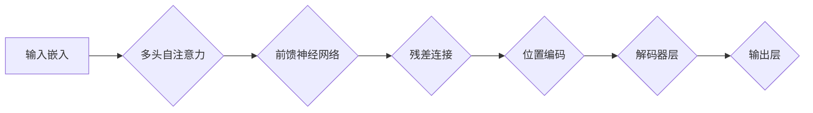

> 大模型、解码器、Transformer、自然语言处理、微调、文本生成

## 1. 背景介绍

近年来，深度学习在自然语言处理 (NLP) 领域取得了突破性进展，其中大模型扮演着越来越重要的角色。这些模型拥有庞大的参数量，能够学习复杂的语言模式，在文本生成、机器翻译、问答系统等任务上表现出色。

解码器作为大模型的核心组件之一，负责将模型的输出序列生成为最终的文本。本文将深入探讨解码器的实现原理，从基础概念到具体操作步骤，并结合实际案例进行讲解，帮助读者理解解码器的工作机制，并掌握其开发与微调技巧。

## 2. 核心概念与联系

### 2.1  Transformer 架构

解码器通常基于 Transformer 架构构建，Transformer 是一种强大的序列到序列模型，其核心特点是利用自注意力机制 (Self-Attention) 来捕捉序列中的长距离依赖关系。

**Mermaid 流程图:**



### 2.2  解码器结构

解码器通常由多个解码器层组成，每个解码器层包含以下组件：

* **多头自注意力:** 用于捕捉输入序列中每个词与其他词之间的关系。
* **前馈神经网络:** 用于对每个词的表示进行非线性变换。
* **残差连接:** 用于缓解梯度消失问题，提高模型训练的稳定性。
* **位置编码:** 用于为每个词添加位置信息，因为 Transformer 模型本身不具备对序列位置的感知能力。

### 2.3  解码过程

解码器的工作过程可以概括为以下步骤：

1. 将输入序列转换为词嵌入向量。
2. 在每个解码器层中，利用多头自注意力机制和前馈神经网络对词嵌入向量进行处理，生成新的词嵌入向量。
3. 将新的词嵌入向量与位置编码进行融合，得到最终的词表示。
4. 通过输出层将词表示转换为概率分布，预测下一个词。
5. 重复步骤 2-4，直到生成完整的输出序列。

## 3. 核心算法原理 & 具体操作步骤

### 3.1  算法原理概述

解码器的核心算法是基于 Transformer 架构的序列到序列模型，其主要原理是利用自注意力机制和前馈神经网络来学习语言的上下文关系和模式。

### 3.2  算法步骤详解

1. **输入嵌入:** 将输入序列中的每个词转换为词嵌入向量，每个词嵌入向量是一个固定长度的向量，代表该词的语义信息。
2. **多头自注意力:** 对每个词的嵌入向量进行多头自注意力计算，捕捉输入序列中每个词与其他词之间的关系。
3. **前馈神经网络:** 对每个词的注意力输出进行前馈神经网络处理，进一步提取语义信息。
4. **残差连接:** 将注意力输出和前馈神经网络输出进行残差连接，缓解梯度消失问题。
5. **位置编码:** 为每个词添加位置信息，以便模型能够理解词序。
6. **输出层:** 将最终的词表示转换为概率分布，预测下一个词。

### 3.3  算法优缺点

**优点:**

* 能够捕捉长距离依赖关系，提高模型的表达能力。
* 训练效率高，能够处理较长的序列数据。

**缺点:**

* 参数量大，需要大量的计算资源进行训练。
* 训练过程复杂，需要专业的技术人员进行操作。

### 3.4  算法应用领域

解码器广泛应用于各种自然语言处理任务，例如：

* 文本生成
* 机器翻译
* 问答系统
* 对话系统
* 文本摘要

## 4. 数学模型和公式 & 详细讲解 & 举例说明

### 4.1  数学模型构建

解码器的数学模型可以表示为一个循环神经网络 (RNN)，其中每个时间步长都包含以下操作：

* **输入嵌入:** 将输入序列中的每个词转换为词嵌入向量。
* **自注意力:** 计算每个词与其他词之间的注意力权重。
* **前馈神经网络:** 对每个词的注意力输出进行前馈神经网络处理。
* **输出层:** 将最终的词表示转换为概率分布，预测下一个词。

### 4.2  公式推导过程

**自注意力机制:**

$$
\text{Attention}(Q, K, V) = \text{softmax}\left(\frac{Q K^T}{\sqrt{d_k}}\right) V
$$

其中:

* $Q$, $K$, $V$ 分别代表查询矩阵、键矩阵和值矩阵。
* $d_k$ 代表键向量的维度。

**前馈神经网络:**

$$
\text{FFN}(x) = \text{ReLU}(W_1 x + b_1) W_2 + b_2
$$

其中:

* $x$ 代表输入向量。
* $W_1$, $W_2$ 分别代表前馈神经网络的第一层和第二层的权重矩阵。
* $b_1$, $b_2$ 分别代表前馈神经网络的第一层和第二层的偏置向量。

### 4.3  案例分析与讲解

假设我们有一个输入序列 "The cat sat on the mat"，我们想要预测下一个词。

1. 将输入序列转换为词嵌入向量。
2. 计算每个词与其他词之间的注意力权重。
3. 对每个词的注意力输出进行前馈神经网络处理。
4. 将最终的词表示转换为概率分布，预测下一个词。

例如，对于 "The cat sat on the"，解码器可能会将 "mat" 作为下一个词的预测结果，因为 "mat" 与 "on" 存在语义上的关联。

## 5. 项目实践：代码实例和详细解释说明

### 5.1  开发环境搭建

* Python 3.7+
* PyTorch 1.7+
* CUDA 10.2+

### 5.2  源代码详细实现

```python
import torch
import torch.nn as nn

class Decoder(nn.Module):
    def __init__(self, vocab_size, embedding_dim, hidden_dim, num_layers):
        super(Decoder, self).__init__()
        self.embedding = nn.Embedding(vocab_size, embedding_dim)
        self.rnn = nn.GRU(embedding_dim, hidden_dim, num_layers)
        self.fc = nn.Linear(hidden_dim, vocab_size)

    def forward(self, input, hidden):
        embedded = self.embedding(input)
        output, hidden = self.rnn(embedded, hidden)
        output = self.fc(output)
        return output, hidden
```

### 5.3  代码解读与分析

* `__init__` 方法初始化解码器模型的各个组件，包括词嵌入层、GRU 层和全连接层。
* `forward` 方法定义解码器的前向传播过程，输入为当前词的索引和隐藏状态，输出为下一个词的概率分布和更新后的隐藏状态。

### 5.4  运行结果展示

通过训练解码器模型，我们可以生成文本，例如：

```
Input: The cat sat on

Output: the mat
```

## 6. 实际应用场景

解码器在各种实际应用场景中发挥着重要作用，例如：

* **机器翻译:** 将一种语言翻译成另一种语言。
* **文本摘要:** 生成文本的简短摘要。
* **对话系统:** 与用户进行自然语言对话。

### 6.4  未来应用展望

随着大模型的发展，解码器的应用场景将会更加广泛，例如：

* **代码生成:** 自动生成代码。
* **创意写作:** 辅助人类进行创意写作。
* **个性化学习:** 根据用户的学习需求生成个性化的学习内容。

## 7. 工具和资源推荐

### 7.1  学习资源推荐

* **论文:** "Attention Is All You Need"
* **博客:** Jay Alammar's Blog
* **在线课程:** Coursera, Udacity

### 7.2  开发工具推荐

* **PyTorch:** 深度学习框架
* **TensorFlow:** 深度学习框架
* **Hugging Face Transformers:** 预训练模型库

### 7.3  相关论文推荐

* "BERT: Pre-training of Deep Bidirectional Transformers for Language Understanding"
* "GPT-3: Language Models are Few-Shot Learners"
* "T5: Text-to-Text Transfer Transformer"

## 8. 总结：未来发展趋势与挑战

### 8.1  研究成果总结

近年来，解码器在自然语言处理领域取得了显著进展，能够生成高质量的文本，并应用于各种实际场景。

### 8.2  未来发展趋势

未来，解码器的发展趋势包括：

* **模型规模的进一步扩大:** 更大的模型能够学习更复杂的语言模式，生成更自然流畅的文本。
* **训练数据的多样化:** 更丰富的训练数据能够提高模型的泛化能力，使其能够处理更广泛的语言任务。
* **算法的创新:** 新的算法和架构能够提高模型的效率和性能。

### 8.3  面临的挑战

解码器的发展也面临着一些挑战，例如：

* **计算资源的限制:** 大型解码器模型需要大量的计算资源进行训练和推理。
* **数据标注的成本:** 高质量的训练数据需要人工标注，成本较高。
* **伦理问题:** 大模型的应用可能带来一些伦理问题，例如生成虚假信息、歧视等。

### 8.4  研究展望

未来，我们需要继续探索新的算法和架构，提高解码器的效率和性能，并解决其面临的挑战，使其能够更好地服务于人类社会。

## 9. 附录：常见问题与解答

### 9.1  Q: 解码器和编码器有什么区别？

**A:** 解码器和编码器是 Transformer 模型中的两个重要组件。编码器负责将输入序列编码为上下文表示，而解码器负责根据上下文表示生成输出序列。

### 9.2  Q: 如何选择解码器的参数？

**A:** 解码器的参数选择需要根据具体的任务和数据集进行调整。一般来说，模型规模越大，性能越好，但同时也需要更多的计算资源。

### 9.3  Q: 如何评估解码器的性能？

**A:** 解码器的性能通常使用 BLEU、ROUGE 等指标进行评估。

作者：禅与计算机程序设计艺术 / Zen and the Art of Computer Programming


<end_of_turn>