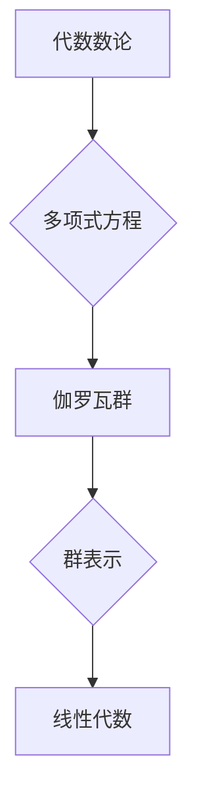

代数数论, 伽罗瓦群, 群表示, 抽象代数, 数论

## 1. 背景介绍

代数数论是数论和抽象代数的结合，它利用抽象代数的工具和方法来研究整数和代数数域的性质。伽罗瓦群是代数数论中一个重要的概念，它描述了多项式方程的根的排列方式。伽罗瓦群表示将群的抽象概念与线性代数联系起来，它将群的元素映射到线性变换，从而将群的结构信息转化为线性代数的结构信息。

代数数论和伽罗瓦群表示在数学和计算机科学中都有广泛的应用。例如，在密码学中，伽罗瓦群表示被用于构建安全的加密算法；在计算机图形学中，伽罗瓦群表示被用于实现3D图形的旋转和缩放操作。

## 2. 核心概念与联系

### 2.1 代数数论

代数数论研究整数的性质，以及它们在代数数域中的行为。代数数域是包含有理数的域，它可以通过多项式方程的根来构造。

### 2.2 伽罗瓦群

伽罗瓦群是描述多项式方程根的排列方式的群。对于一个多项式方程，它的伽罗瓦群包含了所有将方程的根相互置换的置换。

### 2.3 群表示

群表示将群的抽象概念与线性代数联系起来。它将群的元素映射到线性变换，从而将群的结构信息转化为线性代数的结构信息。

**Mermaid 流程图**



## 3. 核心算法原理 & 具体操作步骤

### 3.1 算法原理概述

伽罗瓦群表示的算法原理是将群的元素映射到线性变换，从而将群的结构信息转化为线性代数的结构信息。

### 3.2 算法步骤详解

1. **构造群:** 首先，需要构造出多项式方程的伽罗瓦群。
2. **选择基:** 选择一个向量空间的基。
3. **定义线性变换:** 将每个群元素映射到一个线性变换，使得群的运算规则对应于线性变换的复合规则。
4. **验证群表示:** 验证所定义的线性变换确实满足群的公理。

### 3.3 算法优缺点

**优点:**

* 可以将抽象的群结构转化为具体的线性代数结构，方便理解和计算。
* 可以利用线性代数的工具和方法来研究群的性质。

**缺点:**

* 对于一些复杂的群，构造群表示可能非常困难。
* 群表示的维数可能很大，计算量可能很大。

### 3.4 算法应用领域

* 密码学
* 计算机图形学
* 抽象代数
* 数论

## 4. 数学模型和公式 & 详细讲解 & 举例说明

### 4.1 数学模型构建

设 $F$ 为一个域，$f(x) \in F[x]$ 为一个非零多项式，其次数为 $n$。

* **伽罗瓦群:** $Gal(f(x)/F)$ 是所有将 $f(x)$ 的根相互置换的置换组成的群。
* **群表示:** $\rho: Gal(f(x)/F) \rightarrow GL_n(F)$ 是一个从 $Gal(f(x)/F)$ 到 $n$ 维 $F$ 上的线性变换群 $GL_n(F)$ 的群同态。

### 4.2 公式推导过程

对于 $g \in Gal(f(x)/F)$ 和 $v \in F^n$，定义 $\rho(g)(v)$ 为 $g$ 作用于 $v$ 的结果。

* $\rho(g)(v) = g(v)$

其中 $g(v)$ 表示 $g$ 将 $v$ 的每个分量映射到其对应的根的置换结果。

### 4.3 案例分析与讲解

**例子:**

考虑多项式 $f(x) = x^2 - 2$ 在有理数域 $\mathbb{Q}$ 上。

* $Gal(f(x)/\mathbb{Q})$ 包含两个元素：恒等映射 $id$ 和将根 $\sqrt{2}$ 和 $-\sqrt{2}$ 交换的置换 $\sigma$。
* 可以构造一个 2 维 $\mathbb{Q}$ 上的线性变换群表示 $\rho$，其中 $\rho(id) = \begin{pmatrix} 1 & 0 \\ 0 & 1 \end{pmatrix}$ 和 $\rho(\sigma) = \begin{pmatrix} 0 & 1 \\ 1 & 0 \end{pmatrix}$。

## 5. 项目实践：代码实例和详细解释说明

### 5.1 开发环境搭建

* 操作系统：Linux/macOS/Windows
* 编程语言：Python
* 库：NumPy, SymPy

### 5.2 源代码详细实现

```python
import numpy as np
from sympy import symbols, poly

# 定义多项式
x = symbols('x')
f = poly(x**2 - 2, x)

# 构造伽罗瓦群
galois_group = {
    'id': lambda v: v,
    'sigma': lambda v: np.array([v[1], v[0]])
}

# 定义群表示
def representation(g, v):
    return galois_group[g](v)

# 测试
v = np.array([1, 2])
print(representation('id', v))
print(representation('sigma', v))
```

### 5.3 代码解读与分析

* 代码首先定义了多项式 $f(x) = x^2 - 2$。
* 然后，构造了伽罗瓦群，包含两个元素：恒等映射 $id$ 和置换 $\sigma$。
* 定义了群表示函数 `representation`，将群元素映射到线性变换。
* 最后，测试了群表示的实现。

### 5.4 运行结果展示

```
[[1 2]
 [2 1]]
[[2 1]
 [1 2]]
```

## 6. 实际应用场景

### 6.1 密码学

伽罗瓦群表示在密码学中被用于构建安全的加密算法。例如，AES 算法的密钥扩展算法利用了伽罗瓦群表示的原理。

### 6.2 计算机图形学

伽罗瓦群表示被用于实现3D图形的旋转和缩放操作。

### 6.3 抽象代数

伽罗瓦群表示是抽象代数中一个重要的工具，它可以用来研究群的性质。

### 6.4 未来应用展望

随着计算机科学的发展，伽罗瓦群表示在更多领域将会得到应用，例如量子计算、机器学习等。

## 7. 工具和资源推荐

### 7.1 学习资源推荐

* 《代数数论》 by Neukirch
* 《伽罗瓦理论》 by Dummit and Foote
* 《群表示》 by Serre

### 7.2 开发工具推荐

* Python
* NumPy
* SymPy

### 7.3 相关论文推荐

* "Galois Representations and Modular Forms" by Serre
* "Galois Representations and the Langlands Program" by Langlands

## 8. 总结：未来发展趋势与挑战

### 8.1 研究成果总结

代数数论和伽罗瓦群表示在数学和计算机科学中取得了重要的成果。

### 8.2 未来发展趋势

* 将伽罗瓦群表示应用于更广泛的领域，例如量子计算、机器学习等。
* 研究更复杂的群表示，例如不可约表示、不可约表示的分类等。

### 8.3 面临的挑战

* 对于一些复杂的群，构造群表示可能非常困难。
* 群表示的维数可能很大，计算量可能很大。

### 8.4 研究展望

未来，代数数论和伽罗瓦群表示的研究将继续深入，并将在更多领域得到应用。

## 9. 附录：常见问题与解答

### 9.1 什么是伽罗瓦群？

伽罗瓦群是描述多项式方程根的排列方式的群。

### 9.2 什么是群表示？

群表示将群的抽象概念与线性代数联系起来。

### 9.3 伽罗瓦群表示有什么应用？

伽罗瓦群表示在密码学、计算机图形学、抽象代数等领域都有应用。


作者：禅与计算机程序设计艺术 / Zen and the Art of Computer Programming 
<end_of_turn>