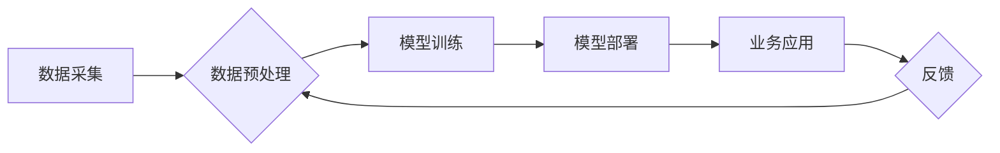

> 企业转型, 人工智能, 机器学习, 深度学习, 自然语言处理, 计算机视觉, 预测分析, 决策支持

## 1. 背景介绍

在当今数字化时代，企业面临着前所未有的挑战和机遇。传统业务模式面临着颠覆，客户需求日益复杂，市场竞争日益激烈。为了应对这些挑战，企业纷纷寻求转型升级，拥抱新技术，以实现可持续发展。人工智能（AI）作为一门新兴技术，正在迅速改变着各行各业，为企业转型提供了强大的工具和动力。

人工智能技术的快速发展，源于以下几个关键因素：

* **海量数据:**  互联网时代，数据爆炸式增长，为人工智能算法的训练提供了充足的燃料。
* **计算能力提升:**  近年来，计算芯片和云计算技术的飞速发展，为人工智能算法的训练和运行提供了强大的计算支撑。
* **算法创新:**  深度学习等人工智能算法的不断创新，使得人工智能系统能够更好地理解和处理复杂数据。

## 2. 核心概念与联系

人工智能是指模拟人类智能行为的计算机系统。它涵盖了多个子领域，例如机器学习、深度学习、自然语言处理、计算机视觉等。

**人工智能应用于企业转型，主要体现在以下几个方面:**

* **智能化运营:** 通过人工智能技术，企业可以实现自动化决策、智能预测、优化流程等，提高运营效率和降低成本。
* **个性化服务:**  人工智能可以根据用户的行为和偏好，提供个性化的产品推荐、服务建议等，提升客户体验。
* **创新产品和服务:**  人工智能可以帮助企业开发新的产品和服务，例如智能客服、智能推荐系统、智能诊断系统等。

**人工智能应用于企业转型的核心架构:**



## 3. 核心算法原理 & 具体操作步骤

### 3.1  算法原理概述

机器学习是人工智能的一个重要分支，它通过算法学习数据中的模式，从而实现预测、分类、聚类等任务。常见的机器学习算法包括：

* **线性回归:** 用于预测连续数值，例如房价、股票价格等。
* **逻辑回归:** 用于分类问题，例如判断邮件是否为垃圾邮件。
* **决策树:** 用于分类和回归问题，通过树状结构决策，实现预测。
* **支持向量机:** 用于分类问题，通过寻找最佳分割超平面，实现分类。
* **神经网络:**  模拟人脑神经网络结构，用于处理复杂数据，例如图像识别、语音识别等。

### 3.2  算法步骤详解

以线性回归为例，其算法步骤如下：

1. **数据收集和预处理:** 收集相关数据，并进行清洗、转换、特征工程等预处理操作。
2. **模型训练:** 使用训练数据，训练线性回归模型，找到最佳的模型参数。
3. **模型评估:** 使用测试数据，评估模型的性能，例如准确率、召回率等。
4. **模型部署:** 将训练好的模型部署到生产环境，用于预测新的数据。

### 3.3  算法优缺点

每个机器学习算法都有其优缺点，需要根据具体应用场景选择合适的算法。

* **线性回归:** 优点：简单易懂，计算速度快。缺点：对数据线性关系要求较高，难以处理复杂数据。
* **逻辑回归:** 优点：适用于分类问题，易于解释。缺点：对数据非线性关系处理能力有限。
* **决策树:** 优点：易于理解和解释，可以处理非线性数据。缺点：容易过拟合，对数据噪声敏感。
* **支持向量机:** 优点：对高维数据处理能力强，泛化能力好。缺点：训练时间长，参数选择复杂。
* **神经网络:** 优点：可以处理复杂数据，具有强大的学习能力。缺点：训练时间长，参数众多，易于过拟合。

### 3.4  算法应用领域

机器学习算法广泛应用于各个领域，例如：

* **金融:** 欺诈检测、信用评分、风险管理等。
* **医疗:** 疾病诊断、药物研发、患者画像等。
* **电商:** 商品推荐、用户画像、精准营销等。
* **制造:** 质量控制、设备故障预测、生产优化等。

## 4. 数学模型和公式 & 详细讲解 & 举例说明

### 4.1  数学模型构建

线性回归模型的数学模型如下：

$$
y = w_0 + w_1x_1 + w_2x_2 + ... + w_nx_n + \epsilon
$$

其中：

* $y$ 是预测值
* $w_0, w_1, w_2, ..., w_n$ 是模型参数
* $x_1, x_2, ..., x_n$ 是输入特征
* $\epsilon$ 是误差项

### 4.2  公式推导过程

线性回归模型的目标是找到最佳的模型参数，使得预测值与真实值之间的误差最小。常用的误差函数是均方误差（MSE）：

$$
MSE = \frac{1}{n} \sum_{i=1}^{n} (y_i - \hat{y}_i)^2
$$

其中：

* $n$ 是样本数量
* $y_i$ 是真实值
* $\hat{y}_i$ 是预测值

通过最小化MSE，可以得到最佳的模型参数。

### 4.3  案例分析与讲解

假设我们要预测房价，输入特征包括房屋面积、房间数量、地理位置等。我们可以使用线性回归模型，训练模型参数，然后根据新的房屋信息，预测其价格。

## 5. 项目实践：代码实例和详细解释说明

### 5.1  开发环境搭建

* Python 3.x
* scikit-learn 库

### 5.2  源代码详细实现

```python
from sklearn.linear_model import LinearRegression
from sklearn.model_selection import train_test_split
import pandas as pd

# 加载数据
data = pd.read_csv('house_price.csv')

# 划分训练集和测试集
X = data[['area', 'rooms']]
y = data['price']
X_train, X_test, y_train, y_test = train_test_split(X, y, test_size=0.2, random_state=42)

# 创建线性回归模型
model = LinearRegression()

# 训练模型
model.fit(X_train, y_train)

# 预测测试集数据
y_pred = model.predict(X_test)

# 评估模型性能
from sklearn.metrics import mean_squared_error
mse = mean_squared_error(y_test, y_pred)
print(f'Mean Squared Error: {mse}')
```

### 5.3  代码解读与分析

* 首先，加载数据并划分训练集和测试集。
* 然后，创建线性回归模型并训练模型。
* 接着，使用训练好的模型预测测试集数据。
* 最后，评估模型性能，例如使用均方误差（MSE）来衡量预测结果的准确性。

### 5.4  运行结果展示

运行代码后，会输出测试集数据的均方误差值。

## 6. 实际应用场景

### 6.1  智能客服

人工智能可以用于构建智能客服系统，自动回答客户常见问题，提高客户服务效率。例如，电商平台可以利用人工智能技术，构建智能客服机器人，帮助客户查询订单状态、退换货流程等。

### 6.2  个性化推荐

人工智能可以根据用户的行为和偏好，提供个性化的产品推荐，例如电商平台可以利用人工智能技术，推荐用户可能感兴趣的商品。

### 6.3  风险管理

金融机构可以利用人工智能技术，进行风险评估和预测，例如识别欺诈交易、评估贷款风险等。

### 6.4  未来应用展望

人工智能技术的应用场景还在不断扩展，未来将有更多新的应用场景出现，例如：

* **自动驾驶:**  人工智能可以用于开发自动驾驶汽车，提高交通安全和效率。
* **医疗诊断:**  人工智能可以辅助医生进行疾病诊断，提高诊断准确率。
* **个性化教育:**  人工智能可以根据学生的学习情况，提供个性化的学习方案。

## 7. 工具和资源推荐

### 7.1  学习资源推荐

* **在线课程:** Coursera, edX, Udacity 等平台提供丰富的机器学习和深度学习课程。
* **书籍:** 《深入理解机器学习》、《Python机器学习实战》等书籍。
* **博客和论坛:**  机器学习相关的博客和论坛，例如机器之心、AI 算法等。

### 7.2  开发工具推荐

* **Python:**  机器学习和深度学习的常用编程语言。
* **scikit-learn:**  Python机器学习库。
* **TensorFlow:**  Google开发的深度学习框架。
* **PyTorch:**  Facebook开发的深度学习框架。

### 7.3  相关论文推荐

* **《ImageNet Classification with Deep Convolutional Neural Networks》:**  AlexNet论文，标志着深度学习的兴起。
* **《Attention Is All You Need》:**  Transformer模型论文，推动了自然语言处理领域的进步。

## 8. 总结：未来发展趋势与挑战

### 8.1  研究成果总结

人工智能技术取得了长足的进步，在各个领域都取得了显著的应用成果。

### 8.2  未来发展趋势

* **模型更加强大:**  未来人工智能模型将更加强大，能够处理更加复杂的数据，并实现更加智能的决策。
* **应用场景更加广泛:**  人工智能技术的应用场景将更加广泛，渗透到生活的各个方面。
* **伦理和安全问题:**  随着人工智能技术的进步，伦理和安全问题将更加突出，需要引起重视。

### 8.3  面临的挑战

* **数据获取和隐私保护:**  人工智能算法依赖于大量数据，如何获取高质量数据，并保护用户隐私是一个挑战。
* **算法解释性和可信度:**  许多人工智能算法是黑箱模型，难以解释其决策过程，这降低了其可信度。
* **人才短缺:**  人工智能领域人才短缺是一个普遍问题，需要加强人才培养。

### 8.4  研究展望

未来人工智能研究将更加注重以下几个方面:

* **解释性人工智能:**  开发能够解释其决策过程的透明人工智能模型。
* **联邦学习:**  在不共享原始数据的情况下，实现模型训练和更新，保护用户隐私。
* **通用人工智能:**  开发能够像人类一样学习和解决各种问题的通用人工智能。

## 9. 附录：常见问题与解答

### 9.1  什么是机器学习？

机器学习是一种人工智能技术，它通过算法学习数据中的模式，从而实现预测、分类、聚类等任务。

### 9.2  什么是深度学习？

深度学习是一种机器学习的子领域，它使用多层神经网络来模拟人脑神经网络结构，能够处理更加复杂的数据。

### 9.3  如何选择合适的机器学习算法？

选择合适的机器学习算法需要根据具体应用场景和数据特点进行选择。

### 9.4  人工智能技术有哪些伦理和安全问题？

人工智能技术的应用可能会带来一些伦理和安全问题，例如算法偏见、隐私泄露、恶意攻击等。

### 9.5  如何学习人工智能技术？

可以通过在线课程、书籍、博客等方式学习人工智能技术。

作者：禅与计算机程序设计艺术 / Zen and the Art of Computer Programming


<end_of_turn>