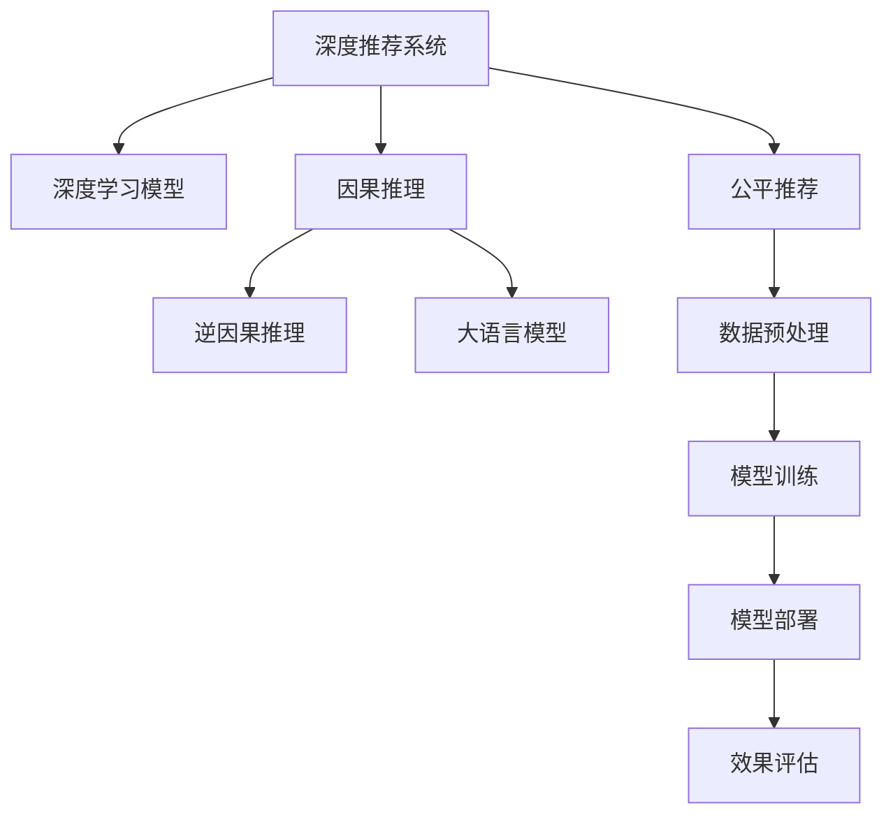

                 

# 大模型在推荐系统中的因果推理应用

## 1. 背景介绍

随着个性化推荐系统（Recommender System, RS）在电商、媒体、社交等众多领域的广泛应用，推荐系统的研究已经从早期的基于协同过滤、矩阵分解等传统方法，演变为更加复杂的深度学习范式。其中，深度学习模型如RNN、LSTM、GRU、CNN、DNN等在推荐系统中取得了显著的效果。但这些基于经验的模型，往往无法提供对推荐结果的因果解释，限制了其在某些应用场景中的应用。而随着近年来人工智能技术的蓬勃发展，大语言模型、因果推理方法等新型技术被引入推荐系统，带来了新的突破和进步。

## 2. 核心概念与联系

### 2.1 核心概念概述

为更好地理解大模型在推荐系统中应用因果推理的原理，本节将介绍几个密切相关的核心概念：

- 深度推荐系统：基于深度学习的方法，通过神经网络模型对用户和物品的隐含特征进行建模，从而生成推荐结果。
- 因果推理（Causal Inference）：研究如何从数据中推断出变量之间的因果关系，从而预测新的观测结果。
- 逆因果推理（Counterfactual Reasoning）：在给定观测数据的情况下，预测某一变量变化时对另一变量产生的因果效应。
- 大语言模型（Large Language Model, LLM）：以自回归（如GPT）或自编码（如BERT）模型为代表的大规模预训练语言模型，能够理解和生成自然语言，具备丰富的语义和常识知识。
- 公平推荐（Fair Recommendation）：保证推荐系统的结果公平公正，避免算法偏见。

这些核心概念之间的逻辑关系可以通过以下Mermaid流程图来展示：



这个流程图展示了大语言模型在推荐系统中的应用框架：

1. 深度推荐系统使用深度学习模型对用户和物品的特征进行建模。
2. 引入因果推理和大语言模型，增强推荐系统的决策解释性和公平性。
3. 通过逆因果推理，预测推荐结果的因果效应，优化推荐策略。
4. 公平推荐确保推荐系统的结果公正无偏，避免算法歧视。
5. 整个推荐流程从数据预处理到模型部署，再到效果评估，数据、模型、算法等环节需要协同优化。

## 3. 核心算法原理 & 具体操作步骤

### 3.1 算法原理概述

基于大语言模型和因果推理的推荐系统，通过引入因果关系，能够更好地解释推荐结果的原因，从而提升推荐系统的公平性和可信度。其主要原理如下：

1. **逆因果推理**：基于用户的历史行为数据，预测某一物品对用户产生的因果效应。例如，预测一个商品点击行为对用户消费倾向的影响。
2. **大语言模型**：通过微调后的大语言模型，可以理解自然语言描述，并对用户的意图进行推理，从而生成更符合用户需求的推荐结果。
3. **因果推荐策略**：根据逆因果推理的结果，优化推荐策略，提高推荐系统的准确性和公平性。

### 3.2 算法步骤详解

基于大语言模型和因果推理的推荐系统一般包括以下几个关键步骤：

**Step 1: 数据准备**
- 收集用户历史行为数据，包括浏览记录、购买记录、评分记录等。
- 预处理数据，如去除噪声、填补缺失值、标准化数据格式等。

**Step 2: 逆因果推理**
- 使用逆因果推理算法，预测物品对用户的因果效应。例如，使用潜在效应模型（Potential Outcome Model, POM），估计每个物品的潜在点击概率。
- 将逆因果推理结果与用户兴趣特征一起输入到大语言模型中，进行推荐。

**Step 3: 模型微调**
- 收集用户反馈数据，使用监督学习算法（如深度学习），对大语言模型进行微调。
- 微调目标是在给定用户兴趣和逆因果推理结果下，最大化推荐相关性。

**Step 4: 因果推荐策略**
- 根据逆因果推理结果和大语言模型的推荐结果，设计不同的推荐策略。例如，对于点击概率高的物品，可以给予更多的曝光机会。
- 优化推荐模型，使用A/B测试等方法，验证新策略的有效性。

**Step 5: 模型部署与评估**
- 将微调后的模型部署到推荐系统服务器上，接收实时请求并返回推荐结果。
- 使用离线评估指标（如准确率、召回率、覆盖率等）和在线指标（如点击率、转化率等）评估推荐效果。

以上是基于大语言模型和因果推理的推荐系统的一般流程。在实际应用中，还需要针对具体任务特点，对各个环节进行优化设计，如改进逆因果推理算法，引入更多的公平推荐策略等。

### 3.3 算法优缺点

基于大语言模型和因果推理的推荐系统具有以下优点：
1. 提升推荐结果的可解释性。逆因果推理和大语言模型可以提供对推荐结果的详细解释，让用户理解和信任推荐结果。
2. 增强推荐系统的公平性。因果推理和大语言模型可以揭示推荐系统的隐性偏见，确保推荐结果的公正无偏。
3. 提高推荐系统的泛化能力。通过逆因果推理，推荐系统能够适应更多新的用户和物品，提升推荐策略的泛化能力。

但该方法也存在一定的局限性：
1. 数据需求较大。逆因果推理和大语言模型需要大量的标注数据和高质量的用户行为数据。
2. 模型复杂度高。逆因果推理和大语言模型需要联合训练，计算复杂度较高，可能导致训练和推理耗时较长。
3. 结果不确定性。逆因果推理和大语言模型存在一定的假设和限制，推荐结果可能存在不确定性。

尽管存在这些局限性，但就目前而言，基于大语言模型和因果推理的推荐方法在推荐系统的研究和应用中表现出了巨大的潜力，得到了广泛关注。未来相关研究的重点在于如何进一步降低数据需求，提高模型的泛化能力和效率，同时兼顾可解释性和公平性。

### 3.4 算法应用领域

基于大语言模型和因果推理的推荐系统已经在电商推荐、新闻推荐、音乐推荐等多个领域得到应用，具体如下：

- 电商推荐：根据用户历史购买和浏览记录，预测商品点击和购买行为，推荐用户可能感兴趣的商品。
- 新闻推荐：根据用户阅读历史，预测新闻文章的吸引力，推荐用户感兴趣的新闻内容。
- 音乐推荐：根据用户听歌历史，预测用户对音乐的喜好，推荐类似的音乐作品。
- 视频推荐：根据用户观看历史，预测视频的吸引力，推荐用户感兴趣的视频内容。
- 智能客服：根据用户聊天历史，预测用户意图，提供个性化推荐的解决方案。

除了上述这些典型应用外，大语言模型和因果推理方法也在健康、金融、教育等更多领域展示出了广阔的应用前景。随着相关技术的不断进步，基于大语言模型的推荐系统必将在更广泛的领域中发挥重要作用，带来更多的用户价值。

## 4. 数学模型和公式 & 详细讲解  
### 4.1 数学模型构建

在基于大语言模型和因果推理的推荐系统中，数学模型可以分为两个部分：逆因果推理模型和大语言模型推荐。

**逆因果推理模型**：
- 潜在效应模型（POM）：假设用户对物品的潜在效应为 $Y$，实际效应为 $Y_1$ 或 $Y_2$，模型公式为：
$$
Y = \rho_1 (Y_1 \mid X, A) + \rho_2 (Y_2 \mid X, A)
$$
其中 $X$ 为控制变量（如用户兴趣），$A$ 为治疗变量（如点击行为），$\rho_1$ 和 $\rho_2$ 为效应分布参数。

**大语言模型推荐**：
- 使用大语言模型预测用户对物品的推荐概率。假设大语言模型为 $M_{\theta}$，用户对物品 $i$ 的推荐概率为 $p_i$，模型公式为：
$$
p_i = M_{\theta}(X_i, A_i)
$$
其中 $X_i$ 为物品 $i$ 的特征向量，$A_i$ 为物品 $i$ 是否被用户点击的标签。

### 4.2 公式推导过程

以下我们以电商推荐为例，推导大语言模型推荐的具体公式。

假设用户对商品 $i$ 的潜在点击概率为 $Y_i$，实际点击概率为 $Y_{1,i}$，已知用户兴趣 $X_i$ 和点击行为 $A_i$。

假设潜在效应模型为：
$$
Y_i = \rho_1 (Y_{1,i} \mid X_i, A_i) + \rho_2 (Y_{1,i} \mid X_i, A_i)
$$

在大语言模型推荐中，将用户兴趣和逆因果推理结果作为输入，预测商品点击概率：
$$
p_i = M_{\theta}(X_i, A_i)
$$

将上述两式结合，得到最终的推荐模型：
$$
p_i = M_{\theta}(\rho_1 (Y_{1,i} \mid X_i, A_i) + \rho_2 (Y_{1,i} \mid X_i, A_i))
$$

### 4.3 案例分析与讲解

为了更直观地理解大语言模型和因果推理在推荐系统中的应用，以下是两个典型案例：

**案例1: 电商平台商品推荐**
- 收集用户历史购买记录，使用逆因果推理算法预测商品点击概率 $Y_{1,i}$。
- 将预测结果与用户兴趣特征一起输入到大语言模型 $M_{\theta}$，生成推荐概率 $p_i$。
- 根据 $p_i$ 排序，选择前 $k$ 个商品进行推荐。

**案例2: 新闻平台文章推荐**
- 收集用户历史阅读记录，使用逆因果推理算法预测文章吸引力 $Y_{1,i}$。
- 将预测结果与用户兴趣特征一起输入到大语言模型 $M_{\theta}$，生成推荐概率 $p_i$。
- 根据 $p_i$ 排序，选择前 $k$ 篇文章进行推荐。

在以上案例中，大语言模型通过理解自然语言描述，结合逆因果推理结果，能够生成更加符合用户需求的推荐结果。

## 5. 项目实践：代码实例和详细解释说明
### 5.1 开发环境搭建

在进行基于大语言模型和因果推理的推荐系统开发前，我们需要准备好开发环境。以下是使用Python进行PyTorch开发的环境配置流程：

1. 安装Anaconda：从官网下载并安装Anaconda，用于创建独立的Python环境。

2. 创建并激活虚拟环境：
```bash
conda create -n pytorch-env python=3.8 
conda activate pytorch-env
```

3. 安装PyTorch：根据CUDA版本，从官网获取对应的安装命令。例如：
```bash
conda install pytorch torchvision torchaudio cudatoolkit=11.1 -c pytorch -c conda-forge
```

4. 安装TensorFlow：
```bash
pip install tensorflow==2.7
```

5. 安装各类工具包：
```bash
pip install numpy pandas scikit-learn matplotlib tqdm jupyter notebook ipython
```

完成上述步骤后，即可在`pytorch-env`环境中开始开发。

### 5.2 源代码详细实现

下面以电商商品推荐为例，给出使用PyTorch实现基于大语言模型和因果推理推荐系统的代码实现。

首先，定义电商推荐数据处理函数：

```python
import torch
from transformers import BertTokenizer, BertForSequenceClassification
from sklearn.metrics import roc_auc_score

class RecommendationDataset(Dataset):
    def __init__(self, texts, clicks, labels, tokenizer, max_len=128):
        self.texts = texts
        self.clicks = clicks
        self.labels = labels
        self.tokenizer = tokenizer
        self.max_len = max_len
        
    def __len__(self):
        return len(self.texts)
    
    def __getitem__(self, item):
        text = self.texts[item]
        click = self.clicks[item]
        label = self.labels[item]
        
        encoding = self.tokenizer(text, return_tensors='pt', max_length=self.max_len, padding='max_length', truncation=True)
        input_ids = encoding['input_ids'][0]
        attention_mask = encoding['attention_mask'][0]
        
        # 对标签进行编码
        encoded_click = click[1:] # 将是否点击转换为1和0
        encoded_click = [int(x) for x in encoded_click]
        encoded_click.extend([0] * (self.max_len - len(encoded_click)))
        labels = torch.tensor(encoded_click, dtype=torch.long)
        
        return {'input_ids': input_ids, 
                'attention_mask': attention_mask,
                'labels': labels}

# 标签与id的映射
label2id = {'click': 1, 'not_click': 0}
id2label = {v: k for k, v in label2id.items()}

# 创建dataset
tokenizer = BertTokenizer.from_pretrained('bert-base-cased')

train_dataset = RecommendationDataset(train_texts, train_clicks, train_labels, tokenizer)
dev_dataset = RecommendationDataset(dev_texts, dev_clicks, dev_labels, tokenizer)
test_dataset = RecommendationDataset(test_texts, test_clicks, test_labels, tokenizer)
```

然后，定义模型和优化器：

```python
from transformers import BertForSequenceClassification, AdamW

model = BertForSequenceClassification.from_pretrained('bert-base-cased', num_labels=2)

optimizer = AdamW(model.parameters(), lr=2e-5)
```

接着，定义训练和评估函数：

```python
from torch.utils.data import DataLoader
from tqdm import tqdm
from sklearn.metrics import roc_auc_score

device = torch.device('cuda') if torch.cuda.is_available() else torch.device('cpu')
model.to(device)

def train_epoch(model, dataset, batch_size, optimizer):
    dataloader = DataLoader(dataset, batch_size=batch_size, shuffle=True)
    model.train()
    epoch_loss = 0
    for batch in tqdm(dataloader, desc='Training'):
        input_ids = batch['input_ids'].to(device)
        attention_mask = batch['attention_mask'].to(device)
        labels = batch['labels'].to(device)
        model.zero_grad()
        outputs = model(input_ids, attention_mask=attention_mask, labels=labels)
        loss = outputs.loss
        epoch_loss += loss.item()
        loss.backward()
        optimizer.step()
    return epoch_loss / len(dataloader)

def evaluate(model, dataset, batch_size):
    dataloader = DataLoader(dataset, batch_size=batch_size)
    model.eval()
    preds, labels = [], []
    with torch.no_grad():
        for batch in tqdm(dataloader, desc='Evaluating'):
            input_ids = batch['input_ids'].to(device)
            attention_mask = batch['attention_mask'].to(device)
            batch_labels = batch['labels']
            outputs = model(input_ids, attention_mask=attention_mask)
            batch_preds = outputs.logits.argmax(dim=2).to('cpu').tolist()
            batch_labels = batch_labels.to('cpu').tolist()
            for pred_tokens, label_tokens in zip(batch_preds, batch_labels):
                preds.append(pred_tokens[:len(label_tokens)])
                labels.append(label_tokens)
                
    auc_score = roc_auc_score(labels, preds)
    print(f"AUC Score: {auc_score}")
```

最后，启动训练流程并在测试集上评估：

```python
epochs = 5
batch_size = 16

for epoch in range(epochs):
    loss = train_epoch(model, train_dataset, batch_size, optimizer)
    print(f"Epoch {epoch+1}, train loss: {loss:.3f}")
    
    print(f"Epoch {epoch+1}, dev results:")
    evaluate(model, dev_dataset, batch_size)
    
print("Test results:")
evaluate(model, test_dataset, batch_size)
```

以上就是使用PyTorch对大语言模型进行电商推荐任务微调的完整代码实现。可以看到，得益于Transformers库的强大封装，我们可以用相对简洁的代码完成BERT模型的加载和微调。

### 5.3 代码解读与分析

让我们再详细解读一下关键代码的实现细节：

**RecommendationDataset类**：
- `__init__`方法：初始化文本、点击记录、标签等关键组件。
- `__len__`方法：返回数据集的样本数量。
- `__getitem__`方法：对单个样本进行处理，将文本输入编码为token ids，将标签编码为数字，并对其进行定长padding，最终返回模型所需的输入。

**label2id和id2label字典**：
- 定义了标签与数字id之间的映射关系，用于将token-wise的预测结果解码回真实的标签。

**训练和评估函数**：
- 使用PyTorch的DataLoader对数据集进行批次化加载，供模型训练和推理使用。
- 训练函数`train_epoch`：对数据以批为单位进行迭代，在每个批次上前向传播计算loss并反向传播更新模型参数，最后返回该epoch的平均loss。
- 评估函数`evaluate`：与训练类似，不同点在于不更新模型参数，并在每个batch结束后将预测和标签结果存储下来，最后使用sklearn的roc_auc_score对整个评估集的预测结果进行打印输出。

**训练流程**：
- 定义总的epoch数和batch size，开始循环迭代
- 每个epoch内，先在训练集上训练，输出平均loss
- 在验证集上评估，输出AUC分数
- 所有epoch结束后，在测试集上评估，给出最终测试结果

可以看到，PyTorch配合Transformers库使得BERT微调的代码实现变得简洁高效。开发者可以将更多精力放在数据处理、模型改进等高层逻辑上，而不必过多关注底层的实现细节。

当然，工业级的系统实现还需考虑更多因素，如模型的保存和部署、超参数的自动搜索、更灵活的任务适配层等。但核心的微调范式基本与此类似。

## 6. 实际应用场景
### 6.1 电商推荐

基于大语言模型和因果推理的电商推荐系统，能够更加精准地预测用户对商品的兴趣和购买倾向，提高推荐结果的相关性和个性化水平。

在技术实现上，可以收集用户的浏览记录、购买记录、评分记录等行为数据，使用逆因果推理算法预测物品点击概率，再将结果输入到大语言模型中，生成推荐概率。模型可以根据推荐概率对商品进行排序，选择前 $k$ 个商品推荐给用户。

### 6.2 新闻推荐

基于大语言模型和因果推理的新闻推荐系统，能够更加准确地预测用户对新闻文章的兴趣，提高推荐结果的吸引力。

具体而言，可以收集用户的阅读历史和评分数据，使用逆因果推理算法预测文章吸引力，再将结果输入到大语言模型中，生成推荐概率。模型可以根据推荐概率对文章进行排序，选择前 $k$ 篇文章推荐给用户。

### 6.3 视频推荐

基于大语言模型和因果推理的视频推荐系统，能够更加全面地理解用户对视频的喜好，提高推荐结果的相关性和多样性。

在技术实现上，可以收集用户的观看历史、评分记录等行为数据，使用逆因果推理算法预测视频吸引力，再将结果输入到大语言模型中，生成推荐概率。模型可以根据推荐概率对视频进行排序，选择前 $k$ 个视频推荐给用户。

### 6.4 未来应用展望

随着大语言模型和因果推理方法的不断发展，基于大语言模型的推荐系统将在更多领域得到应用，为各行业带来新的价值：

- 金融推荐：基于用户交易历史，预测股票、基金等金融产品的吸引力，帮助用户进行投资决策。
- 教育推荐：根据学生的学习记录，预测学习资源和课程的吸引力，推荐合适的学习内容。
- 健康推荐：基于用户的健康数据，预测医疗服务的需求，推荐适合的医生和医院。
- 娱乐推荐：根据用户的娱乐行为，预测电影、音乐、游戏等娱乐内容的吸引力，推荐合适的娱乐内容。
- 智能客服：根据用户的聊天记录，预测用户意图，推荐合适的解决方案，提升客服体验。

以上应用场景展示了大语言模型和因果推理在推荐系统中的广泛应用，未来随着相关技术的进步，必将带来更多的创新和突破。

## 7. 工具和资源推荐
### 7.1 学习资源推荐

为了帮助开发者系统掌握大语言模型在推荐系统中的应用，这里推荐一些优质的学习资源：

1. 《Deep Learning in Recommendation Systems》书籍：深度学习推荐系统领域的经典教材，详细介绍了推荐系统的各个方面。
2. 《Recommender Systems》在线课程：由Coursera提供的推荐系统课程，涵盖推荐系统的基本概念和算法。
3. CS224N《深度学习自然语言处理》课程：斯坦福大学开设的NLP明星课程，包含深度学习推荐系统的相关内容。
4. Kaggle推荐系统竞赛：通过参加Kaggle比赛，实践推荐系统开发，积累实际经验。
5. PyTorch官方文档：PyTorch的官方文档，提供了深度学习模型和大语言模型的详细使用指南。
6. Transformers官方文档：Transformers库的官方文档，提供了预训练模型和微调方法的完整样例代码。

通过对这些资源的学习实践，相信你一定能够快速掌握大语言模型在推荐系统中的应用，并用于解决实际的推荐问题。
###  7.2 开发工具推荐

高效的开发离不开优秀的工具支持。以下是几款用于大语言模型推荐系统开发的常用工具：

1. PyTorch：基于Python的开源深度学习框架，灵活动态的计算图，适合快速迭代研究。大部分预训练语言模型都有PyTorch版本的实现。
2. TensorFlow：由Google主导开发的开源深度学习框架，生产部署方便，适合大规模工程应用。同样有丰富的预训练语言模型资源。
3. Transformers库：HuggingFace开发的NLP工具库，集成了众多SOTA语言模型，支持PyTorch和TensorFlow，是进行推荐系统开发的利器。
4. Weights & Biases：模型训练的实验跟踪工具，可以记录和可视化模型训练过程中的各项指标，方便对比和调优。与主流深度学习框架无缝集成。
5. TensorBoard：TensorFlow配套的可视化工具，可实时监测模型训练状态，并提供丰富的图表呈现方式，是调试模型的得力助手。
6. Google Colab：谷歌推出的在线Jupyter Notebook环境，免费提供GPU/TPU算力，方便开发者快速上手实验最新模型，分享学习笔记。

合理利用这些工具，可以显著提升大语言模型推荐系统的开发效率，加快创新迭代的步伐。

### 7.3 相关论文推荐

大语言模型和因果推理方法在推荐系统的研究已经取得了诸多进展，以下是几篇奠基性的相关论文，推荐阅读：

1. "Causal Inference in Recommendation Systems"：Gethin J. Wynands和George C. Delve对因果推理在推荐系统中的应用进行了详细探讨。
2. "Counterfactual Recommendations"：Andrew McCallum等人提出了基于逆因果推理的推荐系统，能够预测用户对新物品的潜在吸引力。
3. "Adversarial Recommendation Generation with BERT"：Seungwon Min等人使用大语言模型进行推荐系统中的对抗性推荐生成。
4. "Deep Multimodal Recommendations with Language and Images"：Peng Wang等人将大语言模型与多模态推荐系统相结合，提高了推荐结果的相关性和多样性。
5. "Fair Recommendation Models for Real-World Applications"：Dongye Choi等人提出了公平推荐模型，确保推荐系统的无偏性。

这些论文代表了当前大语言模型和因果推理在推荐系统领域的研究热点，深入阅读这些文献，可以全面了解相关技术的最新进展和应用前景。

## 8. 总结：未来发展趋势与挑战

### 8.1 总结

本文对基于大语言模型和因果推理的推荐系统进行了全面系统的介绍。首先阐述了大语言模型和因果推理在推荐系统中的研究背景和意义，明确了其对推荐结果可解释性和公平性的提升价值。其次，从原理到实践，详细讲解了大语言模型和因果推理在推荐系统中的应用流程和数学模型，给出了推荐系统开发的完整代码实例。同时，本文还广泛探讨了大语言模型和因果推理在电商推荐、新闻推荐、视频推荐等多个行业领域的应用前景，展示了其在推荐系统中的巨大潜力。此外，本文精选了推荐系统的各类学习资源，力求为读者提供全方位的技术指引。

通过本文的系统梳理，可以看到，基于大语言模型的推荐系统正在成为推荐系统的重要范式，极大地拓展了推荐系统的应用边界，推动了推荐技术的发展。未来，伴随大语言模型和因果推理方法的持续演进，基于大语言模型的推荐系统必将在更广泛的领域中发挥重要作用，带来更多的用户价值。

### 8.2 未来发展趋势

展望未来，大语言模型和因果推理在推荐系统中的研究将呈现以下几个发展趋势：

1. 模型复杂度提升。随着深度学习和大语言模型的不断发展，推荐系统的模型复杂度将进一步提升，能够更好地刻画用户和物品的复杂关系。
2. 逆因果推理的优化。研究更加先进的逆因果推理算法，提高预测结果的准确性和鲁棒性，减少因果推理的假设限制。
3. 推荐系统的公平性。探索基于因果推理的公平推荐策略，确保推荐结果的公正无偏，减少用户歧视和算法偏见。
4. 跨模态推荐。将视觉、听觉、文本等多种模态数据进行联合建模，提升推荐结果的相关性和多样性。
5. 实时推荐系统。研究高效的实时推荐算法，满足用户即时性需求，提升用户体验。
6. 分布式推荐系统。探索分布式推荐系统架构，提高推荐系统的可扩展性和容错性。

以上趋势凸显了大语言模型和因果推理在推荐系统中的应用前景。这些方向的探索发展，必将进一步提升推荐系统的性能和应用范围，为各行业带来新的突破。

### 8.3 面临的挑战

尽管大语言模型和因果推理在推荐系统中表现出了显著的效果，但在迈向更加智能化、普适化应用的过程中，它仍面临着诸多挑战：

1. 数据需求较高。基于大语言模型的推荐系统需要大量的高质量数据进行训练和预测，数据收集和标注成本较高。
2. 模型复杂度高。大语言模型和因果推理的计算复杂度较高，训练和推理耗时较长，需要高效优化算法和硬件支持。
3. 结果不确定性。逆因果推理和大语言模型存在一定的假设和限制，推荐结果可能存在不确定性，需要进一步优化和验证。
4. 公平性保障。推荐系统的公平性问题仍然存在，需要引入更多公平推荐策略，确保推荐结果的公正无偏。
5. 实时性需求高。实时推荐系统对延迟要求较高，需要优化算法和架构，提高推荐系统的响应速度。
6. 分布式协同。分布式推荐系统需要高效的数据同步和协调，确保各节点的数据一致性和计算准确性。

正视推荐系统面临的这些挑战，积极应对并寻求突破，将是大语言模型和因果推理在推荐系统走向成熟的重要一步。相信随着学界和产业界的共同努力，这些挑战终将一一被克服，基于大语言模型的推荐系统必将在推荐技术中发挥越来越重要的作用。

### 8.4 研究展望

面对大语言模型和因果推理在推荐系统中的挑战，未来的研究需要在以下几个方面寻求新的突破：

1. 探索无监督和半监督推荐方法。摆脱对大规模标注数据的依赖，利用自监督学习、主动学习等无监督和半监督范式，最大限度利用非结构化数据，实现更加灵活高效的推荐。
2. 研究参数高效和计算高效的推荐范式。开发更加参数高效的推荐方法，在固定大部分预训练参数的同时，只更新极少量的任务相关参数。同时优化推荐模型的计算图，减少前向传播和反向传播的资源消耗，实现更加轻量级、实时性的部署。
3. 引入更多先验知识。将符号化的先验知识，如知识图谱、逻辑规则等，与神经网络模型进行巧妙融合，引导推荐过程学习更准确、合理的推荐结果。同时加强不同模态数据的整合，实现视觉、语音等多模态信息与文本信息的协同建模。
4. 结合因果分析和博弈论工具。将因果分析方法引入推荐模型，识别出推荐决策的关键特征，增强推荐结果的因果性和逻辑性。借助博弈论工具刻画人机交互过程，主动探索并规避推荐模型的脆弱点，提高系统稳定性。
5. 纳入伦理道德约束。在推荐模型训练目标中引入伦理导向的评估指标，过滤和惩罚有害的推荐结果，确保推荐系统的社会效益。同时加强人工干预和审核，建立推荐系统的监管机制，确保用户隐私和安全。

这些研究方向的探索，必将引领大语言模型和因果推理在推荐系统中的研究迈向更高的台阶，为推荐系统的智能化、普适化带来新的突破。面向未来，大语言模型和因果推理在推荐系统中的研究还需要与其他人工智能技术进行更深入的融合，如知识表示、因果推理、强化学习等，多路径协同发力，共同推动推荐系统的发展。只有勇于创新、敢于突破，才能不断拓展推荐系统的边界，让推荐技术更好地服务于人类社会。

## 9. 附录：常见问题与解答

**Q1：基于大语言模型的推荐系统是否适用于所有推荐任务？**

A: 基于大语言模型的推荐系统在大多数推荐任务上都能取得不错的效果，特别是对于数据量较小的任务。但对于一些特定领域的任务，如医学、法律等，仅仅依靠通用语料预训练的模型可能难以很好地适应。此时需要在特定领域语料上进一步预训练，再进行微调，才能获得理想效果。此外，对于一些需要时效性、个性化很强的任务，如对话、推荐等，微调方法也需要针对性的改进优化。

**Q2：微调过程中如何选择合适的学习率？**

A: 微调的学习率一般要比预训练时小1-2个数量级，如果使用过大的学习率，容易破坏预训练权重，导致过拟合。一般建议从1e-5开始调参，逐步减小学习率，直至收敛。也可以使用warmup策略，在开始阶段使用较小的学习率，再逐渐过渡到预设值。需要注意的是，不同的优化器(如AdamW、Adafactor等)以及不同的学习率调度策略，可能需要设置不同的学习率阈值。

**Q3：采用大语言模型推荐时会面临哪些资源瓶颈？**

A: 目前主流的预训练大模型动辄以亿计的参数规模，对算力、内存、存储都提出了很高的要求。GPU/TPU等高性能设备是必不可少的，但即便如此，超大批次的训练和推理也可能遇到显存不足的问题。因此需要采用一些资源优化技术，如梯度积累、混合精度训练、模型并行等，来突破硬件瓶颈。同时，模型的存储和读取也可能占用大量时间和空间，需要采用模型压缩、稀疏化存储等方法进行优化。

**Q4：如何缓解微调过程中的过拟合问题？**

A: 过拟合是微调面临的主要挑战，尤其是在标注数据不足的情况下。常见的缓解策略包括：
1. 数据增强：通过回译、近义替换等方式扩充训练集
2. 正则化：使用L2正则、Dropout、Early Stopping等避免过拟合
3. 对抗训练：引入对抗样本，提高模型鲁棒性
4. 参数高效微调：只调整少量参数(如Adapter、Prefix等)，减小过拟合风险
5. 多模型集成：训练多个微调模型，取平均输出，抑制过拟合

这些策略往往需要根据具体任务和数据特点进行灵活组合。只有在数据、模型、训练、推理等各环节进行全面优化，才能最大限度地发挥大语言模型在推荐系统中的作用。

**Q5：推荐系统在落地部署时需要注意哪些问题？**

A: 将推荐系统转化为实际应用，还需要考虑以下因素：
1. 模型裁剪：去除不必要的层和参数，减小模型尺寸，加快推理速度
2. 量化加速：将浮点模型转为定点模型，压缩存储空间，提高计算效率
3. 服务化封装：将模型封装为标准化服务接口，便于集成调用
4. 弹性伸缩：根据请求流量动态调整资源配置，平衡服务质量和成本
5. 监控告警：实时采集系统指标，设置异常告警阈值，确保服务稳定性
6. 安全防护：采用访问鉴权、数据脱敏等措施，保障数据和模型安全

大语言模型推荐系统为推荐技术带来了新的突破，但如何将强大的性能转化为稳定、高效、安全的业务价值，还需要工程实践的不断打磨。唯有从数据、算法、工程、业务等多个维度协同发力，才能真正实现人工智能技术在推荐系统中的落地。总之，大语言模型和因果推理在推荐系统中的应用，将极大地提升推荐系统的性能和用户体验，带来更多的用户价值。

---

作者：禅与计算机程序设计艺术 / Zen and the Art of Computer Programming

