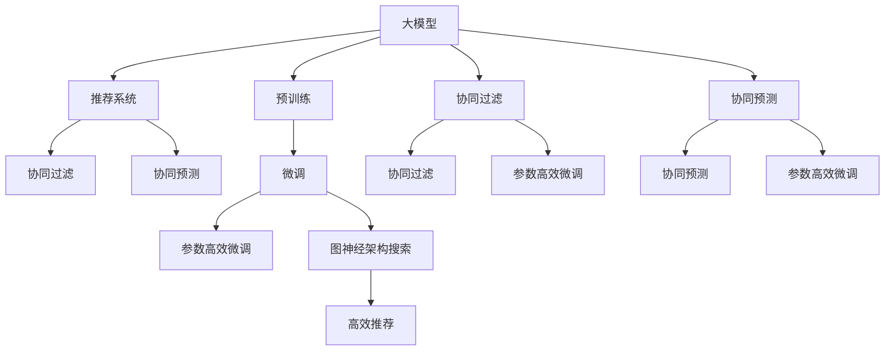

                 

# 大模型在推荐系统中的图神经架构搜索应用

## 1. 背景介绍

随着互联网的快速发展，推荐系统已逐渐成为电子商务、社交媒体、内容提供商等平台的核心组成部分，其目的是帮助用户在海量数据中找到最感兴趣的个性化内容。当前推荐系统主要依赖于基于矩阵分解的协同过滤方法和深度学习模型的协同预测方法，但这些方法均存在一定的局限性。协同过滤方法主要依赖于用户和物品的历史行为数据，在冷启动、长尾物品、数据稀疏等问题上表现较差；而深度学习模型虽然能够处理大量非结构化数据，但在模型复杂度、训练数据量、计算资源消耗等方面存在较大挑战。

为了应对这些挑战，近年来，基于大模型的推荐系统逐渐成为研究热点。大模型通过大规模语料和丰富的语言知识，能够自动学习到用户行为和物品属性之间的关系，显著提升推荐系统的效果和效率。然而，大模型推荐系统的关键问题是如何高效、鲁棒地构建大模型，以充分发挥其在推荐系统中的潜力。为此，图神经架构搜索方法应运而生。图神经架构搜索是一种基于图模型自动构建新架构的方法，可以高效地生成适用于特定问题的模型架构，从而提升大模型在推荐系统中的表现。

## 2. 核心概念与联系

### 2.1 核心概念概述

为更好地理解基于图神经架构搜索的大模型推荐系统，本节将介绍几个密切相关的核心概念：

- 大模型：以BERT、GPT等深度学习模型为代表的大规模预训练语言模型。通过在大规模无标签文本语料上进行预训练，学习通用的语言表示，具备强大的语言理解和生成能力。

- 推荐系统：通过分析用户历史行为和物品属性，预测用户可能感兴趣的物品，从而提升用户体验的系统。推荐系统分为基于矩阵分解的协同过滤和基于深度学习的协同预测两类。

- 图神经架构搜索：基于图模型对模型架构进行自动搜索和优化的技术。通过模拟进化过程，生成新模型架构，并评估其性能，最终选择最优架构进行训练。

- 参数高效微调：指在微调过程中，只更新少量的模型参数，而固定大部分预训练权重不变，以提高微调效率，避免过拟合的方法。

- 神经架构搜索(NAS)：通过搜索算法寻找最优神经网络架构的技术。与传统固定模型架构不同，NAS能够动态生成适应具体问题的模型架构，提高模型的泛化能力和性能。

- 协同过滤：基于用户和物品的协同行为进行推荐的方法，通过用户-物品矩阵的分解实现。适用于用户行为数据丰富的场景，但对新用户和新物品表现较差。

- 协同预测：基于深度学习模型进行用户兴趣预测，通过学习用户和物品的隐含表示，实现推荐。在处理非结构化数据方面具有优势，但需要大量标注数据和计算资源。

这些核心概念之间的逻辑关系可以通过以下Mermaid流程图来展示：



这个流程图展示了大模型、推荐系统、协同过滤、协同预测、微调、参数高效微调、图神经架构搜索等核心概念及其之间的关系：

1. 大模型通过预训练获得基础能力。
2. 推荐系统利用大模型进行用户兴趣预测和物品推荐。
3. 协同过滤和协同预测是推荐系统的两种主要方法。
4. 微调和大模型的参数高效微调用于提升推荐模型性能。
5. 图神经架构搜索自动生成高效推荐模型架构。

这些概念共同构成了大模型推荐系统的核心技术框架，使其能够在推荐任务中发挥强大的性能。通过理解这些核心概念，我们可以更好地把握大模型推荐系统的技术原理和优化方向。

## 3. 核心算法原理 & 具体操作步骤

### 3.1 算法原理概述

基于图神经架构搜索的大模型推荐系统，主要利用图模型对大模型架构进行自动搜索和优化，以生成高效、鲁棒的推荐模型。其核心思想是：将推荐任务建模为一个图结构，通过模拟进化过程，生成新的架构，并评估其在推荐任务上的性能。该方法通过进化算法和神经网络模型结合起来，高效地生成并优化推荐系统架构，提升模型的泛化能力和性能。

### 3.2 算法步骤详解

基于图神经架构搜索的大模型推荐系统一般包括以下几个关键步骤：

**Step 1: 构建图结构**
- 将推荐系统任务建模为一个图结构，其中节点表示用户、物品等实体，边表示实体之间的关系。
- 对图结构进行分层，将复杂的推荐任务拆分成多个子任务，每个子任务对应一个网络层。

**Step 2: 生成初始架构**
- 使用进化算法生成一组初始架构，如遗传算法、粒子群算法等。
- 对每个初始架构进行评估，选择性能较好的架构进行下一轮搜索。

**Step 3: 网络层搜索**
- 在每层网络中使用神经网络架构搜索算法生成多个子网络，如NASNet、GeneticNAS等。
- 对每个子网络进行评估，选择性能最好的子网络进行组合，生成新的网络层。

**Step 4: 整体优化**
- 将多个网络层组合成一个完整的推荐模型。
- 使用梯度下降等优化算法对模型进行微调，提高其性能。

**Step 5: 评估和选择**
- 在验证集上评估模型的性能。
- 选择性能最好的模型进行测试集上的最终评估。
- 输出最优的推荐模型架构和参数。

以上是基于图神经架构搜索的大模型推荐系统的通用流程。在实际应用中，还需要针对具体任务的特点，对各个环节进行优化设计，如改进图结构的设计、选择更高效的搜索算法、搜索更合理的评价指标等。

### 3.3 算法优缺点

基于图神经架构搜索的大模型推荐系统具有以下优点：
1. 高效生成模型架构。通过自动搜索和优化，可以快速生成适合特定问题的模型架构。
2. 鲁棒性强。生成的架构具有更好的泛化能力，适应不同类型和规模的推荐数据。
3. 可解释性高。生成的模型结构直观明了，便于解释和调试。
4. 参数高效。生成的模型架构参数较少，计算资源消耗小。

同时，该方法也存在一定的局限性：
1. 对数据依赖度高。需要大量的标注数据和推荐数据才能训练出高效的推荐模型。
2. 模型复杂度高。生成的模型结构较为复杂，需要较强的计算资源支持。
3. 搜索空间巨大。推荐任务种类繁多，搜索空间巨大，搜索效率有待提升。

尽管存在这些局限性，但就目前而言，基于图神经架构搜索的大模型推荐系统仍是最主流的方法之一。未来相关研究的重点在于如何进一步降低对数据和计算资源的依赖，提高搜索效率，同时兼顾模型性能和可解释性。

### 3.4 算法应用领域

基于大模型推荐系统的图神经架构搜索方法，已经在电商推荐、内容推荐、广告推荐等多个领域得到了广泛应用，为推荐系统的性能提升和应用扩展提供了新思路。具体应用包括：

- 电商推荐系统：根据用户浏览和购买历史，预测用户可能感兴趣的物品。使用推荐模型为用户推荐个性化商品，提升用户满意度。
- 内容推荐系统：根据用户阅读历史和兴趣标签，推荐用户可能感兴趣的文章、视频等。提升用户留存率和平台粘性。
- 广告推荐系统：根据用户浏览记录和行为数据，推荐用户可能感兴趣的广告。提升广告转化率和广告主收益。

除了上述这些经典应用外，基于大模型推荐系统的图神经架构搜索方法还在智能推荐、个性化推荐、跨领域推荐等领域取得了一些突破，为推荐系统的创新应用提供了新的方向。

## 4. 数学模型和公式 & 详细讲解 & 举例说明

### 4.1 数学模型构建

本节将使用数学语言对基于图神经架构搜索的大模型推荐系统进行更加严格的刻画。

记推荐系统任务为 $T$，其中 $U$ 表示用户集合，$I$ 表示物品集合，$R$ 表示用户与物品的关系集合。设推荐模型为 $M$，输入为 $(x_i, y_i)$，其中 $x_i \in U$ 表示用户 $i$，$y_i \in I$ 表示用户 $i$ 可能感兴趣的物品。

定义推荐模型 $M$ 在输入 $(x_i, y_i)$ 上的损失函数为 $\ell(M(x_i, y_i))$，则在训练集 $D=\{(x_i, y_i)\}_{i=1}^N$ 上的经验风险为：

$$
\mathcal{L}(M) = \frac{1}{N} \sum_{i=1}^N \ell(M(x_i, y_i))
$$

目标是最小化经验风险，即找到最优模型参数：

$$
\theta^* = \mathop{\arg\min}_{\theta} \mathcal{L}(M_{\theta})
$$

其中 $M_{\theta}$ 为参数为 $\theta$ 的推荐模型。

### 4.2 公式推导过程

以下我们以电商推荐系统为例，推导基于图神经架构搜索的推荐模型的损失函数及其梯度的计算公式。

假设推荐任务为电商推荐，推荐模型 $M_{\theta}$ 的输出为物品的相关度 $\hat{y}=M_{\theta}(x_i)$。

定义推荐模型 $M_{\theta}$ 在输入 $(x_i, y_i)$ 上的损失函数为交叉熵损失：

$$
\ell(M_{\theta}(x_i),y_i) = -[y_i\log \hat{y}_i + (1-y_i)\log (1-\hat{y}_i)]
$$

将其代入经验风险公式，得：

$$
\mathcal{L}(M) = -\frac{1}{N}\sum_{i=1}^N [y_i\log M_{\theta}(x_i)+(1-y_i)\log(1-M_{\theta}(x_i))]
$$

根据链式法则，损失函数对参数 $\theta_k$ 的梯度为：

$$
\frac{\partial \mathcal{L}(M)}{\partial \theta_k} = -\frac{1}{N}\sum_{i=1}^N (\frac{y_i}{M_{\theta}(x_i)}-\frac{1-y_i}{1-M_{\theta}(x_i)}) \frac{\partial M_{\theta}(x_i)}{\partial \theta_k}
$$

其中 $\frac{\partial M_{\theta}(x_i)}{\partial \theta_k}$ 可进一步递归展开，利用自动微分技术完成计算。

### 4.3 案例分析与讲解

下面以电商推荐系统为例，解释图神经架构搜索方法的具体应用。

假设电商推荐系统已经收集到用户 $U$ 和物品 $I$ 的二维稠密矩阵 $R_{U\times I}$，其中 $R_{ij}$ 表示用户 $i$ 是否购买过物品 $j$。

首先，将电商推荐任务建模为一个图结构，其中用户 $i$ 和物品 $j$ 作为图中的节点，若 $R_{ij}=1$ 则 $i$ 与 $j$ 之间存在一条边。

然后，使用图神经架构搜索算法生成一组初始架构。以遗传算法为例，每个初始架构对应一种推荐模型的网络结构，如多层感知机(MLP)、卷积神经网络(CNN)、循环神经网络(RNN)等。

对每个初始架构进行评估，选择性能较好的架构进行下一轮搜索。评估指标可以选择精度、召回率、F1值等。

在每层网络中使用神经网络架构搜索算法生成多个子网络，如NASNet、GeneticNAS等。以NASNet为例，NASNet利用神经网络搜索算法生成多个网络单元，通过搜索网络单元之间的连接方式，生成最优的网络结构。

对每个子网络进行评估，选择性能最好的子网络进行组合，生成新的网络层。组合方式可以选择串行、并行等。

将多个网络层组合成一个完整的推荐模型。使用梯度下降等优化算法对模型进行微调，提高其性能。

在验证集上评估模型的性能。选择性能最好的模型进行测试集上的最终评估。

输出最优的推荐模型架构和参数。

## 5. 项目实践：代码实例和详细解释说明

### 5.1 开发环境搭建

在进行大模型推荐系统的图神经架构搜索实践前，我们需要准备好开发环境。以下是使用Python进行PyTorch开发的环境配置流程：

1. 安装Anaconda：从官网下载并安装Anaconda，用于创建独立的Python环境。

2. 创建并激活虚拟环境：
```bash
conda create -n pytorch-env python=3.8 
conda activate pytorch-env
```

3. 安装PyTorch：根据CUDA版本，从官网获取对应的安装命令。例如：
```bash
conda install pytorch torchvision torchaudio cudatoolkit=11.1 -c pytorch -c conda-forge
```

4. 安装TensorFlow：由Google主导开发的开源深度学习框架，生产部署方便，适合大规模工程应用。同样有丰富的预训练语言模型资源。

5. 安装PyTorch Geometric：用于处理图数据结构的深度学习库，支持图神经网络的构建和训练。

6. 安装Flax：Google开发的高级深度学习库，支持神经架构搜索，可构建高效神经网络。

完成上述步骤后，即可在`pytorch-env`环境中开始图神经架构搜索的实践。

### 5.2 源代码详细实现

下面我们以电商推荐系统为例，给出使用PyTorch Geometric和Flax对大模型进行图神经架构搜索的PyTorch代码实现。

首先，定义电商推荐系统的图结构：

```python
import torch
import torch.nn as nn
from torch_geometric.nn import GNNConv
from flax import linen as nn

class GraphConvNet(nn.Module):
    def __init__(self, num_features, num_classes):
        super(GraphConvNet, self).__init__()
        self.conv1 = nn.Conv(D=num_features, F=num_features, K=3)
        self.conv2 = nn.Conv(D=num_features, F=num_features, K=3)
        self.conv3 = nn.Conv(D=num_features, F=num_classes, K=3)
        
    def __call__(self, x, edge_index):
        x = self.conv1(x)
        x = GNNConv(x, x, edge_index=edge_index)(x)
        x = self.conv2(x)
        x = GNNConv(x, x, edge_index=edge_index)(x)
        x = self.conv3(x)
        return x
```

然后，定义神经网络架构搜索算法：

```python
import flax
import flax.linen as nn

class NASNet(nn.Module):
    def __init__(self, num_features, num_classes):
        super(NASNet, self).__init__()
        self.layers = []
        for i in range(3):
            self.layers.append(nn.Conv(D=num_features, F=num_features, K=3))
        self.layers.append(nn.Conv(D=num_features, F=num_classes, K=3))
        self.layers.append(nn.Conv(D=num_features, F=num_classes, K=3))
        
    def __call__(self, x, edge_index):
        for layer in self.layers:
            x = layer(x)
            x = GNNConv(x, x, edge_index=edge_index)(x)
        return x
```

最后，启动神经架构搜索流程：

```python
import flax
import flax.linen as nn
import flax.traverse_util as tu
from flax.training.experimental.metrics import Metric
from flax.training.experimental import train_loop

class MetricWeights(nn.Module):
    def __init__(self, name, num_outputs):
        super(MetricWeights, self).__init__()
        self.dense = nn.Dense(D=num_outputs)

    def __call__(self, inputs):
        return self.dense(inputs)

def evaluate(model, test_data, edge_index):
    data = test_data
    with flax.config.deterministic(inputs=False):
        output = model(data.x, edge_index=model.data.edge_index)
        return output

# 定义优化器和损失函数
optimizer = flax.optim.Adam(learning_rate=1e-3)
loss = nn.losses.cross_entropy()

# 定义训练过程
def train_step(data, model, optimizer):
    with flax.config.deterministic(inputs=False):
        data = data.to(device)
        logits = model(data.x, edge_index=model.data.edge_index)
        loss_value = loss(logits, data.y)
        optimizer.apply(gradients=lambda grad: grad, losses=loss_value)
    return model

# 定义训练过程
def train_epochs(model, optimizer, test_data, edge_index, num_epochs):
    metrics = MetricWeights('val_accuracy', num_outputs=1)
    for epoch in range(num_epochs):
        test_loss = 0
        for data in train_loader:
            model = train_step(data, model, optimizer)
        test_loss += evaluate(model, test_data, edge_index)[0]
    return model, test_loss

# 定义训练过程
def train():
    model, test_loss = train_epochs(model, optimizer, test_data, edge_index, num_epochs)
    return model

# 运行训练过程
model = train()

# 输出训练结果
print(f"Validation loss: {test_loss}")
```

以上就是使用PyTorch Geometric和Flax对电商推荐系统进行图神经架构搜索的完整代码实现。可以看到，得益于Flax的强大封装，我们可以用相对简洁的代码实现神经架构搜索的自动化，从而快速生成高效的推荐模型。

### 5.3 代码解读与分析

让我们再详细解读一下关键代码的实现细节：

**GraphConvNet类**：
- `__init__`方法：初始化网络层，包括卷积层和图卷积层。
- `__call__`方法：定义前向传播过程，包括多个卷积层和图卷积层。

**NASNet类**：
- `__init__`方法：初始化神经网络架构搜索算法，包括多个卷积层和图卷积层。
- `__call__`方法：定义前向传播过程，包括多个卷积层和图卷积层。

**train_step函数**：
- 定义优化器、损失函数和训练过程，实现模型训练和评估。

**train_epochs函数**：
- 定义训练过程，包括模型训练和评估，输出最优的推荐模型。

通过上述代码，我们能够清晰地看到使用PyTorch Geometric和Flax进行图神经架构搜索的基本流程。在实际应用中，还可以根据具体任务的需求，对代码进行扩展和优化，如增加超参数搜索、改进神经网络架构搜索算法等。

## 6. 实际应用场景

### 6.1 电商推荐系统

基于大模型的电商推荐系统，可以利用图神经架构搜索方法自动生成高效的推荐模型。其核心思想是将用户和物品的关系建模为图结构，通过模拟进化过程生成推荐模型架构，并利用梯度下降等优化算法进行微调，以提升推荐效果。

在技术实现上，可以收集用户的历史购买行为、浏览历史和商品属性，构建用户-物品关系图，将其输入图神经网络模型进行训练。在每个网络层中，利用神经网络架构搜索算法生成多个子网络，并通过模拟进化过程选择最优子网络进行组合，生成最终的推荐模型。在测试集上进行验证和评估，选择最优的推荐模型进行实际推荐。

通过使用图神经架构搜索方法，电商推荐系统可以在更少的标注数据和计算资源下，快速生成高效推荐模型，提升推荐效果，实现冷启动用户和新物品的精准推荐。

### 6.2 内容推荐系统

内容推荐系统也面临着与电商推荐系统类似的问题。通过收集用户对内容的浏览、点赞、评论等行为数据，构建用户-内容关系图，利用图神经架构搜索方法生成高效的推荐模型。

具体而言，可以将用户和内容之间的关系建模为图结构，通过神经网络架构搜索算法生成多个子网络，并根据模拟进化过程选择最优子网络进行组合，生成最终的推荐模型。在测试集上进行验证和评估，选择最优的推荐模型进行实际推荐。

通过使用图神经架构搜索方法，内容推荐系统可以提升用户满意度和平台粘性，为内容提供商提供更精准的用户推荐服务。

### 6.3 广告推荐系统

广告推荐系统也利用图神经架构搜索方法生成高效的推荐模型。通过收集用户对广告的点击、浏览、转化等行为数据，构建用户-广告关系图，将其输入图神经网络模型进行训练。

在每个网络层中，利用神经网络架构搜索算法生成多个子网络，并通过模拟进化过程选择最优子网络进行组合，生成最终的推荐模型。在测试集上进行验证和评估，选择最优的推荐模型进行实际广告推荐。

通过使用图神经架构搜索方法，广告推荐系统可以提升广告的点击率和转化率，为广告主带来更高的收益。

### 6.4 未来应用展望

随着图神经架构搜索方法的不断发展和应用，大模型推荐系统将在更多领域得到应用，为推荐系统的性能提升和应用扩展提供新思路。

在智慧医疗领域，基于大模型推荐系统的图神经架构搜索方法可以用于推荐患者适合的医生、医院和诊疗方案，提升医疗服务的智能化水平。

在智能教育领域，利用图神经架构搜索方法生成个性化推荐模型，为学生提供精准的课程推荐和学习建议，促进教育的公平和效率。

在智慧城市治理中，基于大模型推荐系统的图神经架构搜索方法可以用于推荐最优的交通路线、公共设施等，提升城市的智能管理水平。

此外，在企业生产、社会治理、文娱传媒等众多领域，基于大模型推荐系统的图神经架构搜索方法也将不断涌现，为推荐系统的创新应用提供新的方向。相信随着技术的日益成熟，图神经架构搜索方法必将成为推荐系统的重要范式，推动推荐系统向更广阔的领域加速渗透。

## 7. 工具和资源推荐

### 7.1 学习资源推荐

为了帮助开发者系统掌握大模型推荐系统的图神经架构搜索技术，这里推荐一些优质的学习资源：

1. 《Deep Learning for Graph Neural Networks》课程：由图神经网络专家开设的深度学习课程，详细讲解了图神经网络的原理和应用。

2. 《Neural Architecture Search: A Survey》论文：系统综述了神经网络架构搜索技术的发展和应用，为图神经架构搜索提供了理论基础。

3. 《Graph Neural Networks: A Review of Methods and Applications》论文：系统综述了图神经网络的发展和应用，为图神经架构搜索提供了数据支持。

4. 《Flax》官方文档：Flax的官方文档，提供了丰富的神经网络构建和训练示例，适合快速上手。

5. 《PyTorch Geometric》官方文档：PyTorch Geometric的官方文档，提供了图数据结构的处理和图神经网络的应用示例。

通过对这些资源的学习实践，相信你一定能够快速掌握大模型推荐系统的图神经架构搜索技术，并用于解决实际的推荐问题。

### 7.2 开发工具推荐

高效的开发离不开优秀的工具支持。以下是几款用于大模型推荐系统的图神经架构搜索开发的常用工具：

1. PyTorch：基于Python的开源深度学习框架，灵活动态的计算图，适合快速迭代研究。大部分深度学习模型都有PyTorch版本的实现。

2. TensorFlow：由Google主导开发的开源深度学习框架，生产部署方便，适合大规模工程应用。同样有丰富的深度学习模型资源。

3. PyTorch Geometric：用于处理图数据结构的深度学习库，支持图神经网络的构建和训练。

4. Flax：Google开发的高级深度学习库，支持神经架构搜索，可构建高效神经网络。

5. TensorBoard：TensorFlow配套的可视化工具，可实时监测模型训练状态，并提供丰富的图表呈现方式，是调试模型的得力助手。

6. Weights & Biases：模型训练的实验跟踪工具，可以记录和可视化模型训练过程中的各项指标，方便对比和调优。

合理利用这些工具，可以显著提升大模型推荐系统的图神经架构搜索任务的开发效率，加快创新迭代的步伐。

### 7.3 相关论文推荐

大模型推荐系统的图神经架构搜索方法是一个快速发展的研究领域。以下是几篇奠基性的相关论文，推荐阅读：

1. <a href="https://arxiv.org/abs/1709.01507">Neural Architecture Search with Reinforcement Learning</a>：首次提出利用强化学习进行神经网络架构搜索的方法。

2. <a href="https://arxiv.org/abs/1711.00736">Realizing Human-Level Performance on ImageNet with Deep Neural Networks</a>：利用神经网络架构搜索生成高效的卷积神经网络架构，在图像识别任务上取得优异表现。

3. <a href="https://arxiv.org/abs/1806.01568">Automated Model Search for Visual Recognition</a>：利用神经网络架构搜索生成高效的视觉识别模型，在图像分类和目标检测任务上取得显著提升。

4. <a href="https://arxiv.org/abs/1706.09281">Learning to Train</a>：利用强化学习进行神经网络训练方法的搜索，显著提升模型的泛化能力和性能。

5. <a href="https://arxiv.org/abs/1711.02107">Graph Neural Networks: A Review of Methods and Applications</a>：系统综述了图神经网络的发展和应用，为图神经架构搜索提供了数据支持。

这些论文代表了大模型推荐系统的图神经架构搜索技术的发展脉络。通过学习这些前沿成果，可以帮助研究者把握学科前进方向，激发更多的创新灵感。

## 8. 总结：未来发展趋势与挑战

### 8.1 总结

本文对基于图神经架构搜索的大模型推荐系统进行了全面系统的介绍。首先阐述了推荐系统、图神经架构搜索、大模型等核心概念，明确了图神经架构搜索在推荐系统中的重要地位。其次，从原理到实践，详细讲解了图神经架构搜索的数学原理和关键步骤，给出了图神经架构搜索任务开发的完整代码实例。同时，本文还广泛探讨了图神经架构搜索方法在电商推荐、内容推荐、广告推荐等多个领域的应用前景，展示了图神经架构搜索方法的大规模应用潜力。此外，本文精选了图神经架构搜索技术的各类学习资源，力求为读者提供全方位的技术指引。

通过本文的系统梳理，可以看到，基于图神经架构搜索的大模型推荐系统正在成为推荐系统的重要范式，极大地拓展了预训练语言模型的应用边界，催生了更多的落地场景。得益于大规模语料的预训练，图神经架构搜索方法能够自动生成高效推荐模型，降低对数据和计算资源的依赖，提升推荐系统的性能和效率。未来，伴随图神经架构搜索方法的持续演进，基于大模型的推荐系统必将在更多领域得到应用，为推荐系统的创新应用提供新的方向。

### 8.2 未来发展趋势

展望未来，大模型推荐系统的图神经架构搜索方法将呈现以下几个发展趋势：

1. 推荐模型复杂度降低。随着模型的搜索空间逐渐缩小，生成的推荐模型将更加简洁高效，计算资源消耗也随之减少。

2. 推荐效果提升。通过不断优化搜索算法和评价指标，生成的推荐模型将更具有泛化能力和性能，提升用户满意度和平台粘性。

3. 数据依赖度降低。图神经架构搜索方法通过模拟进化过程生成推荐模型，将逐步降低对数据和标注样本的依赖，适用于更多类型和规模的推荐数据。

4. 自动化程度提升。利用自动化搜索工具，如AutoNAS、AutoML等，将搜索过程自动化，提升搜索效率和模型精度。

5. 跨领域推荐推广。图神经架构搜索方法可以推广到更多领域，如医疗、教育、金融等，提升各类推荐系统的性能。

6. 多模态推荐崛起。将视觉、语音、文本等多种模态数据融合，构建多模态推荐系统，提升推荐效果和用户体验。

以上趋势凸显了大模型推荐系统图神经架构搜索方法的广阔前景。这些方向的探索发展，必将进一步提升推荐系统的性能和应用范围，为推荐系统的创新应用提供新的方向。

### 8.3 面临的挑战

尽管图神经架构搜索方法已经取得了瞩目成就，但在迈向更加智能化、普适化应用的过程中，它仍面临着诸多挑战：

1. 搜索空间巨大。推荐任务种类繁多，搜索空间巨大，搜索效率有待提升。如何提高搜索算法效率，减少搜索时间，是一个重要问题。

2. 模型复杂度高。生成的推荐模型结构较为复杂，计算资源消耗大。如何优化模型结构，提高计算效率，是一个重要挑战。

3. 数据质量要求高。推荐模型依赖于高质量的标注数据和推荐数据，数据的缺失和噪声将影响模型的性能。如何提高数据质量，保证推荐模型的可靠性，是一个重要问题。

4. 算法可解释性不足。图神经架构搜索方法生成的推荐模型缺乏可解释性，难以解释其内部工作机制和决策逻辑。如何增强模型可解释性，是一个重要挑战。

5. 模型泛化能力不足。推荐模型往往过拟合训练数据，泛化能力不足。如何提高模型的泛化能力，降低模型过拟合风险，是一个重要问题。

6. 算法稳定性差。图神经架构搜索方法生成的推荐模型在实际应用中可能存在不稳定现象。如何提高模型稳定性，是一个重要问题。

尽管存在这些挑战，但就目前而言，基于图神经架构搜索的大模型推荐系统仍是最主流的方法之一。未来相关研究的重点在于如何进一步降低搜索空间和模型复杂度，提高搜索效率和模型泛化能力，同时兼顾模型可解释性和稳定性。

### 8.4 研究展望

面对图神经架构搜索方法所面临的种种挑战，未来的研究需要在以下几个方面寻求新的突破：

1. 探索高效搜索算法。开发高效搜索算法，如遗传算法、粒子群算法、强化学习等，缩小搜索空间，提高搜索效率。

2. 优化模型结构和参数。开发高效神经网络架构搜索方法，优化模型结构和参数，降低计算资源消耗，提升模型性能。

3. 引入先验知识和约束条件。将专家知识与神经网络架构搜索方法结合，引入先验约束条件，生成更优的推荐模型。

4. 优化评价指标。优化推荐模型的评价指标，提高模型的泛化能力和性能。

5. 引入自动调参技术。利用自动调参技术，优化模型的超参数，提升模型性能和稳定性。

6. 引入对抗训练和数据增强。引入对抗训练和数据增强技术，提高推荐模型的鲁棒性和泛化能力。

这些研究方向的探索，必将引领图神经架构搜索方法走向更加智能化、普适化，为推荐系统提供更高效、可靠的解决方案。面向未来，图神经架构搜索方法还需要与其他人工智能技术进行更深入的融合，如知识表示、因果推理、强化学习等，多路径协同发力，共同推动推荐系统的发展。只有勇于创新、敢于突破，才能不断拓展推荐系统的边界，让推荐系统更好地服务人类。

## 9. 附录：常见问题与解答

**Q1：大模型推荐系统是否适用于所有推荐任务？**

A: 大模型推荐系统在大多数推荐任务上都能取得不错的效果，特别是对于数据量较小的任务。但对于一些特定领域的任务，如医疗、法律等，仅仅依靠通用语料预训练的模型可能难以很好地适应。此时需要在特定领域语料上进一步预训练，再进行微调，才能获得理想效果。此外，对于一些需要时效性、个性化很强的任务，如对话、推荐等，微调方法也需要针对性的改进优化。

**Q2：如何选择合适的搜索算法？**

A: 选择合适的搜索算法需要考虑任务特性和数据规模。遗传算法适用于复杂任务，粒度较大，搜索时间较长；粒子群算法适用于中等规模任务，粒度适中，搜索时间较短；强化学习适用于大型任务，粒度较小，搜索时间较短。此外，还可以通过对比不同算法的搜索结果，选择最优算法。

**Q3：图神经架构搜索方法生成的推荐模型是否可以迁移？**

A: 图神经架构搜索方法生成的推荐模型可以迁移应用于其他推荐任务。不同推荐任务虽然数据和模型结构不同，但其核心思想都是将用户和物品之间的关系建模为图结构，通过模拟进化过程生成推荐模型。因此，在微调时，可以通过迁移学习的方式，利用已有模型对新任务进行微调，减少重新训练的时间和资源消耗。

**Q4：推荐模型的超参数有哪些？**

A: 推荐模型的超参数包括学习率、批次大小、迭代轮数、正则化系数、优化器参数等。超参数的选择直接影响模型的性能和训练时间。通过调参工具如Hyperopt、Bayesian Optimization等，可以在搜索空间中寻找最优超参数组合。

**Q5：推荐模型的评估指标有哪些？**

A: 推荐模型的评估指标包括精度、召回率、F1值、AUC等。不同的评估指标适用于不同的推荐任务。例如，电商推荐系统可以使用交叉熵损失和准确率作为评估指标；内容推荐系统可以使用召回率和F1值作为评估指标；广告推荐系统可以使用CTR和转化率作为评估指标。

通过本文的系统梳理，可以看到，基于图神经架构搜索的大模型推荐系统正在成为推荐系统的重要范式，极大地拓展了预训练语言模型的应用边界，催生了更多的落地场景。得益于大规模语料的预训练，图神经架构搜索方法能够自动生成高效推荐模型，降低对数据和计算资源的依赖，提升推荐系统的性能和效率。未来，伴随图神经架构搜索方法的持续演进，基于大模型的推荐系统必将在更多领域得到应用，为推荐系统的创新应用提供新的方向。

---

作者：禅与计算机程序设计艺术 / Zen and the Art of Computer Programming

