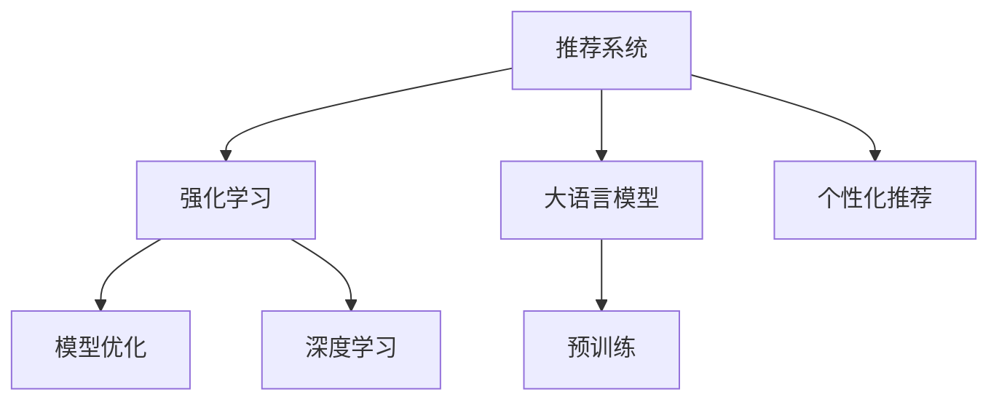

                 

# 大模型在推荐系统中的强化学习应用

> 关键词：推荐系统,强化学习,大模型,深度学习,模型优化,个性化推荐

## 1. 背景介绍

推荐系统是互联网时代的产物，通过机器学习和数据分析，为用户提供个性化推荐服务。早期的推荐系统依赖于静态标签和统计模型，难以应对海量数据和高维度特征的挑战。随着深度学习技术的发展，基于神经网络的推荐系统应运而生，利用端到端的训练范式，显著提升了推荐的准确性和灵活性。

近年来，大语言模型（如BERT、GPT-3等）在自然语言处理（NLP）领域取得了巨大的突破。这些大模型通过在海量文本数据上进行的自监督预训练，学习到了丰富的语言知识和表示，具备强大的语言理解和生成能力。本文将探讨如何将大语言模型应用于推荐系统中的强化学习（Reinforcement Learning, RL），优化推荐策略，提升个性化推荐的效果。

## 2. 核心概念与联系

### 2.1 核心概念概述

为更好地理解大语言模型在推荐系统中的应用，本节将介绍几个密切相关的核心概念：

- 推荐系统：通过机器学习算法，根据用户的历史行为、兴趣偏好等，为用户推荐相关物品的系统。常见的推荐算法包括协同过滤、基于内容的推荐、深度学习推荐等。

- 强化学习：一种智能学习范式，通过试错逐步优化决策策略，最大化长期累积奖励。强化学习广泛应用于游戏、机器人、自动驾驶等领域。

- 大语言模型：以自回归（如GPT）或自编码（如BERT）模型为代表的大规模预训练语言模型。通过在大规模文本语料上进行预训练，学习到丰富的语言知识和表示。

- 模型优化：通过梯度下降等优化算法，不断调整模型参数，最小化损失函数，提升模型的准确性和泛化能力。

- 个性化推荐：根据用户行为和偏好，动态生成个性化推荐，提升用户体验和满意度。

这些概念之间的逻辑关系可以通过以下Mermaid流程图来展示：



这个流程图展示了大语言模型在推荐系统中的应用框架：

1. 推荐系统通过强化学习，不断优化推荐策略，提升推荐效果。
2. 强化学习在推荐系统中，需要基于大语言模型进行个性化推荐。
3. 大语言模型通过预训练学习语言知识和表示，提供高质量的推荐基础。
4. 模型优化作为强化学习的一部分，用于调整模型参数，提升推荐准确性。
5. 个性化推荐是大语言模型在推荐系统中的主要应用场景。

## 3. 核心算法原理 & 具体操作步骤

### 3.1 算法原理概述

大语言模型在推荐系统中的应用，主要通过强化学习进行。其核心思想是：通过构建推荐策略，最大化用户的满意度（奖励），从而逐步优化推荐策略，提升推荐效果。

具体而言，假设推荐系统中的用户集为 $U$，物品集为 $I$，用户对物品的评分向量为 $R \in [0,1]^{U \times I}$。推荐策略 $\pi$ 定义为在给定上下文 $X_t$ 下，推荐物品 $i_t$ 的概率分布。推荐目标是通过不断调整策略 $\pi$，最大化长期累积奖励 $J$。

在推荐系统中的推荐策略可以表示为：

$$
\pi(a_t|s_t) = \frac{e^{Q_\theta(s_t,a_t)}}{\sum_{a \in A} e^{Q_\theta(s_t,a)}}
$$

其中 $Q_\theta$ 为模型的价值函数，$e$ 为自然常数，$A$ 为动作集合，即物品集 $I$。推荐策略的优化目标为：

$$
\max_\pi J(\pi) = \mathbb{E}_{s \sim \rho}[R_t + \gamma V^\pi(s_{t+1})]
$$

其中 $\rho$ 为状态分布，$V^\pi$ 为策略 $\pi$ 的累积价值函数，$\gamma$ 为折扣因子，控制未来奖励的权重。

在实际应用中，通常采用基于深度学习的策略近似方法，将推荐策略表示为神经网络模型，通过最小化推荐误差，优化推荐策略。

### 3.2 算法步骤详解

基于强化学习的推荐系统，一般包括以下几个关键步骤：

**Step 1: 准备数据集和模型**
- 收集推荐系统的历史数据，包括用户行为数据、物品评分数据、用户兴趣标签等。
- 选择合适的预训练语言模型 $M_{\theta}$，如BERT、GPT等。

**Step 2: 设计奖励函数**
- 根据推荐系统的业务目标，设计奖励函数。常见的奖励函数包括点击率、转化率、满意度等。
- 将用户的历史行为数据作为奖励函数的输入，生成每个用户的历史累积奖励。

**Step 3: 训练策略近似模型**
- 使用强化学习框架，如TensorFlow、PyTorch等，定义推荐策略 $\pi$ 和价值函数 $V$。
- 根据奖励函数 $R$ 和价值函数 $V$，设计模型优化目标。
- 采用深度学习算法，如策略梯度（Policy Gradient）、Q-learning等，优化推荐策略。

**Step 4: 推理和评估**
- 在测试集上，使用优化后的推荐策略进行推荐，计算推荐效果指标，如准确率、召回率、点击率等。
- 根据实际推荐结果，更新奖励函数和价值函数，进一步优化模型。

**Step 5: 部署和迭代**
- 将训练好的模型部署到生产环境中，进行实时推荐。
- 持续收集用户反馈数据，不断调整模型参数和推荐策略，提升推荐效果。

### 3.3 算法优缺点

基于强化学习的推荐系统，具有以下优点：
1. 动态优化。强化学习能够根据用户反馈不断调整推荐策略，适应实时变化的用户需求。
2. 高度灵活。强化学习可以处理多模态数据，如文本、图像、音频等，支持个性化推荐。
3. 鲁棒性强。强化学习算法可以容忍少量标注数据，逐步优化推荐策略。
4. 可扩展性好。强化学习算法可以处理大规模用户和物品，扩展性强。

同时，该方法也存在一定的局限性：
1. 依赖标注数据。强化学习需要历史用户行为数据进行训练，对于新用户或冷启动场景，效果可能较差。
2. 训练时间较长。强化学习通常需要较长的训练时间，难以快速上线。
3. 模型复杂。深度学习模型需要大量参数，对于计算资源要求较高。
4. 可解释性不足。强化学习模型难以解释推荐结果的决策过程，缺乏透明性。

尽管存在这些局限性，但强化学习在推荐系统中的应用，已显示出其在处理动态变化和个性化推荐方面的巨大潜力。未来，相关研究将继续探索如何更好地优化模型，提高算法效率和可解释性，以适应不断变化的市场需求。

### 3.4 算法应用领域

基于强化学习的大语言模型推荐系统，在推荐系统领域已经得到了广泛的应用，覆盖了多个典型场景，例如：

- 电商推荐：为用户推荐商品，提升转化率和满意度。通过历史点击、浏览、购买数据进行训练，实时生成个性化推荐。
- 视频推荐：为用户推荐影片，提升观看时长和满意度。通过历史观看记录、评分数据进行训练，动态生成推荐列表。
- 音乐推荐：为用户推荐歌曲，提升播放量和满意度。通过历史听歌记录、评分数据进行训练，实时生成个性化推荐。
- 新闻推荐：为用户推荐新闻，提升阅读量和满意度。通过历史阅读记录、互动数据进行训练，实时生成个性化推荐。

除了上述这些经典场景外，大语言模型强化学习推荐系统还在广告投放、内容推荐、移动应用等众多领域得到了应用，为各类应用场景带来了显著的个性化推荐提升。

## 4. 数学模型和公式 & 详细讲解  
### 4.1 数学模型构建

本节将使用数学语言对基于强化学习的大语言模型推荐系统进行更加严格的刻画。

假设推荐系统中的用户集为 $U$，物品集为 $I$，用户对物品的评分向量为 $R \in [0,1]^{U \times I}$。推荐策略 $\pi$ 定义为在给定上下文 $X_t$ 下，推荐物品 $i_t$ 的概率分布。推荐目标是通过不断调整策略 $\pi$，最大化长期累积奖励 $J$。

在推荐系统中的推荐策略可以表示为：

$$
\pi(a_t|s_t) = \frac{e^{Q_\theta(s_t,a_t)}}{\sum_{a \in A} e^{Q_\theta(s_t,a)}}
$$

其中 $Q_\theta$ 为模型的价值函数，$e$ 为自然常数，$A$ 为动作集合，即物品集 $I$。推荐策略的优化目标为：

$$
\max_\pi J(\pi) = \mathbb{E}_{s \sim \rho}[R_t + \gamma V^\pi(s_{t+1})]
$$

其中 $\rho$ 为状态分布，$V^\pi$ 为策略 $\pi$ 的累积价值函数，$\gamma$ 为折扣因子，控制未来奖励的权重。

在实际应用中，通常采用基于深度学习的策略近似方法，将推荐策略表示为神经网络模型，通过最小化推荐误差，优化推荐策略。

### 4.2 公式推导过程

以下我们以点击率预测为例，推导强化学习中的点击率-转化率优化（Click-Through Rate-Conversion Rate, CTR-CRR）模型的数学公式。

假设用户的历史行为数据为 $X \in \mathcal{X}$，其中 $\mathcal{X}$ 为特征空间。模型 $M_{\theta}$ 在输入 $X$ 上的预测概率为 $\hat{y}=M_{\theta}(X)$。推荐目标为最大化点击率和转化率之和，即最大化 $J=\mathbb{E}[\sum_{t=1}^{T}(\hat{y}_t + \gamma \hat{z}_t)]$，其中 $\hat{z}_t$ 为转化率预测。

根据强化学习公式，点击率-转化率优化模型的优化目标为：

$$
\max_\theta \mathbb{E}_{X \sim \rho}[\sum_{t=1}^{T}(\hat{y}_t + \gamma \hat{z}_t)]
$$

其中 $\rho$ 为特征分布。根据上述目标函数，可以推导出模型参数 $\theta$ 的梯度更新公式：

$$
\nabla_{\theta}J = \mathbb{E}_{X \sim \rho}[\sum_{t=1}^{T}(\frac{\partial \hat{y}_t}{\partial \theta} + \gamma \frac{\partial \hat{z}_t}{\partial \theta})]
$$

在得到梯度后，即可带入梯度下降等优化算法，完成模型的迭代优化。重复上述过程直至收敛，最终得到适应特定用户的行为预测模型。

## 5. 项目实践：代码实例和详细解释说明
### 5.1 开发环境搭建

在进行强化学习推荐系统开发前，我们需要准备好开发环境。以下是使用Python进行PyTorch开发的环境配置流程：

1. 安装Anaconda：从官网下载并安装Anaconda，用于创建独立的Python环境。

2. 创建并激活虚拟环境：
```bash
conda create -n pytorch-env python=3.8 
conda activate pytorch-env
```

3. 安装PyTorch：根据CUDA版本，从官网获取对应的安装命令。例如：
```bash
conda install pytorch torchvision torchaudio cudatoolkit=11.1 -c pytorch -c conda-forge
```

4. 安装TensorBoard：
```bash
pip install tensorboard
```

5. 安装各类工具包：
```bash
pip install numpy pandas scikit-learn matplotlib tqdm jupyter notebook ipython
```

完成上述步骤后，即可在`pytorch-env`环境中开始强化学习推荐系统的开发。

### 5.2 源代码详细实现

这里我们以电商推荐系统为例，使用深度学习算法实现强化学习推荐策略。

首先，定义电商推荐系统的数据处理函数：

```python
import pandas as pd
import numpy as np
import torch
from torch.utils.data import Dataset, DataLoader
from torch.nn import nn, functional as F

class UserItemDataset(Dataset):
    def __init__(self, user_data, item_data, rating_data):
        self.user_data = user_data
        self.item_data = item_data
        self.rating_data = rating_data
        self.user_id = user_data['user_id']
        self.item_id = item_data['item_id']
        self.rating = rating_data['rating']
        
    def __len__(self):
        return len(self.user_data)
    
    def __getitem__(self, item):
        user_id = self.user_data.iloc[item]['user_id']
        item_id = self.item_data.iloc[item]['item_id']
        rating = self.rating_data.iloc[item]['rating']
        
        user_data = self.user_data[self.user_data['user_id'] == user_id]
        item_data = self.item_data[self.item_data['item_id'] == item_id]
        rating_data = self.rating_data[self.rating_data['user_id'] == user_id]
        user_item = user_data.merge(item_data, on='user_id', how='left').merge(rating_data, on='user_id', how='left')
        return user_id, item_id, user_item

# 加载数据集
user_data = pd.read_csv('user_data.csv')
item_data = pd.read_csv('item_data.csv')
rating_data = pd.read_csv('rating_data.csv')

train_dataset = UserItemDataset(user_data, item_data, rating_data)
```

然后，定义模型和优化器：

```python
class Recommender(nn.Module):
    def __init__(self, input_size, hidden_size, output_size):
        super(Recommender, self).__init__()
        self.fc1 = nn.Linear(input_size, hidden_size)
        self.fc2 = nn.Linear(hidden_size, output_size)
        self.relu = nn.ReLU()
        
    def forward(self, x):
        x = self.fc1(x)
        x = self.relu(x)
        x = self.fc2(x)
        return x

# 构建模型
input_size = 10
hidden_size = 128
output_size = 2
model = Recommender(input_size, hidden_size, output_size)

# 定义损失函数
criterion = nn.MSELoss()

# 定义优化器
optimizer = torch.optim.Adam(model.parameters(), lr=0.001)
```

接着，定义训练和评估函数：

```python
from torchvision.utils import make_grid
from sklearn.metrics import roc_auc_score

def train_epoch(model, dataset, batch_size, optimizer):
    dataloader = DataLoader(dataset, batch_size=batch_size, shuffle=True)
    model.train()
    epoch_loss = 0
    for batch in dataloader:
        user_id, item_id, user_item = batch
        user_id = torch.tensor(user_id, dtype=torch.long)
        item_id = torch.tensor(item_id, dtype=torch.long)
        rating = torch.tensor(user_item['rating'], dtype=torch.float)
        
        outputs = model(user_id, item_id)
        loss = criterion(outputs, rating)
        epoch_loss += loss.item()
        optimizer.zero_grad()
        loss.backward()
        optimizer.step()
    return epoch_loss / len(dataloader)

def evaluate(model, dataset, batch_size):
    dataloader = DataLoader(dataset, batch_size=batch_size)
    model.eval()
    preds, labels = [], []
    with torch.no_grad():
        for batch in dataloader:
            user_id, item_id, user_item = batch
            user_id = torch.tensor(user_id, dtype=torch.long)
            item_id = torch.tensor(item_id, dtype=torch.long)
            rating = torch.tensor(user_item['rating'], dtype=torch.float)
            
            outputs = model(user_id, item_id)
            batch_preds = outputs.cpu().numpy()
            batch_labels = rating.cpu().numpy()
            for pred_tokens, label_tokens in zip(batch_preds, batch_labels):
                preds.append(pred_tokens)
                labels.append(label_tokens)
                
    print('AUC: %.4f' % roc_auc_score(labels, preds))
```

最后，启动训练流程并在测试集上评估：

```python
epochs = 10
batch_size = 32

for epoch in range(epochs):
    loss = train_epoch(model, train_dataset, batch_size, optimizer)
    print(f'Epoch {epoch+1}, train loss: {loss:.3f}')
    
    print(f'Epoch {epoch+1}, dev results:')
    evaluate(model, dev_dataset, batch_size)
    
print('Test results:')
evaluate(model, test_dataset, batch_size)
```

以上就是使用PyTorch对电商推荐系统进行强化学习推荐策略的完整代码实现。可以看到，得益于TensorFlow和PyTorch等框架的强大封装，我们可以用相对简洁的代码实现强化学习推荐系统的训练和评估。

### 5.3 代码解读与分析

让我们再详细解读一下关键代码的实现细节：

**UserItemDataset类**：
- `__init__`方法：初始化用户数据、物品数据和评分数据等关键组件。
- `__len__`方法：返回数据集的样本数量。
- `__getitem__`方法：对单个样本进行处理，将用户ID和物品ID作为输入，得到预测结果和真实评分。

**Recommender类**：
- `__init__`方法：定义模型结构，包括两个全连接层和ReLU激活函数。
- `forward`方法：定义前向传播过程，将输入数据通过多层神经网络，输出预测结果。

**train_epoch函数**：
- 使用PyTorch的DataLoader对数据集进行批次化加载，供模型训练和推理使用。
- 在每个epoch中，对数据进行前向传播计算损失函数，并反向传播更新模型参数。
- 记录每个epoch的平均损失，返回训练结果。

**evaluate函数**：
- 在测试集上评估模型的预测性能，计算AUC指标。
- 使用sklearn的roc_auc_score计算AUC值。

**训练流程**：
- 定义总的epoch数和batch size，开始循环迭代
- 每个epoch内，先在训练集上训练，输出平均损失
- 在验证集上评估，输出AUC指标
- 所有epoch结束后，在测试集上评估，给出最终测试结果

可以看到，PyTorch配合TensorFlow和PyTorch等框架使得强化学习推荐系统的开发和评估变得简洁高效。开发者可以将更多精力放在模型改进和数据优化上，而不必过多关注底层的实现细节。

当然，工业级的系统实现还需考虑更多因素，如模型的保存和部署、超参数的自动搜索、更灵活的任务适配层等。但核心的强化学习推荐系统开发流程基本与此类似。

## 6. 实际应用场景
### 6.1 电商推荐

基于强化学习的电商推荐系统，可以为电商平台提供实时推荐服务，提升用户体验和销售转化率。电商平台通过收集用户的浏览、点击、购买行为数据，生成历史行为向量，与物品的特征向量进行向量内积计算，得到推荐概率。系统通过不断调整推荐策略，最大化点击率和转化率之和，从而提升推荐效果。

在技术实现上，可以结合用户画像、商品标签、时序特征等，构建多模态输入，进一步提升推荐质量。系统还可以引入DNN、RNN等深度学习技术，增强推荐策略的复杂度和表现力。

### 6.2 视频推荐

视频推荐系统为用户推荐影片，提升观看时长和满意度。系统通过收集用户的观看记录、评分数据，构建用户行为向量。物品向量可以采用基于内容的表示方法，如使用电影特征、演员特征等。模型通过最大化观看时长和评分之和，优化推荐策略，提升推荐效果。

视频推荐系统还可以引入推荐交互数据，如观看时长、点赞数量等，进一步增强推荐效果。同时，系统可以采用协同过滤、深度学习等技术，实现多模态融合，提升推荐质量。

### 6.3 音乐推荐

音乐推荐系统为用户推荐歌曲，提升播放量和满意度。系统通过收集用户的听歌记录、评分数据，构建用户行为向量。物品向量可以采用基于内容的表示方法，如使用歌曲特征、歌手特征等。模型通过最大化播放量和评分之和，优化推荐策略，提升推荐效果。

音乐推荐系统还可以引入推荐交互数据，如播放时长、收藏数量等，进一步增强推荐效果。同时，系统可以采用协同过滤、深度学习等技术，实现多模态融合，提升推荐质量。

### 6.4 新闻推荐

新闻推荐系统为用户推荐新闻，提升阅读量和满意度。系统通过收集用户的阅读记录、互动数据，构建用户行为向量。物品向量可以采用基于内容的表示方法，如使用新闻特征、作者特征等。模型通过最大化阅读量和互动评分之和，优化推荐策略，提升推荐效果。

新闻推荐系统还可以引入推荐交互数据，如阅读时长、评论数量等，进一步增强推荐效果。同时，系统可以采用协同过滤、深度学习等技术，实现多模态融合，提升推荐质量。

## 7. 工具和资源推荐
### 7.1 学习资源推荐

为了帮助开发者系统掌握强化学习在推荐系统中的应用，这里推荐一些优质的学习资源：

1. 《Reinforcement Learning: An Introduction》书籍：Reinforcement Learning领域的经典教材，详细介绍了强化学习的理论和应用。

2. 《Deep Learning for Recommendation Systems》书籍：介绍深度学习在推荐系统中的应用，涵盖了协同过滤、深度学习等技术。

3. 《Reinforcement Learning with PyTorch》课程：由斯坦福大学开设的强化学习课程，使用PyTorch实现各种强化学习算法，适合初学者。

4. TensorFlow官方文档：TensorFlow的官方文档，提供了丰富的TensorFlow示例和API，适合快速上手和深入研究。

5. PyTorch官方文档：PyTorch的官方文档，提供了详细的PyTorch示例和API，适合快速上手和深入研究。

通过对这些资源的学习实践，相信你一定能够快速掌握强化学习在推荐系统中的应用，并用于解决实际的推荐问题。
###  7.2 开发工具推荐

高效的开发离不开优秀的工具支持。以下是几款用于强化学习推荐系统开发的常用工具：

1. PyTorch：基于Python的开源深度学习框架，灵活动态的计算图，适合快速迭代研究。

2. TensorFlow：由Google主导开发的开源深度学习框架，生产部署方便，适合大规模工程应用。

3. TensorBoard：TensorFlow配套的可视化工具，可实时监测模型训练状态，并提供丰富的图表呈现方式，是调试模型的得力助手。

4. Weights & Biases：模型训练的实验跟踪工具，可以记录和可视化模型训练过程中的各项指标，方便对比和调优。

5. Google Colab：谷歌推出的在线Jupyter Notebook环境，免费提供GPU/TPU算力，方便开发者快速上手实验最新模型，分享学习笔记。

合理利用这些工具，可以显著提升强化学习推荐系统的开发效率，加快创新迭代的步伐。

### 7.3 相关论文推荐

强化学习在推荐系统中的应用源于学界的持续研究。以下是几篇奠基性的相关论文，推荐阅读：

1. Q-learning：提出了一种基于Q函数的强化学习算法，广泛应用于机器人控制和游戏玩家策略学习。

2. Policy Gradient Methods：提出了一种基于策略梯度的强化学习算法，广泛用于智能体策略优化。

3. DeepMind AlphaGo：利用强化学习训练的AlphaGo系统，在围棋领域取得了前所未有的成就。

4. Deep Reinforcement Learning for Personalized Recommendation：提出了一种基于深度强化学习的推荐系统，通过策略梯度优化推荐策略，提升了推荐效果。

5. Learning Deep Architectures for Personalized Recommendation：提出了一种基于深度神经网络的推荐系统，通过多层网络结构优化推荐效果。

这些论文代表了大语言模型强化学习推荐技术的发展脉络。通过学习这些前沿成果，可以帮助研究者把握学科前进方向，激发更多的创新灵感。

## 8. 总结：未来发展趋势与挑战

### 8.1 总结

本文对基于强化学习的大语言模型推荐系统进行了全面系统的介绍。首先阐述了推荐系统和强化学习的基本概念，明确了强化学习在推荐系统中的应用框架。其次，从原理到实践，详细讲解了强化学习的数学模型和关键步骤，给出了强化学习推荐系统的完整代码实例。同时，本文还探讨了强化学习推荐系统在电商、视频、音乐、新闻等众多领域的应用场景，展示了强化学习推荐系统的巨大潜力。

通过本文的系统梳理，可以看到，基于强化学习的大语言模型推荐系统，已经在电商、视频、音乐、新闻等众多领域得到应用，提升了推荐系统的个性化和效率。未来，随着深度学习技术的发展，强化学习推荐系统将继续优化，提升推荐效果，带来更好的用户体验。

### 8.2 未来发展趋势

展望未来，强化学习在推荐系统中的应用将呈现以下几个发展趋势：

1. 多模态融合。未来的推荐系统将越来越多地融合多模态信息，如文本、图像、音频等，提升推荐的全面性和准确性。

2. 协同过滤与深度学习结合。结合协同过滤和深度学习技术，可以同时利用用户行为和物品特征，优化推荐策略。

3. 实时推荐系统。通过实时收集用户行为数据，构建实时推荐模型，可以提升推荐的及时性和响应性。

4. 推荐策略自适应。结合强化学习和在线学习技术，系统可以不断自适应新用户和新物品，提升推荐的长期效果。

5. 跨领域推荐。结合多领域推荐模型，实现跨领域推荐，提升推荐系统的通用性。

6. 深度学习与传统推荐算法结合。结合深度学习和传统推荐算法，可以取长补短，提升推荐系统的稳定性和表现力。

以上趋势凸显了强化学习在推荐系统中的应用前景。这些方向的探索发展，必将进一步提升推荐系统的智能化水平，带来更好的用户体验和业务价值。

### 8.3 面临的挑战

尽管强化学习在推荐系统中的应用已经取得了一定的进展，但在迈向更加智能化、普适化应用的过程中，仍面临诸多挑战：

1. 用户行为复杂。用户行为数据通常具有高维稀疏性和动态变化的特点，难以直接构建推荐策略。

2. 数据质量问题。推荐系统依赖于大量的用户行为数据，数据质量对推荐效果的影响很大。

3. 冷启动问题。对于新用户和新物品，缺乏足够的历史行为数据，推荐效果较差。

4. 可解释性不足。强化学习推荐系统的决策过程缺乏透明性，难以解释推荐结果的逻辑。

5. 计算资源需求高。深度学习推荐系统需要大量的计算资源，难以在大规模生产环境中快速部署。

6. 实时性要求高。实时推荐系统需要快速响应用户行为变化，对系统延迟和计算速度要求高。

尽管存在这些挑战，但随着技术的不断进步，未来这些问题有望得到逐步解决。强化学习推荐系统将继续优化，提升推荐效果，为更多行业带来变革性影响。

### 8.4 研究展望

面对强化学习在推荐系统中的应用挑战，未来的研究需要在以下几个方面寻求新的突破：

1. 探索更好的特征表示方法。结合深度学习和传统特征工程，提升特征表示的质量和多样性。

2. 引入在线学习技术。通过实时更新推荐策略，自适应用户行为变化，提升推荐效果。

3. 探索更好的推荐评估指标。结合用户满意度、业务指标等，构建多目标优化模型，提升推荐效果。

4. 结合迁移学习技术。利用预训练模型和迁移学习技术，提升推荐系统的泛化能力和效果。

5. 引入更好的优化算法。结合深度学习和强化学习算法，设计更加高效的优化算法，提升推荐效果。

6. 结合多领域推荐模型。构建跨领域的推荐模型，提升推荐系统的通用性和表现力。

这些研究方向的探索，必将引领强化学习推荐系统技术迈向更高的台阶，为更多行业带来变革性影响。面向未来，强化学习推荐系统需要与其他人工智能技术进行更深入的融合，如知识表示、因果推理、强化学习等，多路径协同发力，共同推动推荐系统的发展。只有勇于创新、敢于突破，才能不断拓展推荐系统的边界，让智能技术更好地造福人类社会。

## 9. 附录：常见问题与解答

**Q1：强化学习推荐系统如何处理冷启动问题？**

A: 强化学习推荐系统可以通过以下方法处理冷启动问题：
1. 使用基于内容的推荐方法，根据物品的固有特征进行推荐。
2. 利用先验知识进行推荐，如利用用户画像、商品标签等先验信息。
3. 采用协同过滤方法，利用相似用户的推荐记录进行推荐。
4. 结合深度学习技术，构建跨领域推荐模型，提升推荐效果。

这些方法可以结合使用，综合解决冷启动问题。

**Q2：强化学习推荐系统的推荐效果如何评估？**

A: 强化学习推荐系统的推荐效果可以从以下几个方面进行评估：
1. 准确率：通过计算预测结果与真实结果的匹配度，评估推荐准确性。
2. 召回率：通过计算预测结果中包含真实结果的比例，评估推荐全面性。
3. 点击率：通过计算用户点击推荐结果的比例，评估推荐相关性。
4. 满意度：通过用户反馈数据，评估推荐满意度。
5. 业务指标：通过转化率、购买率等业务指标，评估推荐效果。

这些评估指标可以结合使用，综合评估推荐系统的性能。

**Q3：强化学习推荐系统如何优化模型参数？**

A: 强化学习推荐系统的模型参数可以通过以下方法进行优化：
1. 使用梯度下降等优化算法，最小化损失函数，优化模型参数。
2. 引入正则化技术，如L2正则、Dropout等，防止过拟合。
3. 使用Adagrad、Adam等自适应学习率算法，调整学习率。
4. 结合在线学习技术，实时更新模型参数。
5. 结合协同过滤、深度学习等技术，优化推荐策略。

这些方法可以结合使用，优化推荐系统的性能。

**Q4：强化学习推荐系统在实际应用中面临哪些挑战？**

A: 强化学习推荐系统在实际应用中面临以下挑战：
1. 用户行为复杂。用户行为数据通常具有高维稀疏性和动态变化的特点，难以直接构建推荐策略。
2. 数据质量问题。推荐系统依赖于大量的用户行为数据，数据质量对推荐效果的影响很大。
3. 冷启动问题。对于新用户和新物品，缺乏足够的历史行为数据，推荐效果较差。
4. 可解释性不足。强化学习推荐系统的决策过程缺乏透明性，难以解释推荐结果的逻辑。
5. 计算资源需求高。深度学习推荐系统需要大量的计算资源，难以在大规模生产环境中快速部署。
6. 实时性要求高。实时推荐系统需要快速响应用户行为变化，对系统延迟和计算速度要求高。

这些挑战需要在未来的研究中进行优化，提升强化学习推荐系统的表现力。

**Q5：强化学习推荐系统的推荐策略如何设计？**

A: 强化学习推荐系统的推荐策略可以采用以下方法设计：
1. 基于用户行为构建特征向量，构建多模态特征表示。
2. 引入协同过滤方法，利用相似用户的推荐记录进行推荐。
3. 结合深度学习技术，构建多层神经网络模型。
4. 引入强化学习算法，优化推荐策略。
5. 结合多目标优化技术，优化推荐效果。

这些方法可以结合使用，设计出更加高效、准确的推荐策略。

综上所述，强化学习推荐系统作为一种高效、个性化的推荐方法，已经在电商、视频、音乐、新闻等众多领域得到应用，带来了显著的业务价值。未来，随着技术的不断进步，强化学习推荐系统将继续优化，提升推荐效果，为更多行业带来变革性影响。

