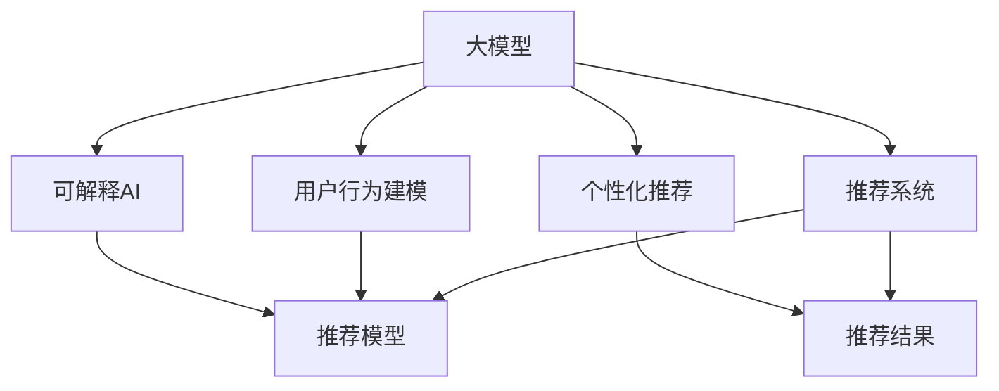

                 

# 大模型在推荐系统可解释AI中的作用

> 关键词：推荐系统,可解释AI,大模型,用户行为建模,个性化推荐,模型可解释性

## 1. 背景介绍

在数字经济的浪潮中，推荐系统成为了各大电商、内容平台、社交媒体等应用的标配，成为支撑用户消费行为、内容获取等核心服务的重要引擎。然而，推荐系统也面临着诸多挑战，如用户隐私保护、模型公平性、用户体验、内容多样性等。在这些挑战中，可解释性成为关注的焦点。可解释性指的是用户能理解推荐算法背后的决策逻辑，从而增强用户信任和平台透明度。而推荐系统的复杂性、非线性和不透明性，决定了传统的模型解释方法（如LIME, SHAP等）难以应用于推荐系统。大模型的出现，为推荐系统可解释性研究带来了新的曙光。

大模型以其强大的表征能力、丰富的语义信息，在推荐系统建模中展现出巨大潜力。本文将系统介绍大模型在推荐系统中的应用，讨论大模型可解释AI的原理，以及如何通过大模型构建推荐系统。

## 2. 核心概念与联系

### 2.1 核心概念概述

为更好地理解大模型在推荐系统中的应用，本节将介绍几个核心概念：

- 大模型（Large Model）：指预训练参数超大规模的神经网络模型，如BERT、GPT-3等，通过海量的无标签数据进行预训练，具备丰富的语义表达能力和泛化能力。

- 推荐系统（Recommendation System）：指通过算法模型为用户推荐物品或内容，如电商的推荐商品、视频平台的推荐视频、社交网络的推荐好友等，广泛应用于电商、社交、娱乐等领域。

- 可解释AI（Explainable AI, XAI）：指使得AI系统输出的决策过程能够被用户理解的技术，提升用户信任，并辅助AI系统进行迭代优化。

- 个性化推荐（Personalized Recommendation）：指根据用户的历史行为、偏好和实时环境等因素，为每个用户提供最适合的推荐，如Netflix、Amazon等平台的推荐服务。

- 用户行为建模（User Behavior Modeling）：指通过建模分析用户的历史行为数据，学习用户的兴趣和需求，构建用户画像，实现个性化推荐。

- 推荐模型可解释性（Recommendation Model Interpretability）：指推荐系统模型的内部决策机制能够被用户理解，提供推荐的解释。

这些核心概念之间的逻辑关系可以通过以下Mermaid流程图来展示：



这个流程图展示了大模型与推荐系统之间的核心关系：

1. 大模型通过预训练学习语义知识，用于推荐系统建模，增强模型的表达能力。
2. 用户行为建模在大模型基础上进行，学习用户行为规律。
3. 个性化推荐根据用户行为模型生成推荐。
4. 可解释AI在推荐系统上，通过可视化、可解释模型等方式，增强推荐结果的透明性。

## 3. 核心算法原理 & 具体操作步骤

### 3.1 算法原理概述

大模型在推荐系统中的应用主要基于两个方面：用户行为建模和个性化推荐。用户行为建模需要学习用户的兴趣和需求，个性化推荐则需要根据用户的行为特征预测出最适合的推荐。

在用户行为建模阶段，一般通过构建基于用户历史行为的推荐模型，如协同过滤、基于内容的推荐等。而在大模型的应用中，可以使用大模型作为用户行为特征的编码器，学习用户行为的高阶表示。

在个性化推荐阶段，可以使用大模型作为推荐模型，通过将用户画像与物品特征进行匹配，预测用户对每个物品的兴趣度，并选择排序推荐前N个物品。

### 3.2 算法步骤详解

基于大模型的推荐系统大致可以分为以下三个步骤：

1. **用户行为建模**
   - 收集用户历史行为数据，如浏览记录、点击记录、评分记录等。
   - 对数据进行预处理，如去除噪音、归一化等。
   - 使用大模型对用户行为进行编码，构建用户行为表示。
   - 将用户行为表示与物品特征进行匹配，构建用户行为-物品特征矩阵。

2. **个性化推荐**
   - 使用大模型作为推荐模型，将用户行为-物品特征矩阵输入模型，生成用户对每个物品的兴趣度评分。
   - 根据评分进行排序，选择前N个推荐物品。
   - 对于长尾物品，可以使用带权排序或推荐算法进行补充。

3. **模型可解释性**
   - 使用可视化工具（如SHAP, LIME等）对模型进行可视化，解释推荐结果。
   - 设计可解释模型，如Attention机制、可解释性增强的大模型等，提升模型透明性。

### 3.3 算法优缺点

大模型在推荐系统中的应用具有以下优点：
1. **泛化能力强**：大模型拥有丰富的语义信息，可以较好地泛化到未见过的用户和物品。
2. **表征能力强**：大模型可以捕捉用户行为的高阶特征，实现精细化的用户画像。
3. **推荐效果优异**：基于大模型的推荐系统能够提供更加个性化、多样化的推荐。
4. **可解释性强**：大模型提供了内部机制的可视化方式，增强了推荐结果的可解释性。

但大模型在推荐系统中的应用也存在一些缺点：
1. **计算资源消耗大**：大模型的训练和推理需要较大的计算资源，成本较高。
2. **模型复杂度高**：大模型的结构和参数复杂，难以解释内部决策过程。
3. **训练数据需求高**：大模型需要海量的无标签数据进行预训练，对数据获取成本高。
4. **模型敏感度低**：大模型的泛化能力较强，但可能对输入的微小变化较为敏感，影响推荐结果。

尽管存在这些局限性，但大模型在推荐系统中的应用已经成为推动推荐系统发展的重要力量。未来相关研究的重点在于如何进一步降低大模型对计算资源的需求，提高模型解释能力，并更好地利用大模型的特性，实现更高效、更公平的推荐。

### 3.4 算法应用领域

大模型在推荐系统的应用已覆盖多个领域，如电商、视频、音乐、社交网络等。以下是几个典型的应用场景：

1. **电商推荐系统**：如Amazon、淘宝等平台，使用大模型进行个性化商品推荐，提升用户购物体验。
2. **视频推荐系统**：如Netflix、YouTube等平台，使用大模型进行个性化视频推荐，增强用户粘性。
3. **音乐推荐系统**：如Spotify、网易云音乐等平台，使用大模型进行个性化音乐推荐，提升用户音乐体验。
4. **社交网络推荐系统**：如Facebook、微信等平台，使用大模型进行个性化好友推荐，增强用户社交关系。

此外，大模型还被应用于内容生成、广告投放、新闻推荐等多个领域，推动了推荐系统技术的发展和应用。随着大模型的不断演进，相信未来推荐系统将具备更强大的用户理解能力和推荐效果。

## 4. 数学模型和公式 & 详细讲解 & 举例说明

### 4.1 数学模型构建

本节将使用数学语言对大模型在推荐系统中的应用进行更加严格的刻画。

设用户历史行为数据为 $\mathcal{X}$，物品特征数据为 $\mathcal{Y}$，用户行为表示为 $u \in \mathcal{X}$，物品特征表示为 $i \in \mathcal{Y}$。假设用户行为表示与物品特征表示的映射函数为 $f(u,i)$，大模型为 $M_{\theta}$，其中 $\theta$ 为大模型的参数。

推荐系统的大模型应用可以通过以下公式建模：

$$
\hat{r}(u,i) = M_{\theta}(u,f(i))
$$

其中 $\hat{r}(u,i)$ 为模型对用户 $u$ 对物品 $i$ 的兴趣度预测，$M_{\theta}(u,f(i))$ 为模型对用户行为与物品特征的组合映射。

### 4.2 公式推导过程

以下我们以用户行为建模为例，推导大模型的用户行为表示的构建过程。

假设用户历史行为数据为 $\mathcal{X}$，其中 $u$ 表示用户行为表示。用户行为建模的目标是学习用户行为与大模型的映射关系，即找到最优的映射函数 $f(u)$，使得 $f(u)$ 能够较好地表示用户的兴趣和需求。

令 $f(u)$ 为大模型 $M_{\theta}$ 的输出，则有：

$$
f(u) = M_{\theta}(u)
$$

通过最小化损失函数 $\mathcal{L}$，学习最优的映射函数 $f(u)$：

$$
\theta^* = \mathop{\arg\min}_{\theta} \mathcal{L}(M_{\theta}(u), y)
$$

其中 $y$ 为用户行为的真实表示，可以是用户对物品的评分、用户的操作行为等。

在实际应用中，大模型 $M_{\theta}$ 通常使用自监督学习任务进行预训练，如语言建模、掩码语言模型等。通过这些任务，大模型学习到了丰富的语义信息，能够在用户行为建模中发挥重要作用。

### 4.3 案例分析与讲解

**案例：电商推荐系统**

在电商推荐系统中，用户行为数据通常包含用户的浏览记录、点击记录、购买记录等。为了构建用户行为表示，可以使用大模型作为编码器，对用户行为数据进行编码。

假设用户浏览了一条商品信息 $x$，点击了多个商品页面 $y$，购买了多个商品 $z$，则用户行为表示 $u$ 可以表示为：

$$
u = (x, y, z)
$$

将用户行为表示 $u$ 输入到大模型 $M_{\theta}$ 中，得到用户行为表示 $u'$，即：

$$
u' = M_{\theta}(u)
$$

将用户行为表示 $u'$ 与物品特征表示 $i$ 进行匹配，得到用户对物品 $i$ 的兴趣度评分 $r(u',i)$，即：

$$
r(u',i) = M_{\theta}(u', f(i))
$$

最终根据评分进行排序，选择前N个推荐物品 $i_1, i_2, ..., i_N$，作为用户 $u$ 的推荐结果。

## 5. 项目实践：代码实例和详细解释说明

### 5.1 开发环境搭建

在进行大模型在推荐系统中的应用开发前，我们需要准备好开发环境。以下是使用Python进行TensorFlow开发的环境配置流程：

1. 安装Anaconda：从官网下载并安装Anaconda，用于创建独立的Python环境。

2. 创建并激活虚拟环境：
```bash
conda create -n tf-env python=3.8 
conda activate tf-env
```

3. 安装TensorFlow：根据CUDA版本，从官网获取对应的安装命令。例如：
```bash
conda install tensorflow -c pytorch -c conda-forge
```

4. 安装各类工具包：
```bash
pip install numpy pandas scikit-learn matplotlib tqdm jupyter notebook ipython
```

完成上述步骤后，即可在`tf-env`环境中开始大模型在推荐系统中的应用开发。

### 5.2 源代码详细实现

下面我们以电商推荐系统为例，给出使用TensorFlow对大模型进行电商推荐任务开发的PyTorch代码实现。

首先，定义电商推荐系统的数据处理函数：

```python
import tensorflow as tf
from tensorflow.keras.layers import Input, Dense
from tensorflow.keras.models import Model

# 定义模型输入层
input_u = Input(shape=(len(user_behavior),))
input_i = Input(shape=(len(item_features),))

# 定义模型编码器，使用大模型进行用户行为编码
encoder = Dense(128, activation='relu')
encoder = Dense(64, activation='relu')
encoded_user = encoder(input_u)

# 定义模型解码器，将用户行为编码与物品特征编码进行匹配
decoder = Dense(128, activation='relu')
decoder = Dense(64, activation='relu')
encoded_i = decoder(input_i)
encoded_user_i = tf.concat([encoded_user, encoded_i], axis=1)

# 定义模型输出层，输出用户对物品的兴趣度评分
output = Dense(1, activation='sigmoid')(encoded_user_i)

# 定义推荐系统模型
model = Model(inputs=[input_u, input_i], outputs=output)
```

然后，定义训练和评估函数：

```python
from tensorflow.keras.optimizers import Adam
from sklearn.metrics import roc_auc_score

# 定义损失函数
def loss_function(y_true, y_pred):
    return tf.keras.losses.binary_crossentropy(y_true, y_pred)

# 定义优化器
optimizer = Adam(learning_rate=0.001)

# 定义训练函数
def train(model, train_dataset, val_dataset, epochs):
    model.compile(loss=loss_function, optimizer=optimizer, metrics=['auc'])
    history = model.fit(train_dataset, epochs=epochs, validation_data=val_dataset)
    auc_train = roc_auc_score(y_train, model.predict(train_dataset).ravel())
    auc_val = roc_auc_score(y_val, model.predict(val_dataset).ravel())
    print(f"Train AUC: {auc_train:.4f}, Val AUC: {auc_val:.4f}")

# 定义评估函数
def evaluate(model, test_dataset):
    auc_test = roc_auc_score(y_test, model.predict(test_dataset).ravel())
    print(f"Test AUC: {auc_test:.4f}")

# 加载数据集
train_dataset = ...
val_dataset = ...
test_dataset = ...

# 训练模型
epochs = 10
train(model, train_dataset, val_dataset, epochs)

# 评估模型
evaluate(model, test_dataset)
```

最后，启动训练流程并在测试集上评估：

```python
# 加载数据集
train_dataset = ...
val_dataset = ...
test_dataset = ...

# 训练模型
epochs = 10
train(model, train_dataset, val_dataset, epochs)

# 评估模型
evaluate(model, test_dataset)
```

以上就是使用TensorFlow对大模型进行电商推荐系统开发的完整代码实现。可以看到，TensorFlow的高级API使得构建和训练大模型非常方便，同时支持自定义损失函数、优化器等，灵活性较高。

### 5.3 代码解读与分析

让我们再详细解读一下关键代码的实现细节：

**电商推荐系统代码解析**

**用户行为表示**：
- 使用`Input`层定义用户行为表示和物品特征表示的输入。
- 定义`encoder`层，使用多个全连接层对用户行为表示进行编码，得到用户行为的高阶表示。

**物品特征表示**：
- 定义`decoder`层，使用多个全连接层对物品特征表示进行编码，得到物品特征的高阶表示。

**用户行为与物品特征匹配**：
- 将用户行为表示与物品特征表示进行拼接，得到用户行为与物品特征的综合表示。

**兴趣度评分**：
- 使用`Dense`层对综合表示进行线性变换，输出用户对物品的兴趣度评分。

**推荐系统模型**：
- 定义`Model`层，将用户行为表示、物品特征表示和兴趣度评分连接起来，构建推荐系统模型。

**训练与评估**：
- 使用`Adam`优化器进行模型训练，损失函数为二分类交叉熵。
- 定义训练函数`train`，在训练集上进行训练，并在验证集上进行评估。
- 定义评估函数`evaluate`，在测试集上进行评估。
- 加载训练集、验证集和测试集，启动训练流程。

可以看到，TensorFlow提供了灵活的构建和训练接口，开发者可以根据需求进行自定义，实现高效、可解释的推荐系统。

## 6. 实际应用场景

### 6.1 电商推荐系统

电商推荐系统是推荐系统的一个重要应用场景。通过使用大模型进行用户行为建模，电商推荐系统能够更加精准地为用户推荐商品，提升用户体验和平台转化率。

在电商推荐系统中，可以使用大模型对用户行为进行编码，将用户行为表示与物品特征表示进行匹配，得到用户对每个物品的兴趣度评分。最终根据评分进行排序，选择前N个推荐物品。通过这种方式，电商推荐系统能够为用户提供更加个性化、多样化的商品推荐，提升用户购物体验。

### 6.2 视频推荐系统

视频推荐系统是推荐系统的另一重要应用场景。通过使用大模型进行用户行为建模，视频推荐系统能够更加精准地为用户推荐视频内容，提高用户观看时间和平台粘性。

在视频推荐系统中，可以使用大模型对用户行为进行编码，将用户行为表示与视频特征表示进行匹配，得到用户对每个视频的兴趣度评分。最终根据评分进行排序，选择前N个推荐视频。通过这种方式，视频推荐系统能够为用户推荐更加个性化、多样化的视频内容，增强用户观看体验。

### 6.3 音乐推荐系统

音乐推荐系统是推荐系统的又一大应用场景。通过使用大模型进行用户行为建模，音乐推荐系统能够更加精准地为用户推荐音乐内容，提升用户音乐体验。

在音乐推荐系统中，可以使用大模型对用户行为进行编码，将用户行为表示与音乐特征表示进行匹配，得到用户对每首歌曲的兴趣度评分。最终根据评分进行排序，选择前N个推荐歌曲。通过这种方式，音乐推荐系统能够为用户推荐更加个性化、多样化的音乐内容，增强用户音乐体验。

### 6.4 未来应用展望

随着大模型的不断演进，推荐系统也将迎来新的发展机遇。未来，大模型在推荐系统中的应用将更加广泛，涉及更多领域和场景。以下是几个可能的发展方向：

1. **多模态推荐系统**：将推荐系统扩展到多模态数据，如视频、图像、音频等。通过融合不同模态的数据，提升推荐系统的表现。

2. **跨领域推荐系统**：将推荐系统应用到不同领域，如电商、视频、音乐、社交网络等。通过在不同领域之间进行知识迁移，提升推荐系统的泛化能力。

3. **可解释推荐系统**：通过可视化、可解释模型等技术，增强推荐系统的透明性。使用户能够理解推荐结果的来源和依据，增强用户信任。

4. **实时推荐系统**：通过使用大模型进行实时推荐，提升推荐系统的响应速度和用户体验。实时推荐系统能够根据用户实时行为进行动态调整，提供更加个性化的推荐。

5. **公平推荐系统**：通过使用大模型进行公平性约束，避免推荐系统中的偏见和歧视。公平推荐系统能够确保推荐结果的公正性，减少对某些群体的歧视。

未来，随着大模型的不断演进和推荐系统技术的发展，相信推荐系统将变得更加智能、高效、公平，为各行各业提供更加优质的服务。

## 7. 工具和资源推荐

### 7.1 学习资源推荐

为了帮助开发者系统掌握大模型在推荐系统中的应用，这里推荐一些优质的学习资源：

1. 《Recommender Systems in Practice》系列博文：由推荐系统专家撰写，详细介绍了推荐系统的理论基础和实际应用，涵盖电商、视频、音乐等多个领域。

2. 《Large Scale Recommender Systems》课程：斯坦福大学开设的推荐系统明星课程，有Lecture视频和配套作业，带你入门推荐系统的基础概念和经典模型。

3. 《Hands-On Recommendation Systems》书籍：推荐系统技术的入门指南，详细介绍了推荐系统的构建、评估和优化方法。

4. KDD推荐系统竞赛：KDD Cup等国际推荐系统竞赛，可以参与竞赛实战，积累推荐系统的经验。

通过对这些资源的学习实践，相信你一定能够快速掌握大模型在推荐系统中的应用，并用于解决实际的推荐问题。

### 7.2 开发工具推荐

高效的开发离不开优秀的工具支持。以下是几款用于推荐系统开发的大模型工具：

1. TensorFlow：由Google主导开发的开源深度学习框架，生产部署方便，适合大规模工程应用。推荐系统通常使用TensorFlow实现。

2. PyTorch：基于Python的开源深度学习框架，灵活动态的计算图，适合快速迭代研究。推荐系统也可以使用PyTorch实现。

3. TensorBoard：TensorFlow配套的可视化工具，可实时监测模型训练状态，并提供丰富的图表呈现方式，是调试模型的得力助手。

4. Weights & Biases：模型训练的实验跟踪工具，可以记录和可视化模型训练过程中的各项指标，方便对比和调优。

5. Grafana：实时监控工具，可以集成多种数据源，展示模型的实时性能指标。

合理利用这些工具，可以显著提升推荐系统开发的效率，加快创新迭代的步伐。

### 7.3 相关论文推荐

推荐系统的发展离不开学界的持续研究。以下是几篇奠基性的相关论文，推荐阅读：

1. Recommender Systems Handbook（推荐系统手册）：系统介绍了推荐系统的基本概念、算法和应用，是推荐系统研究的重要参考。

2. Factorization Machines: An Introduction（因子化机简介）：介绍了因子化机算法，是推荐系统中的重要算法之一。

3. Matrix Factorization Techniques for Recommender Systems（推荐系统中的矩阵分解技术）：详细介绍了推荐系统中的矩阵分解技术，是推荐系统研究的基础。

4. Generalized Matrix Factorization（广义矩阵分解）：提出了一种基于矩阵分解的推荐算法，取得了不错的效果。

5. Attention Is All You Need（Transformer论文）：提出了Transformer结构，为推荐系统提供了新的模型框架。

6. Adaptive Wide Deep Neural Network for Recommender Systems（自适应宽深度神经网络）：提出了一种宽深度神经网络架构，用于推荐系统中的特征工程。

这些论文代表了大模型在推荐系统中的应用发展脉络。通过学习这些前沿成果，可以帮助研究者把握推荐系统的演进方向，激发更多的创新灵感。

## 8. 总结：未来发展趋势与挑战

### 8.1 研究成果总结

本文对大模型在推荐系统中的应用进行了全面系统的介绍。首先，讨论了大模型在推荐系统中的作用和应用场景，明确了推荐系统中的核心概念和关键问题。其次，从原理到实践，详细讲解了大模型在推荐系统中的应用方法，给出了推荐系统的完整代码实现。最后，探讨了未来推荐系统的发展趋势和面临的挑战。

通过本文的系统梳理，可以看到，大模型在推荐系统中已经展现出巨大的潜力，极大地提升了推荐系统的表现和用户体验。未来，伴随大模型的不断演进和推荐系统技术的发展，推荐系统将变得更加智能、高效、公平，为各行各业提供更加优质的服务。

### 8.2 未来发展趋势

展望未来，大模型在推荐系统中的应用将呈现以下几个发展趋势：

1. **多模态推荐系统**：推荐系统将融合不同模态的数据，提升推荐系统的表现。

2. **跨领域推荐系统**：推荐系统将应用到不同领域，增强推荐系统的泛化能力。

3. **可解释推荐系统**：推荐系统将更加注重透明性，使用户能够理解推荐结果的来源和依据。

4. **实时推荐系统**：推荐系统将实现实时推荐，提升推荐系统的响应速度和用户体验。

5. **公平推荐系统**：推荐系统将确保推荐结果的公正性，减少对某些群体的歧视。

这些趋势凸显了大模型在推荐系统中的重要作用，推动了推荐系统的持续创新和发展。

### 8.3 面临的挑战

尽管大模型在推荐系统中取得了显著进展，但仍面临诸多挑战：

1. **计算资源消耗大**：大模型的训练和推理需要较大的计算资源，成本较高。

2. **模型复杂度高**：大模型的结构和参数复杂，难以解释内部决策过程。

3. **训练数据需求高**：大模型需要海量的无标签数据进行预训练，对数据获取成本高。

4. **模型敏感度低**：大模型的泛化能力较强，但可能对输入的微小变化较为敏感，影响推荐结果。

5. **用户隐私保护**：推荐系统需要收集大量用户数据，如何保护用户隐私成为关键问题。

6. **推荐结果公平性**：推荐系统需要避免偏见和歧视，确保推荐结果的公平性。

这些挑战需要研究者持续攻关，才能推动大模型在推荐系统中的应用。

### 8.4 研究展望

面对大模型在推荐系统中的应用挑战，未来的研究需要在以下几个方面寻求新的突破：

1. **多模态融合**：将不同模态的数据融合，提升推荐系统的表现。

2. **跨领域迁移**：在不同领域之间进行知识迁移，提升推荐系统的泛化能力。

3. **可解释性增强**：增强推荐系统的透明性，使用户能够理解推荐结果的来源和依据。

4. **实时推荐优化**：优化实时推荐系统的计算图，提升推荐系统的响应速度和效率。

5. **公平性约束**：在推荐系统中加入公平性约束，确保推荐结果的公正性。

6. **隐私保护技术**：采用隐私保护技术，保护用户数据隐私。

这些研究方向将推动大模型在推荐系统中的应用走向成熟，为推荐系统的可持续发展提供坚实的基础。

## 9. 附录：常见问题与解答

**Q1：如何在大模型中进行推荐系统建模？**

A: 在大模型中进行推荐系统建模，主要涉及以下步骤：
1. 收集用户历史行为数据，如浏览记录、点击记录、评分记录等。
2. 对数据进行预处理，如去除噪音、归一化等。
3. 使用大模型对用户行为进行编码，构建用户行为表示。
4. 定义大模型作为推荐模型，将用户行为表示与物品特征表示进行匹配，得到用户对每个物品的兴趣度评分。
5. 根据评分进行排序，选择前N个推荐物品。

**Q2：推荐系统中的大模型应该如何进行预训练？**

A: 推荐系统中的大模型通常需要进行预训练。预训练的过程一般分为两个步骤：
1. 在大规模无标签数据上，使用自监督学习任务（如掩码语言模型、预训练嵌入等）进行预训练。
2. 在推荐系统数据上，使用推荐系统任务（如用户行为建模、个性化推荐等）进行微调。

预训练过程能够使大模型学习到丰富的语义信息，提升推荐系统的表现。

**Q3：推荐系统中的大模型应该如何进行模型解释？**

A: 推荐系统中的大模型可以通过以下方法进行模型解释：
1. 可视化技术：使用可视化工具（如SHAP, LIME等）对模型进行可视化，解释推荐结果。
2. 可解释模型：设计可解释模型，如Attention机制、可解释性增强的大模型等，提升模型透明性。

通过这些方法，推荐系统能够增强推荐结果的可解释性，使用户能够理解推荐结果的来源和依据。

**Q4：推荐系统中的大模型应该如何进行推荐效果评估？**

A: 推荐系统中的大模型可以通过以下方法进行推荐效果评估：
1. 使用准确率、召回率、F1值等指标评估推荐系统的准确性和召回率。
2. 使用AUC、NDCG、MRR等指标评估推荐系统的排名效果。
3. 使用用户满意度调查、用户留存率等指标评估推荐系统的用户体验。

通过这些指标，推荐系统能够全面评估推荐效果的优劣，不断优化推荐模型。

**Q5：推荐系统中的大模型应该如何进行模型优化？**

A: 推荐系统中的大模型可以通过以下方法进行模型优化：
1. 调整超参数，如学习率、批大小等。
2. 引入正则化技术，如L2正则、Dropout等。
3. 使用对抗训练、数据增强等技术提升模型鲁棒性。
4. 采用模型裁剪、量化加速等技术优化模型效率。

通过这些方法，推荐系统能够不断提升模型性能，实现高效、公平的推荐。

