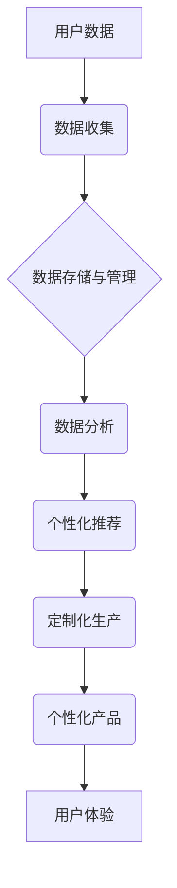

> 大数据，个性化生产，信息差，机器学习，预测分析，数据挖掘，生产流程优化

## 1. 背景介绍

在当今数字化时代，信息爆炸式增长，数据已成为企业最宝贵的资源。大数据技术的兴起，为企业提供了前所未有的机会，能够深入洞察用户需求、优化生产流程，实现个性化生产。

传统生产模式以批量生产为主，产品标准化，难以满足消费者日益增长的个性化需求。而个性化生产，则以满足每个用户的独特需求为目标，通过定制化产品或服务，提升用户体验，增强客户忠诚度。

## 2. 核心概念与联系

**2.1 信息差与个性化生产**

信息差是指在生产者和消费者之间存在的信息不对称性。传统生产模式下，生产者掌握产品信息，消费者只能被动接受，导致信息差较大。而大数据技术可以打破信息壁垒，通过收集和分析用户数据，了解用户的喜好、需求和行为模式，缩小信息差。

**2.2 大数据与个性化生产的关联**

大数据技术为个性化生产提供了强大的支撑：

* **数据收集:** 通过各种渠道收集用户数据，例如购买记录、浏览历史、社交行为等。
* **数据分析:** 利用机器学习、数据挖掘等算法，从海量数据中挖掘用户需求和趋势。
* **个性化推荐:** 根据用户数据，推荐个性化的产品或服务。
* **定制化生产:** 根据用户需求，定制化生产产品，满足用户的个性化需求。

**2.3 架构图**



## 3. 核心算法原理 & 具体操作步骤

**3.1 算法原理概述**

个性化生产的核心算法主要包括：

* **协同过滤:** 根据用户的历史行为和相似用户的信息，预测用户对产品的喜好。
* **内容过滤:** 根据产品的特征和用户的兴趣偏好，推荐用户可能感兴趣的产品。
* **混合推荐:** 结合协同过滤和内容过滤算法，提高推荐的准确性和个性化程度。

**3.2 算法步骤详解**

**协同过滤算法:**

1. **用户-物品评分矩阵构建:** 收集用户对产品的评分数据，构建用户-物品评分矩阵。
2. **相似用户/物品查找:** 根据用户评分矩阵，找到与目标用户评分相似的用户或与目标物品评分相似的物品。
3. **预测评分:** 利用相似用户或物品的评分信息，预测目标用户对目标物品的评分。

**内容过滤算法:**

1. **物品特征提取:** 对产品进行特征提取，例如产品类别、品牌、价格、描述等。
2. **用户兴趣建模:** 根据用户的历史行为和偏好，构建用户的兴趣模型。
3. **推荐物品:** 根据物品特征和用户的兴趣模型，推荐用户可能感兴趣的物品。

**3.3 算法优缺点**

**协同过滤算法:**

* **优点:** 可以发现用户之间的隐性关系，推荐更个性化的产品。
* **缺点:** 数据稀疏性问题，新用户或新物品难以推荐。

**内容过滤算法:**

* **优点:** 不需要用户历史评分数据，可以推荐新用户或新物品。
* **缺点:** 难以发现用户之间的隐性关系，推荐结果可能不够个性化。

**3.4 算法应用领域**

个性化生产算法广泛应用于：

* **电商平台:** 个性化商品推荐、定制化商品生产。
* **在线教育:** 个性化学习路径推荐、定制化课程设计。
* **医疗保健:** 个性化医疗方案推荐、定制化医疗设备设计。

## 4. 数学模型和公式 & 详细讲解 & 举例说明

**4.1 数学模型构建**

协同过滤算法的数学模型可以表示为：

$$
r_{ui} = \beta_0 + \beta_u u_i + \beta_i i_u + \epsilon_{ui}
$$

其中：

* $r_{ui}$: 用户 $u$ 对物品 $i$ 的评分。
* $\beta_0$: 整体评分基准。
* $\beta_u$: 用户 $u$ 的评分偏置。
* $\beta_i$: 物品 $i$ 的评分偏置。
* $u_i$: 用户 $u$ 的特征向量。
* $i_u$: 物品 $i$ 的特征向量。
* $\epsilon_{ui}$: 随机误差项。

**4.2 公式推导过程**

该模型通过最小化预测评分与实际评分之间的误差，学习用户和物品的评分偏置以及特征向量。

**4.3 案例分析与讲解**

假设用户 $A$ 对电影 $X$ 评分为 5，用户 $B$ 对电影 $X$ 评分为 4，用户 $A$ 和用户 $B$ 的兴趣偏好相似。根据协同过滤算法，可以预测用户 $C$ 对电影 $X$ 的评分。

## 5. 项目实践：代码实例和详细解释说明

**5.1 开发环境搭建**

* Python 3.x
* scikit-learn
* pandas
* numpy

**5.2 源代码详细实现**

```python
from sklearn.metrics.pairwise import cosine_similarity
import pandas as pd

# 加载用户-物品评分数据
ratings_data = pd.read_csv('ratings.csv')

# 构建用户-物品评分矩阵
user_item_matrix = ratings_data.pivot_table(index='user_id', columns='item_id', values='rating')

# 计算用户之间的相似度
user_similarity = cosine_similarity(user_item_matrix)

# 预测用户对物品的评分
def predict_rating(user_id, item_id):
    # 找到与目标用户相似的用户
    similar_users = user_similarity[user_id].argsort()[:-10:-1]
    # 计算预测评分
    predicted_rating = 0
    for similar_user in similar_users:
        if user_item_matrix.loc[similar_user, item_id] is not None:
            predicted_rating += user_item_matrix.loc[similar_user, item_id]
    return predicted_rating / len(similar_users)

# 预测用户 1 对物品 5 的评分
predicted_rating = predict_rating(1, 5)
print(f'预测用户 1 对物品 5 的评分: {predicted_rating}')
```

**5.3 代码解读与分析**

* 代码首先加载用户-物品评分数据，构建用户-物品评分矩阵。
* 然后使用余弦相似度计算用户之间的相似度。
* 预测用户对物品的评分时，找到与目标用户相似的用户，并根据这些用户的评分信息，计算预测评分。

**5.4 运行结果展示**

运行代码后，会输出预测用户 1 对物品 5 的评分。

## 6. 实际应用场景

**6.1 个性化电商推荐**

电商平台可以利用大数据技术，分析用户的购买记录、浏览历史、评价信息等，推荐个性化的商品。例如，用户购买过运动鞋，平台可以推荐其他运动品牌或运动服饰。

**6.2 定制化服装生产**

服装品牌可以利用大数据技术，收集用户的体型数据、喜好数据、风格数据等，定制化生产服装，满足用户的个性化需求。

**6.3 个性化教育方案**

在线教育平台可以利用大数据技术，分析学生的学习进度、学习习惯、知识掌握情况等，推荐个性化的学习路径和学习资源。

**6.4 未来应用展望**

随着大数据技术的不断发展，个性化生产将更加深入地融入到各个领域，例如：

* **医疗保健:** 个性化医疗方案推荐、定制化医疗设备设计。
* **金融服务:** 个性化理财方案推荐、定制化保险产品设计。
* **智能家居:** 个性化家居环境配置、定制化智能家居服务。

## 7. 工具和资源推荐

**7.1 学习资源推荐**

* **书籍:**
    * 《大数据时代》
    * 《机器学习实战》
    * 《数据挖掘导论》
* **在线课程:**
    * Coursera: 数据科学
    * edX: 机器学习
    * Udacity: 数据分析

**7.2 开发工具推荐**

* **Python:** 数据分析、机器学习
* **Spark:** 大数据处理
* **Hadoop:** 大数据存储和处理

**7.3 相关论文推荐**

* 《协同过滤算法综述》
* 《基于内容过滤的推荐系统》
* 《大数据时代个性化生产的挑战与机遇》

## 8. 总结：未来发展趋势与挑战

**8.1 研究成果总结**

大数据技术为个性化生产提供了强大的支撑，通过数据分析和算法模型，可以实现对用户需求的精准洞察，满足用户的个性化需求。

**8.2 未来发展趋势**

* **人工智能技术的融合:** 将人工智能技术与个性化生产算法相结合，实现更智能、更精准的个性化推荐和定制化生产。
* **边缘计算的应用:** 将个性化生产算法部署到边缘设备，实现实时个性化服务。
* **隐私保护技术的提升:** 确保用户数据安全和隐私保护，构建可信赖的个性化生产生态系统。

**8.3 面临的挑战**

* **数据质量问题:** 大数据中的数据质量参差不齐，需要进行有效的数据清洗和处理。
* **算法模型的复杂性:** 个性化生产算法模型复杂，需要不断优化和改进。
* **伦理道德问题:** 个性化生产可能会带来一些伦理道德问题，例如数据隐私、算法偏见等，需要引起重视和解决。

**8.4 研究展望**

未来，个性化生产将朝着更加智能、更加个性化、更加可持续的方向发展，需要不断探索新的技术和方法，解决面临的挑战，构建更加美好的未来。

## 9. 附录：常见问题与解答

**9.1 如何提高个性化推荐的准确性？**

* 收集更多用户数据，例如用户行为、兴趣偏好、社交关系等。
* 使用更先进的算法模型，例如深度学习算法。
* 结合多种推荐算法，例如协同过滤和内容过滤算法。

**9.2 如何解决数据稀疏性问题？**

* 使用矩阵分解技术，将稀疏矩阵分解成低秩矩阵。
* 使用协同过滤算法中的冷启动策略，对新用户或新物品进行推荐。
* 使用内容过滤算法，对新用户或新物品进行推荐。

**9.3 如何保证用户数据安全和隐私保护？**

* 使用加密技术保护用户数据。
* 采用匿名化技术，隐藏用户个人信息。
* 遵守相关数据隐私法规，获得用户的同意。


作者：禅与计算机程序设计艺术 / Zen and the Art of Computer Programming 
<end_of_turn>