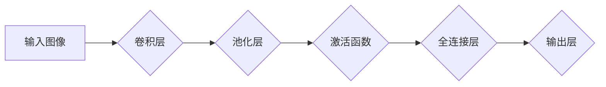

> 卷积神经网络 (CNN)，深度学习，图像识别，计算机视觉，卷积操作，池化操作，激活函数，神经网络

## 1. 背景介绍

卷积神经网络 (Convolutional Neural Network, CNN) 作为深度学习领域的重要分支，在图像识别、物体检测、语音识别等计算机视觉和自然语言处理任务中取得了显著的成果。其结构和功能灵感来源于生物视觉系统，能够有效地提取图像特征，并进行分类和识别。

随着深度学习技术的快速发展，CNN 在各个领域得到了广泛应用，例如：

* **图像识别:** 自动识别图像中的物体、场景和人物。
* **物体检测:** 在图像中定位和识别多个物体。
* **图像分类:** 将图像归类到预定义的类别中。
* **语音识别:** 将语音信号转换为文本。
* **自然语言处理:** 分析和理解文本内容。

## 2. 核心概念与联系

CNN 的核心概念包括卷积操作、池化操作、激活函数和全连接层。这些概念相互关联，共同构成 CNN 的独特架构。

**Mermaid 流程图:**



**核心概念解释:**

* **卷积操作:** 卷积操作是 CNN 的核心，它通过滑动窗口的方式，将卷积核与图像进行卷积运算，提取图像局部特征。
* **池化操作:** 池化操作用于降低图像维度，并提取图像的鲁棒性特征。常见的池化操作包括最大池化和平均池化。
* **激活函数:** 激活函数用于引入非线性，使 CNN 能够学习更复杂的特征表示。常见的激活函数包括 ReLU、Sigmoid 和 Tanh。
* **全连接层:** 全连接层将提取的特征进行组合和分类，最终输出预测结果。

## 3. 核心算法原理 & 具体操作步骤

### 3.1  算法原理概述

CNN 的核心算法原理是通过多层卷积和池化操作，逐步提取图像的特征，最终实现图像分类或识别。

**算法流程:**

1. **输入图像:** 将图像输入到 CNN 的第一层卷积层。
2. **卷积操作:** 卷积层使用多个卷积核，对图像进行卷积运算，提取图像局部特征。
3. **池化操作:** 池化层对卷积层的输出进行池化操作，降低图像维度，并提取图像的鲁棒性特征。
4. **激活函数:** 激活函数应用于卷积层和池化层的输出，引入非线性，使 CNN 能够学习更复杂的特征表示。
5. **重复步骤 2-4:** 将卷积层、池化层和激活函数重复若干层，逐步提取图像的更高层次特征。
6. **全连接层:** 将提取的特征输入到全连接层，进行分类或识别。

### 3.2  算法步骤详解

**卷积操作:**

1. 将卷积核滑动到图像上，每个位置进行卷积运算。
2. 卷积运算结果称为特征图。
3. 每个特征图对应一个卷积核，表示图像中特定特征的响应。

**池化操作:**

1. 将特征图划分为多个子区域。
2. 对每个子区域进行最大池化或平均池化操作。
3. 池化操作结果降低了图像维度，并提取了图像的鲁棒性特征。

**激活函数:**

1. 将卷积层和池化层的输出作为输入。
2. 应用激活函数，引入非线性，使 CNN 能够学习更复杂的特征表示。

**全连接层:**

1. 将提取的特征输入到全连接层。
2. 全连接层将特征进行组合和分类，最终输出预测结果。

### 3.3  算法优缺点

**优点:**

* **高效地提取图像特征:** 卷积操作和池化操作能够有效地提取图像局部特征和全局特征。
* **鲁棒性强:** 池化操作能够降低图像对噪声和位移的敏感性。
* **参数共享:** 卷积核的参数共享机制能够减少模型参数量，提高训练效率。

**缺点:**

* **训练时间长:** CNN 的训练时间相对较长，需要大量的计算资源。
* **参数量大:** CNN 的参数量较大，需要大量的训练数据才能有效训练。
* **可解释性差:** CNN 的决策过程相对复杂，难以解释其决策依据。

### 3.4  算法应用领域

CNN 在图像识别、物体检测、语音识别、自然语言处理等领域得到了广泛应用。

* **图像识别:** 自动识别图像中的物体、场景和人物。
* **物体检测:** 在图像中定位和识别多个物体。
* **图像分类:** 将图像归类到预定义的类别中。
* **语音识别:** 将语音信号转换为文本。
* **自然语言处理:** 分析和理解文本内容。

## 4. 数学模型和公式 & 详细讲解 & 举例说明

### 4.1  数学模型构建

CNN 的数学模型主要包括卷积操作、池化操作和激活函数。

**卷积操作:**

$$
y_{i,j} = \sum_{m=0}^{M-1} \sum_{n=0}^{N-1} x_{i+m,j+n} * w_{m,n} + b
$$

其中：

* $y_{i,j}$ 是卷积输出的像素值。
* $x_{i+m,j+n}$ 是输入图像的像素值。
* $w_{m,n}$ 是卷积核的权重值。
* $b$ 是偏置项。
* $M$ 和 $N$ 是卷积核的大小。

**池化操作:**

常见的池化操作包括最大池化和平均池化。

* **最大池化:** 选择池化窗口内的最大值作为输出。
* **平均池化:** 计算池化窗口内的平均值作为输出。

**激活函数:**

常见的激活函数包括 ReLU、Sigmoid 和 Tanh。

* **ReLU:** $f(x) = max(0, x)$
* **Sigmoid:** $f(x) = \frac{1}{1 + e^{-x}}$
* **Tanh:** $f(x) = \frac{e^x - e^{-x}}{e^x + e^{-x}}$

### 4.2  公式推导过程

卷积操作的公式推导过程可以参考相关深度学习教材或论文。

### 4.3  案例分析与讲解

以图像分类为例，假设输入图像大小为 28x28，卷积核大小为 3x3，卷积层输出特征图数量为 32。

1. 卷积层使用 32 个 3x3 的卷积核，对输入图像进行卷积运算，得到 32 个 26x26 的特征图。
2. 池化层对每个特征图进行最大池化操作，池化窗口大小为 2x2，得到 32 个 13x13 的特征图。
3. 激活函数应用于每个特征图的输出，引入非线性。
4. 重复步骤 1-3，可以构建多层卷积和池化结构，逐步提取图像的更高层次特征。
5. 将提取的特征输入到全连接层，进行分类或识别。

## 5. 项目实践：代码实例和详细解释说明

### 5.1  开发环境搭建

* Python 3.x
* TensorFlow 或 PyTorch 深度学习框架
* Jupyter Notebook 或 VS Code 开发环境

### 5.2  源代码详细实现

```python
import tensorflow as tf

# 定义卷积神经网络模型
model = tf.keras.models.Sequential([
    tf.keras.layers.Conv2D(32, (3, 3), activation='relu', input_shape=(28, 28, 1)),
    tf.keras.layers.MaxPooling2D((2, 2)),
    tf.keras.layers.Conv2D(64, (3, 3), activation='relu'),
    tf.keras.layers.MaxPooling2D((2, 2)),
    tf.keras.layers.Flatten(),
    tf.keras.layers.Dense(10, activation='softmax')
])

# 编译模型
model.compile(optimizer='adam',
              loss='sparse_categorical_crossentropy',
              metrics=['accuracy'])

# 训练模型
model.fit(x_train, y_train, epochs=10)

# 评估模型
loss, accuracy = model.evaluate(x_test, y_test)
print('Test Loss:', loss)
print('Test Accuracy:', accuracy)
```

### 5.3  代码解读与分析

* **定义模型结构:** 使用 `tf.keras.models.Sequential` 创建一个顺序模型，并添加卷积层、池化层、全连接层等层。
* **设置激活函数:** 使用 `activation` 参数设置激活函数，例如 `relu`、`softmax` 等。
* **编译模型:** 使用 `model.compile` 方法设置优化器、损失函数和评估指标。
* **训练模型:** 使用 `model.fit` 方法训练模型，传入训练数据和训练参数。
* **评估模型:** 使用 `model.evaluate` 方法评估模型在测试数据上的性能。

### 5.4  运行结果展示

训练完成后，可以查看模型在测试数据上的损失值和准确率。

## 6. 实际应用场景

CNN 在各个领域都有广泛的应用场景，例如：

* **图像识别:** 自动识别图像中的物体、场景和人物，例如自动驾驶、医疗诊断、安防监控等。
* **物体检测:** 在图像中定位和识别多个物体，例如无人机航拍、机器人视觉等。
* **图像分类:** 将图像归类到预定义的类别中，例如图片搜索、内容推荐等。
* **语音识别:** 将语音信号转换为文本，例如语音助手、语音搜索等。
* **自然语言处理:** 分析和理解文本内容，例如文本分类、情感分析、机器翻译等。

### 6.4  未来应用展望

随着深度学习技术的不断发展，CNN 的应用场景将会更加广泛，例如：

* **更精准的图像识别:** 能够识别更复杂、更细粒度的物体和场景。
* **更智能的语音识别:** 能够理解更复杂的语音语义和口音。
* **更强大的自然语言处理:** 能够更好地理解和生成人类语言。
* **更个性化的用户体验:** 能够根据用户的需求和喜好提供更个性化的服务。

## 7. 工具和资源推荐

### 7.1  学习资源推荐

* **书籍:**
    * 《深度学习》
    * 《动手学深度学习》
    * 《卷积神经网络》
* **在线课程:**
    * Coursera: 深度学习
    * Udacity: 深度学习工程师
    * fast.ai: 深度学习课程

### 7.2  开发工具推荐

* **TensorFlow:** 开源深度学习框架，支持多种硬件平台。
* **PyTorch:** 开源深度学习框架，以其灵活性和易用性而闻名。
* **Keras:** 高级深度学习API，可以运行在 TensorFlow、Theano 或 CNTK 后端。

### 7.3  相关论文推荐

* **AlexNet:** ImageNet Classification with Deep Convolutional Neural Networks
* **VGGNet:** Very Deep Convolutional Networks for Large-Scale Image Recognition
* **GoogLeNet:** Going Deeper with Convolutions

## 8. 总结：未来发展趋势与挑战

### 8.1  研究成果总结

CNN 在图像识别、物体检测、语音识别等领域取得了显著的成果，其结构和功能不断改进，性能不断提升。

### 8.2  未来发展趋势

* **更深更广的网络结构:** 探索更深层次、更广阔的网络结构，提高模型的表达能力和泛化能力。
* **自监督学习:** 利用无标签数据进行自监督学习，降低