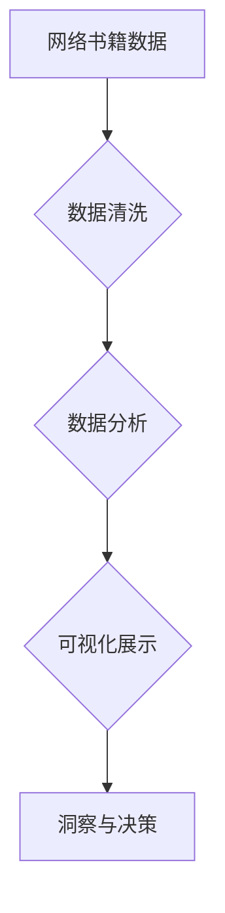

> 网络书籍数据，Python可视化，数据分析，网络阅读趋势，数据挖掘，matplotlib，seaborn

## 1. 背景介绍

随着互联网的普及和发展，网络书籍已成为人们获取知识和信息的重要途径之一。网络书籍数据蕴含着丰富的阅读趋势、用户偏好和市场信息，对出版行业、教育机构和个人读者都具有重要的参考价值。然而，这些数据通常以文本、结构化数据库或其他格式存在，难以直接理解和分析。因此，对网络书籍数据进行可视化分析，能够有效地揭示数据背后的规律和趋势，为相关领域提供决策支持。

## 2. 核心概念与联系

**2.1 网络书籍数据**

网络书籍数据是指通过网络平台获取的书籍相关信息，包括书籍标题、作者、出版社、出版年份、分类、价格、评论、阅读量等。这些数据可以来自电子书平台、在线图书馆、博客、论坛等各种来源。

**2.2 数据可视化**

数据可视化是指将数据以图形、图表、地图等形式呈现出来，以帮助人们更直观地理解和分析数据。数据可视化可以有效地揭示数据背后的规律和趋势，提高数据分析的效率和准确性。

**2.3 数据分析**

数据分析是指对数据进行收集、整理、清洗、挖掘和解释的过程，以发现数据中的隐藏规律和价值。数据分析可以帮助人们更好地理解数据，并做出更明智的决策。

**2.4 Python**

Python是一种开源、高层次的编程语言，以其易读性、丰富的库和强大的社区支持而闻名。Python在数据分析和可视化领域有着广泛的应用，其丰富的库和工具可以帮助人们轻松地进行数据处理、分析和可视化。

**2.5 Mermaid 流程图**



## 3. 核心算法原理 & 具体操作步骤

**3.1 算法原理概述**

网络书籍数据可视化分析通常涉及以下几个核心算法：

* 数据清洗：去除数据中的噪声、缺失值和重复数据，确保数据质量。
* 数据聚类：将具有相似特征的书籍进行分组，发现书籍之间的潜在关系。
* 数据降维：将高维数据转换为低维数据，方便可视化展示。
* 数据可视化：使用图表、图形等形式呈现数据，帮助人们直观地理解数据。

**3.2 算法步骤详解**

1. **数据收集:** 从网络平台获取网络书籍数据，包括书籍标题、作者、出版社、出版年份、分类、价格、评论、阅读量等。
2. **数据清洗:** 去除数据中的噪声、缺失值和重复数据，确保数据质量。可以使用Python的pandas库进行数据清洗操作。
3. **数据预处理:** 对数据进行转换和编码，例如将文本数据转换为数值数据，以便于后续算法的应用。
4. **数据分析:** 使用聚类算法、降维算法等对数据进行分析，发现书籍之间的潜在关系和趋势。
5. **数据可视化:** 使用matplotlib、seaborn等Python库对数据进行可视化展示，例如绘制书籍分类分布图、作者阅读量排行榜、书籍热度趋势图等。

**3.3 算法优缺点**

* **优点:** 能够有效地揭示网络书籍数据背后的规律和趋势，为相关领域提供决策支持。
* **缺点:** 数据质量会直接影响分析结果的准确性，需要进行充分的数据清洗和预处理。

**3.4 算法应用领域**

* 出版行业: 分析书籍市场趋势、用户阅读偏好，指导书籍出版和营销策略。
* 教育机构: 分析学生阅读习惯，制定个性化学习方案。
* 个人读者: 发现自己感兴趣的书籍类型和作者，推荐个性化书籍。

## 4. 数学模型和公式 & 详细讲解 & 举例说明

**4.1 数学模型构建**

网络书籍数据可视化分析通常使用以下数学模型：

* **聚类模型:** K-means聚类算法、层次聚类算法等，用于将书籍根据相似度进行分组。
* **降维模型:** 主成分分析(PCA)、t-SNE等，用于将高维数据转换为低维数据，方便可视化展示。

**4.2 公式推导过程**

* **K-means聚类算法:**

目标函数:

$$
J = \sum_{i=1}^{k} \sum_{x \in C_i} ||x - \mu_i||^2
$$

其中:

* $k$ 是聚类数
* $C_i$ 是第 $i$ 个聚类
* $x$ 是数据点
* $\mu_i$ 是第 $i$ 个聚类的中心点

**4.3 案例分析与讲解**

假设我们有一组网络书籍数据，包含书籍标题、作者、出版社、出版年份等信息。我们可以使用K-means聚类算法将这些书籍根据相似度进行分组，例如将同类型书籍、同作者书籍或同出版社书籍进行分组。

## 5. 项目实践：代码实例和详细解释说明

**5.1 开发环境搭建**

* Python 3.x
* Jupyter Notebook
* pandas
* matplotlib
* seaborn

**5.2 源代码详细实现**

```python
import pandas as pd
import matplotlib.pyplot as plt
import seaborn as sns

# 数据加载
data = pd.read_csv('book_data.csv')

# 数据清洗
# ...

# 数据分析
# 使用聚类算法对书籍进行分组
from sklearn.cluster import KMeans
kmeans = KMeans(n_clusters=5)
data['cluster'] = kmeans.fit_predict(data[['author', 'publisher', 'year']])

# 数据可视化
# 绘制书籍分类分布图
sns.countplot(x='cluster', data=data)
plt.title('书籍分类分布')
plt.show()

# 绘制作者阅读量排行榜
author_reading_count = data.groupby('author')['reading_count'].sum().sort_values(ascending=False)
plt.bar(author_reading_count.index, author_reading_count.values)
plt.title('作者阅读量排行榜')
plt.show()
```

**5.3 代码解读与分析**

* 数据加载: 使用pandas库读取网络书籍数据。
* 数据清洗: 去除数据中的噪声、缺失值和重复数据。
* 数据分析: 使用K-means聚类算法将书籍根据相似度进行分组。
* 数据可视化: 使用matplotlib和seaborn库绘制书籍分类分布图和作者阅读量排行榜。

**5.4 运行结果展示**

运行上述代码后，将生成书籍分类分布图和作者阅读量排行榜，帮助我们直观地了解网络书籍数据背后的规律和趋势。

## 6. 实际应用场景

**6.1 出版行业**

* 分析书籍市场趋势，例如哪些类型的书籍最受欢迎，哪些作者最具影响力。
* 预测书籍销量，帮助出版社制定出版计划和营销策略。
* 了解读者阅读偏好，帮助出版社选择合适的书籍类型和作者。

**6.2 教育机构**

* 分析学生阅读习惯，例如学生喜欢阅读哪些类型的书籍，哪些作者的书籍最受欢迎。
* 制定个性化学习方案，根据学生的阅读习惯推荐合适的书籍。
* 评估教学效果，例如学生阅读了哪些书籍，对哪些书籍的理解程度较高。

**6.3 个人读者**

* 发现自己感兴趣的书籍类型和作者，推荐个性化书籍。
* 了解书籍的市场评价和读者反馈，帮助读者做出更明智的阅读选择。
* 追踪自己阅读的书籍进度，记录自己的阅读心得。

**6.4 未来应用展望**

随着人工智能技术的不断发展，网络书籍数据可视化分析将更加智能化和个性化。未来，我们可以期待以下应用场景:

* 基于用户的阅读历史和偏好，推荐更精准的书籍。
* 利用自然语言处理技术，分析书籍内容，提供更深入的阅读理解。
* 将网络书籍数据与其他数据源进行融合，例如用户行为数据、社会网络数据等，挖掘更丰富的知识和洞察。

## 7. 工具和资源推荐

**7.1 学习资源推荐**

* Python数据分析教程: https://www.datacamp.com/courses/intro-to-python-for-data-science
* Matplotlib教程: https://matplotlib.org/stable/tutorials/index.html
* Seaborn教程: https://seaborn.pydata.org/tutorial.html

**7.2 开发工具推荐**

* Jupyter Notebook: https://jupyter.org/
* Anaconda: https://www.anaconda.com/

**7.3 相关论文推荐**

* Network Analysis of Online Book Reviews: https://dl.acm.org/doi/10.1145/2939672.2939709
* Visualizing Book Networks: https://arxiv.org/abs/1706.04074

## 8. 总结：未来发展趋势与挑战

**8.1 研究成果总结**

本文介绍了基于Python的网络书籍数据可视化分析方法，包括数据清洗、数据分析、数据可视化等步骤。通过案例分析，展示了如何使用Python库对网络书籍数据进行可视化展示，并分析了其在出版行业、教育机构和个人读者中的应用场景。

**8.2 未来发展趋势**

* **更智能化的分析:** 利用人工智能技术，例如机器学习和深度学习，对网络书籍数据进行更智能化的分析，例如自动识别书籍主题、预测书籍销量、推荐个性化书籍。
* **更丰富的可视化形式:** 探索更丰富的可视化形式，例如交互式可视化、3D可视化等，以更好地展示网络书籍数据背后的规律和趋势。
* **数据融合:** 将网络书籍数据与其他数据源进行融合，例如用户行为数据、社会网络数据等，挖掘更丰富的知识和洞察。

**8.3 面临的挑战**

* 数据质量: 网络书籍数据通常存在噪声、缺失值和重复数据，需要进行充分的数据清洗和预处理。
* 数据隐私: 网络书籍数据可能包含用户隐私信息，需要采取措施保护用户隐私。
* 计算资源: 对大规模网络书籍数据进行分析和可视化，需要强大的计算资源。

**8.4 研究展望**

未来，我们将继续研究网络书籍数据可视化分析方法，探索更智能化、更丰富、更具应用价值的可视化技术，为出版行业、教育机构和个人读者提供更有效的决策支持。

## 9. 附录：常见问题与解答

* **Q1: 如何选择合适的聚类算法?**

* **A1:** 选择合适的聚类算法取决于数据的特点和分析目标。例如，对于离散数据，可以使用K-means聚类算法; 对于连续数据，可以使用层次聚类算法。

* **Q2: 如何确定聚类数?**

* **A2:** 可以使用肘部法、Silhouette分析等方法来确定聚类数。

* **Q3: 如何解释聚类结果?**

* **A3:** 可以分析每个聚类的特征，例如书籍类型、作者、出版社等，来解释聚类结果。


作者：禅与计算机程序设计艺术 / Zen and the Art of Computer Programming 
<end_of_turn>