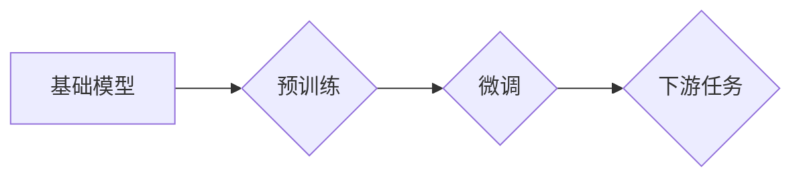

> 基础模型、NLP、同质化、迁移学习、参数共享、泛化能力、效率

## 1. 背景介绍

自然语言处理 (NLP) 领域近年来取得了飞速发展，这得益于深度学习技术的进步，特别是 Transformer 架构的出现。Transformer 架构的引入，使得模型能够更好地捕捉长距离依赖关系，从而在各种 NLP 任务中取得了显著的性能提升。

然而，随着模型规模的不断增大，训练和部署这些大型模型也带来了巨大的挑战。一方面，训练大型模型需要海量数据和强大的计算资源，这对于许多研究机构和企业来说是难以负担的。另一方面，大型模型的部署也需要大量的内存和计算能力，这限制了其在实际应用中的推广。

为了解决这些问题，基础模型的概念应运而生。基础模型是指预先训练的、通用的模型，可以应用于各种下游 NLP 任务。通过在大量数据上进行预训练，基础模型能够学习到语言的通用知识和表示，从而在后续的特定任务训练中表现出更好的性能，并且只需要少量的数据和计算资源进行微调。

## 2. 核心概念与联系

基础模型的同质化是指在不同任务和领域中，使用相同的基础模型架构和预训练方法，从而使得模型在不同场景下具有相似的性能表现。

**Mermaid 流程图:**



**核心概念原理和架构:**

* **预训练:** 基础模型在大量文本数据上进行预训练，学习到语言的通用知识和表示。
* **微调:** 将预训练好的基础模型应用于特定任务，通过在少量任务数据上进行微调，使其能够更好地完成特定任务。
* **参数共享:** 基础模型的预训练参数在微调过程中被共享，从而减少了训练所需的数据和计算资源。

## 3. 核心算法原理 & 具体操作步骤

### 3.1  算法原理概述

基础模型的同质化主要基于以下几个算法原理：

* **Transformer 架构:** Transformer 架构能够有效地捕捉长距离依赖关系，是目前 NLP 领域最流行的模型架构。
* **自监督学习:** 在预训练阶段，使用自监督学习方法，例如 masked language modeling (MLM) 和 next sentence prediction (NSP)，训练模型预测缺失的词语或句子。
* **迁移学习:** 将预训练好的模型应用于下游任务，通过微调的方式，将模型的知识迁移到新的任务领域。

### 3.2  算法步骤详解

**预训练阶段:**

1. 选择一个 Transformer 架构的模型，例如 BERT、GPT 或 T5。
2. 在海量文本数据上进行预训练，使用自监督学习方法，例如 MLM 和 NSP。
3. 训练完成后，得到一个预训练好的基础模型。

**微调阶段:**

1. 将预训练好的基础模型应用于特定任务。
2. 在少量任务数据上进行微调，调整模型的参数，使其能够更好地完成特定任务。
3. 评估模型在特定任务上的性能，并根据需要进行进一步的微调。

### 3.3  算法优缺点

**优点:**

* **提高效率:** 通过参数共享，减少了训练所需的数据和计算资源。
* **提升性能:** 预训练模型能够学习到语言的通用知识和表示，从而在后续任务训练中表现出更好的性能。
* **降低门槛:** 基于基础模型的微调方法，降低了开发 NLP 应用的门槛。

**缺点:**

* **同质化问题:** 使用相同的基础模型架构和预训练方法，可能会导致模型在不同任务和领域上的性能表现趋于一致，缺乏针对性。
* **数据依赖:** 基础模型的性能依赖于预训练数据的质量和规模。
* **可解释性问题:** 大型模型的内部机制复杂，难以解释其决策过程。

### 3.4  算法应用领域

基础模型的同质化技术在以下领域具有广泛的应用前景:

* **文本分类:** 识别文本的主题、情感和意图。
* **机器翻译:** 将文本从一种语言翻译成另一种语言。
* **问答系统:** 回答用户提出的问题。
* **文本摘要:** 生成文本的简短摘要。
* **对话系统:** 与用户进行自然语言对话。

## 4. 数学模型和公式 & 详细讲解 & 举例说明

### 4.1  数学模型构建

基础模型的训练过程可以看作是一个优化问题，目标是找到模型参数，使得模型在预训练任务上的损失函数最小。

损失函数通常采用交叉熵损失函数，用于衡量模型预测结果与真实标签之间的差异。

### 4.2  公式推导过程

交叉熵损失函数的公式如下:

$$
L = -\sum_{i=1}^{N} y_i \log(p_i)
$$

其中:

* $N$ 是样本数量。
* $y_i$ 是真实标签。
* $p_i$ 是模型预测的概率。

### 4.3  案例分析与讲解

假设我们有一个文本分类任务，目标是将文本分类为正类或负类。

模型的输出是一个概率值，表示文本属于正类的概率。

如果真实标签为正类，则损失函数的值为负对数概率。

如果真实标签为负类，则损失函数的值为负对数 (1 - 概率)。

通过最小化损失函数，模型可以学习到将文本分类为正类或负类的最佳决策边界。

## 5. 项目实践：代码实例和详细解释说明

### 5.1  开发环境搭建

* Python 3.7+
* PyTorch 1.7+
* Transformers 4.0+

### 5.2  源代码详细实现

```python
from transformers import AutoModelForSequenceClassification, AutoTokenizer

# 加载预训练模型和词典
model_name = "bert-base-uncased"
tokenizer = AutoTokenizer.from_pretrained(model_name)
model = AutoModelForSequenceClassification.from_pretrained(model_name, num_labels=2)

# 数据加载和预处理
# ...

# 模型训练
# ...

# 模型评估
# ...

# 模型保存
# ...
```

### 5.3  代码解读与分析

* 使用 `transformers` 库加载预训练模型和词典。
* 数据预处理步骤包括文本分词、标记化和编码。
* 模型训练使用 PyTorch 的训练循环，优化器和损失函数。
* 模型评估使用准确率、召回率和 F1-score 等指标。
* 模型保存可以使用 `torch.save()` 函数保存模型参数。

### 5.4  运行结果展示

* 训练结果展示模型在训练集和验证集上的准确率、召回率和 F1-score。
* 测试结果展示模型在测试集上的性能。

## 6. 实际应用场景

基础模型的同质化技术在以下实际应用场景中具有广泛的应用前景:

* **智能客服:** 基于基础模型的对话系统能够理解用户的自然语言问题，并提供准确的答案。
* **内容推荐:** 基于基础模型的推荐系统能够根据用户的兴趣和行为，推荐相关的文章、视频和产品。
* **自动写作:** 基于基础模型的写作工具能够帮助用户生成高质量的文本内容，例如新闻报道、产品描述和社交媒体帖子。

### 6.4  未来应用展望

随着基础模型的不断发展和完善，其在 NLP 领域的应用场景将会更加广泛。

例如，基础模型可以用于:

* **跨语言理解:** 构建能够理解多种语言的模型。
* **多模态理解:** 结合文本、图像、音频等多种模态信息进行理解。
* **个性化服务:** 根据用户的个性化需求，提供定制化的服务。

## 7. 工具和资源推荐

### 7.1  学习资源推荐

* **Hugging Face Transformers:** https://huggingface.co/docs/transformers/index
* **OpenAI GPT-3:** https://openai.com/blog/gpt-3/
* **Google BERT:** https://ai.googleblog.com/2018/11/open-sourcing-bert-state-of-art-pre.html

### 7.2  开发工具推荐

* **PyTorch:** https://pytorch.org/
* **TensorFlow:** https://www.tensorflow.org/

### 7.3  相关论文推荐

* **BERT: Pre-training of Deep Bidirectional Transformers for Language Understanding**
* **GPT: Generative Pre-trained Transformer**
* **T5: Text-to-Text Transfer Transformer**

## 8. 总结：未来发展趋势与挑战

### 8.1  研究成果总结

基础模型的同质化技术取得了显著的成果，在 NLP 领域取得了广泛的应用。

### 8.2  未来发展趋势

未来，基础模型的同质化技术将朝着以下方向发展:

* **模型规模的进一步扩大:** 更大的模型规模能够学习到更丰富的语言知识和表示。
* **模型架构的创新:** 新的模型架构能够更好地捕捉语言的复杂性。
* **多模态理解:** 将文本、图像、音频等多种模态信息融合在一起进行理解。
* **个性化服务:** 根据用户的个性化需求，提供定制化的服务。

### 8.3  面临的挑战

基础模型的同质化技术也面临着一些挑战:

* **数据依赖:** 基础模型的性能依赖于预训练数据的质量和规模。
* **可解释性问题:** 大型模型的内部机制复杂，难以解释其决策过程。
* **公平性问题:** 基础模型可能存在偏见，导致不公平的结果。

### 8.4  研究展望

未来，我们需要继续研究基础模型的同质化技术，解决其面临的挑战，并将其应用于更多领域，为人类社会带来更多价值。

## 9. 附录：常见问题与解答

* **Q: 基础模型的预训练数据在哪里可以获取？**

* **A:** 许多开源预训练模型的预训练数据可以在 Hugging Face Datasets 上获取。

* **Q: 如何选择合适的基础模型？**

* **A:** 选择合适的基础模型需要根据具体的应用场景和任务需求进行选择。

* **Q: 如何进行基础模型的微调？**

* **A:** 微调基础模型需要使用少量任务数据，调整模型的参数，使其能够更好地完成特定任务。


作者：禅与计算机程序设计艺术 / Zen and the Art of Computer Programming 
<end_of_turn>