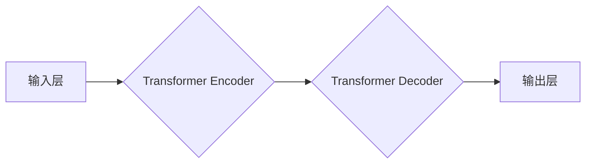

> 基础模型、人工智能、大规模语言模型、深度学习、迁移学习、伦理、社会影响

## 1. 背景介绍

人工智能（AI）正以惊人的速度发展，基础模型作为其核心驱动力，正在深刻地改变着我们生活和工作的方式。基础模型是指在海量数据上训练的大规模机器学习模型，具备强大的泛化能力，能够应用于各种下游任务，例如自然语言处理、计算机视觉、语音识别等。

近年来，基础模型取得了突破性的进展，例如GPT-3、LaMDA、DALL-E等模型展现出令人惊叹的生成能力和知识理解能力。这些模型的出现，标志着人工智能进入了一个新的时代，也引发了人们对基础模型未来发展趋势和社会影响的广泛思考。

## 2. 核心概念与联系

**2.1 基础模型的定义**

基础模型是指在海量数据上进行预训练的深度学习模型，其目标是学习通用知识和表示能力，而不是针对特定任务进行训练。

**2.2 基础模型的优势**

* **泛化能力强:** 基于海量数据的预训练，基础模型能够更好地泛化到不同的下游任务，无需大量特定任务数据。
* **效率高:** 预训练模型可以作为下游任务的起点，减少训练时间和资源消耗。
* **可迁移性强:** 基础模型可以迁移到不同的领域和应用场景，例如将自然语言处理模型应用于计算机视觉任务。

**2.3 基础模型的架构**

基础模型通常采用 Transformer 架构，其特点是能够处理长距离依赖关系，并具有强大的并行计算能力。



## 3. 核心算法原理 & 具体操作步骤

**3.1 算法原理概述**

基础模型的训练主要基于自监督学习和迁移学习的原理。

* **自监督学习:** 通过设计特殊的预训练任务，例如语言建模、图像分类等，让模型在无标签数据上学习到通用的知识和表示能力。
* **迁移学习:** 将预训练模型在特定任务上进行微调，利用模型已有的知识和能力，提高任务的性能。

**3.2 算法步骤详解**

1. **数据预处理:** 收集海量数据，并进行清洗、格式化等预处理操作。
2. **模型构建:** 选择合适的模型架构，例如 Transformer，并进行初始化。
3. **预训练:** 使用自监督学习任务，在预处理后的数据上训练模型，学习通用知识和表示能力。
4. **微调:** 将预训练模型应用于特定任务，根据任务数据进行微调，提高任务性能。
5. **评估:** 使用测试数据评估模型的性能，并进行调整和优化。

**3.3 算法优缺点**

* **优点:** 泛化能力强、效率高、可迁移性强。
* **缺点:** 训练成本高、数据依赖性强、可能存在偏差和偏见。

**3.4 算法应用领域**

基础模型在自然语言处理、计算机视觉、语音识别、机器翻译等多个领域都有广泛的应用。

## 4. 数学模型和公式 & 详细讲解 & 举例说明

**4.1 数学模型构建**

基础模型的训练通常基于最大似然估计（MLE）或交叉熵损失函数（CE Loss）。

**4.2 公式推导过程**

* **最大似然估计 (MLE):**

$$
\hat{\theta} = \arg \max_{ \theta } P(X | \theta)
$$

其中，$\theta$ 是模型参数，$X$ 是观测数据。

* **交叉熵损失函数 (CE Loss):**

$$
L(y, \hat{y}) = - \sum_{i=1}^{N} y_i \log \hat{y}_i
$$

其中，$y$ 是真实标签，$\hat{y}$ 是模型预测结果。

**4.3 案例分析与讲解**

例如，在语言建模任务中，模型的目标是预测下一个词。可以使用MLE或CE Loss来训练模型，使得模型预测的下一个词与真实标签尽可能一致。

## 5. 项目实践：代码实例和详细解释说明

**5.1 开发环境搭建**

使用Python语言和深度学习框架TensorFlow或PyTorch搭建开发环境。

**5.2 源代码详细实现**

```python
import tensorflow as tf

# 定义模型架构
model = tf.keras.Sequential([
    tf.keras.layers.Embedding(vocab_size, embedding_dim),
    tf.keras.layers.LSTM(units),
    tf.keras.layers.Dense(vocab_size, activation='softmax')
])

# 编译模型
model.compile(optimizer='adam', loss='sparse_categorical_crossentropy', metrics=['accuracy'])

# 训练模型
model.fit(train_data, train_labels, epochs=10)

# 评估模型
loss, accuracy = model.evaluate(test_data, test_labels)
print('Loss:', loss)
print('Accuracy:', accuracy)
```

**5.3 代码解读与分析**

* 代码首先定义了模型架构，包括嵌入层、LSTM层和全连接层。
* 然后编译模型，指定优化器、损失函数和评价指标。
* 接着训练模型，使用训练数据进行训练。
* 最后评估模型，使用测试数据计算模型的损失和准确率。

**5.4 运行结果展示**

训练完成后，可以将模型应用于文本生成、机器翻译等任务，并展示模型的运行结果。

## 6. 实际应用场景

基础模型在各个领域都有广泛的应用场景，例如：

* **自然语言处理:** 文本生成、机器翻译、问答系统、情感分析等。
* **计算机视觉:** 图像分类、目标检测、图像生成等。
* **语音识别:** 语音转文本、语音合成等。
* **推荐系统:** 商品推荐、内容推荐等。

**6.4 未来应用展望**

未来，基础模型将应用于更多领域，例如医疗诊断、科学研究、教育等，并推动人工智能技术的发展和应用。

## 7. 工具和资源推荐

**7.1 学习资源推荐**

* **书籍:**
    * 《深度学习》
    * 《自然语言处理》
* **在线课程:**
    * Coursera
    * edX
* **博客和论坛:**
    * TensorFlow Blog
    * PyTorch Forum

**7.2 开发工具推荐**

* **深度学习框架:** TensorFlow, PyTorch
* **编程语言:** Python
* **云计算平台:** AWS, Azure, GCP

**7.3 相关论文推荐**

* 《Attention Is All You Need》
* 《BERT: Pre-training of Deep Bidirectional Transformers for Language Understanding》
* 《GPT-3: Language Models are Few-Shot Learners》

## 8. 总结：未来发展趋势与挑战

**8.1 研究成果总结**

基础模型在过去几年取得了显著的进展，展现出强大的能力和潜力。

**8.2 未来发展趋势**

* **模型规模更大:** 训练更大规模的模型，提升模型能力。
* **多模态学习:** 融合文本、图像、音频等多模态数据，构建更全面的模型。
* **可解释性增强:** 研究模型的决策机制，提高模型的可解释性和信任度。

**8.3 面临的挑战**

* **数据安全和隐私:** 基础模型训练需要大量数据，如何保证数据安全和隐私是一个重要挑战。
* **模型偏见和公平性:** 基础模型可能存在偏见和不公平性，需要采取措施解决这些问题。
* **模型可控性和安全性:** 如何确保基础模型的安全性和可控性，避免其被恶意利用，是一个重要的研究方向。

**8.4 研究展望**

未来，基础模型的研究将继续深入，探索更强大的模型架构、更有效的训练方法和更广泛的应用场景。同时，也将更加关注基础模型的伦理和社会影响，确保其安全、可控和可持续发展。

## 9. 附录：常见问题与解答

**9.1 如何选择合适的基础模型？**

选择合适的基础模型需要考虑任务类型、数据规模、计算资源等因素。

**9.2 如何进行基础模型的微调？**

基础模型的微调需要根据具体任务调整模型参数和训练策略。

**9.3 如何评估基础模型的性能？**

可以使用不同的指标来评估基础模型的性能，例如准确率、召回率、F1-score等。


作者：禅与计算机程序设计艺术 / Zen and the Art of Computer Programming 
<end_of_turn>