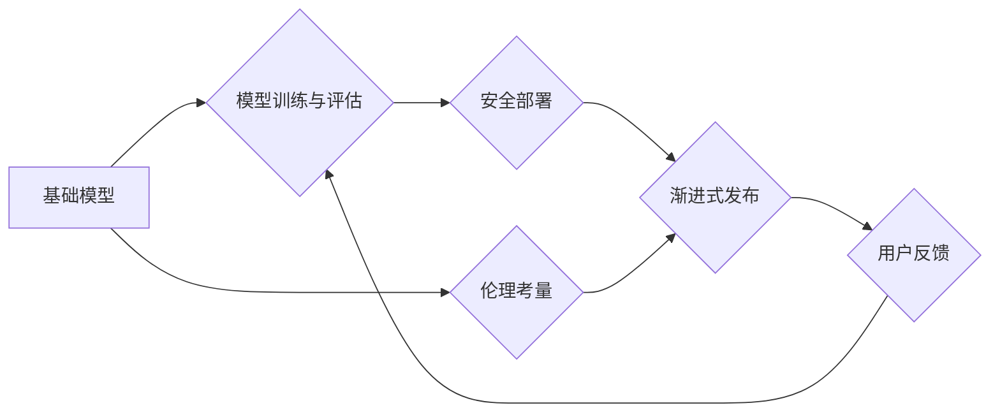

> 基础模型、渐进式发布、模型训练、模型评估、安全部署、伦理考量、技术可持续性

## 1. 背景介绍

近年来，基础模型（Foundation Models）在人工智能领域掀起了一场革命。这些模型拥有强大的泛化能力，能够在各种下游任务中取得令人瞩目的成果。然而，基础模型的训练和部署也面临着诸多挑战，其中之一就是如何进行渐进式发布，以确保模型的安全、可靠性和可持续性。

传统的模型发布方式通常是将训练完成的模型一次性公开，但这存在一些风险：

* **安全风险:** 模型可能存在漏洞，被恶意利用进行攻击或生成有害内容。
* **可靠性问题:** 模型在实际应用中可能表现不稳定，导致不可预期的结果。
* **伦理考量:** 模型可能存在偏见或歧视，导致不公平的结果。

渐进式发布策略旨在通过分阶段发布模型，逐步降低风险，并收集用户反馈，不断优化模型性能和安全性。

## 2. 核心概念与联系

### 2.1 基础模型

基础模型是指在海量数据上进行预训练的通用人工智能模型，具有强大的泛化能力，能够在各种下游任务中进行微调。

### 2.2 渐进式发布

渐进式发布是指将模型分阶段发布，逐步扩大模型的访问范围，并根据用户反馈进行模型迭代和优化。

### 2.3 模型训练与评估

模型训练是指利用训练数据训练模型参数，使其能够完成指定任务。模型评估是指使用测试数据评估模型的性能，并根据评估结果进行模型优化。

### 2.4 安全部署

安全部署是指将模型部署到生产环境中，并采取措施防止模型被恶意利用或攻击。

### 2.5 伦理考量

伦理考量是指在开发和部署模型时，考虑模型可能带来的社会影响，并采取措施避免模型造成不公平或有害的结果。

**核心概念与联系流程图:**



## 3. 核心算法原理 & 具体操作步骤

### 3.1 算法原理概述

渐进式发布策略的核心算法原理是基于模型性能和安全性的分阶段发布。

**分阶段发布策略:**

* **阶段一：内部测试:** 将模型内部测试，收集团队成员的反馈，并进行必要的调整。
* **阶段二：封闭测试:** 将模型发布给一小部分受信任的用户，收集用户反馈，并进行模型优化。
* **阶段三：公开测试:** 将模型公开发布，让所有用户都可以使用，并持续收集用户反馈，进行模型迭代和更新。

### 3.2 算法步骤详解

1. **模型训练:** 使用海量数据训练基础模型，并进行初步评估。
2. **安全评估:** 对模型进行安全评估，识别潜在的漏洞和风险。
3. **内部测试:** 将模型内部测试，收集团队成员的反馈，并进行必要的调整。
4. **封闭测试:** 将模型发布给一小部分受信任的用户，收集用户反馈，并进行模型优化。
5. **公开测试:** 将模型公开发布，让所有用户都可以使用，并持续收集用户反馈，进行模型迭代和更新。
6. **模型维护:** 定期更新模型，修复漏洞，并根据用户反馈进行模型优化。

### 3.3 算法优缺点

**优点:**

* **降低风险:** 通过分阶段发布，可以逐步降低模型的安全风险和可靠性问题。
* **收集用户反馈:** 可以收集用户反馈，不断优化模型性能和安全性。
* **提高用户信任:** 渐进式发布可以提高用户对模型的信任度。

**缺点:**

* **时间成本:** 渐进式发布需要更多的时间和资源。
* **复杂性:** 渐进式发布需要更复杂的管理和协调机制。

### 3.4 算法应用领域

渐进式发布策略可以应用于各种基础模型的发布，例如：

* 自然语言处理模型
* 图像识别模型
* 机器翻译模型
* 药物发现模型

## 4. 数学模型和公式 & 详细讲解 & 举例说明

### 4.1 数学模型构建

我们可以使用贝叶斯理论来构建一个数学模型，用于评估模型的安全性。

**贝叶斯公式:**

$$P(A|B) = \frac{P(B|A)P(A)}{P(B)}$$

其中:

* $P(A|B)$ 是在事件 B 发生的情况下，事件 A 发生的概率。
* $P(B|A)$ 是在事件 A 发生的情况下，事件 B 发生的概率。
* $P(A)$ 是事件 A 发生的概率。
* $P(B)$ 是事件 B 发生的概率。

**应用场景:**

我们可以使用贝叶斯公式来评估模型在特定输入下生成有害输出的概率。

**举例说明:**

假设我们有一个文本生成模型，我们想要评估它在特定输入下生成仇恨言论的概率。我们可以使用贝叶斯公式来计算这个概率，其中:

* $A$ 是模型生成仇恨言论的事件。
* $B$ 是模型接收特定输入的事件。

我们可以根据训练数据来估计 $P(A)$, $P(B|A)$ 和 $P(B)$，然后使用贝叶斯公式来计算 $P(A|B)$。

### 4.2 公式推导过程

贝叶斯公式的推导过程如下:

1. 从定义出发:

$$P(A|B) = \frac{P(A \cap B)}{P(B)}$$

2. 使用条件概率的定义:

$$P(A \cap B) = P(B|A)P(A)$$

3. 将公式 2 代入公式 1:

$$P(A|B) = \frac{P(B|A)P(A)}{P(B)}$$

### 4.3 案例分析与讲解

在实际应用中，我们可以使用贝叶斯公式来评估模型的安全性，并根据评估结果进行模型优化。例如，我们可以使用贝叶斯公式来评估模型在特定输入下生成虚假信息的概率，然后根据这个概率来调整模型的训练参数，降低模型生成虚假信息的风险。

## 5. 项目实践：代码实例和详细解释说明

### 5.1 开发环境搭建

* 操作系统: Ubuntu 20.04
* Python 版本: 3.8
* 必要的库: TensorFlow, PyTorch, scikit-learn

### 5.2 源代码详细实现

```python
# 导入必要的库
import tensorflow as tf

# 定义模型结构
model = tf.keras.models.Sequential([
    tf.keras.layers.Dense(128, activation='relu', input_shape=(10,)),
    tf.keras.layers.Dense(64, activation='relu'),
    tf.keras.layers.Dense(10, activation='softmax')
])

# 编译模型
model.compile(optimizer='adam',
              loss='sparse_categorical_crossentropy',
              metrics=['accuracy'])

# 训练模型
model.fit(x_train, y_train, epochs=10)

# 保存模型
model.save('my_model.h5')
```

### 5.3 代码解读与分析

* 首先，我们导入必要的库，包括 TensorFlow 库。
* 然后，我们定义模型结构，这是一个简单的多层感知机模型。
* 接着，我们编译模型，指定优化器、损失函数和评估指标。
* 接下来，我们训练模型，使用训练数据进行模型训练。
* 最后，我们保存训练好的模型。

### 5.4 运行结果展示

训练完成后，我们可以使用测试数据评估模型的性能。

```python
# 加载模型
model = tf.keras.models.load_model('my_model.h5')

# 评估模型
loss, accuracy = model.evaluate(x_test, y_test)

# 打印结果
print('Loss:', loss)
print('Accuracy:', accuracy)
```

## 6. 实际应用场景

### 6.1 自然语言处理

渐进式发布策略可以应用于自然语言处理模型的发布，例如：

* **聊天机器人:** 可以先将聊天机器人发布给一小部分用户，收集用户反馈，并根据反馈进行模型优化，提高聊天机器人的自然性和流畅度。
* **文本摘要:** 可以先将文本摘要模型发布给一小部分用户，收集用户反馈，并根据反馈进行模型优化，提高文本摘要的准确性和完整性。

### 6.2 图像识别

渐进式发布策略可以应用于图像识别模型的发布，例如：

* **物体检测:** 可以先将物体检测模型发布给一小部分用户，收集用户反馈，并根据反馈进行模型优化，提高物体检测的准确性和速度。
* **图像分类:** 可以先将图像分类模型发布给一小部分用户，收集用户反馈，并根据反馈进行模型优化，提高图像分类的准确性和鲁棒性。

### 6.3 其他应用场景

渐进式发布策略还可以应用于其他领域，例如：

* **药物发现:** 可以先将药物发现模型发布给一小部分科学家，收集用户反馈，并根据反馈进行模型优化，提高药物发现的效率和准确性。
* **金融风险评估:** 可以先将金融风险评估模型发布给一小部分金融机构，收集用户反馈，并根据反馈进行模型优化，提高金融风险评估的准确性和可靠性。

### 6.4 未来应用展望

随着基础模型的不断发展，渐进式发布策略将变得越来越重要。未来，我们将看到更多基于渐进式发布策略的创新应用，例如：

* **个性化模型:** 可以根据用户的个人特征和偏好，进行个性化的模型训练和发布。
* **动态模型更新:** 可以根据用户的反馈和环境变化，动态更新模型，保持模型的最新性和有效性。
* **联邦学习:** 可以利用联邦学习技术，在不共享原始数据的条件下，进行模型训练和发布，提高模型的隐私性和安全性。

## 7. 工具和资源推荐

### 7.1 学习资源推荐

* **书籍:**
    * 《深度学习》 by Ian Goodfellow, Yoshua Bengio, and Aaron Courville
    * 《动手学深度学习》 by Aurélien Géron
* **在线课程:**
    * Coursera: Deep Learning Specialization
    * Udacity: Deep Learning Nanodegree
* **博客和网站:**
    * TensorFlow Blog: https://blog.tensorflow.org/
    * PyTorch Blog: https://pytorch.org/blog/

### 7.2 开发工具推荐

* **TensorFlow:** https://www.tensorflow.org/
* **PyTorch:** https://pytorch.org/
* **Keras:** https://keras.io/

### 7.3 相关论文推荐

* **Attention Is All You Need:** https://arxiv.org/abs/1706.03762
* **BERT: Pre-training of Deep Bidirectional Transformers for Language Understanding:** https://arxiv.org/abs/1810.04805
* **GPT-3: Language Models are Few-Shot Learners:** https://arxiv.org/abs/2005.14165

## 8. 总结：未来发展趋势与挑战

### 8.1 研究成果总结

渐进式发布策略为基础模型的开发和部署提供了新的思路，可以有效降低模型的风险，提高模型的安全性、可靠性和用户信任度。

### 8.2 未来发展趋势

未来，渐进式发布策略将朝着以下方向发展:

* **更加自动化:** 利用机器学习算法，自动评估模型的安全性，并自动进行模型优化。
* **更加个性化:** 根据用户的个人特征和偏好，进行个性化的模型训练和发布。
* **更加动态:** 根据用户的反馈和环境变化，动态更新模型，保持模型的最新性和有效性。

### 8.3 面临的挑战

渐进式发布策略也面临着一些挑战:

* **评估模型安全性的难度:** 如何准确