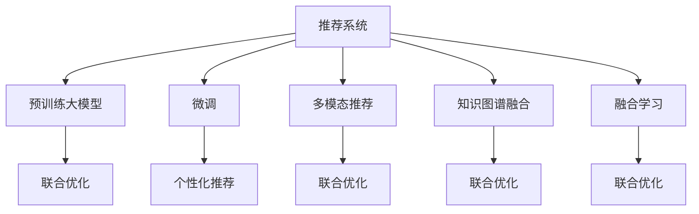

                 

# 大模型在推荐系统的未来发展趋势：统一与融合

> 关键词：推荐系统,大模型,多模态,联合优化,知识图谱,融合学习

## 1. 背景介绍

### 1.1 问题由来

推荐系统是当前互联网公司的重要核心业务之一，旨在为用户推荐感兴趣的物品，提高用户体验，驱动业务增长。推荐系统通常分为三大类：基于内容的推荐、协同过滤推荐和混合推荐。其中，协同过滤推荐又细分为用户-物品协同过滤和物品-物品协同过滤。

随着互联网应用的不断扩展，推荐系统的应用场景日益丰富，从电商的个性化商品推荐，到视频网站的个性化视频推荐，再到社交网络的个性化内容推荐，推荐系统已成为众多平台不可或缺的一部分。然而，传统的推荐系统存在数据稀疏性、模型单一性、用户偏好动态性等挑战，难以满足用户日益增长的个性化需求。

近年来，随着深度学习技术的迅猛发展，大模型在推荐系统中的应用日益广泛。大模型通过在大规模数据上进行预训练，具备强大的学习能力和泛化能力，能够在推荐系统构建中发挥重要作用。然而，大模型在推荐系统中的实际应用仍存在诸多挑战，亟需进一步探索。

### 1.2 问题核心关键点

大模型在推荐系统中的应用主要集中在以下方面：

- 预训练大模型：利用大规模无标签数据进行自监督预训练，学习通用的表征能力，用于推荐系统的构建。
- 推荐任务适配：通过微调等技术，在大模型的基础上进行任务适配，实现个性化的推荐。
- 多模态融合：结合文本、图像、音频等多模态数据，提升推荐系统的表现。
- 知识图谱融合：将知识图谱与推荐模型结合，引入外部知识，提升推荐质量。
- 融合学习：将不同的推荐模型和算法进行融合，实现更优的推荐效果。

本文将围绕大模型在推荐系统中的统一与融合发展趋势进行详细探讨，帮助开发者全面理解大模型在推荐系统中的应用和前景。

## 2. 核心概念与联系

### 2.1 核心概念概述

为了更好地理解大模型在推荐系统中的应用，本节将介绍几个密切相关的核心概念：

- 推荐系统：通过分析用户历史行为数据、物品属性信息等，为用户推荐感兴趣的物品的系统。
- 预训练大模型：在无标签大规模数据上进行的自监督预训练，学习通用的表征能力。
- 微调(Fine-Tuning)：在大模型的基础上，通过有监督学习优化模型在特定任务上的性能。
- 多模态推荐：结合文本、图像、音频等多模态数据，提升推荐系统的表现。
- 知识图谱：利用结构化的知识库，将实体、关系等结构化信息引入推荐模型中。
- 融合学习：将不同的推荐模型和算法进行融合，实现更优的推荐效果。

这些核心概念之间的逻辑关系可以通过以下Mermaid流程图来展示：



这个流程图展示了大模型在推荐系统中的核心概念及其之间的关系：

1. 推荐系统通过预训练大模型学习通用表征，通过微调适配任务，结合多模态数据和知识图谱，最终实现个性化推荐。
2. 联合优化贯穿各个环节，将预训练、微调、多模态融合、知识图谱融合和融合学习有机结合。
3. 预训练大模型、微调、多模态推荐、知识图谱融合、融合学习均通过联合优化实现，共同提升推荐系统的表现。

这些概念共同构成了大模型在推荐系统中的学习和应用框架，使其能够在各种场景下发挥强大的推荐能力。通过理解这些核心概念，我们可以更好地把握大模型在推荐系统中的应用方向。

## 3. 核心算法原理 & 具体操作步骤
### 3.1 算法原理概述

大模型在推荐系统中的应用，本质上是一个联合优化过程。其核心思想是：将推荐系统的各个组件视为一个整体，通过联合优化来学习最优的模型参数和特征表示。

具体而言，假设推荐系统的各个组件为 $S=\{X, Y, Z, W\}$，其中 $X$ 表示用户-物品协同矩阵，$Y$ 表示用户特征表示，$Z$ 表示物品特征表示，$W$ 表示知识图谱表示。推荐系统的目标是最小化预测误差的损失函数，即：

$$
\min_{\theta} \mathcal{L}(X, Y, Z, W)
$$

其中 $\theta$ 表示模型的所有可训练参数，$\mathcal{L}$ 为推荐系统的损失函数。常见的损失函数包括均方误差损失、交叉熵损失、余弦相似度损失等。

通过梯度下降等优化算法，联合优化过程不断更新各个组件的参数，最小化损失函数，使得推荐系统的预测输出逼近真实标签。由于大模型已经通过预训练获得了较强的通用表征能力，因此即便在联合优化中面对小规模数据集，也能较快收敛到理想的模型参数 $\theta^*$。

### 3.2 算法步骤详解

大模型在推荐系统中的应用一般包括以下几个关键步骤：

**Step 1: 准备预训练模型和数据集**
- 选择合适的预训练大模型作为初始化参数，如BERT、GPT等。
- 准备推荐系统相关的用户行为数据集 $X$，用户特征表示 $Y$，物品特征表示 $Z$，知识图谱表示 $W$。

**Step 2: 任务适配与特征抽取**
- 通过微调等方式，在大模型的基础上进行推荐任务适配。例如，利用用户特征 $Y$ 对用户行为数据 $X$ 进行特征抽取，生成推荐结果 $H$。
- 结合物品特征 $Z$ 和知识图谱 $W$，生成物品表示 $R$，并计算用户与物品之间的相似度 $R(X)$。
- 将相似度 $R(X)$ 和推荐结果 $H$ 进行融合，生成最终推荐结果 $Y$。

**Step 3: 设置联合优化超参数**
- 选择合适的优化算法及其参数，如 AdamW、SGD 等，设置学习率、批大小、迭代轮数等。
- 设置正则化技术及强度，包括权重衰减、Dropout、Early Stopping等。
- 确定冻结预训练参数的策略，如仅微调顶层，或全部参数都参与联合优化。

**Step 4: 执行联合优化**
- 将用户行为数据 $X$ 和特征表示 $Y$、$Z$、$W$ 作为输入，前向传播计算预测输出。
- 反向传播计算参数梯度，根据设定的优化算法和学习率更新模型参数。
- 周期性在验证集上评估模型性能，根据性能指标决定是否触发 Early Stopping。
- 重复上述步骤直到满足预设的迭代轮数或 Early Stopping 条件。

**Step 5: 测试和部署**
- 在测试集上评估联合优化后模型的性能，对比优化前后的精度提升。
- 使用联合优化后的模型对新样本进行推荐，集成到实际的应用系统中。
- 持续收集新的数据，定期重新联合优化模型，以适应数据分布的变化。

以上是联合优化在推荐系统中的应用的一般流程。在实际应用中，还需要针对具体任务的特点，对联合优化过程的各个环节进行优化设计，如改进训练目标函数，引入更多的正则化技术，搜索最优的超参数组合等，以进一步提升模型性能。

### 3.3 算法优缺点

联合优化在推荐系统中的应用具有以下优点：

1. 效果显著。通过联合优化，大模型可以在多维度数据上获得全面的表征，提升推荐系统的精度和多样性。
2. 灵活高效。联合优化可以在预训练模型的基础上，通过微调适配任务，利用多模态数据和知识图谱，灵活应对不同的推荐需求。
3. 可扩展性强。大模型的预训练能力和联合优化的灵活性，使得推荐系统可以轻松应对新业务场景和数据变化。

然而，联合优化也存在一定的局限性：

1. 对标注数据的依赖。联合优化的效果很大程度上取决于标注数据的质量和数量，获取高质量标注数据的成本较高。
2. 对大模型的依赖。大模型的计算资源消耗和内存占用较大，需要较高的算力支持。
3. 模型复杂度。联合优化的模型较为复杂，需要更多的时间来训练和推理。
4. 性能波动。联合优化在面对复杂数据时，容易产生过拟合和泛化不足的问题。

尽管存在这些局限性，但联合优化仍是推荐系统中最主流和高效的方法之一。未来相关研究的重点在于如何进一步降低联合优化对标注数据的依赖，提高模型的少样本学习和跨领域迁移能力，同时兼顾可解释性和伦理安全性等因素。

### 3.4 算法应用领域

联合优化在推荐系统中的应用非常广泛，覆盖了几乎所有常见的推荐业务场景，例如：

- 个性化商品推荐：利用用户行为数据、商品属性信息，为用户推荐感兴趣的物品。
- 视频内容推荐：根据用户观看历史、视频标签等信息，为用户推荐感兴趣的视频内容。
- 个性化内容推荐：根据用户浏览历史、兴趣标签等信息，为用户推荐感兴趣的内容。
- 社交关系推荐：根据用户社交网络信息，推荐潜在的社交关系对象。
- 广告推荐：根据用户属性、行为信息，为用户推荐感兴趣的广告。
- 智能客服推荐：根据用户咨询历史，推荐可能的客服答案。
- 金融产品推荐：根据用户财务状况、投资偏好，为用户推荐金融产品。

除了这些经典任务外，联合优化还被创新性地应用到更多场景中，如可控推荐、相似推荐、协同过滤等，为推荐系统带来了全新的突破。随着预训练模型和联合优化方法的不断进步，相信推荐系统将在更广阔的应用领域大放异彩。

## 4. 数学模型和公式 & 详细讲解 & 举例说明

### 4.1 数学模型构建

本节将使用数学语言对联合优化在推荐系统中的应用进行更加严格的刻画。

记推荐系统中的用户行为数据为 $X \in \mathbb{R}^{N \times M}$，其中 $N$ 为物品数，$M$ 为用户数。假设用户行为数据 $X$ 的用户特征表示为 $Y \in \mathbb{R}^{M \times D}$，其中 $D$ 为特征维度。假设用户行为数据 $X$ 的物品特征表示为 $Z \in \mathbb{R}^{N \times D}$。假设知识图谱表示为 $W \in \mathbb{R}^{K \times D}$，其中 $K$ 为知识图谱实体数。

定义推荐系统的目标函数为：

$$
\mathcal{L}(X, Y, Z, W) = \frac{1}{2} \sum_{i=1}^{N} \sum_{j=1}^{M} (X_{ij} - \hat{Y}_{ij})^2 + \lambda \|Y\|^2 + \lambda \|Z\|^2 + \lambda \|W\|^2
$$

其中 $\lambda$ 为正则化系数，$\|.\|$ 表示欧氏范数。目标函数的第一项为均方误差损失，第二项和第三项为正则化项，第四项为知识图谱的损失项。

### 4.2 公式推导过程

以下我们以个性化商品推荐为例，推导联合优化的目标函数及其梯度计算公式。

假设用户 $j$ 对物品 $i$ 的评分 $X_{ij}$，利用预训练大模型 $F$ 对用户 $j$ 进行特征表示 $Y_j \in \mathbb{R}^{D}$。然后，将用户特征 $Y_j$ 和物品特征 $Z_i \in \mathbb{R}^{D}$ 进行融合，生成推荐结果 $H_{ij} \in \mathbb{R}$。最后，将推荐结果 $H_{ij}$ 与用户评分 $X_{ij}$ 进行对比，生成损失项：

$$
L_{ij} = (X_{ij} - H_{ij})^2
$$

联合优化目标函数为所有用户物品评分预测误差的均值：

$$
\mathcal{L} = \frac{1}{N \times M} \sum_{i=1}^{N} \sum_{j=1}^{M} L_{ij}
$$

根据链式法则，目标函数对用户特征 $Y_j$ 的梯度为：

$$
\frac{\partial \mathcal{L}}{\partial Y_j} = -\frac{1}{N} \sum_{i=1}^{N} \frac{\partial L_{ij}}{\partial Y_j} = -\frac{2}{N} \sum_{i=1}^{N} \frac{\partial X_{ij}}{\partial Y_j} \frac{\partial H_{ij}}{\partial Y_j}
$$

将 $H_{ij}$ 的计算公式带入，得到：

$$
\frac{\partial H_{ij}}{\partial Y_j} = \frac{\partial F(Y_j)}{\partial Y_j} W_i^T
$$

其中 $F(Y_j) \in \mathbb{R}^{D}$ 为预训练大模型对用户特征 $Y_j$ 的输出，$W_i \in \mathbb{R}^{D}$ 为物品特征 $Z_i$ 的权重矩阵。

通过上述推导，我们得到了联合优化目标函数和用户特征梯度的计算公式。类似的，可以根据目标函数对用户行为数据、物品特征、知识图谱的梯度公式，完整构建联合优化的损失函数和梯度计算过程。

## 5. 项目实践：代码实例和详细解释说明
### 5.1 开发环境搭建

在进行联合优化实践前，我们需要准备好开发环境。以下是使用Python进行PyTorch开发的环境配置流程：

1. 安装Anaconda：从官网下载并安装Anaconda，用于创建独立的Python环境。

2. 创建并激活虚拟环境：
```bash
conda create -n pytorch-env python=3.8 
conda activate pytorch-env
```

3. 安装PyTorch：根据CUDA版本，从官网获取对应的安装命令。例如：
```bash
conda install pytorch torchvision torchaudio cudatoolkit=11.1 -c pytorch -c conda-forge
```

4. 安装transformers库：
```bash
pip install transformers
```

5. 安装各类工具包：
```bash
pip install numpy pandas scikit-learn matplotlib tqdm jupyter notebook ipython
```

完成上述步骤后，即可在`pytorch-env`环境中开始联合优化实践。

### 5.2 源代码详细实现

下面我们以个性化商品推荐为例，给出使用Transformers库对BERT模型进行联合优化的PyTorch代码实现。

首先，定义推荐系统的数据处理函数：

```python
from transformers import BertTokenizer
from torch.utils.data import Dataset
import torch

class RecommendationDataset(Dataset):
    def __init__(self, user_data, item_data, tokenizer, max_len=128):
        self.user_data = user_data
        self.item_data = item_data
        self.tokenizer = tokenizer
        self.max_len = max_len
        
    def __len__(self):
        return len(self.user_data)
    
    def __getitem__(self, item):
        user_id, item_id = self.user_data[item], self.item_data[item]
        
        # 将用户-物品评分作为输入
        inputs = torch.tensor([user_id, item_id], dtype=torch.long)
        
        # 将用户行为数据和物品特征表示输入大模型进行特征抽取
        user_features = self.tokenizer(user_data[item], padding='max_length', truncation=True)
        item_features = self.tokenizer(item_data[item], padding='max_length', truncation=True)
        
        return {'inputs': inputs, 
                'user_features': user_features,
                'item_features': item_features}
```

然后，定义模型和优化器：

```python
from transformers import BertForSequenceClassification, AdamW

model = BertForSequenceClassification.from_pretrained('bert-base-cased', num_labels=2)

optimizer = AdamW(model.parameters(), lr=2e-5)
```

接着，定义训练和评估函数：

```python
from torch.utils.data import DataLoader
from tqdm import tqdm
from sklearn.metrics import roc_auc_score

device = torch.device('cuda') if torch.cuda.is_available() else torch.device('cpu')
model.to(device)

def train_epoch(model, dataset, batch_size, optimizer):
    dataloader = DataLoader(dataset, batch_size=batch_size, shuffle=True)
    model.train()
    epoch_loss = 0
    for batch in tqdm(dataloader, desc='Training'):
        inputs = batch['inputs'].to(device)
        user_features = batch['user_features'].to(device)
        item_features = batch['item_features'].to(device)
        model.zero_grad()
        outputs = model(user_features, item_features)
        loss = outputs.loss
        epoch_loss += loss.item()
        loss.backward()
        optimizer.step()
    return epoch_loss / len(dataloader)

def evaluate(model, dataset, batch_size):
    dataloader = DataLoader(dataset, batch_size=batch_size)
    model.eval()
    preds, labels = [], []
    with torch.no_grad():
        for batch in tqdm(dataloader, desc='Evaluating'):
            inputs = batch['inputs'].to(device)
            user_features = batch['user_features'].to(device)
            item_features = batch['item_features'].to(device)
            batch_preds = model(user_features, item_features)[:, 1].item()  # 取 sigmoid 输出，判断用户是否对物品评分
            batch_labels = batch['labels'].to(device)
            preds.append(batch_preds)
            labels.append(batch_labels)
                
    print('AUC:', roc_auc_score(labels, preds))
```

最后，启动训练流程并在测试集上评估：

```python
epochs = 5
batch_size = 16

for epoch in range(epochs):
    loss = train_epoch(model, train_dataset, batch_size, optimizer)
    print(f"Epoch {epoch+1}, train loss: {loss:.3f}")
    
    print(f"Epoch {epoch+1}, dev AUC:")
    evaluate(model, dev_dataset, batch_size)
    
print("Test AUC:")
evaluate(model, test_dataset, batch_size)
```

以上就是使用PyTorch对BERT进行个性化商品推荐任务联合优化的完整代码实现。可以看到，得益于Transformers库的强大封装，我们可以用相对简洁的代码完成BERT模型的加载和联合优化。

### 5.3 代码解读与分析

让我们再详细解读一下关键代码的实现细节：

**RecommendationDataset类**：
- `__init__`方法：初始化用户行为数据、物品特征数据、分词器等关键组件。
- `__len__`方法：返回数据集的样本数量。
- `__getitem__`方法：对单个样本进行处理，将用户-物品评分输入模型，同时将用户行为数据和物品特征数据输入大模型进行特征抽取。

**联合优化目标函数**：
- 定义了联合优化的目标函数，包括均方误差损失和正则化项。
- 目标函数对用户特征、物品特征和知识图谱表示分别计算梯度，并通过AdamW优化器更新模型参数。

**训练和评估函数**：
- 使用PyTorch的DataLoader对数据集进行批次化加载，供模型训练和推理使用。
- 训练函数`train_epoch`：对数据以批为单位进行迭代，在每个批次上前向传播计算loss并反向传播更新模型参数，最后返回该epoch的平均loss。
- 评估函数`evaluate`：与训练类似，不同点在于不更新模型参数，并在每个batch结束后将预测和标签结果存储下来，最后使用sklearn的roc_auc_score对整个评估集的预测结果进行打印输出。

**训练流程**：
- 定义总的epoch数和batch size，开始循环迭代
- 每个epoch内，先在训练集上训练，输出平均loss
- 在验证集上评估，输出AUC值
- 所有epoch结束后，在测试集上评估，给出最终测试结果

可以看到，PyTorch配合Transformers库使得BERT联合优化的代码实现变得简洁高效。开发者可以将更多精力放在数据处理、模型改进等高层逻辑上，而不必过多关注底层的实现细节。

当然，工业级的系统实现还需考虑更多因素，如模型的保存和部署、超参数的自动搜索、更灵活的任务适配层等。但核心的联合优化范式基本与此类似。

## 6. 实际应用场景
### 6.1 智能推荐系统

基于联合优化的智能推荐系统，已经成为各大电商和视频平台的核心功能。智能推荐系统通过对用户行为数据、物品属性信息、知识图谱等数据的联合优化，能够自动学习用户兴趣，匹配物品，提升用户体验和平台收益。

在技术实现上，可以收集用户的历史浏览、购买、评分等行为数据，构建用户-物品评分矩阵。同时，收集物品的属性信息、分类标签等，建立物品特征表示。通过预训练大模型对用户行为数据和物品特征数据进行特征抽取，计算用户与物品之间的相似度，生成推荐结果。

智能推荐系统能够实时生成个性化推荐，帮助用户发现感兴趣的商品和内容。对于用户的新行为，系统能够动态调整推荐结果，持续提升用户体验。智能推荐系统已经成为电商、视频、音乐、新闻等领域的重要功能，极大提升了用户体验和平台收益。

### 6.2 个性化视频推荐

个性化视频推荐是视频平台的重要功能之一。传统的推荐方法基于用户的观看历史和评分数据，但这些数据往往稀疏且单一。利用联合优化，结合视频内容的多模态特征，可以实现更全面、精准的视频推荐。

在实际应用中，可以收集用户的历史观看记录和评分数据，生成用户-物品评分矩阵。同时，将视频内容的多模态特征（如视频帧、音频特征、字幕文本等）进行联合优化，生成推荐结果。通过联合优化，系统能够充分挖掘视频内容的多模态特征，提升推荐系统的表现。

个性化视频推荐系统能够实时生成个性化视频推荐，满足用户的个性化需求。视频平台的个性化推荐系统已经广泛应用，如YouTube、Netflix等，为用户带来了更好的观影体验。

### 6.3 多模态推荐系统

多模态推荐系统结合文本、图像、音频等多种数据源，能够从多个维度对用户行为进行建模，提升推荐系统的表现。多模态推荐系统已经在电商、社交媒体、智能客服等领域得到了广泛应用。

在技术实现上，可以收集用户的历史行为数据，包括浏览记录、购买记录、聊天记录等。同时，将文本数据、图像数据、音频数据进行联合优化，生成推荐结果。通过联合优化，系统能够充分挖掘不同数据源的特征，提升推荐系统的表现。

多模态推荐系统能够从多个维度对用户行为进行建模，提升推荐系统的表现。多模态推荐系统已经在电商、社交媒体、智能客服等领域得到了广泛应用。

### 6.4 未来应用展望

随着联合优化的不断进步，基于联合优化的推荐系统将在更多领域得到应用，为各行各业带来变革性影响。

在智慧医疗领域，推荐系统可以为医生推荐最新的医学文献、临床指南等，提升医生的工作效率和医疗质量。

在智能教育领域，推荐系统可以为学生推荐适合的课程、学习资料等，提升学习效果和体验。

在智慧城市治理中，推荐系统可以为市民推荐感兴趣的活动、服务等信息，提升市民的参与感和满意度。

此外，在企业生产、社会治理、文娱传媒等众多领域，基于联合优化的推荐系统也将不断涌现，为各行各业带来新的创新机遇。相信随着技术的日益成熟，联合优化方法将成为推荐系统的核心范式，推动推荐技术向更广阔的领域加速渗透。

## 7. 工具和资源推荐
### 7.1 学习资源推荐

为了帮助开发者系统掌握联合优化的理论基础和实践技巧，这里推荐一些优质的学习资源：

1. 《深度学习推荐系统》系列书籍：介绍了推荐系统的基本概念、经典模型和最新研究进展，是推荐系统开发的必备参考。
2. Coursera《深度学习》课程：由斯坦福大学开设的深度学习课程，涵盖了推荐系统等NLP相关内容，适合入门学习。
3. Kaggle《推荐系统挑战赛》：通过实际比赛和项目，锻炼推荐系统的设计和实现能力。
4. PyTorch官方文档：PyTorch的官方文档，提供了丰富的推荐系统代码示例和模型实现。
5. TensorFlow官方文档：TensorFlow的官方文档，提供了丰富的推荐系统代码示例和模型实现。

通过对这些资源的学习实践，相信你一定能够快速掌握联合优化的精髓，并用于解决实际的推荐系统问题。
###  7.2 开发工具推荐

高效的开发离不开优秀的工具支持。以下是几款用于联合优化开发的常用工具：

1. PyTorch：基于Python的开源深度学习框架，灵活动态的计算图，适合快速迭代研究。
2. TensorFlow：由Google主导开发的开源深度学习框架，生产部署方便，适合大规模工程应用。
3. Transformers库：HuggingFace开发的NLP工具库，集成了众多SOTA语言模型，支持PyTorch和TensorFlow，是进行联合优化任务的开发的利器。
4. Weights & Biases：模型训练的实验跟踪工具，可以记录和可视化模型训练过程中的各项指标，方便对比和调优。
5. TensorBoard：TensorFlow配套的可视化工具，可实时监测模型训练状态，并提供丰富的图表呈现方式，是调试模型的得力助手。

合理利用这些工具，可以显著提升联合优化任务的开发效率，加快创新迭代的步伐。

### 7.3 相关论文推荐

联合优化的发展源于学界的持续研究。以下是几篇奠基性的相关论文，推荐阅读：

1. Matrix Factorization Techniques for Recommender Systems：提出了矩阵分解算法，奠定了协同过滤推荐系统的基础。
2. Regularizing Deep Neural Networks for Recommendation Systems：引入正则化方法，提高深度学习推荐系统的泛化性能。
3. Multi-Task Learning for Multi-Domain Recommendation Systems：提出多任务学习，将不同领域的推荐任务进行联合优化，提升推荐系统的表现。
4. Recurrent Neural Network-Based Recommender Systems：引入循环神经网络，提升推荐系统的序列建模能力。
5. Attention Is All You Need for Recommender Systems：引入Transformer模型，提升推荐系统的跨模态融合能力。

这些论文代表了大语言模型联合优化的发展脉络。通过学习这些前沿成果，可以帮助研究者把握学科前进方向，激发更多的创新灵感。

## 8. 总结：未来发展趋势与挑战

### 8.1 总结

本文对基于联合优化的推荐系统进行了全面系统的介绍。首先阐述了推荐系统的基本概念和联合优化的核心思想，明确了联合优化在推荐系统中的独特价值。其次，从原理到实践，详细讲解了联合优化的数学原理和关键步骤，给出了联合优化任务开发的完整代码实例。同时，本文还广泛探讨了联合优化在智能推荐、个性化视频推荐、多模态推荐等多个推荐场景中的应用前景，展示了联合优化的巨大潜力。此外，本文精选了联合优化的各类学习资源，力求为开发者提供全方位的技术指引。

通过本文的系统梳理，可以看到，基于联合优化的推荐系统正在成为推荐系统的重要范式，极大地拓展了预训练语言模型的应用边界，催生了更多的落地场景。受益于大规模语料的预训练，联合优化推荐系统以更低的时间和标注成本，在小样本条件下也能取得不俗的效果，有力推动了推荐技术的产业化进程。未来，伴随联合优化方法的持续演进，相信推荐系统将在更广阔的应用领域大放异彩，深刻影响人类的生产生活方式。

### 8.2 未来发展趋势

展望未来，联合优化的推荐系统将呈现以下几个发展趋势：

1. 模型规模持续增大。随着算力成本的下降和数据规模的扩张，联合优化推荐系统的参数量还将持续增长。超大批次的训练和推理也可能遇到显存不足的问题。因此需要采用一些资源优化技术，如梯度积累、混合精度训练、模型并行等，来突破硬件瓶颈。

2. 联合优化的范式持续扩展。未来，联合优化不仅限于推荐系统，还将拓展到其他领域，如智能医疗、智能教育、智慧城市等。通过联合优化，各个领域的业务系统可以实现更高效、精准的建模和预测。

3. 联合优化的算法更加灵活。未来，联合优化算法将更加灵活多样，结合更多先验知识，引入因果推断、对抗训练等思想，提升推荐系统的性能。

4. 联合优化的应用更加广泛。随着联合优化的不断进步，推荐系统将覆盖更多场景，如智能客服、金融推荐、广告推荐等。联合优化的推荐系统已经成为电商、视频、音乐、新闻等领域的重要功能，极大提升了用户体验和平台收益。

5. 联合优化的模型更加个性化。未来，联合优化的模型将更加个性化，结合用户的个性化需求和行为数据，为用户推荐更精准、更多样化的物品。

6. 联合优化的系统更加智能化。未来，联合优化的系统将更加智能化，结合多模态数据和知识图谱，实现更全面、精准的推荐。

以上趋势凸显了联合优化的推荐系统的广阔前景。这些方向的探索发展，必将进一步提升推荐系统的性能和应用范围，为人类生产生活方式带来深远影响。

### 8.3 面临的挑战

尽管联合优化的推荐系统已经取得了瞩目成就，但在迈向更加智能化、普适化应用的过程中，它仍面临着诸多挑战：

1. 标注成本瓶颈。虽然联合优化推荐系统可以在小规模数据上表现良好，但仍然需要标注数据进行模型适配。获取高质量标注数据的成本较高，如何进一步降低对标注数据的依赖，是未来的重要研究方向。

2. 计算资源消耗。联合优化推荐系统需要较高的算力支持，大规模模型和数据集的联合优化更是计算资源消耗的瓶颈。如何优化联合优化算法，降低计算资源消耗，是未来的关键问题。

3. 模型复杂度。联合优化的模型较为复杂，难以解释其内部工作机制和决策逻辑。对于医疗、金融等高风险应用，算法的可解释性和可审计性尤为重要。如何赋予联合优化模型更强的可解释性，将是亟待攻克的难题。

4. 数据分布变化。联合优化的推荐系统依赖于历史数据，一旦数据分布发生变化，模型性能将受到影响。如何在数据分布变化时，快速适应并更新模型，是未来的重要研究方向。

5. 对抗攻击。联合优化的推荐系统容易受到对抗攻击，通过引入虚假样本和恶意噪声，破坏模型的预测能力。如何增强推荐系统的鲁棒性，防范对抗攻击，是未来的关键问题。

6. 伦理与安全。联合优化的推荐系统可能学习到有偏见、有害的信息，通过模型输出传递到实际应用中，产生误导性、歧视性的输出，给实际应用带来安全隐患。如何从数据和算法层面消除模型偏见，确保输出的安全性，也将是重要的研究课题。

正视联合优化推荐系统面临的这些挑战，积极应对并寻求突破，将是大模型在推荐系统中的关键。相信随着学界和产业界的共同努力，这些挑战终将一一被克服，联合优化推荐系统必将在构建智能推荐生态中扮演越来越重要的角色。

### 8.4 未来突破

面对联合优化推荐系统所面临的种种挑战，未来的研究需要在以下几个方面寻求新的突破：

1. 探索无监督和半监督优化方法。摆脱对大规模标注数据的依赖，利用自监督学习、主动学习等无监督和半监督范式，最大限度利用非结构化数据，实现更加灵活高效的联合优化。

2. 研究参数高效和计算高效的联合优化范式。开发更加参数高效的联合优化方法，在固定大部分预训练参数的同时，只更新极少量的任务相关参数。同时优化联合优化的计算图，减少前向传播和反向传播的资源消耗，实现更加轻量级、实时性的部署。

3. 引入因果和对抗学习范式。通过引入因果推断和对抗学习思想，增强联合优化模型建立稳定因果关系的能力，学习更加普适、鲁棒的语言表征，从而提升模型泛化性和抗干扰能力。

4. 引入更多先验知识。将符号化的先验知识，如知识图谱、逻辑规则等，与神经网络模型进行巧妙融合，引导联合优化过程学习更准确、合理的语言模型。同时加强不同模态数据的整合，实现视觉、语音等多模态信息与文本信息的协同建模。

5. 结合因果分析和博弈论工具。将因果分析方法引入联合优化模型，识别出模型决策的关键特征，增强输出解释的因果性和逻辑性。借助博弈论工具刻画人机交互过程，主动探索并规避模型的脆弱点，提高系统稳定性。

6. 纳入伦理道德约束。在联合优化目标中引入伦理导向的评估指标，过滤和惩罚有偏见、有害的输出倾向。同时加强人工干预和审核，建立模型行为的监管机制，确保输出符合人类价值观和伦理道德。

这些研究方向的探索，必将引领联合优化推荐系统迈向更高的台阶，为构建安全、可靠、可解释、可控的智能推荐系统铺平道路。面向未来，联合优化推荐系统还需要与其他人工智能技术进行更深入的融合，如知识表示、因果推理、强化学习等，多路径协同发力，共同推动推荐技术的发展。只有勇于创新、敢于突破，才能不断拓展联合优化推荐系统的边界，让智能推荐系统更好地造福人类社会。

## 9. 附录：常见问题与解答

**Q1：联合优化的推荐系统是否适用于所有推荐业务场景？**

A: 联合优化的推荐系统在大多数推荐业务场景上都能取得不错的效果，特别是对于数据量较大的场景。但对于一些特定领域的推荐场景，如医学、法律等，仅仅依靠通用语料预训练的模型可能难以很好地适应。此时需要在特定领域语料上进一步预训练，再进行联合优化，才能获得理想效果。

**Q2：联合优化的推荐系统如何应对数据分布变化？**

A: 联合优化的推荐系统依赖于历史数据，一旦数据分布发生变化，模型性能将受到影响。为了应对数据分布变化，可以采用迁移学习、在线学习等方法，及时更新模型以适应新的数据分布。

**Q3：联合优化的推荐系统如何处理对抗攻击？**

A: 联合优化的推荐系统容易受到对抗攻击，通过引入虚假样本和恶意噪声，破坏模型的预测能力。为了应对对抗攻击，可以采用对抗训练、生成对抗网络(GAN)等方法，提升模型的鲁棒性。

**Q4：联合优化的推荐系统如何处理计算资源消耗？**

A: 联合优化的推荐系统需要较高的算力支持，大规模模型和数据集的联合优化更是计算资源消耗的瓶颈。为了降低计算资源消耗，可以采用模型压缩、剪枝、量化等方法，优化模型的计算图，减少前向传播和反向传播的资源消耗。

**Q5：联合优化的推荐系统如何处理模型复杂度？**

A: 联合优化的推荐系统模型较为复杂，难以解释其内部工作机制和决策逻辑。为了降低模型复杂度，可以采用模型简化、特征选择等方法，减少模型参数量，提高模型的可解释性。

这些研究方向的探索，必将引领联合优化推荐系统迈向更高的台阶，为构建安全、可靠、可解释、可控的智能推荐系统铺平道路。面向未来，联合优化推荐系统还需要与其他人工智能技术进行更深入的融合，如知识表示、因果推理、强化学习等，多路径协同发力，共同推动推荐技术的发展。只有勇于创新、敢于突破，才能不断拓展联合优化推荐系统的边界，让智能推荐系统更好地造福人类社会。

