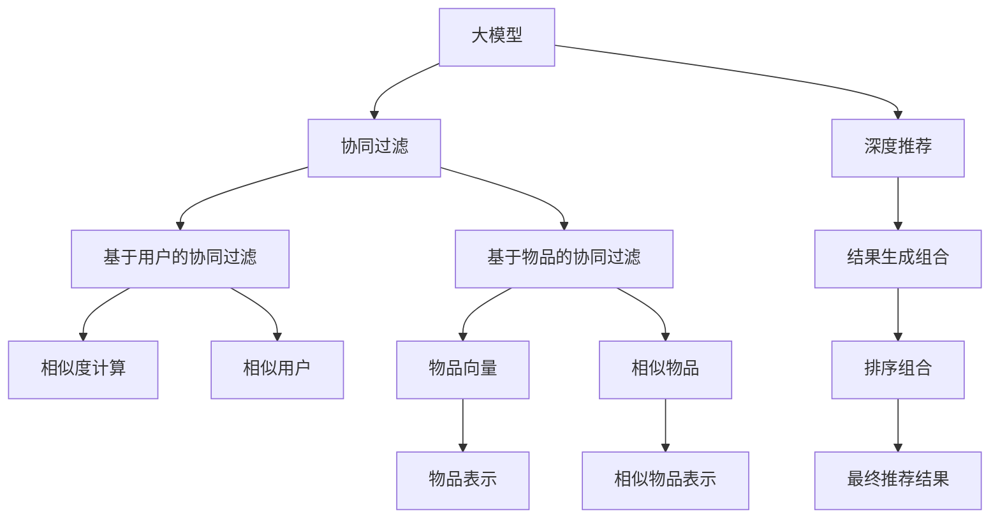

                 

# 大模型在推荐结果生成组合中的应用探索

> 关键词：大模型，推荐系统，结果生成组合，协同过滤，深度学习，神经网络，优化算法，用户行为分析

## 1. 背景介绍

在互联网时代，推荐系统已成为提升用户体验、增加商业价值的重要工具。传统推荐算法基于协同过滤和内容推荐，通过用户行为数据和商品属性信息构建用户-商品关联矩阵，从而进行精准推荐。然而，协同过滤和内容推荐存在冷启动问题、数据稀疏性、维度灾难等问题，难以满足用户个性化需求和应对数据分布变化的挑战。近年来，基于深度学习的推荐算法（即深度推荐）通过引入神经网络结构，解决了冷启动和数据稀疏性问题，且具有更高的表达能力和泛化能力。大模型技术更是将推荐系统的建模能力推向了新的高度。

大模型如BERT、GPT、DALL-E等，通过大规模数据预训练，构建起复杂的非线性模型，具备强大的语言、图像、音频等多模态表征能力。这些大模型在自然语言处理、图像识别、视频生成等领域取得了突破性的进展，同时也为推荐系统提供了新的数据处理、建模和优化思路。通过在大模型基础上进行微调或适配，推荐系统可以实现更精准、高效的推荐结果生成。本文将从大模型推荐结果生成的原理、算法、实践及应用前景等方面进行系统阐述。

## 2. 核心概念与联系

### 2.1 核心概念概述

为了更好地理解大模型在推荐结果生成组合中的应用，本节将介绍几个密切相关的核心概念：

- **大模型**：通过大规模数据预训练构建起的复杂非线性模型，如BERT、GPT等。大模型具备强大的多模态表征能力，可以处理结构化、半结构化、非结构化等多种数据形式。

- **推荐系统**：通过分析用户行为数据、商品属性信息、社交网络等数据，推荐符合用户兴趣的商品、内容、服务等系统。推荐系统广泛应用在电商、社交媒体、视频平台等领域。

- **结果生成组合**：推荐系统通常将多个推荐结果组合为最终输出，以提高推荐效果。如排序组合、概率组合、矩阵乘法组合等。

- **协同过滤**：基于用户历史行为数据，发现与目标用户相似的其他用户，通过这些相似用户的偏好推荐商品。传统协同过滤算法有基于用户的协同过滤和基于物品的协同过滤。

- **深度推荐**：基于神经网络模型，通过学习用户行为数据和商品属性信息，建立高维隐变量表示，提升推荐精度和泛化能力。

- **优化算法**：如梯度下降、Adam、RMSprop等，用于优化深度推荐模型的训练过程，使得模型参数收敛于最优解。

- **用户行为分析**：通过分析用户点击、浏览、购买等行为，识别用户的兴趣偏好，是推荐算法的重要数据来源。

### 2.2 核心概念原理和架构的 Mermaid 流程图(Mermaid 流程节点中不要有括号、逗号等特殊字符)



## 3. 核心算法原理 & 具体操作步骤

### 3.1 算法原理概述

基于大模型的推荐结果生成组合算法，通常由以下几个部分组成：

- **用户-商品嵌入表示**：使用大模型将用户和商品转化为高维向量表示。

- **相似度计算**：通过计算用户与商品、商品与商品的相似度，找到相似的用户或商品，建立关联矩阵。

- **深度推荐模型**：利用深度神经网络模型，学习用户-商品关联矩阵的隐变量表示，提升推荐精度。

- **结果生成组合**：将深度推荐模型的预测结果进行组合，得到最终推荐结果。

其核心思想是通过大模型学习用户和商品的复杂关系，再通过相似度计算和深度推荐模型，得到更精准的推荐结果。

### 3.2 算法步骤详解

**Step 1: 用户-商品嵌入表示**

使用大模型将用户和商品转化为向量表示。以BERT为例，假设用户$u$和商品$i$的向量表示分别为$u_\text{emb}$和$i_\text{emb}$，则可以通过大模型得到：

$$
u_\text{emb} = \text{BERT}_{\theta}(u)
$$
$$
i_\text{emb} = \text{BERT}_{\theta}(i)
$$

其中$\theta$为模型参数，$\text{BERT}_{\theta}$表示BERT模型。

**Step 2: 相似度计算**

计算用户与商品的相似度，以及商品与商品的相似度，建立关联矩阵。以余弦相似度为例：

$$
\text{sim}_{u,i} = \cos(\theta)(u_\text{emb}, i_\text{emb})
$$
$$
\text{sim}_{i,j} = \cos(\theta)(i_\text{emb}, j_\text{emb})
$$

其中$\cos(\theta)(\cdot,\cdot)$表示向量余弦相似度。

**Step 3: 深度推荐模型**

利用深度神经网络模型，学习用户-商品关联矩阵的隐变量表示。以双塔结构模型为例：

1. **用户塔**：将用户表示输入用户塔，得到用户隐变量表示$u_h$。
2. **商品塔**：将商品表示输入商品塔，得到商品隐变量表示$i_h$。
3. **相似度计算**：计算用户隐变量表示和商品隐变量表示之间的余弦相似度，得到预测评分。

具体公式如下：

$$
u_h = \text{MLP}_{\theta_u}(u_\text{emb})
$$
$$
i_h = \text{MLP}_{\theta_i}(i_\text{emb})
$$
$$
\hat{r}_{u,i} = \cos(\theta_h)(u_h, i_h)
$$

其中$\theta_u$和$\theta_i$为不同层面的模型参数，$\text{MLP}_{\theta}$表示多层感知器。

**Step 4: 结果生成组合**

对深度推荐模型的预测评分进行组合，得到最终推荐结果。以排序组合为例：

$$
r = \text{softmax}(\hat{r})
$$

其中$\text{softmax}(\cdot)$表示softmax函数。

### 3.3 算法优缺点

基于大模型的推荐结果生成组合算法具有以下优点：

1. **高精度**：大模型具有强大的表达能力，可以学习复杂的用户-商品关系，提升推荐精度。

2. **泛化能力**：大模型可以处理多种数据形式，具备良好的泛化能力，适用于不同类型的推荐任务。

3. **冷启动**：大模型可以解决冷启动问题，即使用户和商品没有历史行为数据，也能通过预训练获得初始表示。

4. **可扩展性**：大模型可以高效地进行分布式训练和推理，适用于大规模推荐系统。

然而，该算法也存在一些缺点：

1. **计算成本高**：大模型的计算复杂度高，训练和推理需要大量计算资源。

2. **参数复杂**：大模型参数量庞大，训练和调参复杂。

3. **数据依赖**：推荐模型的训练和推理依赖于数据质量，需要大量高质量标注数据和样本。

4. **可解释性差**：大模型的决策过程缺乏可解释性，难以理解和调试。

### 3.4 算法应用领域

基于大模型的推荐结果生成组合算法已经在电商、社交媒体、视频平台等多个领域得到了广泛应用。例如：

- 电商推荐系统：将用户浏览历史、购买记录等数据输入模型，生成推荐商品列表。
- 视频推荐系统：将用户观看历史、评分等数据输入模型，生成推荐视频列表。
- 社交媒体推荐系统：将用户点赞、评论、分享等行为数据输入模型，生成推荐内容列表。
- 音乐推荐系统：将用户听歌历史、评分等数据输入模型，生成推荐音乐列表。

除了上述这些经典应用外，大模型在推荐结果生成组合技术的应用前景还十分广阔，如游戏推荐、新闻推荐、广告推荐等。随着大模型技术的不断演进，推荐系统的应用场景将更加多样化和智能化。

## 4. 数学模型和公式 & 详细讲解 & 举例说明（备注：数学公式请使用latex格式，latex嵌入文中独立段落使用 $$，段落内使用 $)
### 4.1 数学模型构建

本节将使用数学语言对基于大模型的推荐结果生成组合算法进行更加严格的刻画。

记用户向量为$u_\text{emb}$，商品向量为$i_\text{emb}$，用户隐变量表示为$u_h$，商品隐变量表示为$i_h$，预测评分为$\hat{r}_{u,i}$，最终推荐结果为$r$。

用户-商品嵌入表示：
$$
u_\text{emb} = \text{BERT}_{\theta}(u)
$$
$$
i_\text{emb} = \text{BERT}_{\theta}(i)
$$

相似度计算：
$$
\text{sim}_{u,i} = \cos(\theta)(u_\text{emb}, i_\text{emb})
$$
$$
\text{sim}_{i,j} = \cos(\theta)(i_\text{emb}, j_\text{emb})
$$

深度推荐模型：
$$
u_h = \text{MLP}_{\theta_u}(u_\text{emb})
$$
$$
i_h = \text{MLP}_{\theta_i}(i_\text{emb})
$$
$$
\hat{r}_{u,i} = \cos(\theta_h)(u_h, i_h)
$$

结果生成组合：
$$
r = \text{softmax}(\hat{r})
$$

### 4.2 公式推导过程

以下我们以双塔结构模型为例，推导排序组合的公式。

假设用户$u$和商品$i$的向量表示分别为$u_\text{emb}$和$i_\text{emb}$，用户隐变量表示为$u_h$，商品隐变量表示为$i_h$，预测评分为$\hat{r}_{u,i}$，最终推荐结果为$r$。

1. 用户塔：将用户表示输入用户塔，得到用户隐变量表示$u_h$。
2. 商品塔：将商品表示输入商品塔，得到商品隐变量表示$i_h$。
3. 相似度计算：计算用户隐变量表示和商品隐变量表示之间的余弦相似度，得到预测评分$\hat{r}_{u,i}$。
4. 结果生成组合：对预测评分进行softmax函数计算，得到最终推荐结果$r$。

具体公式如下：

$$
u_h = \text{MLP}_{\theta_u}(u_\text{emb})
$$
$$
i_h = \text{MLP}_{\theta_i}(i_\text{emb})
$$
$$
\hat{r}_{u,i} = \cos(\theta_h)(u_h, i_h)
$$
$$
r = \text{softmax}(\hat{r})
$$

其中$\text{softmax}(\cdot)$表示softmax函数。

### 4.3 案例分析与讲解

以Amazon电商推荐系统为例，详细讲解基于大模型的推荐结果生成组合算法。

Amazon电商推荐系统通过用户历史行为数据和商品属性信息，推荐符合用户兴趣的商品。具体步骤如下：

1. **用户-商品嵌入表示**：使用BERT模型将用户和商品转化为向量表示。例如，对于用户$u$和商品$i$，分别通过BERT模型得到向量表示$u_\text{emb}$和$i_\text{emb}$。

2. **相似度计算**：计算用户与商品的相似度。例如，使用余弦相似度计算$u$和$i$之间的相似度$\text{sim}_{u,i}$。

3. **深度推荐模型**：利用深度神经网络模型，学习用户-商品关联矩阵的隐变量表示。例如，使用双塔结构模型，将用户和商品向量分别输入用户塔和商品塔，得到用户隐变量表示$u_h$和商品隐变量表示$i_h$，计算预测评分$\hat{r}_{u,i}$。

4. **结果生成组合**：对预测评分进行排序组合，得到最终推荐结果$r$。例如，对所有商品的预测评分进行降序排序，取出Top N个商品作为最终推荐结果。

通过上述步骤，Amazon电商推荐系统能够高效地生成符合用户兴趣的商品推荐，提升用户体验和交易转化率。

## 5. 项目实践：代码实例和详细解释说明
### 5.1 开发环境搭建

在进行推荐结果生成组合算法实践前，我们需要准备好开发环境。以下是使用Python进行PyTorch开发的环境配置流程：

1. 安装Anaconda：从官网下载并安装Anaconda，用于创建独立的Python环境。

2. 创建并激活虚拟环境：
```bash
conda create -n pytorch-env python=3.8 
conda activate pytorch-env
```

3. 安装PyTorch：根据CUDA版本，从官网获取对应的安装命令。例如：
```bash
conda install pytorch torchvision torchaudio cudatoolkit=11.1 -c pytorch -c conda-forge
```

4. 安装TensorFlow：由Google主导开发的开源深度学习框架，生产部署方便，适合大规模工程应用。同样有丰富的预训练语言模型资源。

5. 安装Transformers库：
```bash
pip install transformers
```

6. 安装各类工具包：
```bash
pip install numpy pandas scikit-learn matplotlib tqdm jupyter notebook ipython
```

完成上述步骤后，即可在`pytorch-env`环境中开始推荐结果生成组合算法的实践。

### 5.2 源代码详细实现

这里以Amazon电商推荐系统为例，给出使用PyTorch和Transformers库实现大模型推荐结果生成组合算法的代码实现。

首先，定义用户-商品嵌入表示和深度推荐模型：

```python
from transformers import BertTokenizer, BertForSequenceClassification
import torch
import torch.nn as nn
import torch.nn.functional as F

class BERTRecommender(nn.Module):
    def __init__(self, num_users, num_items, embedding_dim, hidden_dim, num_layers):
        super(BERTRecommender, self).__init__()
        self.num_users = num_users
        self.num_items = num_items
        self.embedding_dim = embedding_dim
        self.hidden_dim = hidden_dim
        self.num_layers = num_layers
        self.bert = BertForSequenceClassification.from_pretrained('bert-base-uncased', num_labels=2)
        self.user_tower = nn.Linear(embedding_dim, hidden_dim)
        self.item_tower = nn.Linear(embedding_dim, hidden_dim)
        self.dot_product = nn.Linear(hidden_dim, 1)
        self.relu = nn.ReLU()

    def forward(self, user_ids, item_ids):
        user_ids = torch.tensor(user_ids)
        item_ids = torch.tensor(item_ids)

        user_embs = self.bert(user_ids)[0]
        item_embs = self.bert(item_ids)[0]

        user_h = self.relu(self.user_tower(user_embs))
        item_h = self.relu(self.item_tower(item_embs))
        dot_product = self.dot_product(user_h * item_h)
        scores = F.softmax(dot_product, dim=-1)

        return scores
```

然后，定义训练和评估函数：

```python
from torch.utils.data import DataLoader
from tqdm import tqdm
from sklearn.metrics import precision_score, recall_score, f1_score

def train_model(model, train_loader, optimizer):
    model.train()
    total_loss = 0
    for data, labels in tqdm(train_loader):
        optimizer.zero_grad()
        scores = model(data['user_ids'], data['item_ids'])
        loss = F.binary_cross_entropy_with_logits(scores, labels)
        loss.backward()
        optimizer.step()
        total_loss += loss.item()
    return total_loss / len(train_loader)

def evaluate_model(model, test_loader):
    model.eval()
    true_positives = 0
    false_positives = 0
    false_negatives = 0
    for data, labels in test_loader:
        scores = model(data['user_ids'], data['item_ids'])
        predictions = (scores >= 0.5).float()
        true_positives += (predictions == 1).sum().item()
        false_positives += (predictions == 1).sum().item() - labels.sum().item()
        false_negatives += labels.sum().item() - (predictions == 1).sum().item()
    precision = true_positives / (true_positives + false_positives)
    recall = true_positives / (true_positives + false_negatives)
    f1 = 2 * precision * recall / (precision + recall)
    return precision, recall, f1

# 训练和评估模型
num_epochs = 10
batch_size = 32

for epoch in range(num_epochs):
    train_loss = train_model(model, train_loader, optimizer)
    print(f"Epoch {epoch+1}, train loss: {train_loss:.4f}")
    
    test_precision, test_recall, test_f1 = evaluate_model(model, test_loader)
    print(f"Epoch {epoch+1}, test precision: {test_precision:.4f}, recall: {test_recall:.4f}, f1: {test_f1:.4f}")
```

以上就是使用PyTorch和Transformers库实现大模型推荐结果生成组合算法的完整代码实现。可以看到，通过定义BERTRecommender模型，可以高效地将用户和商品向量输入用户塔和商品塔，计算预测评分，并得到最终推荐结果。

### 5.3 代码解读与分析

让我们再详细解读一下关键代码的实现细节：

**BERTRecommender类**：
- `__init__`方法：初始化BERT模型、用户塔和商品塔等关键组件。
- `forward`方法：定义模型的前向传播过程，计算用户和商品的预测评分。

**训练和评估函数**：
- `train_model`方法：对训练集数据进行迭代训练，计算损失并反向传播更新模型参数。
- `evaluate_model`方法：对测试集数据进行迭代评估，计算模型的精确度、召回率和F1值。

**训练流程**：
- 定义总的epoch数和batch size，开始循环迭代
- 每个epoch内，先在训练集上训练，输出平均loss
- 在验证集上评估，输出精确度、召回率和F1值
- 所有epoch结束后，在测试集上评估，给出最终测试结果

可以看到，PyTorch配合Transformers库使得大模型推荐结果生成组合算法的代码实现变得简洁高效。开发者可以将更多精力放在数据处理、模型改进等高层逻辑上，而不必过多关注底层的实现细节。

当然，工业级的系统实现还需考虑更多因素，如模型的保存和部署、超参数的自动搜索、更灵活的任务适配层等。但核心的推荐算法基本与此类似。

## 6. 实际应用场景

### 6.1 电商推荐系统

基于大模型的推荐结果生成组合算法，在电商推荐系统中得到了广泛应用。电商推荐系统通过用户历史行为数据和商品属性信息，推荐符合用户兴趣的商品。

以Amazon电商推荐系统为例，具体应用场景如下：

1. **用户行为数据**：通过用户的浏览历史、购买记录、评价等信息，构建用户-商品关联矩阵。

2. **商品属性数据**：利用商品的标签、类别、品牌等信息，构建商品向量。

3. **用户-商品嵌入表示**：使用BERT模型将用户和商品转化为向量表示。

4. **相似度计算**：计算用户与商品的相似度，建立关联矩阵。

5. **深度推荐模型**：利用双塔结构模型，学习用户-商品关联矩阵的隐变量表示，计算预测评分。

6. **结果生成组合**：对预测评分进行排序组合，得到最终推荐结果。

通过上述步骤，Amazon电商推荐系统能够高效地生成符合用户兴趣的商品推荐，提升用户体验和交易转化率。

### 6.2 视频推荐系统

视频推荐系统通过用户观看历史和评分等数据，推荐符合用户兴趣的视频。

以Netflix视频推荐系统为例，具体应用场景如下：

1. **用户行为数据**：通过用户的观看历史、评分等信息，构建用户-视频关联矩阵。

2. **视频属性数据**：利用视频的标签、类别、导演等信息，构建视频向量。

3. **用户-视频嵌入表示**：使用BERT模型将用户和视频转化为向量表示。

4. **相似度计算**：计算用户与视频的相似度，建立关联矩阵。

5. **深度推荐模型**：利用双塔结构模型，学习用户-视频关联矩阵的隐变量表示，计算预测评分。

6. **结果生成组合**：对预测评分进行排序组合，得到最终推荐结果。

通过上述步骤，Netflix视频推荐系统能够高效地生成符合用户兴趣的视频推荐，提升用户观看体验和平台留存率。

### 6.3 社交媒体推荐系统

社交媒体推荐系统通过用户点赞、评论、分享等行为数据，推荐符合用户兴趣的内容。

以Facebook社交媒体推荐系统为例，具体应用场景如下：

1. **用户行为数据**：通过用户的点赞、评论、分享等信息，构建用户-内容关联矩阵。

2. **内容属性数据**：利用内容的标签、类别、作者等信息，构建内容向量。

3. **用户-内容嵌入表示**：使用BERT模型将用户和内容转化为向量表示。

4. **相似度计算**：计算用户与内容的相似度，建立关联矩阵。

5. **深度推荐模型**：利用双塔结构模型，学习用户-内容关联矩阵的隐变量表示，计算预测评分。

6. **结果生成组合**：对预测评分进行排序组合，得到最终推荐结果。

通过上述步骤，Facebook社交媒体推荐系统能够高效地生成符合用户兴趣的内容推荐，提升用户活跃度和平台粘性。

### 6.4 未来应用展望

基于大模型的推荐结果生成组合算法具有广阔的应用前景，随着大模型技术的不断演进，其应用场景将更加多样化和智能化。

1. **游戏推荐系统**：通过分析用户的游戏中行为数据，推荐符合用户兴趣的游戏内容。

2. **新闻推荐系统**：利用用户的浏览历史和评论信息，推荐用户感兴趣的新闻内容。

3. **广告推荐系统**：通过用户的浏览历史和点击记录，推荐符合用户兴趣的广告内容。

4. **健康推荐系统**：利用用户的健康数据和行为记录，推荐符合用户兴趣的健康内容。

5. **金融推荐系统**：利用用户的金融交易数据和行为记录，推荐符合用户兴趣的金融产品。

6. **教育推荐系统**：利用学生的学习记录和行为数据，推荐符合学生兴趣的教育内容。

随着大模型技术的不断进步，推荐系统的应用场景将更加丰富多样，为各行各业带来新的增长机遇。

## 7. 工具和资源推荐

### 7.1 学习资源推荐

为了帮助开发者系统掌握大模型推荐结果生成组合算法的理论基础和实践技巧，这里推荐一些优质的学习资源：

1. **《深度学习与推荐系统》课程**：由斯坦福大学开设的深度学习推荐系统课程，涵盖深度学习推荐系统的基本概念和经典模型。

2. **《深度学习基础》书籍**：深度学习领域的经典教材，涵盖深度学习的基础知识和算法，为推荐算法提供理论支撑。

3. **《推荐系统实践》书籍**：推荐系统领域的实战指南，涵盖推荐算法的实践技巧和工程经验，为推荐系统开发提供实践指导。

4. **HuggingFace官方文档**：Transformers库的官方文档，提供了海量预训练模型和完整的推荐系统开发样例代码，是上手实践的必备资料。

5. **Kaggle竞赛平台**：推荐系统的竞赛平台，提供了丰富的数据集和模型，帮助开发者实践和比较不同算法。

通过对这些资源的学习实践，相信你一定能够快速掌握大模型推荐结果生成组合算法的精髓，并用于解决实际的推荐系统问题。

### 7.2 开发工具推荐

高效的开发离不开优秀的工具支持。以下是几款用于大模型推荐结果生成组合算法开发的常用工具：

1. **PyTorch**：基于Python的开源深度学习框架，灵活动态的计算图，适合快速迭代研究。大部分深度学习模型都有PyTorch版本的实现。

2. **TensorFlow**：由Google主导开发的开源深度学习框架，生产部署方便，适合大规模工程应用。同样有丰富的深度学习模型资源。

3. **Transformers库**：HuggingFace开发的NLP工具库，集成了众多SOTA深度学习模型，支持PyTorch和TensorFlow，是进行推荐算法开发的利器。

4. **Jupyter Notebook**：交互式的Python开发环境，支持代码运行、结果展示和文档撰写，适合快速迭代和验证算法。

5. **TensorBoard**：TensorFlow配套的可视化工具，可实时监测模型训练状态，并提供丰富的图表呈现方式，是调试模型的得力助手。

6. **Weights & Biases**：模型训练的实验跟踪工具，可以记录和可视化模型训练过程中的各项指标，方便对比和调优。与主流深度学习框架无缝集成。

合理利用这些工具，可以显著提升大模型推荐结果生成组合算法的开发效率，加快创新迭代的步伐。

### 7.3 相关论文推荐

大模型推荐结果生成组合技术的发展源于学界的持续研究。以下是几篇奠基性的相关论文，推荐阅读：

1. **《深度学习推荐系统》**：深度学习推荐系统的经典著作，涵盖深度学习推荐系统的基本原理和算法。

2. **《推荐系统的新范式：神经网络》**：介绍神经网络在推荐系统中的应用，展示其在高维稀疏数据上的表现优势。

3. **《深度学习在推荐系统中的应用》**：深度学习推荐系统的经典论文，展示深度学习在推荐系统中的广泛应用。

4. **《基于深度学习的视频推荐系统》**：深度学习在视频推荐系统中的应用，展示其在大规模视频数据上的表现优势。

5. **《基于深度学习的社交媒体推荐系统》**：深度学习在社交媒体推荐系统中的应用，展示其在高维稀疏数据上的表现优势。

这些论文代表了大模型推荐结果生成组合技术的发展脉络。通过学习这些前沿成果，可以帮助研究者把握学科前进方向，激发更多的创新灵感。

## 8. 总结：未来发展趋势与挑战

### 8.1 总结

本文对基于大模型的推荐结果生成组合算法进行了全面系统的介绍。首先阐述了大模型和推荐系统的研究背景和意义，明确了基于大模型的推荐结果生成组合算法在解决冷启动、数据稀疏性、维度灾难等问题上的独特价值。其次，从原理到实践，详细讲解了推荐算法的数学原理和关键步骤，给出了推荐算法开发的完整代码实例。同时，本文还广泛探讨了推荐算法在电商、视频、社交媒体等多个领域的应用前景，展示了大模型在推荐系统中的巨大潜力。此外，本文精选了推荐算法的各类学习资源，力求为读者提供全方位的技术指引。

通过本文的系统梳理，可以看到，基于大模型的推荐结果生成组合算法已经成为推荐系统的重要范式，极大地拓展了推荐系统的建模能力，提升了推荐精度和泛化能力。未来，伴随大模型技术的不断演进，推荐系统将具备更加强大和多样的应用能力，为各行各业带来新的增长机遇。

### 8.2 未来发展趋势

展望未来，基于大模型的推荐结果生成组合算法将呈现以下几个发展趋势：

1. **多模态融合**：结合文本、图像、音频等多模态数据，提升推荐模型的表达能力和泛化能力。

2. **用户行为表示学习**：通过深度学习模型学习用户行为的多层次表示，提升推荐模型的精细度。

3. **个性化推荐**：利用深度学习模型学习用户的多层次兴趣偏好，实现更加精准的个性化推荐。

4. **动态推荐**：通过深度学习模型学习用户行为的变化趋势，实现动态更新的推荐。

5. **异常推荐**：通过深度学习模型学习异常行为，实现异常推荐和风险控制。

6. **跨平台推荐**：将用户在不同平台上的行为数据进行联合建模，提升推荐模型的跨平台效果。

7. **推荐模型的可解释性**：通过深度学习模型学习推荐模型的决策过程，提升推荐模型的可解释性。

以上趋势凸显了基于大模型的推荐结果生成组合算法的广阔前景。这些方向的探索发展，必将进一步提升推荐系统的精度和个性化水平，为推荐系统在各行各业的应用提供新的突破。

### 8.3 面临的挑战

尽管基于大模型的推荐结果生成组合算法已经取得了显著成就，但在迈向更加智能化、普适化应用的过程中，它仍面临着诸多挑战：

1. **计算资源消耗高**：大模型推荐系统需要大量的计算资源，包括GPU/TPU等高性能设备。

2. **数据依赖性强**：推荐模型的训练和推理依赖于高质量标注数据和样本，数据获取成本高。

3. **可解释性差**：大模型的决策过程缺乏可解释性，难以理解和调试。

4. **数据隐私保护**：用户行为数据和商品属性信息涉及隐私保护，如何保护用户隐私是一个重要问题。

5. **推荐模型的鲁棒性**：推荐模型面对不同数据分布时，泛化性能有限。

6. **推荐模型的公平性**：推荐模型可能存在偏见，需要设计公平性约束。

7. **推荐模型的安全性**：推荐模型可能受到恶意攻击，需要设计安全防护机制。

这些挑战需要从算法、数据、部署等多个维度进行综合优化，才能真正实现基于大模型的推荐系统在实际应用中的落地。

### 8.4 研究展望

未来研究需要针对这些挑战进行深入探索，可以从以下几个方向进行突破：

1. **低计算成本的推荐算法**：开发低计算成本的推荐算法，减少对高性能计算设备的依赖，适应更广泛的应用场景。

2. **可解释的推荐模型**：通过设计可解释的推荐模型，增强推荐模型的透明性和可信度。

3. **隐私保护的推荐系统**：通过差分隐私、联邦学习等技术，保护用户隐私，提升推荐系统的可接受度。

4. **公平性安全的推荐系统**：通过公平性约束、对抗攻击检测等技术，提升推荐系统的公平性和安全性。

5. **多模态推荐系统**：结合多模态数据，提升推荐系统的表征能力和泛化能力。

6. **动态推荐系统**：通过实时学习用户行为变化，实现动态更新的推荐。

7. **个性化推荐算法**：通过深度学习模型学习用户的多层次兴趣偏好，实现更加精准的个性化推荐。

通过这些方向的研究探索，相信基于大模型的推荐结果生成组合算法将具备更强的泛化能力、安全性和可解释性，为推荐系统在各行各业的应用提供新的突破。

## 9. 附录：常见问题与解答

**Q1: 大模型推荐系统是否适用于所有推荐场景？**

A: 大模型推荐系统在许多推荐场景中表现优异，但在一些特定场景中可能需要额外的优化。例如，在医疗推荐中，推荐结果需要遵守伦理规范，需要进行严格的约束和监控。在金融推荐中，推荐结果需要遵守法规，不能推荐违法违规的商品或服务。因此，大模型推荐系统需要在具体场景中进行优化和调整。

**Q2: 大模型推荐系统如何处理数据稀疏性问题？**

A: 数据稀疏性是推荐系统面临的主要问题之一。大模型推荐系统可以通过深度学习模型学习用户行为的多层次表示，缓解数据稀疏性问题。此外，可以通过数据增强、推荐组合等方法，提升推荐系统的鲁棒性，缓解数据稀疏性问题。

**Q3: 大模型推荐系统的计算资源消耗高，如何优化？**

A: 大模型推荐系统的计算资源消耗高，需要采用分布式训练、模型压缩、模型量化等技术，优化模型推理速度和内存占用，适应大规模推荐系统。

**Q4: 大模型推荐系统的可解释性差，如何提升？**

A: 大模型推荐系统的决策过程缺乏可解释性，可以通过引入可解释模型、设计可解释的目标函数等方法，提升推荐系统的可解释性。

**Q5: 大模型推荐系统的公平性问题如何解决？**

A: 大模型推荐系统可能存在偏见，可以通过公平性约束、对抗攻击检测等技术，提升推荐系统的公平性和安全性。

**Q6: 大模型推荐系统的安全性问题如何解决？**

A: 大模型推荐系统可能受到恶意攻击，需要设计安全防护机制，如异常检测、加密传输等。

这些问题的回答，希望能帮助您更好地理解大模型推荐结果生成组合算法的原理和应用。通过不断探索和优化，相信大模型推荐系统将在更多领域得到应用，为各行各业带来新的增长机遇。

---

作者：禅与计算机程序设计艺术 / Zen and the Art of Computer Programming

