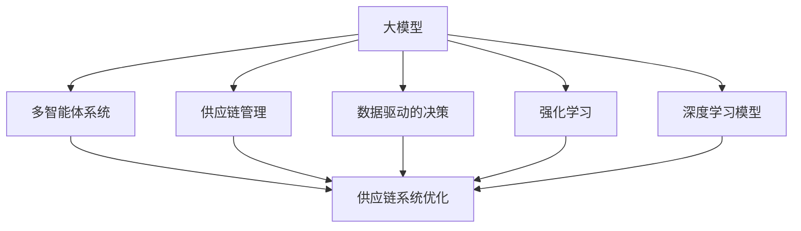

                 

# 大模型在电商平台供应链优化中的应用

## 1. 背景介绍

### 1.1 问题由来
随着电商平台的快速发展，供应链管理的复杂性日益增加。传统的供应链管理依靠经验丰富的运营人员进行人工调整，但面对海量订单和瞬息万变的市场环境，人工调整已经难以满足实时性和准确性的要求。而现代物流和零售业的兴起，使得对供应链系统的智能优化成为必然。

### 1.2 问题核心关键点
基于此背景，本文旨在探讨如何利用大模型对电商平台供应链进行智能优化。大模型具备强大的数据处理能力和泛化能力，可以基于海量的历史数据和实时数据，通过深度学习和优化算法，自动调整供应链的各个环节，实现智能决策和优化。

## 2. 核心概念与联系

### 2.1 核心概念概述

为更好地理解大模型在供应链优化中的应用，本节将介绍几个密切相关的核心概念：

- 大模型(大规模预训练语言模型，Large Language Model, LLM)：以自回归(如GPT)或自编码(如BERT)模型为代表的大规模预训练模型。通过在大规模无标签文本语料上进行预训练，学习到丰富的语言知识和常识，具备强大的数据处理能力。

- 供应链管理：对产品从生产到交付的全生命周期进行计划、组织、协调、控制和管理的过程。包括供应商管理、库存管理、物流配送等环节。

- 数据驱动的决策：利用数据对供应链的各个环节进行量化分析，辅助决策者制定最优策略，降低人工干预，提高运营效率。

- 强化学习(Reinforcement Learning, RL)：通过奖励和惩罚机制，让模型在虚拟环境中自主学习，逐步优化供应链决策过程。

- 深度学习模型(Deep Learning Model)：利用神经网络模型处理复杂非线性的数据，通过学习数据特征进行决策优化。

- 多智能体系统(Multi-Agent System)：多个智能体通过信息共享和协作，共同管理供应链系统，以实现更高效、更稳定的运营。

这些核心概念之间的逻辑关系可以通过以下Mermaid流程图来展示：



这个流程图展示了大模型与其他核心概念之间的联系，以及其在供应链优化中的应用路径。

## 3. 核心算法原理 & 具体操作步骤
### 3.1 算法原理概述

基于大模型的供应链优化，其核心思想是通过对历史订单数据和实时数据的分析，利用深度学习和大模型对供应链进行智能决策和优化。具体过程包括：

1. **数据预处理**：收集和整理供应链系统中的历史订单数据、库存数据、物流数据等，进行数据清洗和标准化处理。

2. **模型训练**：选择合适的预训练模型，在供应链相关数据集上进行微调训练，得到适用于特定供应链场景的优化模型。

3. **实时优化**：在实时订单数据和市场变化信息的基础上，利用训练好的模型进行实时预测和决策优化，调整供应链的各个环节。

4. **动态调整**：根据优化效果，不断调整模型参数和优化策略，提高供应链系统的稳定性和响应速度。

### 3.2 算法步骤详解

基于大模型的供应链优化通常包括以下几个关键步骤：

**Step 1: 数据收集与预处理**

- **收集数据**：从供应链系统的各个环节收集相关的历史和实时数据，包括订单、库存、物流、供应商信息等。

- **数据清洗**：去除缺失、重复、异常的数据，对数据进行标准化处理，如归一化、标准化等，确保数据质量。

- **数据划分**：将数据集划分为训练集、验证集和测试集，用于模型的训练、调参和评估。

**Step 2: 模型训练与微调**

- **选择模型**：根据供应链系统的复杂度和需求，选择适合的预训练语言模型，如BERT、GPT-2、GPT-3等。

- **任务适配**：设计任务的适配层，将大模型适配到供应链优化任务中，如库存管理、配送路线优化等。

- **参数调整**：选择合适的优化算法和超参数，如Adam、SGD等，设定学习率、批大小、迭代次数等。

- **模型训练**：使用训练集对模型进行微调训练，不断更新模型参数以提高预测精度和优化效果。

- **验证评估**：在验证集上评估模型的性能，根据评估结果调整超参数和模型结构，避免过拟合。

**Step 3: 实时优化与动态调整**

- **实时数据处理**：收集实时订单数据和市场变化信息，如库存量、订单量、物流状态等。

- **模型预测**：将实时数据输入到训练好的模型中，进行预测和决策优化，生成最优的供应链调整方案。

- **动态调整**：根据模型预测结果和优化效果，动态调整供应链系统中的各个环节，如库存补货、配送路线、供应商选择等。

- **效果监控**：实时监控供应链系统的运行状态，及时发现和解决问题，确保供应链系统的稳定性和高效性。

**Step 4: 模型部署与迭代优化**

- **模型部署**：将训练好的模型部署到生产环境中，与供应链系统进行对接，实现实时优化。

- **效果评估**：在测试集上评估模型的效果，对比微调前后的供应链优化效果，进行指标对比。

- **迭代优化**：根据评估结果，不断调整模型参数和优化策略，提升供应链系统的优化效果和响应速度。

### 3.3 算法优缺点

基于大模型的供应链优化方法具有以下优点：

- **高效性**：利用大模型的强大处理能力，可以快速处理海量数据，实现实时优化。

- **适应性**：大模型具备泛化能力，可以适应各种供应链场景和市场变化，灵活调整供应链策略。

- **自适应性**：通过强化学习和深度学习，模型可以在实际应用中不断学习新的知识和经验，提高优化效果。

- **准确性**：深度学习模型通过学习数据特征，可以提供更准确和可靠的预测和优化建议。

但同时，该方法也存在一些缺点：

- **依赖数据质量**：供应链优化依赖于高质量的数据输入，数据的缺失、噪声和偏差会影响模型的性能。

- **模型复杂性**：大模型的训练和优化过程复杂，需要大量的计算资源和时间。

- **解释性不足**：大模型的决策过程通常是黑箱，难以解释和调试，难以满足某些业务场景的透明性需求。

- **可扩展性**：供应链系统复杂，单一的大模型可能难以全面覆盖所有环节，需要结合多个模型进行综合优化。

### 3.4 算法应用领域

基于大模型的供应链优化方法广泛应用于电商平台的供应链管理中，如：

- **库存管理**：预测库存量，自动生成补货方案，避免库存过剩或缺货现象。

- **配送路线优化**：根据订单分布和交通情况，优化配送路线，降低物流成本和配送时间。

- **供应商管理**：评估供应商的绩效和可靠性，动态调整供应商选择策略，提升供应链的稳定性。

- **需求预测**：通过分析历史订单数据和市场趋势，预测未来需求，指导生产计划和库存管理。

- **异常监测**：实时监测供应链系统的异常情况，如订单量异常、物流延误等，及时采取措施解决问题。

## 4. 数学模型和公式 & 详细讲解 & 举例说明

### 4.1 数学模型构建

本节将使用数学语言对基于大模型的供应链优化过程进行更加严格的刻画。

记供应链系统为 $S$，其状态由订单数据 $O$、库存数据 $I$、物流数据 $L$、供应商数据 $V$ 等组成。设供应链系统状态为 $s=(s_O,s_I,s_L,s_V)$，其中 $s_O$ 表示订单数据，$s_I$ 表示库存数据，$s_L$ 表示物流数据，$s_V$ 表示供应商数据。

定义供应链系统优化目标为最小化总成本 $C(s)$，包括生产成本、库存成本、物流成本和供应商成本等。优化目标为：

$$
\min_{s} C(s) = C_{prod}(s_O,s_I,s_V) + C_{inv}(s_I) + C_{log}(s_L) + C_{sup}(s_V)
$$

其中 $C_{prod}$ 表示生产成本，$C_{inv}$ 表示库存成本，$C_{log}$ 表示物流成本，$C_{sup}$ 表示供应商成本。

### 4.2 公式推导过程

以下我们以库存管理为例，推导最小化库存成本的优化公式。

设订单量为 $Q$，库存量为 $I$，固定订货成本为 $C_f$，单位保管成本为 $C_h$，则库存成本 $C_{inv}$ 可以表示为：

$$
C_{inv} = C_f + C_h \times I
$$

假设订单和库存服从一定分布，可以通过历史订单数据和库存数据，使用统计学方法估计其分布参数。然后，使用深度学习模型 $M_{\theta}$ 对订单量和库存量进行预测，得到最优的订货量 $I^*$：

$$
I^* = \mathop{\arg\min}_{I} \left( C_f + C_h \times I \right)
$$

通过求解上述优化问题，可以确定最优的订货量和库存量，降低供应链系统的总成本。

### 4.3 案例分析与讲解

假设某电商平台有一批产品需要从供应商处采购，根据历史订单数据和库存数据，使用大模型进行需求预测，得到未来30天的订单量分布。通过深度学习模型对库存量进行优化，预测最优的订货量和库存量，从而实现供应链系统的智能优化。

具体实现步骤如下：

1. **数据准备**：收集过去一年的订单数据和库存数据，对其进行清洗和标准化处理，划分为训练集和测试集。

2. **模型训练**：选择BERT模型，在训练集上对其进行微调训练，得到适用于供应链需求预测的模型 $M_{\theta}$。

3. **需求预测**：使用训练好的模型对未来30天的订单量进行预测，得到订单量分布 $Q_t$。

4. **库存优化**：使用最小化库存成本的优化公式，计算最优的订货量 $I^*$ 和库存量 $I_t$，确保供应链系统始终处于最优状态。

5. **效果评估**：在测试集上评估模型的效果，对比微调前后的库存成本和物流成本，进行指标对比。

## 5. 项目实践：代码实例和详细解释说明

### 5.1 开发环境搭建

在进行供应链优化项目开发前，我们需要准备好开发环境。以下是使用Python进行PyTorch开发的环境配置流程：

1. 安装Anaconda：从官网下载并安装Anaconda，用于创建独立的Python环境。

2. 创建并激活虚拟环境：
```bash
conda create -n supply-chain-env python=3.8 
conda activate supply-chain-env
```

3. 安装PyTorch：根据CUDA版本，从官网获取对应的安装命令。例如：
```bash
conda install pytorch torchvision torchaudio cudatoolkit=11.1 -c pytorch -c conda-forge
```

4. 安装Transformers库：
```bash
pip install transformers
```

5. 安装各类工具包：
```bash
pip install numpy pandas scikit-learn matplotlib tqdm jupyter notebook ipython
```

完成上述步骤后，即可在`supply-chain-env`环境中开始供应链优化项目的开发。

### 5.2 源代码详细实现

下面我们以库存管理为例，给出使用Transformers库对BERT模型进行供应链优化微调的PyTorch代码实现。

首先，定义需求预测的数据处理函数：

```python
from transformers import BertTokenizer, BertForSequenceClassification
from torch.utils.data import Dataset
import torch

class DemandPredictDataset(Dataset):
    def __init__(self, texts, labels, tokenizer, max_len=128):
        self.texts = texts
        self.labels = labels
        self.tokenizer = tokenizer
        self.max_len = max_len
        
    def __len__(self):
        return len(self.texts)
    
    def __getitem__(self, item):
        text = self.texts[item]
        label = self.labels[item]
        
        encoding = self.tokenizer(text, return_tensors='pt', max_length=self.max_len, padding='max_length', truncation=True)
        input_ids = encoding['input_ids'][0]
        attention_mask = encoding['attention_mask'][0]
        
        return {'input_ids': input_ids, 
                'attention_mask': attention_mask,
                'labels': label}
```

然后，定义模型和优化器：

```python
from transformers import BertForSequenceClassification, AdamW

model = BertForSequenceClassification.from_pretrained('bert-base-cased', num_labels=2)

optimizer = AdamW(model.parameters(), lr=2e-5)
```

接着，定义训练和评估函数：

```python
from torch.utils.data import DataLoader
from tqdm import tqdm
from sklearn.metrics import classification_report

device = torch.device('cuda') if torch.cuda.is_available() else torch.device('cpu')
model.to(device)

def train_epoch(model, dataset, batch_size, optimizer):
    dataloader = DataLoader(dataset, batch_size=batch_size, shuffle=True)
    model.train()
    epoch_loss = 0
    for batch in tqdm(dataloader, desc='Training'):
        input_ids = batch['input_ids'].to(device)
        attention_mask = batch['attention_mask'].to(device)
        labels = batch['labels'].to(device)
        model.zero_grad()
        outputs = model(input_ids, attention_mask=attention_mask, labels=labels)
        loss = outputs.loss
        epoch_loss += loss.item()
        loss.backward()
        optimizer.step()
    return epoch_loss / len(dataloader)

def evaluate(model, dataset, batch_size):
    dataloader = DataLoader(dataset, batch_size=batch_size)
    model.eval()
    preds, labels = [], []
    with torch.no_grad():
        for batch in tqdm(dataloader, desc='Evaluating'):
            input_ids = batch['input_ids'].to(device)
            attention_mask = batch['attention_mask'].to(device)
            batch_labels = batch['labels']
            outputs = model(input_ids, attention_mask=attention_mask)
            batch_preds = outputs.logits.argmax(dim=2).to('cpu').tolist()
            batch_labels = batch_labels.to('cpu').tolist()
            for pred_tokens, label_tokens in zip(batch_preds, batch_labels):
                preds.append(pred_tokens)
                labels.append(label_tokens)
                
    print(classification_report(labels, preds))
```

最后，启动训练流程并在测试集上评估：

```python
epochs = 5
batch_size = 16

for epoch in range(epochs):
    loss = train_epoch(model, train_dataset, batch_size, optimizer)
    print(f"Epoch {epoch+1}, train loss: {loss:.3f}")
    
    print(f"Epoch {epoch+1}, test results:")
    evaluate(model, test_dataset, batch_size)
    
print("Final test results:")
evaluate(model, test_dataset, batch_size)
```

以上就是使用PyTorch对BERT进行供应链优化任务微调的完整代码实现。可以看到，得益于Transformers库的强大封装，我们可以用相对简洁的代码完成BERT模型的加载和微调。

### 5.3 代码解读与分析

让我们再详细解读一下关键代码的实现细节：

**DemandPredictDataset类**：
- `__init__`方法：初始化文本、标签、分词器等关键组件。
- `__len__`方法：返回数据集的样本数量。
- `__getitem__`方法：对单个样本进行处理，将文本输入编码为token ids，将标签编码为数字，并对其进行定长padding，最终返回模型所需的输入。

**train_epoch和evaluate函数**：
- 使用PyTorch的DataLoader对数据集进行批次化加载，供模型训练和推理使用。
- 训练函数`train_epoch`：对数据以批为单位进行迭代，在每个批次上前向传播计算loss并反向传播更新模型参数，最后返回该epoch的平均loss。
- 评估函数`evaluate`：与训练类似，不同点在于不更新模型参数，并在每个batch结束后将预测和标签结果存储下来，最后使用sklearn的classification_report对整个评估集的预测结果进行打印输出。

**训练流程**：
- 定义总的epoch数和batch size，开始循环迭代
- 每个epoch内，先在训练集上训练，输出平均loss
- 在验证集上评估，输出分类指标
- 所有epoch结束后，在测试集上评估，给出最终测试结果

可以看到，PyTorch配合Transformers库使得BERT微调的代码实现变得简洁高效。开发者可以将更多精力放在数据处理、模型改进等高层逻辑上，而不必过多关注底层的实现细节。

当然，工业级的系统实现还需考虑更多因素，如模型的保存和部署、超参数的自动搜索、更灵活的任务适配层等。但核心的微调范式基本与此类似。

## 6. 实际应用场景

### 6.1 智能仓储管理

智能仓储管理系统是电商平台供应链优化中的重要环节。通过大模型的智能预测和优化，可以实现仓储管理自动化，减少人工干预，提高仓储效率和准确性。

具体而言，可以收集仓库中的存储量、订单量、供应商配送时间等数据，作为模型输入，训练出基于BERT等大模型的预测模型。模型可以根据当前库存和预测订单量，自动计算最佳的补货策略，避免库存过剩或缺货现象。

### 6.2 配送路径优化

配送路径优化是电商平台供应链管理的另一大关键环节。通过优化配送路径，可以降低物流成本，提升配送效率。

在实际应用中，可以使用大模型预测每个配送节点的需求量和配送时间，结合实时交通数据，进行路径规划和优化。使用强化学习等方法，模型可以实时调整配送路径，实现最优的配送方案。

### 6.3 供应商管理

供应商管理是电商平台供应链优化的核心任务之一。通过大模型的智能分析和评估，可以优化供应商选择和合作策略，提升供应链的稳定性和可靠性。

具体而言，可以收集供应商的历史业绩、服务质量、响应速度等数据，训练出基于BERT等大模型的供应商评估模型。模型可以根据这些数据，预测供应商未来的表现，优化供应商选择和合作策略，减少供应商风险，提升供应链的稳定性和可靠性。

## 7. 工具和资源推荐

### 7.1 学习资源推荐

为了帮助开发者系统掌握大模型在供应链优化中的应用，这里推荐一些优质的学习资源：

1. 《Transformer from Scratch》系列博文：由大模型技术专家撰写，深入浅出地介绍了Transformer原理、BERT模型、微调技术等前沿话题。

2. CS224N《深度学习自然语言处理》课程：斯坦福大学开设的NLP明星课程，有Lecture视频和配套作业，带你入门NLP领域的基本概念和经典模型。

3. 《Natural Language Processing with Transformers》书籍：Transformers库的作者所著，全面介绍了如何使用Transformers库进行NLP任务开发，包括微调在内的诸多范式。

4. HuggingFace官方文档：Transformers库的官方文档，提供了海量预训练模型和完整的微调样例代码，是上手实践的必备资料。

5. Supply Chain AI开源项目：专注于供应链人工智能的开源项目，提供基于深度学习和强化学习的供应链优化模型，助力供应链管理的智能化转型。

通过对这些资源的学习实践，相信你一定能够快速掌握大模型在供应链优化中的应用，并用于解决实际的供应链问题。

### 7.2 开发工具推荐

高效的开发离不开优秀的工具支持。以下是几款用于供应链优化开发常用的工具：

1. PyTorch：基于Python的开源深度学习框架，灵活动态的计算图，适合快速迭代研究。大部分预训练语言模型都有PyTorch版本的实现。

2. TensorFlow：由Google主导开发的开源深度学习框架，生产部署方便，适合大规模工程应用。同样有丰富的预训练语言模型资源。

3. Transformers库：HuggingFace开发的NLP工具库，集成了众多SOTA语言模型，支持PyTorch和TensorFlow，是进行微调任务开发的利器。

4. Weights & Biases：模型训练的实验跟踪工具，可以记录和可视化模型训练过程中的各项指标，方便对比和调优。与主流深度学习框架无缝集成。

5. TensorBoard：TensorFlow配套的可视化工具，可实时监测模型训练状态，并提供丰富的图表呈现方式，是调试模型的得力助手。

6. Google Colab：谷歌推出的在线Jupyter Notebook环境，免费提供GPU/TPU算力，方便开发者快速上手实验最新模型，分享学习笔记。

合理利用这些工具，可以显著提升供应链优化任务的开发效率，加快创新迭代的步伐。

### 7.3 相关论文推荐

大模型在供应链优化中的应用源于学界的持续研究。以下是几篇奠基性的相关论文，推荐阅读：

1. Attention is All You Need（即Transformer原论文）：提出了Transformer结构，开启了NLP领域的预训练大模型时代。

2. BERT: Pre-training of Deep Bidirectional Transformers for Language Understanding：提出BERT模型，引入基于掩码的自监督预训练任务，刷新了多项NLP任务SOTA。

3. Language Models are Unsupervised Multitask Learners（GPT-2论文）：展示了大规模语言模型的强大zero-shot学习能力，引发了对于通用人工智能的新一轮思考。

4. Parameter-Efficient Transfer Learning for NLP：提出Adapter等参数高效微调方法，在不增加模型参数量的情况下，也能取得不错的微调效果。

5. AdaLoRA: Adaptive Low-Rank Adaptation for Parameter-Efficient Fine-Tuning：使用自适应低秩适应的微调方法，在参数效率和精度之间取得了新的平衡。

6. Supply Chain AI: An Overview of AI for Supply Chain Management：综述了AI在供应链管理中的应用，包括基于深度学习和强化学习的优化模型。

这些论文代表了大模型在供应链优化中的发展脉络。通过学习这些前沿成果，可以帮助研究者把握学科前进方向，激发更多的创新灵感。

## 8. 总结：未来发展趋势与挑战

### 8.1 总结

本文对基于大模型的供应链优化方法进行了全面系统的介绍。首先阐述了供应链管理的背景和需求，明确了大模型在供应链优化中的独特价值。其次，从原理到实践，详细讲解了供应链优化的数学模型和核心算法，给出了微调任务开发的完整代码实例。同时，本文还广泛探讨了供应链优化在大模型中的应用场景，展示了其广泛的应用前景。此外，本文精选了供应链优化中的学习资源，力求为读者提供全方位的技术指引。

通过本文的系统梳理，可以看到，基于大模型的供应链优化方法正在成为电商平台供应链管理的重要范式，极大地拓展了供应链系统的智能性和优化能力。得益于深度学习和大模型的强大处理能力，供应链系统可以实现实时预测和动态优化，大大提升运营效率和稳定性。未来，伴随深度学习和大模型技术的持续演进，基于大模型的供应链优化必将在电商平台的供应链管理中发挥更大的作用。

### 8.2 未来发展趋势

展望未来，大模型在供应链优化中的应用将呈现以下几个发展趋势：

1. **智能化水平提升**：随着深度学习和大模型的不断进步，供应链管理系统将具备更高的智能水平，实现更精确的预测和优化。

2. **自适应性增强**：供应链管理系统将具备更强的自适应能力，能够根据市场变化和业务需求进行动态调整，优化资源配置。

3. **跨领域融合**：供应链管理系统将与其他AI技术进行更深入的融合，如物联网、区块链、大数据等，实现更全面、更高效的供应链管理。

4. **实时性增强**：通过引入边缘计算和云平台技术，供应链管理系统将实现实时优化，提高响应速度和效率。

5. **可视化能力提升**：通过引入可视化技术，供应链管理系统将提供更直观、更易操作的用户界面，增强用户体验。

6. **安全性保障**：供应链管理系统将加强数据安全性和隐私保护，确保供应链数据的可靠性和安全性。

### 8.3 面临的挑战

尽管大模型在供应链优化中已经取得了显著成效，但在迈向更加智能化、普适化应用的过程中，仍面临诸多挑战：

1. **数据质量瓶颈**：供应链优化依赖于高质量的数据输入，数据的缺失、噪声和偏差会影响模型的性能。

2. **模型复杂性高**：供应链系统复杂，模型结构庞大，训练和优化过程复杂，需要大量计算资源和时间。

3. **解释性不足**：供应链优化的模型通常是黑箱，难以解释和调试，难以满足某些业务场景的透明性需求。

4. **可扩展性差**：供应链管理系统复杂，单一的大模型可能难以全面覆盖所有环节，需要结合多个模型进行综合优化。

5. **安全性问题**：供应链管理系统涉及大量敏感数据，如何保障数据和模型的安全是一个重要问题。

6. **可靠性问题**：供应链管理系统需要实时性、稳定性，模型异常会影响系统的正常运行。

### 8.4 研究展望

面对供应链优化中的这些挑战，未来的研究需要在以下几个方面寻求新的突破：

1. **数据增强**：引入数据增强技术，如数据重采样、数据扩充等，提高供应链优化模型的鲁棒性和泛化能力。

2. **知识图谱融合**：将符号化的先验知识，如知识图谱、逻辑规则等，与神经网络模型进行巧妙融合，增强模型的解释性和可靠性。

3. **多模型融合**：结合多个模型进行综合优化，提高供应链优化模型的性能和鲁棒性。

4. **边缘计算**：引入边缘计算技术，在供应链系统边缘进行数据处理和优化，提高系统实时性和可靠性。

5. **可视化技术**：引入可视化技术，提供直观、易操作的用户界面，增强供应链优化系统的用户体验。

6. **安全性保障**：加强数据安全和隐私保护，保障供应链数据的可靠性和安全性。

这些研究方向的探索，必将引领大模型在供应链优化中的技术进步，为构建安全、可靠、智能化的供应链管理系统提供新的技术路径。面向未来，大模型在供应链优化中的应用需要与其他AI技术进行更深入的融合，共同推动供应链管理的智能化转型。只有勇于创新、敢于突破，才能不断拓展供应链管理的边界，让供应链系统更好地服务于电商平台的业务发展。

## 9. 附录：常见问题与解答

**Q1：如何选择合适的供应链优化模型？**

A: 选择合适的供应链优化模型需要考虑供应链的复杂性和需求。对于简单的供应链管理任务，可以选择较小的模型，如Linear Regression、Logistic Regression等。对于复杂的供应链任务，如需求预测、库存优化等，可以选择BERT、GPT等大模型。

**Q2：供应链优化模型需要哪些特征工程？**

A: 供应链优化模型需要进行特征工程，提取供应链系统的关键特征，如订单量、库存量、物流时间等。可以通过时间序列分析、聚类分析、回归分析等方法进行特征提取和处理。

**Q3：供应链优化模型的训练过程中需要注意哪些问题？**

A: 供应链优化模型的训练过程中需要注意数据质量、模型复杂度、模型解释性等问题。数据缺失、噪声和偏差会影响模型性能，需要采用数据清洗和增强技术。模型复杂度过高会增加训练难度，需要合理选择模型和超参数。模型的解释性不足，需要加强模型的可解释性和可视化能力。

**Q4：供应链优化模型的部署需要注意哪些问题？**

A: 供应链优化模型的部署需要注意模型的实时性、稳定性和安全性。模型需要在生产环境中进行优化和调整，保证实时性。模型部署在云端或边缘设备上，需要考虑设备性能和网络带宽。模型的安全性需要加强，防止数据泄露和攻击。

**Q5：供应链优化模型如何应对异常情况？**

A: 供应链优化模型需要具备异常监测和处理能力，及时发现和解决异常情况。可以通过监测模型性能指标、数据分布等手段，检测异常情况。在异常情况发生时，需要手动干预或自动调整模型参数，保障供应链系统的稳定性和可靠性。

这些问题的解答，可以帮助供应链管理系统开发者更好地理解和使用大模型进行供应链优化，提高系统的智能化水平和优化效果。

