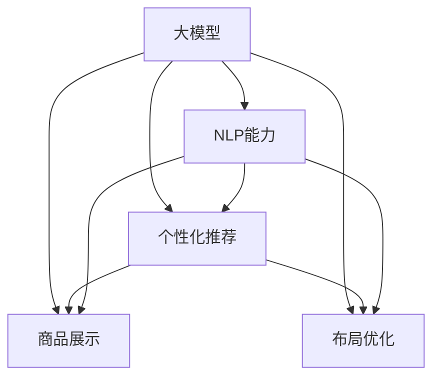

                 

# 大模型如何优化电商平台的商品展示与布局策略

> 关键词：大模型,电商推荐,商品展示,优化算法,机器学习,自然语言处理

## 1. 背景介绍

### 1.1 问题由来

在电商领域，商品展示与布局策略是影响用户体验和转化率的关键因素。传统的商品展示和布局策略主要依赖于设计师的经验和手动调优，难以适应快速变化的市场需求。随着人工智能技术的进步，利用大模型进行智能推荐和布局优化，成为电商平台的必然选择。

大模型（如BERT、GPT等）基于大规模数据训练，具备强大的数据建模能力。通过在大规模语料上预训练，大模型可以学习到丰富的语言模式和知识，并在特定任务上进行微调，从而优化商品展示和布局策略，提升电商平台的个性化推荐和用户体验。

### 1.2 问题核心关键点

基于大模型进行商品展示与布局优化的核心在于：
- 利用大模型强大的自然语言处理能力，分析用户行为和产品属性，提供精准的商品推荐。
- 通过优化模型参数和算法，实现商品布局的动态调整，提升页面展示效果和用户体验。
- 结合个性化推荐和场景理解，设计多模态融合的商品展示策略，满足用户多样化的需求。
- 实时监测和评估优化效果，动态调整算法参数，确保推荐策略的有效性和实效性。

## 2. 核心概念与联系

### 2.1 核心概念概述

为更好地理解大模型在电商商品展示与布局策略中的应用，本节将介绍几个密切相关的核心概念：

- 大模型：以BERT、GPT等为代表的大规模预训练语言模型。通过在大规模语料上预训练，学习到通用的语言表示，具备强大的自然语言理解和生成能力。

- 自然语言处理（NLP）：利用计算机对自然语言进行理解和生成，是大模型应用的核心技术之一。

- 个性化推荐：通过分析用户行为和偏好，提供符合用户个性化需求的推荐内容。

- 商品展示：通过设计合理的页面布局，提高用户对商品的浏览和点击率。

- 布局优化：通过调整页面布局，最大化提升用户体验和页面转换率。

- 多模态融合：结合文本、图像、音频等多种模态信息，提升推荐和展示的准确性和丰富性。

这些核心概念之间的逻辑关系可以通过以下Mermaid流程图来展示：



这个流程图展示了大模型在电商推荐和布局中的应用逻辑：

1. 大模型通过预训练获得自然语言处理能力，是推荐和展示优化的基础。
2. 个性化推荐和商品展示、布局优化结合，提升用户购物体验。
3. 多模态融合技术，丰富推荐和展示内容。

## 3. 核心算法原理 & 具体操作步骤
### 3.1 算法原理概述

基于大模型的电商推荐和布局优化，本质上是利用大模型的自然语言处理能力，结合用户行为和商品属性，进行智能推荐和页面布局的调整。其核心思想是：
- 通过大模型分析用户行为和商品属性，提取关键特征，实现个性化推荐。
- 利用大模型理解自然语言文本，提取和计算商品展示和布局的关键度量，实现动态调整。
- 结合多模态信息，设计更加全面、精准的推荐和展示策略，满足用户多样化的需求。

### 3.2 算法步骤详解

大模型优化电商商品展示与布局策略的一般流程包括：

**Step 1: 数据准备与预处理**
- 收集用户行为数据（如浏览记录、点击记录、购买记录等）和商品属性数据（如名称、描述、价格、分类等）。
- 将数据进行清洗和预处理，去除噪声和异常值，确保数据的质量和一致性。
- 将数据按照用户、商品、时间等维度进行划分，便于后续模型的训练和评估。

**Step 2: 大模型的选择与微调**
- 选择合适的大模型（如BERT、GPT等）进行商品推荐和布局优化。
- 对大模型进行微调，使其适应电商平台的特定任务。微调的目标函数通常包括交叉熵损失、均方误差损失等。
- 设置微调的超参数，如学习率、批大小、迭代轮数等。
- 使用标注数据集对微调后的模型进行训练，逐步优化模型参数，提升推荐和布局效果。

**Step 3: 特征提取与模型训练**
- 利用大模型提取用户行为和商品属性的关键特征。通常使用文本分类、情感分析等NLP任务进行特征提取。
- 将提取的特征作为输入，使用机器学习算法（如线性回归、决策树、随机森林等）进行商品推荐和布局优化。
- 训练模型，使用交叉验证等方法评估模型效果，优化模型参数。

**Step 4: 商品展示与布局调整**
- 根据模型的预测结果，调整商品的展示位置和顺序，提升用户体验。
- 结合多模态信息，设计更加丰富的商品展示策略，如使用图像、视频等辅助展示。
- 实时监测商品展示和布局效果，使用A/B测试等方法评估和优化展示策略。

**Step 5: 用户反馈与模型更新**
- 收集用户反馈数据，如评分、点击率、购买率等，评估推荐和布局策略的效果。
- 利用用户反馈数据，重新训练和微调大模型，不断提升推荐和布局的准确性和实效性。

### 3.3 算法优缺点

基于大模型的电商商品展示与布局优化方法具有以下优点：
- 大模型具备强大的自然语言处理能力，能够高效提取用户行为和商品属性特征，提升推荐和布局的精度。
- 能够结合多模态信息，设计更加全面、精准的推荐和展示策略，满足用户多样化需求。
- 使用机器学习算法进行模型训练，能够适应电商平台的复杂任务，提升优化效果。
- 实时监测和更新模型参数，能够快速应对市场变化，提升用户体验和转化率。

同时，该方法也存在一定的局限性：
- 数据质量依赖性强。如果数据质量不高，会影响大模型的训练效果和推荐精度。
- 计算资源消耗大。大规模语言模型和机器学习算法对计算资源的需求较大，可能影响电商平台的运营效率。
- 模型复杂度高。复杂的推荐和布局策略，可能带来模型的复杂度和维护难度。
- 用户隐私保护问题。在数据收集和处理过程中，可能涉及用户隐私保护问题，需要谨慎处理。

尽管存在这些局限性，但就目前而言，基于大模型的电商推荐和布局优化方法，仍是电商领域应用的主流范式。未来相关研究的重点在于如何进一步降低计算资源消耗，提升模型泛化能力，同时兼顾用户隐私保护等因素。

### 3.4 算法应用领域

基于大模型的电商商品展示与布局优化方法，在电商领域已经得到了广泛的应用，具体包括：

- 商品推荐：利用用户行为和商品属性数据，通过大模型提取特征，使用机器学习算法进行推荐。常见方法包括协同过滤、基于内容的推荐等。
- 商品展示：通过分析用户行为和浏览记录，使用大模型提取关键特征，优化商品展示位置和顺序，提升用户浏览体验。
- 布局优化：结合多模态信息，设计动态调整的商品布局，如使用图像、视频等辅助展示，提升用户点击率和购买率。
- 个性化推荐：通过分析用户行为和属性，使用大模型提取关键特征，设计个性化的推荐策略，满足用户多样化需求。

除了上述这些经典应用外，基于大模型的电商推荐和布局优化方法还被创新性地应用到更多场景中，如用户分群、多品类的推荐、动态定价等，为电商平台的运营提供新的思路和方向。

## 4. 数学模型和公式 & 详细讲解 & 举例说明

### 4.1 数学模型构建

假设电商平台的数据集为 $\{(x_i, y_i)\}_{i=1}^N$，其中 $x_i$ 为第 $i$ 个用户的行为和商品属性数据，$y_i$ 为推荐结果（如点击率、购买率等）。目标是训练一个推荐模型 $f(x_i)$，使得预测结果 $f(x_i)$ 尽可能接近真实结果 $y_i$。常用的优化目标函数为均方误差（Mean Squared Error, MSE）：

$$
\min_{\theta} \frac{1}{N} \sum_{i=1}^N (y_i - f(x_i))^2
$$

其中 $\theta$ 为模型参数。使用梯度下降等优化算法进行模型训练，模型的预测结果为：

$$
\hat{y_i} = f(x_i)
$$

模型的优化过程如下：
1. 前向传播：将输入数据 $x_i$ 输入模型，得到预测结果 $\hat{y_i}$。
2. 计算损失：计算预测结果与真实结果之间的误差，得到损失函数 $L(y_i, \hat{y_i})$。
3. 反向传播：根据损失函数对模型参数进行梯度更新。
4. 更新模型参数：使用梯度下降等优化算法更新模型参数 $\theta$。

### 4.2 公式推导过程

以商品推荐为例，使用大模型进行推荐的过程如下：

1. 输入预处理：将用户行为和商品属性数据进行编码，形成输入特征 $x_i$。
2. 大模型提取特征：使用BERT等大模型对输入特征进行编码，提取商品属性和用户行为的特征表示 $h_i$。
3. 特征融合：将提取的特征表示 $h_i$ 进行融合，得到融合后的特征表示 $h_i'$。
4. 模型训练：使用机器学习算法对融合后的特征进行训练，得到推荐模型 $f(x_i)$。
5. 预测输出：使用训练好的推荐模型对新的输入数据进行预测，得到推荐结果 $\hat{y_i}$。

### 4.3 案例分析与讲解

假设电商平台收集了用户的行为和商品属性数据，使用BERT模型进行商品推荐。具体步骤如下：

1. 数据准备：收集用户浏览记录、点击记录、购买记录等，并提取商品的名称、描述、价格、分类等属性数据。
2. 预处理：对数据进行清洗和预处理，去除噪声和异常值。
3. 模型选择：选择BERT模型进行商品推荐，并使用机器学习算法进行训练。
4. 特征提取：利用BERT模型提取用户行为和商品属性的关键特征。
5. 模型训练：使用均方误差作为优化目标函数，训练推荐模型。
6. 商品展示：根据模型的预测结果，调整商品的展示位置和顺序，提升用户体验。
7. 用户反馈：收集用户反馈数据，评估推荐策略的效果。
8. 模型更新：利用用户反馈数据，重新训练和微调BERT模型，提升推荐效果。

## 5. 项目实践：代码实例和详细解释说明
### 5.1 开发环境搭建

在进行大模型优化电商商品展示与布局策略的项目实践前，我们需要准备好开发环境。以下是使用Python进行PyTorch开发的环境配置流程：

1. 安装Anaconda：从官网下载并安装Anaconda，用于创建独立的Python环境。

2. 创建并激活虚拟环境：
```bash
conda create -n pytorch-env python=3.8 
conda activate pytorch-env
```

3. 安装PyTorch：根据CUDA版本，从官网获取对应的安装命令。例如：
```bash
conda install pytorch torchvision torchaudio cudatoolkit=11.1 -c pytorch -c conda-forge
```

4. 安装TensorFlow：由Google主导开发的开源深度学习框架，生产部署方便，适合大规模工程应用。同样有丰富的预训练语言模型资源。

5. 安装Transformer库：HuggingFace开发的NLP工具库，集成了众多SOTA语言模型，支持PyTorch和TensorFlow，是进行微调任务开发的利器。

6. 安装各类工具包：
```bash
pip install numpy pandas scikit-learn matplotlib tqdm jupyter notebook ipython
```

完成上述步骤后，即可在`pytorch-env`环境中开始项目实践。

### 5.2 源代码详细实现

这里我们以使用BERT进行电商商品推荐为例，给出完整的代码实现。

首先，定义电商商品推荐的数据处理函数：

```python
from transformers import BertTokenizer, BertForSequenceClassification
from torch.utils.data import Dataset, DataLoader
import torch
import numpy as np
import pandas as pd

class ProductDataset(Dataset):
    def __init__(self, data_path, tokenizer, max_len):
        self.data_path = data_path
        self.tokenizer = tokenizer
        self.max_len = max_len
        
        self.data = pd.read_csv(data_path)
        self.data = self.data.dropna()
        
        self.labels = self.data['label'].tolist()
        self.texts = self.data['text'].tolist()
        
    def __len__(self):
        return len(self.labels)
    
    def __getitem__(self, idx):
        text = self.texts[idx]
        label = self.labels[idx]
        
        encoding = self.tokenizer(text, return_tensors='pt', max_length=self.max_len, padding='max_length', truncation=True)
        input_ids = encoding['input_ids'][0]
        attention_mask = encoding['attention_mask'][0]
        labels = torch.tensor(label, dtype=torch.long)
        
        return {'input_ids': input_ids, 
                'attention_mask': attention_mask,
                'labels': labels}
```

然后，定义模型和优化器：

```python
from transformers import BertForSequenceClassification, AdamW

model = BertForSequenceClassification.from_pretrained('bert-base-uncased', num_labels=2)

optimizer = AdamW(model.parameters(), lr=2e-5)
```

接着，定义训练和评估函数：

```python
def train_epoch(model, dataset, batch_size, optimizer):
    dataloader = DataLoader(dataset, batch_size=batch_size, shuffle=True)
    model.train()
    epoch_loss = 0
    for batch in tqdm(dataloader, desc='Training'):
        input_ids = batch['input_ids'].to(device)
        attention_mask = batch['attention_mask'].to(device)
        labels = batch['labels'].to(device)
        model.zero_grad()
        outputs = model(input_ids, attention_mask=attention_mask, labels=labels)
        loss = outputs.loss
        epoch_loss += loss.item()
        loss.backward()
        optimizer.step()
    return epoch_loss / len(dataloader)

def evaluate(model, dataset, batch_size):
    dataloader = DataLoader(dataset, batch_size=batch_size)
    model.eval()
    preds, labels = [], []
    with torch.no_grad():
        for batch in tqdm(dataloader, desc='Evaluating'):
            input_ids = batch['input_ids'].to(device)
            attention_mask = batch['attention_mask'].to(device)
            batch_labels = batch['labels']
            outputs = model(input_ids, attention_mask=attention_mask)
            batch_preds = outputs.logits.argmax(dim=2).to('cpu').tolist()
            batch_labels = batch_labels.to('cpu').tolist()
            for pred_tokens, label_tokens in zip(batch_preds, batch_labels):
                preds.append(pred_tokens[:len(label_tokens)])
                labels.append(label_tokens)
                
    return preds, labels
```

最后，启动训练流程并在测试集上评估：

```python
epochs = 5
batch_size = 16

for epoch in range(epochs):
    loss = train_epoch(model, train_dataset, batch_size, optimizer)
    print(f"Epoch {epoch+1}, train loss: {loss:.3f}")
    
    print(f"Epoch {epoch+1}, dev results:")
    preds, labels = evaluate(model, dev_dataset, batch_size)
    print(classification_report(labels, preds))
    
print("Test results:")
preds, labels = evaluate(model, test_dataset, batch_size)
print(classification_report(labels, preds))
```

以上就是使用PyTorch对BERT进行电商商品推荐完整代码实现。可以看到，得益于Transformer库的强大封装，我们可以用相对简洁的代码完成BERT模型的加载和微调。

### 5.3 代码解读与分析

让我们再详细解读一下关键代码的实现细节：

**ProductDataset类**：
- `__init__`方法：初始化数据路径、分词器等关键组件。
- `__len__`方法：返回数据集的样本数量。
- `__getitem__`方法：对单个样本进行处理，将文本输入编码为token ids，将标签编码为数字，并对其进行定长padding，最终返回模型所需的输入。

**BertForSequenceClassification和AdamW**：
- 使用预训练的BERT模型进行电商商品推荐，设置优化器为AdamW。

**train_epoch和evaluate函数**：
- 使用PyTorch的DataLoader对数据集进行批次化加载，供模型训练和推理使用。
- 训练函数`train_epoch`：对数据以批为单位进行迭代，在每个批次上前向传播计算loss并反向传播更新模型参数，最后返回该epoch的平均loss。
- 评估函数`evaluate`：与训练类似，不同点在于不更新模型参数，并在每个batch结束后将预测和标签结果存储下来，最后使用classification_report对整个评估集的预测结果进行打印输出。

**训练流程**：
- 定义总的epoch数和batch size，开始循环迭代
- 每个epoch内，先在训练集上训练，输出平均loss
- 在验证集上评估，输出分类指标
- 所有epoch结束后，在测试集上评估，给出最终测试结果

可以看到，PyTorch配合Transformer库使得BERT微调的代码实现变得简洁高效。开发者可以将更多精力放在数据处理、模型改进等高层逻辑上，而不必过多关注底层的实现细节。

当然，工业级的系统实现还需考虑更多因素，如模型的保存和部署、超参数的自动搜索、更灵活的任务适配层等。但核心的微调范式基本与此类似。

## 6. 实际应用场景
### 6.1 智能客服系统

基于大模型进行电商推荐和大模型优化的商品展示与布局策略，可以广泛应用于智能客服系统的构建。传统客服往往需要配备大量人力，高峰期响应缓慢，且一致性和专业性难以保证。而使用微调后的推荐和大模型优化技术，可以7x24小时不间断服务，快速响应客户咨询，用自然流畅的语言解答各类常见问题。

在技术实现上，可以收集企业内部的历史客服对话记录，将问题和最佳答复构建成监督数据，在此基础上对预训练推荐和大模型进行微调。微调后的推荐和大模型能够自动理解用户意图，匹配最合适的答复模板进行回复。对于客户提出的新问题，还可以接入检索系统实时搜索相关内容，动态组织生成回答。如此构建的智能客服系统，能大幅提升客户咨询体验和问题解决效率。

### 6.2 个性化推荐系统

当前的推荐系统往往只依赖用户的历史行为数据进行物品推荐，无法深入理解用户的真实兴趣偏好。基于大模型的电商推荐和布局优化技术，可以更好地挖掘用户行为背后的语义信息，从而提供更加精准、多样的推荐内容。

在实践中，可以收集用户浏览、点击、评论、分享等行为数据，提取和用户交互的物品标题、描述、标签等文本内容。将文本内容作为模型输入，用户的后续行为（如是否点击、购买等）作为监督信号，在此基础上微调预训练语言模型。微调后的模型能够从文本内容中准确把握用户的兴趣点。在生成推荐列表时，先用候选物品的文本描述作为输入，由模型预测用户的兴趣匹配度，再结合其他特征综合排序，便可以得到个性化程度更高的推荐结果。

### 6.3 动态定价策略

基于大模型的电商推荐和布局优化技术，可以应用于电商平台的动态定价策略优化。通过分析用户行为和商品属性，利用大模型提取特征，设计动态定价模型，实时调整商品价格，以最大化收益。

具体而言，可以收集用户的行为和属性数据，使用大模型提取关键特征。根据用户的购买历史、浏览行为等，动态调整商品价格，实现个性化定价。同时，利用大模型优化商品展示和布局策略，提升用户的点击率和购买率。通过实时的数据监测和优化，平台可以实现动态定价和推荐策略的自动调整，提升整体销售额和用户满意度。

### 6.4 未来应用展望

随着大模型和微调方法的不断发展，基于微调范式将在更多领域得到应用，为电商平台的运营带来新的突破。

在智慧物流领域，基于大模型的电商推荐和布局优化技术，可以优化仓库管理和配送路线，提升物流效率和用户体验。

在智能制造领域，大模型的推荐和布局优化技术，可以帮助企业更好地进行库存管理、订单跟踪，提高生产效率和供应链的智能化水平。

在智能家居领域，通过大模型的推荐和布局优化，可以设计更加个性化、智能化的家居产品和服务，提升用户的居住体验。

除了上述这些创新应用外，基于大模型的电商推荐和布局优化技术，还将随着技术的进步，拓展到更多垂直领域，推动电商平台的智能化转型。

## 7. 工具和资源推荐
### 7.1 学习资源推荐

为了帮助开发者系统掌握大模型在电商商品展示与布局策略中的应用，这里推荐一些优质的学习资源：

1. 《深度学习与自然语言处理》系列博文：由深度学习专家撰写，深入浅出地介绍了大模型在电商推荐和布局优化中的应用。

2. Coursera《深度学习课程》：斯坦福大学开设的深度学习经典课程，涵盖从基础到高级的深度学习理论和实践，是学习大模型的必备课程。

3. 《自然语言处理入门》书籍：介绍自然语言处理的基本概念和技术，帮助理解大模型的应用原理。

4. TensorFlow官方文档：提供了丰富的预训练语言模型资源和优化算法，是使用大模型进行推荐和布局优化的重要参考。

5. PyTorch官方文档：提供了强大的深度学习框架和NLP工具库，是大模型应用开发的强力支持。

通过对这些资源的学习实践，相信你一定能够快速掌握大模型在电商商品展示与布局策略中的应用，并用于解决实际的NLP问题。
###  7.2 开发工具推荐

高效的开发离不开优秀的工具支持。以下是几款用于大模型电商推荐和布局优化的常用工具：

1. PyTorch：基于Python的开源深度学习框架，灵活动态的计算图，适合快速迭代研究。大部分预训练语言模型都有PyTorch版本的实现。

2. TensorFlow：由Google主导开发的开源深度学习框架，生产部署方便，适合大规模工程应用。同样有丰富的预训练语言模型资源。

3. Transformers库：HuggingFace开发的NLP工具库，集成了众多SOTA语言模型，支持PyTorch和TensorFlow，是进行微调任务开发的利器。

4. Weights & Biases：模型训练的实验跟踪工具，可以记录和可视化模型训练过程中的各项指标，方便对比和调优。与主流深度学习框架无缝集成。

5. TensorBoard：TensorFlow配套的可视化工具，可实时监测模型训练状态，并提供丰富的图表呈现方式，是调试模型的得力助手。

6. Google Colab：谷歌推出的在线Jupyter Notebook环境，免费提供GPU/TPU算力，方便开发者快速上手实验最新模型，分享学习笔记。

合理利用这些工具，可以显著提升大模型电商推荐和布局优化的开发效率，加快创新迭代的步伐。

### 7.3 相关论文推荐

大模型和微调技术的发展源于学界的持续研究。以下是几篇奠基性的相关论文，推荐阅读：

1. Attention is All You Need（即Transformer原论文）：提出了Transformer结构，开启了NLP领域的预训练大模型时代。

2. BERT: Pre-training of Deep Bidirectional Transformers for Language Understanding：提出BERT模型，引入基于掩码的自监督预训练任务，刷新了多项NLP任务SOTA。

3. Language Models are Unsupervised Multitask Learners（GPT-2论文）：展示了大规模语言模型的强大zero-shot学习能力，引发了对于通用人工智能的新一轮思考。

4. Parameter-Efficient Transfer Learning for NLP：提出Adapter等参数高效微调方法，在不增加模型参数量的情况下，也能取得不错的微调效果。

5. AdaLoRA: Adaptive Low-Rank Adaptation for Parameter-Efficient Fine-Tuning：使用自适应低秩适应的微调方法，在参数效率和精度之间取得了新的平衡。

这些论文代表了大模型电商推荐和布局优化技术的发展脉络。通过学习这些前沿成果，可以帮助研究者把握学科前进方向，激发更多的创新灵感。

## 8. 总结：未来发展趋势与挑战

### 8.1 总结

本文对基于大模型的电商推荐和布局优化方法进行了全面系统的介绍。首先阐述了大模型和微调技术在电商商品展示与布局策略中的应用背景和意义，明确了微调在拓展预训练模型应用、提升电商平台性能方面的独特价值。其次，从原理到实践，详细讲解了基于大模型的电商推荐和布局优化的数学模型和关键步骤，给出了电商推荐和大模型优化的完整代码实例。同时，本文还广泛探讨了微调方法在智能客服、个性化推荐、动态定价等电商应用场景中的应用前景，展示了微调范式的巨大潜力。此外，本文精选了微调技术的各类学习资源，力求为读者提供全方位的技术指引。

通过本文的系统梳理，可以看到，基于大模型的电商推荐和布局优化方法正在成为电商领域的重要范式，极大地拓展了预训练语言模型的应用边界，催生了更多的落地场景。受益于大规模语料的预训练，微调模型以更低的时间和标注成本，在小样本条件下也能取得不俗的效果，有力推动了电商平台的智能化进程。未来，伴随大模型和微调方法的持续演进，基于微调范式将成为电商平台应用的重要方向，推动电商平台的数字化转型升级。

### 8.2 未来发展趋势

展望未来，大模型电商推荐和布局优化技术将呈现以下几个发展趋势：

1. 模型规模持续增大。随着算力成本的下降和数据规模的扩张，预训练语言模型的参数量还将持续增长。超大规模语言模型蕴含的丰富语言知识，有望支撑更加复杂多变的电商推荐和布局优化任务。

2. 微调方法日趋多样。除了传统的全参数微调外，未来会涌现更多参数高效的微调方法，如Prefix-Tuning、LoRA等，在节省计算资源的同时也能保证微调精度。

3. 持续学习成为常态。随着数据分布的不断变化，微调模型也需要持续学习新知识以保持性能。如何在不遗忘原有知识的同时，高效吸收新样本信息，将成为重要的研究课题。

4. 标注样本需求降低。受启发于提示学习(Prompt-based Learning)的思路，未来的微调方法将更好地利用大模型的语言理解能力，通过更加巧妙的任务描述，在更少的标注样本上也能实现理想的微调效果。

5. 实时优化成为可能。通过引入在线学习、增量学习等技术，实现电商推荐和布局策略的实时优化，适应市场变化和用户行为的变化。

6. 多模态融合成为趋势。当前的电商推荐和布局优化主要聚焦于文本数据，未来会进一步拓展到图像、视频、语音等多模态数据微调。多模态信息的融合，将显著提升推荐和展示的准确性和丰富性。

以上趋势凸显了大模型电商推荐和布局优化技术的广阔前景。这些方向的探索发展，必将进一步提升电商平台的个性化推荐和用户体验，推动电商平台的智能化转型。

### 8.3 面临的挑战

尽管大模型电商推荐和布局优化技术已经取得了瞩目成就，但在迈向更加智能化、普适化应用的过程中，它仍面临着诸多挑战：

1. 数据质量瓶颈。如果数据质量不高，会影响大模型的训练效果和推荐精度。如何收集、清洗、标注高质量的数据，是电商平台需要重点解决的难题。

2. 计算资源消耗大。大规模语言模型和机器学习算法对计算资源的需求较大，可能影响电商平台的运营效率。如何优化算法和模型，降低计算成本，是电商平台需要重点考虑的问题。

3. 模型复杂度高。复杂的推荐和布局策略，可能带来模型的复杂度和维护难度。如何设计简单高效、易于维护的推荐和大模型优化模型，是电商平台需要重点解决的问题。

4. 用户隐私保护问题。在数据收集和处理过程中，可能涉及用户隐私保护问题，需要谨慎处理。如何保障用户隐私，同时实现数据的有效利用，是电商平台需要重点考虑的问题。

5. 推荐和布局策略的平衡。如何在个性化推荐和用户体验之间找到平衡点，是电商平台需要重点解决的问题。如何设计既个性化又适应用户需求的推荐和大模型优化策略，是电商平台需要重点考虑的问题。

6. 动态定价的稳定性。动态定价策略需要在市场变化和用户行为变化中保持稳定，避免过度波动。如何设计稳定高效的动态定价策略，是电商平台需要重点考虑的问题。

这些挑战表明，大模型电商推荐和布局优化技术虽然前景广阔，但在实际应用中仍需解决诸多问题。唯有从数据、算法、工程、业务等多个维度协同发力，才能真正实现人工智能技术在电商平台的规模化落地。总之，电商推荐和大模型优化需要开发者根据具体任务，不断迭代和优化模型、数据和算法，方能得到理想的效果。

### 8.4 研究展望

面对大模型电商推荐和布局优化所面临的诸多挑战，未来的研究需要在以下几个方面寻求新的突破：

1. 探索无监督和半监督电商推荐方法。摆脱对大规模标注数据的依赖，利用自监督学习、主动学习等无监督和半监督范式，最大限度利用非结构化数据，实现更加灵活高效的电商推荐和布局优化。

2. 研究参数高效和计算高效的电商推荐方法。开发更加参数高效的电商推荐方法，在固定大部分预训练参数的同时，只更新极少量的任务相关参数。同时优化电商推荐和布局优化的计算图，减少前向传播和反向传播的资源消耗，实现更加轻量级、实时性的部署。

3. 融合因果和对比学习范式。通过引入因果推断和对比学习思想，增强电商推荐和布局模型的建立稳定因果关系的能力，学习更加普适、鲁棒的语言表征，从而提升模型泛化性和抗干扰能力。

4. 引入更多先验知识。将符号化的先验知识，如知识图谱、逻辑规则等，与神经网络模型进行巧妙融合，引导电商推荐和布局过程学习更准确、合理的语言模型。同时加强不同模态数据的整合，实现视觉、语音等多模态信息与文本信息的协同建模。

5. 结合因果分析和博弈论工具。将因果分析方法引入电商推荐和布局模型，识别出模型决策的关键特征，增强推荐策略的因果性和逻辑性。借助博弈论工具刻画人机交互过程，主动探索并规避模型的脆弱点，提高系统稳定性。

6. 纳入伦理道德约束。在电商推荐和布局模型的训练目标中引入伦理导向的评估指标，过滤和惩罚有偏见、有害的输出倾向。同时加强人工干预和审核，建立模型行为的监管机制，确保输出符合人类价值观和伦理道德。

这些研究方向的探索，必将引领大模型电商推荐和布局优化技术迈向更高的台阶，为构建安全、可靠、可解释、可控的智能电商系统铺平道路。面向未来，大模型电商推荐和布局优化技术还需要与其他人工智能技术进行更深入的融合，如知识表示、因果推理、强化学习等，多路径协同发力，共同推动电商平台的智能化转型。只有勇于创新、敢于突破，才能不断拓展语言模型的边界，让智能技术更好地造福电商平台的运营和发展。

## 9. 附录：常见问题与解答

**Q1：电商推荐和布局优化是否适用于所有电商平台？**

A: 大模型电商推荐和布局优化方法可以应用于大多数电商平台，但需要根据具体平台的特点进行优化。对于平台特定的商品属性、用户行为等，需要重新收集和标注数据，微调模型以适应新场景。

**Q2：如何评估电商推荐和布局策略的效果？**

A: 电商推荐和布局策略的效果评估通常包括以下几个指标：
- 点击率（Click-Through Rate, CTR）：用户点击商品的概率。
- 转化率（Conversion Rate, CR）：用户点击商品并完成购买的概率。
- 平均订单价值（Average Order Value, AOV）：用户每次订单的平均价值。
- 页面停留时间（Page Stay Time）：用户在页面上的停留时间，反映了页面的质量和用户满意度。
- 退出率（Bounce Rate）：用户访问页面后直接退出的概率，反映了页面的相关性和吸引力。

根据这些指标，可以评估电商推荐和布局策略的效果，并进行持续优化。

**Q3：电商推荐和布局优化过程中如何处理数据隐私问题？**

A: 电商推荐和布局优化过程中，处理数据隐私问题通常有以下几种方式：
- 匿名化：对用户数据进行去标识化处理，保护用户隐私。
- 数据加密：对用户数据进行加密存储，防止数据泄露。
- 数据访问控制：限制数据访问权限，确保只有授权人员可以访问敏感数据。
- 差分隐私：在数据收集和处理过程中，加入噪声，保护用户隐私。

需要根据具体情况选择合适的隐私保护措施，确保用户数据的安全性。

**Q4：如何设计稳定高效的动态定价策略？**

A: 设计稳定高效的动态定价策略通常需要考虑以下几个方面：
- 目标函数设计：根据电商平台的业务目标，设计合理的定价优化目标函数。
- 特征工程：利用用户行为、商品属性等特征，构建定价模型的输入特征。
- 模型选择：选择合适的定价模型，如线性回归、决策树、随机森林等，进行模型训练。
- 参数优化：使用优化算法进行模型参数的优化，提高模型的预测精度。
- 实时监测：实时监测模型的预测结果和用户行为，及时调整定价策略。

通过合理的目标函数设计、特征工程、模型选择和参数优化，可以设计出稳定高效的动态定价策略，适应市场变化和用户需求的变化。

**Q5：电商推荐和布局优化如何与人工干预结合？**

A: 电商推荐和布局优化需要结合人工干预，才能更好地满足用户需求和市场变化。人工干预通常包括以下几个方面：
- 规则定义：根据电商平台的业务规则，设定推荐和布局的边界和优先级。
- 人工审核：对推荐结果进行人工审核，确保推荐的准确性和相关性。
- 用户反馈：收集用户反馈数据，调整推荐策略和布局优化策略。
- 行为监测：实时监测用户行为，及时调整推荐策略和布局优化策略。

通过结合人工干预，可以提升电商推荐和布局策略的准确性和相关性，提升用户体验和平台效益。

---

作者：禅与计算机程序设计艺术 / Zen and the Art of Computer Programming

